[TOC]


# 1 - 项目总览

## 一、项目介绍 - 鱼图图

基于 Vue 3 + Spring Boot + COS + WebSocket 的 **企业级智能协同云图库平台**。

平台的核心功能可分为 4 大类：

1）所有用户都可以在平台公开上传和检索图片素材，快速找到需要的图片。可用作表情包网站、设计素材网站、壁纸网站等：


2）管理员可以上传、审核和管理图片，并对系统内的图片进行分析：p87QUult0bZDR05AO5soQVixQ5nCQ+HA+P5tLSHK/hI=

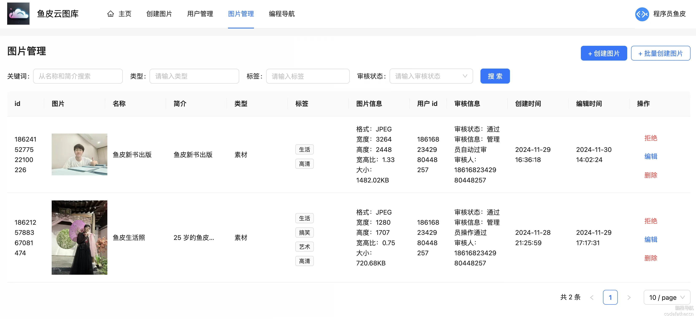

3）对于个人用户，可将图片上传至私有空间进行批量管理、检索、编辑和分析，用作个人网盘、个人相册、作品集等：

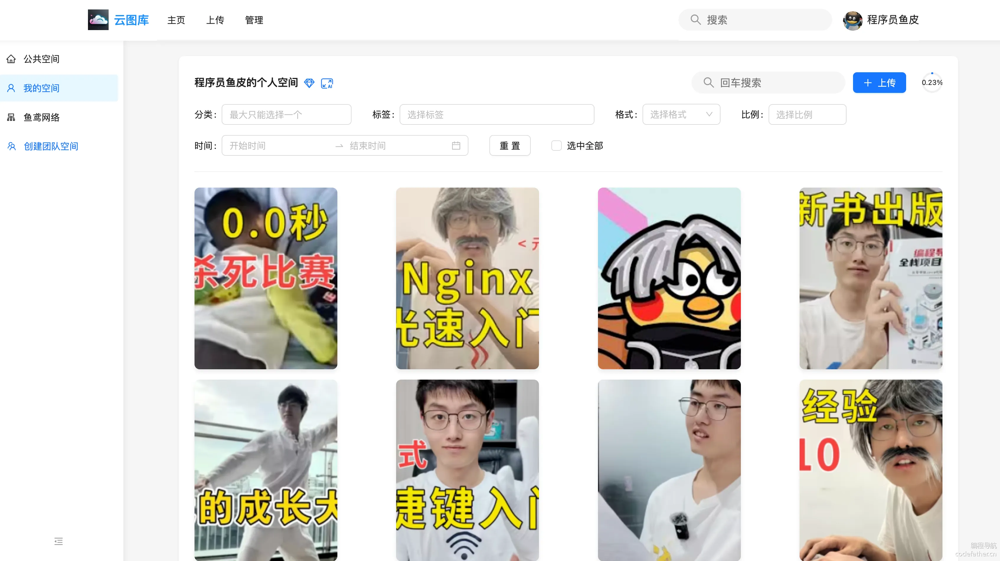

4）对于企业，可开通团队空间并邀请成员，共享图片并实时协同编辑图片，提高团队协作效率。可用于提供商业服务，如企业活动相册、企业内部素材库等：

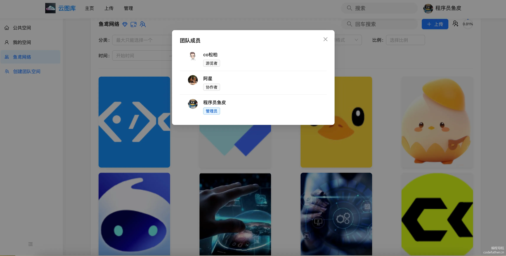

该项目功能丰富，涉及文件存管、内容检索、权限控制、实时协同等企业主流业务场景，并运用多种编程思想、架构设计方法和优化策略来保证项目的高速迭代和稳定运行。

有业务、有技术，从 0 到 1 的真实企业级（商业级）项目设计开发，绝对让你收获满满！

### 项目三大阶段

为了帮大家循序渐进地学习，鱼皮将项目设计为三个阶段，可以根据自己的时间和水平按需学习。

1）第一阶段，开发公共的图库平台。实战 Vue 3 + Spring Boot 图片素材网站的快速开发，学习文件存管业务的开发和优化技巧。

成果：可用作表情包网站、设计素材网站、壁纸网站等


2）第二阶段，对项目 C 端功能进行大量扩展。用户可开通私有空间，并对空间图片进行多维检索、扫码分享、批量管理、快速编辑、用量分析。该阶段涉及大量主流业务功能开发，能学到很多业务知识和开发经验。

成果：可用作个人网盘、个人相册、作品集等


3）第三阶段，对项目 B 端功能进行大量扩展。企业可开通团队空间，邀请和管理空间成员，团队内共享图片并实时协同编辑图片。该阶段涉及大量商业项目的应用场景，能学到很多架构设计和项目优化的技巧。

成果：可用于提供商业服务，如企业活动相册、企业内部素材库等

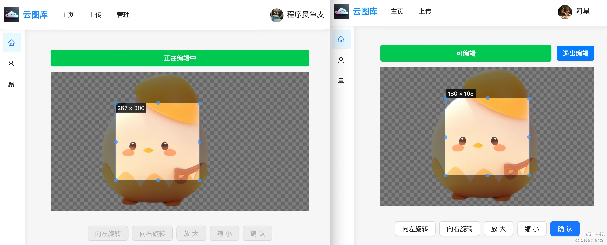

## 二、项目优势

### 项目收获

本项目选题新颖、功能丰富、业务真实、应用广泛。区别于增删改查的 “烂大街” 项目，鱼皮会带你实战大量新技术和商业应用场景，掌握层层递进的系统设计、项目扩展和优化方案，给你的简历大幅增加竞争力。

鱼皮给大家讲的都是 **通用的项目开发方法和架构设计套路**，从这个项目中你可以学到：

- 如何拆解复杂业务，从 0 开始设计实现企业级系统？
- 如何巧用 RBAC 权限模型和框架实现复杂权限控制？
- 如何结合 Redis + Caffeine 构建高性能多级缓存？
- 如何实现文件的高效存储，并通过十几种策略进行优化？
- 如何使用高级数据结构 Disruptor 无锁队列提升并发性能？
- 如何使用 ShardingSphere 实现动态扩容的分库分表？
- 如何使用 WebSocket 多端通信，实现企业级实时协作功能？
- 如何接入 AI 绘图大模型，实现更多高级图片处理能力？
- 如何使用 DDD 架构实现大型企业级项目？
- 如何快速部署上线项目？

此外，还能学会很多作图、思考问题、对比方案的方法，提升排查问题、自主解决 Bug 的能力。鱼皮还给大家提供了大量的项目扩展点，有能力的同学可以进一步拉开和别人的区分度，无限进步！

### 鱼皮系列项目优势

鱼皮原创项目系列以 **实战** 为主，用 **全程直播** 的方式，**从 0 到 1 ** 带大家学习技术知识，并立即实践运用到项目中，做到学以致用。

此外，还提供如下服务：

- 详细的文字教程或直播笔记
- 完整的项目源码
- 1 对 1 答疑解惑
- 专属项目交流群
- ⭐️ 现成的简历写法（直接写满简历）
- ⭐️ 项目的扩展思路（拉开和其他人的差距）
- ⭐️ 项目相关面试题、题解和真实面经（提前准备，面试不懵逼）
- ⭐️ 前端 + Java 后端万用项目模板（快速创建项目）

比起看网上的教程学习，鱼皮项目系列的优势：从学知识 => 实践项目 => 复习笔记 => 项目答疑 => 简历写法 => 面试题解的一条龙服务

从需求分析、技术选型、项目设计、项目初始化、Demo 编写、前后端开发实现、项目优化、部署上线等，每个环节我都 **从理论到实践** 给大家讲的明明白白、每个细节都不放过！

| 对比维度 | 跟学鱼皮项目                                                 | 自学网上免费项目qHT6Kxg12X1vklSWA3QVO0Z9aqth3Yj5Z1UQTagntCA= | ⭐️ 鱼皮项目优势               |
| -------- | ------------------------------------------------------------ | ------------------------------------------------------------ | ---------------------------- |
| 项目选题 | ✅ 选题新颖，刻意避开网上热门项目                             | 传统项目场景（博客、商城、管理系统）XJ858sBsdVoQsBlQbSlEZH9bgQFu4XZchClXOymxgUA= | 增加区分度，提高简历通过率   |
| 学习人数 | ✅ 少，不容易撞车                                             | 百万以上，烂大街XJ858sBsdVoQsBlQbSlEZH9bgQFu4XZchClXOymxgUA= | 增加区分度，提高简历通过率   |
| 教学方式 | ✅ 全程直播，带你敲每一行代码、带你踩坑和解决 Bug，不漏过每一个细节 | 录制课程，视频虽然看起来简短、一帆风顺，但你遇到错误无从下手sqWmWUk8kFL4uPey9+8ro5dv7g8fCeOwW9uL7T8/Q4k= | 降低学习门槛，减少学习时长   |
| 直播笔记 | ✅ 详细的官方笔记 + 精选学员优质笔记                          | 有笔记，但未经筛选6oQFIoMC2vFqWS6BDNDfWm34cANQaqyg4rGukImfAHk= | 学到更多知识细节             |
| 视频内容 | ✅ 项目教程 + 经验分享                                        | 项目教程qHT6Kxg12X1vklSWA3QVO0Z9aqth3Yj5Z1UQTagntCA=         | 学到更多编程经验             |
| 项目源码 | ✅ 完整源码仓库 + 每章的提交记录 + 定期更新                   | 只有代码包、不更新sqWmWUk8kFL4uPey9+8ro5dv7g8fCeOwW9uL7T8/Q4k= | 节省时间，避免踩坑           |
| 项目答疑 | ✅ 各项目交流群 + 答疑解惑 + 常见问题整理                     | 无免费的答疑服务，遇到问题自行解决Kvj0N9UsvjnA2JCtBYVVlZvRih721R4WfPhhdfsvDfk= | 节省时间                     |
| 简历写法 | ✅ 现成的简历写法                                             | 无XJ858sBsdVoQsBlQbSlEZH9bgQFu4XZchClXOymxgUA=               | 节省时间、提高简历通过率     |
| 项目扩展 | ✅ 给出扩展思路 + 学员作品共享                                | 无cT00UyE1JKn/y8Q147TQRzbDavEs+V72bbBFCS1wu6g=               | 开拓思路、拉开和其他人的差距 |
| 项目面试 | ✅ 项目相关面试题、题解和真实面经                             | 无cT00UyE1JKn/y8Q147TQRzbDavEs+V72bbBFCS1wu6g=               | 提前准备，面试不懵逼         |

编程导航已有 **10 多套项目教程！**每个项目的学习重点不同，几乎全都是前端 + 后端的 **全栈项目** 。

详细请见：[https://codefather.cn/course](https://www.codefather.cn/course)（在该页面右侧有教程推荐和学习建议）Kvj0N9UsvjnA2JCtBYVVlZvRih721R4WfPhhdfsvDfk=

往期项目介绍视频：[https://bilibili.com/video/BV1YvmbYbEgS](https://www.bilibili.com/video/BV1YvmbYbEgS/)

## 三、核心业务流程

### 第一阶段 - 公共图库平台

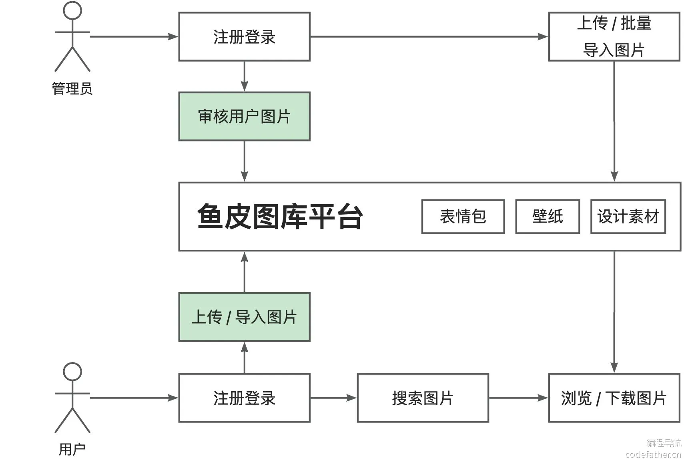

### 第二阶段 - 用户私有图库

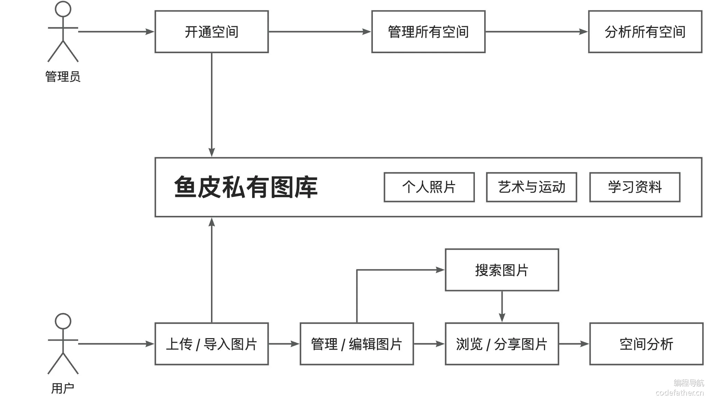

### 第三阶段 - 团队共享图库

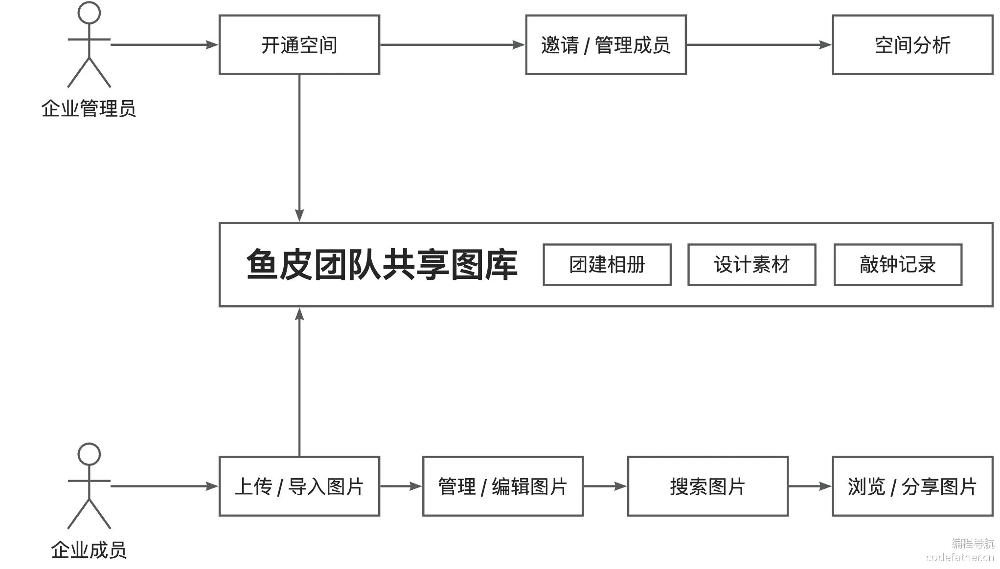

## 四、项目功能梳理

### 第一阶段 - 公共图库平台

#### 用户模块

- 用户登录
- 用户注册
- 用户注销
- 用户权限控制
- 【管理员】管理用户

#### 图片模块

- 【管理员】上传创建图片
- 【管理员】图片信息编辑（标签 / 分类等）
- 【管理员】管理图片
- 查看和搜索图片列表
- 查看图片详情（进入图片详情页）
- 图片下载
- 用户上传创建图片
- 【管理员】审核图片
- 导入图片
- - 通过 URL 导入图片
  - 【管理员】批量抓取和创建图片
- 【优化】图片查询优化 - 分布式缓存、本地缓存、多级缓存
- 【优化】图片上传优化 - 压缩、秒传、分片上传、断点续传
- 【优化】图片加载优化 - 懒加载、缩略图、CDN 加速、浏览器缓存
- 【优化】图片存储优化 - 降频存储（冷热数据分离）、清理策略

### 第二阶段 - 用户私有图库

#### 空间模块

- 【管理员】管理空间
- 用户开通私有空间
- 私有空间权限控制
- 空间级别和限额控制
- 空间图库分析
- - 用户空间图库分析
  - 【管理员】全空间分析

#### 图片模块

- 图片搜索
- - 基础属性搜索
  - 以图搜图
  - 颜色搜索
- 图片分享
- - 链接分享
  - 扫码分享
- 图片批量管理
- - 批量修改信息
  - 批量重命名
- 图片编辑
- - 基础图片编辑
  - AI 图片编辑

### 第三阶段 - 团队共享图库

#### 空间模块

- 创建团队共享空间
- 空间成员管理
- - 成员邀请
  - 设置权限
- 空间成员权限控制

#### 图片模块

- 图片协同编辑

## 五、技术选型

### 后端

- Java Spring Boot 框架
- MySQL 数据库 + MyBatis-Plus 框架 + MyBatis X
- Redis 分布式缓存 + Caffeine 本地缓存
- Jsoup 数据抓取
- ⭐️ COS 对象存储
- ⭐️ ShardingSphere 分库分表
- ⭐️ Sa-Token 权限控制
- ⭐️ DDD 领域驱动设计
- ⭐️ WebSocket 双向通信
- ⭐️ Disruptor 高性能无锁队列
- ⭐️ JUC 并发和异步编程
- ⭐️ AI 绘图大模型接入
- ⭐️ 多种设计模式的运用
- ⭐️ 多角度项目优化：性能、成本、安全性等

### 前端

- Vue 3 框架
- Vite 打包工具
- Ant Design Vue 组件库
- Axios 请求库
- Pinia 全局状态管理
- 其他组件：数据可视化、图片编辑等
- ⭐️ 前端工程化：ESLint + Prettier + TypeScript
- ⭐️ OpenAPI 前端代码生成

## 六、架构设计

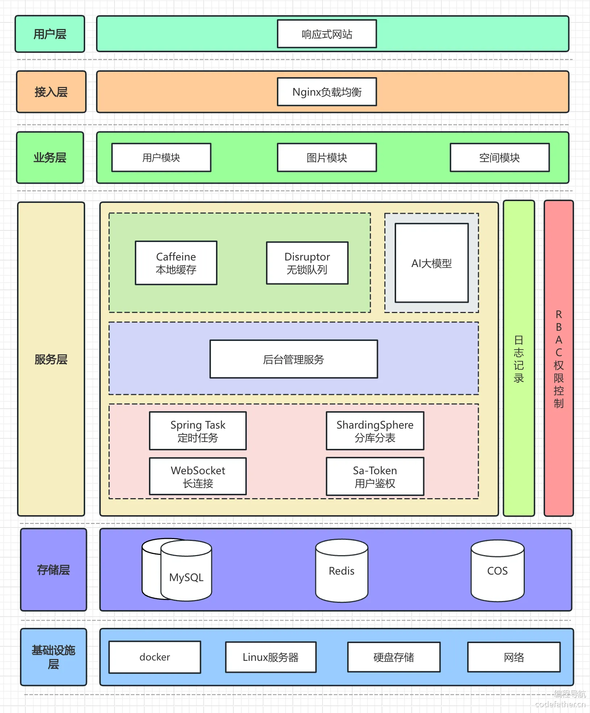

## 新建代码仓库

搭建仓库，点 star 的都是精神股东

代码仓库：https://github.com/liyupi/yu-picture

## 教程计划

### 第一阶段 - 公共图库平台

第 1 期：项目介绍。包括介绍项目背景、项目优势、核心业务流程、项目功能、技术选型、架构设计、教程计划等。

第 2 期：项目初始化

- 后端项目初始化
- 前端项目初始化

第 3 期：用户模块开发（前后端）

- 用户登录
- 用户注册
- 用户注销
- 用户权限控制
- 用户管理

第 4 期：图片模块开发（前后端）

- 【管理员】图片上传和创建
- 【管理员】管理图片
- 【管理员】图片信息编辑（标签 / 分类等）
- 查看和搜索图片列表
- 查看图片详情（进入图片详情页）
- 图片下载

第 5 期：用户上传图片模块（前后端）

- 用户上传创建图片
- 【管理员】审核图片
- 导入图片
- - 通过 URL 导入图片
  - 【管理员】批量抓取和创建图片

第 6 期：图片优化

- 图片查询优化 - 分布式缓存、本地缓存、多级缓存
- 图片上传优化 - 压缩、秒传、分片上传、断点续传
- 图片加载优化 - 懒加载、缩略图、CDN 加速、浏览器缓存
- 图片存储优化 - 降频存储（冷热数据分离）、清理策略

### 第二阶段 - 用户私有图库

第 7 期：空间模块开发

- 【管理员】管理空间
- 用户开通私有空间
- 私有空间权限控制
- 空间级别和限额控制

第 8 期：图片功能扩展

- 图片搜索
- - 基础属性搜索
  - 以图搜图
  - 颜色搜索
- 图片分享
- - 链接分享
  - 扫码分享
- 图片批量管理
- - 批量修改信息
  - 批量重命名

第 9 期：图片编辑能力

- 图片编辑
- - 基础图片编辑
  - AI 图片编辑

第 10 期：空间图片分析

- 空间图库分析
- - 用户空间图库分析
  - 【管理员】全空间分析

### 第三阶段 - 团队共享图库

第 11 期：团队共享空间

- 创建团队共享空间
- 空间成员管理
- - 成员邀请
  - 设置权限
- 空间成员权限控制

第 12 期：图片协同编辑

第 13 期：DDD 项目改造

第 14 期：项目部署上线


# 2 - 项目初始化

## 本节重点

从 0 开始搭建后端和前端项目，会后续正式开发项目打好基础。

包括：

- 后端项目初始化
- 前端项目初始化

本节教程的后端和前端互不影响，可以按需独立学习，建议优先学习自己求职方向的内容。

## 一、后端项目初始化

### 环境准备

1）安装的 JDK 版本必须是 8、11 或 17，**不能超过 17！**

推荐使用 11 版本，因为后续可能要用到的缓存库 Caffeine 要求使用 11 版本。

可参考视频安装 JDK：https://www.bilibili.com/video/BV14SUNYREv8

2）MySQL 数据库最好安装 8.x 版本，或者 5.7 版本。

### 新建项目

在 IDEA 中新建项目，选择 Spring Initializr 模板，考虑到稳定性，此处选择创建 Java 8 版本的项目。

注意需要替换 Server URL 为 https://start.aliyun.com/，因为官方的 Server URL 不支持选择 Java 8。

配置如图：

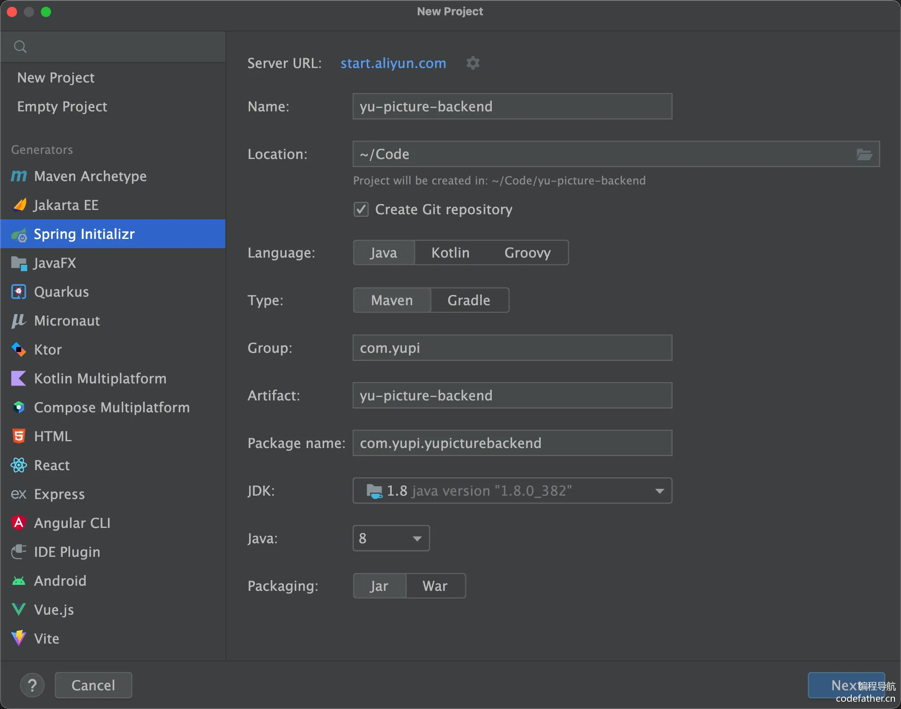

选择 Spring Boot 2.7.6 版本，可以根据自己的需要添加一些依赖，比如 Spring Web、MyBatis、MySQL、Lombok：

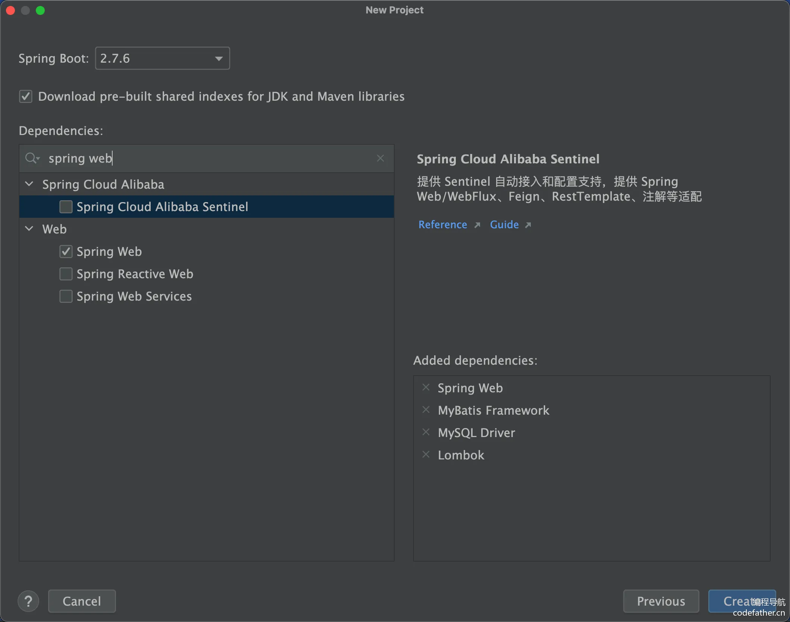

> 当然，后续通过修改 Maven 配置添加依赖也是可以的。

点击创建，就得到了一个 Spring Boot 项目，需要等待 Maven 为我们安装依赖。

安装完依赖后，先尝试启动一下项目，结果会报错：

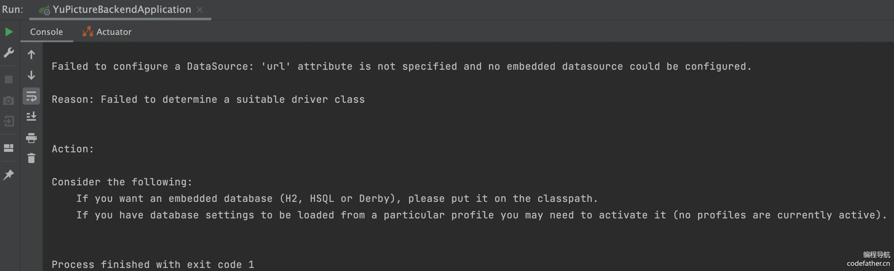

因为我们在 Maven 中引入了 MySQL 依赖，但是项目配置文件中并没有填写 MySQL 的配置。

修改资源目录下的配置文件为 `application.yml`，指定项目启动的端口号和访问地址前缀、项目名称、数据库配置等。代码如下：

```yaml
▼yaml复制代码server:
  port: 8123
  servlet:
    context-path: /api
spring:
  application:
    name: yu-picture-backend
  # 数据库配置
  datasource:
    driver-class-name: com.mysql.cj.jdbc.Driver
    url: jdbc:mysql://localhost:3306/yu_picture
    username: root
    password: 123456
```

这次项目就可以正常启动了：

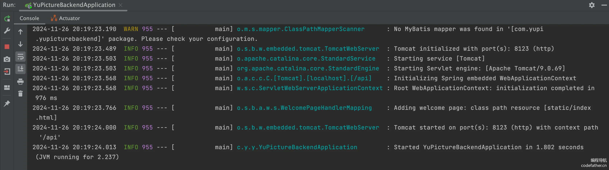

### 整合依赖

接下来我们要整合一些开发项目常用的依赖。

#### 1、MyBatis Plus 数据库操作

MyBatis Plus 是 MyBatis 的增强工具，旨在简化开发流程。它提供了开箱即用的 CRUD 方法、动态查询构造器、分页插件和代码生成器等功能，大幅减少重复代码，同时保持与 MyBatis 原生功能的兼容性。例如，通过调用 `baseMapper.selectById(id)`，可以直接查询数据库中的记录，而无需手动编写 SQL。

参考官方文档引入：https://baomidou.com/getting-started/#spring-boot2

在 Maven 的 pom.xml 中添加依赖：

```xml
<dependency>
    <groupId>com.baomidou</groupId>
    <artifactId>mybatis-plus-boot-starter</artifactId>
    <version>3.5.9</version>
</dependency>
```

**注意，添加该依赖后，记得移除 MyBatis 相关的依赖！否则很容易导致版本冲突！！！**

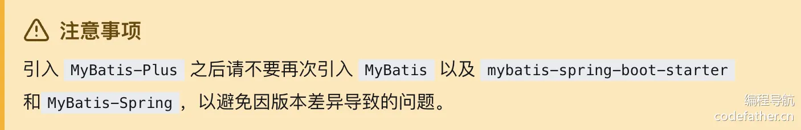

在项目中新建 mapper 包，后续用于存放操作数据库的 Mapper 类，然后在项目启动类中添加扫描 Mapper 的 `@MapperScan` 注解：

```java
@SpringBootApplication
@MapperScan("com.yupi.yupicturebackend.mapper")
public class YuPictureBackendApplication {

    public static void main(String[] args) {
        SpringApplication.run(YuPictureBackendApplication.class, args);
    }

}
```

在 application.yml 中追加配置，开启日志和逻辑删除功能：

```yaml
mybatis-plus:
  configuration:
    map-underscore-to-camel-case: false
    # 仅在开发环境开启日志
    log-impl: org.apache.ibatis.logging.stdout.StdOutImpl
  global-config:
    db-config:
      logic-delete-field: isDelete # 全局逻辑删除的实体字段名
      logic-delete-value: 1 # 逻辑已删除值（默认为 1）
      logic-not-delete-value: 0 # 逻辑未删除值（默认为 0）
```

#### 2、Hutool 工具库

Hutool 是主流的 Java 工具类库，集合了丰富的工具类，涵盖字符串处理、日期操作、文件处理、加解密、反射、正则匹配等常见功能。它的轻量化和无侵入性让开发者能够专注于业务逻辑而不必编写重复的工具代码。例如，`DateUtil.formatDate(new Date())` 可以快速将当前日期格式化为字符串。

参考官方文档引入：[https://doc.hutool.cn/pages/index/#%F0%9F%8D%8Amaven](https://doc.hutool.cn/pages/index/#🍊maven)

在 Maven 的 pom.xml 中添加依赖：

```xml
<dependency>
    <groupId>cn.hutool</groupId>
    <artifactId>hutool-all</artifactId>
    <version>5.8.26</version>
</dependency>
```

#### 3、Knife4j 接口文档

Knife4j 是基于 Swagger 接口文档的增强工具，提供了更加友好的 API 文档界面和功能扩展，例如动态参数调试、分组文档等。它适合用于 Spring Boot 项目中，能够通过简单的配置自动生成接口文档，让开发者和前端快速了解和调试接口，提高写作效率。

参考官方文档引入：https://doc.xiaominfo.com/docs/quick-start#spring-boot-2bgMhj83Bt96lFcj29lBZCF0o0+YPCGWOWUw0OPyFB/Q=

由于使用的是 Spring Boot 2.x，注意要选择 OpenAPI 2 的版本。

在 Maven 的 pom.xml 中添加依赖：

```xml
<dependency>
    <groupId>com.github.xiaoymin</groupId>
    <artifactId>knife4j-openapi2-spring-boot-starter</artifactId>
    <version>4.4.0</version>
</dependency>
```

新建 controller 包用于存放 API 接口，将模板创建的 demos.web 包下的代码都移动到其中，仅用于测试：

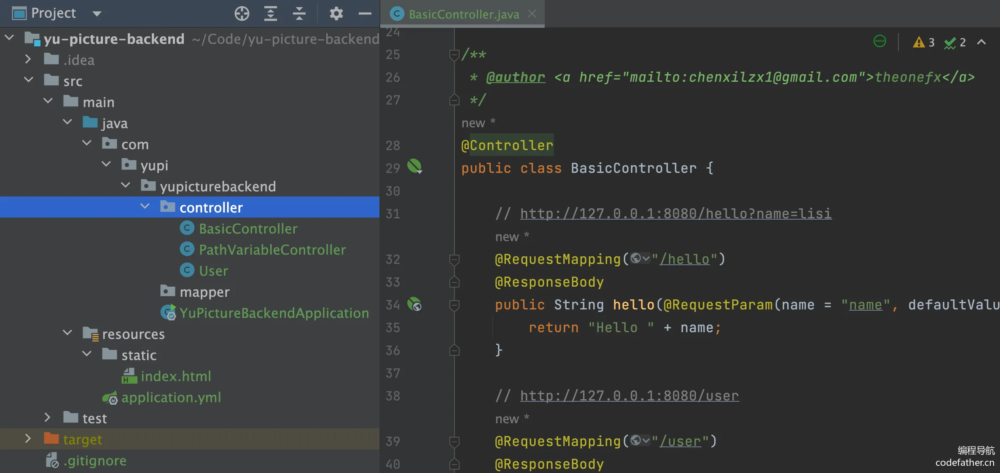

在 application.yml 中追加接口文档配置，扫描 Controller 包：

```yaml
# 接口文档配置
knife4j:
  enable: true
  openapi:
    title: "接口文档"
    version: 1.0
    group:
      default:
        api-rule: package
        api-rule-resources:
          - com.yupi.yupicturebackend.controller
```

重启项目，访问 http://localhost:8123/api/doc.html 能够看到接口文档，可以测试调用：

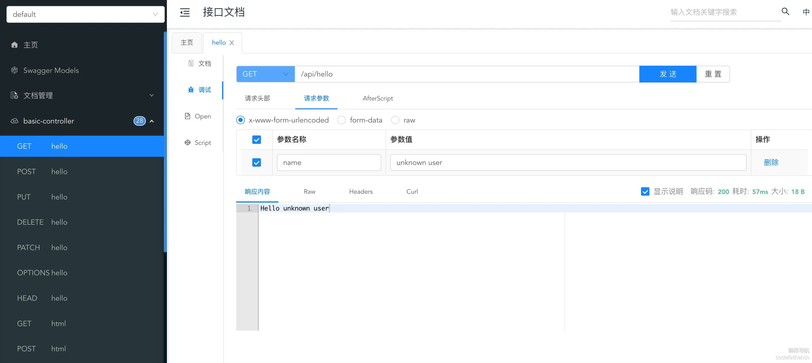

#### 4、其他依赖

可以按需引入其他依赖，比如 AOP 切面编程：

```xml
<dependency>
    <groupId>org.springframework.boot</groupId>
    <artifactId>spring-boot-starter-aop</artifactId>
</dependency>
```

给启动类添加注解（可选）：

```java
@EnableAspectJAutoProxy(exposeProxy = true)
```

解释一下 `exposeProxy = true` 的作用：通过 Spring AOP 提供对当前代理对象的访问，使得可以在业务逻辑中访问到当前的代理对象。你可以在方法执行时通过 `AopContext.currentProxy()` 获取当前的代理对象。qHT6Kxg12X1vklSWA3QVO0Z9aqth3Yj5Z1UQTagntCA=

还有更多的依赖，后续我们随用随装。

### 通用基础代码

通用基础代码是指：无论在任何后端项目中，都可以复用的代码。这种代码一般 “一辈子只用写一次”，了解作用之后复制粘贴即可，无需记忆。

目录结构如下：

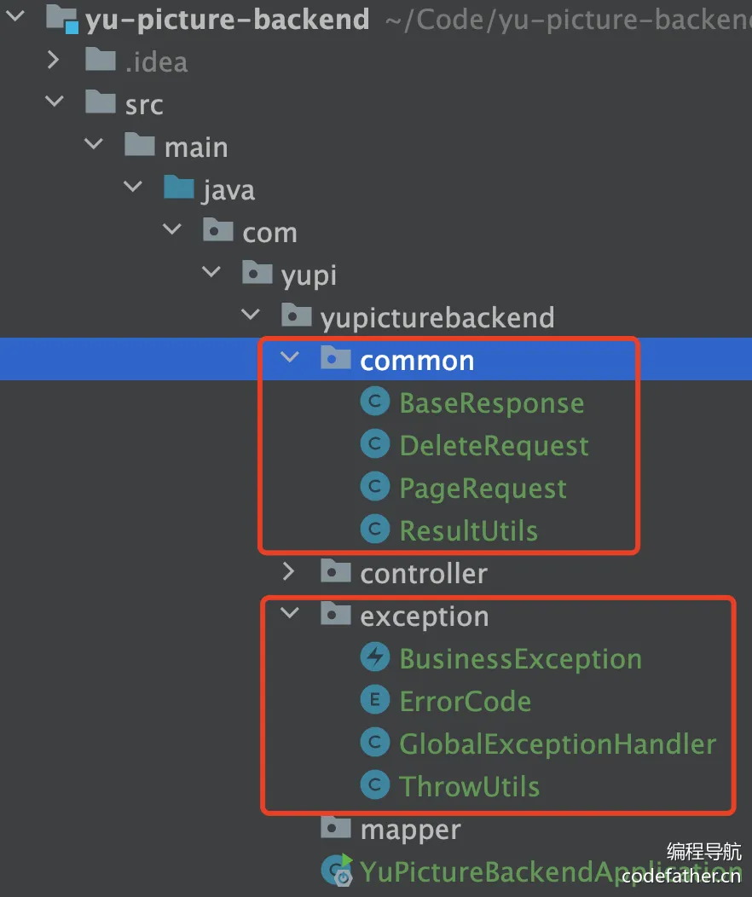

#### 1、自定义异常

自定义错误码，对错误进行收敛，便于前端统一处理。

💡 这里有 2 个小技巧：

1. 自定义错误码时，建议跟主流的错误码（比如 HTTP 错误码）的含义保持一致，比如 “未登录” 定义为 40100，和 HTTP 401 错误（用户需要进行身份认证）保持一致，会更容易理解。
2. 错误码不要完全连续，预留一些间隔，便于后续扩展。

在 `exception` 包下新建错误码枚举类：

```java
@Getter
public enum ErrorCode {

    SUCCESS(0, "ok"),
    PARAMS_ERROR(40000, "请求参数错误"),
    NOT_LOGIN_ERROR(40100, "未登录"),
    NO_AUTH_ERROR(40101, "无权限"),
    NOT_FOUND_ERROR(40400, "请求数据不存在"),
    FORBIDDEN_ERROR(40300, "禁止访问"),
    SYSTEM_ERROR(50000, "系统内部异常"),
    OPERATION_ERROR(50001, "操作失败");

    /**
     * 状态码
     */
    private final int code;

    /**
     * 信息
     */
    private final String message;

    ErrorCode(int code, String message) {
        this.code = code;
        this.message = message;
    }

}
```

一般不建议直接抛出 Java 内置的 RuntimeException，而是自定义一个业务异常，和内置的异常类区分开，便于定制化输出错误信息：XJ858sBsdVoQsBlQbSlEZH9bgQFu4XZchClXOymxgUA=

```java
@Getter
public class BusinessException extends RuntimeException {

    /**
     * 错误码
     */
    private final int code;

    public BusinessException(int code, String message) {
        super(message);
        this.code = code;
    }

    public BusinessException(ErrorCode errorCode) {
        super(errorCode.getMessage());
        this.code = errorCode.getCode();
    }

    public BusinessException(ErrorCode errorCode, String message) {
        super(message);
        this.code = errorCode.getCode();
    }

}
```

为了更方便地根据情况抛出异常，可以封装一个 ThrowUtils，类似断言类，简化抛异常的代码：

```java
public class ThrowUtils {

    /**
     * 条件成立则抛异常
     *
     * @param condition        条件
     * @param runtimeException 异常
     */
    public static void throwIf(boolean condition, RuntimeException runtimeException) {
        if (condition) {
            throw runtimeException;
        }
    }

    /**
     * 条件成立则抛异常
     *
     * @param condition 条件
     * @param errorCode 错误码
     */
    public static void throwIf(boolean condition, ErrorCode errorCode) {
        throwIf(condition, new BusinessException(errorCode));
    }

    /**
     * 条件成立则抛异常
     *
     * @param condition 条件
     * @param errorCode 错误码
     * @param message   错误信息
     */
    public static void throwIf(boolean condition, ErrorCode errorCode, String message) {
        throwIf(condition, new BusinessException(errorCode, message));
    }
}
```

#### 2、响应包装类

一般情况下，每个后端接口都要返回调用码、数据、调用信息等，前端可以根据这些信息进行相应的处理。

我们可以封装统一的响应结果类，便于前端统一获取这些信息。

通用响应类：

```java
@Data
public class BaseResponse<T> implements Serializable {

    private int code;

    private T data;

    private String message;

    public BaseResponse(int code, T data, String message) {
        this.code = code;
        this.data = data;
        this.message = message;
    }

    public BaseResponse(int code, T data) {
        this(code, data, "");
    }

    public BaseResponse(ErrorCode errorCode) {
        this(errorCode.getCode(), null, errorCode.getMessage());
    }
}
```

但之后每次接口返回值时，都要手动 new 一个 BaseResponse 对象并传入参数，比较麻烦，我们可以新建一个工具类，提供成功调用和失败调用的方法，支持灵活地传参，简化调用。

```java
public class ResultUtils {

    /**
     * 成功
     *
     * @param data 数据
     * @param <T>  数据类型
     * @return 响应
     */
    public static <T> BaseResponse<T> success(T data) {
        return new BaseResponse<>(0, data, "ok");
    }

    /**
     * 失败
     *
     * @param errorCode 错误码
     * @return 响应
     */
    public static BaseResponse<?> error(ErrorCode errorCode) {
        return new BaseResponse<>(errorCode);
    }

    /**
     * 失败
     *
     * @param code    错误码
     * @param message 错误信息
     * @return 响应
     */
    public static BaseResponse<?> error(int code, String message) {
        return new BaseResponse<>(code, null, message);
    }

    /**
     * 失败
     *
     * @param errorCode 错误码
     * @return 响应
     */
    public static BaseResponse<?> error(ErrorCode errorCode, String message) {
        return new BaseResponse<>(errorCode.getCode(), null, message);
    }
}
```

#### 3、全局异常处理器

为了防止意料之外的异常，利用 AOP 切面全局对业务异常和 RuntimeException 进行捕获：cT00UyE1JKn/y8Q147TQRzbDavEs+V72bbBFCS1wu6g=

```java
@RestControllerAdvice
@Slf4j
public class GlobalExceptionHandler {

    @ExceptionHandler(BusinessException.class)
    public BaseResponse<?> businessExceptionHandler(BusinessException e) {
        log.error("BusinessException", e);
        return ResultUtils.error(e.getCode(), e.getMessage());
    }

    @ExceptionHandler(RuntimeException.class)
    public BaseResponse<?> runtimeExceptionHandler(RuntimeException e) {
        log.error("RuntimeException", e);
        return ResultUtils.error(ErrorCode.SYSTEM_ERROR, "系统错误");
    }
}
```

#### 4、请求包装类

对于 “分页”、“删除某条数据” 这类通用的请求，可以封装统一的请求包装类，用于接受前端传来的参数，之后相同参数的请求就不用专门再新建一个类了。

分页请求包装类，接受页号、页面大小、排序字段、排序顺序参数：

```java
@Data
public class PageRequest {

    /**
     * 当前页号
     */
    private int current = 1;

    /**
     * 页面大小
     */
    private int pageSize = 10;

    /**
     * 排序字段
     */
    private String sortField;

    /**
     * 排序顺序（默认降序）
     */
    private String sortOrder = "descend";
}
```

删除请求包装类，接受要删除数据的 id 作为参数：

```java
@Data
public class DeleteRequest implements Serializable {

    /**
     * id
     */
    private Long id;

    private static final long serialVersionUID = 1L;
}
```

#### 5、全局跨域配置

跨域是指浏览器访问的 URL（前端地址）和后端接口地址的域名（或端口号）不一致导致的，浏览器为了安全，默认禁止跨域请求访问。

为了开发调试方便，我们可以通过全局跨域配置，让整个项目所有的接口支持跨域，解决跨域报错。

新建 config 包，用于存放所有的配置相关代码。全局跨域配置代码如下：

```java
@Configuration
public class CorsConfig implements WebMvcConfigurer {

    @Override
    public void addCorsMappings(CorsRegistry registry) {
        // 覆盖所有请求
        registry.addMapping("/**")
                // 允许发送 Cookie
                .allowCredentials(true)
                // 放行哪些域名（必须用 patterns，否则 * 会和 allowCredentials 冲突）
                .allowedOriginPatterns("*")
                .allowedMethods("GET", "POST", "PUT", "DELETE", "OPTIONS")
                .allowedHeaders("*")
                .exposedHeaders("*");
    }
}
```

### 编写示例接口

移除 controller 包下的其他代码，让项目干净一些，然后编写一个纯净的 `/health` 接口用于健康检查：

```java
@RestController
@RequestMapping("/")
public class MainController {

    /**
     * 健康检查
     */
    @GetMapping("/health")
    public BaseResponse<String> health() {
        return ResultUtils.success("ok");
    }
}
```

💡 健康检查是指可以通过访问该接口，来快速验证后端服务是否正常运行，所以该接口的返回值非常简单。

此时的项目结构如图：

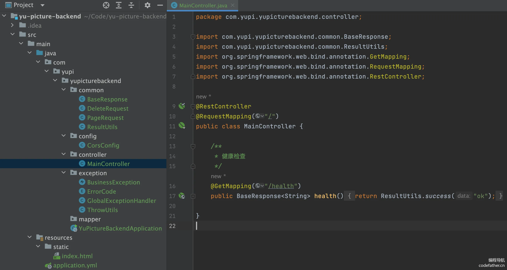

访问 http://localhost:8123/api/health，看到输出结果，表示后端初始化完成：

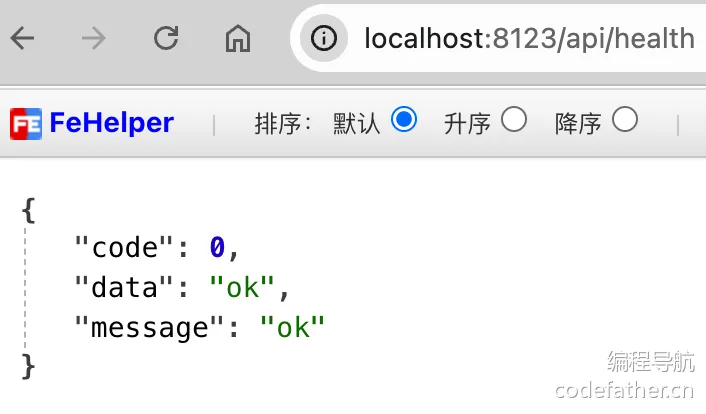

## 二、前端项目初始化

### 环境准备

前端 Node.js 版本必须 >= 18.12，鱼皮教程中使用 20 版本。在官网安装好 Node 后会自动安装 NPM 前端包管理器。

可参考视频安装 Node.js：https://www.bilibili.com/video/BV14SUNYREv8/MBNmaRtUhzDE9b4tB/jsqs1ClvvhzK+S4KVLPihc/I=

### 创建项目

使用 Vue 官方推荐的脚手架 create-vue 快速创建 Vue3 的项目：https://cn.vuejs.org/guide/quick-start.html

💡 Vue 提供了在线编码测试，可以通过 Playground 来学习 Vue：https://play.vuejs.org/p87QUult0bZDR05AO5soQVixQ5nCQ+HA+P5tLSHK/hI=

在终端中输入命令：

```shell
npm create vue@latest
```

NPM 会自动安装 create-vue 工具：

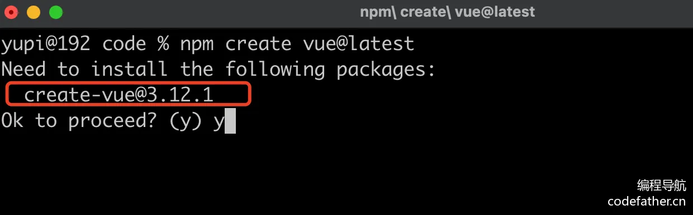

**注意本教程使用的版本号是 3.12.1，如果之后版本更新导致跟鱼皮的教程不一致，记得安装特定版本的工具，而不是 latest 最新版！**

接下来按照如下选项创建项目，脚手架会自动帮我们安装 Vue Router 路由、Pinia 全局状态管理等实用类库：

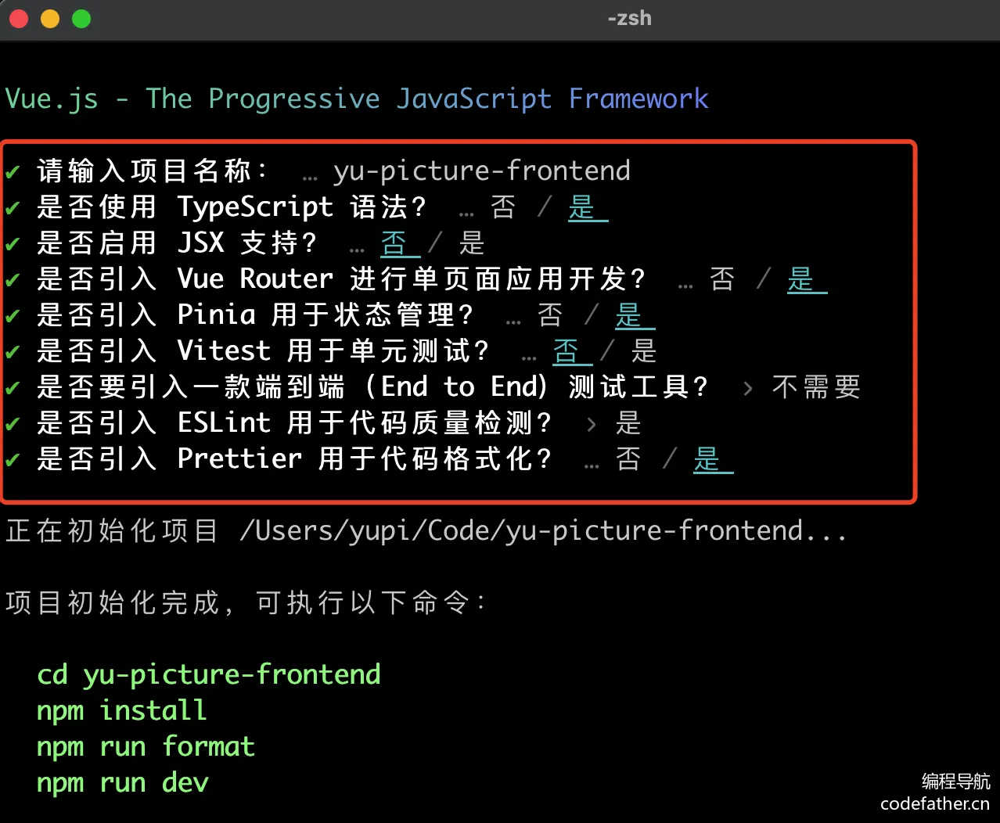

然后用 WebStorm 打开项目，先在终端执行 `npm install` 安装依赖，然后执行 `npm run dev` 能访问网页就成功了。

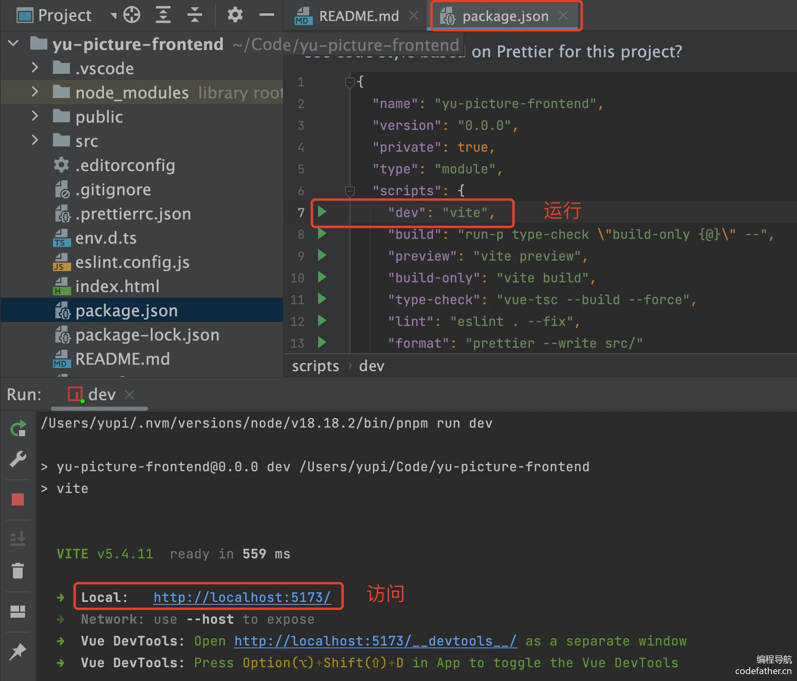

💡 可以看到 Vue 脚手架提供了一个调试工具 devtools（[http://localhost:5173/**devtools**/](http://localhost:5173/__devtools__/)），你可以使用它来调试分析项目：

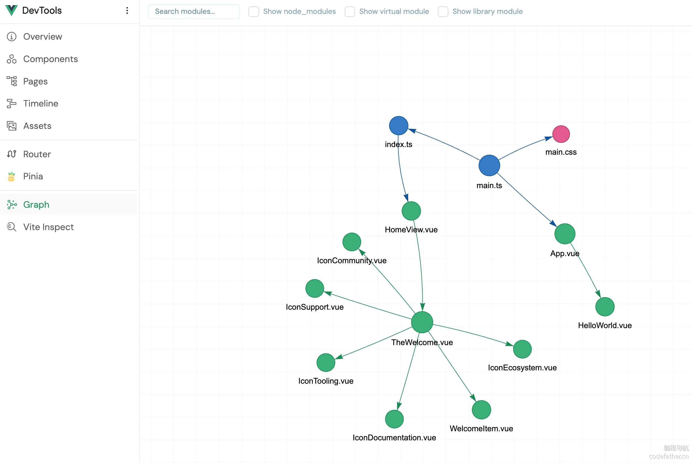

### 前端工程化配置

脚手架已经帮我们整合了 Prettier 代码美化、ESLint 自动校验、TypeScript 类型校验，无需再自行整合。

但是需要在 webstorm 里开启代码美化插件：

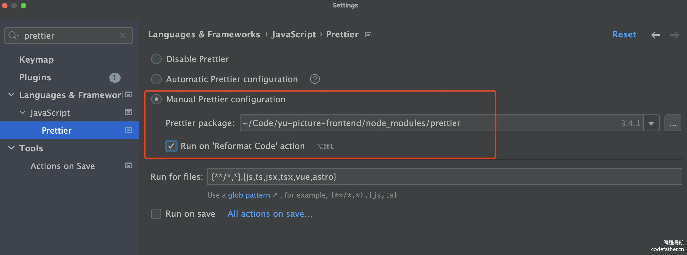

在 vue 文件中执行格式化快捷键，不报错，表示配置工程化成功。

如果发现格式化效果不好，也没关系，之后可以使用另外一种格式化快捷键：

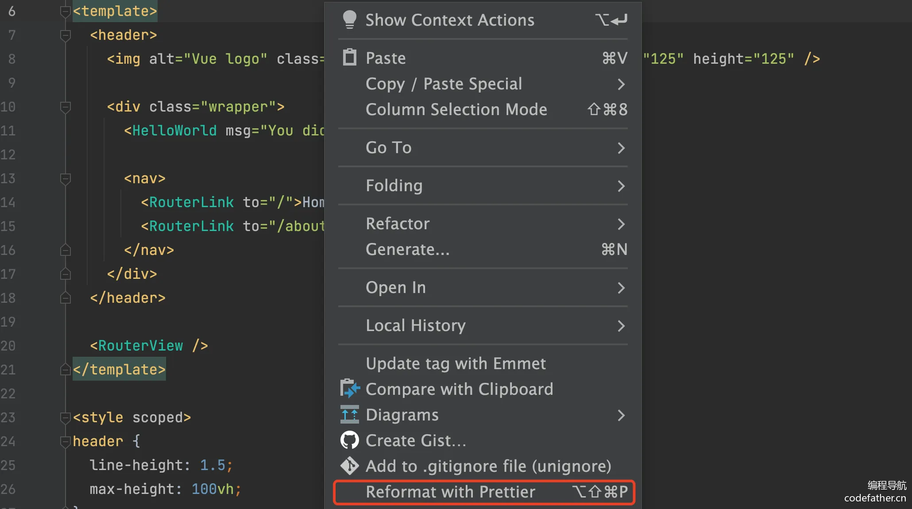

为了开发效率更高，你可能想关闭由于 ESLint 校验导致的编译错误，同样可以在开发工具中禁用 ESLint：

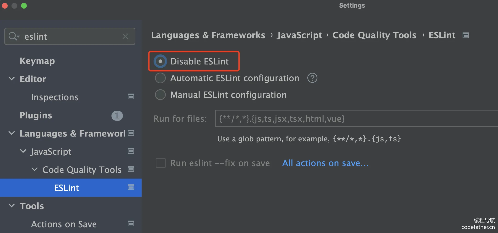

修改 eslint.config.js、.prettierrc.json、tsconfig.json 文件可以改变校验规则。

如果不使用脚手架，就需要自己整合这些工具：

- 代码规范：https://eslint.org/docs/latest/use/getting-started
- 代码美化：https://prettier.io/docs/en/install.html
- 直接整合：https://github.com/prettier/eslint-plugin-prettier#recommended-configuration（包括了 https://github.com/prettier/eslint-config-prettier#installation）

对于前端新手来说，你不需要深入了解这些，纯当工具去使用即可，应该尽快上手项目。Kvj0N9UsvjnA2JCtBYVVlZvRih721R4WfPhhdfsvDfk=

### 引入组件库

引入 Ant Design Vue 组件库，参考 [官方文档](https://antdv.com/docs/vue/getting-started-cn) 快速上手。

注意，本教程使用的是 v4.2.6 的组件库版本，如果后续阅读本教程中发现有组件或语法不一致，以官方文档为主，或者在网站右上角切换对应版本的文档即可：

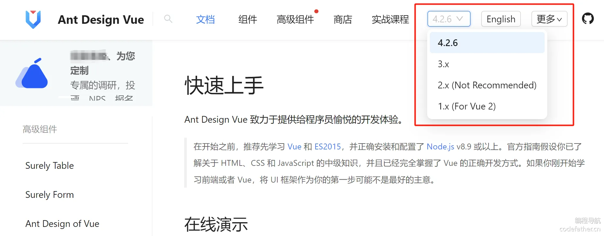

执行安装：

```shell
npm i --save ant-design-vue@4.x
```

改变主入口文件 main.ts，全局注册组件（为了方便）：

```typescript
import App from './App.vue'
import router from './router'
import Antd from 'ant-design-vue'
import 'ant-design-vue/dist/reset.css'
import { createPinia } from 'pinia'
import { createApp } from 'vue'

const app = createApp(App)
app.use(Antd)
app.use(createPinia())
app.use(router)

app.mount('#app')
```

随便引入一个组件，如果显示出来，就表示引入成功。

比如引入按钮：

```typescript
<a-button type="primary">Primary Button</a-button>
```

效果如图：

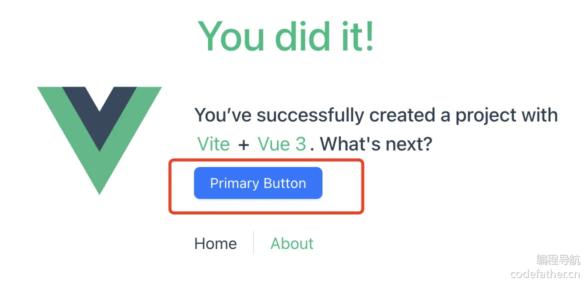

### 开发规范

建议遵循 Vue3 的组合式 API (Composition API)，而不是 [选项式 API](https://cn.vuejs.org/guide/introduction.html#composition-api)，开发更自由高效一些。

示例代码：

```vue
<template>
  <div id="xxPage">

  </div>
</template>

<script setup lang="ts">

</script>

<style scoped>
#xxPage {
}

</style>
```

### 页面基本信息

可以修改项目根目录下的 `index.html` 文件，来定义页面的元信息，比如修改标题：

```html
<!DOCTYPE html>
<html lang="">
  <head>
    <meta charset="UTF-8">
    <link rel="icon" href="/favicon.ico">
    <meta name="viewport" content="width=device-width, initial-scale=1.0">
    <title>鱼皮云图库</title>
  </head>
  <body>
    <div id="app"></div>
    <script type="module" src="/src/main.ts"></script>
  </body>
</html>
```

还可以替换 public 目录下默认的 ico 图标为自己的，有很多 [现成的网站](https://www.bitbug.net/) 可以制作 ico 图标。

效果如图：


### 全局通用布局

#### 1、基础布局结构

在 layouts 目录下新建一个布局 `BasicLayout.vue`， 在 App.vue 全局页面入口文件中引入。

App.vue 代码如下：

```typescript
<template>
  <div id="app">
    <BasicLayout />
  </div>
</template>

<script setup lang="ts">
import BasicLayout from "@/layouts/BasicLayout.vue";
</script>
```

可以移除页面内的默认样式、并且移除 main.ts 中默认引入的 main.css，防止样式污染：

```css
<style>
#app {
}
</style>
```

选用 Ant Design 组件库的 [Layout 组件](https://antdv.com/components/layout-cn) ，先把【上中下】布局编排好，然后再填充内容：

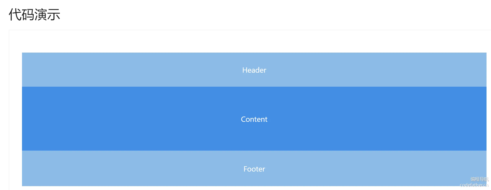

代码如下：

```vue
<template>
  <div id="basicLayout">
    <a-layout style="min-height: 100vh">
      <a-layout-header>Header</a-layout-header>
      <a-layout-content>Content</a-layout-content>
      <a-layout-footer>Footer</a-layout-footer>
    </a-layout>
  </div>
</template>

<script setup lang="ts"></script>
```

样式：

```typescript
<style scoped>
#basicLayout {
}
</style>
```

#### 2、全局底部栏

通常用于展示版权信息：

```tsx
<a-layout-footer class="footer">
  <a href="https://www.codefather.cn" target="_blank">
    编程导航 by 程序员鱼皮
  </a>
</a-layout-footer>
```

样式：

```typescript
#basicLayout .footer {
  background: #efefef;
  padding: 16px;
  position: fixed;
  bottom: 0;
  left: 0;
  right: 0;
  text-align: center;
}
```

#### 3、动态替换内容

项目使用了 [Vue Router](https://router.vuejs.org/zh/introduction.html) 路由库，可以在 `router/index.ts` 配置路由，能够根据访问的页面地址找到不同的文件并加载渲染。

修改 BasicLayout 内容部分的代码如下：

```typescript
<a-layout-content class="content">
  <router-view />
</a-layout-content>
```

修改样式，要和底部栏保持一定的外边距，否则内容会被遮住：

```typescript
<style scoped>
#basicLayout .content {
  background: linear-gradient(to right, #fefefe, #fff);
  margin-bottom: 28px;
  padding: 20px;
}
</style>
```

#### 4、全局顶部栏

由于顶部栏的开发相对复杂，可以基于 [Ant Design 的菜单组件](https://antdv.com/components/menu-cn) 来创建 `GlobalHeader` 全局顶部栏组件，**组件统一放在 components 目录中 **。

先直接复制现成的组件示例代码到 GlobalHeader 中即可。

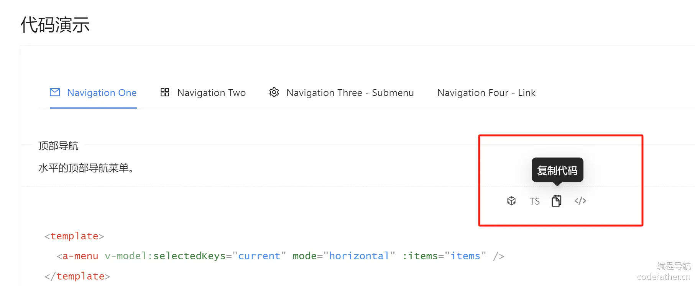

在基础布局中引入顶部栏组件：

```vue
<a-layout-header class="header">
  <GlobalHeader />
</a-layout-header>
```

引入代码如下：

```vue
<script setup lang="ts">
import GlobalHeader from "@/components/GlobalHeader.vue";
</script>
```

效果如下：

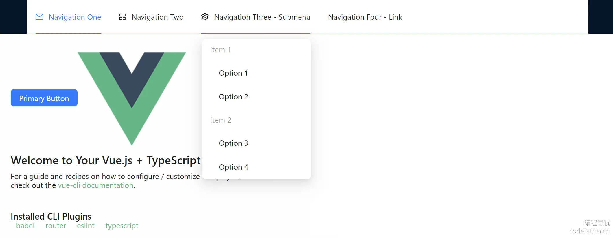

可以修改下全局 Header 的样式，清除一些默认样式（比如背景色等），样式代码如下：

```css
#basicLayout .header {
  padding-inline: 20px;
  margin-bottom: 16px;
  color: unset;
  background: white;
}
```

接下来要修改 GlobalHeader 组件，完善更多内容。

1）给菜单外套一层元素，用于整体控制样式：

```vue
<div id="globalHeader">
  <a-menu v-model:selectedKeys="current" mode="horizontal" :items="items" />
</div>
```

2）根据我们的需求修改菜单配置，key 为要跳转的 URL 路径：

```vue
<script lang="ts" setup>
import { h, ref } from 'vue'
import { HomeOutlined } from '@ant-design/icons-vue'
import { MenuProps } from 'ant-design-vue'

const current = ref<string[]>(['home'])
const items = ref<MenuProps['items']>([
  {
    key: '/',
    icon: () => h(HomeOutlined),
    label: '主页',
    title: '主页',
  },
  {
    key: '/about',
    label: '关于',
    title: '关于',
  },
  {
    key: 'others',
    label: h('a', { href: 'https://www.codefather.cn', target: '_blank' }, '编程导航'),
    title: '编程导航',
  },
])
</script>
```

效果如图：

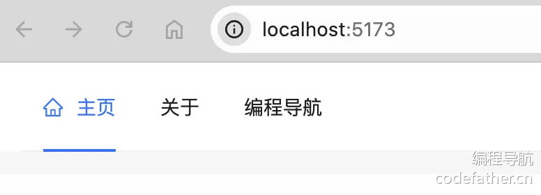

3）完善全局顶部栏，左侧补充网站图标和标题。

先把 logo.png 放到 src/assets 目录下，替换掉原本的默认 Logo：


修改 GlobalHeader 代码，补充 HTML：

```tsx
<RouterLink to="/">
  <div class="title-bar">
    
    <div class="title">鱼皮云图库</div>
  </div>
</RouterLink>
```

其中，RouterLink 组件的作用是支持超链接跳转（不刷新页面）。

补充 CSS 样式：

```css
<style scoped>
.title-bar {
  display: flex;
  align-items: center;
}

.title {
  color: black;
  font-size: 18px;
  margin-left: 16px;
}

.logo {
  height: 48px;
}
</style>
```

4）完善顶部导航栏，右侧展示当前用户的登录状态（暂时用登录按钮代替）：

```vue
<div class="user-login-status">
  <a-button type="primary" href="/user/login">登录</a-button>
</div>
```

5）优化导航栏的布局，采用 [栅格组件的自适应布局](https://antdv.com/components/grid-cn#components-grid-demo-flex-stretch)（左中右结构，左侧右侧宽度固定，中间菜单栏自适应）

```vue
<a-row :wrap="false">
  <a-col flex="200px">
    <RouterLink to="/">
      <div class="title-bar">
        
        <div class="title">鱼皮云图库</div>
      </div>
    </RouterLink>
  </a-col>
  <a-col flex="auto">
    <a-menu
      v-model:selectedKeys="current"
      mode="horizontal"
      :items="items"
    />
  </a-col>
  <a-col flex="120px">
    <div class="user-login-status">
      <a-button type="primary" href="/user/login">登录</a-button>
    </div>
  </a-col>
</a-row>
```

效果如图，可以尝试缩小浏览器窗口观察导航条的变化：

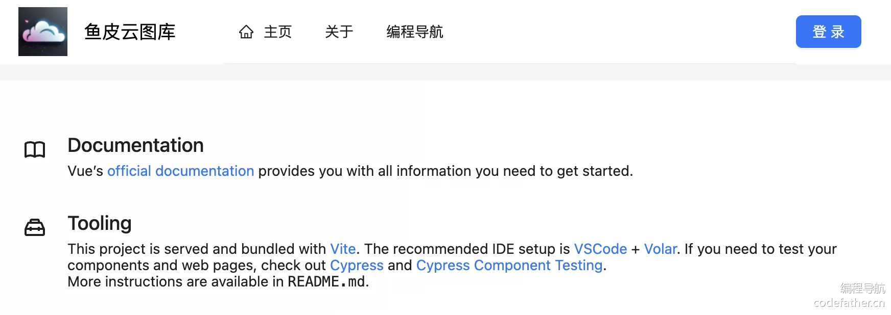

### 路由

目标：点击菜单项后，可以跳转到对应的页面；并且刷新页面后，对应的菜单自动高亮。

#### 1、修改路由配置

按需修改 router/index.ts 文件的 routes 配置，定义我们需要的页面路由，每个 path 对应一个 component（要加载的组件）：cT00UyE1JKn/y8Q147TQRzbDavEs+V72bbBFCS1wu6g=

```css
routes: [
  {
    path: '/',
    name: 'home',
    component: HomeView,
  },
  {
    path: '/about',
    name: 'about',
    // route level code-splitting
    // this generates a separate chunk (About.[hash].js) for this route
    // which is lazy-loaded when the route is visited.
    component: () => import('../views/AboutView.vue'),
  },
],
```

观察上述代码，会发现 component 支持直接传入组件、或者使用 import 按需懒加载组件，按需加载是一种优化首次打开站点性能的方式。

#### 2、路由跳转

给 GlobalHeader 的菜单组件绑定跳转事件：

```typescript
import { useRouter } from "vue-router";
const router = useRouter();

// 路由跳转事件
const doMenuClick = ({ key }: { key: string }) => {
  router.push({
    path: key,
  });
};
```

修改 HTML 模板，绑定事件：

```vue
<a-menu
  v-model:selectedKeys="current"
  mode="horizontal"
  :items="items"
  @click="doMenuClick"
/>
```

#### 3、高亮同步

刷新页面后，你会发现当前菜单项并没有高亮，所以需要同步路由的更新到菜单项高亮。cT00UyE1JKn/y8Q147TQRzbDavEs+V72bbBFCS1wu6g=

同步高亮原理：

1. 点击菜单时，Ant Design 组件已经通过 v-model 绑定 current 变量实现了高亮。
2. 刷新页面时，需要获取到当前 URL 路径，然后修改 current 变量的值，从而实现同步。

使用 Vue Router 的 afterEach 路由钩子实现，每次改变路由或刷新页面时都会自动更新 current 的值，从而实现高亮：sqWmWUk8kFL4uPey9+8ro5dv7g8fCeOwW9uL7T8/Q4k=

```tsx
const router = useRouter();
// 当前选中菜单
const current = ref<string[]>([]);
// 监听路由变化，更新当前选中菜单
router.afterEach((to, from, next) => {
  current.value = [to.path];
});
```

💡思考：大家有没有发现，路由和菜单配置中，有一些是重复的呢？有没有更好地方式来配置路由和菜单项，不用每次修改时都要改两边的代码呢？答案就是将路由配置数组传递给菜单组件，大家可以尝试自行实现。（鱼皮的 [OJ 判题系统项目](https://www.codefather.cn/course)、[鱼答答 AI 答题应用平台项目](https://www.codefather.cn/course) 中有讲过）

### 请求

> 引入 Axios 请求库

一般情况下，前端只负责界面展示和动效交互，尽量避免写复杂的逻辑；当需要获取数据时，通常是向后端提供的接口发送请求，由后端执行操作（比如保存数据）并响应数据给前端。

前端如何向后端发送请求呢？最传统的方式是使用 AJAX 技术。但其代码有些复杂，我们可以使用第三方的封装库，来简化发送请求的代码，比如主流的请求工具库 Axios。

#### 1、请求工具库

安装请求工具类 Axios，参考官方文档：https://axios-http.com/docs/intro

代码：

```shell
npm install axios
```

#### 2、全局自定义请求

需要自定义全局请求地址等，参考 Axios 官方文档，编写请求配置文件 `request.ts`。包括全局接口请求地址、超时时间、自定义请求响应拦截器等。

响应拦截器的应用场景：我们需要对接口的 **通用响应** 进行统一处理，比如从 response 中取出 data；或者根据 code 去集中处理错误。这样不用在每个接口请求中都去写相同的逻辑。

比如可以在全局响应拦截器中，读取出结果中的 data，并校验 code 是否合法，如果是未登录状态，则自动登录。

示例代码如下，其中 `withCredentials: true` 一定要写，否则无法在发请求时携带 Cookie，就无法完成登录。

代码如下：

```typescript
import axios from 'axios'
import { message } from 'ant-design-vue'

// 创建 Axios 实例
const myAxios = axios.create({
  baseURL: 'http://localhost:8123',
  timeout: 60000,
  withCredentials: true,
})

// 全局请求拦截器
myAxios.interceptors.request.use(
  function (config) {
    // Do something before request is sent
    return config
  },
  function (error) {
    // Do something with request error
    return Promise.reject(error)
  },
)

// 全局响应拦截器
myAxios.interceptors.response.use(
  function (response) {
    const { data } = response
    // 未登录
    if (data.code === 40100) {
      // 不是获取用户信息的请求，并且用户目前不是已经在用户登录页面，则跳转到登录页面
      if (
        !response.request.responseURL.includes('user/get/login') &&
        !window.location.pathname.includes('/user/login')
      ) {
        message.warning('请先登录')
        window.location.href = `/user/login?redirect=${window.location.href}`
      }
    }
    return response
  },
  function (error) {
    // Any status codes that falls outside the range of 2xx cause this function to trigger
    // Do something with response error
    return Promise.reject(error)
  },
)

export default myAxios
```

#### 3、自动生成请求代码

如果采用传统开发方式，针对每个请求都要单独编写代码，很麻烦。

推荐使用 OpenAPI 工具，直接自动生成即可：https://www.npmjs.com/package/@umijs/openapi

按照官方文档的步骤，先安装：

```shell
npm i --save-dev @umijs/openapi
```

在 **项目根目录 **新建 `openapi.config.js`，根据自己的需要定制生成的代码：

```typescript
import { generateService } from '@umijs/openapi'

generateService({
  requestLibPath: "import request from '@/request'",
  schemaPath: 'http://localhost:8123/api/v2/api-docs',
  serversPath: './src',
})
```

**注意，要将 schemaPath 改为自己后端服务提供的 Swagger 接口文档的地址。**

在 package.json 的 script 中添加 `"openapi": "node openapi.config.js"`

执行即可生成请求代码，还包括 TypeScript 类型：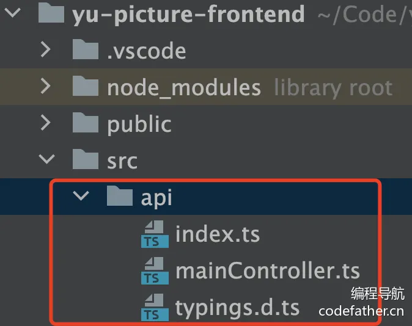

以后每次后端接口变更时，只需要重新生成一遍就好，非常方便~

#### 4、测试请求

可以尝试在任意页面代码中调用 API：

```typescript
import { healthUsingGet } from '@/api/mainController'

healthUsingGet().then((res) => {
  console.log(res)
})
```

按 F12 打开开发者工具查看请求，由于我们后端已经添加了全局跨域配置，正常情况下应该能看到如下响应：

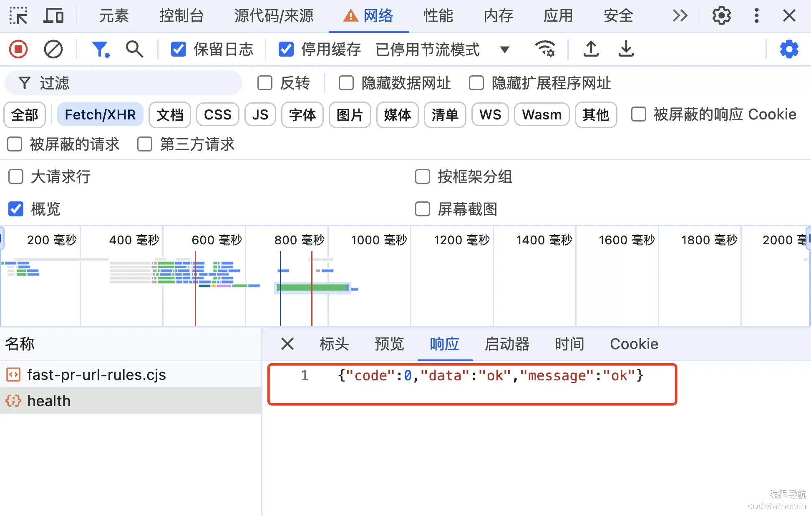

#### 5、解决跨域（可选）

如果发现请求错误，要查看错误信息具体分析。比如遇到 **跨域问题**，这是由于前端网页地址和后端请求接口地址不同导致的：

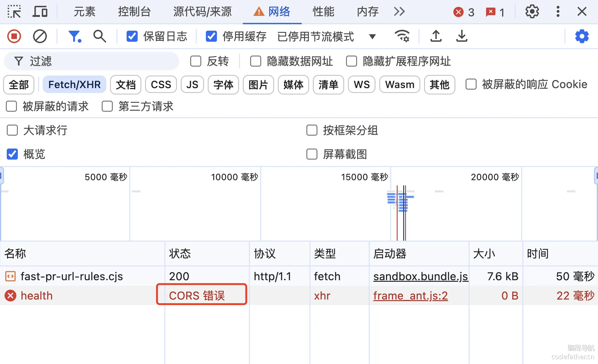

这种情况下，可以通过修改后端代码，增加全局跨域配置或者跨域注解来解决：

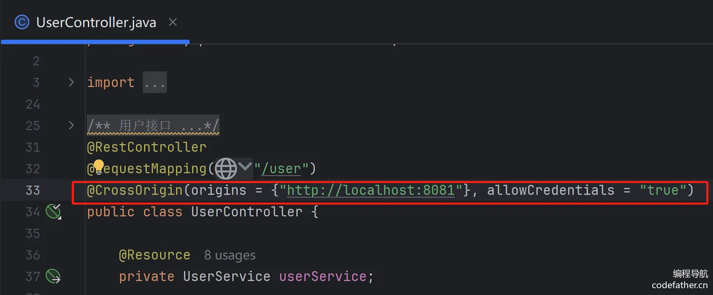

如果后端代码无法修改，还可以通过前端代理服务器来解决，如果项目使用 Vite，内置了代理服务器。可以修改 vite.config.ts 文件，增加代理配置：

```typescript
export default defineConfig({
  server: {
    proxy: {
      '/api': 'http://localhost:8123',
    }
  },
})
```

同时修改 request.ts，移除请求前缀：

```typescript
// 创建 Axios 实例
const myAxios = axios.create({
  baseURL: '',
  timeout: 60000,
  withCredentials: true,
})
```

这样一来，前端发送的请求域名就等同于当前 URL 的域名，就不会出现跨域。但是访问到 /api 开头的接口时，会被代理到请求 8123 端口的后端服务器，从而完成请求。

💡 还有很多前端代理工具，比如 [Whistle](https://wproxy.org/whistle/install.html)，前端方向的同学可以去了解下。

### 全局状态管理

什么是全局状态管理？

答：所有页面全局共享的变量，而不是局限在某一个页面中。

适合作为全局状态的数据：已登录用户信息（每个页面几乎都要用）

Pinia 是一个主流的状态管理库，相比于 Vuex 来说使用更简单，可参考 [入门文档](https://pinia.vuejs.org/zh/getting-started.html) 进行引入。

#### 1、引入 Pinia

此处由于 create-vue 脚手架已经帮我们整合了 Pinia，无需手动引入，直接使用即可。

#### 2、定义状态

在 src/stores 目录下定义 user 模块，定义了用户的存储、远程获取、修改逻辑：

```typescript
import { defineStore } from "pinia";
import { ref } from "vue";

export const useLoginUserStore = defineStore("loginUser", () => {
  const loginUser = ref<any>({
    userName: "未登录",
  });

  async function fetchLoginUser() {
    // todo 由于后端还没提供接口，暂时注释
    // const res = await getCurrentUser();
    // if (res.data.code === 0 && res.data.data) {
    //   loginUser.value = res.data.data;
    // }
  }

  function setLoginUser(newLoginUser: any) {
    loginUser.value = newLoginUser;
  }

  return { loginUser, setLoginUser, fetchLoginUser };
});
```

#### 3、使用状态

可以直接使用 store 中导出的状态变量和函数。

在首次进入到页面时，一般我们会尝试获取登录用户信息。修改 App.vue，编写远程获取数据代码：

```typescript
const loginUserStore = useLoginUserStore()
loginUserStore.fetchLoginUser()
```

在任何页面中都可以使用数据，比如 GlobalHeader 全局顶部栏组件中直接展示：qHT6Kxg12X1vklSWA3QVO0Z9aqth3Yj5Z1UQTagntCA=

```typescript
{{ JSON.stringify(loginUserStore.loginUser) }}
```

修改全局顶部栏组件，在右侧展示登录状态：

```vue
<div class="user-login-status">
  <div v-if="loginUserStore.loginUser.id">
    {{ loginUserStore.loginUser.userName ?? '无名' }}
  </div>
  <div v-else>
    <a-button type="primary" href="/user/login">登录</a-button>
  </div>
</div>
```

#### 4、测试全局状态管理

在 userStore 中编写测试代码，测试用户状态的更新：

```typescript
async function fetchLoginUser() {
  // 测试用户登录，3 秒后登录
  setTimeout(() => {
    loginUser.value = { userName: '测试用户', id: 1 }
  }, 3000)
}
```

查看效果，等待 3 秒后网站右上方会展示出登录用户信息：

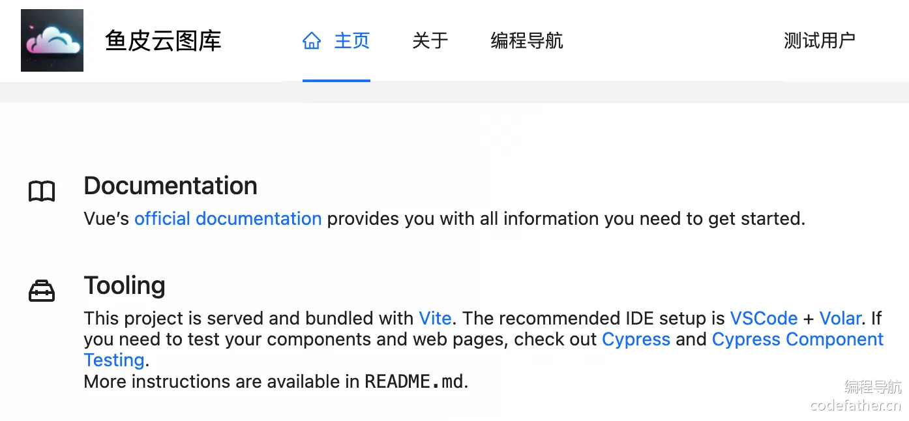

至此，一个入门级的前端项目就初始化好了，接下来我们就可以进行页面开发。

### 页面开发流程

我们通过开发一个简易的示例页面，来了解页面开发的流程。

1）新建 src/pages 目录，用于存放所有的页面文件。

然后在 pages 目录下新建页面文件，将所有页面按照 url 层级进行创建，并且页面名称尽量做到“见名知意”。

举个例子：

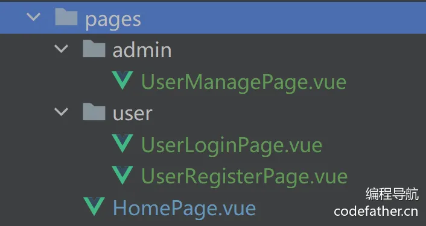

其中，/user/login 地址就对应了 UserLoginPage。

此处我们新建 HomePage.vue 即可。

2）每次新建页面时，需要在 router/index.ts 中配置路由，比如欢迎页的路由为：Kvj0N9UsvjnA2JCtBYVVlZvRih721R4WfPhhdfsvDfk=

```typescript
const routes: Array<RouteRecordRaw> = [
  {
    path: "/",
    name: "home",
    component: HomeView,
  },
  ...
]
```

然后在路由文件中，引入页面 HomePage：

```typescript
import HomePage from "@/pages/HomePage.vue";

const routes: Array<RouteRecordRaw> = [
  {
    path: "/",
    name: "home",
    component: HomePage,
  },
  ...
]
```

任意修改页面代码：

```vue
<template>
  <div id="homePage">
    <h1>{{ msg }}</h1>
  </div>
</template>

<script setup lang="ts">
const msg = "欢迎来到编程导航，你将从这里开始项目学习之旅~";
</script>

<style scoped>
#homePage {
}
</style>
```

页面效果如图：

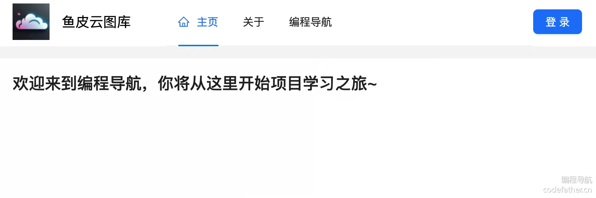

### 扩展

在后续开发中你会发现，Ant Design Vue 默认使用的是英文文案，如果需要替换为中文，可以参考 [国际化文档](https://antdv.com/docs/vue/i18n-cn)，只需给整个应用包裹一层组件即可完成。

------

本节教程到这里就结束了，建议大家从 0 实操下项目初始化，以后自己搭建一个新项目，也不会觉得困难啦~


# 3 - 用户模块

## 本节重点

首先开发每个项目基本都具有的用户模块，本节教程可以当做一个 **用户管理系统项目** 独立学习，适合新手入门，后端和前端部分也可以按需独立学习。

本节大纲：

- 需求分析
- 方案设计
- 后端开发
- 前端开发

## 一、需求分析

对于用户模块，通常要具有下列功能：

- 用户注册
- 用户登录
- 获取当前登录用户
- 用户注销
- 用户权限控制
- 【管理员】管理用户

具体分析每个需求：

1）用户注册：用户可以通过输入账号、密码、确认密码进行注册

2）用户登录：用户可以通过输入账号和密码登录

3）获取当前登录用户：得到当前已经登录的用户信息（不用重复登录）

4）用户注销：用户可以退出登录

5）用户权限控制：用户又分为普通用户和管理员，管理员拥有整个系统的最高权限，比如可以管理其他用户

6）用户管理：仅管理员可用，可以对整个系统中的用户进行管理，比如搜索用户、删除用户

## 二、方案设计

实现用户模块的难度不大，方案设计阶段我们需要确认：

- 库表设计
- 用户登录流程
- 如何对用户权限进行控制？

### 库表设计

库名：yu_picture

表名：user（用户表）

鱼皮会先讲本项目需要的核心设计，再补充一些扩展设计，便于大家学习。XJ858sBsdVoQsBlQbSlEZH9bgQFu4XZchClXOymxgUA=

#### 1、核心设计

用户表的核心是用户登录凭证（账号密码）和个人信息，SQL 如下：

```sql
▼-- 用户表
create table if not exists user
(
    id           bigint auto_increment comment 'id' primary key,
    userAccount  varchar(256)                           not null comment '账号',
    userPassword varchar(512)                           not null comment '密码',
    userName     varchar(256)                           null comment '用户昵称',
    userAvatar   varchar(1024)                          null comment '用户头像',
    userProfile  varchar(512)                           null comment '用户简介',
    userRole     varchar(256) default 'user'            not null comment '用户角色：user/admin',
    editTime     datetime     default CURRENT_TIMESTAMP not null comment '编辑时间',
    createTime   datetime     default CURRENT_TIMESTAMP not null comment '创建时间',
    updateTime   datetime     default CURRENT_TIMESTAMP not null on update CURRENT_TIMESTAMP comment '更新时间',
    isDelete     tinyint      default 0                 not null comment '是否删除',
    UNIQUE KEY uk_userAccount (userAccount),
    INDEX idx_userName (userName)
) comment '用户' collate = utf8mb4_unicode_ci;
```

几个注意事项：

1）editTime 和 updateTime 的区别：editTime 表示用户编辑个人信息的时间（需要业务代码来更新），而 updateTime 表示这条用户记录任何字段发生修改的时间（由数据库自动更新）。

2）给唯一值添加唯一键（唯一索引），比如账号 userAccount，利用数据库天然防重复，同时可以增加查询效率。

3）给经常用于查询的字段添加索引，比如用户昵称 userName，可以增加查询效率。

💡 建议养成好习惯，将库表设计 SQL 保存到项目的目录中，比如新建 `sql/create_table.sql` 文件，这样其他开发者就能更快地了解项目。

#### 2、扩展设计

1）如果要实现会员功能，可以对表进行如下扩展：

1. 给 userRole 字段新增枚举值 `vip`，表示会员用户，可根据该值判断用户权限
2. 新增会员过期时间字段，可用于记录会员有效期
3. 新增会员兑换码字段，可用于记录会员的开通方式
4. 新增会员编号字段，可便于定位用户并提供额外服务，并增加会员归属感

对应的 SQL 如下：

```sql
vipExpireTime datetime     null comment '会员过期时间',
vipCode       varchar(128) null comment '会员兑换码',
vipNumber     bigint       null comment '会员编号'
```

2）如果要实现用户邀请功能，可以对表进行如下扩展：

1. 新增 shareCode 分享码字段，用于记录每个用户的唯一邀请标识，可拼接到邀请网址后面，比如 https://mianshiya.com/?shareCode=xxx
2. 新增 inviteUser 字段，用于记录该用户被哪个用户邀请了，可通过这个字段查询某用户邀请的用户列表。

对应的 SQL 如下：

```sql
shareCode     varchar(20)  DEFAULT NULL COMMENT '分享码',
inviteUser    bigint       DEFAULT NULL COMMENT '邀请用户 id'
```

### 用户登录流程

1）建立初始会话：前端与服务器建立连接后，服务器会为该客户端创建一个初始的匿名 Session，并将其状态保存下来。这个 Session 的 ID 会作为唯一标识，返回给前端。

2）登录成功，更新会话信息：当用户在前端输入正确的账号密码并提交到后端验证成功后，后端会更新该用户的 Session，将用户的登录信息（如用户 ID、用户名等）保存到与该 Session 关联的存储中。同时，服务器会生成一个 Set-Cookie 的响应头，指示前端保存该用户的 Session ID。

3）前端保存 Cookie：前端接收到后端的响应后，浏览器会自动根据 Set-Cookie 指令，将 Session ID 存储到浏览器的 Cookie 中，与该域名绑定。

4）带 Cookie 的后续请求：当前端再次向相同域名的服务器发送请求时，浏览器会自动在请求头中附带之前保存的 Cookie，其中包含 Session ID。

5）后端验证会话：服务器接收到请求后，从请求头中提取 Session ID，找到对应的 Session 数据。

6）获取会话中存储的信息：后端通过该 Session 获取之前存储的用户信息（如登录名、权限等），从而识别用户身份并执行相应的业务逻辑。

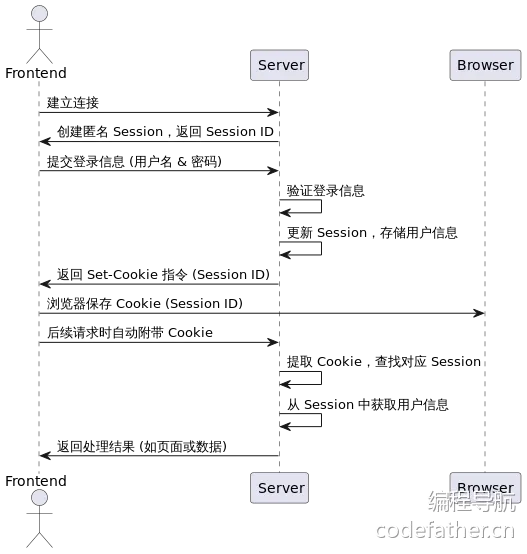

### 如何对用户权限进行控制？

可以将接口分为 4 种权限：

1. 未登录也可以使用
2. 登录用户才能使用
3. 未登录也可以使用，但是登录用户能进行更多操作（比如登录后查看全文）
4. 仅管理员才能使用

传统的权限控制方法是，在每个接口内单独编写逻辑：先获取到当前登录用户信息，然后判断用户的权限是否符合要求。

这种方法最灵活，但是会写很多重复的代码，而且其他开发者无法一眼得知接口所需要的权限。

权限校验其实是一个比较通用的业务需求，一般会通过 **Spring AOP 切面 + 自定义权限校验注解 **实现统一的接口拦截和权限校验；如果有特殊的权限校验逻辑，再单独在接口中编码。

💡 如果需要更复杂更灵活的权限控制，可以引入 Shiro / Spring Security / Sa-Token 等专门的权限管理框架。

------

OK，有了实现方案后，我们先来开发后端接口。

## 三、后端开发

以后每次开发接口时，都可以遵循以下流程。

### 数据访问层代码生成

首先利用 IDEA 连接 MySQL 数据库：

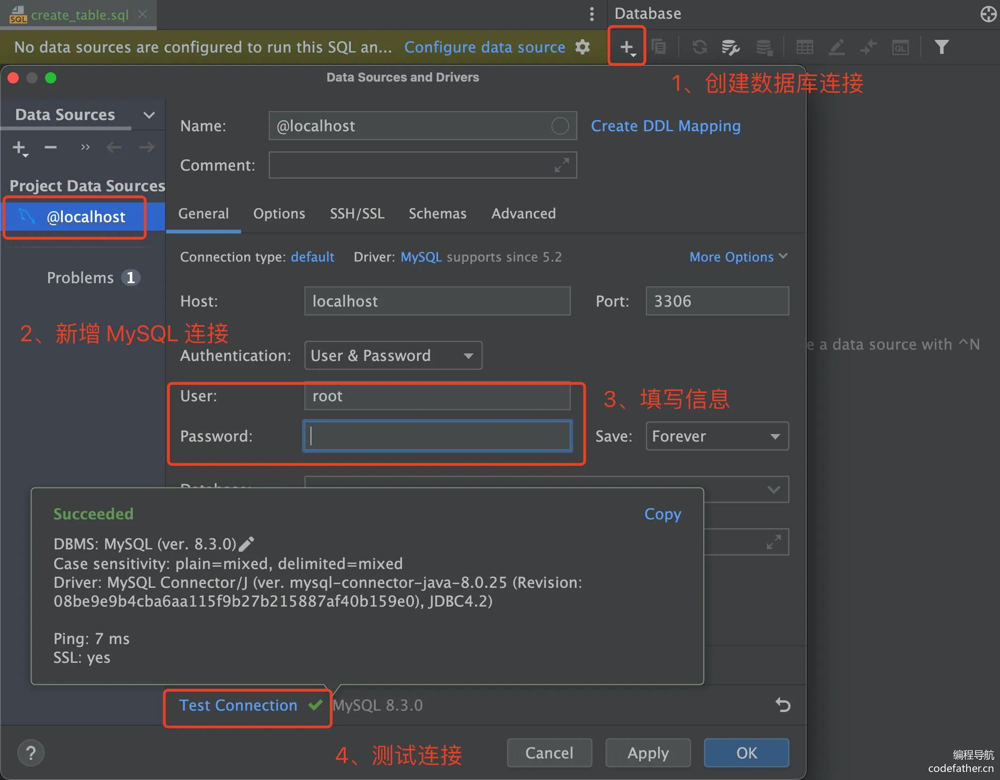

执行 SQL 脚本，创建数据库表：

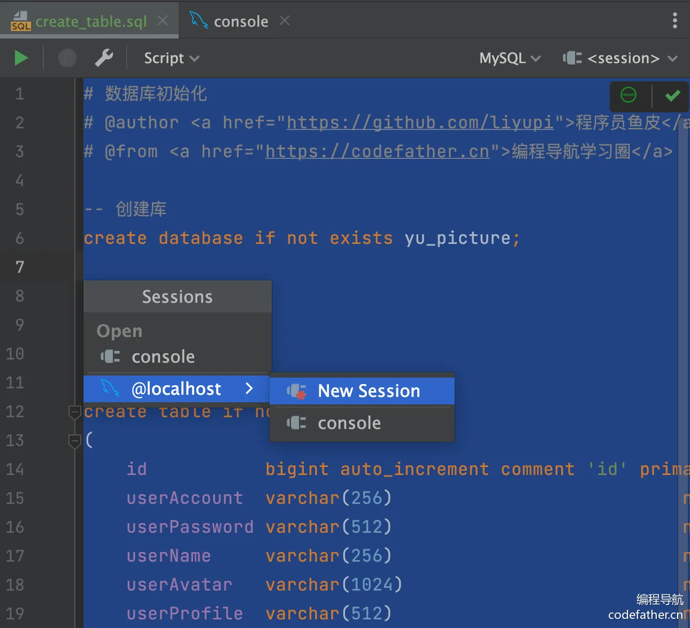

数据访问层的代码一般包括实体类、MyBatis 的 Mapper 类和 XML 等。比起手动编写，建议使用 MyBatisX 代码生成插件，可以快速得到这些文件。6vlRn/br/m8Ymr8D02hZYIBP3pqlW5Sp8qJklXCk9AY=

选中数据库的表，右键选择 MybatisX 生成器：

![img]()

按照下图进行配置：

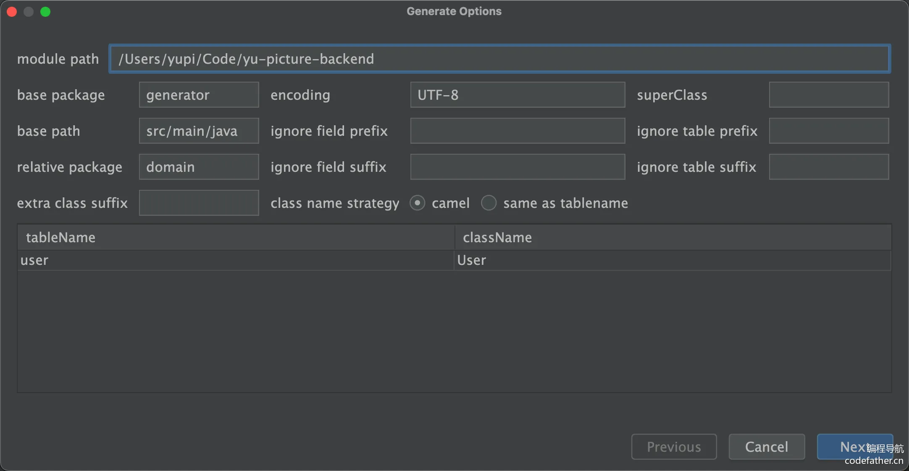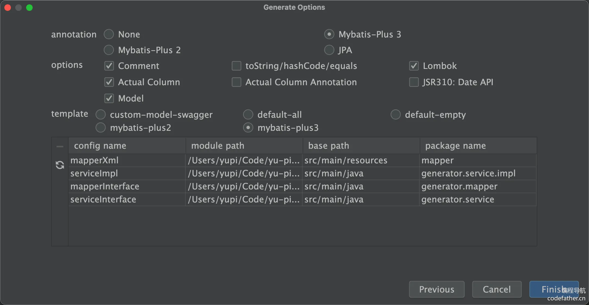

可以看到生成的代码，包括实体类、Mapper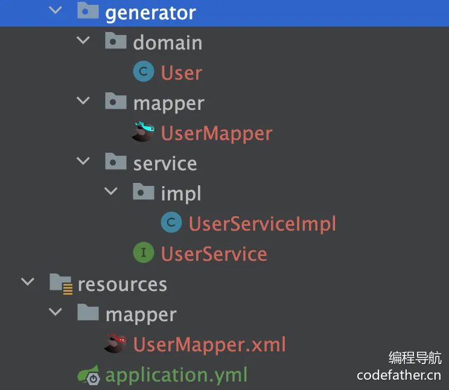

我们需要将这些代码移动到项目对应的位置，比如将 Mapper 移动到 `mapper` 包、User 移动到 `model.entity` 包、Service 移动到 `service` 包。记得将有用的文件添加到 Git 进行托管。

移动之后，注意修改 UserMapper.xml 等文件的包名：

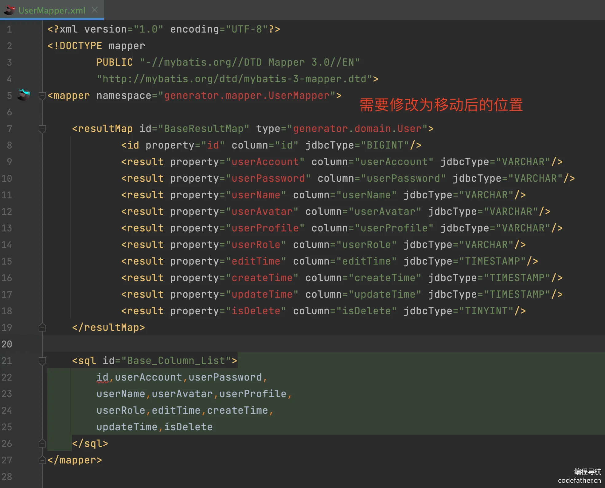

### 数据模型开发

#### 1、实体类

生成的代码也许不能完全满足我们的要求，比如数据库实体类，我们可以手动更改其字段配置，指定主键策略和逻辑删除。

1. id 默认是连续生成的，容易被爬虫抓取，所以更换策略为 `ASSIGN_ID` 雪花算法生成。
2. 数据删除时默认为彻底删除记录，如果出现误删，将难以恢复，所以采用逻辑删除 —— 通过修改 isDelete 字段为 1 表示已失效的数据。

修改的代码如下：

```java
▼@TableName(value ="user")
@Data
public class User implements Serializable {
    /**
     * id（要指定主键策略）
     */
    @TableId(type = IdType.ASSIGN_ID)
    private Long id;

    // ...
    
    /**
     * 是否删除（逻辑删除）
     */
    @TableLogic
    private Integer isDelete;
}
```

使用框架的过程中，有任何疑问，都可以在官方文档查阅，比如了解 MyBatis Plus 的主键生成注解：https://baomidou.com/reference/annotation/#tableid

#### 2、枚举类

对于用户角色这样值的数量有限的、可枚举的字段，最好定义一个枚举类，便于在项目中获取值、减少枚举值输入错误的情况。

在 `model.enums` 包下新建 UserRoleEnum：

```java
@Getter
public enum UserRoleEnum {

    USER("用户", "user"),
    ADMIN("管理员", "admin");

    private final String text;

    private final String value;

    UserRoleEnum(String text, String value) {
        this.text = text;
        this.value = value;
    }

    /**
     * 根据 value 获取枚举
     *
     * @param value 枚举值的value
     * @return 枚举值
     */
    public static UserRoleEnum getEnumByValue(String value) {
        if (ObjUtil.isEmpty(value)) {
            return null;
        }
        for (UserRoleEnum anEnum : UserRoleEnum.values()) {
            if (anEnum.value.equals(value)) {
                return anEnum;
            }
        }
        return null;
    }
}
```

其中，getEnumByValue 是通过 value 找到具体的枚举对象。

💡 如果枚举值特别多，可以 Map 缓存所有枚举值来加速查找，而不是遍历列表。

------

下面依次进行各功能接口的开发。

### 用户注册

#### 1、数据模型

在 `model.dto.user` 下新建用于接受请求参数的类：

```java
@Data
public class UserRegisterRequest implements Serializable {

    private static final long serialVersionUID = 3191241716373120793L;

    /**
     * 账号
     */
    private String userAccount;

    /**
     * 密码
     */
    private String userPassword;

    /**
     * 确认密码
     */
    private String checkPassword;
}
```

💡 在 Java 接口开发中，为每个接口定义一个专门的类来接收请求参数，可以提高代码的可读性和维护性，便于对参数进行统一验证和扩展，同时减少接口方法参数过多导致的复杂性，有助于在复杂场景下更清晰地管理和传递数据。

#### 2、服务开发

在 `service` 包的 UserService 中增加方法声明：

```java
/**
 * 用户注册
 *
 * @param userAccount   用户账户
 * @param userPassword  用户密码
 * @param checkPassword 校验密码
 * @return 新用户 id
 */
long userRegister(String userAccount, String userPassword, String checkPassword);
```

在 UserServiceImpl 中增加实现代码，注意多补充一些校验条件：

```java
@Override
public long userRegister(String userAccount, String userPassword, String checkPassword) {
    // 1. 校验
    if (StrUtil.hasBlank(userAccount, userPassword, checkPassword)) {
        throw new BusinessException(ErrorCode.PARAMS_ERROR, "参数为空");
    }
    if (userAccount.length() < 4) {
        throw new BusinessException(ErrorCode.PARAMS_ERROR, "用户账号过短");
    }
    if (userPassword.length() < 8 || checkPassword.length() < 8) {
        throw new BusinessException(ErrorCode.PARAMS_ERROR, "用户密码过短");
    }
    if (!userPassword.equals(checkPassword)) {
        throw new BusinessException(ErrorCode.PARAMS_ERROR, "两次输入的密码不一致");
    }
    // 2. 检查是否重复
    QueryWrapper<User> queryWrapper = new QueryWrapper<>();
    queryWrapper.eq("userAccount", userAccount);
    long count = this.baseMapper.selectCount(queryWrapper);
    if (count > 0) {
        throw new BusinessException(ErrorCode.PARAMS_ERROR, "账号重复");
    }
    // 3. 加密
    String encryptPassword = getEncryptPassword(userPassword);
    // 4. 插入数据
    User user = new User();
    user.setUserAccount(userAccount);
    user.setUserPassword(encryptPassword);
    user.setUserName("无名");
    user.setUserRole(UserRoleEnum.USER.getValue());
    boolean saveResult = this.save(user);
    if (!saveResult) {
        throw new BusinessException(ErrorCode.SYSTEM_ERROR, "注册失败，数据库错误");
    }
    return user.getId();
}
```

注意，上述代码中，我们需要将用户密码加密后进行存储。可以封装一个方法，便于后续复用：

```java
@Override
public String getEncryptPassword(String userPassword) {
    // 盐值，混淆密码
    final String SALT = "yupi";
    return DigestUtils.md5DigestAsHex((SALT + userPassword).getBytes());
}
```

#### 3、接口开发

在 `controller` 包中新建 UserController，新增用户注册接口：

```java
@RestController
@RequestMapping("/user")
public class UserController {

    @Resource
    private UserService userService;

    /**
     * 用户注册
     */
    @PostMapping("/register")
    public BaseResponse<Long> userRegister(@RequestBody UserRegisterRequest userRegisterRequest) {
        ThrowUtils.throwIf(userRegisterRequest == null, ErrorCode.PARAMS_ERROR);
        String userAccount = userRegisterRequest.getUserAccount();
        String userPassword = userRegisterRequest.getUserPassword();
        String checkPassword = userRegisterRequest.getCheckPassword();
        long result = userService.userRegister(userAccount, userPassword, checkPassword);
        return ResultUtils.success(result);
    }
}
```

#### 4、测试

每开发完一个接口，都可以使用 Swagger 接口文档来测试：


💡 测试时要尤其注意边界值和特殊值，不能只测试正常的情况。

### 用户登录

#### 1、数据模型

在 `model.dto.user` 下新建用于接受请求参数的类：

```java
@Data
public class UserLoginRequest implements Serializable {

    private static final long serialVersionUID = 3191241716373120793L;

    /**
     * 账号
     */
    private String userAccount;

    /**
     * 密码
     */
    private String userPassword;
}
```

#### 2、服务开发

在 `service` 包的 UserService 中增加方法声明：

```java
/**
 * 用户登录
 *
 * @param userAccount  用户账户
 * @param userPassword 用户密码
 * @param request
 * @return 脱敏后的用户信息
 */
LoginUserVO userLogin(String userAccount, String userPassword, HttpServletRequest request);
```

在 UserServiceImpl 中增加实现代码，注意多补充一些校验条件，在用户登录成功后，将用户信息存储在当前的 Session 中。代码如下：

```java
@Override
public LoginUserVO userLogin(String userAccount, String userPassword, HttpServletRequest request) {
    // 1. 校验
    if (StrUtil.hasBlank(userAccount, userPassword)) {
        throw new BusinessException(ErrorCode.PARAMS_ERROR, "参数为空");
    }
    if (userAccount.length() < 4) {
        throw new BusinessException(ErrorCode.PARAMS_ERROR, "账号错误");
    }
    if (userPassword.length() < 8) {
        throw new BusinessException(ErrorCode.PARAMS_ERROR, "密码错误");
    }
    // 2. 加密
    String encryptPassword = getEncryptPassword(userPassword);
    // 查询用户是否存在
    QueryWrapper<User> queryWrapper = new QueryWrapper<>();
    queryWrapper.eq("userAccount", userAccount);
    queryWrapper.eq("userPassword", encryptPassword);
    User user = this.baseMapper.selectOne(queryWrapper);
    // 用户不存在
    if (user == null) {
        log.info("user login failed, userAccount cannot match userPassword");
        throw new BusinessException(ErrorCode.PARAMS_ERROR, "用户不存在或密码错误");
    }
    // 3. 记录用户的登录态
    request.getSession().setAttribute(USER_LOGIN_STATE, user);
    return this.getLoginUserVO(user);
}
```

注意，由于注册用户时存入数据库的密码是加密后的，查询用户信息时，也要对用户输入的密码进行同样算法的加密，才能跟数据库的信息对应上。

可以把上述的 Session 理解为一个 Map，可以给 Map 设置 key 和 value，每个不同的 SessionID 对应的 Session 存储都是不同的，不用担心会污染。所以上述代码中，给 Session 设置了固定的 key（USER_LOGIN_STATE），可以将这个 key 值提取为常量，便于后续获取。

在 `constant` 包下新建 UserConstant 类，统一声明用户相关的常量：

```java
public interface UserConstant {

    /**
     * 用户登录态键
     */
    String USER_LOGIN_STATE = "user_login";

    //  region 权限

    /**
     * 默认角色
     */
    String DEFAULT_ROLE = "user";

    /**
     * 管理员角色
     */
    String ADMIN_ROLE = "admin";
    
    // endregion
}
```

#### 3、接口开发

在 UserController 中新增用户登录接口：

```java
@PostMapping("/login")
public BaseResponse<LoginUserVO> userLogin(@RequestBody UserLoginRequest userLoginRequest, HttpServletRequest request) {
    ThrowUtils.throwIf(userLoginRequest == null, ErrorCode.PARAMS_ERROR);
    String userAccount = userLoginRequest.getUserAccount();
    String userPassword = userLoginRequest.getUserPassword();
    LoginUserVO loginUserVO = userService.userLogin(userAccount, userPassword, request);
    return ResultUtils.success(loginUserVO);
}
```

### 获取当前登录用户

可以从 request 请求对象对应的 Session 中直接获取到之前保存的登录用户信息，无需其他请求参数。

#### 1、服务开发

在 `service` 包的 UserService 中增加方法声明：

```java
/**
 * 获取当前登录用户
 *
 * @param request
 * @return
 */
User getLoginUser(HttpServletRequest request);
```

在 UserServiceImpl 中增加实现代码，此处为了保证获取到的数据始终是最新的，先从 Session 中获取登录用户的 id，然后从数据库中查询最新的结果。代码如下：

```java
@Override
public User getLoginUser(HttpServletRequest request) {
    // 先判断是否已登录
    Object userObj = request.getSession().getAttribute(USER_LOGIN_STATE);
    User currentUser = (User) userObj;
    if (currentUser == null || currentUser.getId() == null) {
        throw new BusinessException(ErrorCode.NOT_LOGIN_ERROR);
    }
    // 从数据库查询（追求性能的话可以注释，直接返回上述结果）
    long userId = currentUser.getId();
    currentUser = this.getById(userId);
    if (currentUser == null) {
        throw new BusinessException(ErrorCode.NOT_LOGIN_ERROR);
    }
    return currentUser;
}
```

#### 2、接口开发

在 UserController 中新增获取当前登录用户接口：

```java
@GetMapping("/get/login")
public BaseResponse<LoginUserVO> getLoginUser(HttpServletRequest request) {
    User loginUser = userService.getLoginUser(request);
    return ResultUtils.success(userService.getLoginUserVO(loginUser));
}
```

注意，上述代码是直接将数据库查到的所有信息都返回给了前端（包括密码），可能存在信息泄露的安全风险。因此，我们还需要对返回结果进行脱敏处理。

#### 3、数据脱敏

在 `model.vo` 包下新建 `LoginUserVO` 类，表示脱敏后的登录用户信息：

```java
@Data
public class LoginUserVO implements Serializable {

    /**
     * 用户 id
     */
    private Long id;

    /**
     * 账号
     */
    private String userAccount;

    /**
     * 用户昵称
     */
    private String userName;

    /**
     * 用户头像
     */
    private String userAvatar;

    /**
     * 用户简介
     */
    private String userProfile;

    /**
     * 用户角色：user/admin
     */
    private String userRole;

    /**
     * 创建时间
     */
    private Date createTime;

    /**
     * 更新时间
     */
    private Date updateTime;

    private static final long serialVersionUID = 1L;
}
```

在 UserService 中新增获取脱敏后的已登录用户信息方法：qHT6Kxg12X1vklSWA3QVO0Z9aqth3Yj5Z1UQTagntCA=

```java
/**
 * 获取脱敏的已登录用户信息
 *
 * @return
 */
LoginUserVO getLoginUserVO(User user);
```

编写方法对应的实现类，其实就是将 User 类的属性复制到 LoginUserVO 中，不存在的字段就被过滤掉了：

```java
@Override
public LoginUserVO getLoginUserVO(User user) {
    if (user == null) {
        return null;
    }
    LoginUserVO loginUserVO = new LoginUserVO();
    BeanUtils.copyProperties(user, loginUserVO);
    return loginUserVO;
}
```

修改 Controller 的 getLoginUser 接口，改为返回脱敏后的用户信息：

```java
@GetMapping("/get/login")
public BaseResponse<LoginUserVO> getLoginUser(HttpServletRequest request) {
    User user = userService.getLoginUser(request);
    return ResultUtils.success(userService.getLoginUserVO(user));
}
```

### 用户注销

可以从 request 请求对象对应的 Session 中直接获取到之前保存的登录用户信息，来完成注销，无需其他请求参数。

#### 1、服务开发

在 `service` 包的 UserService 中增加方法声明：

```java
/**
 * 用户注销
 *
 * @param request
 * @return
 */
boolean userLogout(HttpServletRequest request);
```

在 UserServiceImpl 中增加实现代码，从 Session 中移除掉当前用户的登录态即可：

```java
@Override
public boolean userLogout(HttpServletRequest request) {
    // 先判断是否已登录
    Object userObj = request.getSession().getAttribute(USER_LOGIN_STATE);
    if (userObj == null) {
        throw new BusinessException(ErrorCode.OPERATION_ERROR, "未登录");
    }
    // 移除登录态
    request.getSession().removeAttribute(USER_LOGIN_STATE);
    return true;
}
```

#### 2、接口开发

在 UserController 中新增用户注销接口：

```java
@PostMapping("/logout")
public BaseResponse<Boolean> userLogout(HttpServletRequest request) {
    ThrowUtils.throwIf(request == null, ErrorCode.PARAMS_ERROR);
    boolean result = userService.userLogout(request);
    return ResultUtils.success(result);
}
```

### 用户权限控制

在本节教程的方案设计中讲到：权限校验其实是一个比较通用的业务需求，一般会通过 **Spring AOP 切面 + 自定义权限校验注解 **实现统一的接口拦截和权限校验；如果有特殊的权限校验逻辑，再单独在接口中编码。

#### 1、权限校验注解

首先编写权限校验注解，放到 `annotation` 包下：

```java
@Target(ElementType.METHOD)
@Retention(RetentionPolicy.RUNTIME)
public @interface AuthCheck {

    /**
     * 必须有某个角色
     */
    String mustRole() default "";
}
```

#### 2、权限校验切面

编写权限校验 AOP，采用环绕通知，在 **打上该注解的方法 **执行前后进行一些额外的操作，比如校验权限。

代码如下，放到 `aop` 包下：

```java
@Aspect
@Component
public class AuthInterceptor {

    @Resource
    private UserService userService;

    /**
     * 执行拦截
     *
     * @param joinPoint 切入点
     * @param authCheck 权限校验注解
     */
    @Around("@annotation(authCheck)")
    public Object doInterceptor(ProceedingJoinPoint joinPoint, AuthCheck authCheck) throws Throwable {
        String mustRole = authCheck.mustRole();
        RequestAttributes requestAttributes = RequestContextHolder.currentRequestAttributes();
        HttpServletRequest request = ((ServletRequestAttributes) requestAttributes).getRequest();
        // 当前登录用户
        User loginUser = userService.getLoginUser(request);
        UserRoleEnum mustRoleEnum = UserRoleEnum.getEnumByValue(mustRole);
        // 不需要权限，放行
        if (mustRoleEnum == null) {
            return joinPoint.proceed();
        }
        // 以下为：必须有该权限才通过
        // 获取当前用户具有的权限
        UserRoleEnum userRoleEnum = UserRoleEnum.getEnumByValue(loginUser.getUserRole());
        // 没有权限，拒绝
        if (userRoleEnum == null) {
            throw new BusinessException(ErrorCode.NO_AUTH_ERROR);
        }
        // 要求必须有管理员权限，但用户没有管理员权限，拒绝
        if (UserRoleEnum.ADMIN.equals(mustRoleEnum) && !UserRoleEnum.ADMIN.equals(userRoleEnum)) {
            throw new BusinessException(ErrorCode.NO_AUTH_ERROR);
        }
        // 通过权限校验，放行
        return joinPoint.proceed();
    }
}
```

#### 3、使用注解

只要给方法添加了 @AuthCheck 注解，就必须要登录，否则会抛出异常。

可以设置 mustRole 为管理员，这样仅管理员才能使用该接口：

```java
@AuthCheck(mustRole = UserConstant.ADMIN_ROLE)
```

对于不需要登录就能使用的接口，不需要使用该注解。

### 用户管理

用户管理功能具体可以拆分为：

- 【管理员】创建用户
- 【管理员】根据 id 删除用户
- 【管理员】更新用户
- 【管理员】分页获取用户列表（需要脱敏）
- 【管理员】根据 id 获取用户（未脱敏）
- 根据 id 获取用户（脱敏）

#### 1、数据模型

1）每个操作都需要提供一个请求类，都放在 `dto.user` 包下。

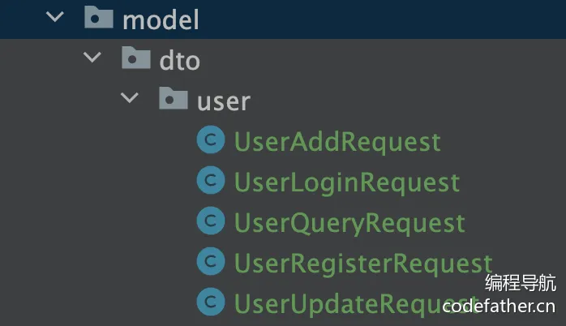

用户创建请求：

```java
@Data
public class UserAddRequest implements Serializable {

    /**
     * 用户昵称
     */
    private String userName;

    /**
     * 账号
     */
    private String userAccount;

    /**
     * 用户头像
     */
    private String userAvatar;

    /**
     * 用户简介
     */
    private String userProfile;

    /**
     * 用户角色: user, admin
     */
    private String userRole;

    private static final long serialVersionUID = 1L;
}
```

用户更新请求：

```java
@Data
public class UserUpdateRequest implements Serializable {

    /**
     * id
     */
    private Long id;

    /**
     * 用户昵称
     */
    private String userName;

    /**
     * 用户头像
     */
    private String userAvatar;

    /**
     * 简介
     */
    private String userProfile;

    /**
     * 用户角色：user/admin
     */
    private String userRole;

    private static final long serialVersionUID = 1L;
}
```

用户查询请求，需要继承公共包中的 `PageRequest` 来支持分页查询：

```java
@EqualsAndHashCode(callSuper = true)
@Data
public class UserQueryRequest extends PageRequest implements Serializable {

    /**
     * id
     */
    private Long id;

    /**
     * 用户昵称
     */
    private String userName;

    /**
     * 账号
     */
    private String userAccount;

    /**
     * 简介
     */
    private String userProfile;

    /**
     * 用户角色：user/admin/ban
     */
    private String userRole;

    private static final long serialVersionUID = 1L;
}
```

2）由于要提供获取用户信息的接口，需要和获取当前登录用户接口一样对用户信息进行脱敏。6vlRn/br/m8Ymr8D02hZYIBP3pqlW5Sp8qJklXCk9AY=

在 `model.vo` 包下新建 UserVO，表示脱敏后的用户：

```java
@Data
public class UserVO implements Serializable {

    /**
     * id
     */
    private Long id;
    
    /**
     * 账号
     */
    private String userAccount;

    /**
     * 用户昵称
     */
    private String userName;

    /**
     * 用户头像
     */
    private String userAvatar;

    /**
     * 用户简介
     */
    private String userProfile;

    /**
     * 用户角色：user/admin
     */
    private String userRole;

    /**
     * 创建时间
     */
    private Date createTime;

    private static final long serialVersionUID = 1L;
}
```

#### 2、服务开发

1）在 UserService 中编写获取脱敏后的单个用户信息、获取脱敏后的用户列表方法：

```java
@Override
public UserVO getUserVO(User user) {
    if (user == null) {
        return null;
    }
    UserVO userVO = new UserVO();
    BeanUtils.copyProperties(user, userVO);
    return userVO;
}

@Override
public List<UserVO> getUserVOList(List<User> userList) {
    if (CollUtil.isEmpty(userList)) {
        return new ArrayList<>();
    }
    return userList.stream().map(this::getUserVO).collect(Collectors.toList());
}
```

2）除了上述方法外，对于分页查询接口，需要根据用户传入的参数来构造 SQL 查询。由于使用 MyBatis Plus 框架，不用自己拼接 SQL 了，而是通过构造 QueryWrapper 对象来生成 SQL 查询。/MBNmaRtUhzDE9b4tB/jsqs1ClvvhzK+S4KVLPihc/I=

可以在 UserService 中编写一个方法，专门用于将查询请求转为 QueryWrapper 对象：

```java
@Override
public QueryWrapper<User> getQueryWrapper(UserQueryRequest userQueryRequest) {
    if (userQueryRequest == null) {
        throw new BusinessException(ErrorCode.PARAMS_ERROR, "请求参数为空");
    }
    Long id = userQueryRequest.getId();
    String userAccount = userQueryRequest.getUserAccount();
    String userName = userQueryRequest.getUserName();
    String userProfile = userQueryRequest.getUserProfile();
    String userRole = userQueryRequest.getUserRole();
    String sortField = userQueryRequest.getSortField();
    String sortOrder = userQueryRequest.getSortOrder();
    QueryWrapper<User> queryWrapper = new QueryWrapper<>();
    queryWrapper.eq(ObjUtil.isNotNull(id), "id", id);
    queryWrapper.eq(StrUtil.isNotBlank(userRole), "userRole", userRole);
    queryWrapper.like(StrUtil.isNotBlank(userAccount), "userAccount", userAccount);
    queryWrapper.like(StrUtil.isNotBlank(userName), "userName", userName);
    queryWrapper.like(StrUtil.isNotBlank(userProfile), "userProfile", userProfile);
    queryWrapper.orderBy(StrUtil.isNotEmpty(sortField), sortOrder.equals("ascend"), sortField);
    return queryWrapper;
}
```

#### 3、接口开发

上述功能其实都是样板代码，俗称 “增删改查”。

代码实现比较简单，注意添加对应的权限注解、做好参数校验即可：

```java
/**
 * 创建用户
 */
@PostMapping("/add")
@AuthCheck(mustRole = UserConstant.ADMIN_ROLE)
public BaseResponse<Long> addUser(@RequestBody UserAddRequest userAddRequest) {
    ThrowUtils.throwIf(userAddRequest == null, ErrorCode.PARAMS_ERROR);
    User user = new User();
    BeanUtils.copyProperties(userAddRequest, user);
    // 默认密码 12345678
    final String DEFAULT_PASSWORD = "12345678";
    String encryptPassword = userService.getEncryptPassword(DEFAULT_PASSWORD);
    user.setUserPassword(encryptPassword);
    boolean result = userService.save(user);
    ThrowUtils.throwIf(!result, ErrorCode.OPERATION_ERROR);
    return ResultUtils.success(user.getId());
}

/**
 * 根据 id 获取用户（仅管理员）
 */
@GetMapping("/get")
@AuthCheck(mustRole = UserConstant.ADMIN_ROLE)
public BaseResponse<User> getUserById(long id) {
    ThrowUtils.throwIf(id <= 0, ErrorCode.PARAMS_ERROR);
    User user = userService.getById(id);
    ThrowUtils.throwIf(user == null, ErrorCode.NOT_FOUND_ERROR);
    return ResultUtils.success(user);
}

/**
 * 根据 id 获取包装类
 */
@GetMapping("/get/vo")
public BaseResponse<UserVO> getUserVOById(long id) {
    BaseResponse<User> response = getUserById(id);
    User user = response.getData();
    return ResultUtils.success(userService.getUserVO(user));
}

/**
 * 删除用户
 */
@PostMapping("/delete")
@AuthCheck(mustRole = UserConstant.ADMIN_ROLE)
public BaseResponse<Boolean> deleteUser(@RequestBody DeleteRequest deleteRequest) {
    if (deleteRequest == null || deleteRequest.getId() <= 0) {
        throw new BusinessException(ErrorCode.PARAMS_ERROR);
    }
    boolean b = userService.removeById(deleteRequest.getId());
    return ResultUtils.success(b);
}

/**
 * 更新用户
 */
@PostMapping("/update")
@AuthCheck(mustRole = UserConstant.ADMIN_ROLE)
public BaseResponse<Boolean> updateUser(@RequestBody UserUpdateRequest userUpdateRequest) {
    if (userUpdateRequest == null || userUpdateRequest.getId() == null) {
        throw new BusinessException(ErrorCode.PARAMS_ERROR);
    }
    User user = new User();
    BeanUtils.copyProperties(userUpdateRequest, user);
    boolean result = userService.updateById(user);
    ThrowUtils.throwIf(!result, ErrorCode.OPERATION_ERROR);
    return ResultUtils.success(true);
}

/**
 * 分页获取用户封装列表（仅管理员）
 *
 * @param userQueryRequest 查询请求参数
 */
@PostMapping("/list/page/vo")
@AuthCheck(mustRole = UserConstant.ADMIN_ROLE)
public BaseResponse<Page<UserVO>> listUserVOByPage(@RequestBody UserQueryRequest userQueryRequest) {
    ThrowUtils.throwIf(userQueryRequest == null, ErrorCode.PARAMS_ERROR);
    long current = userQueryRequest.getCurrent();
    long pageSize = userQueryRequest.getPageSize();
    Page<User> userPage = userService.page(new Page<>(current, pageSize),
            userService.getQueryWrapper(userQueryRequest));
    Page<UserVO> userVOPage = new Page<>(current, pageSize, userPage.getTotal());
    List<UserVO> userVOList = userService.getUserVOList(userPage.getRecords());
    userVOPage.setRecords(userVOList);
    return ResultUtils.success(userVOPage);
}
```

💡 有同学可能会有疑惑：不是说不要在 Controller 中写业务逻辑代码么？

我的建议是开发时要灵活一些，我们要保证 Controller 的精简没错，但不代表什么代码都不在 Controller 里写。对于我们上述的代码，根本就没有复杂的业务逻辑，如果非要抽一层 Service 方法也不是不行，但会更麻烦一些。

#### 4、分页功能修复

使用 Swagger 接口文档依次对上述接口进行测试，发现 listUserVOByPage 接口有一些问题！

分页好像没有生效，还是查出了全部数据：

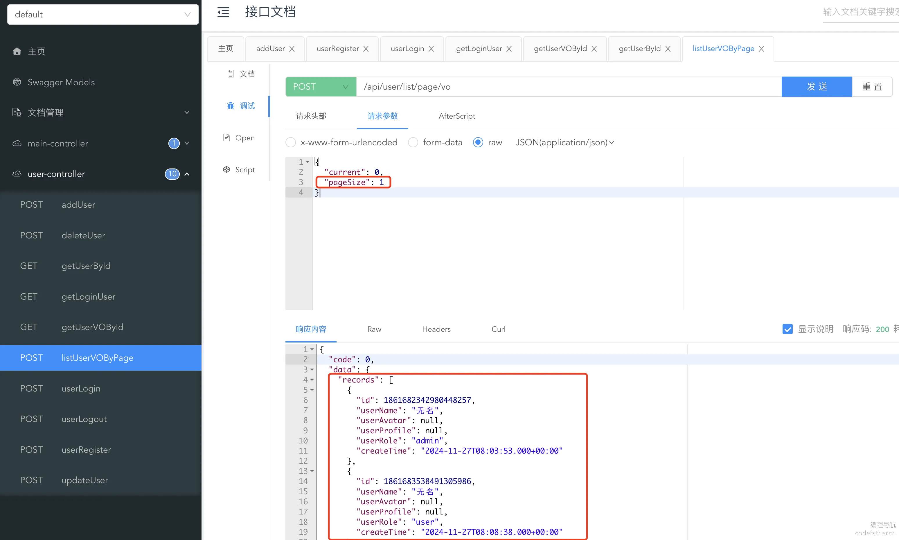

由于我们用的是 MyBatis Plus 来操作数据库，所以需要通过 [官方文档](https://baomidou.com/plugins/pagination/) 来查询解决方案。

查阅后发现，原来必须要配置一个分页插件。**必须要注意，本项目使用的 v3.5.9 版本引入分页插件的方式和之前不同！v3.5.9 版本后需要独立安装分页插件依赖！！！**

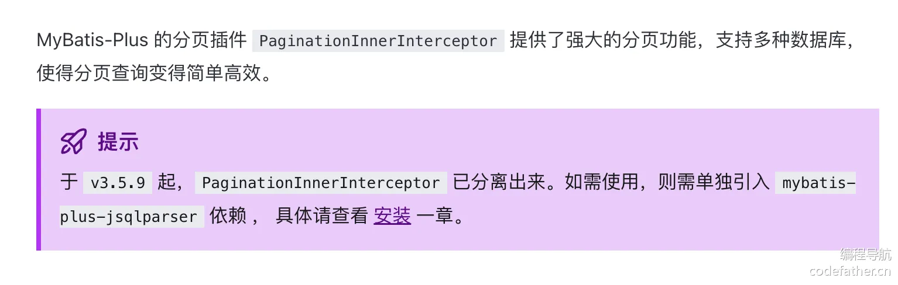

在 pom.xml 中引入分页插件依赖：

```xml
<!-- MyBatis Plus 分页插件 -->
<dependency>
    <groupId>com.baomidou</groupId>
    <artifactId>mybatis-plus-jsqlparser-4.9</artifactId>
</dependency>
```

光引入这一条，大概率是无法成功下载依赖的，还要在 pom.xml 的依赖管理配置中补充 `mybatis-plus-bom`：

```xml
<dependencyManagement>
    <dependencies>
        <dependency>
            <groupId>org.springframework.boot</groupId>
            <artifactId>spring-boot-dependencies</artifactId>
            <version>${spring-boot.version}</version>
            <type>pom</type>
            <scope>import</scope>
        </dependency>
        <dependency>
            <groupId>com.baomidou</groupId>
            <artifactId>mybatis-plus-bom</artifactId>
            <version>3.5.9</version>
            <type>pom</type>
            <scope>import</scope>
        </dependency>
    </dependencies>
</dependencyManagement>
```

依赖下载成功后，在 `config` 包下新建 MyBatis Plus 拦截器配置，添加分页插件：

```java
@Configuration
@MapperScan("com.yupi.yupicturebackend.mapper")
public class MyBatisPlusConfig {

    /**
     * 拦截器配置
     *
     * @return {@link MybatisPlusInterceptor}
     */
    @Bean
    public MybatisPlusInterceptor mybatisPlusInterceptor() {
        MybatisPlusInterceptor interceptor = new MybatisPlusInterceptor();
        // 分页插件
        interceptor.addInnerInterceptor(new PaginationInnerInterceptor(DbType.MYSQL));
        return interceptor;
    }
}
```

重启项目，这次就能正常完成分页了~

#### 5、数据精度修复

但是，在测试中，如果你打开 F12 控制台，利用预览来查看响应数据，就会发现另一个问题：id 的最后两位好像都变成 0 了！6vlRn/br/m8Ymr8D02hZYIBP3pqlW5Sp8qJklXCk9AY=

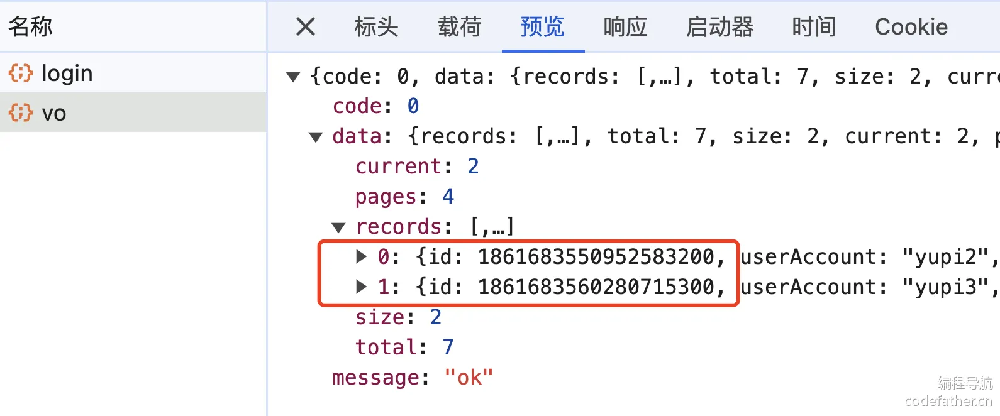

但是在响应中、以及 Swagger 中查看，却是正常的：


这是由于前端 JS 的精度范围有限，我们后端返回的 id 范围过大，导致前端精度丢失，会影响前端页面获取到的数据结果。

为了解决这个问题，可以在后端 `config` 包下新建一个全局 JSON 配置，将整个后端 Spring MVC 接口返回值的长整型数字转换为字符串进行返回，从而集中解决问题。

```java
/**
 * Spring MVC Json 配置
 */
@JsonComponent
public class JsonConfig {

    /**
     * 添加 Long 转 json 精度丢失的配置
     */
    @Bean
    public ObjectMapper jacksonObjectMapper(Jackson2ObjectMapperBuilder builder) {
        ObjectMapper objectMapper = builder.createXmlMapper(false).build();
        SimpleModule module = new SimpleModule();
        module.addSerializer(Long.class, ToStringSerializer.instance);
        module.addSerializer(Long.TYPE, ToStringSerializer.instance);
        objectMapper.registerModule(module);
        return objectMapper;
    }
}
```

重启项目进行测试，这次看到的 id 值就正常了：

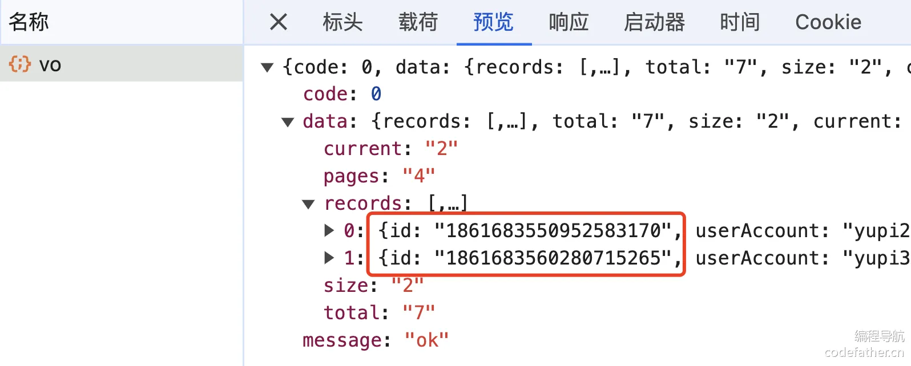

至此，用户相关的后端接口开发完毕，大家可以按需完善上述代码。

## 四、前端开发

### 新建页面和路由

按照下图的结构新建页面文件：

![img]()

修改 router/index.ts 的路由配置：

```typescript
复制代码routes: [
  {
    path: '/',
    name: '主页',
    component: HomePage,
  },
  {
    path: '/user/login',
    name: '用户登录',
    component: UserLoginPage,
  },
  {
    path: '/user/register',
    name: '用户注册',
    component: UserRegisterPage,
  },
  {
    path: '/admin/userManage',
    name: '用户管理',
    component: UserManagePage,
  },
],
```

记得执行一下 openapi 命令生成接口对应的请求代码，每次后端改动时都需要这么做。

### 获取当前登录用户

在之前的教程中，已经创建了前端登录用户的状态管理文件 useLoginUserStore.ts。现在后端提供了获取当前登录用户的接口，直接修改 fetchLoginUser 函数即可：

```typescript
async function fetchLoginUser() {
  const res = await getLoginUserUsingGet()
  if (res.data.code === 0 && res.data.data) {
    loginUser.value = res.data.data
  }
}
```

可以顺便给 loginUser 增加 TypeScript 类型，这样在后续开发时就会有字段提示：cT00UyE1JKn/y8Q147TQRzbDavEs+V72bbBFCS1wu6g=

```typescript
const loginUser = ref<API.LoginUserVO>({
  userName: '未登录',
})
```

之前在 GlobalHeader 中已经编写好显示当前登录用户信息的页面代码：

```typescript
<div class="user-login-status">
  <div v-if="loginUserStore.loginUser.id">
    {{ loginUserStore.loginUser.userName ?? '无名' }}
  </div>
  <div v-else>
    <a-button type="primary" href="/user/login">登录</a-button>
  </div>
</div>
```

### 用户登录页面

开发 UserLoginPage.vue，可以基于 [Ant Design 的表单组件](https://antdv.com/components/form-cn) 快速开发登录页面。

先开发基础页面，可以按照需要增加一些前端校验，代码如下：

```vue
<template>
  <div id="userLoginPage">
    <h2 class="title">鱼皮云图库 - 用户登录</h2>
    <div class="desc">企业级智能协同云图库</div>
    <a-form :model="formState" name="basic" autocomplete="off" @finish="handleSubmit">
      <a-form-item name="userAccount" :rules="[{ required: true, message: '请输入账号' }]">
        <a-input v-model:value="formState.userAccount" placeholder="请输入账号" />
      </a-form-item>
      <a-form-item
        name="userPassword"
        :rules="[
          { required: true, message: '请输入密码' },
          { min: 8, message: '密码不能小于 8 位' },
        ]"
      >
        <a-input-password v-model:value="formState.userPassword" placeholder="请输入密码" />
      </a-form-item>
      <div class="tips">
        没有账号？
        <RouterLink to="/user/register">去注册</RouterLink>
      </div>
      <a-form-item>
        <a-button type="primary" html-type="submit" style="width: 100%">登录</a-button>
      </a-form-item>
    </a-form>
  </div>
</template>
```

定义一个响应式变量来接受表单输入的值：

```typescript
const formState = reactive<API.UserLoginRequest>({
  userAccount: '',
  userPassword: '',
})
```

编写 CSS 样式，美化页面：

```css
#userLoginPage {
  max-width: 360px;
  margin: 0 auto;
}

.title {
  text-align: center;
  margin-bottom: 16px;
}

.desc {
  text-align: center;
  color: #bbb;
  margin-bottom: 16px;
}

.tips {
  margin-bottom: 16px;
  color: #bbb;
  font-size: 13px;
  text-align: right;
}
```

编写表单提交后执行的函数，登陆成功后需要在全局状态中记录当前登录用户的信息，并跳转到主页：bgMhj83Bt96lFcj29lBZCF0o0+YPCGWOWUw0OPyFB/Q=

```typescript
const router = useRouter()
const loginUserStore = useLoginUserStore()

/**
 * 提交表单
 * @param values
 */
const handleSubmit = async (values: any) => {
  const res = await userLoginUsingPost(values)
  // 登录成功，把登录态保存到全局状态中
  if (res.data.code === 0 && res.data.data) {
    await loginUserStore.fetchLoginUser()
    message.success('登录成功')
    router.push({
      path: '/',
      replace: true,
    })
  } else {
    message.error('登录失败，' + res.data.message)
  }
}
```

页面效果如图：

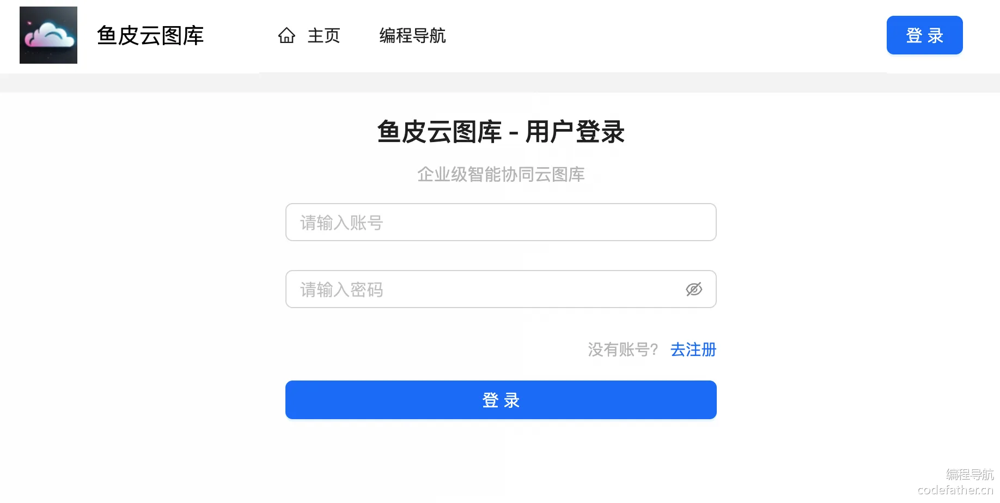

### 用户注册页面

同样使用表单组件，在用户登录页面的基础上调整即可，涉及到更多表单项的填写：

```vue
<template>
  <div id="userRegisterPage">
    <h2 class="title">鱼皮云图库 - 用户注册</h2>
    <div class="desc">企业级智能协同云图库</div>
    <a-form
      :model="formState"
      name="basic"
      label-align="left"
      autocomplete="off"
      @finish="handleSubmit"
    >
      <a-form-item name="userAccount" :rules="[{ required: true, message: '请输入账号' }]">
        <a-input v-model:value="formState.userAccount" placeholder="请输入账号" />
      </a-form-item>
      <a-form-item
        name="userPassword"
        :rules="[
          { required: true, message: '请输入密码' },
          { min: 8, message: '密码不能小于 8 位' },
        ]"
      >
        <a-input-password v-model:value="formState.userPassword" placeholder="请输入密码" />
      </a-form-item>
      <a-form-item
        name="checkPassword"
        :rules="[
          { required: true, message: '请输入确认密码' },
          { min: 8, message: '确认密码不能小于 8 位' },
        ]"
      >
        <a-input-password v-model:value="formState.checkPassword" placeholder="请输入确认密码" />
      </a-form-item>
      <div class="tips">
        已有账号？
        <RouterLink to="/user/login">去登录</RouterLink>
      </div>
      <a-form-item>
        <a-button type="primary" html-type="submit" style="width: 100%">注册</a-button>
      </a-form-item>
    </a-form>
  </div>
</template>
```

定义表单信息变量：

```typescript
const formState = reactive<API.UserRegisterRequest>({
  userAccount: '',
  userPassword: '',
  checkPassword: '',
})
```

编写提交表单函数，可以增加一些前端校验，并且在注册成功后跳转到用户登录页：cT00UyE1JKn/y8Q147TQRzbDavEs+V72bbBFCS1wu6g=

```typescript
const router = useRouter()

/**
 * 提交表单
 * @param values
 */
const handleSubmit = async (values: any) => {
  // 判断两次输入的密码是否一致
  if (formState.userPassword !== formState.checkPassword) {
    message.error('二次输入的密码不一致')
    return
  }
  const res = await userRegisterUsingPost(values)
  // 注册成功，跳转到登录页面
  if (res.data.code === 0 && res.data.data) {
    message.success('注册成功')
    router.push({
      path: '/user/login',
      replace: true,
    })
  } else {
    message.error('注册失败，' + res.data.message)
  }
}
```

页面效果如图：

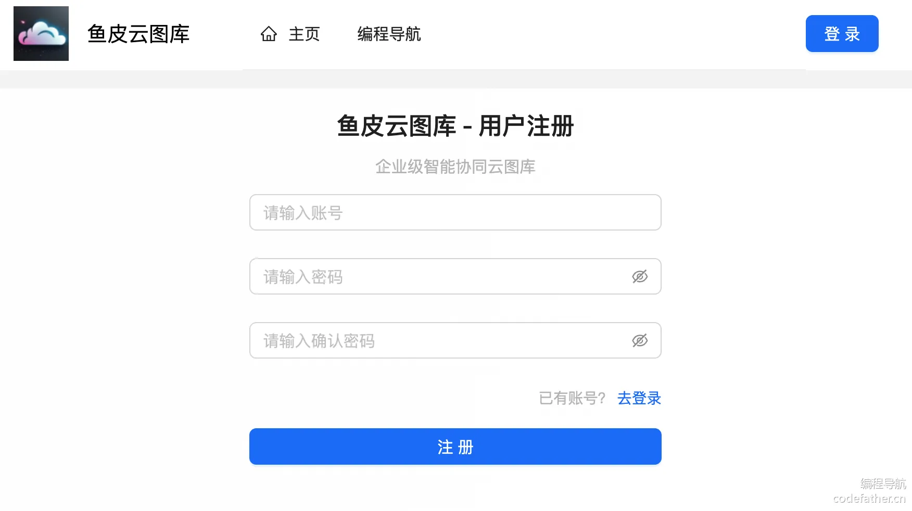

### 用户注销

一般鼠标悬浮在右上角用户头像时，会展示包含用户注销（退出登录）功能的下拉菜单。

先开发页面结构：

```vue
<div v-if="loginUserStore.loginUser.id">
  <a-dropdown>
    <ASpace>
      <a-avatar :src="loginUserStore.loginUser.userAvatar" />
      {{ loginUserStore.loginUser.userName ?? '无名' }}
    </ASpace>
    <template #overlay>
      <a-menu>
        <a-menu-item @click="doLogout">
          <LogoutOutlined />
          退出登录
        </a-menu-item>
      </a-menu>
    </template>
  </a-dropdown>
</div>
```

编写用户注销事件函数，退出登录后跳转到登录页：

```typescript
// 用户注销
const doLogout = async () => {
  const res = await userLogoutUsingPost()
  console.log(res)
  if (res.data.code === 0) {
    loginUserStore.setLoginUser({
      userName: '未登录',
    })
    message.success('退出登录成功')
    await router.push('/user/login')
  } else {
    message.error('退出登录失败，' + res.data.message)
  }
}
```

效果如图：

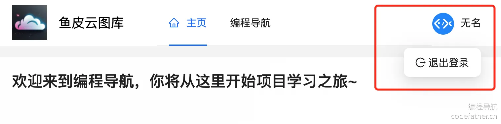

### 用户管理页面

需求：允许管理员查看已注册的用户信息，能够根据用户名称搜索用户、并删除非法用户。

需要注意，要防止普通用户也能看到用户信息，所以要增加一定的权限控制，可以分为页面开发和权限控制两个步骤来实现。

编写页面：上方搜索栏，下方表格，表格需要支持分页。

我们可以拆分为几个步骤来开发：

#### 1、表格

1）利用 [Ant Design 的表格组件](https://antdv.com/components/table-cn#components-table-demo-basic)，找到需要的组件进行复制，先展示全部用户信息。bgMhj83Bt96lFcj29lBZCF0o0+YPCGWOWUw0OPyFB/Q=

![img]()

2）只需要根据自己的数据表，编写 columns 表格列，并传入获取到的 data 数据，组件就能自动帮我们展示出表格，非常方便。

定义表格列：

```typescript
const columns = [
  {
    title: 'id',
    dataIndex: 'id',
  },
  {
    title: '账号',
    dataIndex: 'userAccount',
  },
  {
    title: '用户名',
    dataIndex: 'userName',
  },
  {
    title: '头像',
    dataIndex: 'userAvatar',
  },
  {
    title: '简介',
    dataIndex: 'userProfile',
  },
  {
    title: '用户角色',
    dataIndex: 'userRole',
  },
  {
    title: '创建时间',
    dataIndex: 'createTime',
  },
  {
    title: '更新时间',
    dataIndex: 'updateTime',
  },
  {
    title: '操作',
    key: 'action',
  },
]
```

3）从后端获取数据：

```typescript
// 数据
const dataList = ref([])
const total = ref(0)

// 搜索条件
const searchParams = reactive<API.UserQueryRequest>({
  current: 1,
  pageSize: 10,
})

// 获取数据
const fetchData = async () => {
  const res = await listUserVoByPageUsingPost({
    ...searchParams
  })
  if (res.data.data) {
    dataList.value = res.data.data.records ?? []
    total.value = res.data.data.total ?? 0
  } else {
    message.error('获取数据失败，' + res.data.message)
  }
}

// 页面加载时请求一次
onMounted(() => {
  fetchData()
})
```

注意，上述代码中，使用 onMounted 包裹获取数据的函数，可以使得在页面加载时仅发送一次请求，避免重复获取。

运行，可以看到数据被正常加载，但是显然展示效果并不好。

4）对于图片、用户角色、创建时间、更新时间之类的数据，我们可以有更好的展示方式。bgMhj83Bt96lFcj29lBZCF0o0+YPCGWOWUw0OPyFB/Q=

表格组件支持我们使用 Vue 的插槽自定义列的展示，参考 Demo 有样学样修改即可。

```tsx
<template #bodyCell="{ column, record }">
  <template v-if="column.dataIndex === 'userAvatar'">
    <a-image :src="record.userAvatar" :width="120" />
  </template>
  <template v-else-if="column.dataIndex === 'userRole'">
    <div v-if="record.userRole === 'admin'">
      <a-tag color="green">管理员</a-tag>
    </div>
    <div v-else>
      <a-tag color="blue">普通用户</a-tag>
    </div>
  </template>
  <template v-else-if="column.dataIndex === 'createTime'">
    {{ dayjs(record.createTime).format('YYYY-MM-DD HH:mm:ss') }}
  </template>
  <template v-else-if="column.key === 'action'">
    <a-button danger>删除</a-button>
  </template>
</template>
```

效果如图：

![img]()

#### 2、分页

1）表格组件 [支持分页](https://antdv.com/components/table-cn#pagination)，首先编写一个分页变量，指定当前页号、页面大小、数据总数、展示总数的文案等参数：6vlRn/br/m8Ymr8D02hZYIBP3pqlW5Sp8qJklXCk9AY=

```typescript
// 分页参数
const pagination = computed(() => {
  return {
    current: searchParams.current ?? 1,
    pageSize: searchParams.pageSize ?? 10,
    total: total.value,
    showSizeChanger: true,
    showTotal: (total) => `共 ${total} 条`,
  }
})
```

注意，由于这些参数都是动态变化的，需要使用 Vue 的 computed 计算属性，否则当 searchParams 改变时，分页参数并不会更新。

2）编写 doTableChange 函数，当用户切换页号和页面大小时，需要更新 searchParams 搜索条件的值，并触发搜索：p87QUult0bZDR05AO5soQVixQ5nCQ+HA+P5tLSHK/hI=

```typescript
// 表格变化处理
const doTableChange = (page: any) => {
  searchParams.current = page.current
  searchParams.pageSize = page.pageSize
  fetchData()
}
```

3）给表格组件绑定分页参数和表格切换事件：

```tsx
<a-table
  :columns="columns"
  :data-source="dataList"
  :pagination="pagination"
  @change="doTableChange"
>
```

效果如图：

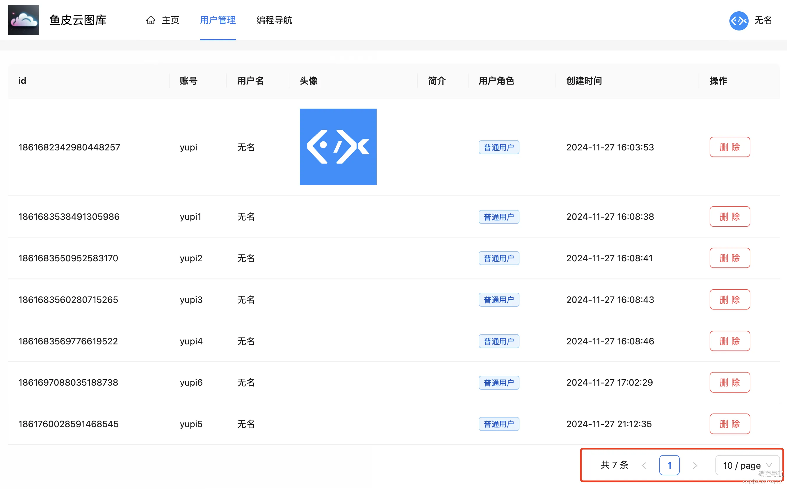

#### 3、搜索

利用 [Ant Design 的搜索组件](https://antdv.com/components/input-cn#components-input-demo-search-input)，实现对数据的搜索。

1）其实搜索本质上就是让用户填写搜索条件表单，此处我们需要根据账号和用户昵称搜索，编写表单代码：

```tsx
<a-form layout="inline" :model="searchParams" @finish="doSearch">
  <a-form-item label="账号">
    <a-input v-model:value="searchParams.userAccount" placeholder="输入账号" />
  </a-form-item>
  <a-form-item label="用户名">
    <a-input v-model:value="searchParams.userName" placeholder="输入用户名" />
  </a-form-item>
  <a-form-item>
    <a-button type="primary" html-type="submit">搜索</a-button>
  </a-form-item>
</a-form>
```

使用 searchParams 接受用户的输入，相当于所有的搜索条件全部存到了 seachParams 中，便于统一维护。

2）点击搜索按钮时会触发表单提交，表单提交时需要将页号重置为 1，并获取数据。编写对应的函数：

```tsx
// 获取数据
const doSearch = () => {
  // 重置页码
  searchParams.current = 1
  fetchData()
}
```

效果如图：

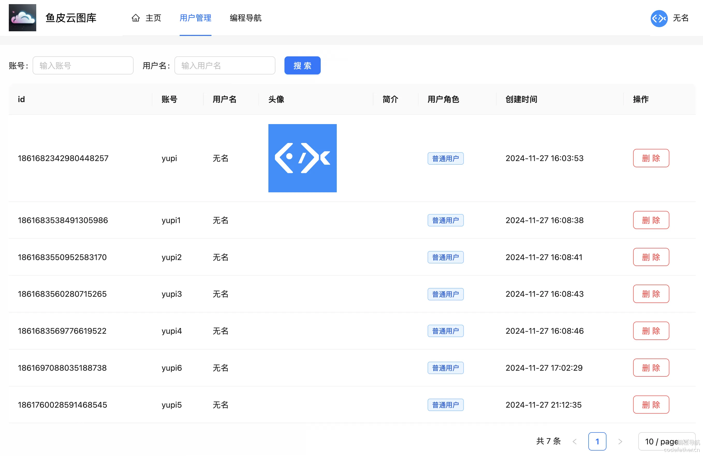

#### 4、操作

比如开发删除功能，先编写点击删除按钮后的处理函数：

```typescript
// 删除数据
const doDelete = async (id: string) => {
  if (!id) {
    return
  }
  const res = await deleteUserUsingPost({ id })
  if (res.data.code === 0) {
    message.success('删除成功')
    // 刷新数据
    fetchData()
  } else {
    message.error('删除失败')
  }
}
```

然后给删除按钮绑定事件：

```tsx
<a-button danger @click="doDelete(record.id)">删除</a-button>
```

### 用户权限控制

虽然后端获取用户列表的接口做了权限校验，防止非管理员用户获取到。但一般情况下，为了保证系统安全和提升用户体验，前端也需要对权限进行控制。bgMhj83Bt96lFcj29lBZCF0o0+YPCGWOWUw0OPyFB/Q=

有 2 种实现方式：单页面控制权限，或者全局控制权限。

思路都是一致的，在进入某个页面时判断用户是否具有该页面的权限，无非是把权限校验相关的代码写在单个页面内，还是写到一个独立的文件中罢了。

**建议编写独立的全局权限控制文件。**可以利用 Vue Router 的路由守卫实现，每次切换并进入页面前，都会检查一下当前用户是否具有特定页面的权限。

在 src 下编写 access.ts 权限校验文件，可以自己定义逻辑，比如用页面前缀来统一判断：

```tsx
import { useLoginUserStore } from '@/stores/useLoginUserStore'
import { message } from 'ant-design-vue'
import router from '@/router'

// 是否为首次获取登录用户
let firstFetchLoginUser = true;

/**
 * 全局权限校验
 */
router.beforeEach(async (to, from, next) => {
  const loginUserStore = useLoginUserStore()
  let loginUser = loginUserStore.loginUser
  // 确保页面刷新，首次加载时，能够等后端返回用户信息后再校验权限
  if (firstFetchLoginUser) {
    await loginUserStore.fetchLoginUser()
    loginUser = loginUserStore.loginUser
    firstFetchLoginUser = false;
  }
  const toUrl = to.fullPath
  if (toUrl.startsWith('/admin')) {
    if (!loginUser || loginUser.userRole !== 'admin') {
      message.error('没有权限')
      next(`/user/login?redirect=${to.fullPath}`)
      return
    }
  }
  next()
})
```

注意，上述代码中，我们为了确保页面刷新时，从后端拿到用户信息后再进行权限校验，使用 await 等待后端接口返回，并重新赋值给 loginUser。同时，为了防止每次切换路由都从远程获取用户信息，定义了 firstFetchLoginUser 变量，用于控制在刷新页面后只会请求后端一次。

💡 由于在 access.ts 中已经获取到了登录用户信息，可以移除掉之前在 App.vue 中获取登录用户信息的逻辑，避免重复请求。

在 main.ts（全局入口文件）中引入：

```tsx
import '@/access'
```

用一个未登录的用户来测试，尝试访问用户管理页面，会报权限错误并跳转到登录页：

![img]()

虽然已经满足了需求，但是如果用户不是管理员，其实也不应该看到 “用户管理” 菜单。因此我们还要修改 GlobalHeader 菜单项配置，根据权限决定是否展示某些菜单项。

编写一个过滤菜单项的函数：

```tsx
// 菜单列表
const originItems = [
  {
    key: '/',
    icon: () => h(HomeOutlined),
    label: '主页',
    title: '主页',
  },
  {
    key: '/admin/userManage',
    label: '用户管理',
    title: '用户管理',
  },
  {
    key: 'others',
    label: h('a', { href: 'https://www.codefather.cn', target: '_blank' }, '编程导航'),
    title: '编程导航',
  },
]

// 过滤菜单项
const filterMenus = (menus = [] as MenuProps['items']) => {
  return menus?.filter((menu) => {
    if (menu.key.startsWith('/admin')) {
      const loginUser = loginUserStore.loginUser
      if (!loginUser || loginUser.userRole !== "admin") {
        return false
      }
    }
    return true
  })
}

// 展示在菜单的路由数组
const items = computed<MenuProps['items']>(() => filterMenus(originItems))
```

测试效果，未登录时不会看到 “用户管理” 菜单：

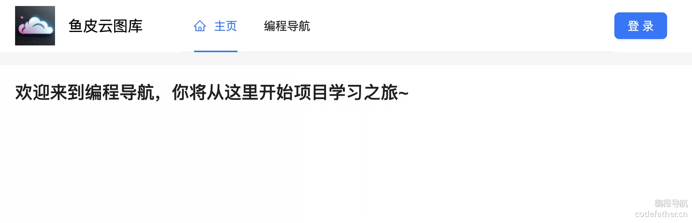

### 扩展

#### 1、编辑用户信息

1）目前的用户管理页面还不支持编辑功能，前端可以利用 [组件库文档](https://antdv.com/components/table-cn#components-table-demo-edit-row) 的编辑行能力快速完成。

2）目前用户无法编辑个人的信息，可以在右上角增加 “个人中心 / 个人设置”，点击后进入编辑用户信息的表单。

#### 2、全局权限管理

在本节 “用户权限控制” 部分，我们使用了一种较为简单的方式实现，但是，后续补充页面和权限校验逻辑时，我们要同时修改权限管理文件和导航栏文件，相当于维护了 2 个文件，比较麻烦，有没有更好的办法呢？

需求：能够通过维护 **一个配置文件**，灵活配置每个页面所需要的用户权限，由全局权限管理系统自动校验和拦截，而不需要在每个页面中编写权限校验代码，提高开发效率。此外，还能根据该配置文件自动隐藏没权限的菜单项的展示。

实现方案：

1. 在路由配置文件，利用 Vue Router 的 meta 附加参数，定义某个路由的访问权限
2. 使用全局路由监听器，每次访问页面时，根据用户要访问页面的路由权限信息，判断用户是否有对应的访问权限，并进行相应的拦截处理。

需要先自行新建 NoAuth 无权限页面，内容随便写，比如显示 “你没有权限”。

新建 access 目录，所有权限管理相关的代码都放在该目录下，模块化。只要不引入，就不会生效。sqWmWUk8kFL4uPey9+8ro5dv7g8fCeOwW9uL7T8/Q4k=

1）定义权限枚举文件 accessEnum.ts：

```typescript
▼typescript复制代码/**
 * 权限定义
 */
const ACCESS_ENUM = {
  NOT_LOGIN: "notLogin",
  USER: "user",
  ADMIN: "admin",
};

export default ACCESS_ENUM;
```

2）修改路由配置文件，在 meta 中补充需要的权限：

```typescript
{
  path: '/admin/userManage',
  name: 'adminUserManage',
  component: UserManagePage,
  meta: {
    access: ACCESS_ENUM.ADMIN,
  },
},
```

3）编写通用的权限校验方法。

Q：为什么？

A：因为菜单组件中要判断权限来过滤展示的菜单项、权限拦截也要用到权限判断功能，所以抽离成公共模块。

checkAccess.ts 文件：

```typescript
import ACCESS_ENUM from "@/access/accessEnum";

/**
 * 检查权限（判断当前登录用户是否具有某个权限）
 * @param loginUser 当前登录用户
 * @param needAccess 需要有的权限
 * @return boolean 有无权限
 */
const checkAccess = (loginUser: any, needAccess = ACCESS_ENUM.NOT_LOGIN) => {
  // 获取当前登录用户具有的权限（如果没有 loginUser，则表示未登录）
  const loginUserAccess = loginUser?.userRole ?? ACCESS_ENUM.NOT_LOGIN;
  if (needAccess === ACCESS_ENUM.NOT_LOGIN) {
    return true;
  }
  // 如果用户登录才能访问
  if (needAccess === ACCESS_ENUM.USER) {
    // 如果用户没登录，那么表示无权限
    if (loginUserAccess === ACCESS_ENUM.NOT_LOGIN) {
      return false;
    }
  }
  // 如果需要管理员权限
  if (needAccess === ACCESS_ENUM.ADMIN) {
    // 如果不为管理员，表示无权限
    if (loginUserAccess !== ACCESS_ENUM.ADMIN) {
      return false;
    }
  }
  return true;
};

export default checkAccess;
```

4）编写全局权限校验核心文件 `access/index.ts`。

逻辑如下：

1. 首先判断页面是否需要登录权限，如果不需要，直接放行。
2. 如果页面需要登录权限
   1. 如果用户未登录，则跳转到登录页面。
   2. 如果已登录，判断登录用户的权限是否符合要求，否则跳转到 401 无权限页面。

实现代码如下：

```typescript
import router from '@/router'
import { useLoginUserStore } from '@/stores/useLoginUserStore'
import ACCESS_ENUM from './accessEnum'
import checkAccess from './checkAccess'

router.beforeEach(async (to, from, next) => {
  const loginUserStore = useLoginUserStore()
  let loginUser = loginUserStore.loginUser
  console.log('登陆用户信息', loginUser)
  const needAccess = (to.meta?.access as string) ?? ACCESS_ENUM.NOT_LOGIN
  // 要跳转的页面必须要登陆
  if (needAccess !== ACCESS_ENUM.NOT_LOGIN) {
    // 如果没登陆，跳转到登录页面
    if (!loginUser || !loginUser.userRole || loginUser.userRole === ACCESS_ENUM.NOT_LOGIN) {
      next(`/user/login?redirect=${to.fullPath}`)
      return
    }
    // 如果已经登陆了，但是权限不足，那么跳转到无权限页面
    if (!checkAccess(loginUser, needAccess)) {
      next('/noAuth')
      return
    }
  }
  next()
})
```

注意，必须保证 pinia 初始化在这段代码执行前，所以需要将 `useLoginUserStore()` 函数放到 `router.beforeEach` 参数里。bgMhj83Bt96lFcj29lBZCF0o0+YPCGWOWUw0OPyFB/Q=

参考：https://pinia.vuejs.org/core-concepts/outside-component-usage.html

在 main.ts 中引入，即可生效权限校验：

```plain
import "@/access";
```

5）支持全局自动登录。如果是 **首次 **进入页面，状态为未登陆，则自动登录。

如何区别是否为首次进入页面（还没尝试过获取登录用户）呢？

默认的 loginUser 是没有 userRole 的，只要获取过，哪怕未登录，也可以给设置一个 userRole 为 "notLogin"。6vlRn/br/m8Ymr8D02hZYIBP3pqlW5Sp8qJklXCk9AY=

在 `access/index.ts` 开头补充自动登录逻辑

```typescript
// // 如果之前没登陆过，自动登录
if (!loginUser || !loginUser.userRole) {
  // 加 await 是为了等用户登录成功之后，再执行后续的代码
  await loginUserStore.fetchLoginUser();
  loginUser = loginUserStore.loginUser;
}
```

之后记得移除 App.vue 中获取登录信息的调用。

6）根据权限控制菜单显隐。

需求：只有具有权限的菜单，才对用户可见

原理：/MBNmaRtUhzDE9b4tB/jsqs1ClvvhzK+S4KVLPihc/I=

1. 遍历原菜单项列表，针对菜单 key 对应的 path 路径，找到路由中对应的 meta 权限配置。只要判断用户没有这个权限，就直接过滤掉。
2. 还可以通过在路由配置的 meta 中添加 hideInMenu，灵活控制菜单的显隐。

修改 GlobalHeader 全局导航栏（通用菜单）组件，补充根据权限来过滤菜单的逻辑，可自行实现。

```typescript
// 过滤菜单项
const items = menus.filter((menu) => {
  // todo 需要自己实现 menu 到路由 item 的转化
  const item = menuToRouteItem(menu);
  if (item.meta?.hideInMenu) {
    return false;
  }
  // 根据权限过滤菜单，有权限则返回 true，则保留该菜单
  return checkAccess(loginUserStore.loginUser, item.meta?.access as string);
});
```