[TOC]

# 项目地址

项目地址 https://github.com/SpringSunYY/yp_picture 

# 1 - 项目总览

## 一、项目介绍 - 鱼图图

基于 Vue 3 + Spring Boot + COS + WebSocket 的 **企业级智能协同云图库平台**。

平台的核心功能可分为 4 大类：

1）所有用户都可以在平台公开上传和检索图片素材，快速找到需要的图片。可用作表情包网站、设计素材网站、壁纸网站等：


2）管理员可以上传、审核和管理图片，并对系统内的图片进行分析：p87QUult0bZDR05AO5soQVixQ5nCQ+HA+P5tLSHK/hI=


3）对于个人用户，可将图片上传至私有空间进行批量管理、检索、编辑和分析，用作个人网盘、个人相册、作品集等：


4）对于企业，可开通团队空间并邀请成员，共享图片并实时协同编辑图片，提高团队协作效率。可用于提供商业服务，如企业活动相册、企业内部素材库等：


该项目功能丰富，涉及文件存管、内容检索、权限控制、实时协同等企业主流业务场景，并运用多种编程思想、架构设计方法和优化策略来保证项目的高速迭代和稳定运行。

有业务、有技术，从 0 到 1 的真实企业级（商业级）项目设计开发，绝对让你收获满满！

### 项目三大阶段

为了帮大家循序渐进地学习，鱼皮将项目设计为三个阶段，可以根据自己的时间和水平按需学习。

1）第一阶段，开发公共的图库平台。实战 Vue 3 + Spring Boot 图片素材网站的快速开发，学习文件存管业务的开发和优化技巧。

成果：可用作表情包网站、设计素材网站、壁纸网站等


2）第二阶段，对项目 C 端功能进行大量扩展。用户可开通私有空间，并对空间图片进行多维检索、扫码分享、批量管理、快速编辑、用量分析。该阶段涉及大量主流业务功能开发，能学到很多业务知识和开发经验。

成果：可用作个人网盘、个人相册、作品集等


3）第三阶段，对项目 B 端功能进行大量扩展。企业可开通团队空间，邀请和管理空间成员，团队内共享图片并实时协同编辑图片。该阶段涉及大量商业项目的应用场景，能学到很多架构设计和项目优化的技巧。

成果：可用于提供商业服务，如企业活动相册、企业内部素材库等


## 二、项目优势

### 项目收获

本项目选题新颖、功能丰富、业务真实、应用广泛。区别于增删改查的 “烂大街” 项目，鱼皮会带你实战大量新技术和商业应用场景，掌握层层递进的系统设计、项目扩展和优化方案，给你的简历大幅增加竞争力。

鱼皮给大家讲的都是 **通用的项目开发方法和架构设计套路**，从这个项目中你可以学到：

- 如何拆解复杂业务，从 0 开始设计实现企业级系统？
- 如何巧用 RBAC 权限模型和框架实现复杂权限控制？
- 如何结合 Redis + Caffeine 构建高性能多级缓存？
- 如何实现文件的高效存储，并通过十几种策略进行优化？
- 如何使用高级数据结构 Disruptor 无锁队列提升并发性能？
- 如何使用 ShardingSphere 实现动态扩容的分库分表？
- 如何使用 WebSocket 多端通信，实现企业级实时协作功能？
- 如何接入 AI 绘图大模型，实现更多高级图片处理能力？
- 如何使用 DDD 架构实现大型企业级项目？
- 如何快速部署上线项目？

此外，还能学会很多作图、思考问题、对比方案的方法，提升排查问题、自主解决 Bug 的能力。鱼皮还给大家提供了大量的项目扩展点，有能力的同学可以进一步拉开和别人的区分度，无限进步！

### 鱼皮系列项目优势

鱼皮原创项目系列以 **实战** 为主，用 **全程直播** 的方式，**从 0 到 1 ** 带大家学习技术知识，并立即实践运用到项目中，做到学以致用。

此外，还提供如下服务：

- 详细的文字教程或直播笔记
- 完整的项目源码
- 1 对 1 答疑解惑
- 专属项目交流群
- ⭐️ 现成的简历写法（直接写满简历）
- ⭐️ 项目的扩展思路（拉开和其他人的差距）
- ⭐️ 项目相关面试题、题解和真实面经（提前准备，面试不懵逼）
- ⭐️ 前端 + Java 后端万用项目模板（快速创建项目）

比起看网上的教程学习，鱼皮项目系列的优势：从学知识 => 实践项目 => 复习笔记 => 项目答疑 => 简历写法 => 面试题解的一条龙服务

从需求分析、技术选型、项目设计、项目初始化、Demo 编写、前后端开发实现、项目优化、部署上线等，每个环节我都 **从理论到实践** 给大家讲的明明白白、每个细节都不放过！

| 对比维度 | 跟学鱼皮项目                                                 | 自学网上免费项目                                             | ⭐️ 鱼皮项目优势               |
| -------- | ------------------------------------------------------------ | ------------------------------------------------------------ | ---------------------------- |
| 项目选题 | ✅ 选题新颖，刻意避开网上热门项目                             | 传统项目场景（博客、商城、管理系统）                         | 增加区分度，提高简历通过率   |
| 学习人数 | ✅ 少，不容易撞车                                             | 百万以上，烂大街                                             | 增加区分度，提高简历通过率   |
| 教学方式 | ✅ 全程直播，带你敲每一行代码、带你踩坑和解决 Bug，不漏过每一个细节 | 录制课程，视频虽然看起来简短、一帆风顺，但你遇到错误无从下手 | 降低学习门槛，减少学习时长   |
| 直播笔记 | ✅ 详细的官方笔记 + 精选学员优质笔记                          | 有笔记，但未经筛选                                           | 学到更多知识细节             |
| 视频内容 | ✅ 项目教程 + 经验分享                                        | 项目教程                                                     | 学到更多编程经验             |
| 项目源码 | ✅ 完整源码仓库 + 每章的提交记录 + 定期更新                   | 只有代码包、不更新                                           | 节省时间，避免踩坑           |
| 项目答疑 | ✅ 各项目交流群 + 答疑解惑 + 常见问题整理                     | 无免费的答疑服务，遇到问题自行解决                           | 节省时间                     |
| 简历写法 | ✅ 现成的简历写法                                             | 无                                                           | 节省时间、提高简历通过率     |
| 项目扩展 | ✅ 给出扩展思路 + 学员作品共享                                | 无                                                           | 开拓思路、拉开和其他人的差距 |
| 项目面试 | ✅ 项目相关面试题、题解和真实面经                             | 无                                                           | 提前准备，面试不懵逼         |

编程导航已有 **10 多套项目教程！**每个项目的学习重点不同，几乎全都是前端 + 后端的 **全栈项目** 。

详细请见：[https://codefather.cn/course](https://www.codefather.cn/course)（在该页面右侧有教程推荐和学习建议）Kvj0N9UsvjnA2JCtBYVVlZvRih721R4WfPhhdfsvDfk=

往期项目介绍视频：[https://bilibili.com/video/BV1YvmbYbEgS](https://www.bilibili.com/video/BV1YvmbYbEgS/)

## 三、核心业务流程

### 第一阶段 - 公共图库平台


### 第二阶段 - 用户私有图库


### 第三阶段 - 团队共享图库


## 四、项目功能梳理

### 第一阶段 - 公共图库平台

#### 用户模块

- 用户登录
- 用户注册
- 用户注销
- 用户权限控制
- 【管理员】管理用户

#### 图片模块

- 【管理员】上传创建图片
- 【管理员】图片信息编辑（标签 / 分类等）
- 【管理员】管理图片
- 查看和搜索图片列表
- 查看图片详情（进入图片详情页）
- 图片下载
- 用户上传创建图片
- 【管理员】审核图片
- 导入图片
- - 通过 URL 导入图片
  - 【管理员】批量抓取和创建图片
- 【优化】图片查询优化 - 分布式缓存、本地缓存、多级缓存
- 【优化】图片上传优化 - 压缩、秒传、分片上传、断点续传
- 【优化】图片加载优化 - 懒加载、缩略图、CDN 加速、浏览器缓存
- 【优化】图片存储优化 - 降频存储（冷热数据分离）、清理策略

### 第二阶段 - 用户私有图库

#### 空间模块

- 【管理员】管理空间
- 用户开通私有空间
- 私有空间权限控制
- 空间级别和限额控制
- 空间图库分析
- - 用户空间图库分析
  - 【管理员】全空间分析

#### 图片模块

- 图片搜索
- - 基础属性搜索
  - 以图搜图
  - 颜色搜索
- 图片分享
- - 链接分享
  - 扫码分享
- 图片批量管理
- - 批量修改信息
  - 批量重命名
- 图片编辑
- - 基础图片编辑
  - AI 图片编辑

### 第三阶段 - 团队共享图库

#### 空间模块

- 创建团队共享空间
- 空间成员管理
- - 成员邀请
  - 设置权限
- 空间成员权限控制

#### 图片模块

- 图片协同编辑

## 五、技术选型

### 后端

- Java Spring Boot 框架
- MySQL 数据库 + MyBatis-Plus 框架 + MyBatis X
- Redis 分布式缓存 + Caffeine 本地缓存
- Jsoup 数据抓取
- ⭐️ COS 对象存储
- ⭐️ ShardingSphere 分库分表
- ⭐️ Sa-Token 权限控制
- ⭐️ DDD 领域驱动设计
- ⭐️ WebSocket 双向通信
- ⭐️ Disruptor 高性能无锁队列
- ⭐️ JUC 并发和异步编程
- ⭐️ AI 绘图大模型接入
- ⭐️ 多种设计模式的运用
- ⭐️ 多角度项目优化：性能、成本、安全性等

### 前端

- Vue 3 框架
- Vite 打包工具
- Ant Design Vue 组件库
- Axios 请求库
- Pinia 全局状态管理
- 其他组件：数据可视化、图片编辑等
- ⭐️ 前端工程化：ESLint + Prettier + TypeScript
- ⭐️ OpenAPI 前端代码生成

## 六、架构设计


## 新建代码仓库

搭建仓库，点 star 的都是精神股东

代码仓库：https://github.com/liyupi/yu-picture

## 教程计划

### 第一阶段 - 公共图库平台

第 1 期：项目介绍。包括介绍项目背景、项目优势、核心业务流程、项目功能、技术选型、架构设计、教程计划等。

第 2 期：项目初始化

- 后端项目初始化
- 前端项目初始化

第 3 期：用户模块开发（前后端）

- 用户登录
- 用户注册
- 用户注销
- 用户权限控制
- 用户管理

第 4 期：图片模块开发（前后端）

- 【管理员】图片上传和创建
- 【管理员】管理图片
- 【管理员】图片信息编辑（标签 / 分类等）
- 查看和搜索图片列表
- 查看图片详情（进入图片详情页）
- 图片下载

第 5 期：用户上传图片模块（前后端）

- 用户上传创建图片
- 【管理员】审核图片
- 导入图片
- - 通过 URL 导入图片
  - 【管理员】批量抓取和创建图片

第 6 期：图片优化

- 图片查询优化 - 分布式缓存、本地缓存、多级缓存
- 图片上传优化 - 压缩、秒传、分片上传、断点续传
- 图片加载优化 - 懒加载、缩略图、CDN 加速、浏览器缓存
- 图片存储优化 - 降频存储（冷热数据分离）、清理策略

### 第二阶段 - 用户私有图库

第 7 期：空间模块开发

- 【管理员】管理空间
- 用户开通私有空间
- 私有空间权限控制
- 空间级别和限额控制

第 8 期：图片功能扩展

- 图片搜索
- - 基础属性搜索
  - 以图搜图
  - 颜色搜索
- 图片分享
- - 链接分享
  - 扫码分享
- 图片批量管理
- - 批量修改信息
  - 批量重命名

第 9 期：图片编辑能力

- 图片编辑
- - 基础图片编辑
  - AI 图片编辑

第 10 期：空间图片分析

- 空间图库分析
- - 用户空间图库分析
  - 【管理员】全空间分析

### 第三阶段 - 团队共享图库

第 11 期：团队共享空间

- 创建团队共享空间
- 空间成员管理
- - 成员邀请
  - 设置权限
- 空间成员权限控制

第 12 期：图片协同编辑

第 13 期：DDD 项目改造

第 14 期：项目部署上线


# 2 - 项目初始化

## 本节重点

从 0 开始搭建后端和前端项目，会后续正式开发项目打好基础。

包括：

- 后端项目初始化
- 前端项目初始化

本节教程的后端和前端互不影响，可以按需独立学习，建议优先学习自己求职方向的内容。

## 一、后端项目初始化

### 环境准备

1）安装的 JDK 版本必须是 8、11 或 17，**不能超过 17！**

推荐使用 11 版本，因为后续可能要用到的缓存库 Caffeine 要求使用 11 版本。

可参考视频安装 JDK：https://www.bilibili.com/video/BV14SUNYREv8

2）MySQL 数据库最好安装 8.x 版本，或者 5.7 版本。

### 新建项目

在 IDEA 中新建项目，选择 Spring Initializr 模板，考虑到稳定性，此处选择创建 Java 8 版本的项目。

注意需要替换 Server URL 为 https://start.aliyun.com/，因为官方的 Server URL 不支持选择 Java 8。

配置如图：


选择 Spring Boot 2.7.6 版本，可以根据自己的需要添加一些依赖，比如 Spring Web、MyBatis、MySQL、Lombok：


> 当然，后续通过修改 Maven 配置添加依赖也是可以的。

点击创建，就得到了一个 Spring Boot 项目，需要等待 Maven 为我们安装依赖。

安装完依赖后，先尝试启动一下项目，结果会报错：


因为我们在 Maven 中引入了 MySQL 依赖，但是项目配置文件中并没有填写 MySQL 的配置。

修改资源目录下的配置文件为 `application.yml`，指定项目启动的端口号和访问地址前缀、项目名称、数据库配置等。代码如下：

```yaml
server:
  port: 8123
  servlet:
    context-path: /api
spring:
  application:
    name: yu-picture-backend
  # 数据库配置
  datasource:
    driver-class-name: com.mysql.cj.jdbc.Driver
    url: jdbc:mysql://localhost:3306/yu_picture
    username: root
    password: 123456
```

这次项目就可以正常启动了：


### 整合依赖

接下来我们要整合一些开发项目常用的依赖。

#### 1、MyBatis Plus 数据库操作

MyBatis Plus 是 MyBatis 的增强工具，旨在简化开发流程。它提供了开箱即用的 CRUD 方法、动态查询构造器、分页插件和代码生成器等功能，大幅减少重复代码，同时保持与 MyBatis 原生功能的兼容性。例如，通过调用 `baseMapper.selectById(id)`，可以直接查询数据库中的记录，而无需手动编写 SQL。

参考官方文档引入：https://baomidou.com/getting-started/#spring-boot2

在 Maven 的 pom.xml 中添加依赖：

```xml
<dependency>
    <groupId>com.baomidou</groupId>
    <artifactId>mybatis-plus-boot-starter</artifactId>
    <version>3.5.9</version>
</dependency>
```

**注意，添加该依赖后，记得移除 MyBatis 相关的依赖！否则很容易导致版本冲突！！！**


在项目中新建 mapper 包，后续用于存放操作数据库的 Mapper 类，然后在项目启动类中添加扫描 Mapper 的 `@MapperScan` 注解：

```java
@SpringBootApplication
@MapperScan("com.yupi.yupicturebackend.mapper")
public class YuPictureBackendApplication {

    public static void main(String[] args) {
        SpringApplication.run(YuPictureBackendApplication.class, args);
    }

}
```

在 application.yml 中追加配置，开启日志和逻辑删除功能：

```yaml
mybatis-plus:
  configuration:
    map-underscore-to-camel-case: false
    # 仅在开发环境开启日志
    log-impl: org.apache.ibatis.logging.stdout.StdOutImpl
  global-config:
    db-config:
      logic-delete-field: isDelete # 全局逻辑删除的实体字段名
      logic-delete-value: 1 # 逻辑已删除值（默认为 1）
      logic-not-delete-value: 0 # 逻辑未删除值（默认为 0）
```

#### 2、Hutool 工具库

Hutool 是主流的 Java 工具类库，集合了丰富的工具类，涵盖字符串处理、日期操作、文件处理、加解密、反射、正则匹配等常见功能。它的轻量化和无侵入性让开发者能够专注于业务逻辑而不必编写重复的工具代码。例如，`DateUtil.formatDate(new Date())` 可以快速将当前日期格式化为字符串。

参考官方文档引入：[https://doc.hutool.cn/pages/index/#%F0%9F%8D%8Amaven](https://doc.hutool.cn/pages/index/#🍊maven)

在 Maven 的 pom.xml 中添加依赖：

```xml
<dependency>
    <groupId>cn.hutool</groupId>
    <artifactId>hutool-all</artifactId>
    <version>5.8.26</version>
</dependency>
```

#### 3、Knife4j 接口文档

Knife4j 是基于 Swagger 接口文档的增强工具，提供了更加友好的 API 文档界面和功能扩展，例如动态参数调试、分组文档等。它适合用于 Spring Boot 项目中，能够通过简单的配置自动生成接口文档，让开发者和前端快速了解和调试接口，提高写作效率。

参考官方文档引入：https://doc.xiaominfo.com/docs/quick-start#spring-boot-2bgMhj83Bt96lFcj29lBZCF0o0+YPCGWOWUw0OPyFB/Q=

由于使用的是 Spring Boot 2.x，注意要选择 OpenAPI 2 的版本。

在 Maven 的 pom.xml 中添加依赖：

```xml
<dependency>
    <groupId>com.github.xiaoymin</groupId>
    <artifactId>knife4j-openapi2-spring-boot-starter</artifactId>
    <version>4.4.0</version>
</dependency>
```

新建 controller 包用于存放 API 接口，将模板创建的 demos.web 包下的代码都移动到其中，仅用于测试：


在 application.yml 中追加接口文档配置，扫描 Controller 包：

```yaml
# 接口文档配置
knife4j:
  enable: true
  openapi:
    title: "接口文档"
    version: 1.0
    group:
      default:
        api-rule: package
        api-rule-resources:
          - com.yupi.yupicturebackend.controller
```

重启项目，访问 http://localhost:8123/api/doc.html 能够看到接口文档，可以测试调用：


#### 4、其他依赖

可以按需引入其他依赖，比如 AOP 切面编程：

```xml
<dependency>
    <groupId>org.springframework.boot</groupId>
    <artifactId>spring-boot-starter-aop</artifactId>
</dependency>
```

给启动类添加注解（可选）：

```java
@EnableAspectJAutoProxy(exposeProxy = true)
```

解释一下 `exposeProxy = true` 的作用：通过 Spring AOP 提供对当前代理对象的访问，使得可以在业务逻辑中访问到当前的代理对象。你可以在方法执行时通过 `AopContext.currentProxy()` 获取当前的代理对象。qHT6Kxg12X1vklSWA3QVO0Z9aqth3Yj5Z1UQTagntCA=

还有更多的依赖，后续我们随用随装。

### 通用基础代码

通用基础代码是指：无论在任何后端项目中，都可以复用的代码。这种代码一般 “一辈子只用写一次”，了解作用之后复制粘贴即可，无需记忆。

目录结构如下：


#### 1、自定义异常

自定义错误码，对错误进行收敛，便于前端统一处理。

💡 这里有 2 个小技巧：

1. 自定义错误码时，建议跟主流的错误码（比如 HTTP 错误码）的含义保持一致，比如 “未登录” 定义为 40100，和 HTTP 401 错误（用户需要进行身份认证）保持一致，会更容易理解。
2. 错误码不要完全连续，预留一些间隔，便于后续扩展。

在 `exception` 包下新建错误码枚举类：

```java
@Getter
public enum ErrorCode {

    SUCCESS(0, "ok"),
    PARAMS_ERROR(40000, "请求参数错误"),
    NOT_LOGIN_ERROR(40100, "未登录"),
    NO_AUTH_ERROR(40101, "无权限"),
    NOT_FOUND_ERROR(40400, "请求数据不存在"),
    FORBIDDEN_ERROR(40300, "禁止访问"),
    SYSTEM_ERROR(50000, "系统内部异常"),
    OPERATION_ERROR(50001, "操作失败");

    /**
     * 状态码
     */
    private final int code;

    /**
     * 信息
     */
    private final String message;

    ErrorCode(int code, String message) {
        this.code = code;
        this.message = message;
    }

}
```

一般不建议直接抛出 Java 内置的 RuntimeException，而是自定义一个业务异常，和内置的异常类区分开，便于定制化输出错误信息：XJ858sBsdVoQsBlQbSlEZH9bgQFu4XZchClXOymxgUA=

```java
@Getter
public class BusinessException extends RuntimeException {

    /**
     * 错误码
     */
    private final int code;

    public BusinessException(int code, String message) {
        super(message);
        this.code = code;
    }

    public BusinessException(ErrorCode errorCode) {
        super(errorCode.getMessage());
        this.code = errorCode.getCode();
    }

    public BusinessException(ErrorCode errorCode, String message) {
        super(message);
        this.code = errorCode.getCode();
    }

}
```

为了更方便地根据情况抛出异常，可以封装一个 ThrowUtils，类似断言类，简化抛异常的代码：

```java
public class ThrowUtils {

    /**
     * 条件成立则抛异常
     *
     * @param condition        条件
     * @param runtimeException 异常
     */
    public static void throwIf(boolean condition, RuntimeException runtimeException) {
        if (condition) {
            throw runtimeException;
        }
    }

    /**
     * 条件成立则抛异常
     *
     * @param condition 条件
     * @param errorCode 错误码
     */
    public static void throwIf(boolean condition, ErrorCode errorCode) {
        throwIf(condition, new BusinessException(errorCode));
    }

    /**
     * 条件成立则抛异常
     *
     * @param condition 条件
     * @param errorCode 错误码
     * @param message   错误信息
     */
    public static void throwIf(boolean condition, ErrorCode errorCode, String message) {
        throwIf(condition, new BusinessException(errorCode, message));
    }
}
```

#### 2、响应包装类

一般情况下，每个后端接口都要返回调用码、数据、调用信息等，前端可以根据这些信息进行相应的处理。

我们可以封装统一的响应结果类，便于前端统一获取这些信息。

通用响应类：

```java
@Data
public class BaseResponse<T> implements Serializable {

    private int code;

    private T data;

    private String message;

    public BaseResponse(int code, T data, String message) {
        this.code = code;
        this.data = data;
        this.message = message;
    }

    public BaseResponse(int code, T data) {
        this(code, data, "");
    }

    public BaseResponse(ErrorCode errorCode) {
        this(errorCode.getCode(), null, errorCode.getMessage());
    }
}
```

但之后每次接口返回值时，都要手动 new 一个 BaseResponse 对象并传入参数，比较麻烦，我们可以新建一个工具类，提供成功调用和失败调用的方法，支持灵活地传参，简化调用。

```java
public class ResultUtils {

    /**
     * 成功
     *
     * @param data 数据
     * @param <T>  数据类型
     * @return 响应
     */
    public static <T> BaseResponse<T> success(T data) {
        return new BaseResponse<>(0, data, "ok");
    }

    /**
     * 失败
     *
     * @param errorCode 错误码
     * @return 响应
     */
    public static BaseResponse<?> error(ErrorCode errorCode) {
        return new BaseResponse<>(errorCode);
    }

    /**
     * 失败
     *
     * @param code    错误码
     * @param message 错误信息
     * @return 响应
     */
    public static BaseResponse<?> error(int code, String message) {
        return new BaseResponse<>(code, null, message);
    }

    /**
     * 失败
     *
     * @param errorCode 错误码
     * @return 响应
     */
    public static BaseResponse<?> error(ErrorCode errorCode, String message) {
        return new BaseResponse<>(errorCode.getCode(), null, message);
    }
}
```

#### 3、全局异常处理器

为了防止意料之外的异常，利用 AOP 切面全局对业务异常和 RuntimeException 进行捕获：cT00UyE1JKn/y8Q147TQRzbDavEs+V72bbBFCS1wu6g=

```java
@RestControllerAdvice
@Slf4j
public class GlobalExceptionHandler {

    @ExceptionHandler(BusinessException.class)
    public BaseResponse<?> businessExceptionHandler(BusinessException e) {
        log.error("BusinessException", e);
        return ResultUtils.error(e.getCode(), e.getMessage());
    }

    @ExceptionHandler(RuntimeException.class)
    public BaseResponse<?> runtimeExceptionHandler(RuntimeException e) {
        log.error("RuntimeException", e);
        return ResultUtils.error(ErrorCode.SYSTEM_ERROR, "系统错误");
    }
}
```

#### 4、请求包装类

对于 “分页”、“删除某条数据” 这类通用的请求，可以封装统一的请求包装类，用于接受前端传来的参数，之后相同参数的请求就不用专门再新建一个类了。

分页请求包装类，接受页号、页面大小、排序字段、排序顺序参数：

```java
@Data
public class PageRequest {

    /**
     * 当前页号
     */
    private int current = 1;

    /**
     * 页面大小
     */
    private int pageSize = 10;

    /**
     * 排序字段
     */
    private String sortField;

    /**
     * 排序顺序（默认降序）
     */
    private String sortOrder = "descend";
}
```

删除请求包装类，接受要删除数据的 id 作为参数：

```java
@Data
public class DeleteRequest implements Serializable {

    /**
     * id
     */
    private Long id;

    private static final long serialVersionUID = 1L;
}
```

#### 5、全局跨域配置

跨域是指浏览器访问的 URL（前端地址）和后端接口地址的域名（或端口号）不一致导致的，浏览器为了安全，默认禁止跨域请求访问。

为了开发调试方便，我们可以通过全局跨域配置，让整个项目所有的接口支持跨域，解决跨域报错。

新建 config 包，用于存放所有的配置相关代码。全局跨域配置代码如下：

```java
@Configuration
public class CorsConfig implements WebMvcConfigurer {

    @Override
    public void addCorsMappings(CorsRegistry registry) {
        // 覆盖所有请求
        registry.addMapping("/**")
                // 允许发送 Cookie
                .allowCredentials(true)
                // 放行哪些域名（必须用 patterns，否则 * 会和 allowCredentials 冲突）
                .allowedOriginPatterns("*")
                .allowedMethods("GET", "POST", "PUT", "DELETE", "OPTIONS")
                .allowedHeaders("*")
                .exposedHeaders("*");
    }
}
```

### 编写示例接口

移除 controller 包下的其他代码，让项目干净一些，然后编写一个纯净的 `/health` 接口用于健康检查：

```java
@RestController
@RequestMapping("/")
public class MainController {

    /**
     * 健康检查
     */
    @GetMapping("/health")
    public BaseResponse<String> health() {
        return ResultUtils.success("ok");
    }
}
```

💡 健康检查是指可以通过访问该接口，来快速验证后端服务是否正常运行，所以该接口的返回值非常简单。

此时的项目结构如图：


访问 http://localhost:8123/api/health，看到输出结果，表示后端初始化完成：


## 二、前端项目初始化

### 环境准备

前端 Node.js 版本必须 >= 18.12，鱼皮教程中使用 20 版本。在官网安装好 Node 后会自动安装 NPM 前端包管理器。

可参考视频安装 Node.js：https://www.bilibili.com/video/BV14SUNYREv8/MBNmaRtUhzDE9b4tB/jsqs1ClvvhzK+S4KVLPihc/I=

### 创建项目

使用 Vue 官方推荐的脚手架 create-vue 快速创建 Vue3 的项目：https://cn.vuejs.org/guide/quick-start.html

💡 Vue 提供了在线编码测试，可以通过 Playground 来学习 Vue：https://play.vuejs.org/p87QUult0bZDR05AO5soQVixQ5nCQ+HA+P5tLSHK/hI=

在终端中输入命令：

```shell
npm create vue@latest
```

NPM 会自动安装 create-vue 工具：


**注意本教程使用的版本号是 3.12.1，如果之后版本更新导致跟鱼皮的教程不一致，记得安装特定版本的工具，而不是 latest 最新版！**

接下来按照如下选项创建项目，脚手架会自动帮我们安装 Vue Router 路由、Pinia 全局状态管理等实用类库：


然后用 WebStorm 打开项目，先在终端执行 `npm install` 安装依赖，然后执行 `npm run dev` 能访问网页就成功了。


💡 可以看到 Vue 脚手架提供了一个调试工具 devtools（[http://localhost:5173/**devtools**/](http://localhost:5173/__devtools__/)），你可以使用它来调试分析项目：


### 前端工程化配置

脚手架已经帮我们整合了 Prettier 代码美化、ESLint 自动校验、TypeScript 类型校验，无需再自行整合。

但是需要在 webstorm 里开启代码美化插件：


在 vue 文件中执行格式化快捷键，不报错，表示配置工程化成功。

如果发现格式化效果不好，也没关系，之后可以使用另外一种格式化快捷键：


为了开发效率更高，你可能想关闭由于 ESLint 校验导致的编译错误，同样可以在开发工具中禁用 ESLint：


修改 eslint.config.js、.prettierrc.json、tsconfig.json 文件可以改变校验规则。

如果不使用脚手架，就需要自己整合这些工具：

- 代码规范：https://eslint.org/docs/latest/use/getting-started
- 代码美化：https://prettier.io/docs/en/install.html
- 直接整合：https://github.com/prettier/eslint-plugin-prettier#recommended-configuration（包括了 https://github.com/prettier/eslint-config-prettier#installation）

对于前端新手来说，你不需要深入了解这些，纯当工具去使用即可，应该尽快上手项目。Kvj0N9UsvjnA2JCtBYVVlZvRih721R4WfPhhdfsvDfk=

### 引入组件库

引入 Ant Design Vue 组件库，参考 [官方文档](https://antdv.com/docs/vue/getting-started-cn) 快速上手。

注意，本教程使用的是 v4.2.6 的组件库版本，如果后续阅读本教程中发现有组件或语法不一致，以官方文档为主，或者在网站右上角切换对应版本的文档即可：


执行安装：

```shell
npm i --save ant-design-vue@4.x
```

改变主入口文件 main.ts，全局注册组件（为了方便）：

```typescript
import App from './App.vue'
import router from './router'
import Antd from 'ant-design-vue'
import 'ant-design-vue/dist/reset.css'
import { createPinia } from 'pinia'
import { createApp } from 'vue'

const app = createApp(App)
app.use(Antd)
app.use(createPinia())
app.use(router)

app.mount('#app')
```

随便引入一个组件，如果显示出来，就表示引入成功。

比如引入按钮：

```typescript
<a-button type="primary">Primary Button</a-button>
```

效果如图：


### 开发规范

建议遵循 Vue3 的组合式 API (Composition API)，而不是 [选项式 API](https://cn.vuejs.org/guide/introduction.html#composition-api)，开发更自由高效一些。

示例代码：

```vue
<template>
  <div id="xxPage">

  </div>
</template>

<script setup lang="ts">

</script>

<style scoped>
#xxPage {
}

</style>
```

### 页面基本信息

可以修改项目根目录下的 `index.html` 文件，来定义页面的元信息，比如修改标题：

```html
<!DOCTYPE html>
<html lang="">
  <head>
    <meta charset="UTF-8">
    <link rel="icon" href="/favicon.ico">
    <meta name="viewport" content="width=device-width, initial-scale=1.0">
    <title>鱼皮云图库</title>
  </head>
  <body>
    <div id="app"></div>
    <script type="module" src="/src/main.ts"></script>
  </body>
</html>
```

还可以替换 public 目录下默认的 ico 图标为自己的，有很多 [现成的网站](https://www.bitbug.net/) 可以制作 ico 图标。

效果如图：


### 全局通用布局

#### 1、基础布局结构

在 layouts 目录下新建一个布局 `BasicLayout.vue`， 在 App.vue 全局页面入口文件中引入。

App.vue 代码如下：

```typescript
<template>
  <div id="app">
    <BasicLayout />
  </div>
</template>

<script setup lang="ts">
import BasicLayout from "@/layouts/BasicLayout.vue";
</script>
```

可以移除页面内的默认样式、并且移除 main.ts 中默认引入的 main.css，防止样式污染：

```css
<style>
#app {
}
</style>
```

选用 Ant Design 组件库的 [Layout 组件](https://antdv.com/components/layout-cn) ，先把【上中下】布局编排好，然后再填充内容：


代码如下：

```vue
<template>
  <div id="basicLayout">
    <a-layout style="min-height: 100vh">
      <a-layout-header>Header</a-layout-header>
      <a-layout-content>Content</a-layout-content>
      <a-layout-footer>Footer</a-layout-footer>
    </a-layout>
  </div>
</template>

<script setup lang="ts"></script>
```

样式：

```typescript
<style scoped>
#basicLayout {
}
</style>
```

#### 2、全局底部栏

通常用于展示版权信息：

```tsx
<a-layout-footer class="footer">
  <a href="https://www.codefather.cn" target="_blank">
    编程导航 by 程序员鱼皮
  </a>
</a-layout-footer>
```

样式：

```typescript
#basicLayout .footer {
  background: #efefef;
  padding: 16px;
  position: fixed;
  bottom: 0;
  left: 0;
  right: 0;
  text-align: center;
}
```

#### 3、动态替换内容

项目使用了 [Vue Router](https://router.vuejs.org/zh/introduction.html) 路由库，可以在 `router/index.ts` 配置路由，能够根据访问的页面地址找到不同的文件并加载渲染。

修改 BasicLayout 内容部分的代码如下：

```typescript
<a-layout-content class="content">
  <router-view />
</a-layout-content>
```

修改样式，要和底部栏保持一定的外边距，否则内容会被遮住：

```typescript
<style scoped>
#basicLayout .content {
  background: linear-gradient(to right, #fefefe, #fff);
  margin-bottom: 28px;
  padding: 20px;
}
</style>
```

#### 4、全局顶部栏

由于顶部栏的开发相对复杂，可以基于 [Ant Design 的菜单组件](https://antdv.com/components/menu-cn) 来创建 `GlobalHeader` 全局顶部栏组件，**组件统一放在 components 目录中 **。

先直接复制现成的组件示例代码到 GlobalHeader 中即可。


在基础布局中引入顶部栏组件：

```vue
<a-layout-header class="header">
  <GlobalHeader />
</a-layout-header>
```

引入代码如下：

```vue
<script setup lang="ts">
import GlobalHeader from "@/components/GlobalHeader.vue";
</script>
```

效果如下：


可以修改下全局 Header 的样式，清除一些默认样式（比如背景色等），样式代码如下：

```css
#basicLayout .header {
  padding-inline: 20px;
  margin-bottom: 16px;
  color: unset;
  background: white;
}
```

接下来要修改 GlobalHeader 组件，完善更多内容。

1）给菜单外套一层元素，用于整体控制样式：

```vue
<div id="globalHeader">
  <a-menu v-model:selectedKeys="current" mode="horizontal" :items="items" />
</div>
```

2）根据我们的需求修改菜单配置，key 为要跳转的 URL 路径：

```vue
<script lang="ts" setup>
import { h, ref } from 'vue'
import { HomeOutlined } from '@ant-design/icons-vue'
import { MenuProps } from 'ant-design-vue'

const current = ref<string[]>(['home'])
const items = ref<MenuProps['items']>([
  {
    key: '/',
    icon: () => h(HomeOutlined),
    label: '主页',
    title: '主页',
  },
  {
    key: '/about',
    label: '关于',
    title: '关于',
  },
  {
    key: 'others',
    label: h('a', { href: 'https://www.codefather.cn', target: '_blank' }, '编程导航'),
    title: '编程导航',
  },
])
</script>
```

效果如图：


3）完善全局顶部栏，左侧补充网站图标和标题。

先把 logo.png 放到 src/assets 目录下，替换掉原本的默认 Logo：


修改 GlobalHeader 代码，补充 HTML：

```tsx
<RouterLink to="/">
  <div class="title-bar">
    
    <div class="title">鱼皮云图库</div>
  </div>
</RouterLink>
```

其中，RouterLink 组件的作用是支持超链接跳转（不刷新页面）。

补充 CSS 样式：

```css
<style scoped>
.title-bar {
  display: flex;
  align-items: center;
}

.title {
  color: black;
  font-size: 18px;
  margin-left: 16px;
}

.logo {
  height: 48px;
}
</style>
```

4）完善顶部导航栏，右侧展示当前用户的登录状态（暂时用登录按钮代替）：

```vue
<div class="user-login-status">
  <a-button type="primary" href="/user/login">登录</a-button>
</div>
```

5）优化导航栏的布局，采用 [栅格组件的自适应布局](https://antdv.com/components/grid-cn#components-grid-demo-flex-stretch)（左中右结构，左侧右侧宽度固定，中间菜单栏自适应）

```vue
<a-row :wrap="false">
  <a-col flex="200px">
    <RouterLink to="/">
      <div class="title-bar">
        
        <div class="title">鱼皮云图库</div>
      </div>
    </RouterLink>
  </a-col>
  <a-col flex="auto">
    <a-menu
      v-model:selectedKeys="current"
      mode="horizontal"
      :items="items"
    />
  </a-col>
  <a-col flex="120px">
    <div class="user-login-status">
      <a-button type="primary" href="/user/login">登录</a-button>
    </div>
  </a-col>
</a-row>
```

效果如图，可以尝试缩小浏览器窗口观察导航条的变化：


### 路由

目标：点击菜单项后，可以跳转到对应的页面；并且刷新页面后，对应的菜单自动高亮。

#### 1、修改路由配置

按需修改 router/index.ts 文件的 routes 配置，定义我们需要的页面路由，每个 path 对应一个 component（要加载的组件）：cT00UyE1JKn/y8Q147TQRzbDavEs+V72bbBFCS1wu6g=

```css
routes: [
  {
    path: '/',
    name: 'home',
    component: HomeView,
  },
  {
    path: '/about',
    name: 'about',
    // route level code-splitting
    // this generates a separate chunk (About.[hash].js) for this route
    // which is lazy-loaded when the route is visited.
    component: () => import('../views/AboutView.vue'),
  },
],
```

观察上述代码，会发现 component 支持直接传入组件、或者使用 import 按需懒加载组件，按需加载是一种优化首次打开站点性能的方式。

#### 2、路由跳转

给 GlobalHeader 的菜单组件绑定跳转事件：

```typescript
import { useRouter } from "vue-router";
const router = useRouter();

// 路由跳转事件
const doMenuClick = ({ key }: { key: string }) => {
  router.push({
    path: key,
  });
};
```

修改 HTML 模板，绑定事件：

```vue
<a-menu
  v-model:selectedKeys="current"
  mode="horizontal"
  :items="items"
  @click="doMenuClick"
/>
```

#### 3、高亮同步

刷新页面后，你会发现当前菜单项并没有高亮，所以需要同步路由的更新到菜单项高亮。cT00UyE1JKn/y8Q147TQRzbDavEs+V72bbBFCS1wu6g=

同步高亮原理：

1. 点击菜单时，Ant Design 组件已经通过 v-model 绑定 current 变量实现了高亮。
2. 刷新页面时，需要获取到当前 URL 路径，然后修改 current 变量的值，从而实现同步。

使用 Vue Router 的 afterEach 路由钩子实现，每次改变路由或刷新页面时都会自动更新 current 的值，从而实现高亮：sqWmWUk8kFL4uPey9+8ro5dv7g8fCeOwW9uL7T8/Q4k=

```tsx
const router = useRouter();
// 当前选中菜单
const current = ref<string[]>([]);
// 监听路由变化，更新当前选中菜单
router.afterEach((to, from, next) => {
  current.value = [to.path];
});
```

💡思考：大家有没有发现，路由和菜单配置中，有一些是重复的呢？有没有更好地方式来配置路由和菜单项，不用每次修改时都要改两边的代码呢？答案就是将路由配置数组传递给菜单组件，大家可以尝试自行实现。（鱼皮的 [OJ 判题系统项目](https://www.codefather.cn/course)、[鱼答答 AI 答题应用平台项目](https://www.codefather.cn/course) 中有讲过）

### 请求

> 引入 Axios 请求库

一般情况下，前端只负责界面展示和动效交互，尽量避免写复杂的逻辑；当需要获取数据时，通常是向后端提供的接口发送请求，由后端执行操作（比如保存数据）并响应数据给前端。

前端如何向后端发送请求呢？最传统的方式是使用 AJAX 技术。但其代码有些复杂，我们可以使用第三方的封装库，来简化发送请求的代码，比如主流的请求工具库 Axios。

#### 1、请求工具库

安装请求工具类 Axios，参考官方文档：https://axios-http.com/docs/intro

代码：

```shell
npm install axios
```

#### 2、全局自定义请求

需要自定义全局请求地址等，参考 Axios 官方文档，编写请求配置文件 `request.ts`。包括全局接口请求地址、超时时间、自定义请求响应拦截器等。

响应拦截器的应用场景：我们需要对接口的 **通用响应** 进行统一处理，比如从 response 中取出 data；或者根据 code 去集中处理错误。这样不用在每个接口请求中都去写相同的逻辑。

比如可以在全局响应拦截器中，读取出结果中的 data，并校验 code 是否合法，如果是未登录状态，则自动登录。

示例代码如下，其中 `withCredentials: true` 一定要写，否则无法在发请求时携带 Cookie，就无法完成登录。

代码如下：

```typescript
import axios from 'axios'
import { message } from 'ant-design-vue'

// 创建 Axios 实例
const myAxios = axios.create({
  baseURL: 'http://localhost:8123',
  timeout: 60000,
  withCredentials: true,
})

// 全局请求拦截器
myAxios.interceptors.request.use(
  function (config) {
    // Do something before request is sent
    return config
  },
  function (error) {
    // Do something with request error
    return Promise.reject(error)
  },
)

// 全局响应拦截器
myAxios.interceptors.response.use(
  function (response) {
    const { data } = response
    // 未登录
    if (data.code === 40100) {
      // 不是获取用户信息的请求，并且用户目前不是已经在用户登录页面，则跳转到登录页面
      if (
        !response.request.responseURL.includes('user/get/login') &&
        !window.location.pathname.includes('/user/login')
      ) {
        message.warning('请先登录')
        window.location.href = `/user/login?redirect=${window.location.href}`
      }
    }
    return response
  },
  function (error) {
    // Any status codes that falls outside the range of 2xx cause this function to trigger
    // Do something with response error
    return Promise.reject(error)
  },
)

export default myAxios
```

#### 3、自动生成请求代码

如果采用传统开发方式，针对每个请求都要单独编写代码，很麻烦。

推荐使用 OpenAPI 工具，直接自动生成即可：https://www.npmjs.com/package/@umijs/openapi

按照官方文档的步骤，先安装：

```shell
npm i --save-dev @umijs/openapi
```

在 **项目根目录 **新建 `openapi.config.js`，根据自己的需要定制生成的代码：

```typescript
import { generateService } from '@umijs/openapi'

generateService({
  requestLibPath: "import request from '@/request'",
  schemaPath: 'http://localhost:8123/api/v2/api-docs',
  serversPath: './src',
})
```

**注意，要将 schemaPath 改为自己后端服务提供的 Swagger 接口文档的地址。**

在 package.json 的 script 中添加 `"openapi": "node openapi.config.js"`

执行即可生成请求代码，还包括 TypeScript 类型：

以后每次后端接口变更时，只需要重新生成一遍就好，非常方便~

#### 4、测试请求

可以尝试在任意页面代码中调用 API：

```typescript
import { healthUsingGet } from '@/api/mainController'

healthUsingGet().then((res) => {
  console.log(res)
})
```

按 F12 打开开发者工具查看请求，由于我们后端已经添加了全局跨域配置，正常情况下应该能看到如下响应：


#### 5、解决跨域（可选）

如果发现请求错误，要查看错误信息具体分析。比如遇到 **跨域问题**，这是由于前端网页地址和后端请求接口地址不同导致的：


这种情况下，可以通过修改后端代码，增加全局跨域配置或者跨域注解来解决：


如果后端代码无法修改，还可以通过前端代理服务器来解决，如果项目使用 Vite，内置了代理服务器。可以修改 vite.config.ts 文件，增加代理配置：

```typescript
export default defineConfig({
  server: {
    proxy: {
      '/api': 'http://localhost:8123',
    }
  },
})
```

同时修改 request.ts，移除请求前缀：

```typescript
// 创建 Axios 实例
const myAxios = axios.create({
  baseURL: '',
  timeout: 60000,
  withCredentials: true,
})
```

这样一来，前端发送的请求域名就等同于当前 URL 的域名，就不会出现跨域。但是访问到 /api 开头的接口时，会被代理到请求 8123 端口的后端服务器，从而完成请求。

💡 还有很多前端代理工具，比如 [Whistle](https://wproxy.org/whistle/install.html)，前端方向的同学可以去了解下。

### 全局状态管理

什么是全局状态管理？

答：所有页面全局共享的变量，而不是局限在某一个页面中。

适合作为全局状态的数据：已登录用户信息（每个页面几乎都要用）

Pinia 是一个主流的状态管理库，相比于 Vuex 来说使用更简单，可参考 [入门文档](https://pinia.vuejs.org/zh/getting-started.html) 进行引入。

#### 1、引入 Pinia

此处由于 create-vue 脚手架已经帮我们整合了 Pinia，无需手动引入，直接使用即可。

#### 2、定义状态

在 src/stores 目录下定义 user 模块，定义了用户的存储、远程获取、修改逻辑：

```typescript
import { defineStore } from "pinia";
import { ref } from "vue";

export const useLoginUserStore = defineStore("loginUser", () => {
  const loginUser = ref<any>({
    userName: "未登录",
  });

  async function fetchLoginUser() {
    // todo 由于后端还没提供接口，暂时注释
    // const res = await getCurrentUser();
    // if (res.data.code === 0 && res.data.data) {
    //   loginUser.value = res.data.data;
    // }
  }

  function setLoginUser(newLoginUser: any) {
    loginUser.value = newLoginUser;
  }

  return { loginUser, setLoginUser, fetchLoginUser };
});
```

#### 3、使用状态

可以直接使用 store 中导出的状态变量和函数。

在首次进入到页面时，一般我们会尝试获取登录用户信息。修改 App.vue，编写远程获取数据代码：

```typescript
const loginUserStore = useLoginUserStore()
loginUserStore.fetchLoginUser()
```

在任何页面中都可以使用数据，比如 GlobalHeader 全局顶部栏组件中直接展示：qHT6Kxg12X1vklSWA3QVO0Z9aqth3Yj5Z1UQTagntCA=

```typescript
{{ JSON.stringify(loginUserStore.loginUser) }}
```

修改全局顶部栏组件，在右侧展示登录状态：

```vue
<div class="user-login-status">
  <div v-if="loginUserStore.loginUser.id">
    {{ loginUserStore.loginUser.userName ?? '无名' }}
  </div>
  <div v-else>
    <a-button type="primary" href="/user/login">登录</a-button>
  </div>
</div>
```

#### 4、测试全局状态管理

在 userStore 中编写测试代码，测试用户状态的更新：

```typescript
async function fetchLoginUser() {
  // 测试用户登录，3 秒后登录
  setTimeout(() => {
    loginUser.value = { userName: '测试用户', id: 1 }
  }, 3000)
}
```

查看效果，等待 3 秒后网站右上方会展示出登录用户信息：


至此，一个入门级的前端项目就初始化好了，接下来我们就可以进行页面开发。

### 页面开发流程

我们通过开发一个简易的示例页面，来了解页面开发的流程。

1）新建 src/pages 目录，用于存放所有的页面文件。

然后在 pages 目录下新建页面文件，将所有页面按照 url 层级进行创建，并且页面名称尽量做到“见名知意”。

举个例子：


其中，/user/login 地址就对应了 UserLoginPage。

此处我们新建 HomePage.vue 即可。

2）每次新建页面时，需要在 router/index.ts 中配置路由，比如欢迎页的路由为：Kvj0N9UsvjnA2JCtBYVVlZvRih721R4WfPhhdfsvDfk=

```typescript
const routes: Array<RouteRecordRaw> = [
  {
    path: "/",
    name: "home",
    component: HomeView,
  },
  ...
]
```

然后在路由文件中，引入页面 HomePage：

```typescript
import HomePage from "@/pages/HomePage.vue";

const routes: Array<RouteRecordRaw> = [
  {
    path: "/",
    name: "home",
    component: HomePage,
  },
  ...
]
```

任意修改页面代码：

```vue
<template>
  <div id="homePage">
    <h1>{{ msg }}</h1>
  </div>
</template>

<script setup lang="ts">
const msg = "欢迎来到编程导航，你将从这里开始项目学习之旅~";
</script>

<style scoped>
#homePage {
}
</style>
```

页面效果如图：


### 扩展

在后续开发中你会发现，Ant Design Vue 默认使用的是英文文案，如果需要替换为中文，可以参考 [国际化文档](https://antdv.com/docs/vue/i18n-cn)，只需给整个应用包裹一层组件即可完成。

------

本节教程到这里就结束了，建议大家从 0 实操下项目初始化，以后自己搭建一个新项目，也不会觉得困难啦~


# 3 - 用户模块

## 本节重点

首先开发每个项目基本都具有的用户模块，本节教程可以当做一个 **用户管理系统项目** 独立学习，适合新手入门，后端和前端部分也可以按需独立学习。

本节大纲：

- 需求分析
- 方案设计
- 后端开发
- 前端开发

## 一、需求分析

对于用户模块，通常要具有下列功能：

- 用户注册
- 用户登录
- 获取当前登录用户
- 用户注销
- 用户权限控制
- 【管理员】管理用户

具体分析每个需求：

1）用户注册：用户可以通过输入账号、密码、确认密码进行注册

2）用户登录：用户可以通过输入账号和密码登录

3）获取当前登录用户：得到当前已经登录的用户信息（不用重复登录）

4）用户注销：用户可以退出登录

5）用户权限控制：用户又分为普通用户和管理员，管理员拥有整个系统的最高权限，比如可以管理其他用户

6）用户管理：仅管理员可用，可以对整个系统中的用户进行管理，比如搜索用户、删除用户

## 二、方案设计

实现用户模块的难度不大，方案设计阶段我们需要确认：

- 库表设计
- 用户登录流程
- 如何对用户权限进行控制？

### 库表设计

库名：yu_picture

表名：user（用户表）

鱼皮会先讲本项目需要的核心设计，再补充一些扩展设计，便于大家学习。XJ858sBsdVoQsBlQbSlEZH9bgQFu4XZchClXOymxgUA=

#### 1、核心设计

用户表的核心是用户登录凭证（账号密码）和个人信息，SQL 如下：

```sql
▼-- 用户表
create table if not exists user
(
    id           bigint auto_increment comment 'id' primary key,
    userAccount  varchar(256)                           not null comment '账号',
    userPassword varchar(512)                           not null comment '密码',
    userName     varchar(256)                           null comment '用户昵称',
    userAvatar   varchar(1024)                          null comment '用户头像',
    userProfile  varchar(512)                           null comment '用户简介',
    userRole     varchar(256) default 'user'            not null comment '用户角色：user/admin',
    editTime     datetime     default CURRENT_TIMESTAMP not null comment '编辑时间',
    createTime   datetime     default CURRENT_TIMESTAMP not null comment '创建时间',
    updateTime   datetime     default CURRENT_TIMESTAMP not null on update CURRENT_TIMESTAMP comment '更新时间',
    isDelete     tinyint      default 0                 not null comment '是否删除',
    UNIQUE KEY uk_userAccount (userAccount),
    INDEX idx_userName (userName)
) comment '用户' collate = utf8mb4_unicode_ci;
```

几个注意事项：

1）editTime 和 updateTime 的区别：editTime 表示用户编辑个人信息的时间（需要业务代码来更新），而 updateTime 表示这条用户记录任何字段发生修改的时间（由数据库自动更新）。

2）给唯一值添加唯一键（唯一索引），比如账号 userAccount，利用数据库天然防重复，同时可以增加查询效率。

3）给经常用于查询的字段添加索引，比如用户昵称 userName，可以增加查询效率。

💡 建议养成好习惯，将库表设计 SQL 保存到项目的目录中，比如新建 `sql/create_table.sql` 文件，这样其他开发者就能更快地了解项目。

#### 2、扩展设计

1）如果要实现会员功能，可以对表进行如下扩展：

1. 给 userRole 字段新增枚举值 `vip`，表示会员用户，可根据该值判断用户权限
2. 新增会员过期时间字段，可用于记录会员有效期
3. 新增会员兑换码字段，可用于记录会员的开通方式
4. 新增会员编号字段，可便于定位用户并提供额外服务，并增加会员归属感

对应的 SQL 如下：

```sql
vipExpireTime datetime     null comment '会员过期时间',
vipCode       varchar(128) null comment '会员兑换码',
vipNumber     bigint       null comment '会员编号'
```

2）如果要实现用户邀请功能，可以对表进行如下扩展：

1. 新增 shareCode 分享码字段，用于记录每个用户的唯一邀请标识，可拼接到邀请网址后面，比如 https://mianshiya.com/?shareCode=xxx
2. 新增 inviteUser 字段，用于记录该用户被哪个用户邀请了，可通过这个字段查询某用户邀请的用户列表。

对应的 SQL 如下：

```sql
shareCode     varchar(20)  DEFAULT NULL COMMENT '分享码',
inviteUser    bigint       DEFAULT NULL COMMENT '邀请用户 id'
```

### 用户登录流程

1）建立初始会话：前端与服务器建立连接后，服务器会为该客户端创建一个初始的匿名 Session，并将其状态保存下来。这个 Session 的 ID 会作为唯一标识，返回给前端。

2）登录成功，更新会话信息：当用户在前端输入正确的账号密码并提交到后端验证成功后，后端会更新该用户的 Session，将用户的登录信息（如用户 ID、用户名等）保存到与该 Session 关联的存储中。同时，服务器会生成一个 Set-Cookie 的响应头，指示前端保存该用户的 Session ID。

3）前端保存 Cookie：前端接收到后端的响应后，浏览器会自动根据 Set-Cookie 指令，将 Session ID 存储到浏览器的 Cookie 中，与该域名绑定。

4）带 Cookie 的后续请求：当前端再次向相同域名的服务器发送请求时，浏览器会自动在请求头中附带之前保存的 Cookie，其中包含 Session ID。

5）后端验证会话：服务器接收到请求后，从请求头中提取 Session ID，找到对应的 Session 数据。

6）获取会话中存储的信息：后端通过该 Session 获取之前存储的用户信息（如登录名、权限等），从而识别用户身份并执行相应的业务逻辑。


### 如何对用户权限进行控制？

可以将接口分为 4 种权限：

1. 未登录也可以使用
2. 登录用户才能使用
3. 未登录也可以使用，但是登录用户能进行更多操作（比如登录后查看全文）
4. 仅管理员才能使用

传统的权限控制方法是，在每个接口内单独编写逻辑：先获取到当前登录用户信息，然后判断用户的权限是否符合要求。

这种方法最灵活，但是会写很多重复的代码，而且其他开发者无法一眼得知接口所需要的权限。

权限校验其实是一个比较通用的业务需求，一般会通过 **Spring AOP 切面 + 自定义权限校验注解 **实现统一的接口拦截和权限校验；如果有特殊的权限校验逻辑，再单独在接口中编码。

💡 如果需要更复杂更灵活的权限控制，可以引入 Shiro / Spring Security / Sa-Token 等专门的权限管理框架。

------

OK，有了实现方案后，我们先来开发后端接口。

## 三、后端开发

以后每次开发接口时，都可以遵循以下流程。

### 数据访问层代码生成

首先利用 IDEA 连接 MySQL 数据库：


执行 SQL 脚本，创建数据库表：


数据访问层的代码一般包括实体类、MyBatis 的 Mapper 类和 XML 等。比起手动编写，建议使用 MyBatisX 代码生成插件，可以快速得到这些文件。6vlRn/br/m8Ymr8D02hZYIBP3pqlW5Sp8qJklXCk9AY=

选中数据库的表，右键选择 MybatisX 生成器：

![img]()

按照下图进行配置：


可以看到生成的代码，包括实体类、Mapper

我们需要将这些代码移动到项目对应的位置，比如将 Mapper 移动到 `mapper` 包、User 移动到 `model.entity` 包、Service 移动到 `service` 包。记得将有用的文件添加到 Git 进行托管。

移动之后，注意修改 UserMapper.xml 等文件的包名：


### 数据模型开发

#### 1、实体类

生成的代码也许不能完全满足我们的要求，比如数据库实体类，我们可以手动更改其字段配置，指定主键策略和逻辑删除。

1. id 默认是连续生成的，容易被爬虫抓取，所以更换策略为 `ASSIGN_ID` 雪花算法生成。
2. 数据删除时默认为彻底删除记录，如果出现误删，将难以恢复，所以采用逻辑删除 —— 通过修改 isDelete 字段为 1 表示已失效的数据。

修改的代码如下：

```java
▼@TableName(value ="user")
@Data
public class User implements Serializable {
    /**
     * id（要指定主键策略）
     */
    @TableId(type = IdType.ASSIGN_ID)
    private Long id;

    // ...
    
    /**
     * 是否删除（逻辑删除）
     */
    @TableLogic
    private Integer isDelete;
}
```

使用框架的过程中，有任何疑问，都可以在官方文档查阅，比如了解 MyBatis Plus 的主键生成注解：https://baomidou.com/reference/annotation/#tableid

#### 2、枚举类

对于用户角色这样值的数量有限的、可枚举的字段，最好定义一个枚举类，便于在项目中获取值、减少枚举值输入错误的情况。

在 `model.enums` 包下新建 UserRoleEnum：

```java
@Getter
public enum UserRoleEnum {

    USER("用户", "user"),
    ADMIN("管理员", "admin");

    private final String text;

    private final String value;

    UserRoleEnum(String text, String value) {
        this.text = text;
        this.value = value;
    }

    /**
     * 根据 value 获取枚举
     *
     * @param value 枚举值的value
     * @return 枚举值
     */
    public static UserRoleEnum getEnumByValue(String value) {
        if (ObjUtil.isEmpty(value)) {
            return null;
        }
        for (UserRoleEnum anEnum : UserRoleEnum.values()) {
            if (anEnum.value.equals(value)) {
                return anEnum;
            }
        }
        return null;
    }
}
```

其中，getEnumByValue 是通过 value 找到具体的枚举对象。

💡 如果枚举值特别多，可以 Map 缓存所有枚举值来加速查找，而不是遍历列表。

------

下面依次进行各功能接口的开发。

### 用户注册

#### 1、数据模型

在 `model.dto.user` 下新建用于接受请求参数的类：

```java
@Data
public class UserRegisterRequest implements Serializable {

    private static final long serialVersionUID = 3191241716373120793L;

    /**
     * 账号
     */
    private String userAccount;

    /**
     * 密码
     */
    private String userPassword;

    /**
     * 确认密码
     */
    private String checkPassword;
}
```

💡 在 Java 接口开发中，为每个接口定义一个专门的类来接收请求参数，可以提高代码的可读性和维护性，便于对参数进行统一验证和扩展，同时减少接口方法参数过多导致的复杂性，有助于在复杂场景下更清晰地管理和传递数据。

#### 2、服务开发

在 `service` 包的 UserService 中增加方法声明：

```java
/**
 * 用户注册
 *
 * @param userAccount   用户账户
 * @param userPassword  用户密码
 * @param checkPassword 校验密码
 * @return 新用户 id
 */
long userRegister(String userAccount, String userPassword, String checkPassword);
```

在 UserServiceImpl 中增加实现代码，注意多补充一些校验条件：

```java
@Override
public long userRegister(String userAccount, String userPassword, String checkPassword) {
    // 1. 校验
    if (StrUtil.hasBlank(userAccount, userPassword, checkPassword)) {
        throw new BusinessException(ErrorCode.PARAMS_ERROR, "参数为空");
    }
    if (userAccount.length() < 4) {
        throw new BusinessException(ErrorCode.PARAMS_ERROR, "用户账号过短");
    }
    if (userPassword.length() < 8 || checkPassword.length() < 8) {
        throw new BusinessException(ErrorCode.PARAMS_ERROR, "用户密码过短");
    }
    if (!userPassword.equals(checkPassword)) {
        throw new BusinessException(ErrorCode.PARAMS_ERROR, "两次输入的密码不一致");
    }
    // 2. 检查是否重复
    QueryWrapper<User> queryWrapper = new QueryWrapper<>();
    queryWrapper.eq("userAccount", userAccount);
    long count = this.baseMapper.selectCount(queryWrapper);
    if (count > 0) {
        throw new BusinessException(ErrorCode.PARAMS_ERROR, "账号重复");
    }
    // 3. 加密
    String encryptPassword = getEncryptPassword(userPassword);
    // 4. 插入数据
    User user = new User();
    user.setUserAccount(userAccount);
    user.setUserPassword(encryptPassword);
    user.setUserName("无名");
    user.setUserRole(UserRoleEnum.USER.getValue());
    boolean saveResult = this.save(user);
    if (!saveResult) {
        throw new BusinessException(ErrorCode.SYSTEM_ERROR, "注册失败，数据库错误");
    }
    return user.getId();
}
```

注意，上述代码中，我们需要将用户密码加密后进行存储。可以封装一个方法，便于后续复用：

```java
@Override
public String getEncryptPassword(String userPassword) {
    // 盐值，混淆密码
    final String SALT = "yupi";
    return DigestUtils.md5DigestAsHex((SALT + userPassword).getBytes());
}
```

#### 3、接口开发

在 `controller` 包中新建 UserController，新增用户注册接口：

```java
@RestController
@RequestMapping("/user")
public class UserController {

    @Resource
    private UserService userService;

    /**
     * 用户注册
     */
    @PostMapping("/register")
    public BaseResponse<Long> userRegister(@RequestBody UserRegisterRequest userRegisterRequest) {
        ThrowUtils.throwIf(userRegisterRequest == null, ErrorCode.PARAMS_ERROR);
        String userAccount = userRegisterRequest.getUserAccount();
        String userPassword = userRegisterRequest.getUserPassword();
        String checkPassword = userRegisterRequest.getCheckPassword();
        long result = userService.userRegister(userAccount, userPassword, checkPassword);
        return ResultUtils.success(result);
    }
}
```

#### 4、测试

每开发完一个接口，都可以使用 Swagger 接口文档来测试：


💡 测试时要尤其注意边界值和特殊值，不能只测试正常的情况。

### 用户登录

#### 1、数据模型

在 `model.dto.user` 下新建用于接受请求参数的类：

```java
@Data
public class UserLoginRequest implements Serializable {

    private static final long serialVersionUID = 3191241716373120793L;

    /**
     * 账号
     */
    private String userAccount;

    /**
     * 密码
     */
    private String userPassword;
}
```

#### 2、服务开发

在 `service` 包的 UserService 中增加方法声明：

```java
/**
 * 用户登录
 *
 * @param userAccount  用户账户
 * @param userPassword 用户密码
 * @param request
 * @return 脱敏后的用户信息
 */
LoginUserVO userLogin(String userAccount, String userPassword, HttpServletRequest request);
```

在 UserServiceImpl 中增加实现代码，注意多补充一些校验条件，在用户登录成功后，将用户信息存储在当前的 Session 中。代码如下：

```java
@Override
public LoginUserVO userLogin(String userAccount, String userPassword, HttpServletRequest request) {
    // 1. 校验
    if (StrUtil.hasBlank(userAccount, userPassword)) {
        throw new BusinessException(ErrorCode.PARAMS_ERROR, "参数为空");
    }
    if (userAccount.length() < 4) {
        throw new BusinessException(ErrorCode.PARAMS_ERROR, "账号错误");
    }
    if (userPassword.length() < 8) {
        throw new BusinessException(ErrorCode.PARAMS_ERROR, "密码错误");
    }
    // 2. 加密
    String encryptPassword = getEncryptPassword(userPassword);
    // 查询用户是否存在
    QueryWrapper<User> queryWrapper = new QueryWrapper<>();
    queryWrapper.eq("userAccount", userAccount);
    queryWrapper.eq("userPassword", encryptPassword);
    User user = this.baseMapper.selectOne(queryWrapper);
    // 用户不存在
    if (user == null) {
        log.info("user login failed, userAccount cannot match userPassword");
        throw new BusinessException(ErrorCode.PARAMS_ERROR, "用户不存在或密码错误");
    }
    // 3. 记录用户的登录态
    request.getSession().setAttribute(USER_LOGIN_STATE, user);
    return this.getLoginUserVO(user);
}
```

注意，由于注册用户时存入数据库的密码是加密后的，查询用户信息时，也要对用户输入的密码进行同样算法的加密，才能跟数据库的信息对应上。

可以把上述的 Session 理解为一个 Map，可以给 Map 设置 key 和 value，每个不同的 SessionID 对应的 Session 存储都是不同的，不用担心会污染。所以上述代码中，给 Session 设置了固定的 key（USER_LOGIN_STATE），可以将这个 key 值提取为常量，便于后续获取。

在 `constant` 包下新建 UserConstant 类，统一声明用户相关的常量：

```java
public interface UserConstant {

    /**
     * 用户登录态键
     */
    String USER_LOGIN_STATE = "user_login";

    //  region 权限

    /**
     * 默认角色
     */
    String DEFAULT_ROLE = "user";

    /**
     * 管理员角色
     */
    String ADMIN_ROLE = "admin";
    
    // endregion
}
```

#### 3、接口开发

在 UserController 中新增用户登录接口：

```java
@PostMapping("/login")
public BaseResponse<LoginUserVO> userLogin(@RequestBody UserLoginRequest userLoginRequest, HttpServletRequest request) {
    ThrowUtils.throwIf(userLoginRequest == null, ErrorCode.PARAMS_ERROR);
    String userAccount = userLoginRequest.getUserAccount();
    String userPassword = userLoginRequest.getUserPassword();
    LoginUserVO loginUserVO = userService.userLogin(userAccount, userPassword, request);
    return ResultUtils.success(loginUserVO);
}
```

### 获取当前登录用户

可以从 request 请求对象对应的 Session 中直接获取到之前保存的登录用户信息，无需其他请求参数。

#### 1、服务开发

在 `service` 包的 UserService 中增加方法声明：

```java
/**
 * 获取当前登录用户
 *
 * @param request
 * @return
 */
User getLoginUser(HttpServletRequest request);
```

在 UserServiceImpl 中增加实现代码，此处为了保证获取到的数据始终是最新的，先从 Session 中获取登录用户的 id，然后从数据库中查询最新的结果。代码如下：

```java
@Override
public User getLoginUser(HttpServletRequest request) {
    // 先判断是否已登录
    Object userObj = request.getSession().getAttribute(USER_LOGIN_STATE);
    User currentUser = (User) userObj;
    if (currentUser == null || currentUser.getId() == null) {
        throw new BusinessException(ErrorCode.NOT_LOGIN_ERROR);
    }
    // 从数据库查询（追求性能的话可以注释，直接返回上述结果）
    long userId = currentUser.getId();
    currentUser = this.getById(userId);
    if (currentUser == null) {
        throw new BusinessException(ErrorCode.NOT_LOGIN_ERROR);
    }
    return currentUser;
}
```

#### 2、接口开发

在 UserController 中新增获取当前登录用户接口：

```java
@GetMapping("/get/login")
public BaseResponse<LoginUserVO> getLoginUser(HttpServletRequest request) {
    User loginUser = userService.getLoginUser(request);
    return ResultUtils.success(userService.getLoginUserVO(loginUser));
}
```

注意，上述代码是直接将数据库查到的所有信息都返回给了前端（包括密码），可能存在信息泄露的安全风险。因此，我们还需要对返回结果进行脱敏处理。

#### 3、数据脱敏

在 `model.vo` 包下新建 `LoginUserVO` 类，表示脱敏后的登录用户信息：

```java
@Data
public class LoginUserVO implements Serializable {

    /**
     * 用户 id
     */
    private Long id;

    /**
     * 账号
     */
    private String userAccount;

    /**
     * 用户昵称
     */
    private String userName;

    /**
     * 用户头像
     */
    private String userAvatar;

    /**
     * 用户简介
     */
    private String userProfile;

    /**
     * 用户角色：user/admin
     */
    private String userRole;

    /**
     * 创建时间
     */
    private Date createTime;

    /**
     * 更新时间
     */
    private Date updateTime;

    private static final long serialVersionUID = 1L;
}
```

在 UserService 中新增获取脱敏后的已登录用户信息方法：qHT6Kxg12X1vklSWA3QVO0Z9aqth3Yj5Z1UQTagntCA=

```java
/**
 * 获取脱敏的已登录用户信息
 *
 * @return
 */
LoginUserVO getLoginUserVO(User user);
```

编写方法对应的实现类，其实就是将 User 类的属性复制到 LoginUserVO 中，不存在的字段就被过滤掉了：

```java
@Override
public LoginUserVO getLoginUserVO(User user) {
    if (user == null) {
        return null;
    }
    LoginUserVO loginUserVO = new LoginUserVO();
    BeanUtils.copyProperties(user, loginUserVO);
    return loginUserVO;
}
```

修改 Controller 的 getLoginUser 接口，改为返回脱敏后的用户信息：

```java
@GetMapping("/get/login")
public BaseResponse<LoginUserVO> getLoginUser(HttpServletRequest request) {
    User user = userService.getLoginUser(request);
    return ResultUtils.success(userService.getLoginUserVO(user));
}
```

### 用户注销

可以从 request 请求对象对应的 Session 中直接获取到之前保存的登录用户信息，来完成注销，无需其他请求参数。

#### 1、服务开发

在 `service` 包的 UserService 中增加方法声明：

```java
/**
 * 用户注销
 *
 * @param request
 * @return
 */
boolean userLogout(HttpServletRequest request);
```

在 UserServiceImpl 中增加实现代码，从 Session 中移除掉当前用户的登录态即可：

```java
@Override
public boolean userLogout(HttpServletRequest request) {
    // 先判断是否已登录
    Object userObj = request.getSession().getAttribute(USER_LOGIN_STATE);
    if (userObj == null) {
        throw new BusinessException(ErrorCode.OPERATION_ERROR, "未登录");
    }
    // 移除登录态
    request.getSession().removeAttribute(USER_LOGIN_STATE);
    return true;
}
```

#### 2、接口开发

在 UserController 中新增用户注销接口：

```java
@PostMapping("/logout")
public BaseResponse<Boolean> userLogout(HttpServletRequest request) {
    ThrowUtils.throwIf(request == null, ErrorCode.PARAMS_ERROR);
    boolean result = userService.userLogout(request);
    return ResultUtils.success(result);
}
```

### 用户权限控制

在本节教程的方案设计中讲到：权限校验其实是一个比较通用的业务需求，一般会通过 **Spring AOP 切面 + 自定义权限校验注解 **实现统一的接口拦截和权限校验；如果有特殊的权限校验逻辑，再单独在接口中编码。

#### 1、权限校验注解

首先编写权限校验注解，放到 `annotation` 包下：

```java
@Target(ElementType.METHOD)
@Retention(RetentionPolicy.RUNTIME)
public @interface AuthCheck {

    /**
     * 必须有某个角色
     */
    String mustRole() default "";
}
```

#### 2、权限校验切面

编写权限校验 AOP，采用环绕通知，在 **打上该注解的方法 **执行前后进行一些额外的操作，比如校验权限。

代码如下，放到 `aop` 包下：

```java
@Aspect
@Component
public class AuthInterceptor {

    @Resource
    private UserService userService;

    /**
     * 执行拦截
     *
     * @param joinPoint 切入点
     * @param authCheck 权限校验注解
     */
    @Around("@annotation(authCheck)")
    public Object doInterceptor(ProceedingJoinPoint joinPoint, AuthCheck authCheck) throws Throwable {
        String mustRole = authCheck.mustRole();
        RequestAttributes requestAttributes = RequestContextHolder.currentRequestAttributes();
        HttpServletRequest request = ((ServletRequestAttributes) requestAttributes).getRequest();
        // 当前登录用户
        User loginUser = userService.getLoginUser(request);
        UserRoleEnum mustRoleEnum = UserRoleEnum.getEnumByValue(mustRole);
        // 不需要权限，放行
        if (mustRoleEnum == null) {
            return joinPoint.proceed();
        }
        // 以下为：必须有该权限才通过
        // 获取当前用户具有的权限
        UserRoleEnum userRoleEnum = UserRoleEnum.getEnumByValue(loginUser.getUserRole());
        // 没有权限，拒绝
        if (userRoleEnum == null) {
            throw new BusinessException(ErrorCode.NO_AUTH_ERROR);
        }
        // 要求必须有管理员权限，但用户没有管理员权限，拒绝
        if (UserRoleEnum.ADMIN.equals(mustRoleEnum) && !UserRoleEnum.ADMIN.equals(userRoleEnum)) {
            throw new BusinessException(ErrorCode.NO_AUTH_ERROR);
        }
        // 通过权限校验，放行
        return joinPoint.proceed();
    }
}
```

#### 3、使用注解

只要给方法添加了 @AuthCheck 注解，就必须要登录，否则会抛出异常。

可以设置 mustRole 为管理员，这样仅管理员才能使用该接口：

```java
@AuthCheck(mustRole = UserConstant.ADMIN_ROLE)
```

对于不需要登录就能使用的接口，不需要使用该注解。

### 用户管理

用户管理功能具体可以拆分为：

- 【管理员】创建用户
- 【管理员】根据 id 删除用户
- 【管理员】更新用户
- 【管理员】分页获取用户列表（需要脱敏）
- 【管理员】根据 id 获取用户（未脱敏）
- 根据 id 获取用户（脱敏）

#### 1、数据模型

1）每个操作都需要提供一个请求类，都放在 `dto.user` 包下。


用户创建请求：

```java
@Data
public class UserAddRequest implements Serializable {

    /**
     * 用户昵称
     */
    private String userName;

    /**
     * 账号
     */
    private String userAccount;

    /**
     * 用户头像
     */
    private String userAvatar;

    /**
     * 用户简介
     */
    private String userProfile;

    /**
     * 用户角色: user, admin
     */
    private String userRole;

    private static final long serialVersionUID = 1L;
}
```

用户更新请求：

```java
@Data
public class UserUpdateRequest implements Serializable {

    /**
     * id
     */
    private Long id;

    /**
     * 用户昵称
     */
    private String userName;

    /**
     * 用户头像
     */
    private String userAvatar;

    /**
     * 简介
     */
    private String userProfile;

    /**
     * 用户角色：user/admin
     */
    private String userRole;

    private static final long serialVersionUID = 1L;
}
```

用户查询请求，需要继承公共包中的 `PageRequest` 来支持分页查询：

```java
@EqualsAndHashCode(callSuper = true)
@Data
public class UserQueryRequest extends PageRequest implements Serializable {

    /**
     * id
     */
    private Long id;

    /**
     * 用户昵称
     */
    private String userName;

    /**
     * 账号
     */
    private String userAccount;

    /**
     * 简介
     */
    private String userProfile;

    /**
     * 用户角色：user/admin/ban
     */
    private String userRole;

    private static final long serialVersionUID = 1L;
}
```

2）由于要提供获取用户信息的接口，需要和获取当前登录用户接口一样对用户信息进行脱敏。6vlRn/br/m8Ymr8D02hZYIBP3pqlW5Sp8qJklXCk9AY=

在 `model.vo` 包下新建 UserVO，表示脱敏后的用户：

```java
@Data
public class UserVO implements Serializable {

    /**
     * id
     */
    private Long id;
    
    /**
     * 账号
     */
    private String userAccount;

    /**
     * 用户昵称
     */
    private String userName;

    /**
     * 用户头像
     */
    private String userAvatar;

    /**
     * 用户简介
     */
    private String userProfile;

    /**
     * 用户角色：user/admin
     */
    private String userRole;

    /**
     * 创建时间
     */
    private Date createTime;

    private static final long serialVersionUID = 1L;
}
```

#### 2、服务开发

1）在 UserService 中编写获取脱敏后的单个用户信息、获取脱敏后的用户列表方法：

```java
@Override
public UserVO getUserVO(User user) {
    if (user == null) {
        return null;
    }
    UserVO userVO = new UserVO();
    BeanUtils.copyProperties(user, userVO);
    return userVO;
}

@Override
public List<UserVO> getUserVOList(List<User> userList) {
    if (CollUtil.isEmpty(userList)) {
        return new ArrayList<>();
    }
    return userList.stream().map(this::getUserVO).collect(Collectors.toList());
}
```

2）除了上述方法外，对于分页查询接口，需要根据用户传入的参数来构造 SQL 查询。由于使用 MyBatis Plus 框架，不用自己拼接 SQL 了，而是通过构造 QueryWrapper 对象来生成 SQL 查询。/MBNmaRtUhzDE9b4tB/jsqs1ClvvhzK+S4KVLPihc/I=

可以在 UserService 中编写一个方法，专门用于将查询请求转为 QueryWrapper 对象：

```java
@Override
public QueryWrapper<User> getQueryWrapper(UserQueryRequest userQueryRequest) {
    if (userQueryRequest == null) {
        throw new BusinessException(ErrorCode.PARAMS_ERROR, "请求参数为空");
    }
    Long id = userQueryRequest.getId();
    String userAccount = userQueryRequest.getUserAccount();
    String userName = userQueryRequest.getUserName();
    String userProfile = userQueryRequest.getUserProfile();
    String userRole = userQueryRequest.getUserRole();
    String sortField = userQueryRequest.getSortField();
    String sortOrder = userQueryRequest.getSortOrder();
    QueryWrapper<User> queryWrapper = new QueryWrapper<>();
    queryWrapper.eq(ObjUtil.isNotNull(id), "id", id);
    queryWrapper.eq(StrUtil.isNotBlank(userRole), "userRole", userRole);
    queryWrapper.like(StrUtil.isNotBlank(userAccount), "userAccount", userAccount);
    queryWrapper.like(StrUtil.isNotBlank(userName), "userName", userName);
    queryWrapper.like(StrUtil.isNotBlank(userProfile), "userProfile", userProfile);
    queryWrapper.orderBy(StrUtil.isNotEmpty(sortField), sortOrder.equals("ascend"), sortField);
    return queryWrapper;
}
```

#### 3、接口开发

上述功能其实都是样板代码，俗称 “增删改查”。

代码实现比较简单，注意添加对应的权限注解、做好参数校验即可：

```java
/**
 * 创建用户
 */
@PostMapping("/add")
@AuthCheck(mustRole = UserConstant.ADMIN_ROLE)
public BaseResponse<Long> addUser(@RequestBody UserAddRequest userAddRequest) {
    ThrowUtils.throwIf(userAddRequest == null, ErrorCode.PARAMS_ERROR);
    User user = new User();
    BeanUtils.copyProperties(userAddRequest, user);
    // 默认密码 12345678
    final String DEFAULT_PASSWORD = "12345678";
    String encryptPassword = userService.getEncryptPassword(DEFAULT_PASSWORD);
    user.setUserPassword(encryptPassword);
    boolean result = userService.save(user);
    ThrowUtils.throwIf(!result, ErrorCode.OPERATION_ERROR);
    return ResultUtils.success(user.getId());
}

/**
 * 根据 id 获取用户（仅管理员）
 */
@GetMapping("/get")
@AuthCheck(mustRole = UserConstant.ADMIN_ROLE)
public BaseResponse<User> getUserById(long id) {
    ThrowUtils.throwIf(id <= 0, ErrorCode.PARAMS_ERROR);
    User user = userService.getById(id);
    ThrowUtils.throwIf(user == null, ErrorCode.NOT_FOUND_ERROR);
    return ResultUtils.success(user);
}

/**
 * 根据 id 获取包装类
 */
@GetMapping("/get/vo")
public BaseResponse<UserVO> getUserVOById(long id) {
    BaseResponse<User> response = getUserById(id);
    User user = response.getData();
    return ResultUtils.success(userService.getUserVO(user));
}

/**
 * 删除用户
 */
@PostMapping("/delete")
@AuthCheck(mustRole = UserConstant.ADMIN_ROLE)
public BaseResponse<Boolean> deleteUser(@RequestBody DeleteRequest deleteRequest) {
    if (deleteRequest == null || deleteRequest.getId() <= 0) {
        throw new BusinessException(ErrorCode.PARAMS_ERROR);
    }
    boolean b = userService.removeById(deleteRequest.getId());
    return ResultUtils.success(b);
}

/**
 * 更新用户
 */
@PostMapping("/update")
@AuthCheck(mustRole = UserConstant.ADMIN_ROLE)
public BaseResponse<Boolean> updateUser(@RequestBody UserUpdateRequest userUpdateRequest) {
    if (userUpdateRequest == null || userUpdateRequest.getId() == null) {
        throw new BusinessException(ErrorCode.PARAMS_ERROR);
    }
    User user = new User();
    BeanUtils.copyProperties(userUpdateRequest, user);
    boolean result = userService.updateById(user);
    ThrowUtils.throwIf(!result, ErrorCode.OPERATION_ERROR);
    return ResultUtils.success(true);
}

/**
 * 分页获取用户封装列表（仅管理员）
 *
 * @param userQueryRequest 查询请求参数
 */
@PostMapping("/list/page/vo")
@AuthCheck(mustRole = UserConstant.ADMIN_ROLE)
public BaseResponse<Page<UserVO>> listUserVOByPage(@RequestBody UserQueryRequest userQueryRequest) {
    ThrowUtils.throwIf(userQueryRequest == null, ErrorCode.PARAMS_ERROR);
    long current = userQueryRequest.getCurrent();
    long pageSize = userQueryRequest.getPageSize();
    Page<User> userPage = userService.page(new Page<>(current, pageSize),
            userService.getQueryWrapper(userQueryRequest));
    Page<UserVO> userVOPage = new Page<>(current, pageSize, userPage.getTotal());
    List<UserVO> userVOList = userService.getUserVOList(userPage.getRecords());
    userVOPage.setRecords(userVOList);
    return ResultUtils.success(userVOPage);
}
```

💡 有同学可能会有疑惑：不是说不要在 Controller 中写业务逻辑代码么？

我的建议是开发时要灵活一些，我们要保证 Controller 的精简没错，但不代表什么代码都不在 Controller 里写。对于我们上述的代码，根本就没有复杂的业务逻辑，如果非要抽一层 Service 方法也不是不行，但会更麻烦一些。

#### 4、分页功能修复

使用 Swagger 接口文档依次对上述接口进行测试，发现 listUserVOByPage 接口有一些问题！

分页好像没有生效，还是查出了全部数据：


由于我们用的是 MyBatis Plus 来操作数据库，所以需要通过 [官方文档](https://baomidou.com/plugins/pagination/) 来查询解决方案。

查阅后发现，原来必须要配置一个分页插件。**必须要注意，本项目使用的 v3.5.9 版本引入分页插件的方式和之前不同！v3.5.9 版本后需要独立安装分页插件依赖！！！**


在 pom.xml 中引入分页插件依赖：

```xml
<!-- MyBatis Plus 分页插件 -->
<dependency>
    <groupId>com.baomidou</groupId>
    <artifactId>mybatis-plus-jsqlparser-4.9</artifactId>
</dependency>
```

光引入这一条，大概率是无法成功下载依赖的，还要在 pom.xml 的依赖管理配置中补充 `mybatis-plus-bom`：

```xml
<dependencyManagement>
    <dependencies>
        <dependency>
            <groupId>org.springframework.boot</groupId>
            <artifactId>spring-boot-dependencies</artifactId>
            <version>${spring-boot.version}</version>
            <type>pom</type>
            <scope>import</scope>
        </dependency>
        <dependency>
            <groupId>com.baomidou</groupId>
            <artifactId>mybatis-plus-bom</artifactId>
            <version>3.5.9</version>
            <type>pom</type>
            <scope>import</scope>
        </dependency>
    </dependencies>
</dependencyManagement>
```

依赖下载成功后，在 `config` 包下新建 MyBatis Plus 拦截器配置，添加分页插件：

```java
@Configuration
@MapperScan("com.yupi.yupicturebackend.mapper")
public class MyBatisPlusConfig {

    /**
     * 拦截器配置
     *
     * @return {@link MybatisPlusInterceptor}
     */
    @Bean
    public MybatisPlusInterceptor mybatisPlusInterceptor() {
        MybatisPlusInterceptor interceptor = new MybatisPlusInterceptor();
        // 分页插件
        interceptor.addInnerInterceptor(new PaginationInnerInterceptor(DbType.MYSQL));
        return interceptor;
    }
}
```

重启项目，这次就能正常完成分页了~

#### 5、数据精度修复

但是，在测试中，如果你打开 F12 控制台，利用预览来查看响应数据，就会发现另一个问题：id 的最后两位好像都变成 0 了！6vlRn/br/m8Ymr8D02hZYIBP3pqlW5Sp8qJklXCk9AY=


但是在响应中、以及 Swagger 中查看，却是正常的：


这是由于前端 JS 的精度范围有限，我们后端返回的 id 范围过大，导致前端精度丢失，会影响前端页面获取到的数据结果。

为了解决这个问题，可以在后端 `config` 包下新建一个全局 JSON 配置，将整个后端 Spring MVC 接口返回值的长整型数字转换为字符串进行返回，从而集中解决问题。

```java
/**
 * Spring MVC Json 配置
 */
@JsonComponent
public class JsonConfig {

    /**
     * 添加 Long 转 json 精度丢失的配置
     */
    @Bean
    public ObjectMapper jacksonObjectMapper(Jackson2ObjectMapperBuilder builder) {
        ObjectMapper objectMapper = builder.createXmlMapper(false).build();
        SimpleModule module = new SimpleModule();
        module.addSerializer(Long.class, ToStringSerializer.instance);
        module.addSerializer(Long.TYPE, ToStringSerializer.instance);
        objectMapper.registerModule(module);
        return objectMapper;
    }
}
```

重启项目进行测试，这次看到的 id 值就正常了：


至此，用户相关的后端接口开发完毕，大家可以按需完善上述代码。

## 四、前端开发

### 新建页面和路由

按照下图的结构新建页面文件：

![img]()

修改 router/index.ts 的路由配置：

```typescript
routes: [
  {
    path: '/',
    name: '主页',
    component: HomePage,
  },
  {
    path: '/user/login',
    name: '用户登录',
    component: UserLoginPage,
  },
  {
    path: '/user/register',
    name: '用户注册',
    component: UserRegisterPage,
  },
  {
    path: '/admin/userManage',
    name: '用户管理',
    component: UserManagePage,
  },
],
```

记得执行一下 openapi 命令生成接口对应的请求代码，每次后端改动时都需要这么做。

### 获取当前登录用户

在之前的教程中，已经创建了前端登录用户的状态管理文件 useLoginUserStore.ts。现在后端提供了获取当前登录用户的接口，直接修改 fetchLoginUser 函数即可：

```typescript
async function fetchLoginUser() {
  const res = await getLoginUserUsingGet()
  if (res.data.code === 0 && res.data.data) {
    loginUser.value = res.data.data
  }
}
```

可以顺便给 loginUser 增加 TypeScript 类型，这样在后续开发时就会有字段提示：

```typescript
const loginUser = ref<API.LoginUserVO>({
  userName: '未登录',
})
```

之前在 GlobalHeader 中已经编写好显示当前登录用户信息的页面代码：

```typescript
<div class="user-login-status">
  <div v-if="loginUserStore.loginUser.id">
    {{ loginUserStore.loginUser.userName ?? '无名' }}
  </div>
  <div v-else>
    <a-button type="primary" href="/user/login">登录</a-button>
  </div>
</div>
```

### 用户登录页面

开发 UserLoginPage.vue，可以基于 [Ant Design 的表单组件](https://antdv.com/components/form-cn) 快速开发登录页面。

先开发基础页面，可以按照需要增加一些前端校验，代码如下：

```vue
<template>
  <div id="userLoginPage">
    <h2 class="title">鱼皮云图库 - 用户登录</h2>
    <div class="desc">企业级智能协同云图库</div>
    <a-form :model="formState" name="basic" autocomplete="off" @finish="handleSubmit">
      <a-form-item name="userAccount" :rules="[{ required: true, message: '请输入账号' }]">
        <a-input v-model:value="formState.userAccount" placeholder="请输入账号" />
      </a-form-item>
      <a-form-item
        name="userPassword"
        :rules="[
          { required: true, message: '请输入密码' },
          { min: 8, message: '密码不能小于 8 位' },
        ]"
      >
        <a-input-password v-model:value="formState.userPassword" placeholder="请输入密码" />
      </a-form-item>
      <div class="tips">
        没有账号？
        <RouterLink to="/user/register">去注册</RouterLink>
      </div>
      <a-form-item>
        <a-button type="primary" html-type="submit" style="width: 100%">登录</a-button>
      </a-form-item>
    </a-form>
  </div>
</template>
```

定义一个响应式变量来接受表单输入的值：

```typescript
const formState = reactive<API.UserLoginRequest>({
  userAccount: '',
  userPassword: '',
})
```

编写 CSS 样式，美化页面：

```css
#userLoginPage {
  max-width: 360px;
  margin: 0 auto;
}

.title {
  text-align: center;
  margin-bottom: 16px;
}

.desc {
  text-align: center;
  color: #bbb;
  margin-bottom: 16px;
}

.tips {
  margin-bottom: 16px;
  color: #bbb;
  font-size: 13px;
  text-align: right;
}
```

编写表单提交后执行的函数，登陆成功后需要在全局状态中记录当前登录用户的信息，并跳转到主页：bgMhj83Bt96lFcj29lBZCF0o0+YPCGWOWUw0OPyFB/Q=

```typescript
const router = useRouter()
const loginUserStore = useLoginUserStore()

/**
 * 提交表单
 * @param values
 */
const handleSubmit = async (values: any) => {
  const res = await userLoginUsingPost(values)
  // 登录成功，把登录态保存到全局状态中
  if (res.data.code === 0 && res.data.data) {
    await loginUserStore.fetchLoginUser()
    message.success('登录成功')
    router.push({
      path: '/',
      replace: true,
    })
  } else {
    message.error('登录失败，' + res.data.message)
  }
}
```

页面效果如图：


### 用户注册页面

同样使用表单组件，在用户登录页面的基础上调整即可，涉及到更多表单项的填写：

```vue
<template>
  <div id="userRegisterPage">
    <h2 class="title">鱼皮云图库 - 用户注册</h2>
    <div class="desc">企业级智能协同云图库</div>
    <a-form
      :model="formState"
      name="basic"
      label-align="left"
      autocomplete="off"
      @finish="handleSubmit"
    >
      <a-form-item name="userAccount" :rules="[{ required: true, message: '请输入账号' }]">
        <a-input v-model:value="formState.userAccount" placeholder="请输入账号" />
      </a-form-item>
      <a-form-item
        name="userPassword"
        :rules="[
          { required: true, message: '请输入密码' },
          { min: 8, message: '密码不能小于 8 位' },
        ]"
      >
        <a-input-password v-model:value="formState.userPassword" placeholder="请输入密码" />
      </a-form-item>
      <a-form-item
        name="checkPassword"
        :rules="[
          { required: true, message: '请输入确认密码' },
          { min: 8, message: '确认密码不能小于 8 位' },
        ]"
      >
        <a-input-password v-model:value="formState.checkPassword" placeholder="请输入确认密码" />
      </a-form-item>
      <div class="tips">
        已有账号？
        <RouterLink to="/user/login">去登录</RouterLink>
      </div>
      <a-form-item>
        <a-button type="primary" html-type="submit" style="width: 100%">注册</a-button>
      </a-form-item>
    </a-form>
  </div>
</template>
```

定义表单信息变量：

```typescript
const formState = reactive<API.UserRegisterRequest>({
  userAccount: '',
  userPassword: '',
  checkPassword: '',
})
```

编写提交表单函数，可以增加一些前端校验，并且在注册成功后跳转到用户登录页：cT00UyE1JKn/y8Q147TQRzbDavEs+V72bbBFCS1wu6g=

```typescript
const router = useRouter()

/**
 * 提交表单
 * @param values
 */
const handleSubmit = async (values: any) => {
  // 判断两次输入的密码是否一致
  if (formState.userPassword !== formState.checkPassword) {
    message.error('二次输入的密码不一致')
    return
  }
  const res = await userRegisterUsingPost(values)
  // 注册成功，跳转到登录页面
  if (res.data.code === 0 && res.data.data) {
    message.success('注册成功')
    router.push({
      path: '/user/login',
      replace: true,
    })
  } else {
    message.error('注册失败，' + res.data.message)
  }
}
```

页面效果如图：


### 用户注销

一般鼠标悬浮在右上角用户头像时，会展示包含用户注销（退出登录）功能的下拉菜单。

先开发页面结构：

```vue
<div v-if="loginUserStore.loginUser.id">
  <a-dropdown>
    <ASpace>
      <a-avatar :src="loginUserStore.loginUser.userAvatar" />
      {{ loginUserStore.loginUser.userName ?? '无名' }}
    </ASpace>
    <template #overlay>
      <a-menu>
        <a-menu-item @click="doLogout">
          <LogoutOutlined />
          退出登录
        </a-menu-item>
      </a-menu>
    </template>
  </a-dropdown>
</div>
```

编写用户注销事件函数，退出登录后跳转到登录页：

```typescript
// 用户注销
const doLogout = async () => {
  const res = await userLogoutUsingPost()
  console.log(res)
  if (res.data.code === 0) {
    loginUserStore.setLoginUser({
      userName: '未登录',
    })
    message.success('退出登录成功')
    await router.push('/user/login')
  } else {
    message.error('退出登录失败，' + res.data.message)
  }
}
```

效果如图：


### 用户管理页面

需求：允许管理员查看已注册的用户信息，能够根据用户名称搜索用户、并删除非法用户。

需要注意，要防止普通用户也能看到用户信息，所以要增加一定的权限控制，可以分为页面开发和权限控制两个步骤来实现。

编写页面：上方搜索栏，下方表格，表格需要支持分页。

我们可以拆分为几个步骤来开发：

#### 1、表格

1）利用 [Ant Design 的表格组件](https://antdv.com/components/table-cn#components-table-demo-basic)，找到需要的组件进行复制，先展示全部用户信息。

![img]()

2）只需要根据自己的数据表，编写 columns 表格列，并传入获取到的 data 数据，组件就能自动帮我们展示出表格，非常方便。

定义表格列：

```typescript
const columns = [
  {
    title: 'id',
    dataIndex: 'id',
  },
  {
    title: '账号',
    dataIndex: 'userAccount',
  },
  {
    title: '用户名',
    dataIndex: 'userName',
  },
  {
    title: '头像',
    dataIndex: 'userAvatar',
  },
  {
    title: '简介',
    dataIndex: 'userProfile',
  },
  {
    title: '用户角色',
    dataIndex: 'userRole',
  },
  {
    title: '创建时间',
    dataIndex: 'createTime',
  },
  {
    title: '更新时间',
    dataIndex: 'updateTime',
  },
  {
    title: '操作',
    key: 'action',
  },
]
```

3）从后端获取数据：

```typescript
// 数据
const dataList = ref([])
const total = ref(0)

// 搜索条件
const searchParams = reactive<API.UserQueryRequest>({
  current: 1,
  pageSize: 10,
})

// 获取数据
const fetchData = async () => {
  const res = await listUserVoByPageUsingPost({
    ...searchParams
  })
  if (res.data.data) {
    dataList.value = res.data.data.records ?? []
    total.value = res.data.data.total ?? 0
  } else {
    message.error('获取数据失败，' + res.data.message)
  }
}

// 页面加载时请求一次
onMounted(() => {
  fetchData()
})
```

注意，上述代码中，使用 onMounted 包裹获取数据的函数，可以使得在页面加载时仅发送一次请求，避免重复获取。

运行，可以看到数据被正常加载，但是显然展示效果并不好。

4）对于图片、用户角色、创建时间、更新时间之类的数据，我们可以有更好的展示方式。bgMhj83Bt96lFcj29lBZCF0o0+YPCGWOWUw0OPyFB/Q=

表格组件支持我们使用 Vue 的插槽自定义列的展示，参考 Demo 有样学样修改即可。

```tsx
<template #bodyCell="{ column, record }">
  <template v-if="column.dataIndex === 'userAvatar'">
    <a-image :src="record.userAvatar" :width="120" />
  </template>
  <template v-else-if="column.dataIndex === 'userRole'">
    <div v-if="record.userRole === 'admin'">
      <a-tag color="green">管理员</a-tag>
    </div>
    <div v-else>
      <a-tag color="blue">普通用户</a-tag>
    </div>
  </template>
  <template v-else-if="column.dataIndex === 'createTime'">
    {{ dayjs(record.createTime).format('YYYY-MM-DD HH:mm:ss') }}
  </template>
  <template v-else-if="column.key === 'action'">
    <a-button danger>删除</a-button>
  </template>
</template>
```

效果如图：

![img]()

#### 2、分页

1）表格组件 [支持分页](https://antdv.com/components/table-cn#pagination)，首先编写一个分页变量，指定当前页号、页面大小、数据总数、展示总数的文案等参数：6vlRn/br/m8Ymr8D02hZYIBP3pqlW5Sp8qJklXCk9AY=

```typescript
// 分页参数
const pagination = computed(() => {
  return {
    current: searchParams.current ?? 1,
    pageSize: searchParams.pageSize ?? 10,
    total: total.value,
    showSizeChanger: true,
    showTotal: (total) => `共 ${total} 条`,
  }
})
```

注意，由于这些参数都是动态变化的，需要使用 Vue 的 computed 计算属性，否则当 searchParams 改变时，分页参数并不会更新。

2）编写 doTableChange 函数，当用户切换页号和页面大小时，需要更新 searchParams 搜索条件的值，并触发搜索：p87QUult0bZDR05AO5soQVixQ5nCQ+HA+P5tLSHK/hI=

```typescript
// 表格变化处理
const doTableChange = (page: any) => {
  searchParams.current = page.current
  searchParams.pageSize = page.pageSize
  fetchData()
}
```

3）给表格组件绑定分页参数和表格切换事件：

```tsx
<a-table
  :columns="columns"
  :data-source="dataList"
  :pagination="pagination"
  @change="doTableChange"
>
```

效果如图：


#### 3、搜索

利用 [Ant Design 的搜索组件](https://antdv.com/components/input-cn#components-input-demo-search-input)，实现对数据的搜索。

1）其实搜索本质上就是让用户填写搜索条件表单，此处我们需要根据账号和用户昵称搜索，编写表单代码：

```tsx
<a-form layout="inline" :model="searchParams" @finish="doSearch">
  <a-form-item label="账号">
    <a-input v-model:value="searchParams.userAccount" placeholder="输入账号" />
  </a-form-item>
  <a-form-item label="用户名">
    <a-input v-model:value="searchParams.userName" placeholder="输入用户名" />
  </a-form-item>
  <a-form-item>
    <a-button type="primary" html-type="submit">搜索</a-button>
  </a-form-item>
</a-form>
```

使用 searchParams 接受用户的输入，相当于所有的搜索条件全部存到了 seachParams 中，便于统一维护。

2）点击搜索按钮时会触发表单提交，表单提交时需要将页号重置为 1，并获取数据。编写对应的函数：

```tsx
// 获取数据
const doSearch = () => {
  // 重置页码
  searchParams.current = 1
  fetchData()
}
```

效果如图：


#### 4、操作

比如开发删除功能，先编写点击删除按钮后的处理函数：

```typescript
// 删除数据
const doDelete = async (id: string) => {
  if (!id) {
    return
  }
  const res = await deleteUserUsingPost({ id })
  if (res.data.code === 0) {
    message.success('删除成功')
    // 刷新数据
    fetchData()
  } else {
    message.error('删除失败')
  }
}
```

然后给删除按钮绑定事件：

```tsx
<a-button danger @click="doDelete(record.id)">删除</a-button>
```

### 用户权限控制

虽然后端获取用户列表的接口做了权限校验，防止非管理员用户获取到。但一般情况下，为了保证系统安全和提升用户体验，前端也需要对权限进行控制。

有 2 种实现方式：单页面控制权限，或者全局控制权限。

思路都是一致的，在进入某个页面时判断用户是否具有该页面的权限，无非是把权限校验相关的代码写在单个页面内，还是写到一个独立的文件中罢了。

**建议编写独立的全局权限控制文件。**可以利用 Vue Router 的路由守卫实现，每次切换并进入页面前，都会检查一下当前用户是否具有特定页面的权限。

在 src 下编写 access.ts 权限校验文件，可以自己定义逻辑，比如用页面前缀来统一判断：

```tsx
import { useLoginUserStore } from '@/stores/useLoginUserStore'
import { message } from 'ant-design-vue'
import router from '@/router'

// 是否为首次获取登录用户
let firstFetchLoginUser = true;

/**
 * 全局权限校验
 */
router.beforeEach(async (to, from, next) => {
  const loginUserStore = useLoginUserStore()
  let loginUser = loginUserStore.loginUser
  // 确保页面刷新，首次加载时，能够等后端返回用户信息后再校验权限
  if (firstFetchLoginUser) {
    await loginUserStore.fetchLoginUser()
    loginUser = loginUserStore.loginUser
    firstFetchLoginUser = false;
  }
  const toUrl = to.fullPath
  if (toUrl.startsWith('/admin')) {
    if (!loginUser || loginUser.userRole !== 'admin') {
      message.error('没有权限')
      next(`/user/login?redirect=${to.fullPath}`)
      return
    }
  }
  next()
})
```

注意，上述代码中，我们为了确保页面刷新时，从后端拿到用户信息后再进行权限校验，使用 await 等待后端接口返回，并重新赋值给 loginUser。同时，为了防止每次切换路由都从远程获取用户信息，定义了 firstFetchLoginUser 变量，用于控制在刷新页面后只会请求后端一次。

💡 由于在 access.ts 中已经获取到了登录用户信息，可以移除掉之前在 App.vue 中获取登录用户信息的逻辑，避免重复请求。

在 main.ts（全局入口文件）中引入：

```tsx
import '@/access'
```

用一个未登录的用户来测试，尝试访问用户管理页面，会报权限错误并跳转到登录页：

![img]()

虽然已经满足了需求，但是如果用户不是管理员，其实也不应该看到 “用户管理” 菜单。因此我们还要修改 GlobalHeader 菜单项配置，根据权限决定是否展示某些菜单项。

编写一个过滤菜单项的函数：

```tsx
// 菜单列表
const originItems = [
  {
    key: '/',
    icon: () => h(HomeOutlined),
    label: '主页',
    title: '主页',
  },
  {
    key: '/admin/userManage',
    label: '用户管理',
    title: '用户管理',
  },
  {
    key: 'others',
    label: h('a', { href: 'https://www.codefather.cn', target: '_blank' }, '编程导航'),
    title: '编程导航',
  },
]

// 过滤菜单项
const filterMenus = (menus = [] as MenuProps['items']) => {
  return menus?.filter((menu) => {
    if (menu.key.startsWith('/admin')) {
      const loginUser = loginUserStore.loginUser
      if (!loginUser || loginUser.userRole !== "admin") {
        return false
      }
    }
    return true
  })
}

// 展示在菜单的路由数组
const items = computed<MenuProps['items']>(() => filterMenus(originItems))
```

测试效果，未登录时不会看到 “用户管理” 菜单：


### 扩展

#### 1、编辑用户信息

1）目前的用户管理页面还不支持编辑功能，前端可以利用 [组件库文档](https://antdv.com/components/table-cn#components-table-demo-edit-row) 的编辑行能力快速完成。

2）目前用户无法编辑个人的信息，可以在右上角增加 “个人中心 / 个人设置”，点击后进入编辑用户信息的表单。

#### 2、全局权限管理

在本节 “用户权限控制” 部分，我们使用了一种较为简单的方式实现，但是，后续补充页面和权限校验逻辑时，我们要同时修改权限管理文件和导航栏文件，相当于维护了 2 个文件，比较麻烦，有没有更好的办法呢？

需求：能够通过维护 **一个配置文件**，灵活配置每个页面所需要的用户权限，由全局权限管理系统自动校验和拦截，而不需要在每个页面中编写权限校验代码，提高开发效率。此外，还能根据该配置文件自动隐藏没权限的菜单项的展示。

实现方案：

1. 在路由配置文件，利用 Vue Router 的 meta 附加参数，定义某个路由的访问权限
2. 使用全局路由监听器，每次访问页面时，根据用户要访问页面的路由权限信息，判断用户是否有对应的访问权限，并进行相应的拦截处理。

需要先自行新建 NoAuth 无权限页面，内容随便写，比如显示 “你没有权限”。

新建 access 目录，所有权限管理相关的代码都放在该目录下，模块化。只要不引入，就不会生效。sqWmWUk8kFL4uPey9+8ro5dv7g8fCeOwW9uL7T8/Q4k=

1）定义权限枚举文件 accessEnum.ts：

```typescript
/**
 * 权限定义
 */
const ACCESS_ENUM = {
  NOT_LOGIN: "notLogin",
  USER: "user",
  ADMIN: "admin",
};

export default ACCESS_ENUM;
```

2）修改路由配置文件，在 meta 中补充需要的权限：

```typescript
{
  path: '/admin/userManage',
  name: 'adminUserManage',
  component: UserManagePage,
  meta: {
    access: ACCESS_ENUM.ADMIN,
  },
},
```

3）编写通用的权限校验方法。

Q：为什么？

A：因为菜单组件中要判断权限来过滤展示的菜单项、权限拦截也要用到权限判断功能，所以抽离成公共模块。

checkAccess.ts 文件：

```typescript
import ACCESS_ENUM from "@/access/accessEnum";

/**
 * 检查权限（判断当前登录用户是否具有某个权限）
 * @param loginUser 当前登录用户
 * @param needAccess 需要有的权限
 * @return boolean 有无权限
 */
const checkAccess = (loginUser: any, needAccess = ACCESS_ENUM.NOT_LOGIN) => {
  // 获取当前登录用户具有的权限（如果没有 loginUser，则表示未登录）
  const loginUserAccess = loginUser?.userRole ?? ACCESS_ENUM.NOT_LOGIN;
  if (needAccess === ACCESS_ENUM.NOT_LOGIN) {
    return true;
  }
  // 如果用户登录才能访问
  if (needAccess === ACCESS_ENUM.USER) {
    // 如果用户没登录，那么表示无权限
    if (loginUserAccess === ACCESS_ENUM.NOT_LOGIN) {
      return false;
    }
  }
  // 如果需要管理员权限
  if (needAccess === ACCESS_ENUM.ADMIN) {
    // 如果不为管理员，表示无权限
    if (loginUserAccess !== ACCESS_ENUM.ADMIN) {
      return false;
    }
  }
  return true;
};

export default checkAccess;
```

4）编写全局权限校验核心文件 `access/index.ts`。

逻辑如下：

1. 首先判断页面是否需要登录权限，如果不需要，直接放行。
2. 如果页面需要登录权限
   1. 如果用户未登录，则跳转到登录页面。
   2. 如果已登录，判断登录用户的权限是否符合要求，否则跳转到 401 无权限页面。

实现代码如下：

```typescript
import router from '@/router'
import { useLoginUserStore } from '@/stores/useLoginUserStore'
import ACCESS_ENUM from './accessEnum'
import checkAccess from './checkAccess'

router.beforeEach(async (to, from, next) => {
  const loginUserStore = useLoginUserStore()
  let loginUser = loginUserStore.loginUser
  console.log('登陆用户信息', loginUser)
  const needAccess = (to.meta?.access as string) ?? ACCESS_ENUM.NOT_LOGIN
  // 要跳转的页面必须要登陆
  if (needAccess !== ACCESS_ENUM.NOT_LOGIN) {
    // 如果没登陆，跳转到登录页面
    if (!loginUser || !loginUser.userRole || loginUser.userRole === ACCESS_ENUM.NOT_LOGIN) {
      next(`/user/login?redirect=${to.fullPath}`)
      return
    }
    // 如果已经登陆了，但是权限不足，那么跳转到无权限页面
    if (!checkAccess(loginUser, needAccess)) {
      next('/noAuth')
      return
    }
  }
  next()
})
```

注意，必须保证 pinia 初始化在这段代码执行前，所以需要将 `useLoginUserStore()` 函数放到 `router.beforeEach` 参数里。bgMhj83Bt96lFcj29lBZCF0o0+YPCGWOWUw0OPyFB/Q=

参考：https://pinia.vuejs.org/core-concepts/outside-component-usage.html

在 main.ts 中引入，即可生效权限校验：

```plain
import "@/access";
```

5）支持全局自动登录。如果是 **首次 **进入页面，状态为未登陆，则自动登录。

如何区别是否为首次进入页面（还没尝试过获取登录用户）呢？

默认的 loginUser 是没有 userRole 的，只要获取过，哪怕未登录，也可以给设置一个 userRole 为 "notLogin"。6vlRn/br/m8Ymr8D02hZYIBP3pqlW5Sp8qJklXCk9AY=

在 `access/index.ts` 开头补充自动登录逻辑

```typescript
// // 如果之前没登陆过，自动登录
if (!loginUser || !loginUser.userRole) {
  // 加 await 是为了等用户登录成功之后，再执行后续的代码
  await loginUserStore.fetchLoginUser();
  loginUser = loginUserStore.loginUser;
}
```

之后记得移除 App.vue 中获取登录信息的调用。

6）根据权限控制菜单显隐。

需求：只有具有权限的菜单，才对用户可见

原理：/MBNmaRtUhzDE9b4tB/jsqs1ClvvhzK+S4KVLPihc/I=

1. 遍历原菜单项列表，针对菜单 key 对应的 path 路径，找到路由中对应的 meta 权限配置。只要判断用户没有这个权限，就直接过滤掉。
2. 还可以通过在路由配置的 meta 中添加 hideInMenu，灵活控制菜单的显隐。

修改 GlobalHeader 全局导航栏（通用菜单）组件，补充根据权限来过滤菜单的逻辑，可自行实现。

```typescript
// 过滤菜单项
const items = menus.filter((menu) => {
  // todo 需要自己实现 menu 到路由 item 的转化
  const item = menuToRouteItem(menu);
  if (item.meta?.hideInMenu) {
    return false;
  }
  // 根据权限过滤菜单，有权限则返回 true，则保留该菜单
  return checkAccess(loginUserStore.loginUser, item.meta?.access as string);
});
```


# 4 - 图片模块

## 本节重点

本节我们将开发实现公共图库平台的核心业务流程。本节教程可以当做一个 **图片分享平台** 独立学习，适合新手入门。本节重点需要掌握文件上传下载功能的开发，后端和前端部分也可以按需独立学习。

本节大纲：

- 需求分析
- 方案设计
- 后端开发
  - 文件上传下载能力
- 前端开发

## 一、需求分析

在设计图库系统时，要优先确保用户能够查看图片功能的实现，而上传功能暂时仅限管理员使用，以保证系统的安全性和稳定性。

基于这一原则，我们将优先实现以下功能，并按优先级排列如下：

1）管理员功能

- 图片上传与创建
- 图片管理
- 图片修改（编辑信息）

2）用户功能

- 查看与搜索图片列表（主页）
- 查看图片详情（详情页）
- 图片下载

具体分析每个需求：

1）图片上传与创建：仅管理员可用，支持选择本地图片上传，并填写相关信息，如名称、简介、标签、分类等。系统会自动解析图片的基础信息（如宽高和格式等），便于检索。

2）图片管理：管理员可以对图库内的图片资源进行管理，包括查询和删除。

3）图片修改：管理员可以对图片信息进行编辑，例如修改名称、简介、标签、分类等。

4）查看与搜索图片列表：用户在主页上可按关键词搜索图片，并支持按分类、标签等筛选条件分页查看图片列表。

5）查看图片详情：用户点击列表中的图片后，可进入详情页，查看图片的大图及相关信息，如名称、简介、分类、标签、其他图片信息（如宽高和格式等）。

6）图片下载：用户在详情页可点击下载图片按钮，将图片保存至本地。

## 二、方案设计

方案设计阶段我们需要确认：

- 库表设计
- 如何实现图片上传和下载？
- 创建图片的业务流程
- 如何解析图片的信息？

### 库表设计

表名：picture（图片表），根据需求可以做出如下 SQL 设计：

```sql
-- 图片表  
create table if not exists picture  
(  
    id           bigint auto_increment comment 'id' primary key,  
    url          varchar(512)                       not null comment '图片 url',  
    name         varchar(128)                       not null comment '图片名称',  
    introduction varchar(512)                       null comment '简介',  
    category     varchar(64)                        null comment '分类',  
    tags         varchar(512)                      null comment '标签（JSON 数组）',  
    picSize      bigint                             null comment '图片体积',  
    picWidth     int                                null comment '图片宽度',  
    picHeight    int                                null comment '图片高度',  
    picScale     double                             null comment '图片宽高比例',  
    picFormat    varchar(32)                        null comment '图片格式',  
    userId       bigint                             not null comment '创建用户 id',  
    createTime   datetime default CURRENT_TIMESTAMP not null comment '创建时间',  
    editTime     datetime default CURRENT_TIMESTAMP not null comment '编辑时间',  
    updateTime   datetime default CURRENT_TIMESTAMP not null on update CURRENT_TIMESTAMP comment '更新时间',  
    isDelete     tinyint  default 0                 not null comment '是否删除',  
    INDEX idx_name (name),                 -- 提升基于图片名称的查询性能  
    INDEX idx_introduction (introduction), -- 用于模糊搜索图片简介  
    INDEX idx_category (category),         -- 提升基于分类的查询性能  
    INDEX idx_tags (tags),                 -- 提升基于标签的查询性能  
    INDEX idx_userId (userId)              -- 提升基于用户 ID 的查询性能  
) comment '图片' collate = utf8mb4_unicode_ci;
```

几个注意事项：

1）字段设计：

- 基础信息：包括图片的 URL、名称、简介、分类、标签等，满足图片管理和分类筛选的基本需求。
- 图片属性：记录图片大小、分辨率（宽度、高度）、宽高比和格式，方便后续按照多种维度筛选图片。
- 用户关联：通过 `userId` 字段关联用户表，表示由哪个用户创建了该图片。
- 多个标签：由于标签支持多个值，使用 JSON 数组字符串来维护，而不是单独新建一个表，可以提高开发效率。示例格式：`["标签1", "标签2"]`

2）时间字段区分：

- updateTime：任何字段的修改都会触发数据库自动更新，便于记录最新变动。**该字段可以不让用户看到**
- editTime：专用于记录图片信息被编辑的时间，需要通过业务逻辑主动更新。**该字段可以对用户公开**

3）索引设计：为高频查询的字段（如图片名称、简介、分类、标签、用户 id）添加索引，提高查询效率。

4）逻辑删除：也就是 “软删除”，使用 `isDelete` 字段标记是否删除，避免直接删除数据导致数据不可恢复问题

💡 索引是数据库优化的核心手段，对于有大量查询需求的字段，不要吝啬索引的添加。

如何选择合适的字段添加索引？这是一道经典的面试题，可以 [在面试鸭上查看](https://www.mianshiya.com/question/1776483567317028866)。

### 如何实现图片上传和下载？

图片本质上是一种 “小型” 文件，那么我们要思考：将文件上传到哪里？从哪里下载？

最简单的方式就是上传到后端项目所在的服务器，直接使用 Java 自带的文件读写 API 就能实现。但是，这种方式存在不少缺点，比如：

1. 不利于扩展：单个服务器的存储是有限的，如果存满了，只能再新增存储空间或者清理文件。
2. 不利于迁移：如果后端项目要更换服务器部署，之前所有的文件都要迁移到新服务器，非常麻烦。
3. 不够安全：如果忘记控制权限，用户很有可能通过恶意代码访问服务器上的文件，而且想控制权限也比较麻烦，需要自己实现。
4. 不利于管理：只能通过一些文件管理器进行简单的管理操作，但是缺乏数据处理、流量控制等多种高级能力。

因此，除了存储一些需要清理的临时文件之外，我们通常不会将用户上传并保存的文件（比如用户头像和图片）直接上传到服务器，而是更推荐大家使用专业的第三方存储服务，专业的工具做专业的事。其中，最常用的便是 **对象存储** 。

#### 什么是对象存储？

对象存储是一种存储 **海量文件** 的 **分布式** 存储服务，具有高扩展性、低成本、可靠安全等优点。

比如开源的对象存储服务 MinIO，还有商业版的云服务，像亚马逊 S3（Amazon S3）、阿里云对象存储（OSS）、腾讯云对象存储（COS）等等。

我个人更推荐学习者和小型团队使用第三方云服务，不要自己再去搭建 MinIO 之类的，主打一个快速！

鱼皮使用最多的对象存储服务当属 **腾讯云的 COS**，除了基本的对象存储的优点外，还可以通过控制台、API、SDK 和工具等多样化方式，简单快速地接入 COS，进行多格式文件的上传、下载和管理，实现海量数据存储和管理。

本节教程中，就将使用腾讯云 COS 带大家实现文件的上传和下载。鱼皮之前搭建的图床就是使用了 COS 对象存储实现，很简单。

💡 对象存储等第三方云服务通常是付费功能，按照存储量、流量等方式计费。不过对于大家学习来说，由于图片存储量和访问量不大，价格非常便宜（几元 ~ 几十元），而且还有一定免费额度。可以点击 [鱼皮的分享链接](https://curl.qcloud.com/ke6zvAHm) 优惠购买。下拉找到 **全线产品**，点击存储页签，就能看到了：

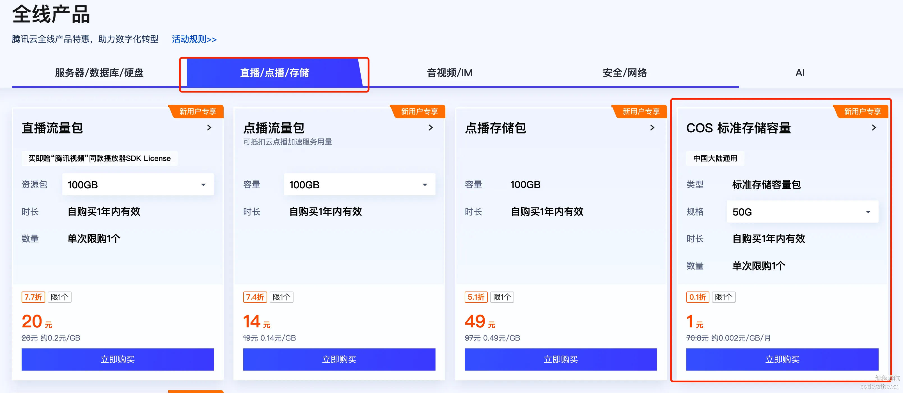

### 创建图片的业务流程

创建图片其实包括了 2 个过程：上传图片文件 + 补充图片信息并保存到数据库中

有 2 种常见的处理方式：

1）先上传再提交数据：用户直接上传图片，系统生成图片的存储 URL；然后在用户填写其他相关信息并提交后，才保存图片记录到数据库中。

2）上传图片时直接保存记录：在用户上传图片后，系统立即生成图片的完整数据记录（包括图片 URL 和其他元信息），无需等待用户点击提交，图片信息就立刻存入了数据库中。之后用户再填写其他图片信息，相当于编辑了已有图片记录的信息。

方案 1 的优点是流程简单，但缺点是如果用户不提交，图片会残留在存储中，导致空间浪费；方案 2 则可以理解为保存了 “图片草稿”，即使用户不填写任何额外信息，也能找到之前的创建记录。

**在我们的系统中，由于图片是核心资源，所以此处选择方案 2。** 便于对图片进行溯源，还可以对图片上传做一些限制 —— 比如发现用户上传资源过多，就禁止上传。

### 如何解析图片的信息？

根据需求，我们要获取的图片信息包括：宽度、高度、宽高比、大小、格式、名称。

主流的获取图片信息的方法主要有 2 种：

1. 在后端服务器直接处理图片，比如 Java 库 ImageIO、Python 库 Pillow，还有更成熟的专业图像处理库 OpenCV 等。
2. 通过第三方云存储服务（如腾讯云 COS、AWS S3）或图像处理 API（如 ImageMagick、ExifTool）直接提取图片的元数据。

由于本教程中使用腾讯云 COS 对象存储来实现文件的上传和下载，腾讯云 COS 对象存储支持在图片上传时通过 [数据万象](https://cloud.tencent.com/product/ci)** **服务直接获取到图片的各种基础信息：

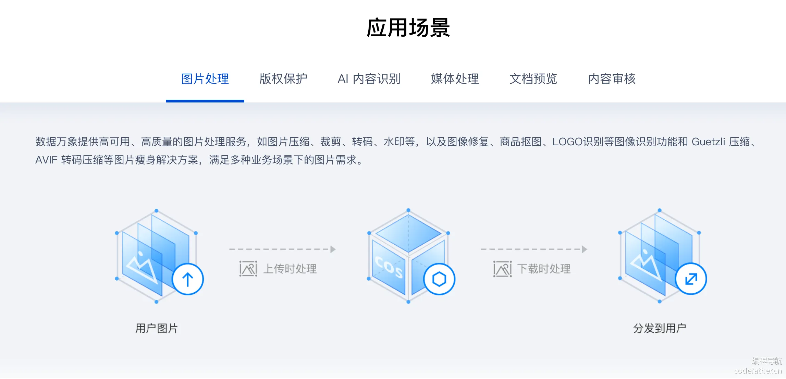

这样一来，我们不用再单独引入一个库或者自己编写解析代码了，更方便；而且提供的免费额度足够用了，所以采用这种方式。

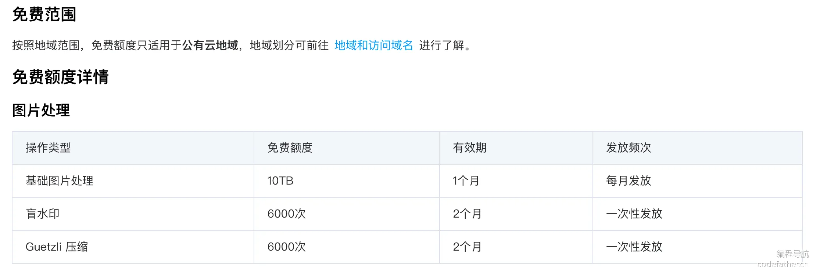

------

OK，有了实现方案后，我们先来开发后端接口。

## 三、后端开发

先准备好项目所需的依赖 —— 对象存储，然后再开发服务和接口。

### 创建并使用对象存储

首先进入[对象存储的控制台](https://console.cloud.tencent.com/cos/bucket)，创建存储桶。

可以把存储桶理解为一个存储空间，和文件系统类似，都是根据路径找到文件或目录（比如 `/test/aaa.jpg`）。可以多个项目共用一个存储桶，也可以每个项目一个。

点击创建存储桶，注意地域选择国内（离用户较近的位置）。此处访问权限先选择“公有读私有写”，因为我们的存储桶要存储允许用户公开访问图片。而如果整个存储桶要存储的文件都不允许用户访问，建议选择私有读写，更安全。

默认告警一定要勾选！因为对象存储服务的存储和访问流量都是计费的，超限后我们要第一时间得到通知并进行相应的处理。

> 不过也不用太担心，自己做项目的话一般是没人攻击你的，而且对象存储很便宜，正常情况下消耗的费用寥寥无几。

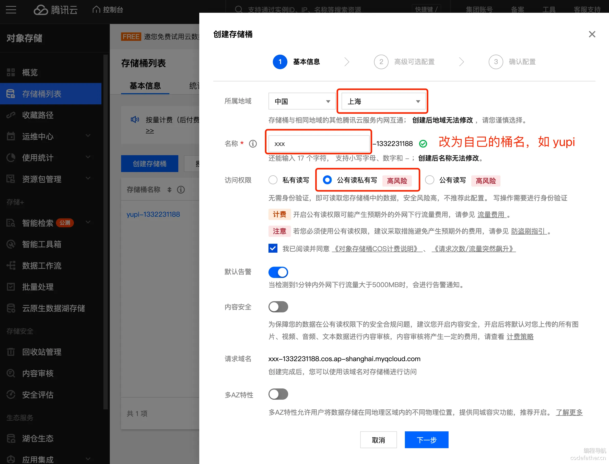

然后一直点击“下一步”即可：

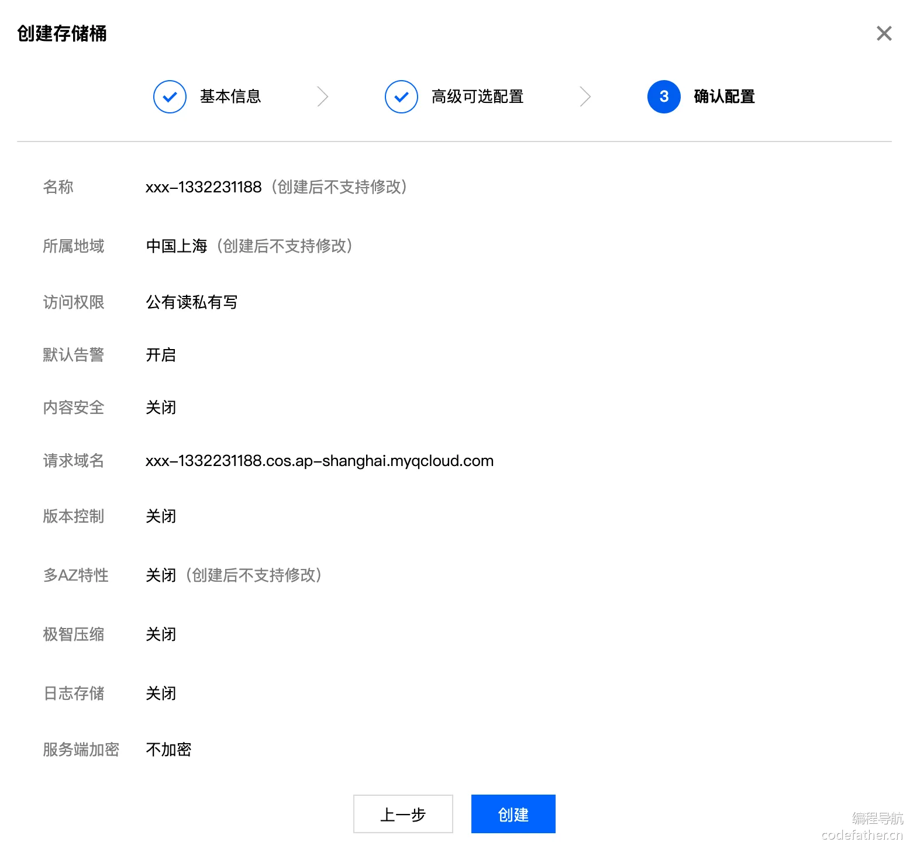

开通成功后，我们可以试着使用 web 控制台上传和浏览文件：

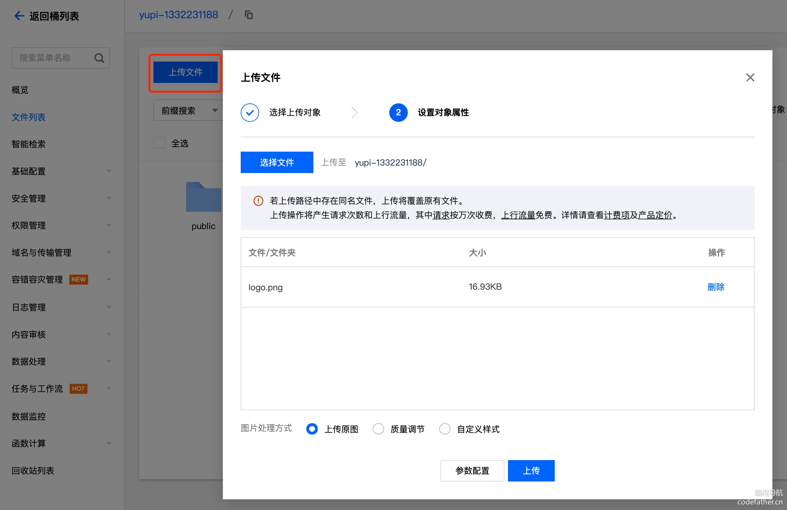

上传文件后，可以使用对象存储服务为我们生成的默认域名，在线访问图片：

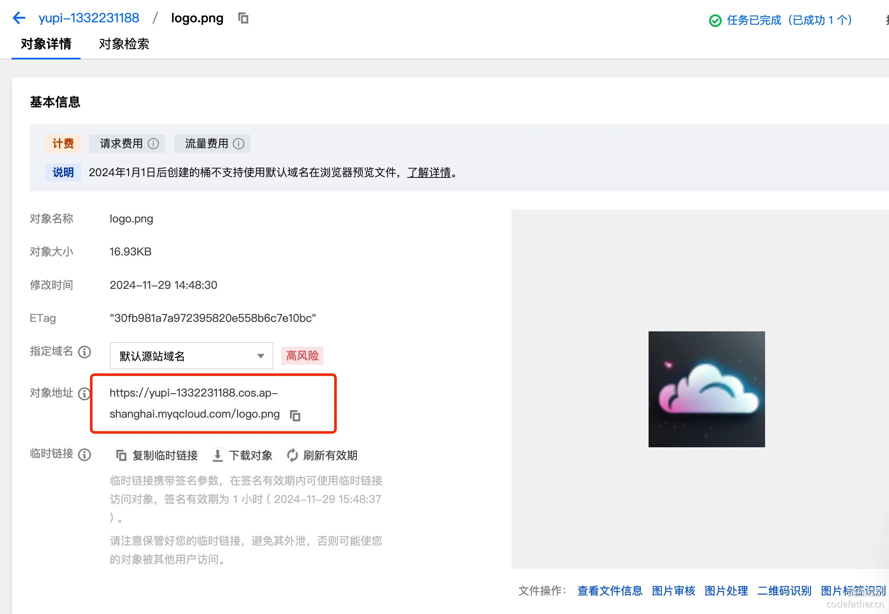

当然，一般情况下我们会使用程序来操作存储桶，下面就来实现。

💡 你可能注意到了，系统提示我们 “使用默认域名” 是高风险的，因为对象存储的源站域名默认是不支持更换的，如果暴露出去被攻击者盯上了，可能你就只能迁移到一个新的存储桶了。本项目教程后续会给大家分享更安全的使用方式。

### 后端操作对象存储

如何在 Java 程序中使用对象存储呢？

其实非常简单，一般情况下，第三方服务都会提供比较贴心的文档教程，比如这里我们参考[官方的快速入门或 Java SDK 文档](https://cloud.tencent.com/document/product/436/10199)，就能快速入门基本操作（增删改查都有）。

还有更高级的学习操作方法，如果你是腾讯云熟练用户，可以直接使用 [API Explorer](https://console.cloud.tencent.com/api/explorer?Product=cos&Version=2018-11-26&Action=PutBucket)，在线寻找操作和示例代码。

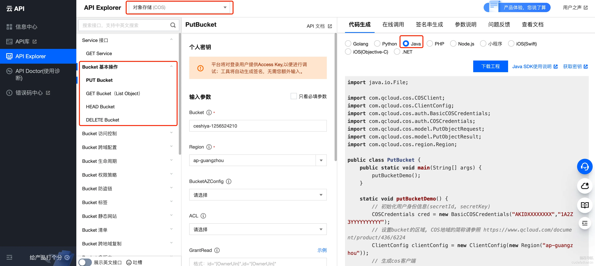

#### 1、初始化客户端

参考官方文档，我们要先初始化一个 COS 客户端对象，和对象存储服务进行交互。

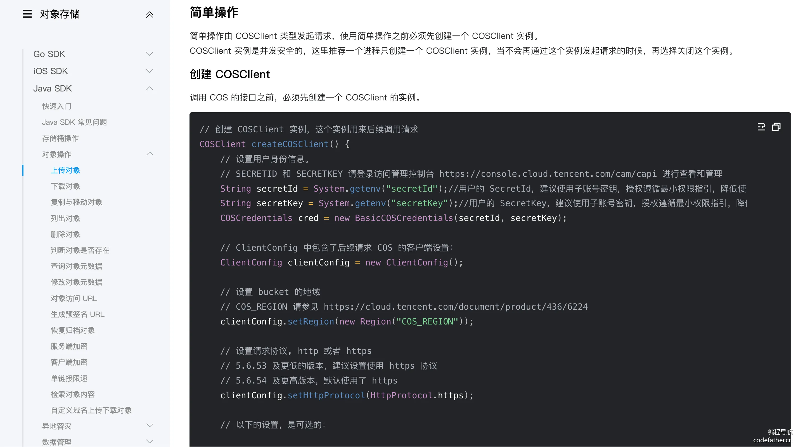

对于我们的项目，只需要复用一个 COS 客户端对象即可，所以我们可以通过编写配置类初始化客户端对象。

1）引入 COS 依赖：

```xml
<!-- 腾讯云 cos 服务 -->  
<dependency>  
    <groupId>com.qcloud</groupId>  
    <artifactId>cos_api</artifactId>  
    <version>5.6.227</version>  
</dependency>
```

2）在项目的 `config` 包下新建 `CosClientConfig` 类。负责读取配置文件，并创建一个 COS 客户端的 Bean。代码如下：

```java
@Configuration  
@ConfigurationProperties(prefix = "cos.client")  
@Data  
public class CosClientConfig {  
  
    /**  
     * 域名  
     */  
    private String host;  
  
    /**  
     * secretId  
     */  
    private String secretId;  
  
    /**  
     * 密钥（注意不要泄露）  
     */  
    private String secretKey;  
  
    /**  
     * 区域  
     */  
    private String region;  
  
    /**  
     * 桶名  
     */  
    private String bucket;  
  
    @Bean  
    public COSClient cosClient() {  
        // 初始化用户身份信息(secretId, secretKey)  
        COSCredentials cred = new BasicCOSCredentials(secretId, secretKey);  
        // 设置bucket的区域, COS地域的简称请参照 https://www.qcloud.com/document/product/436/6224  
        ClientConfig clientConfig = new ClientConfig(new Region(region));  
        // 生成cos客户端  
        return new COSClient(cred, clientConfig);  
    }  
}
```

3）填写配置文件。

**一定要注意防止密码泄露！** 所以我们新建 `application-local.yml` 文件，并且在 `.gitignore` 中忽略该文件的提交，这样就不会将代码等敏感配置提交到代码仓库了。

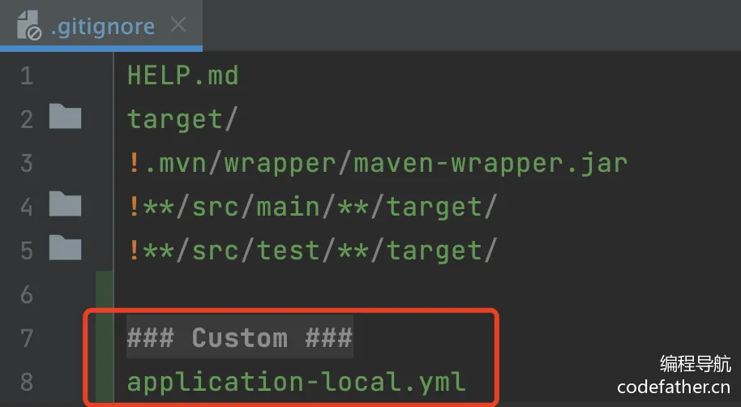

`application-local.yml` 配置代码如下：

```yaml
# 对象存储配置（需要从腾讯云获取）  
cos:  
  client:  
    host: xxx  
    secretId: xxx  
    secretKey: xxx  
    region: xxx  
    bucket: xxx
```

可以通过如下方式分别获取需要的配置。

host 为存储桶域名，也就是我们前面访问测试上传的图片的域名，可以在 COS 控制台的域名信息部分找到：

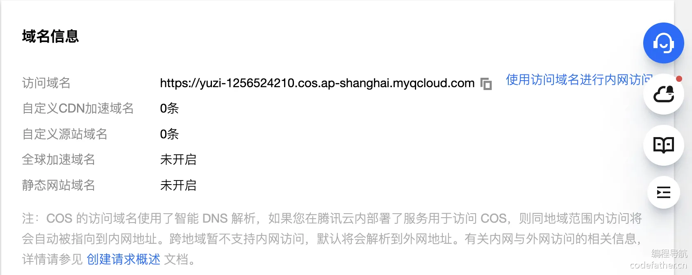

secretId、secretKey 密钥对：在[腾讯云访问管理](https://console.cloud.tencent.com/cam/capi) => 密钥管理中获取。

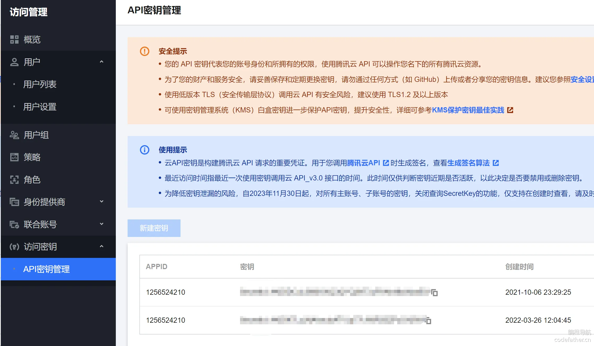

region 表示地域名，可以 [点此获取](https://cloud.tencent.com/document/product/436/6224)。

bucket 是存储桶名，可以点进存储桶详情页获取：

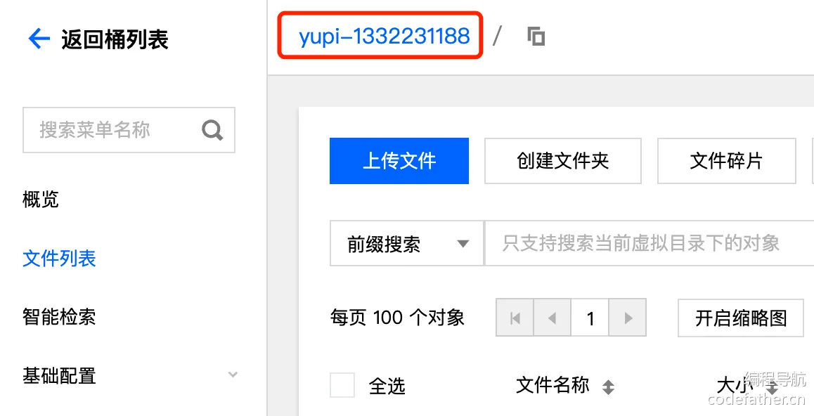

#### 2、通用能力类

在 `manager` 包下新建 `CosManager` 类，提供通用的对象存储操作，比如文件上传、文件下载等。

💡 Manager 也是人为约定的一种写法，表示通用的、可复用的能力，可供其他代码（比如 Service）调用。

该类需要引入对象存储配置和 COS 客户端，用于和 COS 进行交互。代码如下：

```java
@Component  
public class CosManager {  
  
    @Resource  
    private CosClientConfig cosClientConfig;  
  
    @Resource  
    private COSClient cosClient;  
  
    // ... 一些操作 COS 的方法  
}
```

#### 3、文件上传

参考 [官方文档](https://cloud.tencent.com/document/product/436/65935) 的“上传对象”部分，可以编写出文件上传的代码。

1）`CosManager` 新增上传对象的方法，代码如下：

```java
/**  
 * 上传对象  
 *  
 * @param key  唯一键  
 * @param file 文件  
 */  
public PutObjectResult putObject(String key, File file) {  
    PutObjectRequest putObjectRequest = new PutObjectRequest(cosClientConfig.getBucket(), key,  
            file);  
    return cosClient.putObject(putObjectRequest);  
}
```

2）为了方便测试，在 `FileController` 中编写测试文件上传接口。

核心流程是先接受用户上传的文件，指定上传的路径，然后调用 `cosManager.putObject` 方法上传文件到 COS 对象存储；上传成功后，会返回一个文件的 key（其实就是文件路径），便于我们访问和下载文件。

**需要注意，测试接口一定要加上管理员权限！防止任何用户随意上传文件。**

测试文件上传接口代码如下：

```java
/**  
 * 测试文件上传  
 *  
 * @param multipartFile  
 * @return  
 */  
@AuthCheck(mustRole = UserConstant.ADMIN_ROLE)  
@PostMapping("/test/upload")  
public BaseResponse<String> testUploadFile(@RequestPart("file") MultipartFile multipartFile) {  
    // 文件目录  
    String filename = multipartFile.getOriginalFilename();  
    String filepath = String.format("/test/%s", filename);  
    File file = null;  
    try {  
        // 上传文件  
        file = File.createTempFile(filepath, null);  
        multipartFile.transferTo(file);  
        cosManager.putObject(filepath, file);  
        // 返回可访问地址  
        return ResultUtils.success(filepath);  
    } catch (Exception e) {  
        log.error("file upload error, filepath = " + filepath, e);  
        throw new BusinessException(ErrorCode.SYSTEM_ERROR, "上传失败");  
    } finally {  
        if (file != null) {  
            // 删除临时文件  
            boolean delete = file.delete();  
            if (!delete) {  
                log.error("file delete error, filepath = {}", filepath);  
            }  
        }  
    }  
}
```

4）测试接口。

使用 local 配置启动项目：

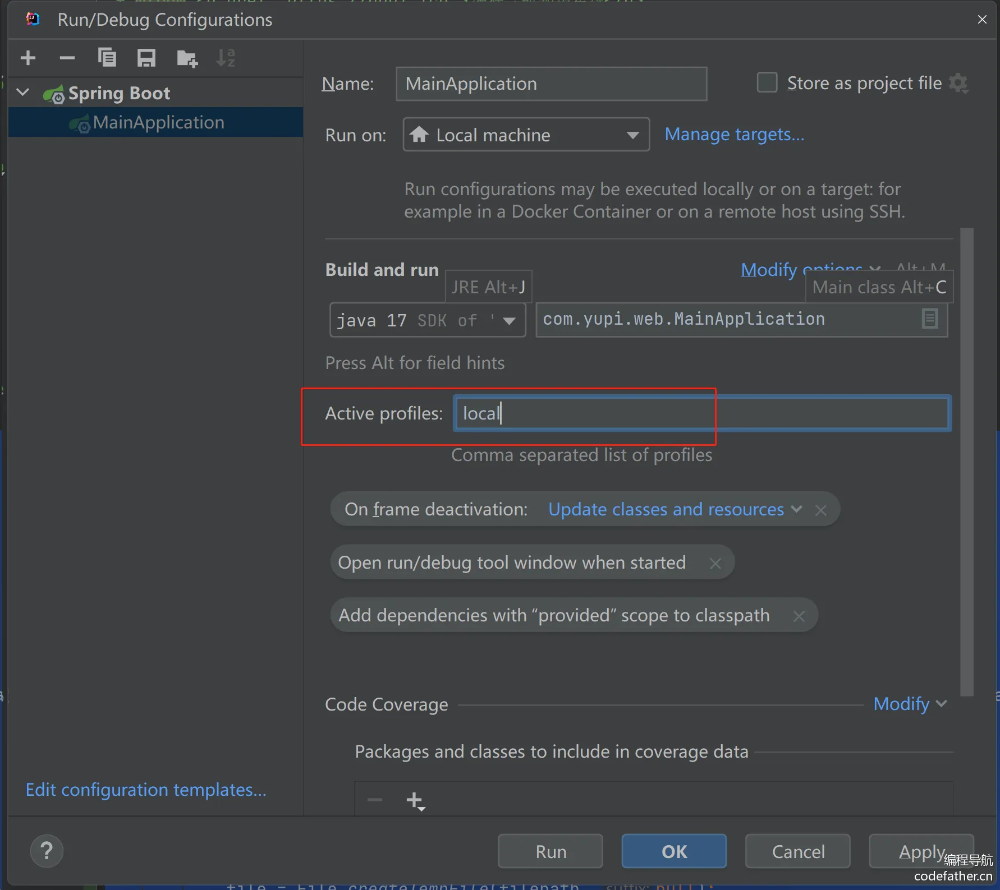

也可以在主配置文件中指定激活的环境配置：

```yaml
spring:  
  profiles:  
    active: local
```

打开 Swagger 接口文档，测试文件上传：

#### 4、文件下载

官方文档介绍了 2 种文件下载方式。一种是直接下载 COS 的文件到后端服务器（适合服务器端处理文件），另一种是获取到文件下载输入流（适合返回给前端用户）。

参考官方文档：

- https://cloud.tencent.com/document/product/436/65937
- https://cloud.tencent.com/document/product/436/10199#.E4.B8.8B.E8.BD.BD.E5.AF.B9.E8.B1.A1

其实还有第三种“下载方式”，直接通过 URL 路径链接访问，适用于单一的、可以被用户公开访问的资源，比如用户头像、本项目中的公开图片。

💡 对于安全性要求较高的场景，建议先通过后端服务器进行权限校验，然后从 COS 下载文件到服务器，再返回给前端，这样可以在后端限制只有登录用户才能下载。

不过还有更巧妙的方式，先通过后端服务器进行权限校验，然后返回给前端一个临时秘钥，之后前端可以凭借该秘钥直接从对象存储下载，不用经过服务端中转，性能更高。

**对于我们目前的项目，图片本身就是公开的，直接使用第三种方式，凭借 URL 连接访问即可。**

但是作为一个小知识，还是给大家演示如何将对象存储的文件下载到服务器中。

1）首先在 `CosManager` 中新增对象下载方法，根据对象的 key 获取存储信息：

```java
/**  
 * 下载对象  
 *  
 * @param key 唯一键  
 */  
public COSObject getObject(String key) {  
    GetObjectRequest getObjectRequest = new GetObjectRequest(cosClientConfig.getBucket(), key);  
    return cosClient.getObject(getObjectRequest);  
}
```

2）为了方便测试，在 `FileController` 中编写测试文件下载接口。

核心流程是根据路径获取到 COS 文件对象，然后将文件对象转换为文件流，并写入到 Servlet 的 Response 对象中。注意要设置文件下载专属的响应头。

同上，测试接口一定要加上管理员权限！防止任何用户随意上传文件。

测试文件下载接口代码如下：

```java
/**  
 * 测试文件下载  
 *  
 * @param filepath 文件路径  
 * @param response 响应对象  
 */  
@AuthCheck(mustRole = UserConstant.ADMIN_ROLE)  
@GetMapping("/test/download/")  
public void testDownloadFile(String filepath, HttpServletResponse response) throws IOException {  
    COSObjectInputStream cosObjectInput = null;  
    try {  
        COSObject cosObject = cosManager.getObject(filepath);  
        cosObjectInput = cosObject.getObjectContent();  
        // 处理下载到的流  
        byte[] bytes = IOUtils.toByteArray(cosObjectInput);  
        // 设置响应头  
        response.setContentType("application/octet-stream;charset=UTF-8");  
        response.setHeader("Content-Disposition", "attachment; filename=" + filepath);  
        // 写入响应  
        response.getOutputStream().write(bytes);  
        response.getOutputStream().flush();  
    } catch (Exception e) {  
        log.error("file download error, filepath = " + filepath, e);  
        throw new BusinessException(ErrorCode.SYSTEM_ERROR, "下载失败");  
    } finally {  
        if (cosObjectInput != null) {  
            cosObjectInput.close();  
        }  
    }  
}
```

3）启动项目，打开 Swagger 接口文档，测试文件下载：

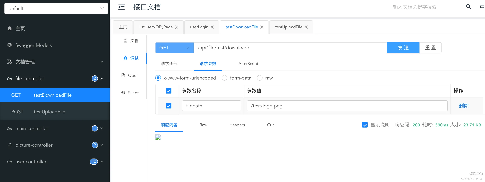

在某些操作系统（浏览器）中，虽然图片没有显示，但通过响应码和响应大小，也能判断出图片是成功下载了。

至此，后端操作对象存储的代码已编写完成，下面开发接口。

### 图片基础代码

首先利用 MyBatisX 插件生成图片表相关的基础代码，包括实体类、Mapper、Service。

> 用户模块中有讲解详细流程，此处不再赘述。

然后根据需求优化 Picture 实体类：

```java
@TableName(value ="picture")  
@Data  
public class Picture implements Serializable {  
    /**  
     * id  
     */  
    @TableId(type = IdType.ASSIGN_ID)  
    private Long id;  
  
    /**  
     * 图片 url  
     */  
    private String url;  
  
    /**  
     * 图片名称  
     */  
    private String name;  
  
    /**  
     * 简介  
     */  
    private String introduction;  
  
    /**  
     * 分类  
     */  
    private String category;  
  
    /**  
     * 标签（JSON 数组）  
     */  
    private String tags;  
  
    /**  
     * 图片体积  
     */  
    private Long picSize;  
  
    /**  
     * 图片宽度  
     */  
    private Integer picWidth;  
  
    /**  
     * 图片高度  
     */  
    private Integer picHeight;  
  
    /**  
     * 图片宽高比例  
     */  
    private Double picScale;  
  
    /**  
     * 图片格式  
     */  
    private String picFormat;  
  
    /**  
     * 创建用户 id  
     */  
    private Long userId;  
  
    /**  
     * 创建时间  
     */  
    private Date createTime;  
  
    /**  
     * 编辑时间  
     */  
    private Date editTime;  
  
    /**  
     * 更新时间  
     */  
    private Date updateTime;  
  
    /**  
     * 是否删除  
     */  
    @TableLogic  
    private Integer isDelete;  
  
    @TableField(exist = false)  
    private static final long serialVersionUID = 1L;  
}
```

### 图片上传

#### 1、数据模型

在 `model.dto.picture` 下新建用于接受请求参数的类。由于图片需要支持重复上传（基础信息不变，只改变图片文件），所以要添加图片 id 参数：

```java
@Data  
public class PictureUploadRequest implements Serializable {  
  
    /**  
     * 图片 id（用于修改）  
     */  
    private Long id;  
  
    private static final long serialVersionUID = 1L;  
}
```

在 `model.vo` 下新建上传成功后返回给前端的响应类，这是一个视图包装类，可以额外关联上传图片的用户信息。还可以编写 Picture 实体类和该 VO 类的转换方法，便于后续快速传值。

```java
@Data  
public class PictureVO implements Serializable {  
  
    /**  
     * id  
     */  
    private Long id;  
  
    /**  
     * 图片 url  
     */  
    private String url;  
  
    /**  
     * 图片名称  
     */  
    private String name;  
  
    /**  
     * 简介  
     */  
    private String introduction;  
  
    /**  
     * 标签  
     */  
    private List<String> tags;  
  
    /**  
     * 分类  
     */  
    private String category;  
  
    /**  
     * 文件体积  
     */  
    private Long picSize;  
  
    /**  
     * 图片宽度  
     */  
    private Integer picWidth;  
  
    /**  
     * 图片高度  
     */  
    private Integer picHeight;  
  
    /**  
     * 图片比例  
     */  
    private Double picScale;  
  
    /**  
     * 图片格式  
     */  
    private String picFormat;  
  
    /**  
     * 用户 id  
     */  
    private Long userId;  
  
    /**  
     * 创建时间  
     */  
    private Date createTime;  
  
    /**  
     * 编辑时间  
     */  
    private Date editTime;  
  
    /**  
     * 更新时间  
     */  
    private Date updateTime;  
  
    /**  
     * 创建用户信息  
     */  
    private UserVO user;  
  
    private static final long serialVersionUID = 1L;  
  
    /**  
     * 封装类转对象  
     */  
    public static Picture voToObj(PictureVO pictureVO) {  
        if (pictureVO == null) {  
            return null;  
        }  
        Picture picture = new Picture();  
        BeanUtils.copyProperties(pictureVO, picture);  
        // 类型不同，需要转换  
        picture.setTags(JSONUtil.toJsonStr(pictureVO.getTags()));  
        return picture;  
    }  
  
    /**  
     * 对象转封装类  
     */  
    public static PictureVO objToVo(Picture picture) {  
        if (picture == null) {  
            return null;  
        }  
        PictureVO pictureVO = new PictureVO();  
        BeanUtils.copyProperties(picture, pictureVO);  
        // 类型不同，需要转换  
        pictureVO.setTags(JSONUtil.toList(picture.getTags(), String.class));  
        return pictureVO;  
    }  
}
```

#### 2、通用文件上传服务

之前虽然我们已经编写了通用的对象存储操作类 CosManager，但这个类并不能直接满足我们的图片上传需求。

比如：

- 图片是否符合要求？需要校验
- 将图片上传到哪里？需要指定路径
- 如何解析图片？需要使用数据万象服务

所以，可以针对我们的项目，编写一个更贴合业务的文件上传服务 FileManager（这里用 Service 也可以），该服务提供一个上传图片并返回图片解析信息的方法。

```java
@Service  
@Slf4j  
public class FileManager {  
  
    @Resource  
    private CosClientConfig cosClientConfig;  
  
    @Resource  
    private CosManager cosManager;  
  
    // ...  
}
```

1）在 `model.dto.file` 中新增用于接受图片解析信息的包装类：

```java
@Data  
public class UploadPictureResult {  
  
    /**  
     * 图片地址  
     */  
    private String url;  
  
    /**  
     * 图片名称  
     */  
    private String picName;  
  
    /**  
     * 文件体积  
     */  
    private Long picSize;  
  
    /**  
     * 图片宽度  
     */  
    private int picWidth;  
  
    /**  
     * 图片高度  
     */  
    private int picHeight;  
  
    /**  
     * 图片宽高比  
     */  
    private Double picScale;  
  
    /**  
     * 图片格式  
     */  
    private String picFormat;  
  
}
```

2）参考 [数据万象](https://cloud.tencent.com/document/product/436/55377) 的文档，在 CosManager 中添加上传图片并解析图片的方法：

```java
/**  
 * 上传对象（附带图片信息）  
 *  
 * @param key  唯一键  
 * @param file 文件  
 */  
public PutObjectResult putPictureObject(String key, File file) {  
    PutObjectRequest putObjectRequest = new PutObjectRequest(cosClientConfig.getBucket(), key,  
            file);  
    // 对图片进行处理（获取基本信息也被视作为一种处理）  
    PicOperations picOperations = new PicOperations();  
    // 1 表示返回原图信息  
    picOperations.setIsPicInfo(1);  
    // 构造处理参数  
    putObjectRequest.setPicOperations(picOperations);  
    return cosClient.putObject(putObjectRequest);  
}
```

如果你之前没有使用过数据万象，需要先 [开通数据万象并授权](https://console.cloud.tencent.com/ci)，否则会报错：

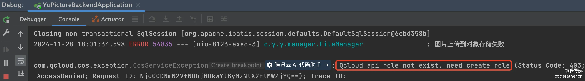

3）在 FileManager 中编写上传图片的方法：

```java
/**  
 * 上传图片  
 *  
 * @param multipartFile    文件  
 * @param uploadPathPrefix 上传路径前缀  
 * @return  
 */  
public UploadPictureResult uploadPicture(MultipartFile multipartFile, String uploadPathPrefix) {  
    // 校验图片  
    validPicture(multipartFile);  
    // 图片上传地址  
    String uuid = RandomUtil.randomString(16);  
    String originFilename = multipartFile.getOriginalFilename();  
    String uploadFilename = String.format("%s_%s.%s", DateUtil.formatDate(new Date()), uuid,  
            FileUtil.getSuffix(originFilename));  
    String uploadPath = String.format("/%s/%s", uploadPathPrefix, uploadFilename);  
    File file = null;  
    try {  
        // 创建临时文件  
        file = File.createTempFile(uploadPath, null);  
        multipartFile.transferTo(file);  
        // 上传图片  
        PutObjectResult putObjectResult = cosManager.putPictureObject(uploadPath, file);  
        ImageInfo imageInfo = putObjectResult.getCiUploadResult().getOriginalInfo().getImageInfo();  
        // 封装返回结果  
        UploadPictureResult uploadPictureResult = new UploadPictureResult();  
        int picWidth = imageInfo.getWidth();  
        int picHeight = imageInfo.getHeight();  
        double picScale = NumberUtil.round(picWidth * 1.0 / picHeight, 2).doubleValue();  
        uploadPictureResult.setPicName(FileUtil.mainName(originFilename));  
        uploadPictureResult.setPicWidth(picWidth);  
        uploadPictureResult.setPicHeight(picHeight);  
        uploadPictureResult.setPicScale(picScale);  
        uploadPictureResult.setPicFormat(imageInfo.getFormat());  
        uploadPictureResult.setPicSize(FileUtil.size(file));  
        uploadPictureResult.setUrl(cosClientConfig.getHost() + "/" + uploadPath);  
        return uploadPictureResult;  
    } catch (Exception e) {  
        log.error("图片上传到对象存储失败", e);  
        throw new BusinessException(ErrorCode.SYSTEM_ERROR, "上传失败");  
    } finally {  
        this.deleteTempFile(file);  
    }  
}  
  
/**  
 * 校验文件  
 *  
 * @param multipartFile multipart 文件  
 */  
public void validPicture(MultipartFile multipartFile) {  
    ThrowUtils.throwIf(multipartFile == null, ErrorCode.PARAMS_ERROR, "文件不能为空");  
    // 1. 校验文件大小  
    long fileSize = multipartFile.getSize();  
    final long ONE_M = 1024 * 1024L;  
    ThrowUtils.throwIf(fileSize > 2 * ONE_M, ErrorCode.PARAMS_ERROR, "文件大小不能超过 2M");  
    // 2. 校验文件后缀  
    String fileSuffix = FileUtil.getSuffix(multipartFile.getOriginalFilename());  
    // 允许上传的文件后缀  
    final List<String> ALLOW_FORMAT_LIST = Arrays.asList("jpeg", "jpg", "png", "webp");  
    ThrowUtils.throwIf(!ALLOW_FORMAT_LIST.contains(fileSuffix), ErrorCode.PARAMS_ERROR, "文件类型错误");  
}  
  
/**  
 * 删除临时文件  
 */  
public void deleteTempFile(File file) {  
    if (file == null) {  
        return;  
    }  
    // 删除临时文件  
    boolean deleteResult = file.delete();  
    if (!deleteResult) {  
        log.error("file delete error, filepath = {}", file.getAbsolutePath());  
    }  
}
```

上述代码中有几个实现关键：

1. 由于文件校验规则较复杂，单独抽象为 validPicture 方法，对文件大小、类型进行校验。
2. 文件上传时，会先在本地创建临时文件，无论上传是否成功，都要记得删除临时文件，否则会导致资源泄露。
3. 可以根据自己的需求定义文件上传地址，比如此处鱼皮给文件名前增加了上传日期和 16 位 uuid 随机数，便于了解文件上传时间并防止文件重复。还预留了一个 uploadPathPrefix 参数，由调用方指定上传文件到哪个目录。

💡 如果多个项目共享存储桶，可以给上传文件路径再加一个 ProjectName 前缀。不过建议还是每个项目独立分配资源。

#### 3、服务开发

在 PictureService 中编写上传图片的方法：

接口：

```java
/**  
 * 上传图片  
 *  
 * @param multipartFile  
 * @param pictureUploadRequest  
 * @param loginUser  
 * @return  
 */  
PictureVO uploadPicture(MultipartFile multipartFile,  
                        PictureUploadRequest pictureUploadRequest,  
                        User loginUser);
```

实现类：

```java
@Override  
public PictureVO uploadPicture(MultipartFile multipartFile, PictureUploadRequest pictureUploadRequest, User loginUser) {  
    ThrowUtils.throwIf(loginUser == null, ErrorCode.NO_AUTH_ERROR);  
    // 用于判断是新增还是更新图片  
    Long pictureId = null;  
    if (pictureUploadRequest != null) {  
        pictureId = pictureUploadRequest.getId();  
    }  
    // 如果是更新图片，需要校验图片是否存在  
    if (pictureId != null) {  
        boolean exists = this.lambdaQuery()  
                .eq(Picture::getId, pictureId)  
                .exists();  
        ThrowUtils.throwIf(!exists, ErrorCode.NOT_FOUND_ERROR, "图片不存在");  
    }  
    // 上传图片，得到信息  
    // 按照用户 id 划分目录  
    String uploadPathPrefix = String.format("public/%s", loginUser.getId());  
    UploadPictureResult uploadPictureResult = fileManager.uploadPicture(multipartFile, uploadPathPrefix);  
    // 构造要入库的图片信息  
    Picture picture = new Picture();  
    picture.setUrl(uploadPictureResult.getUrl());  
    picture.setName(uploadPictureResult.getPicName());  
    picture.setPicSize(uploadPictureResult.getPicSize());  
    picture.setPicWidth(uploadPictureResult.getPicWidth());  
    picture.setPicHeight(uploadPictureResult.getPicHeight());  
    picture.setPicScale(uploadPictureResult.getPicScale());  
    picture.setPicFormat(uploadPictureResult.getPicFormat());  
    picture.setUserId(loginUser.getId());  
    // 如果 pictureId 不为空，表示更新，否则是新增  
    if (pictureId != null) {  
        // 如果是更新，需要补充 id 和编辑时间  
        picture.setId(pictureId);  
        picture.setEditTime(new Date());  
    }  
    boolean result = this.saveOrUpdate(picture);  
    ThrowUtils.throwIf(!result, ErrorCode.OPERATION_ERROR, "图片上传失败");  
    return PictureVO.objToVo(picture);  
}
```

上述代码中，注意：

1. 我们将所有图片都放到了 public 目录下，并且每个用户的图片存储到对应用户 id 的目录下，便于管理。
2. 如果 pictureId 不为空，表示更新已有图片的信息，需要判断对应 id 的图片是否存在，并且更新时要指定 editTime 编辑时间。可以调用 MyBatis Plus 提供的 saveOrUpdate 方法兼容创建和更新操作。

#### 4、接口开发

在 PictureController 中编写上传图片接口，注意仅管理员可用：

```java
/**  
 * 上传图片（可重新上传）  
 */  
@PostMapping("/upload")  
@AuthCheck(mustRole = UserConstant.ADMIN_ROLE)  
public BaseResponse<PictureVO> uploadPicture(  
        @RequestPart("file") MultipartFile multipartFile,  
        PictureUploadRequest pictureUploadRequest,  
        HttpServletRequest request) {  
    User loginUser = userService.getLoginUser(request);  
    PictureVO pictureVO = pictureService.uploadPicture(multipartFile, pictureUploadRequest, loginUser);  
    return ResultUtils.success(pictureVO);  
}
```

#### 5、测试

使用 Swagger 进行测试，发现当上传图片过大时，会触发一段报错。但这个报错不是我们自定义的异常导致的，而是由于 Tomcat 服务器默认限制了请求中文件上传的大小。

需要在 `application.yml` 中更改配置，调大允许上传的文件大小：

```yaml
spring:  
  # 开放更大的文件上传体积  
  servlet:  
    multipart:  
      max-file-size: 10MB
```

#### 扩展思路

1）可以用枚举类（FileUploadBizEnum）支持根据业务场景区分文件上传路径、校验规则等，从而复用 FileManager。

2）目前在文件上传时，会先在本地创建临时文件。如果你不需要对文件进行额外的处理、想进一步提高性能，可以直接用流的方式将请求中的文件上传到 COS。以下代码仅供参考：

```java
// 上传文件  
public static String uploadToCOS(MultipartFile multipartFile, String bucketName, String key) throws Exception {  
    // 创建 COS 客户端  
    COSClient cosClient = createCOSClient();  
  
    try (InputStream inputStream = multipartFile.getInputStream()) {  
        // 元信息配置  
        ObjectMetadata metadata = new ObjectMetadata();  
        metadata.setContentLength(multipartFile.getSize());  
        metadata.setContentType(multipartFile.getContentType());  
  
        // 创建上传请求  
        PutObjectRequest putObjectRequest = new PutObjectRequest(bucketName, key, inputStream, metadata);  
  
        // 上传文件  
        cosClient.putObject(putObjectRequest);  
  
        // 生成访问链接  
        return "https://" + bucketName + ".cos." + cosClient.getClientConfig().getRegion().getRegionName()  
               + ".myqcloud.com/" + key;  
    } finally {  
        cosClient.shutdown();  
    }  
}
```

3）补充更严格的校验，比如为支持的图片格式定义枚举，仅允许上传枚举定义的格式。

### 图片管理

图片管理功能具体可以拆分为：

- 【管理员】根据 id 删除图片
- 【管理员】更新图片
- 【管理员】分页获取图片列表（不需要脱敏和限制条数）
- 【管理员】根据 id 获取图片（不需要脱敏）
- 分页获取图片列表（需要脱敏和限制条数）
- 根据 id 获取图片（需要脱敏）
- 修改图片

#### 1、数据模型

每个操作都需要提供一个请求类，都放在 `model.dto.picture` 包下。

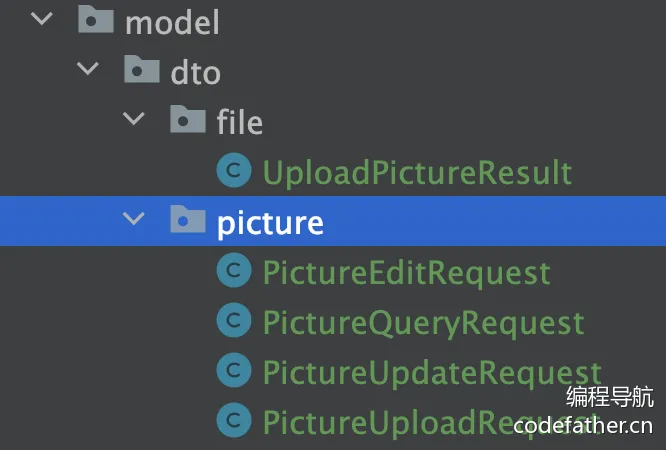

1）图片更新请求，给管理员使用。注意要将 tags 的类型改为 `List<String>`，便于前端上传：

```java
@Data  
public class PictureUpdateRequest implements Serializable {  
  
    /**  
     * id  
     */  
    private Long id;  
  
    /**  
     * 图片名称  
     */  
    private String name;  
  
    /**  
     * 简介  
     */  
    private String introduction;  
  
    /**  
     * 分类  
     */  
    private String category;  
  
    /**  
     * 标签  
     */  
    private List<String> tags;  
  
    private static final long serialVersionUID = 1L;  
}
```

2）图片修改请求，一般情况下给普通用户使用，可修改的字段范围小于更新请求：

```java
@Data  
public class PictureEditRequest implements Serializable {  
  
    /**  
     * id  
     */  
    private Long id;  
  
    /**  
     * 图片名称  
     */  
    private String name;  
  
    /**  
     * 简介  
     */  
    private String introduction;  
  
    /**  
     * 分类  
     */  
    private String category;  
  
    /**  
     * 标签  
     */  
    private List<String> tags;  
  
    private static final long serialVersionUID = 1L;  
}
```

3）图片查询请求，需要继承公共包中的 `PageRequest` 来支持分页查询：

```java
@EqualsAndHashCode(callSuper = true)  
@Data  
public class PictureQueryRequest extends PageRequest implements Serializable {  
  
    /**  
     * id  
     */  
    private Long id;  
  
    /**  
     * 图片名称  
     */  
    private String name;  
  
    /**  
     * 简介  
     */  
    private String introduction;  
  
    /**  
     * 分类  
     */  
    private String category;  
  
    /**  
     * 标签  
     */  
    private List<String> tags;  
  
    /**  
     * 文件体积  
     */  
    private Long picSize;  
  
    /**  
     * 图片宽度  
     */  
    private Integer picWidth;  
  
    /**  
     * 图片高度  
     */  
    private Integer picHeight;  
  
    /**  
     * 图片比例  
     */  
    private Double picScale;  
  
    /**  
     * 图片格式  
     */  
    private String picFormat;  
  
    /**  
     * 搜索词（同时搜名称、简介等）  
     */  
    private String searchText;  
  
    /**  
     * 用户 id  
     */  
    private Long userId;  
  
    private static final long serialVersionUID = 1L;  
}
```

#### 2、服务开发

1）在 UserService 中编写判断用户是否为管理员的方法，后续开发中会用到。

接口代码：

```java
/**  
 * 是否为管理员  
 *  
 * @param user  
 * @return  
 */  
boolean isAdmin(User user);
```

实现类：

```java
@Override  
public boolean isAdmin(User user) {  
    return user != null && UserRoleEnum.ADMIN.getValue().equals(user.getUserRole());  
}
```

2）对于分页查询接口，需要根据用户传入的参数来构造 SQL 查询。由于使用 MyBatis Plus 框架，不用自己拼接 SQL 了，而是通过构造 QueryWrapper 对象来生成 SQL 查询。

可以在 PictureService 中编写一个方法，专门用于将查询请求转为 QueryWrapper 对象：

```java
@Override  
public QueryWrapper<Picture> getQueryWrapper(PictureQueryRequest pictureQueryRequest) {  
    QueryWrapper<Picture> queryWrapper = new QueryWrapper<>();  
    if (pictureQueryRequest == null) {  
        return queryWrapper;  
    }  
    // 从对象中取值  
    Long id = pictureQueryRequest.getId();  
    String name = pictureQueryRequest.getName();  
    String introduction = pictureQueryRequest.getIntroduction();  
    String category = pictureQueryRequest.getCategory();  
    List<String> tags = pictureQueryRequest.getTags();  
    Long picSize = pictureQueryRequest.getPicSize();  
    Integer picWidth = pictureQueryRequest.getPicWidth();  
    Integer picHeight = pictureQueryRequest.getPicHeight();  
    Double picScale = pictureQueryRequest.getPicScale();  
    String picFormat = pictureQueryRequest.getPicFormat();  
    String searchText = pictureQueryRequest.getSearchText();  
    Long userId = pictureQueryRequest.getUserId();  
    String sortField = pictureQueryRequest.getSortField();  
    String sortOrder = pictureQueryRequest.getSortOrder();  
    // 从多字段中搜索  
    if (StrUtil.isNotBlank(searchText)) {  
        // 需要拼接查询条件  
        queryWrapper.and(qw -> qw.like("name", searchText)  
                .or()  
                .like("introduction", searchText)  
        );  
    }  
    queryWrapper.eq(ObjUtil.isNotEmpty(id), "id", id);  
    queryWrapper.eq(ObjUtil.isNotEmpty(userId), "userId", userId);  
    queryWrapper.like(StrUtil.isNotBlank(name), "name", name);  
    queryWrapper.like(StrUtil.isNotBlank(introduction), "introduction", introduction);  
    queryWrapper.like(StrUtil.isNotBlank(picFormat), "picFormat", picFormat);  
    queryWrapper.eq(StrUtil.isNotBlank(category), "category", category);  
    queryWrapper.eq(ObjUtil.isNotEmpty(picWidth), "picWidth", picWidth);  
    queryWrapper.eq(ObjUtil.isNotEmpty(picHeight), "picHeight", picHeight);  
    queryWrapper.eq(ObjUtil.isNotEmpty(picSize), "picSize", picSize);  
    queryWrapper.eq(ObjUtil.isNotEmpty(picScale), "picScale", picScale);  
    // JSON 数组查询  
    if (CollUtil.isNotEmpty(tags)) {  
        for (String tag : tags) {  
            queryWrapper.like("tags", "\"" + tag + "\"");  
        }  
    }  
    // 排序  
    queryWrapper.orderBy(StrUtil.isNotEmpty(sortField), sortOrder.equals("ascend"), sortField);  
    return queryWrapper;  
}
```

上面的代码中，注意两点：

1. searchText 支持同时从 name 和 introduction 中检索，可以用 queryWrapper 的 or 语法构造查询条件。
2. 由于 tags 在数据库中存储的是 JSON 格式的字符串，如果前端要传多个 tag（必须同时存在才查出），需要遍历 tags 数组，每个标签都使用 like 模糊查询，将这些条件组合在一起。

💡 从 MySQL 5.7 开始，MySQL 提供了 `JSON_CONTAINS` 函数，可以用来检查一个 JSON 数组中是否包含某个元素：

```sql
SELECT * FROM picture  
WHERE JSON_CONTAINS(tags, 'yupi');
```

需要在程序中编写 MyBatis 的自定义 SQL 实现。

3）编写获取图片封装的方法，可以为原有的图片关联创建用户的信息。

获取单个图片封装：

```java
@Override  
public PictureVO getPictureVO(Picture picture, HttpServletRequest request) {  
    // 对象转封装类  
    PictureVO pictureVO = PictureVO.objToVo(picture);  
    // 关联查询用户信息  
    Long userId = picture.getUserId();  
    if (userId != null && userId > 0) {  
        User user = userService.getById(userId);  
        UserVO userVO = userService.getUserVO(user);  
        pictureVO.setUser(userVO);  
    }  
    return pictureVO;  
}
```

分页获取图片封装：

```java
/**  
 * 分页获取图片封装  
 */  
@Override  
public Page<PictureVO> getPictureVOPage(Page<Picture> picturePage, HttpServletRequest request) {  
    List<Picture> pictureList = picturePage.getRecords();  
    Page<PictureVO> pictureVOPage = new Page<>(picturePage.getCurrent(), picturePage.getSize(), picturePage.getTotal());  
    if (CollUtil.isEmpty(pictureList)) {  
        return pictureVOPage;  
    }  
    // 对象列表 => 封装对象列表  
    List<PictureVO> pictureVOList = pictureList.stream().map(PictureVO::objToVo).collect(Collectors.toList());  
    // 1. 关联查询用户信息  
    Set<Long> userIdSet = pictureList.stream().map(Picture::getUserId).collect(Collectors.toSet());  
    Map<Long, List<User>> userIdUserListMap = userService.listByIds(userIdSet).stream()  
            .collect(Collectors.groupingBy(User::getId));  
    // 2. 填充信息  
    pictureVOList.forEach(pictureVO -> {  
        Long userId = pictureVO.getUserId();  
        User user = null;  
        if (userIdUserListMap.containsKey(userId)) {  
            user = userIdUserListMap.get(userId).get(0);  
        }  
        pictureVO.setUser(userService.getUserVO(user));  
    });  
    pictureVOPage.setRecords(pictureVOList);  
    return pictureVOPage;  
}
```

注意，这里我们做了个小优化，不是针对每条数据都查询一次用户，而是先获取到要查询的用户 id 列表，只发送一次查询用户表的请求，再将查到的值设置到图片对象中。

4）编写图片数据校验方法，用于更新和修改图片时进行判断：

```java
@Override  
public void validPicture(Picture picture) {  
    ThrowUtils.throwIf(picture == null, ErrorCode.PARAMS_ERROR);  
    // 从对象中取值  
    Long id = picture.getId();  
    String url = picture.getUrl();  
    String introduction = picture.getIntroduction();  
    // 修改数据时，id 不能为空，有参数则校验  
    ThrowUtils.throwIf(ObjUtil.isNull(id), ErrorCode.PARAMS_ERROR, "id 不能为空");  
    if (StrUtil.isNotBlank(url)) {  
        ThrowUtils.throwIf(url.length() > 1024, ErrorCode.PARAMS_ERROR, "url 过长");  
    }  
    if (StrUtil.isNotBlank(introduction)) {  
        ThrowUtils.throwIf(introduction.length() > 800, ErrorCode.PARAMS_ERROR, "简介过长");  
    }  
}
```

可以根据自己的需要，补充更多校验规则。

#### 3、接口开发

上述功能其实都是样板代码，俗称 “增删改查”。

代码实现比较简单，注意添加对应的权限注解、做好参数校验即可：

```java
/**  
 * 删除图片  
 */  
@PostMapping("/delete")  
public BaseResponse<Boolean> deletePicture(@RequestBody DeleteRequest deleteRequest, HttpServletRequest request) {  
    if (deleteRequest == null || deleteRequest.getId() <= 0) {  
        throw new BusinessException(ErrorCode.PARAMS_ERROR);  
    }  
    User loginUser = userService.getLoginUser(request);  
    long id = deleteRequest.getId();  
    // 判断是否存在  
    Picture oldPicture = pictureService.getById(id);  
    ThrowUtils.throwIf(oldPicture == null, ErrorCode.NOT_FOUND_ERROR);  
    // 仅本人或管理员可删除  
    if (!oldPicture.getUserId().equals(loginUser.getId()) && !userService.isAdmin(loginUser)) {  
        throw new BusinessException(ErrorCode.NO_AUTH_ERROR);  
    }  
    // 操作数据库  
    boolean result = pictureService.removeById(id);  
    ThrowUtils.throwIf(!result, ErrorCode.OPERATION_ERROR);  
    return ResultUtils.success(true);  
}  
  
/**  
 * 更新图片（仅管理员可用）  
 */  
@PostMapping("/update")  
@AuthCheck(mustRole = UserConstant.ADMIN_ROLE)  
public BaseResponse<Boolean> updatePicture(@RequestBody PictureUpdateRequest pictureUpdateRequest) {  
    if (pictureUpdateRequest == null || pictureUpdateRequest.getId() <= 0) {  
        throw new BusinessException(ErrorCode.PARAMS_ERROR);  
    }  
    // 将实体类和 DTO 进行转换  
    Picture picture = new Picture();  
    BeanUtils.copyProperties(pictureUpdateRequest, picture);  
    // 注意将 list 转为 string  
    picture.setTags(JSONUtil.toJsonStr(pictureUpdateRequest.getTags()));  
    // 数据校验  
    pictureService.validPicture(picture);  
    // 判断是否存在  
    long id = pictureUpdateRequest.getId();  
    Picture oldPicture = pictureService.getById(id);  
    ThrowUtils.throwIf(oldPicture == null, ErrorCode.NOT_FOUND_ERROR);  
    // 操作数据库  
    boolean result = pictureService.updateById(picture);  
    ThrowUtils.throwIf(!result, ErrorCode.OPERATION_ERROR);  
    return ResultUtils.success(true);  
}  
  
/**  
 * 根据 id 获取图片（仅管理员可用）  
 */  
@GetMapping("/get")  
@AuthCheck(mustRole = UserConstant.ADMIN_ROLE)  
public BaseResponse<Picture> getPictureById(long id, HttpServletRequest request) {  
    ThrowUtils.throwIf(id <= 0, ErrorCode.PARAMS_ERROR);  
    // 查询数据库  
    Picture picture = pictureService.getById(id);  
    ThrowUtils.throwIf(picture == null, ErrorCode.NOT_FOUND_ERROR);  
    // 获取封装类  
    return ResultUtils.success(picture);  
}  
  
/**  
 * 根据 id 获取图片（封装类）  
 */  
@GetMapping("/get/vo")  
public BaseResponse<PictureVO> getPictureVOById(long id, HttpServletRequest request) {  
    ThrowUtils.throwIf(id <= 0, ErrorCode.PARAMS_ERROR);  
    // 查询数据库  
    Picture picture = pictureService.getById(id);  
    ThrowUtils.throwIf(picture == null, ErrorCode.NOT_FOUND_ERROR);  
    // 获取封装类  
    return ResultUtils.success(pictureService.getPictureVO(picture, request));  
}  
  
/**  
 * 分页获取图片列表（仅管理员可用）  
 */  
@PostMapping("/list/page")  
@AuthCheck(mustRole = UserConstant.ADMIN_ROLE)  
public BaseResponse<Page<Picture>> listPictureByPage(@RequestBody PictureQueryRequest pictureQueryRequest) {  
    long current = pictureQueryRequest.getCurrent();  
    long size = pictureQueryRequest.getPageSize();  
    // 查询数据库  
    Page<Picture> picturePage = pictureService.page(new Page<>(current, size),  
            pictureService.getQueryWrapper(pictureQueryRequest));  
    return ResultUtils.success(picturePage);  
}  
  
/**  
 * 分页获取图片列表（封装类）  
 */  
@PostMapping("/list/page/vo")  
public BaseResponse<Page<PictureVO>> listPictureVOByPage(@RequestBody PictureQueryRequest pictureQueryRequest,  
                                                         HttpServletRequest request) {  
    long current = pictureQueryRequest.getCurrent();  
    long size = pictureQueryRequest.getPageSize();  
    // 限制爬虫  
    ThrowUtils.throwIf(size > 20, ErrorCode.PARAMS_ERROR);  
    // 查询数据库  
    Page<Picture> picturePage = pictureService.page(new Page<>(current, size),  
            pictureService.getQueryWrapper(pictureQueryRequest));  
    // 获取封装类  
    return ResultUtils.success(pictureService.getPictureVOPage(picturePage, request));  
}  
  
/**  
 * 编辑图片（给用户使用）  
 */  
@PostMapping("/edit")  
public BaseResponse<Boolean> editPicture(@RequestBody PictureEditRequest pictureEditRequest, HttpServletRequest request) {  
    if (pictureEditRequest == null || pictureEditRequest.getId() <= 0) {  
        throw new BusinessException(ErrorCode.PARAMS_ERROR);  
    }  
    // 在此处将实体类和 DTO 进行转换  
    Picture picture = new Picture();  
    BeanUtils.copyProperties(pictureEditRequest, picture);  
    // 注意将 list 转为 string  
    picture.setTags(JSONUtil.toJsonStr(pictureEditRequest.getTags()));  
    // 设置编辑时间  
    picture.setEditTime(new Date());  
    // 数据校验  
    pictureService.validPicture(picture);  
    User loginUser = userService.getLoginUser(request);  
    // 判断是否存在  
    long id = pictureEditRequest.getId();  
    Picture oldPicture = pictureService.getById(id);  
    ThrowUtils.throwIf(oldPicture == null, ErrorCode.NOT_FOUND_ERROR);  
    // 仅本人或管理员可编辑  
    if (!oldPicture.getUserId().equals(loginUser.getId()) && !userService.isAdmin(loginUser)) {  
        throw new BusinessException(ErrorCode.NO_AUTH_ERROR);  
    }  
    // 操作数据库  
    boolean result = pictureService.updateById(picture);  
    ThrowUtils.throwIf(!result, ErrorCode.OPERATION_ERROR);  
    return ResultUtils.success(true);  
}
```

注意，修改和编辑接口中，需要将请求包装对象转换为数据库实体类，便于操作数据库。转换的过程中，由于 tags 的类型不同，需要手动转换：

```java
// 在此处将实体类和 DTO 进行转换  
Picture picture = new Picture();  
BeanUtils.copyProperties(pictureEditRequest, picture);  
// 注意将 list 转为 string  
picture.setTags(JSONUtil.toJsonStr(pictureEditRequest.getTags()));
```

💡 如果觉得手动转换比较麻烦，也可以用一些工具提供的注解，让类库自动帮你转换。比如 JSON 类型的字段 tags 可以使用 MyBatis Plus 的 `@TableField(typeHandler = JacksonTypeHandler.class)` 标注，[参考文档](https://baomidou.com/guides/type-handler/)。

### 获取预置标签和分类

根据需求，要支持用户根据标签和分类搜索图片，我们可以给用户列举一些常用的标签和分类，便于筛选。

在项目前期规模不大的时候，我们没必要将标签和分类单独用数据表来维护了，直接在 PictureController 中写一个接口，返回预设的固定数据即可：

```java
@GetMapping("/tag_category")  
public BaseResponse<PictureTagCategory> listPictureTagCategory() {  
    PictureTagCategory pictureTagCategory = new PictureTagCategory();  
    List<String> tagList = Arrays.asList("热门", "搞笑", "生活", "高清", "艺术", "校园", "背景", "简历", "创意");  
    List<String> categoryList = Arrays.asList("模板", "电商", "表情包", "素材", "海报");  
    pictureTagCategory.setTagList(tagList);  
    pictureTagCategory.setCategoryList(categoryList);  
    return ResultUtils.success(pictureTagCategory);  
}
```

随着系统规模和数据不断扩大，可以再改为使用配置中心或数据库动态管理这些数据，或者通过定时任务计算出热门的图片分类和标签。

------

至此，图片相关的后端接口开发完毕，大家可以按需完善上述代码。

## 四、前端开发

💡 记得执行一下 openapi 命令生成接口对应的请求代码，每次后端改动时都需要这么做。

### 图片上传和创建页面

#### 1、新建路由和菜单

首先新建 `AddPicturePage.vue` 页面文件，在 `router/index.ts` 中定义路由：

```typescript
{  
  path: '/add_picture',  
  name: '创建图片',  
  component: AddPicturePage,  
},
```

在 GlobalHeader 组件中补充菜单：

```typescript
{  
  key: '/add_picture',  
  label: '创建图片',  
  title: '创建图片',  
}
```

#### 2、图片上传组件

在开发页面前，先开发通用图片上传组件 PictureUpload（放到 components 目录下），支持上传图片并返回图片信息。

1）使用 Ant Design Vue 提供的 [upload 组件](https://antdv.com/components/upload-cn#components-upload-demo-avatar) 快速开发，引入示例代码后就能立刻测试效果了：

2）该组件为受控组件，由父组件（图片创建页面）来管理，需要定义属性：

```typescript
interface Props {  
  picture?: API.PictureVO  
  onSuccess?: (newPicture: API.PictureVO) => void  
}  
  
const props = defineProps<Props>()
```

其中，picture 就是已上传的图片信息，会展示出来；onSuccess 是上传成功后，需要将得到的新图片信息返回给父组件，来更新 picture 的值。

父组件可以这样使用组件：

```vue
<PictureUpload :picture="picture" :onSuccess="onSuccess" />
const picture = ref<API.PictureVO>()  
const onSuccess = (newPicture: API.PictureVO) => {  
  picture.value = newPicture  
}
```

3）修改页面结构代码，更改展示的图片地址、文案等：

```vue
<div class="picture-upload">  
  <a-upload  
    list-type="picture-card"  
    :show-upload-list="false"  
    :custom-request="handleUpload"  
    :before-upload="beforeUpload"  
  >  
      
    <div v-else>  
      <loading-outlined v-if="loading"></loading-outlined>  
      <plus-outlined v-else></plus-outlined>  
      <div class="ant-upload-text">点击或拖拽上传图片</div>  
    </div>  
  </a-upload>  
</div>
```

4）Upload 组件支持上传前校验和自定义请求处理逻辑，我们可以编写对应的函数并传递给组件。

上传前校验函数：

```typescript
const beforeUpload = (file: UploadProps['fileList'][number]) => {  
  const isJpgOrPng = file.type === 'image/jpeg' || file.type === 'image/png'  
  if (!isJpgOrPng) {  
    message.error('不支持上传该格式的图片，推荐 jpg 或 png')  
  }  
  const isLt2M = file.size / 1024 / 1024 < 2  
  if (!isLt2M) {  
    message.error('不能上传超过 2M 的图片')  
  }  
  return isJpgOrPng && isLt2M  
}
```

上传图片至后端的函数：

```typescript
const loading = ref<boolean>(false)  
  
/**  
 * 上传  
 * @param file  
 */  
const handleUpload = async ({ file }: any) => {  
  loading.value = true  
  try {  
    const params = props.picture ? { id: props.picture.id } : {};  
    const res = await uploadPictureUsingPost(params, {}, file)  
    if (res.data.code === 0 && res.data.data) {  
      message.success('图片上传成功')  
      // 将上传成功的图片信息传递给父组件  
      props.onSuccess?.(res.data.data)  
    } else {  
      message.error('图片上传失败，' + res.data.message)  
    }  
  } catch (error) {  
    message.error('图片上传失败')  
  } finally {  
    loading.value = false  
  }  
}
```

注意，调用后端上传图片接口时，如果已经有 pictureId，表示对已上传的图片进行更新，需要将该参数也添加到请求中，否则每次都会新增图片记录。

```typescript
const params = props.picture ? { id: props.picture.id } : {};
```

5）最后，可以再按需优化下组件的 CSS 样式，比如让组件的宽高等同于父组件的宽高：

```css
.picture-upload :deep(.ant-upload) {  
  width: 100% !important;  
  height: 100% !important;  
  min-height: 152px;  
  min-width: 152px;  
}  
  
.picture-upload img {  
  max-width: 100%;  
  max-height: 480px;  
}  
  
.ant-upload-select-picture-card i {  
  font-size: 32px;  
  color: #999;  
}  
  
.ant-upload-select-picture-card .ant-upload-text {  
  margin-top: 8px;  
  color: #666;  
}
```

注意上述代码中，需要使用 `:deep` 语法来修改 Upload 组件内置的样式。

最终，组件的效果如图：

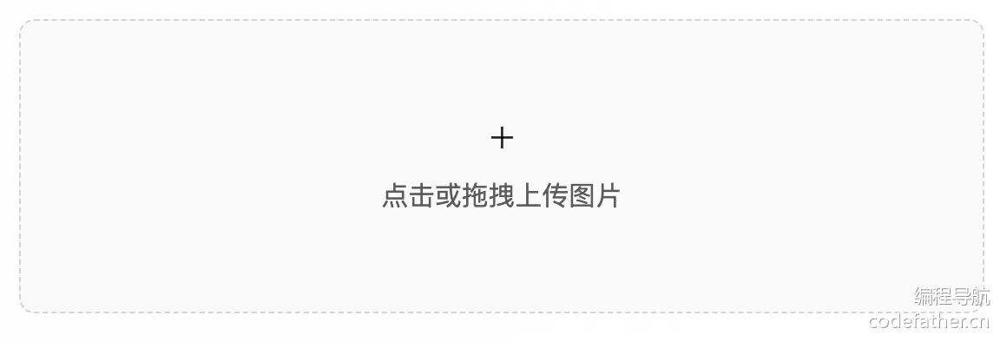

#### 3、开发创建页面

1）先开发页面结构，从上到下分别是页面标题、图片上传组件和表单。表单支持填写名称、简介、分类和标签：

```vue
<div id="addPicturePage">  
  <h2 style="margin-bottom: 16px">创建图片</h2>  
  <PictureUpload :picture="picture" :onSuccess="onSuccess" />  
  <a-form layout="vertical" :model="pictureForm" @finish="handleSubmit">  
    <a-form-item label="名称" name="name">  
      <a-input v-model:value="pictureForm.name" placeholder="请输入名称" />  
    </a-form-item>  
    <a-form-item label="简介" name="introduction">  
      <a-textarea  
        v-model:value="pictureForm.introduction"  
        placeholder="请输入简介"  
        :rows="2"  
        autoSize  
        allowClear  
      />  
    </a-form-item>  
    <a-form-item label="分类" name="category">  
      <a-auto-complete  
        v-model:value="pictureForm.category"  
        placeholder="请输入分类"  
        allowClear  
      />  
    </a-form-item>  
    <a-form-item label="标签" name="tags">  
      <a-select  
        v-model:value="pictureForm.tags"  
        mode="tags"  
        placeholder="请输入标签"  
        allowClear  
      />  
    </a-form-item>  
    <a-form-item>  
      <a-button type="primary" html-type="submit" style="width: 100%">创建</a-button>  
    </a-form-item>  
  </a-form>  
</div>
```

注意，我们针对不同的数据使用了不同的输入组件：

- 名称：[普通输入框](https://antdv.com/components/input-cn#components-input-demo-basic)
- 简介：[TextArea 多行输入框](https://antdv.com/components/input-cn#components-input-demo-autosize-textarea)
- 分类：[AutoComplete 输入框](https://antdv.com/components/auto-complete-cn)，可以自由输入，同时会给出搜索提示
- 标签：[Select 选择框](https://antdv.com/components/select-cn#components-select-demo-tags)，使用 mode="tags" 支持自由输入和多选

定义变量，接受上传的图片和填写的表单信息：

```typescript
const picture = ref<API.PictureVO>()  
const pictureForm = reactive<API.PictureEditRequest>({})
```

可以限制下页面最大宽度，让用户视角更集中：

```css
#addPicturePage {  
  max-width: 720px;  
  margin: 0 auto;  
}
```

效果如图：

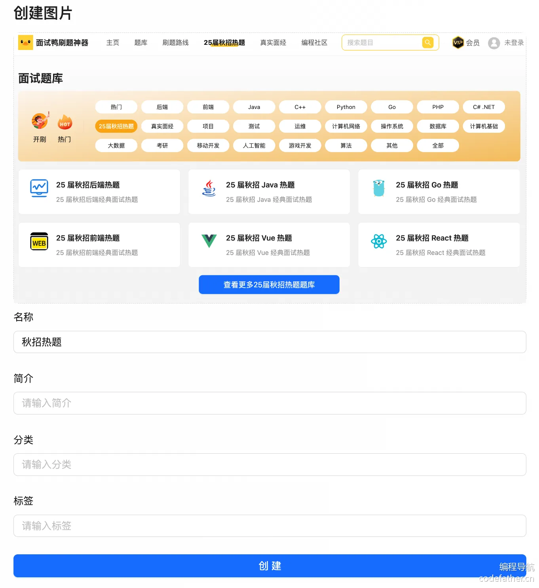

2）上传图片后，可以将得到的图片信息（比如名称）填充到表单，直接赋值即可：

```typescript
const onSuccess = (newPicture: API.PictureVO) => {  
  picture.value = newPicture  
  pictureForm.name = newPicture.name  
}
```

3）编写提交表单的函数，需要带着上传图片得到的 pictureId 来调用后端 **修改图片接口**（而不是上传接口）：

```typescript
const router = useRouter()  
  
/**  
 * 提交表单  
 * @param values  
 */  
const handleSubmit = async (values: any) => {  
  const pictureId = picture.value.id  
  if (!pictureId) {  
    return  
  }  
  const res = await editPictureUsingPost({  
    id: pictureId,  
    ...values,  
  })  
  if (res.data.code === 0 && res.data.data) {  
    message.success('创建成功')  
    // 跳转到图片详情页  
    router.push({  
      path: `/picture/${pictureId}`,  
    })  
  } else {  
    message.error('创建失败，' + res.data.message)  
  }  
}
```

创建成功后，需要跳转到图片详情页。

4）给分类和标签选择框补充选项数据，注意需要转换为输入组件接受的格式：

```typescript
const categoryOptions = ref<string[]>([])  
const tagOptions = ref<string[]>([])  
  
// 获取标签和分类选项  
const getTagCategoryOptions = async () => {  
  const res = await listPictureTagCategoryUsingGet()  
  if (res.data.code === 0 && res.data.data) {  
    // 转换成下拉选项组件接受的格式  
    tagOptions.value = (res.data.data.tagList ?? []).map((data: string) => {  
      return {  
        value: data,  
        label: data,  
      }  
    })  
    categoryOptions.value = (res.data.data.categoryList ?? []).map((data: string) => {  
      return {  
        value: data,  
        label: data,  
      }  
    })  
  } else {  
    message.error('加载选项失败，' + res.data.message)  
  }  
}  
  
onMounted(() => {  
  getTagCategoryOptions()  
})
```

给组件补充 options 选项：

```vue
<a-form-item label="分类" name="category">  
  <a-auto-complete  
    v-model:value="pictureForm.category"  
    :options="categoryOptions"  
    placeholder="请输入分类"  
    allowClear  
  />  
</a-form-item>  
<a-form-item label="标签" name="tags">  
  <a-select  
    v-model:value="pictureForm.tags"  
    :options="tagOptions"  
    mode="tags"  
    placeholder="请输入标签"  
    allowClear  
  />  
</a-form-item>
```

效果如图：

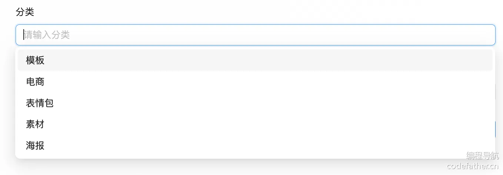

5）最后，可以再做一些优化，比如像某视频网站投稿一样，上传图片后才展示更多表单项。

直接用 v-if 判断即可，picture 为空则表示图片未上传：

```vue
<a-form v-if="picture" layout="vertical" :model="pictureForm"@finish="handleSubmit">  
</a-form>
```

效果如图：

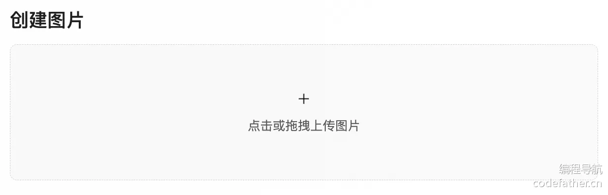

### 图片信息修改

可以直接复用创建页面，在页面后增加 URL 查询参数 `?id=xx` 表示要修改对应 id 的图片。

没传这个参数则表示创建新图片，有 id 的话就直接根据 id 查询到 picture 数据，并且将值填充到表单项中，其他的逻辑和创建图片是兼容的。

1）根据 id 查询要修改的图片数据，并设置到 picture 变量中：

```typescript
const route = useRoute()  
  
// 获取老数据  
const getOldPicture = async () => {  
  // 获取数据  
  const id = route.query?.id  
  if (id) {  
    const res = await getPictureVoByIdUsingGet({  
      id: id,  
    })  
    if (res.data.code === 0 && res.data.data) {  
      const data = res.data.data  
      picture.value = data  
      pictureForm.name = data.name  
      pictureForm.introduction = data.introduction  
      pictureForm.category = data.category  
      pictureForm.tags = data.tags  
    }  
  }  
}  
  
onMounted(() => {  
  getOldPicture()  
})
```

2）优化页面细节，比如设置合适的标题：

```typescript
<h2 style="margin-bottom: 16px">  
  {{ route.query?.id ? '修改图片' : '创建图片' }}  
</h2>
```

效果如图：

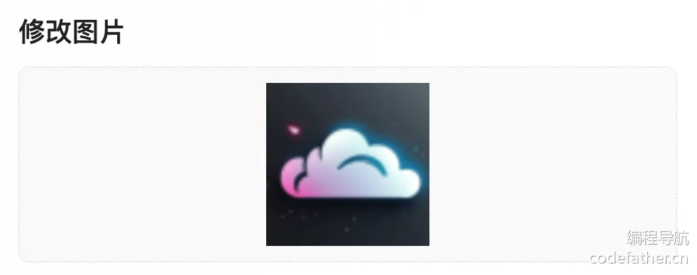

### 图片管理

#### 1、新建路由和菜单

首先新建 `admin/PictureManagePage.vue` 页面文件，在 `router/index.ts` 中定义路由：

```typescript
{  
  path: '/admin/pictureManage',  
  name: '图片管理',  
  component: PictureManagePage,  
}
```

在 GlobalHeader 组件中补充菜单：

```typescript
{  
  key: '/admin/pictureManage',  
  label: '图片管理',  
  title: '图片管理',  
}
```

由于之前已经编写了权限校验逻辑，地址以 /admin 开头的页面都会限制为仅管理员可见和可用，所以无需再编写额外的权限校验代码。

#### 2、开发管理页面

跟用户管理页面类似，页面的上方是搜索栏，下方是表格，表格需要支持分页。

大多数的内容可以直接复用用户管理页面的代码，可以先复制过来，再进行修改。

1）给表格定义展示的列：

```typescript
const columns = [  
  {  
    title: 'id',  
    dataIndex: 'id',  
    width: 80,  
  },  
  {  
    title: '图片',  
    dataIndex: 'url',  
  },  
  {  
    title: '名称',  
    dataIndex: 'name',  
  },  
  {  
    title: '简介',  
    dataIndex: 'introduction',  
    ellipsis: true,  
  },  
  {  
    title: '类型',  
    dataIndex: 'category',  
  },  
  {  
    title: '标签',  
    dataIndex: 'tags',  
  },  
  {  
    title: '图片信息',  
    dataIndex: 'picInfo',  
  },  
  {  
    title: '用户 id',  
    dataIndex: 'userId',  
    width: 80,  
  },  
  {  
    title: '创建时间',  
    dataIndex: 'createTime',  
  },  
  {  
    title: '编辑时间',  
    dataIndex: 'editTime',  
  },  
  {  
    title: '操作',  
    key: 'action',  
  },  
]
```

2）从后端获取数据，并支持搜索和分页：

```typescript
// 数据  
const dataList = ref([])  
const total = ref(0)  
  
// 搜索条件  
const searchParams = reactive<API.PictureQueryRequest>({  
  current: 1,  
  pageSize: 10,  
  sortField: 'createTime',  
  sortOrder: 'descend',  
})  
  
// 分页参数  
const pagination = computed(() => {  
  return {  
    current: searchParams.current ?? 1,  
    pageSize: searchParams.pageSize ?? 10,  
    total: total.value,  
    showSizeChanger: true,  
    showTotal: (total) => `共 ${total} 条`,  
  }  
})  
  
// 获取数据  
const fetchData = async () => {  
  const res = await listPictureByPageUsingPost({  
    ...searchParams,  
  })  
  if (res.data.data) {  
    dataList.value = res.data.data.records ?? []  
    total.value = res.data.data.total ?? 0  
  } else {  
    message.error('获取数据失败，' + res.data.message)  
  }  
}  
  
// 页面加载时请求一次  
onMounted(() => {  
  fetchData()  
})  
  
// 获取数据  
const doSearch = () => {  
  // 重置搜索条件  
  searchParams.current = 1  
  fetchData()  
}  
  
// 表格变化处理  
const doTableChange = (page: any) => {  
  searchParams.current = page.current  
  searchParams.pageSize = page.pageSize  
  fetchData()  
}
```

注意：

1. 跟用户管理页面不同的是，默认按照创建时间降序展示图片，最新的图片会被优先看到。
2. 获取数据时，调用的是仅管理员可用的查询接口 listPictureByPageUsingPost（不是给用户使用的查询包装类接口）

3）自定义列的展示，比如图片、标签、图片解析信息、创建时间、编辑时间等：

```vue
<template #bodyCell="{ column, record }">  
  <template v-if="column.dataIndex === 'url'">  
    <a-image :src="record.url" :width="120" />  
  </template>  
  <!-- 标签 -->  
  <template v-if="column.dataIndex === 'tags'">  
    <a-space wrap>  
      <a-tag v-for="tag in JSON.parse(record.tags || '[]')" :key="tag">{{ tag }}</a-tag>  
    </a-space>  
  </template>  
  <!-- 图片信息 -->  
  <template v-if="column.dataIndex === 'picInfo'">  
    <div>格式：{{ record.picFormat }}</div>  
    <div>宽度：{{ record.picWidth }}</div>  
    <div>高度：{{ record.picHeight }}</div>  
    <div>宽高比：{{ record.picScale }}</div>  
    <div>大小：{{ (record.picSize / 1024).toFixed(2) }}KB</div>  
  </template>  
  <template v-else-if="column.dataIndex === 'createTime'">  
    {{ dayjs(record.createTime).format('YYYY-MM-DD HH:mm:ss') }}  
  </template>  
  <template v-else-if="column.dataIndex === 'editTime'">  
    {{ dayjs(record.editTime).format('YYYY-MM-DD HH:mm:ss') }}  
  </template>  
  <template v-else-if="column.key === 'action'">  
    <a-button type="link" danger @click="doDelete(record.id)">删除</a-button>  
  </template>  
</template>
```

注意，由于后端返回的 tags 类型是字符串，需要用 `JSON.parse` 转为 JS 数组。

4）开发搜索表单，支持按照关键词、类型和标签搜索：

```vue
<a-form layout="inline" :model="searchParams" @finish="doSearch">  
  <a-form-item label="关键词" name="searchText">  
    <a-input  
      v-model:value="searchParams.searchText"  
      placeholder="从名称和简介搜索"  
      allow-clear  
    />  
  </a-form-item>  
  <a-form-item label="类型" name="category">  
    <a-input v-model:value="searchParams.category" placeholder="请输入类型" allow-clear />  
  </a-form-item>  
  <a-form-item label="标签" name="tags">  
    <a-select  
      v-model:value="searchParams.tags"  
      mode="tags"  
      placeholder="请输入标签"  
      style="min-width: 180px"  
      allow-clear  
    />  
  </a-form-item>  
  <a-form-item>  
    <a-button type="primary" html-type="submit">搜索</a-button>  
  </a-form-item>  
</a-form>
```

5）补充操作按钮。

可以在搜索表单上新增一行，展示标题和创建图片按钮，点击按钮会打开创建图片页面：

```vue
<a-flex justify="space-between">  
  <h2>图片管理</h2>  
  <a-button type="primary" href="/add_picture" target="_blank">+ 创建图片</a-button>  
</a-flex>
```

在表格操作列中，可以补充编辑按钮，点击后打开编辑图片页面：

```vue
<a-space>  
  <a-button type="link" :href="`/add_picture?id=${record.id}`" target="_blank">编辑</a-button>  
  <a-button type="link" danger @click="doDelete(record.id)">删除</a-button>  
</a-space>
```

最终页面效果如图：

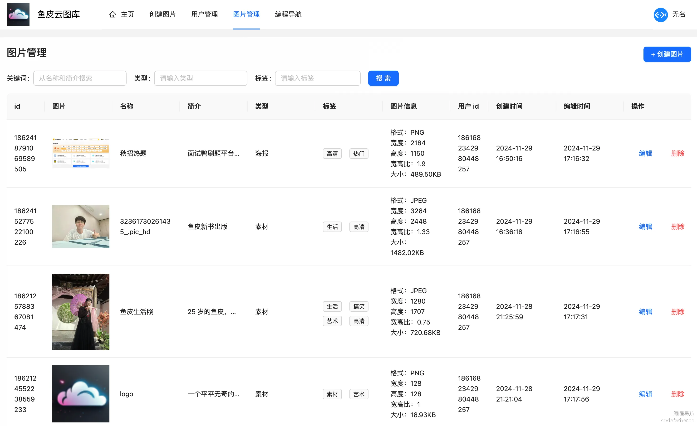

💡 如果觉得表格的列在窄屏下会受到挤压，可以给 table 组件增加属性 `:scroll="{ x: 'max-content' }"`，使表格支持横向滚动。

### 图片列表页（主页）

整个页面布局从上到下依次为：搜索框、分类选项、标签选项、图片列表、分页操作栏。

#### 1、分页列表开发

1）使用 [响应式的 List 组件](https://antdv.com/components/list-cn#components-list-demo-resposive) ，会根据屏幕大小调整每行展示的图片数：

```vue
<!-- 图片列表 -->  
<a-list  
  :grid="{ gutter: 16, xs: 1, sm: 2, md: 3, lg: 4, xl: 5, xxl: 6 }"  
  :data-source="dataList"  
  :pagination="pagination"  
  :loading="loading"  
>  
  <template #renderItem="{ item: picture }">  
    <a-list-item>  
      <!-- 单张图片 -->  
    </a-list-item>  
  </template>  
</a-list>
```

2）定义数据、搜索条件、分页参数，以及获取数据的函数：

```typescript
// 数据  
const dataList = ref([])  
const total = ref(0)  
const loading = ref(true)  
  
// 搜索条件  
const searchParams = reactive<API.PictureQueryRequest>({  
  current: 1,  
  pageSize: 12,  
  sortField: 'createTime',  
  sortOrder: 'descend',  
})  
  
// 分页参数  
const pagination = computed(() => {  
  return {  
    current: searchParams.current ?? 1,  
    pageSize: searchParams.pageSize ?? 10,  
    total: total.value,  
    // 切换页号时，会修改搜索参数并获取数据  
    onChange: (page, pageSize) => {  
      searchParams.current = page  
      searchParams.pageSize = pageSize  
      fetchData()  
    },  
  }  
})  
  
// 获取数据  
const fetchData = async () => {  
  loading.value = true  
  const res = await listPictureVoByPageUsingPost(searchParams)  
  if (res.data.data) {  
    dataList.value = res.data.data.records ?? []  
    total.value = res.data.data.total ?? 0  
  } else {  
    message.error('获取数据失败，' + res.data.message)  
  }  
  loading.value = false  
}  
  
// 页面加载时请求一次  
onMounted(() => {  
  fetchData()  
})
```

注意，上述代码中，鱼皮故意移除了数据的总数和切换每页数量的选择器，这些信息没必要对用户展示，可以让页面更精简。

3）展示图片，可以使用 [Card 组件](https://antdv.com/components/card-cn#components-card-demo-flexible-content)：

```vue
<a-list-item style="padding: 0">  
  <!-- 单张图片 -->  
  <a-card hoverable>  
    <template #cover>  
        
    </template>  
    <a-card-meta :title="picture.name">  
      <template #description>  
        <a-flex>  
          <a-tag color="green">  
            {{ picture.category ?? '默认' }}  
          </a-tag>  
          <a-tag v-for="tag in picture.tags" :key="tag">  
            {{ tag }}  
          </a-tag>  
        </a-flex>  
      </template>  
    </a-card-meta>  
  </a-card>  
</a-list-item>
```

注意，由于图片的宽高都是不同的，为了防止页面 “参差不齐”，给所有图片统一设置相同的高度、并使用 `object-fit: cover` 优化图片的展示效果，不会受到挤压。

效果如图：


#### 2、搜索能力开发

1）开发搜索框，使用 [Input.Search 组件](https://antdv.com/components/input-cn#components-input-demo-search-input)，先定义页面结构：

```vue
▼<!-- 搜索框 -->  
<div class="search-bar">  
  <a-input-search  
    placeholder="从海量图片中搜索"  
    v-model:value="searchParams.searchText"  
    enter-button="搜索"  
    size="large"  
    @search="doSearch"  
  />  
</div>
```

2）点击搜索按钮时，触发搜索事件：

```typescript
const doSearch = () => {  
  // 重置搜索条件  
  searchParams.current = 1  
  fetchData()  
}
```

3）优化 CSS 样式：

```vue
#homePage .search-bar {  
  max-width: 480px;  
  margin: 0 auto 16px;  
}
```

#### 3、分类和标签筛选能力

1）先开发页面结构。分类仅支持单选，可以使用 [Tabs 组件](https://antdv.com/components/tabs-cn#components-tabs-demo-slide)；标签支持多选，可以使用 [标签选择器组件](https://antdv.com/components/tag-cn#components-tag-demo-checkable)。

为了支持取消选中的分类，可以新增一个 “全部” 分类，页面代码如下：

```vue
<!-- 分类 + 标签 -->  
<a-tabs v-model:activeKey="selectedCategory" @change="doSearch">  
  <a-tab-pane key="all" tab="全部" />  
  <a-tab-pane v-for="category in categoryList" :key="category" :tab="category" />  
</a-tabs>  
<div class="tag-bar">  
  <span style="margin-right: 8px">标签：</span>  
  <a-space :size="[0, 8]" wrap>  
    <a-checkable-tag  
      v-for="(tag, index) in tagList"  
      :key="tag"  
      v-model:checked="selectedTagList[index]"  
      @change="doSearch"  
    >  
      {{ tag }}  
    </a-checkable-tag>  
  </a-space>  
</div>
```

2）定义可选分类 / 标签列表、选中的分类 / 标签，并获取分类和标签选项：

```typescript
const categoryList = ref<string[]>([])  
const selectedCategory = ref<string>('all')  
const tagList = ref<string[]>([])  
const selectedTagList = ref<string[]>([])  
  
// 获取标签和分类选项  
const getTagCategoryOptions = async () => {  
  const res = await listPictureTagCategoryUsingGet()  
  if (res.data.code === 0 && res.data.data) {  
    // 转换成下拉选项组件接受的格式  
    categoryList.value = res.data.data.categoryList ?? []  
    tagList.value = res.data.data.tagList ?? []  
  } else {  
    message.error('加载分类标签失败，' + res.data.message)  
  }  
}  
  
onMounted(() => {  
  getTagCategoryOptions()  
})
```

3）在搜索时，需要将选中的分类和标签转换为对应的请求参数：

```typescript
const fetchData = async () => {  
  loading.value = true  
  // 转换搜索参数  
  const params = {  
    ...searchParams,  
    tags: [],  
  }  
  if (selectedCategory.value !== 'all') {  
    params.category = selectedCategory.value  
  }  
  selectedTagList.value.forEach((useTag, index) => {  
    if (useTag) {  
      params.tags.push(tagList.value[index])  
    }  
  })  
  const res = await listPictureVoByPageUsingPost(params)  
  if (res.data.data) {  
    dataList.value = res.data.data.records ?? []  
    total.value = res.data.data.total ?? 0  
  } else {  
    message.error('获取数据失败，' + res.data.message)  
  }  
  loading.value = false  
}
```

4）给图片卡片绑定点击时间，点击图片后会跳转到图片详情页。

修改页面：

```vue
<!-- 单张图片 -->  
<a-card hoverable @click="doClickPicture(picture)">
```

补充跳转事件：

```typescript
const router = useRouter()  
// 跳转至图片详情  
const doClickPicture = (picture) => {  
  router.push({  
    path: `/picture/${picture.id}`,  
  })  
}
```

最终的页面效果如图，是不是有内味儿了？

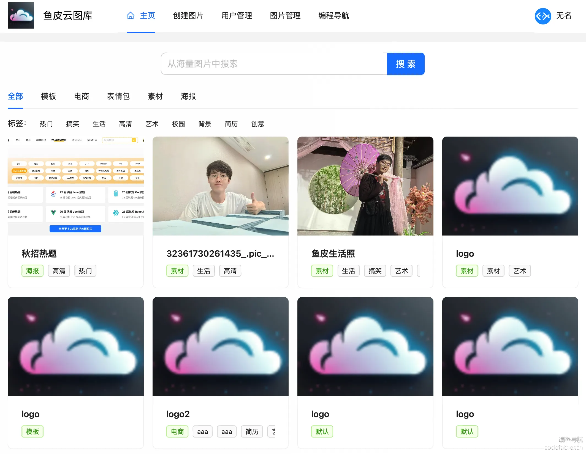

#### 4、扩展思路

1）如果想保留当前用户之前的搜索参数，可以在修改搜索参数时，同步修改 URL 查询参数；并且在页面刷新时，将 URL 查询参数设置到搜索参数中。

2）优化图片列表的展示效果。可以用自适应瀑布流 + 下拉加载的方式实现，网上有很多的插件。但是注意，为了防止下拉加载时获得重复的数据，后端最好改为使用游标查询。

3）优化图片本身的展示效果。可以将卡片的额外信息折叠到图片内部，实现悬浮遮罩的效果，用 CSS 就能实现了，类似下图：


### 图片详情页

#### 1、新建路由

首先新建 `PictureDetailPage.vue` 页面文件，在 `router/index.ts` 中定义路由：

```typescript
{  
  path: '/picture/:id',  
  name: '图片详情',  
  component: PictureDetailPage,  
  props: true,  
}
```

由于图片详情页要展示的图片是根据 id 而变化的，所以此处使用动态路由。在页面中可以使用 props 获取到动态的参数：

```typescript
const props = defineProps<{  
  id: string | number  
}>()
```

然后就可以在页面加载时，通过 id 调用接口来获取到图片：

```typescript
const picture = ref<API.PictureVO>({})  
  
// 获取图片详情  
const fetchPictureDetail = async () => {  
  try {  
    const res = await getPictureVoByIdUsingGet({  
      id: props.id,  
    })  
    if (res.data.code === 0 && res.data.data) {  
      picture.value = res.data.data  
    } else {  
      message.error('获取图片详情失败，' + res.data.message)  
    }  
  } catch (e: any) {  
    message.error('获取图片详情失败：' + e.message)  
  }  
}  
  
onMounted(() => {  
  fetchPictureDetail()  
})
```

#### 2、页面开发

1）采用一行两列的响应式布局结构，左边使用 [图片浏览组件](https://antdv.com/components/image-cn) 展示图片，右边使用 [描述列表组件](https://antdv.com/components/descriptions-cn#components-descriptions-demo-vertical) 展示图片信息。

```vue
<a-row :gutter="[16, 16]">  
  <!-- 图片展示区 -->  
  <a-col :sm="24" :md="16" :xl="18">  
    <a-card title="图片预览">  
      <a-image  
        style="max-height: 600px; object-fit: contain"  
        :src="picture.url"  
      />  
    </a-card>  
  </a-col>  
  <!-- 图片信息区 -->  
  <a-col :sm="24" :md="8" :xl="6">  
    <a-card title="图片信息">  
      <a-descriptions :column="1">  
        <a-descriptions-item label="作者">  
          <a-space>  
            <a-avatar :size="24" :src="picture.user?.userAvatar" />  
            <div>{{ picture.user?.userName }}</div>  
          </a-space>  
        </a-descriptions-item>  
        <a-descriptions-item label="名称">  
          {{ picture.name ?? '未命名' }}  
        </a-descriptions-item>  
        <a-descriptions-item label="简介">  
          {{ picture.introduction ?? '-' }}  
        </a-descriptions-item>  
        <a-descriptions-item label="分类">  
          {{ picture.category ?? '默认' }}  
        </a-descriptions-item>  
        <a-descriptions-item label="标签">  
          <a-tag v-for="tag in picture.tags" :key="tag">  
            {{ tag }}  
          </a-tag>  
        </a-descriptions-item>  
        <a-descriptions-item label="格式">  
          {{ picture.picFormat ?? '-' }}  
        </a-descriptions-item>  
        <a-descriptions-item label="宽度">  
          {{ picture.picWidth ?? '-' }}  
        </a-descriptions-item>  
        <a-descriptions-item label="高度">  
          {{ picture.picHeight ?? '-' }}  
        </a-descriptions-item>  
        <a-descriptions-item label="宽高比">  
          {{ picture.picScale ?? '-' }}  
        </a-descriptions-item>  
        <a-descriptions-item label="大小">  
          {{ formatSize(picture.picSize) }}  
        </a-descriptions-item>  
      </a-descriptions>  
    </a-card>  
  </a-col>  
</a-row>
```

注意，为了防止图片过高，给图片设置最大高度；并且设置 `object-fit: contain` 让图片能够完整展示。

可以将计算图片尺寸的代码移动到 `utils/index.ts` 中，作为工具类，可在其他位置复用：

```typescript
/**  
 * 格式化文件大小  
 * @param size  
 */  
export const formatSize = (size?: number) => {  
  if (!size) return '未知'  
  if (size < 1024) return size + ' B'  
  if (size < 1024 * 1024) return (size / 1024).toFixed(2) + ' KB'  
  return (size / (1024 * 1024)).toFixed(2) + ' MB'  
}
```

2）在描述列表下补充操作按钮，对于图片上传者或管理员，可以编辑和删除图片：

```vue
<a-space wrap>  
  <a-button v-if="canEdit" type="default" @click="doEdit">  
    编辑  
    <template #icon>  
      <EditOutlined />  
    </template>  
  </a-button>  
  <a-button v-if="canEdit" danger @click="doDelete">  
    删除  
    <template #icon>  
      <DeleteOutlined />  
    </template>  
  </a-button>  
</a-space>
```

编写权限判断逻辑，canEdit 的值为 true 表示有编辑和删除权限：

```typescript
const loginUserStore = useLoginUserStore()  
// 是否具有编辑权限  
const canEdit = computed(() => {  
  const loginUser = loginUserStore.loginUser;  
  // 未登录不可编辑  
  if (!loginUser.id) {  
    return false  
  }  
  // 仅本人或管理员可编辑  
  const user = picture.value.user || {}  
  return loginUser.id === user.id || loginUser.userRole === 'admin'  
})
```

编写对应的事件：

```typescript
// 编辑  
const doEdit = () => {  
  router.push('/add_picture?id=' + picture.value.id)  
}  
// 删除  
const doDelete = async () => {  
  const id = picture.value.id  
  if (!id) {  
    return  
  }  
  const res = await deletePictureUsingPost({ id })  
  if (res.data.code === 0) {  
    message.success('删除成功')  
  } else {  
    message.error('删除失败')  
  }  
}
```

### 图片下载

最后，我们来开发图片下载功能。之前方案设计中提到，为了实现方便，我们可以直接从对象存储的 URL 下载图片，无需经过后端。

前端可以使用 `file-saver` 库，下载指定 URL 或者后端返回的 blob 内容为文件。

1）先安装 `file-saver` 库：

```bash
npm install file-saver  
npm i --save-dev @types/file-saver
```

2）在图片详情页的操作区域补充下载按钮：

```vue
<a-button type="primary" @click="doDownload">  
  免费下载  
  <template #icon>  
    <DownloadOutlined />  
  </template>  
</a-button>
```

3）定义下载事件：

```typescript
// 处理下载  
const doDownload = () => {  
  downloadImage(picture.value.url)  
}
```

4）在 `utils/index.ts` 中补充下载图片的工具函数：

```typescript
/**  
 * 下载图片  
 * @param url 图片下载地址  
 * @param fileName 要保存为的文件名  
 */  
export function downloadImage(url?: string, fileName?: string) {  
  if (!url) {  
    return  
  }  
  saveAs(url, fileName)  
}
```

最终页面效果如图：

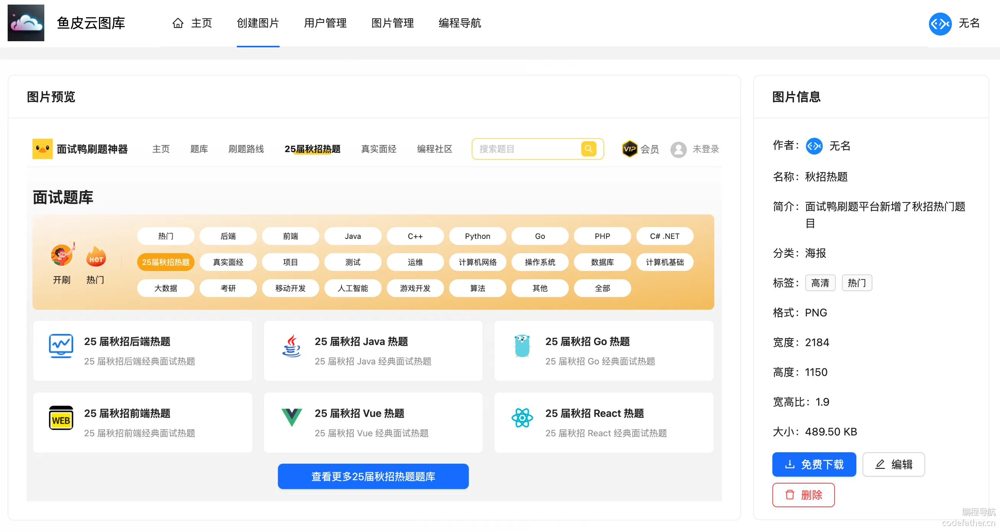

## 五、扩展思路

1）使用数据库表动态管理网站的标签和分类，前端也可以添加对应的管理界面，即标签管理和分类管理。

2）可以使用定时任务或者标签表增加 “使用数” 字段的方式统计标签的使用次数，给主页展示出热门标签，帮助用户更快地找到需要的内容。（分类同理）

3）可以在图片上传成功后，利用 AI 自动补充简介、标签和分类（较难）。


# 5 - 用户传图

## 本节重点

之前为了方便和安全性，只支持管理员上传图片，如果想让平台素材更丰富，也要允许用户自主上传图片。

本节我们就重点开发用户传图能力，并支持更多传图的方式，大纲：

- 支持用户上传图片和审核功能
- 通过 URL 导入图片
- 批量抓取和创建图片

## 一、用户上传图片及审核

### 需求分析

之前我们已经开发了管理员上传图片功能，想实现用户上传图片就比较简单了，但是我们要考虑到一点 “用户上传的内容可能是不安全的”。

一般只要涉及到 “用户上传内容”（俗称 UGC）的场景，就要增加审核功能。

具体分析每个需求：

1）用户上传创建图片：需要开放权限，允许用户上传图片，功能和流程跟之前管理员上传图片一致，也要增加文件校验。

2）管理员审核图片：管理员可以查看和 **筛选** 所有待审核的图片，并标记为通过或拒绝，可填写通过或拒绝的具体原因。此外，需要记录审核人和审核时间作为日志，如果发现误审的情况也可以追责。

### 方案设计

方案设计阶段我们需要确认：

- 审核的具体逻辑
- 库表设计

#### 1、审核逻辑

1）管理员可以操作审核的状态流转：

- 默认为 “待审核”，可以设置为 “审核通过” 或 “审核拒绝”
- 已拒绝的图片可以重新审核为通过
- 已通过的图片可以撤销为拒绝状态

2）管理员自动审核：管理员上传 / 更新图片时，图片自动审核通过，并且自动填充审核参数 —— 设置审核人为创建人、审核时间为当前时间、审核原因为 “管理员自动过审”。

3）用户操作需要审核：用户上传或编辑图片时，图片的状态会被重置为“待审核”。

重复审核时，既可以选择重置 **所有** 审核参数，也可以仅重置审核状态。其余参数在前端不展示，但是在后端保留，以便管理员参考历史审核信息。

4）控制内容可见性：对于用户来说，应该只能看见 “审核通过” 状态的数据；管理员可以在图片管理页面看到所有数据，并且根据审核状态筛选图片。

Q：是否要考虑并发问题呢？

A：由于审核操作为管理员手动执行，不涉及复杂的奖励机制或并发高频请求，误审核或重复审核对系统影响不大，因此无需过度考虑并发问题。

#### 2、库表设计

为了支持审核功能，我们在 picture 图片表中新增审核相关字段，同时优化索引设计以提升查询性能。

修改表的 SQL 如下：

```sql
ALTER TABLE picture  
    -- 添加新列  
    ADD COLUMN reviewStatus INT DEFAULT 0 NOT NULL COMMENT '审核状态：0-待审核; 1-通过; 2-拒绝',  
    ADD COLUMN reviewMessage VARCHAR(512) NULL COMMENT '审核信息',  
    ADD COLUMN reviewerId BIGINT NULL COMMENT '审核人 ID',  
    ADD COLUMN reviewTime DATETIME NULL COMMENT '审核时间';  
  
-- 创建基于 reviewStatus 列的索引  
CREATE INDEX idx_reviewStatus ON picture (reviewStatus);
```

注意事项：

1）审核状态：reviewStatus 使用整数（0、1、2）表示不同的审核状态，而不是用字符串，可以节约表的空间、提升查找效率。

2）索引设计：由于要根据审核状态筛选图片，所以给该字段添加索引，提升查询性能。sqWmWUk8kFL4uPey9+8ro5dv7g8fCeOwW9uL7T8/Q4k=

下面我们进行开发，先后端再前端。

### 后端开发

#### 1、数据模型开发

由于新增了一些审核相关的字段，要对原有的数据模型（实体类、包装类等）进行修改。

1）实体类 Picture 新增：

```java
/**  
 * 状态：0-待审核; 1-通过; 2-拒绝  
 */  
private Integer reviewStatus;  
  
/**  
 * 审核信息  
 */  
private String reviewMessage;  
  
/**  
 * 审核人 id  
 */  
private Long reviewerId;  
  
/**  
 * 审核时间  
 */  
private Date reviewTime;
```

2）图片查询请求类 PictureQueryRequest 新增：

```java
/**  
 * 状态：0-待审核; 1-通过; 2-拒绝  
 */  
private Integer reviewStatus;  
  
/**  
 * 审核信息  
 */  
private String reviewMessage;  
  
/**  
 * 审核人 id  
 */  
private Long reviewerId;
```

3）新建审核状态枚举类：

```java
@Getter  
public enum PictureReviewStatusEnum {  
    REVIEWING("待审核", 0),  
    PASS("通过", 1),  
    REJECT("拒绝", 2);  
  
    private final String text;  
    private final int value;  
  
    PictureReviewStatusEnum(String text, int value) {  
        this.text = text;  
        this.value = value;  
    }  
  
    /**  
     * 根据 value 获取枚举  
     */  
    public static PictureReviewStatusEnum getEnumByValue(Integer value) {  
        if (ObjUtil.isEmpty(value)) {  
            return null;  
        }  
        for (PictureReviewStatusEnum pictureReviewStatusEnum : PictureReviewStatusEnum.values()) {  
            if (pictureReviewStatusEnum.value == value) {  
                return pictureReviewStatusEnum;  
            }  
        }  
        return null;  
    }  
}
```

#### 2、管理员审核功能

1）开发请求包装类，注意不需要增加 reviewerId 和 reviewTime 字段，这两个是由系统自动填充的，而不是由前端传递。

```java
@Data  
public class PictureReviewRequest implements Serializable {  
  
    /**  
     * id  
     */  
    private Long id;  
  
    /**  
     * 状态：0-待审核, 1-通过, 2-拒绝  
     */  
    private Integer reviewStatus;  
  
    /**  
     * 审核信息  
     */  
    private String reviewMessage;  
  
  
    private static final long serialVersionUID = 1L;  
}
```

2）开发审核服务

接口：

```java
/**  
 * 图片审核  
 *  
 * @param pictureReviewRequest  
 * @param loginUser  
 */  
void doPictureReview(PictureReviewRequest pictureReviewRequest, User loginUser);
```

实现类：

```java
@Override  
public void doPictureReview(PictureReviewRequest pictureReviewRequest, User loginUser) {  
    Long id = pictureReviewRequest.getId();  
    Integer reviewStatus = pictureReviewRequest.getReviewStatus();  
    PictureReviewStatusEnum reviewStatusEnum = PictureReviewStatusEnum.getEnumByValue(reviewStatus);  
    if (id == null || reviewStatusEnum == null || PictureReviewStatusEnum.REVIEWING.equals(reviewStatusEnum)) {  
        throw new BusinessException(ErrorCode.PARAMS_ERROR);  
    }  
    // 判断是否存在  
    Picture oldPicture = this.getById(id);  
    ThrowUtils.throwIf(oldPicture == null, ErrorCode.NOT_FOUND_ERROR);  
    // 已是该状态  
    if (oldPicture.getReviewStatus().equals(reviewStatus)) {  
        throw new BusinessException(ErrorCode.PARAMS_ERROR, "请勿重复审核");  
    }  
    // 更新审核状态  
    Picture updatePicture = new Picture();  
    BeanUtils.copyProperties(pictureReviewRequest, updatePicture);  
    updatePicture.setReviewerId(loginUser.getId());  
    updatePicture.setReviewTime(new Date());  
    boolean result = this.updateById(updatePicture);  
    ThrowUtils.throwIf(!result, ErrorCode.OPERATION_ERROR);  
}
```

3）开发审核接口，注意权限设置为仅管理员可用：

```java
@PostMapping("/review")  
@AuthCheck(mustRole = UserConstant.ADMIN_ROLE)  
public BaseResponse<Boolean> doPictureReview(@RequestBody PictureReviewRequest pictureReviewRequest,  
                                             HttpServletRequest request) {  
    ThrowUtils.throwIf(pictureReviewRequest == null, ErrorCode.PARAMS_ERROR);  
    User loginUser = userService.getLoginUser(request);  
    pictureService.doPictureReview(pictureReviewRequest, loginUser);  
    return ResultUtils.success(true);  
}
```

#### 3、审核状态设置

1）权限控制

首先取消上传图片接口（uploadPicture）的权限校验注解，但是注意，由于图片上传功能是支持图片编辑的，所以需要做好编辑权限控制 —— 仅本人或管理员可编辑。

修改 PictureService 的 uploadPicture 方法，补充权限校验逻辑：

```java
// 如果是更新图片，需要校验图片是否存在  
if (pictureId != null) {  
    Picture oldPicture = this.getById(pictureId);  
    ThrowUtils.throwIf(oldPicture == null, ErrorCode.NOT_FOUND_ERROR, "图片不存在");  
    // 仅本人或管理员可编辑  
    if (!oldPicture.getUserId().equals(loginUser.getId()) && !userService.isAdmin(loginUser)) {  
        throw new BusinessException(ErrorCode.NO_AUTH_ERROR);  
    }  
}
```

2）设置审核状态：管理员自动过审并且填充审核参数；用户上传或编辑图片时，图片的状态会被重置为“待审核”。

由于图片上传、用户编辑、管理员更新这 3 个操作都需要设置审核状态，所以我们可以先编写一个通用的 “补充审核参数” 的方法，根据用户的角色给图片对象填充审核字段的值。

```java
@Override  
public void fillReviewParams(Picture picture, User loginUser) {  
    if (userService.isAdmin(loginUser)) {  
        // 管理员自动过审  
        picture.setReviewStatus(PictureReviewStatusEnum.PASS.getValue());  
        picture.setReviewerId(loginUser.getId());  
        picture.setReviewMessage("管理员自动过审");  
        picture.setReviewTime(new Date());  
    } else {  
        // 非管理员，创建或编辑都要改为待审核  
        picture.setReviewStatus(PictureReviewStatusEnum.REVIEWING.getValue());  
    }  
}
```

分别给 3 个操作补充审核参数。图片更新接口：

```java
public BaseResponse<Boolean> updatePicture(@RequestBody PictureUpdateRequest pictureUpdateRequest  
        , HttpServletRequest request) {  
    // ...  
    Picture oldPicture = pictureService.getById(id);  
    ThrowUtils.throwIf(oldPicture == null, ErrorCode.NOT_FOUND_ERROR);  
    // 补充审核参数  
    User loginUser = userService.getLoginUser(request);  
    pictureService.fillReviewParams(picture, loginUser);  
    // 操作数据库  
    boolean result = pictureService.updateById(picture);  
    ThrowUtils.throwIf(!result, ErrorCode.OPERATION_ERROR);  
    return ResultUtils.success(true);  
}
```

图片修改接口：

```java
public BaseResponse<Boolean> editPicture(@RequestBody PictureEditRequest pictureEditRequest, HttpServletRequest request) {  
    // ...  
    if (!oldPicture.getUserId().equals(loginUser.getId()) && !userService.isAdmin(loginUser)) {  
        throw new BusinessException(ErrorCode.NO_AUTH_ERROR);  
    }  
    // 补充审核参数  
    pictureService.fillReviewParams(picture, loginUser);  
    // 操作数据库  
    boolean result = pictureService.updateById(picture);  
    ThrowUtils.throwIf(!result, ErrorCode.OPERATION_ERROR);  
    return ResultUtils.success(true);  
}
```

上传图片服务：

```java
@Override  
public PictureVO uploadPicture(Object inputSource, PictureUploadRequest pictureUploadRequest, User loginUser) {  
    // ...  
    picture.setPicFormat(uploadPictureResult.getPicFormat());  
    picture.setUserId(loginUser.getId());  
    // 补充审核参数  
    fillReviewParams(picture, loginUser);  
    // 如果 pictureId 不为空，表示更新，否则是新增  
    if (pictureId != null) {  
        // 如果是更新，需要补充 id 和编辑时间  
        picture.setId(pictureId);  
        picture.setEditTime(new Date());  
    }  
    // ...  
}
```

#### 4、控制内容可见性

目前我们只有主页给用户查看图片列表，所以需要修改主页调用的 listPictureVOByPage 接口，补充查询条件即可，默认只能查看已过审的数据：

```java
// 普通用户默认只能查看已过审的数据  
pictureQueryRequest.setReviewStatus(PictureReviewStatusEnum.PASS.getValue());  
// 查询数据库  
Page<Picture> picturePage = pictureService.page(new Page<>(current, size),  
        pictureService.getQueryWrapper(pictureQueryRequest));
```

需要同步更改 PictureService 的 getQueryWrapper 方法，支持根据审核字段进行查询：

```java
Integer reviewStatus = pictureQueryRequest.getReviewStatus();  
String reviewMessage = pictureQueryRequest.getReviewMessage();  
Long reviewerId = pictureQueryRequest.getReviewerId();  
queryWrapper.eq(ObjUtil.isNotEmpty(reviewStatus), "reviewStatus", reviewStatus);  
queryWrapper.like(StrUtil.isNotBlank(reviewMessage), "reviewMessage", reviewMessage);  
queryWrapper.eq(ObjUtil.isNotEmpty(reviewerId), "reviewerId", reviewerId);
```

这样一来，后端就同时支持了 “管理员筛选审核状态” 的功能。

至此，用户上传图片及审核的后端就开发完成了。

Q：根据 id 查询图片的接口需要做同样的限制么？

A：对目前咱们的系统来说，用户正常情况下不会得到未过审图片的 id，影响面较小，可以暂时不做，感兴趣的同学按需优化即可。

### 前端开发

控制首页未过审的图片不可见已经通过后端接口实现，我们只需开发管理员审核和按审核状态筛选图片功能即可。

#### 1、定义审核常量

和后端一样，前端也有很多地方要用到审核状态信息，可以定义为一个常量。

在 `constants` 目录下新建 picture.ts 常量文件，定义枚举信息、对应的中文映射、以及后续筛选审核状态时要用到的选项数组：

```typescript
export const PIC_REVIEW_STATUS_ENUM = {  
  REVIEWING: 0,  
  PASS: 1,  
  REJECT: 2,  
}  
  
export const PIC_REVIEW_STATUS_MAP = {  
  0: '待审核',  
  1: '通过',  
  2: '拒绝',  
}  
  
export const PIC_REVIEW_STATUS_OPTIONS = Object.keys(PIC_REVIEW_STATUS_MAP).map((key) => {  
  return {  
    label: PIC_REVIEW_STATUS_MAP[key],  
    value: key,  
  }  
})
```

#### 2、管理员审核功能

1）表格列新增审核信息：

```typescript
const columns = [  
  // ...  
  {  
    title: '审核信息',  
    dataIndex: 'reviewMessage',  
  },  
  // ...  
]
```

2）自定义审核信息列要展示的内容：

```vue
<!-- 审核信息 -->  
<template v-if="column.dataIndex === 'reviewMessage'">  
  <div>审核状态：{{ PIC_REVIEW_STATUS_MAP[record.reviewStatus] }}</div>  
  <div>审核信息：{{ record.reviewMessage }}</div>  
  <div>审核人：{{ record.reviewerId }}</div>  
</template>
```

3）新增审核通过和拒绝的操作按钮：

```vue
<template v-else-if="column.key === 'action'">  
  <a-space wrap>  
    <a-button  
      v-if="record.reviewStatus !== PIC_REVIEW_STATUS_ENUM.PASS"  
      type="link"  
      @click="handleReview(record, PIC_REVIEW_STATUS_ENUM.PASS)"  
    >  
      通过  
    </a-button>  
    <a-button  
      v-if="record.reviewStatus !== PIC_REVIEW_STATUS_ENUM.REJECT"  
      type="link"  
      danger  
      @click="handleReview(record, PIC_REVIEW_STATUS_ENUM.REJECT)"  
    >  
      拒绝  
    </a-button>  
    <a-button type="link" :href="`/add_picture?id=${record.id}`" target="_blank"  
      >编辑  
    </a-button>  
    <a-button type="link" danger @click="doDelete(record.id)">删除</a-button>  
  </a-space>  
</template>
```

4）编写审核函数，调用后端完成操作：

```typescript
const handleReview = async (record: API.Picture, reviewStatus: number) => {  
  const reviewMessage = reviewStatus === PIC_REVIEW_STATUS_ENUM.PASS ? '管理员操作通过' : '管理员操作拒绝'  
  const res = await doPictureReviewUsingPost({  
    id: record.id,  
    reviewStatus,  
    reviewMessage,  
  })  
  if (res.data.code === 0) {  
    message.success('审核操作成功')  
    // 重新获取列表  
    fetchData()  
  } else {  
    message.error('审核操作失败，' + res.data.message)  
  }  
}
```

#### 3、按审核状态筛选

只需要在原来的搜索表单中补充一个表单项即可，使用下拉框组件，传入定义好的审核状态常量作为选项：

```vue
<a-form-item label="审核状态" name="reviewStatus">  
  <a-select  
    v-model:value="searchParams.reviewStatus"  
    :options="PIC_REVIEW_STATUS_OPTIONS"  
    placeholder="请输入审核状态"  
    style="min-width: 180px"  
    allow-clear  
  />  
</a-form-item>
```

#### 前端扩展

1）审核通过或拒绝时可以填写原因，可以利用 [模态框组件](https://antdv.com/components/modal-cn) 实现

2）可以在详情页添加审核通过、审核拒绝的快捷操作按钮，仅管理员可见

3）删除和拒绝属于危险操作，可以点击后提示确认框，确认后才执行操作。可以利用 [组件](https://antdv.com/components/popconfirm-cn) 实现

### 测试

测试流程：

1. 普通用户上传图片，此时主页看不到这张图片
2. 管理员操作过审，主页就可以看到这张图片
3. 管理员操作拒绝，主页将无法看到这张图片

运行效果如图：

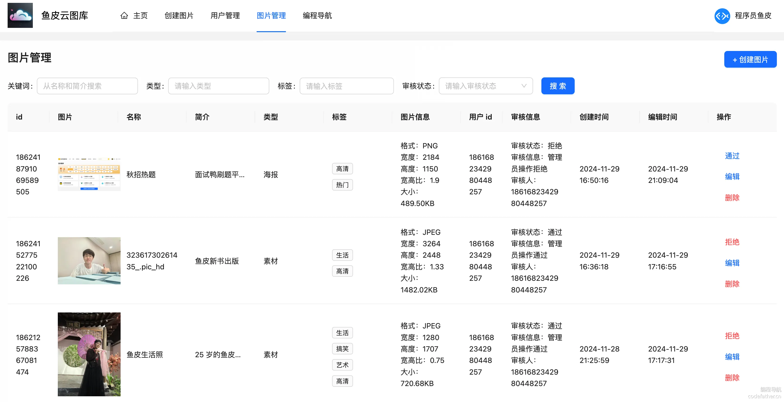

Q：有同学说，用户现在看不到自己被拒绝的图片啊？怎么修改？

A：本项目后续会带大家开发用户个人空间，到时候会完成这个功能。

#### 1、更多审核策略

在实际企业中，为了提高审核效率、减少垃圾内容，同时保证用户体验和平台的安全性，常常会结合技术手段和业务策略来优化审核流程。比如下面几点，大家可以按需扩展：

1. 内容安全审核服务：借助专业的第三方平台的内容审核服务来实现自动审核，像腾讯云、阿里云等基本都支持图片、文本、音视频等内容的审核。
2. AI 审核：可以将文本内容和审核规则输入给 AI，让 AI 返回是否合规。
3. 分级审核策略：区分普通用户与高信誉用户，高信誉用户可减少或免除审核流程，比如 VIP 用户自动过审，也可以提高部分效率。
4. 实名信息和内容溯源：通过用户实名或者手机号注册，提高用户行为的责任感，减少垃圾内容的产生。
5. 举报机制：通过给平台增加举报机制，还可以给举报行为一些奖励，让用户帮忙维护平台。

#### 2、审核通知

当管理员完成审核后，系统可以通过消息中心或邮件通知用户审核结果。

## 二、通过 URL 导入图片

### 需求分析

为了提高上传图片的效率，除了支持上传本地文件外，还可以支持输入一个远程 URL，直接将网上已有的图片导入到我们的系统中。

### 方案设计

实现原理很简单，但是有一些细节需要注意：

1）下载图片：后端服务器从指定的远程 URL 下载图片到本地临时存储。对于 Java 项目，可以直接使用 Hutool 的 `HttpUtil.downloadFile` 方法一行代码完成。

2）校验图片：跟验证本地文件一样，需要校验图片的格式、大小等。

传统的校验思路是先把文件下载到本地，再对本地文件进行校验，有没有更节省资源的方法呢？

**其实可以先对 URL 本身进行校验。**首先是校验 URL 字符串本身的合法性，比如要是一个合理的 URL 地址。此外，可以先使用 `HEAD` 请求来获取 URL 对应文件的元信息（如文件大小、格式等）。HEAD 请求仅返回 HTTP 响应头信息，而不会下载文件的内容，大大降低了网络流量的消耗。/MBNmaRtUhzDE9b4tB/jsqs1ClvvhzK+S4KVLPihc/I=

> 注意此处不能使用 GET 请求，它会获取完整文件。

3）上传图片：将校验通过的图片上传到对象存储服务，生成存储 URL。

之后的流程就都可以复用从本地上传图片的流程了。

### 后端开发

#### 1、服务开发

先编写通过 URL 上传文件的方法，为了便于开发，直接在 FileManager 类中编写，绝大多数代码跟之前的 uploadPicture 方法一致，只需要改动以下 4 处位置：

方法接受的参数：之前是 MultipartFile 文件类型，现在是 String 字符串类型

1. 校验图片：之前是校验文件，现在是校验 URL
2. 获取文件名称：之前是根据文件获取，现在是根据 URL 获取
3. 保存临时文件：之前是将 MultipartFile 写入到临时文件，现在是从 URL 下载文件

代码如下：

```java
public UploadPictureResult uploadPictureByUrl(String fileUrl, String uploadPathPrefix) {  
    // 校验图片  
    // validPicture(multipartFile);  
    validPicture(fileUrl);  
    // 图片上传地址  
    String uuid = RandomUtil.randomString(16);  
    // String originFilename = multipartFile.getOriginalFilename();  
    String originFilename = FileUtil.mainName(fileUrl);  
    String uploadFilename = String.format("%s_%s.%s", DateUtil.formatDate(new Date()), uuid,  
            FileUtil.getSuffix(originFilename));  
    String uploadPath = String.format("/%s/%s", uploadPathPrefix, uploadFilename);  
    File file = null;  
    try {  
        // 创建临时文件  
        file = File.createTempFile(uploadPath, null);  
        // multipartFile.transferTo(file);  
        HttpUtil.downloadFile(fileUrl, file);  
        // 上传图片  
        // ... 其余代码保持不变  
    } catch (Exception e) {  
        log.error("图片上传到对象存储失败", e);  
        throw new BusinessException(ErrorCode.SYSTEM_ERROR, "上传失败");  
    } finally {  
        this.deleteTempFile(file);  
    }  
}
```

#### 2、校验 URL 图片

编写校验 URL 图片的方法，分别校验 URL 格式、协议、文件是否存在、文件格式、文件大小。

代码如下：

```java
private void validPicture(String fileUrl) {  
    ThrowUtils.throwIf(StrUtil.isBlank(fileUrl), ErrorCode.PARAMS_ERROR, "文件地址不能为空");  
  
    try {  
        // 1. 验证 URL 格式  
        new URL(fileUrl); // 验证是否是合法的 URL  
    } catch (MalformedURLException e) {  
        throw new BusinessException(ErrorCode.PARAMS_ERROR, "文件地址格式不正确");  
    }  
  
    // 2. 校验 URL 协议  
    ThrowUtils.throwIf(!(fileUrl.startsWith("http://") || fileUrl.startsWith("https://")),  
            ErrorCode.PARAMS_ERROR, "仅支持 HTTP 或 HTTPS 协议的文件地址");  
  
    // 3. 发送 HEAD 请求以验证文件是否存在  
    HttpResponse response = null;  
    try {  
        response = HttpUtil.createRequest(Method.HEAD, fileUrl).execute();  
        // 未正常返回，无需执行其他判断  
        if (response.getStatus() != HttpStatus.HTTP_OK) {  
            return;  
        }  
        // 4. 校验文件类型  
        String contentType = response.header("Content-Type");  
        if (StrUtil.isNotBlank(contentType)) {  
            // 允许的图片类型  
            final List<String> ALLOW_CONTENT_TYPES = Arrays.asList("image/jpeg", "image/jpg", "image/png", "image/webp");  
            ThrowUtils.throwIf(!ALLOW_CONTENT_TYPES.contains(contentType.toLowerCase()),  
                    ErrorCode.PARAMS_ERROR, "文件类型错误");  
        }  
        // 5. 校验文件大小  
        String contentLengthStr = response.header("Content-Length");  
        if (StrUtil.isNotBlank(contentLengthStr)) {  
            try {  
                long contentLength = Long.parseLong(contentLengthStr);  
                final long TWO_MB = 2 * 1024 * 1024L; // 限制文件大小为 2MB  
                ThrowUtils.throwIf(contentLength > TWO_MB, ErrorCode.PARAMS_ERROR, "文件大小不能超过 2M");  
            } catch (NumberFormatException e) {  
                throw new BusinessException(ErrorCode.PARAMS_ERROR, "文件大小格式错误");  
            }  
        }  
    } finally {  
        if (response != null) {  
            response.close();  
        }  
    }  
}
```

上述代码中，注意 2 点：

1. 注意发送 HTTP 请求后，需要即时释放资源
2. 有些 URL 地址可能不支持通过 HEAD 请求访问，为了提高导入成功率，即使 HEAD 请求访问失败，也不会报错，并且不用执行后续的校验。**仅对能获取到的信息进行校验。**

#### 3、优化代码 - 模板方法模式

目前我们的 FileManager 文件内写了两种不同的上传文件的方法，但是我们会发现，这两种方法的 **流程完全一致**、而且大多数代码都是相同的。

这种情况下，我们就要想要运用设计模式 —— **模板方法模式** 对代码进行优化。

模板方法模式是行为型设计模式，适用于具有通用处理流程、但处理细节不同的情况。通过定义一个抽象模板类，提供通用的业务流程处理逻辑，并将不同的部分定义为抽象方法，由子类具体实现。

在我们的场景中，两种文件上传方法的流程都是：

1. 校验文件
2. 获取上传地址
3. 获取本地临时文件
4. 上传到对象存储
5. 封装解析得到的图片信息
6. 清理临时文件

可以将这些流程抽象为一套模板（抽象类），将每个实现不一样的步骤都定义为一个抽象方法，比如：

1. 校验图片
2. 获取文件名称
3. 保存临时文件

下面开始开发，先在 `manager` 包下新建 `upload` 包，将模板方法有关的代码全部放在该包下统一管理。

1）新建图片上传模板 **抽象类** PictureUploadTemplate，代码如下：

```java
@Slf4j  
public abstract class PictureUploadTemplate {  
  
    @Resource  
    protected CosManager cosManager;  
  
    @Resource  
    protected CosClientConfig cosClientConfig;  
  
    /**  
     * 模板方法，定义上传流程  
     */  
    public final UploadPictureResult uploadPicture(Object inputSource, String uploadPathPrefix) {  
        // 1. 校验图片  
        validPicture(inputSource);  
  
        // 2. 图片上传地址  
        String uuid = RandomUtil.randomString(16);  
        String originFilename = getOriginFilename(inputSource);  
        String uploadFilename = String.format("%s_%s.%s", DateUtil.formatDate(new Date()), uuid,  
                FileUtil.getSuffix(originFilename));  
        String uploadPath = String.format("/%s/%s", uploadPathPrefix, uploadFilename);  
  
        File file = null;  
        try {  
            // 3. 创建临时文件  
            file = File.createTempFile(uploadPath, null);  
            // 处理文件来源（本地或 URL）  
            processFile(inputSource, file);  
  
            // 4. 上传图片到对象存储  
            PutObjectResult putObjectResult = cosManager.putPictureObject(uploadPath, file);  
            ImageInfo imageInfo = putObjectResult.getCiUploadResult().getOriginalInfo().getImageInfo();  
  
            // 5. 封装返回结果  
            return buildResult(originFilename, file, uploadPath, imageInfo);  
        } catch (Exception e) {  
            log.error("图片上传到对象存储失败", e);  
            throw new BusinessException(ErrorCode.SYSTEM_ERROR, "上传失败");  
        } finally {  
            // 6. 清理临时文件  
            deleteTempFile(file);  
        }  
    }  
  
    /**  
     * 校验输入源（本地文件或 URL）  
     */  
    protected abstract void validPicture(Object inputSource);  
  
    /**  
     * 获取输入源的原始文件名  
     */  
    protected abstract String getOriginFilename(Object inputSource);  
  
    /**  
     * 处理输入源并生成本地临时文件  
     */  
    protected abstract void processFile(Object inputSource, File file) throws Exception;  
  
    /**  
     * 封装返回结果  
     */  
    private UploadPictureResult buildResult(String originFilename, File file, String uploadPath, ImageInfo imageInfo) {  
        UploadPictureResult uploadPictureResult = new UploadPictureResult();  
        int picWidth = imageInfo.getWidth();  
        int picHeight = imageInfo.getHeight();  
        double picScale = NumberUtil.round(picWidth * 1.0 / picHeight, 2).doubleValue();  
        uploadPictureResult.setPicName(FileUtil.mainName(originFilename));  
        uploadPictureResult.setPicWidth(picWidth);  
        uploadPictureResult.setPicHeight(picHeight);  
        uploadPictureResult.setPicScale(picScale);  
        uploadPictureResult.setPicFormat(imageInfo.getFormat());  
        uploadPictureResult.setPicSize(FileUtil.size(file));  
        uploadPictureResult.setUrl(cosClientConfig.getHost() + "/" + uploadPath);  
        return uploadPictureResult;  
    }  
  
    /**  
     * 删除临时文件  
     */  
    public void deleteTempFile(File file) {  
        if (file == null) {  
            return;  
        }  
        boolean deleteResult = file.delete();  
        if (!deleteResult) {  
            log.error("file delete error, filepath = {}", file.getAbsolutePath());  
        }  
    }  
}
```

上述代码中，我们把每个步骤都封装为了一个单独的方法，公共的实现（比如 `deleteTempFile`）可以直接放到模板中，而不用放到具体的实现类中。

**注意，为了让模板同时兼容 MultiPartFile 和 String 类型的文件参数，直接将这两种情况统一为 Object 类型的 inputSource 输入源。**

2）新建本地图片上传子类 FilePictureUpload，继承模板，并且打上 `@Service` 注解生成 Bean 实例：

```java
@Service  
public class FilePictureUpload extends PictureUploadTemplate {  
  
    @Override  
    protected void validPicture(Object inputSource) {  
        MultipartFile multipartFile = (MultipartFile) inputSource;  
        ThrowUtils.throwIf(multipartFile == null, ErrorCode.PARAMS_ERROR, "文件不能为空");  
        // 1. 校验文件大小  
        long fileSize = multipartFile.getSize();  
        final long ONE_M = 1024 * 1024L;  
        ThrowUtils.throwIf(fileSize > 2 * ONE_M, ErrorCode.PARAMS_ERROR, "文件大小不能超过 2M");  
        // 2. 校验文件后缀  
        String fileSuffix = FileUtil.getSuffix(multipartFile.getOriginalFilename());  
        // 允许上传的文件后缀  
        final List<String> ALLOW_FORMAT_LIST = Arrays.asList("jpeg", "jpg", "png", "webp");  
        ThrowUtils.throwIf(!ALLOW_FORMAT_LIST.contains(fileSuffix), ErrorCode.PARAMS_ERROR, "文件类型错误");  
    }  
  
    @Override  
    protected String getOriginFilename(Object inputSource) {  
        MultipartFile multipartFile = (MultipartFile) inputSource;  
        return multipartFile.getOriginalFilename();  
    }  
  
    @Override  
    protected void processFile(Object inputSource, File file) throws Exception {  
        MultipartFile multipartFile = (MultipartFile) inputSource;  
        multipartFile.transferTo(file);  
    }  
}
```

3）新建 URL 图片上传子类 UrlPictureUpload，继承模板，并且打上 `@Service` 注解生成 Bean 实例：

```java
@Service  
public class UrlPictureUpload extends PictureUploadTemplate {  
    @Override  
    protected void validPicture(Object inputSource) {  
        String fileUrl = (String) inputSource;  
        ThrowUtils.throwIf(StrUtil.isBlank(fileUrl), ErrorCode.PARAMS_ERROR, "文件地址不能为空");  
        // ... 跟之前的校验逻辑保持一致  
    }  
  
    @Override  
    protected String getOriginFilename(Object inputSource) {  
        String fileUrl = (String) inputSource;  
        // 从 URL 中提取文件名  
        return FileUtil.mainName(fileUrl);  
    }  
  
    @Override  
    protected void processFile(Object inputSource, File file) throws Exception {  
        String fileUrl = (String) inputSource;  
        // 下载文件到临时目录  
        HttpUtil.downloadFile(fileUrl, file);  
    }  
}
```

优化完后，可以还原 FileManager 文件，并添加 `@Deprecated` 注解表示已废弃，后续将直接使用文件上传模板类 PictureUploadTemplate。

```java
/**  
 * 文件服务  
 * @deprecated 已废弃，改为使用 upload 包的模板方法优化  
 */  
@Deprecated
```

#### 4、图片上传服务支持 URL 上传

由于图片上传的逻辑还是比较复杂的，尽量让 URL 上传复用之前的代码。

但是之前图片上传服务的 uploadPicture 方法接受的是文件类型的参数，现在要支持 URL 上传，怎么办呢？

可以将输入参数跟上述模板一样，改为 Object 类型的 inputSource，然后在代码中可以根据 inputSource 的实际类型，来选择对应的图片上传子类。代码如下：

```java
@Resource  
private FilePictureUpload filePictureUpload;  
  
@Resource  
private UrlPictureUpload urlPictureUpload;  
  
// 上传图片  
public PictureVO uploadPicture(Object inputSource, PictureUploadRequest pictureUploadRequest, User loginUser) {  
    if (inputSource == null) {  
        throw new BusinessException(ErrorCode.PARAMS_ERROR, "图片为空");  
    }  
    // ...  
    // 按照用户 id 划分目录  
    String uploadPathPrefix = String.format("public/%s", loginUser.getId());  
    // 根据 inputSource 类型区分上传方式  
    PictureUploadTemplate pictureUploadTemplate = filePictureUpload;  
    if (inputSource instanceof String) {  
        pictureUploadTemplate = urlPictureUpload;  
    }  
    UploadPictureResult uploadPictureResult = pictureUploadTemplate.uploadPicture(inputSource, uploadPathPrefix);  
    // 构造要入库的图片信息  
    // ...  
}
```

💡 除了通过对象类型判断外，也可以通过传一个业务参数（如 type）来区分不同的上传方式。

#### 5、接口开发

1）在请求封装类 PictureUploadRequest 中新增 fileUrl 文件地址：

```java
@Data  
public class PictureUploadRequest implements Serializable {  
  
    /**  
     * 图片 id（用于修改）  
     */  
    private Long id;  
  
    /**  
     * 文件地址  
     */  
    private String fileUrl;  
  
    private static final long serialVersionUID = 1L;  
}
```

2）在 PictureContoller 中新增接口，通过 URL 上传图片：

```java
/**  
 * 通过 URL 上传图片（可重新上传）  
 */  
@PostMapping("/upload/url")  
public BaseResponse<PictureVO> uploadPictureByUrl(  
        @RequestBody PictureUploadRequest pictureUploadRequest,  
        HttpServletRequest request) {  
    User loginUser = userService.getLoginUser(request);  
    String fileUrl = pictureUploadRequest.getFileUrl();  
    PictureVO pictureVO = pictureService.uploadPicture(fileUrl, pictureUploadRequest, loginUser);  
    return ResultUtils.success(pictureVO);  
}
```

然后可以通过 Swagger 接口文档测试本地文件图片和 URL 图片的上传，示例图片 URL：https://www.codefather.cn/logo.png

### 前端开发

和本地上传图片的开发流程一样，我们先来开发一个 URL 上传图片的组件，绝大多数代码都可以复用本地上传图片组件。

#### 1、URL 上传组件

URL 上传组件 = 文本输入框 + 提交按钮

可以使用组件库的 [复合输入框组件](https://antdv.com/components/input-cn#components-input-demo-group)：

```vue
<div class="url-picture-upload">  
  <a-input-group compact style="margin-bottom: 16px">  
    <a-input v-model:value="fileUrl" style="width: calc(100% - 120px)" placeholder="请输入图片 URL" />  
    <a-button type="primary" :loading="loading" @click="handleUpload" style="width: 120px">提交</a-button>  
  </a-input-group>  
    
</div>
```

开发上传操作函数，需要将用户输入的 fileUrl 提交到后端：

```typescript
const loading = ref<boolean>(false)  
const fileUrl = ref<string>()  
  
/**  
 * 上传  
 */  
const handleUpload = async () => {  
  loading.value = true  
  try {  
    const params: API.PictureUploadRequest = { fileUrl: fileUrl.value }  
    if (props.picture) {  
      params.id = props.picture.id  
    }  
    const res = await uploadPictureByUrlUsingPost(params)  
    if (res.data.code === 0 && res.data.data) {  
      message.success('图片上传成功')  
      // 将上传成功的图片信息传递给父组件  
      props.onSuccess?.(res.data.data)  
    } else {  
      message.error('图片上传失败，' + res.data.message)  
    }  
  } catch (error) {  
    message.error('图片上传失败')  
  } finally {  
    loading.value = false  
  }  
}
```

#### 2、开发创建页面

之前已经开发了创建图片页面，可以在上传图片时增加一个 [Tabs 选项组件](https://antdv.com/components/tabs-cn)，让用户自己选择上传方式。

```vue
<!-- 选择上传方式 -->  
<a-tabs v-model:activeKey="uploadType"  
  >>  
  <a-tab-pane key="file" tab="文件上传">  
    <PictureUpload :picture="picture" :onSuccess="onSuccess" />  
  </a-tab-pane>  
  <a-tab-pane key="url" tab="URL 上传" force-render>  
    <UrlPictureUpload :picture="picture" :onSuccess="onSuccess" />  
  </a-tab-pane>  
</a-tabs>
```

定义上传类型变量：

```typescript
▼typescript

复制代码const uploadType = ref<'file' | 'url'>('file')
```

其他代码都不需要调整。你会发现只要开发思路清晰、代码结构良好，新功能的扩展是很快的

### 测试

没上传图片时，效果如图：

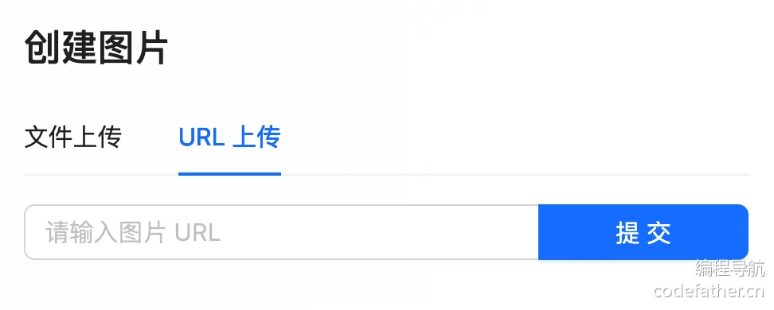

上传图片后，效果如图：


除了创建外，最好也测试下修改图片，防止优化代码的过程中出现了疏漏。6oQFIoMC2vFqWS6BDNDfWm34cANQaqyg4rGukImfAHk=

## 批量抓取和创建图片

### 需求分析

为了帮助管理员快速丰富图片库，冷启动项目，需要提供批量从网络抓取并创建图片的功能。

**但是要注意，不建议将该功能开放给普通用户！**主要是为了防止滥用导致的版权问题、低质量内容的上传、服务器资源消耗和安全问题。因为我们要从网络批量抓取图片（爬虫），如果功能开放给用户，相当于所有用户都在使用我们的服务器作为爬虫源头，容易导致我们的服务器 IP 被封禁。

### 方案设计

方案设计的重点包括：

- 如何抓取图片
- 抓取和导入规则

#### 1、如何抓取图片？

思考 2 个问题：从哪里抓取图片？怎么抓取图片呢？

绝大多数的图片素材网站，都是有版权保护的，不建议大家操作，容易被封禁 IP 和账号。比较安全的方法是从搜索引擎中抓取图片，仅学习使用、不商用的话基本不会有什么风险。

这里我们选择从 bing 搜索获取图片，首先进入 [bing 图片网站](https://cn.bing.com/images)，可以看到很多图片，但是如何获取这些图片呢？

qHT6Kxg12X1vklSWA3QVO0Z9aqth3Yj5Z1UQTagntCA=

有 2 种常见的做法，第一种是请求到完整的页面内容后，对页面的 HTML 结构进行解析，提取到图片的地址，再通过 URL 下载；还有一种是直接调用后端获取图片地址的接口拿到图片数据。

要使用哪种方式，还是要具体情况具体分析，比如在调研过程中，我们会发现直接从 bing 图片的首页抓取数据，可能会出现获取不到图片的情况。所以我们换一种策略，尝试去找图片接口。

按 F12 打开网络请求控制台，向下滚动图片时会触发新一波图片的加载，就能看到获取图片数据的接口了：https://cn.bing.com/images/async?q=%s&mmasync=1

> 注意，URL 地址必须要添加 mmasync=1 参数！否则加载条数不对

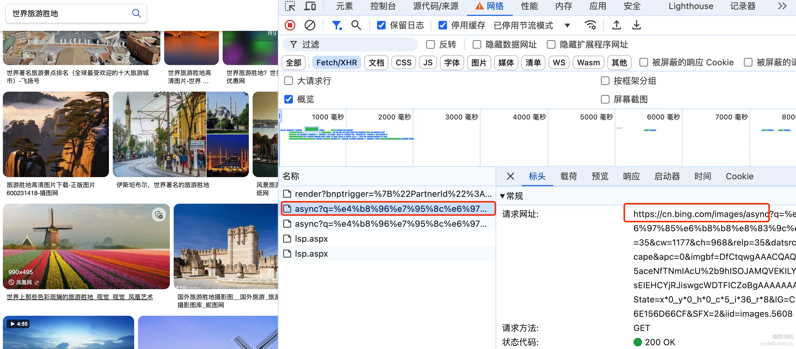

但是该接口返回的还是 HTML 文档结构，所以我们需要使用一个 HTML 文档解析库来提取图片地址，Java 中比较推荐 [jsoup](https://jsoup.org/)，非常地轻量。

jsoup 支持使用跟前端一致的选择器语法来定位 HTML 的元素，比如类选择器、CSS 选择器。我们可以先通过类选择器找到最外层的元素 `dgControl`，再通过 CSS 选择器 `img.mimg` 找到所有的图片元素：

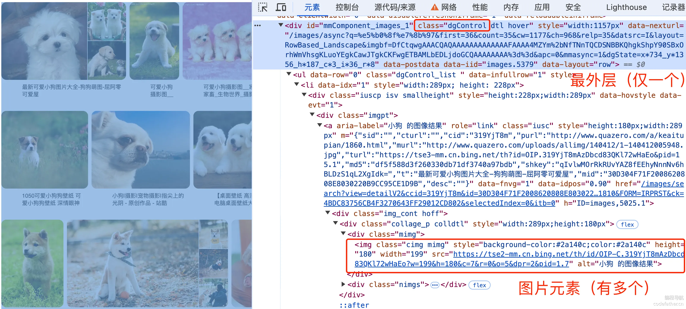

注意，图片的地址后面有很多附加参数，比如 `?w=199&h=180`，在导入图片时一定要移除！否则会影响图片的质量，还有可能导致上传到对象存储的文件包含被转义的特殊字符，引发无法访问等问题。

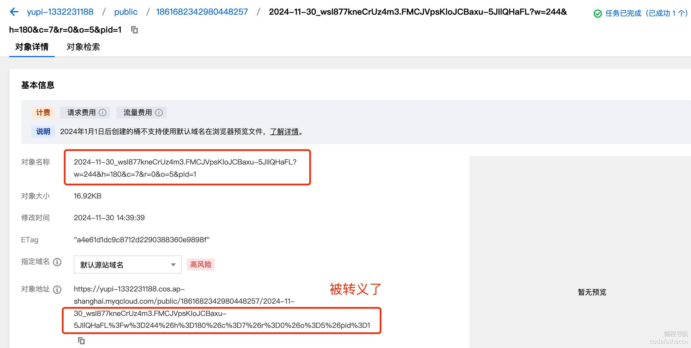

#### 2、抓取和导入规则

可以在抓取时，让管理员填写以下参数：

- 搜索关键词：便于找到需要的数据
- 抓取数量：单次要抓取的条数，不建议超过 30 条（接口单次返回的图片有限）

### 后端开发

#### 1、定义请求体

在 `model.dto.picture` 包下新建 PictureUploadByBatchRequest：

```java
@Data  
public class PictureUploadByBatchRequest {  
  
    /**  
     * 搜索词  
     */  
    private String searchText;  
  
    /**  
     * 抓取数量  
     */  
    private Integer count = 10;  
}
```

#### 2、开发服务

1）引入 [jsoup 库](https://jsoup.org/)，此处选 v1.15.3 版本，使用的人较多：

```xml
<!-- HTML 解析：https://jsoup.org/ -->  
<dependency>  
    <groupId>org.jsoup</groupId>  
    <artifactId>jsoup</artifactId>  
    <version>1.15.3</version>  
</dependency>
```

2）编写批量抓取和创建图片方法

接口：

```java
/**  
 * 批量抓取和创建图片  
 *  
 * @param pictureUploadByBatchRequest  
 * @param loginUser  
 * @return 成功创建的图片数  
 */  
Integer uploadPictureByBatch(  
    PictureUploadByBatchRequest pictureUploadByBatchRequest,  
    User loginUser  
);
```

实现类：

```java
@Override  
public int uploadPictureByBatch(PictureUploadByBatchRequest pictureUploadByBatchRequest, User loginUser) {  
    String searchText = pictureUploadByBatchRequest.getSearchText();  
    // 格式化数量  
    Integer count = pictureUploadByBatchRequest.getCount();  
    ThrowUtils.throwIf(count > 30, ErrorCode.PARAMS_ERROR, "最多 30 条");  
    // 要抓取的地址  
    String fetchUrl = String.format("https://cn.bing.com/images/async?q=%s&mmasync=1", searchText);  
    Document document;  
    try {  
        document = Jsoup.connect(fetchUrl).get();  
    } catch (IOException e) {  
        log.error("获取页面失败", e);  
        throw new BusinessException(ErrorCode.OPERATION_ERROR, "获取页面失败");  
    }  
    Element div = document.getElementsByClass("dgControl").first();  
    if (ObjUtil.isNull(div)) {  
        throw new BusinessException(ErrorCode.OPERATION_ERROR, "获取元素失败");  
    }  
    Elements imgElementList = div.select("img.mimg");  
    int uploadCount = 0;  
    for (Element imgElement : imgElementList) {  
        String fileUrl = imgElement.attr("src");  
        if (StrUtil.isBlank(fileUrl)) {  
            log.info("当前链接为空，已跳过: {}", fileUrl);  
            continue;  
        }  
        // 处理图片上传地址，防止出现转义问题  
        int questionMarkIndex = fileUrl.indexOf("?");  
        if (questionMarkIndex > -1) {  
            fileUrl = fileUrl.substring(0, questionMarkIndex);  
        }  
        // 上传图片  
        PictureUploadRequest pictureUploadRequest = new PictureUploadRequest();  
        try {  
            PictureVO pictureVO = this.uploadPicture(fileUrl, pictureUploadRequest, loginUser);  
            log.info("图片上传成功, id = {}", pictureVO.getId());  
            uploadCount++;  
        } catch (Exception e) {  
            log.error("图片上传失败", e);  
            continue;  
        }  
        if (uploadCount >= count) {  
            break;  
        }  
    }  
    return uploadCount;  
}
```

上述代码中，我们添加了很多日志记录和异常处理逻辑，使得单张图片抓取或导入失败时任务还能够继续执行，最终返回创建成功的图片数。

💡 如果抓取的内容数量较多，可以适当地 Thread.sleep 阻塞等待一段时间，减少服务器被封禁的概率。

#### 3、开发接口

在 Controller 中新增接口，注意限制仅管理员可用：

```java
@PostMapping("/upload/batch")  
@AuthCheck(mustRole = UserConstant.ADMIN_ROLE)  
public BaseResponse<Integer> uploadPictureByBatch(  
        @RequestBody PictureUploadByBatchRequest pictureUploadByBatchRequest,  
        HttpServletRequest request  
) {  
    ThrowUtils.throwIf(pictureUploadByBatchRequest == null, ErrorCode.PARAMS_ERROR);  
    User loginUser = userService.getLoginUser(request);  
    int uploadCount = pictureService.uploadPictureByBatch(pictureUploadByBatchRequest, loginUser);  
    return ResultUtils.success(uploadCount);  
}
```

#### 4、扩展功能 - 批量设置属性

之前我们导入系统的图片名称都是由对方的 URL 决定的，名称可能乱七八糟，而且不利于我们得知数据是在那一批被导入的。

因此我们可以让管理员在执行任务前指定 `名称前缀`，即导入到系统中的图片名称。比如前缀为 “鱼皮”，得到的图片名称就是 “鱼皮1”、“鱼皮2”。。。

相当于支持抓取和创建图片时批量对某批图片命名，名称前缀默认等于搜索关键词。

下面来开发实现：

1）给 PictureUploadByBatchRequest 请求包装类补充 namePrefix 参数：

```java
/**  
 * 名称前缀  
 */  
private String namePrefix;
```

2）由于图片名称是在 uploadPicture 方法中传入并设置给 Picture 图片对象的，所以需要给该方法接受的参数 PictureUploadRequest 类中补充 picName 参数：

```java
/**  
 * 图片名称  
 */  
private String picName;
```

3）修改 uploadPicture 服务方法，在构造入库图片信息时，可以通过 pictureUploadRequest 对象获取到要手动设置的图片名称，而不是完全依赖于解析的结果：

```java
// 构造要入库的图片信息  
Picture picture = new Picture();  
picture.setUrl(uploadPictureResult.getUrl());  
String picName = uploadPictureResult.getPicName();  
if (pictureUploadRequest != null && StrUtil.isNotBlank(pictureUploadRequest.getPicName())) {  
    picName = pictureUploadRequest.getPicName();  
}  
picture.setName(picName);
```

4）修改批量抓取和导入图片的服务方法 uploadPictureByBatch，补充图片名称生成逻辑：6oQFIoMC2vFqWS6BDNDfWm34cANQaqyg4rGukImfAHk=

```java
String namePrefix = pictureUploadByBatchRequest.getNamePrefix();  
if (StrUtil.isBlank(namePrefix)) {  
    namePrefix = searchText;  
}  
// ...  
// 上传图片  
PictureUploadRequest pictureUploadRequest = new PictureUploadRequest();  
if (StrUtil.isNotBlank(namePrefix)) {  
    // 设置图片名称，序号连续递增  
    pictureUploadRequest.setPicName(namePrefix + (uploadCount + 1));  
}
```

#### 5、接口测试

可以通过 Swagger 测试批量抓取和创建图片功能，效果如图：

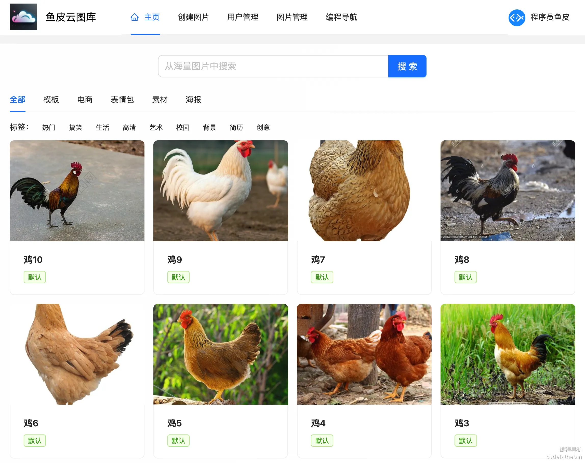

### 前端开发

可以新建一个批量创建图片页面，并且在图片管理页面补充跳转到该页面的按钮。

#### 1、图片管理页面补充按钮

管理页面补充 “批量创建图片” 按钮，代码如下：

```vue
<a-space>  
  <a-button type="primary" href="/add_picture" target="_blank">+ 创建图片</a-button>  
  <a-button type="primary" href="/add_picture/batch" target="_blank" ghost>+ 批量创建图片</a-button>  
</a-space>
```

效果如图：

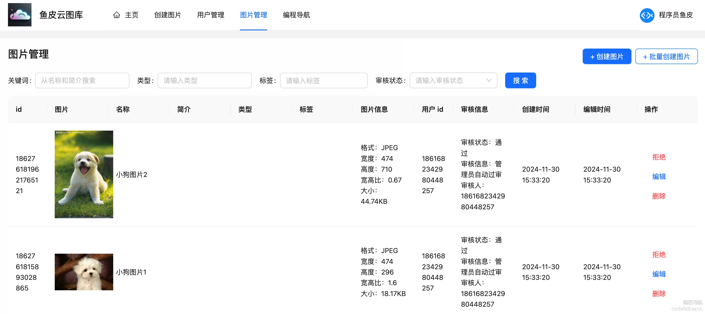

#### 2、批量创建图片页面

1）新建页面文件 `AddPictureBatchPage.vue`（复制创建图片页面），并添加路由：

```typescript
{  
  path: '/add_picture/batch',  
  name: '批量创建图片',  
  component: AddPictureBatchPage,  
}
```

正常情况下，普通用户是看不见该页面的，即使看见了，也会因为后端的限制无法使用。

2）该页面主体是一个表单，和创建图片页面极为相似，先修改表单项：

```vue
<div id="addPictureBatchPage">  
  <h2 style="margin-bottom: 16px">批量创建图片</h2>  
  <a-form layout="vertical" :model="formData" @finish="handleSubmit">  
    <a-form-item label="关键词" name="searchText">  
      <a-input v-model:value="formData.searchText" placeholder="请输入关键词" />  
    </a-form-item>  
    <a-form-item label="抓取数量" name="count">  
      <a-input-number  
        v-model:value="formData.count"  
        placeholder="请输入数量"  
        style="min-width: 180px"  
        :min="1"  
        :max="30"  
        allow-clear  
      />  
    </a-form-item>  
    <a-form-item label="名称前缀" name="namePrefix">  
      <a-input v-model:value="formData.namePrefix" placeholder="请输入名称前缀，会自动补充序号" />  
    </a-form-item>  
    <a-form-item>  
      <a-button type="primary" html-type="submit" style="width: 100%" :loading="loading">  
        执行任务  
      </a-button>  
    </a-form-item>  
  </a-form>  
</div>
```

注意，由于批量抓取任务是同步的，可能比较慢，所以需要添加 loading 效果，防止点击过快重复执行。

定义表单项结构和 loading 变量：

```typescript
const formData = reactive<API.PictureUploadByBatchRequest>({  
  count: 10,  
})  
const loading = ref(false)
```

3）编写提交函数，抓取成功后会输出信息并跳转到主页：

```typescript
const handleSubmit = async (values: any) => {  
  loading.value = true;  
  const res = await uploadPictureByBatchUsingPost({  
    ...formData,  
  })  
  if (res.data.code === 0 && res.data.data) {  
    message.success(`创建成功，共 ${res.data.data} 条`)  
    router.push({  
      path: '/',  
    })  
  } else {  
    message.error('创建失败，' + res.data.message)  
  }  
  loading.value = false;  
}
```

### 测试

批量创建页面效果如图：

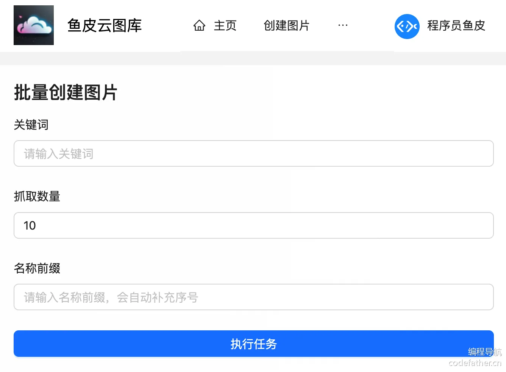

可以随意输入关键词进行测试，这下爽了，无论你想做表情包网站、设计素材网站、海报网站、Logo 网站、还是壁纸网站，全都可以轻松完成！


**友情提示，虽然本项目在功能上的目标是商业级平台，但一定要注意版权问题，不能随意拿别人的素材来商用。**

### 扩展

1）支持管理员填写每批抓取图片的偏移量，防止重复抓取。

2）系统内部记录原始图片 URL，便于内部复盘归档，但是注意不需要暴露给用户。

3）和批量设置名称一样，支持批量设置抓取到的图片的分类和标签等。

4）我们目前抓取到的图片清晰度有限，可以尝试能否获取到质量更高的图片。

## 最后

讲到这里，好像我们的公开图库平台功能已经比较完善了，现在就可以上线给别人用了嘛！

如果你也是这个想法，那真的是。。。

**太惨啦！**

现在上线，得亏死啊！在下一节教程中，鱼皮会带大家做一些重要的优化点，加油学习吧！


# 6 - 图片优化

## 本节重点

之前虽然我们已经完成了云图库项目的功能开发，但在上线之前，还有很大的优化空间。

本节教程中，鱼皮会分享近 10 种主流的图片优化技术，包括：

- 图片查询优化 - 分布式缓存、本地缓存、多级缓存
- 图片上传优化 - 压缩、秒传、分片上传、断点续传
- 图片加载优化 - 懒加载、缩略图、CDN 加速、浏览器缓存
- 图片存储优化 - 降频存储（冷热数据分离）、清理策略

💡 鱼皮的 [代码生成器共享平台项目](https://www.codefather.cn/course/1790980795074654209) 中，也详细讲解过存储优化策略，感兴趣的同学可以去学习下。

## 一、图片查询优化

### 缓存

对于经常访问的数据，每次都从数据库（硬盘）中获取是比较慢，可以利用性能更高的存储来提高系统响应速度，俗称缓存。

合理使用缓存可以显著降低数据库的压力、提高系统性能。

那么，什么样的数据适合缓存呢？一般情况下就 4 个字 **“读多写少”**，要频繁查询的、不怎么修改的。

具体来说：

1. 高频访问的数据：如系统首页、热门推荐内容等。
2. 计算成本较高的数据：如复杂查询结果、大量数据的统计结果。
3. 允许短时间延迟的数据：如不需要实时更新的排行榜、图片列表等。

在我们的项目中，主页是用户高频访问的内容，调用的获取图片列表的接口也是高频访问的。而且即使数据更新存在一定延迟，也不会对用户体验造成明显影响，因此非常适合缓存。

### Redis 分布式缓存

分布式缓存是指将缓存数据分布存储在 **多台服务器** 上，以便在高并发场景下提供更高的吞吐量和更好的容错性。

Redis 是实现分布式缓存的主流方案，也是后端开发必学的技能。主要是由于它具有下面几个优势：

- 高性能：基于内存操作，访问速度极快。**单节点 Redis 的读写 QPS 可达 10w 次每秒！**
- 丰富的数据结构：支持字符串、列表、集合、哈希、位图等，适用于各种数据结构存储。
- 分布式支持：可以通过 Redis Cluster 构建高可用、高性能的分布式缓存，还提供哨兵集群机制提升可用性、提供分片集群机制提高可扩展性。

#### 缓存设计

需要缓存首页的图片列表数据，也就是对 listPictureVOByPage 接口进行缓存。首先按照缓存 3 要素 “key、value、过期时间” 进行设计。

1）缓存 key 设计

由于接口支持传入不同的查询条件，对应的数据不同，因此需要将查询条件作为缓存 key 的一部分。

可以将查询条件对象转换为 JSON 字符串，但这个 JSON 会比较长，可以利用哈希算法（md5）来压缩 key。

此外，由于使用分布式缓存，可能由多个项目和业务共享，因此需要在 key 的开头拼接前缀进行隔离。设计出的 key 如下：

```plain
yupicture:listPictureVOByPage:${查询条件key}
```

2）缓存 value 设计

缓存从数据库中查到的 Page 分页对象，存储为什么格式呢？这里有 2 种选择：

- 为了可读性，可以转换为 JSON 结构的字符串
- 为了压缩空间，可以存为二进制等其他结构

但是对应的 Redis 数据结构都是 string。

3）缓存过期时间设置

**必须设置缓存过期时间！**根据实际业务场景和缓存空间的大小、数据的一致性的要求设置，合适即可，此处由于查询条件较多、而且考虑到图片会持续更新，设置为 5 ~ 60 分钟即可。

#### 如何操作 Redis？

Java 中有非常多的 Redis 操作库，比如 Jedis、Lettuce 等。为了便于和 Spring 项目集成，Spring 还提供了 Spring Data Redis 作为操作 Redis 的更高层抽象（默认使用 Lettuce 作为底层客户端）。由于我们的项目使用 Spring Boot，也推荐使用 [Spring Data Redis](https://spring.io/projects/spring-data-redis/)，开发成本更低。

它的使用也非常简单，我们直接上手项目实战。

#### 后端开发

1）引入 Maven 依赖，使用 Spring Boot Starter 快速整合 Redis：

```xml
<!-- Redis -->
<dependency>
    <groupId>org.springframework.boot</groupId>
    <artifactId>spring-boot-starter-data-redis</artifactId>
</dependency>
```

2）在 application.yml 中添加 Redis 配置：

```yaml
spring:
  # Redis 配置
  redis:
    database: 0
    host: 127.0.0.1
    port: 6379
    timeout: 5000
```

3）编写 JUnit 单元测试文件，测试使用 `StringRedisTemplate` 完成对 Redis 的基础操作（增删改查）：

```java
@SpringBootTest
public class RedisStringTest {

    @Autowired
    private StringRedisTemplate stringRedisTemplate;

    @Test
    public void testRedisStringOperations() {
        // 获取操作对象
        ValueOperations<String, String> valueOps = stringRedisTemplate.opsForValue();

        // Key 和 Value
        String key = "testKey";
        String value = "testValue";

        // 1. 测试新增或更新操作
        valueOps.set(key, value);
        String storedValue = valueOps.get(key);
        assertEquals(value, storedValue, "存储的值与预期不一致");

        // 2. 测试修改操作
        String updatedValue = "updatedValue";
        valueOps.set(key, updatedValue);
        storedValue = valueOps.get(key);
        assertEquals(updatedValue, storedValue, "更新后的值与预期不一致");

        // 3. 测试查询操作
        storedValue = valueOps.get(key);
        assertNotNull(storedValue, "查询的值为空");
        assertEquals(updatedValue, storedValue, "查询的值与预期不一致");

        // 4. 测试删除操作
        stringRedisTemplate.delete(key);
        storedValue = valueOps.get(key);
        assertNull(storedValue, "删除后的值不为空");
    }
}
```

4）新写一个使用缓存的分页查询图片列表的接口。在查询数据库前先查询缓存，如果已有数据则直接返回缓存，如果没有数据则查询数据库，并且将结果设置到缓存中。

代码如下：

```java
@PostMapping("/list/page/vo/cache")
public BaseResponse<Page<PictureVO>> listPictureVOByPageWithCache(@RequestBody PictureQueryRequest pictureQueryRequest,
                                                         HttpServletRequest request) {
    long current = pictureQueryRequest.getCurrent();
    long size = pictureQueryRequest.getPageSize();
    // 限制爬虫
    ThrowUtils.throwIf(size > 20, ErrorCode.PARAMS_ERROR);
    // 普通用户默认只能查看已过审的数据
    pictureQueryRequest.setReviewStatus(PictureReviewStatusEnum.PASS.getValue());

    // 构建缓存 key
    String queryCondition = JSONUtil.toJsonStr(pictureQueryRequest);
    String hashKey = DigestUtils.md5DigestAsHex(queryCondition.getBytes());
    String redisKey = "yupicture:listPictureVOByPage:" + hashKey;
    // 从 Redis 缓存中查询
    ValueOperations<String, String> valueOps = stringRedisTemplate.opsForValue();
    String cachedValue = valueOps.get(redisKey);
    if (cachedValue != null) {
        // 如果缓存命中，返回结果
        Page<PictureVO> cachedPage = JSONUtil.toBean(cachedValue, Page.class);
        return ResultUtils.success(cachedPage);
    }

    // 查询数据库
    Page<Picture> picturePage = pictureService.page(new Page<>(current, size),
            pictureService.getQueryWrapper(pictureQueryRequest));
    // 获取封装类
    Page<PictureVO> pictureVOPage = pictureService.getPictureVOPage(picturePage, request);

    // 存入 Redis 缓存
    String cacheValue = JSONUtil.toJsonStr(pictureVOPage);
    // 5 - 10 分钟随机过期，防止雪崩
    int cacheExpireTime = 300 +  RandomUtil.randomInt(0, 300);
    valueOps.set(redisKey, cacheValue, cacheExpireTime, TimeUnit.SECONDS);

    // 返回结果
    return ResultUtils.success(pictureVOPage);
}
```

#### 测试

可以通过 Swagger 测试一下返回结果是否正常，并且对比和之前查数据库的性能提升。

没缓存，平均 50ms：

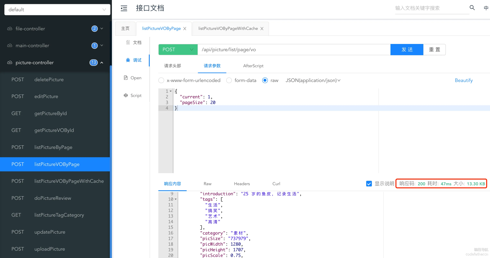

有缓存，平均 20~30 ms，性能显著提升！

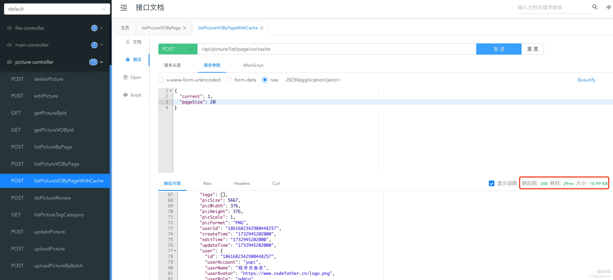

细心的同学会发现，为什么接口返回的大小不一样呢？因为缓存的过程中我们将 JSON 字符串和 Java 对象进行了转换，使得一些为 null 的字段被过滤掉了。

### Caffeine 本地缓存

当应用需要频繁访问某些数据时，可以将这些数据缓存到应用的内存中（比如 JVM 中）；下次访问时，直接从内存读取，而不需要经过网络或其他存储系统。

相比于分布式缓存，本地缓存的速度更快，但是无法在多个服务器间共享数据、而且不方便扩容。

所以本地缓存的应用场景一般是：

- 数据访问量有限的小型数据集
- 不需要服务器间共享数据的单机应用
- 高频、低延迟的访问场景（如用户临时会话信息、短期热点数据）。

对于 Java 项目，[Caffeine](https://github.com/ben-manes/caffeine) 是主流的本地缓存技术，拥有极高的性能和丰富的功能。比如可以精确控制缓存数量和大小、支持缓存过期、支持多种缓存淘汰策略、支持异步操作、线程安全等。

💡 鱼皮建议，由于本地缓存不需要引入额外的中间件，成本更低。因此如果只是要提升数据访问性能，优先考虑本地缓存而不是分布式缓存。

#### 缓存设计

本地缓存的设计和分布式缓存基本一致，不再赘述。但有 2 个区别：

1. 本地缓存需要自己创建初始化缓存结构（可以简单理解为要自己 new 一个 HashMap）。
2. 由于本地缓存本身就是服务器隔离的，而且占用服务器的内存，key 可以更精简一些，不用再添加项目前缀。

#### 后端开发

1）[参考官方文档](https://github.com/ben-manes/caffeine) 引入 Caffeine 的 Maven 依赖，注意如果要引入 3.x 版本的 Caffeine，Java 版本必须 >= 11！如果不想升级 JDK，也可以改为引入 2.x 版本。

```xml
<!-- 本地缓存 Caffeine -->
<dependency>
  <groupId>com.github.ben-manes.caffeine</groupId>
  <artifactId>caffeine</artifactId>
  <version>3.1.8</version>
</dependency>
```

2）构造本地缓存，设置缓存容量和过期时间：

```java
private final Cache<String, String> LOCAL_CACHE =
        Caffeine.newBuilder().initialCapacity(1024)
                .maximumSize(10000L)
                // 缓存 5 分钟移除
                .expireAfterWrite(5L, TimeUnit.MINUTES)
                .build();
```

3）参考之前使用分布式缓存的代码，修改为使用本地缓存。在查询数据库前先查询本地缓存，如果已有数据则直接返回缓存：

```java
// 构建缓存 key
String queryCondition = JSONUtil.toJsonStr(pictureQueryRequest);
String hashKey = DigestUtils.md5DigestAsHex(queryCondition.getBytes());
String cacheKey = "listPictureVOByPage:" + hashKey;
// 从本地缓存中查询
String cachedValue = LOCAL_CACHE.getIfPresent(cacheKey);
if (cachedValue != null) {
    // 如果缓存命中，返回结果
    Page<PictureVO> cachedPage = JSONUtil.toBean(cachedValue, Page.class);
    return ResultUtils.success(cachedPage);
}
```

如果没有数据则查询数据库，并且将结果设置到本地缓存中：

```java
// 查询数据库
Page<Picture> picturePage = pictureService.page(new Page<>(current, size),
        pictureService.getQueryWrapper(pictureQueryRequest));
// 获取封装类
Page<PictureVO> pictureVOPage = pictureService.getPictureVOPage(picturePage, request);

// 存入本地缓存
String cacheValue = JSONUtil.toJsonStr(pictureVOPage);
LOCAL_CACHE.put(cacheKey, cacheValue);
```

4）可以通过 Swagger 测试一下返回结果是否正常，并且对比和之前查数据库、查 Redis 的性能提升。

有缓存，最快可达 12ms，性能又进一步提升了 1 倍左右，相比数据库提升了好几倍！

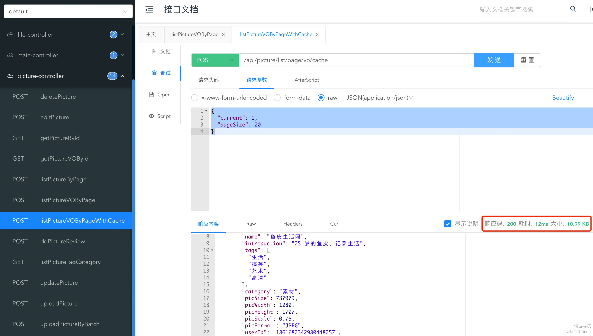

而且目前我们数据库和 Redis 都是在本地的，本来访问就比较快，如果使用远程数据库或 Redis，性能的提升会更为明显。

#### 扩展

我们发现，使用本地缓存和分布式缓存的流程基本是一致的。那么思考一下，如果你想灵活地切换使用本地缓存或分布式缓存，应该怎么实现呢？

答案：策略模式或者模板方法模式。

### 多级缓存

多级缓存是指结合本地缓存和分布式缓存的优点，在同一业务场景下构建两级缓存系统，这样可以兼顾本地缓存的高性能、以及分布式缓存的数据一致性和可靠性。

多级缓存的工作流程：

1. 第一级（Caffeine 本地缓存）：优先从本地缓存中读取数据。如果命中，则直接返回。
2. 第二级（Redis 分布式缓存）：如果本地缓存未命中，则查询 Redis 分布式缓存。如果 Redis 命中，则返回数据并更新本地缓存。
3. 数据库查询：如果 Redis 也未命中，则查询数据库，并将结果写入 Redis 和本地缓存。

流程图：

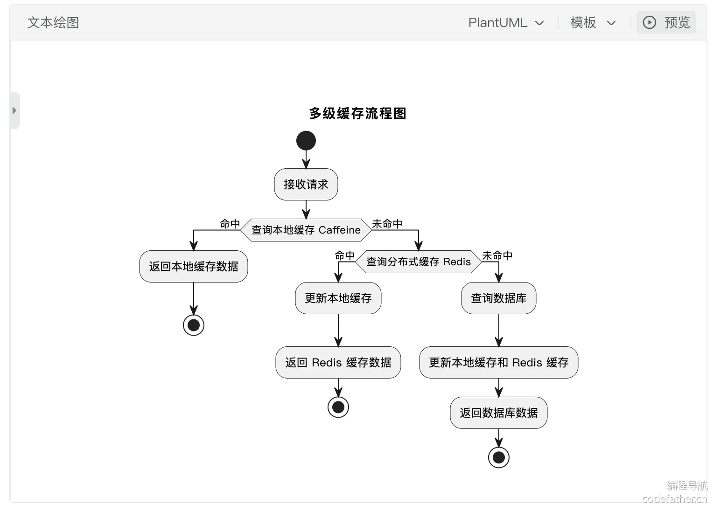

多级缓存还有一个优势，就是提升了系统的容错性。即使 Redis 出现故障，本地缓存仍可提供服务，减少对数据库的直接依赖。

#### 后端开发

1）优先从本地缓存中读取数据。如果命中，则直接返回。

```java
// 构建缓存 key
String queryCondition = JSONUtil.toJsonStr(pictureQueryRequest);
String hashKey = DigestUtils.md5DigestAsHex(queryCondition.getBytes());
String cacheKey = "yupicture:listPictureVOByPage:" + hashKey;

// 1. 查询本地缓存（Caffeine）
String cachedValue = LOCAL_CACHE.getIfPresent(cacheKey);
if (cachedValue != null) {
    Page<PictureVO> cachedPage = JSONUtil.toBean(cachedValue, Page.class);
    return ResultUtils.success(cachedPage);
}
```

2）如果本地缓存未命中，则查询 Redis 分布式缓存。如果 Redis 命中，则返回数据并更新本地缓存。

```java
// 2. 查询分布式缓存（Redis）
ValueOperations<String, String> valueOps = stringRedisTemplate.opsForValue();
cachedValue = valueOps.get(cacheKey);
if (cachedValue != null) {
    // 如果命中 Redis，存入本地缓存并返回
    LOCAL_CACHE.put(cacheKey, cachedValue);
    Page<PictureVO> cachedPage = JSONUtil.toBean(cachedValue, Page.class);
    return ResultUtils.success(cachedPage);
}
```

3）如果 Redis 也未命中，则查询数据库，并将结果写入 Redis 和本地缓存。

```java
// 3. 查询数据库
Page<Picture> picturePage = pictureService.page(new Page<>(current, size),
        pictureService.getQueryWrapper(pictureQueryRequest));
Page<PictureVO> pictureVOPage = pictureService.getPictureVOPage(picturePage, request);

// 4. 更新缓存
String cacheValue = JSONUtil.toJsonStr(pictureVOPage);
// 更新本地缓存
LOCAL_CACHE.put(cacheKey, cacheValue);
// 更新 Redis 缓存，设置过期时间为 5 分钟
valueOps.set(cacheKey, cacheValue, 5, TimeUnit.MINUTES);
```

### 扩展

#### 1、手动刷新缓存

在某些情况下，数据更新较为频繁，但自动刷新缓存机制可能存在延迟，可以通过手动刷新来解决。

比如：

- 提供一个刷新缓存的接口，仅管理员可调用。
- 提供管理后台，支持管理员手动刷新指定缓存。

#### 2、解决缓存常见问题

使用缓存时，一般要注意下面几个问题：

1）缓存击穿：某些 **热点数据** 在缓存过期后，大量请求直接打到数据库。

解决方案：设置热点数据的超长过期时间，或使用互斥锁（如 Redisson）控制缓存刷新。

2）缓存穿透：用户频繁请求不存在的数据，导致大量的请求直接触发数据库查询。

解决方案：对无效查询结果也进行缓存（如设置空值缓存），或者使用布隆过滤器。

3）缓存雪崩：大量缓存同时过期，导致请求打到数据库，系统崩溃。

解决方案：设置不同缓存的过期时间，避免同时过期；或者使用多级缓存，减少对数据库的依赖。

💡《如何解决缓存中的常见问题》是一道经典的八股文，感兴趣的同学可以 [在面试鸭上阅读学习](https://www.mianshiya.com/question/1780933295672946690)。

#### 3、自动识别热点图片缓存

可以采用热 key 探测技术，实时对图片的访问量进行统计，并自动将热点图片添加到内存缓存，以应对大量高频的访问。

[鱼皮的面试刷题平台项目](https://www.codefather.cn/course/1826803928691945473) 中对该技术有详细的讲解，有时间可以学习下。

#### 4、查询优化

可以参考 [数据库优化技巧](https://www.mianshiya.com/question/1816438385021997058)，比如获取图片列表时只查询（select）必要的字段，返回给前端时也只返回必要的字段等。

#### 5、代码优化

如果操作缓存的逻辑更复杂，可以单独抽象 CacheManager 统一管理缓存相关操作。

## 二、图片上传优化

### 图片压缩

对于图库网站来说，图片压缩是图片优化中最基本且最重要的操作，能够显著减少图片文件的大小，从而降低带宽使用和流量消耗，大幅降低成本的同时，提高图片加载速度。

有哪些压缩图片的方法呢？

1. 将图片格式转换为体积更小的格式，比如 WebP 或其他现代格式
2. 对图片质量进行压缩
3. 缩小图片尺寸

当然对于图片网站来说，我们希望尽可能不要影响图片的质量，因此更推荐第 1 种方法。

那么将图片压缩成什么格式？如何对图片进行压缩呢？

#### 1、图片压缩格式

格式上，有 2 种选择：

1）WebP：由 Google 开发的现代图片格式，支持有损和无损压缩。相比传统格式：

- 比 PNG 文件小约 26%。
- 比 JPEG 文件小约 25%-34%。
- 支持透明背景（Alpha 通道）。
- 兼容性：大部分主流浏览器（如 Chrome、Edge、Firefox 等）均已支持 WebP。

2）AVIF：基于 AV1 视频编码技术的图片格式，压缩率更高。

- 比 WebP 的文件大小更小，画质更优。
- 支持透明背景和高动态范围（HDR）。

虽然 AVIF 看起来更牛，但目前其兼容性没有 WebP 要好，为了保证图片在不同浏览器都能正常加载，**建议选择 WebP 格式**。

#### 2、图片压缩方案

跟解析图片的操作一样，可以使用本地的图像处理类库自行操作，也可以利用第三方云服务完成。

因为我们图片已经上传到了腾讯云 COS 对象存储服务，可以直接利用数据万象服务。通过配置图片处理规则，在图片上传的同时自动进行压缩处理，减少开发成本。

如何利用数据万象对图片进行压缩呢？官方提供了 [最佳实践文档](https://cloud.tencent.com/document/product/460/72229) ，主要有 2 种压缩方式：

1. 访问图片时实时压缩
2. 上传图片时实时压缩，[参考文档](https://cloud.tencent.com/document/product/436/54050#.E4.B8.8A.E4.BC.A0.E6.97.B6.E5.A4.84.E7.90.86)

其实还有第三种方式，也可以对已上传的图片进行压缩处理，[参考文档](https://cloud.tencent.com/document/product/436/54050#.E4.BA.91.E4.B8.8A.E6.95.B0.E6.8D.AE.E5.A4.84.E7.90.86)。

对于我们的需求，要将图片格式转化为 WebP，可以 [参考官方文档](https://cloud.tencent.com/document/product/436/44883)，在上传文件时，传入 Rules 规则。使用 HTTP API 调用时，传入处理规则参数：

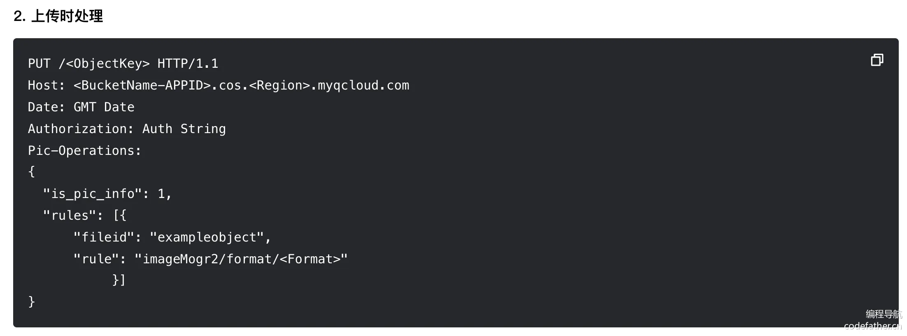

如果使用 SDK，就需要构造图片处理规则对象，[参考文档](https://cloud.tencent.com/document/product/436/55377#.E4.B8.8A.E4.BC.A0.E6.97.B6.E5.9B.BE.E7.89.87.E6.8C.81.E4.B9.85.E5.8C.96.E5.A4.84.E7.90.86)：

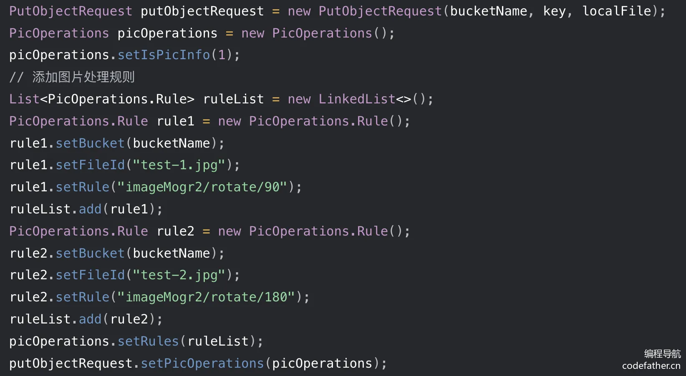

#### 3、后端开发

为了实现方便，我们此处仅对文件格式进行转化，不进行质量变换之类的其他处理。

1）修改 CosManager 上传图片的方法，将图片后缀转为 webp，并且使用数据万象将图片格式转为 webp：

```java
public PutObjectResult putPictureObject(String key, File file) {
    PutObjectRequest putObjectRequest = new PutObjectRequest(cosClientConfig.getBucket(), key,
            file);
    // 对图片进行处理（获取基本信息也被视作为一种处理）
    PicOperations picOperations = new PicOperations();
    // 1 表示返回原图信息
    picOperations.setIsPicInfo(1);
    List<PicOperations.Rule> rules = new ArrayList<>();
    // 图片压缩（转成 webp 格式）
    String webpKey = FileUtil.mainName(key) + ".webp";
    PicOperations.Rule compressRule = new PicOperations.Rule();
    compressRule.setRule("imageMogr2/format/webp");
    compressRule.setBucket(cosClientConfig.getBucket());
    compressRule.setFileId(webpKey);
    rules.add(compressRule);
    // 构造处理参数
    picOperations.setRules(rules);
    putObjectRequest.setPicOperations(picOperations);
    return cosClient.putObject(putObjectRequest);
}
```

2）修改 PictureUploadTemplate 上传图片的方法，从图片处理结果中获取到缩略图，并设置到返回结果中：

```java
try {
    // 创建临时文件
    file = File.createTempFile(uploadPath, null);
    // 处理文件来源（本地或 URL）
    processFile(inputSource, file);
    // 上传图片到对象存储
    PutObjectResult putObjectResult = cosManager.putPictureObject(uploadPath, file);
    ImageInfo imageInfo = putObjectResult.getCiUploadResult().getOriginalInfo().getImageInfo();
    ProcessResults processResults = putObjectResult.getCiUploadResult().getProcessResults();
    List<CIObject> objectList = processResults.getObjectList();
    if (CollUtil.isNotEmpty(objectList)) {
        CIObject compressedCiObject = objectList.get(0);
        // 封装压缩图返回结果
        return buildResult(originFilename, compressedCiObject);
    }
    // 封装原图返回结果
    return buildResult(originFilename, file, uploadPath, imageInfo);
} catch (Exception e) {
    log.error("图片上传到对象存储失败", e);
    throw new BusinessException(ErrorCode.SYSTEM_ERROR, "上传失败");
}
```

3）编写新的封装返回结果方法，从压缩图中获取图片信息：

```java
private UploadPictureResult buildResult(String originFilename, CIObject compressedCiObject) {
    UploadPictureResult uploadPictureResult = new UploadPictureResult();
    int picWidth = compressedCiObject.getWidth();
    int picHeight = compressedCiObject.getHeight();
    double picScale = NumberUtil.round(picWidth * 1.0 / picHeight, 2).doubleValue();
    uploadPictureResult.setPicName(FileUtil.mainName(originFilename));
    uploadPictureResult.setPicWidth(picWidth);
    uploadPictureResult.setPicHeight(picHeight);
    uploadPictureResult.setPicScale(picScale);
    uploadPictureResult.setPicFormat(compressedCiObject.getFormat());
    uploadPictureResult.setPicSize(compressedCiObject.getSize().longValue());
    // 设置图片为压缩后的地址
    uploadPictureResult.setUrl(cosClientConfig.getHost() + "/" + compressedCiObject.getKey());
    return uploadPictureResult;
}
```

#### 4、测试

上传图片并查看对象存储中的资源大小，发现压缩效果显著。而且压缩图和原图同名，便于查找原图：

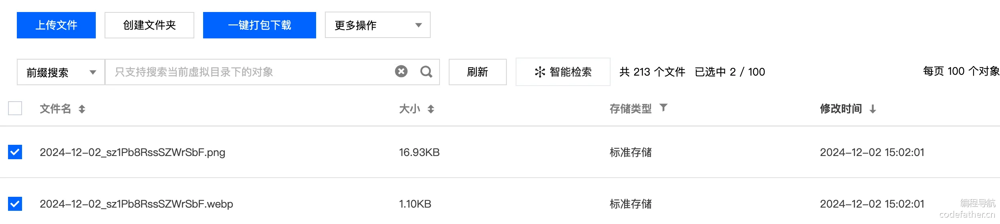

前端也能正常获取到压缩后的图片信息：

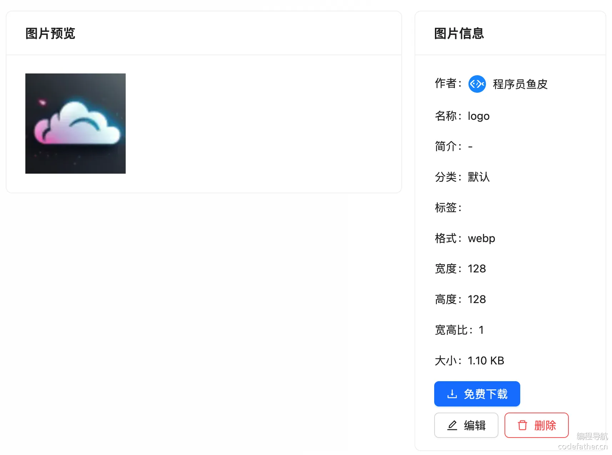

#### 扩展

1）增加对原图的处理

目前每次上传图片实际上会保存原图和压缩图 2 个图片，原图占用的空间还是比较大的。如果想进一步优化，可以删除原图，只保留缩略图；或者在数据库中保存原图的地址，用作备份。

2）尝试更大比例的压缩，比如使用 [质量变换](https://cloud.tencent.com/document/product/436/44884) 来处理图片。

### 扩展知识 - 文件秒传

由于文件秒传对于图片上传场景的作用有限，仅作为扩展知识学习即可，不必在本项目中实现。

文件秒传是一种基于文件的唯一标识（如 MD5、SHA-256）对文件内容进行快速校验，避免重复上传的方法，在大型文件传输场景下非常重要。可以提高性能、节约带宽和存储资源。

大家可能用过 XX 网盘软件，如果重复上传相同的文件 2 次，你会发现第二次的上传速度贼快！

#### **文件秒传的实现方案**

文件秒传的实现并不复杂，流程如下：

1）客户端生成文件唯一标识：上传前，通过客户端计算文件的哈希值（如 MD5、SHA-256），生成文件的唯一指纹。

2）服务端校验文件指纹：后端接收到文件指纹后，在存储中查询是否已存在相同文件。

- 若存在相同文件，则直接返回文件的存储路径。
- 若不存在相同文件，则接收并存储新文件，同时记录其指纹信息。

注意，客户端和服务端是相对的概念。因为现在我们要把文件上传到对象存储服务器，我们的后端此时就是“客户端”，对象存储服务器才是 “服务端”。

对于我们的项目，给图片表增加 md5 字段用于存储文件指纹，上传图片前增加类似的逻辑判断即可：

```java
// 计算文件指纹
String md5 = SecureUtil.md5(file);
// 从数据库中查询已有的文件
List<Picture> pictureList = pictureService.lambdaQuery()
        .eq(Picture::getMd5, md5)
        .list();
// 文件已存在，秒传
if (CollUtil.isNotEmpty(pictureList)) {
    // 直接复用已有文件的信息，不必重复上传文件
    Picture existPicture = pictureList.get(0);
} else {
    // 文件不存在，实际上传逻辑
}
```

#### **实际使用中的限制**

我们目前的项目其实不适合使用文件秒传。一方面是对于图片场景，文件比较小、重复文件也相对较少，秒传的优化效果有限；另外一方面是本项目使用腾讯云 COS 的对象存储，只能通过唯一地址去取文件，无法完全自定义文件的存储结构、也不支持文件快捷方式的概念，因此秒传的文件地址必须使用和原文件相同的对象路径，可能导致其他的问题（比如用户 A 上传的图片地址等同于用户 B 上传的地址）。

### 扩展知识 - 分片上传和断点续传

对于大文件，还可以开启分片上传和断点续传，不需要自己开发，直接使用 [对象存储的 SDK](https://cloud.tencent.com/document/product/436/65935) 就能完成。

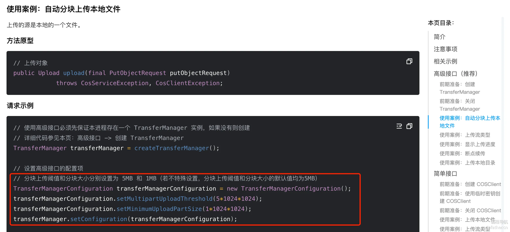

## 三、图片加载优化

图片加载优化的目的是提升页面加载速度、减少带宽消耗，并改善用户体验。

本节鱼皮将从缩略图、懒加载、CDN 加速、浏览器缓存这 4 个方面进行全面优化。

### 缩略图

系统目前的问题：首页直接加载原图，原图文件通常比缩略图大数倍甚至数十倍，不仅导致加载时间长，还会造成大量流量浪费。

解决方案：上传图片时，同时生成一份较小尺寸的缩略图。用户浏览图片列表时加载缩略图，只有在进入详情页或下载时才加载原图。

#### 1、实现方案

生成缩略图的方法和前面讲的 “图片压缩” 一致，可以使用本地图像处理类库，也可以利用第三方云服务完成。

此处我们依然选择数据万象服务，[参考 Java SDK 文档](https://cloud.tencent.com/document/product/436/55377#.E4.B8.8A.E4.BC.A0.E6.97.B6.E5.9B.BE.E7.89.87.E6.8C.81.E4.B9.85.E5.8C.96.E5.A4.84.E7.90.86) 使用 SDK 来构造图片处理规则对象，具体的图片缩放参数可 [参考文档](https://cloud.tencent.com/document/product/436/44880)：

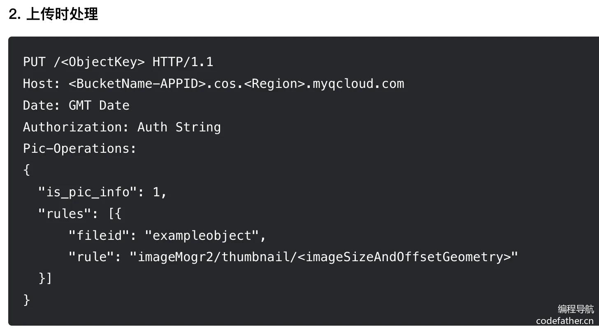

#### 2、后端开发

1）数据表 picture 新增缩略图字段：

```sql
ALTER TABLE picture
    -- 添加新列
    ADD COLUMN thumbnailUrl varchar(512) NULL COMMENT '缩略图 url';
```

2）PictureMapper.xml 新增缩略图字段：

```xml
<result property="thumbnailUrl" column="thumbnailUrl" jdbcType="VARCHAR"/>
<!-- ... -->
<sql id="Base_Column_List">
    id,url,thumbnailUrl,name,
    introduction,category,tags,
    picSize,picWidth,picHeight,
    picScale,picFormat,userId,
    createTime,editTime,updateTime,
    isDelete
</sql>
```

3）数据模型新增缩略图字段，包括 Picture 类、PictureVO 类、UploadPictureResult 类：

```java
/**
 * 缩略图 url
 */
private String thumbnailUrl;
```

4）缩略图处理

首先明确我们使用的缩放规则，设置最大宽高后，对图片进行等比缩小。且如果缩略图的宽高大于原图，则不会处理。

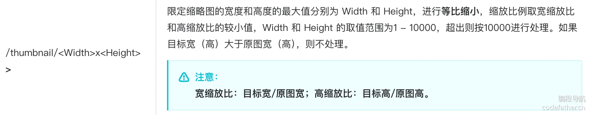

修改 CosManager 的上传图片方法，补充对缩略图的处理：

```java
public PutObjectResult putPictureObject(String key, File file) {
    PutObjectRequest putObjectRequest = new PutObjectRequest(cosClientConfig.getBucket(), key,
            file);
    // 对图片进行处理（获取基本信息也被视作为一种处理）
    PicOperations picOperations = new PicOperations();
    // 1 表示返回原图信息
    picOperations.setIsPicInfo(1);
    List<PicOperations.Rule> rules = new ArrayList<>();
    // 图片压缩（转成 webp 格式）
    String webpKey = FileUtil.mainName(key) + ".webp";
    PicOperations.Rule compressRule = new PicOperations.Rule();
    compressRule.setRule("imageMogr2/format/webp");
    compressRule.setBucket(cosClientConfig.getBucket());
    compressRule.setFileId(webpKey);
    rules.add(compressRule);
    // 缩略图处理
    PicOperations.Rule thumbnailRule = new PicOperations.Rule();
    thumbnailRule.setBucket(cosClientConfig.getBucket());
    String thumbnailKey = FileUtil.mainName(key) + "_thumbnail." + FileUtil.getSuffix(key);
    thumbnailRule.setFileId(thumbnailKey);
    // 缩放规则 /thumbnail/<Width>x<Height>>（如果大于原图宽高，则不处理）
    thumbnailRule.setRule(String.format("imageMogr2/thumbnail/%sx%s>", 128, 128));
    rules.add(thumbnailRule);
    // 构造处理参数
    picOperations.setRules(rules);
    putObjectRequest.setPicOperations(picOperations);
    return cosClient.putObject(putObjectRequest);
}
```

修改 PictureUploadTemplate 的上传图片方法，获取到缩略图：

```java
ProcessResults processResults = putObjectResult.getCiUploadResult().getProcessResults();
List<CIObject> objectList = processResults.getObjectList();
if (CollUtil.isNotEmpty(objectList)) {
    CIObject compressedCiObject = objectList.get(0);
    CIObject thumbnailCiObject = objectList.get(1);
    // 封装压缩图返回结果
    return buildResult(originFilename, compressedCiObject, thumbnailCiObject);
}
```

修改 PictureUploadTemplate 封装返回结果的方法，将缩略图路径也设置到返回结果中：

```java
private UploadPictureResult buildResult(String originFilename, CIObject compressedCiObject, CIObject thumbnailCiObject) {
    UploadPictureResult uploadPictureResult = new UploadPictureResult();
    // ...
    // 设置缩略图
    uploadPictureResult.setThumbnailUrl(cosClientConfig.getHost() + "/" + thumbnailCiObject.getKey());
    return uploadPictureResult;
}
```

需要同步修改 PictureService 的上传图片方法，补充设置缩略图字段：

```java
// 构造要入库的图片信息
Picture picture = new Picture();
picture.setUrl(uploadPictureResult.getUrl());
picture.setThumbnailUrl(uploadPictureResult.getThumbnailUrl());
String picName = uploadPictureResult.getPicName();
```

5）测试效果

上传大图片时，缩略图的效果显著，体积直接减小百倍！

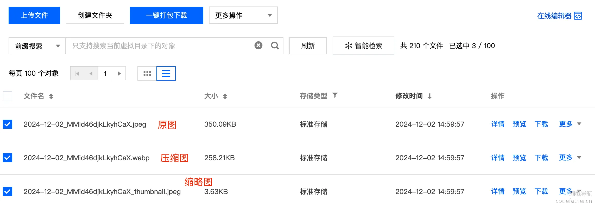

但有个比较坑的情况，如果上传的图片本身就比较小，缩略图反而比压缩图更大，还不如不缩略！

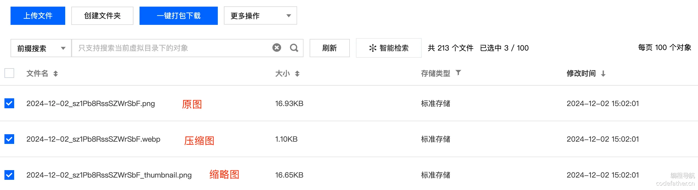

我们可以优化 CosManager 图片上传的逻辑，仅对 > 20 KB 的图片生成缩略图：

```java
// 缩略图处理，仅对 > 20 KB 的图片生成缩略图
if (file.length() > 2 * 1024) {
    PicOperations.Rule thumbnailRule = new PicOperations.Rule();
    thumbnailRule.setBucket(cosClientConfig.getBucket());
    String thumbnailKey = FileUtil.mainName(key) + "_thumbnail." + FileUtil.getSuffix(key);
    thumbnailRule.setFileId(thumbnailKey);
    // 缩放规则 /thumbnail/<Width>x<Height>>（如果大于原图宽高，则不处理）
    thumbnailRule.setRule(String.format("imageMogr2/thumbnail/%sx%s>", 128, 128));
    rules.add(thumbnailRule);
}
```

修改 PictureUploadTemplate 的逻辑，如果没有生成缩略图，则缩略图等于压缩图：

```java
if (CollUtil.isNotEmpty(objectList)) {
    CIObject compressedCiObject = objectList.get(0);
    // 缩略图默认等于压缩图
    CIObject thumbnailCiObject = compressedCiObject;
    // 有生成缩略图，才得到缩略图
    if (objectList.size() > 1) {
        thumbnailCiObject = objectList.get(1);
    }
    // 封装压缩图返回结果
    return buildResult(originFilename, compressedCiObject, thumbnailCiObject);
}
```

#### 3、前端开发

只需要将首页展示的图片改为优先读取缩略图即可：

```vue

```

效果如图：

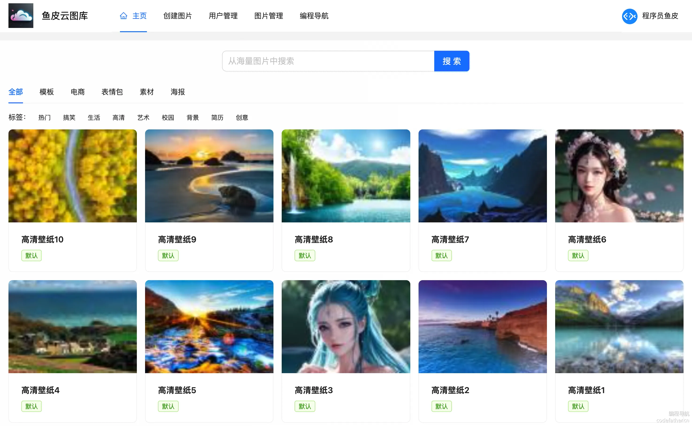

如果觉得太模糊了，还可以增大缩略图的宽高、调高需要生成缩略图的文件大小阈值，这是一个成本和用户体验上的权衡~

#### 扩展

1）除了缩略图之外，还可以提供相对更清晰的 **预览图**，用于在图片详情页展示，仅在下载时才使用无损原图。

2）可以对文件名称进行更完整地校验处理，防止因为图片本身名称不规范导致的后缀丢失。

### 懒加载

懒加载（Lazy Loading）可以避免一次性加载所有图片，**只有当资源需要显示时才进行加载**。比如对于图片列表来说，仅在用户滚动到图片所在区域时才加载该图片资源。

#### 实现方案

虽然懒加载的实现更多的是依赖前端，但后端也有一定的优化策略，比如对图片列表进行分页，每页不需要展示过多的内容。

前端如何实现懒加载呢？

1）使用 HTML5 原生的 `loading="lazy"` 属性。示例代码如下：

```java

```

这种方法最简单，但是对旧版浏览器（如 IE）不兼容，而且不支持更复杂的懒加载需求（如动画或特殊事件触发）。

2）使用 JS 的 Intersection Observer，这个 API 能够检测元素是否进入视口，参考实现如下：

1. 将图片的真实 src 替换为一个占位属性（如 data-src）。
2. 使用 Intersection Observer 监听图片是否进入视口。
3. 当图片进入视口时，将 data-src 的值赋给 src，触发加载。

```html


<script>
  // 获取所有需要懒加载的图片
  const lazyImages = document.querySelectorAll('img.lazy');

  // 创建 Intersection Observer
  const observer = new IntersectionObserver((entries, observer) => {
    entries.forEach(entry => {
      if (entry.isIntersecting) {
        const img = entry.target;
        // 将 data-src 的值赋给 src 属性
        img.src = img.dataset.src;
        img.classList.remove('lazy');
        observer.unobserve(img); // 停止观察已加载的图片
      }
    });
  });

  // 观察每个图片
  lazyImages.forEach(image => observer.observe(image));
</script>
```

3）使用 JS 监听页面滚动事件实现。每次页面滚动时，判断图片是否进入可视区域；如果是，则给图片增加 src 属性，触发图片加载。

4）使用现成的组件库或类库实现，比如 [lazysizes 库](https://github.com/aFarkas/lazysizes)。

由于我们的项目已经使用了缩略图，加载的资源本来也不多，所以暂时没必要使用懒加载了。

#### 扩展知识 - 渐进式加载

渐进式加载和懒加载技术类似，先加载低分辨率或低质量的占位资源（如模糊的图片缩略图），在用户访问或等待期间逐步加载高分辨率的完整资源，加载完成后再替换掉占位资源。

适用于超清图片加载、用户体验要求较高的页面，在网络环境较差时，效果会更明显。

Ant Design Vue 的 [Image 图片组件](https://antdv.com/components/image-cn) 支持渐进加载功能：

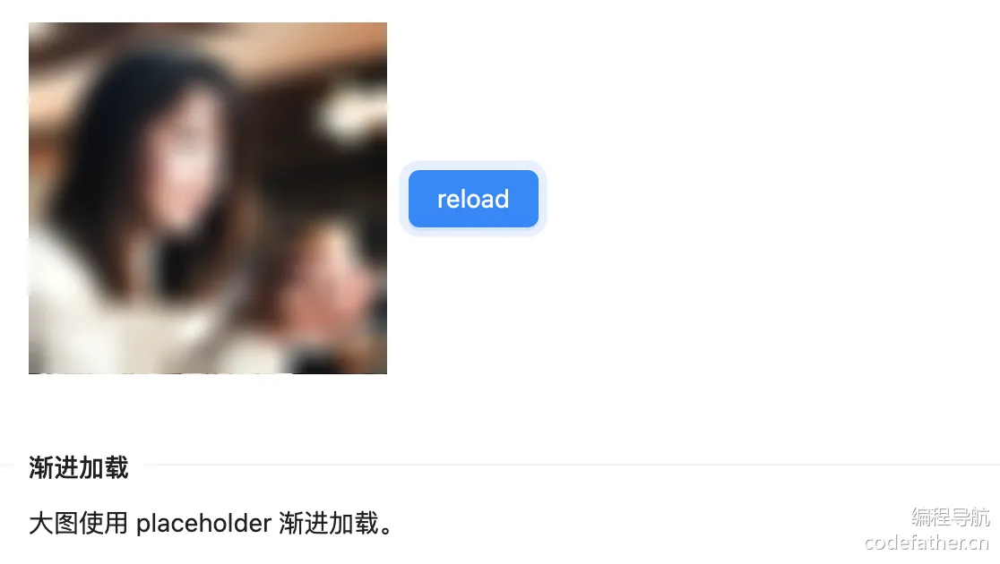

### CDN 加速

#### 1、什么是 CDN？

CDN（内容分发网络）是通过将图片文件分发到全球各地的节点，用户访问时从离自己最近的节点获取资源的技术，常用于文件资源或后端动态请求的网络加速，也能大幅分摊源站的压力、支持更多请求同时访问，是性能提升的利器。

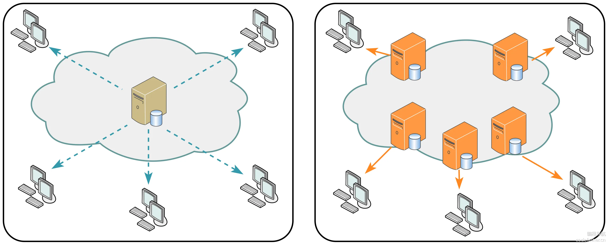

腾讯云 CDN 产品文档中提供的 CDN 原理图：

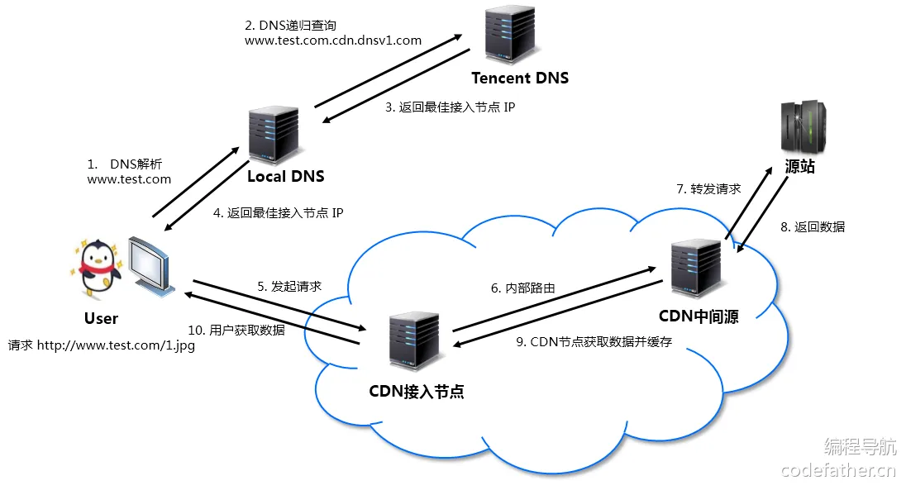

💡 如果你想了解一些云服务的介绍、架构和最佳实践，多去看大公司云服务的产品文档，就能学到很多知识。

CDN 请求的核心过程如下：

1. 图片文件由 **源站**（如 COS 对象存储、或者服务器）上传至 CDN 服务进行缓存。
2. 当用户请求图片时，CDN 会根据用户的地理位置，返回离用户 **最近的** CDN 节点缓存的图片资源。
3. 未命中缓存的图片将从源站获取，并缓存在 CDN 节点，供后续用户访问，俗称 **回源**。

💡 回源的具体解释：在内容分发网络中，回源是指用户通过浏览器发送请求时，响应该请求的是源站点的服务器，而不是各节点上的缓存服务器。一般情况下，当 CDN 节点上的缓存服务器没有缓存响应的内容，或者响应的内容在源站点服务器上被修改，就会回源站去获取。

#### 2、CDN 的优势

有同学会问了：COS 对象存储不也是存储图片的服务么？CDN 内容分发网络有啥独特的优势啊？

从这两个服务的名称中，我们就能明显感受到区别了，COS 更倾向于 “存储”，CDN 更倾向于 “网络请求”。

所以如果文件存储容量较大、但是访问频率较低，用对象存储性价比更高；但如果资源访问频率高、流量消耗大，还需要对访问进行加速、减少源站压力，就要使用 CDN 了。CDN 的流量和请求单价通常低于对象存储，而且更加安全，可以保护源站地址不被泄露。

#### 3、如何使用 CDN？

一般情况下，如果你要对外提供文件（图片）访问 / 下载服务，建议结合 COS 和 CDN。比如对于本项目，COS 作为源站，负责存储图片文件；CDN 负责提供文件访问服务，以及缓存、安全性的设置。

也就是说，使用 CDN 之后，我们数据库中存储的图片地址就不再是 COS 的地址，而是 CDN 的 URL。

如何开通和使用 CDN 服务？建议阅读 [官方的产品文档](https://cloud.tencent.com/document/product/228/3149)、还有 [CDN 结合 COS 的文档](https://cloud.tencent.com/document/product/228/38088)，写得很贴心。

💡 CDN 还提供自动图片优化功能，感兴趣的同学可以 [看文档](https://cloud.tencent.com/document/product/228/43121) 了解下。

但是，注意 CDN 是个付费产品，按量计费，所以使用时有一些注意事项。俗话说得好（鱼皮说的）：“乱用 CDN，钱包两行泪！”

大家一定要认真看：

1）缓存策略：为静态资源（如图片、CSS、JS）设置长期缓存时间，可以减少回源的次数和消耗。

2）防盗链：配置 Referer 防盗链保护资源，比如仅允许自己的域名可以加载图片

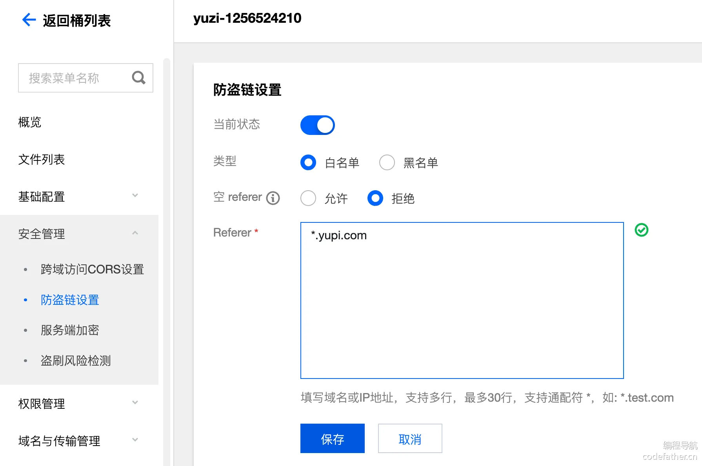

3）IP 限制：根据需要配置 IP 黑白名单，限制不必要的访问。

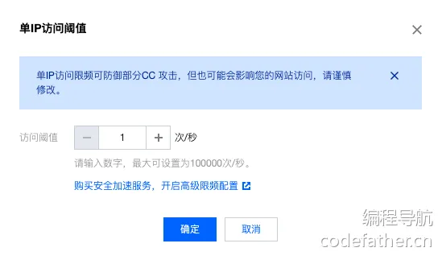

4）HTTPS 配置：配置有效的 SSL 证书，启用 HTTPS 传输，提高请求的安全性。

5）**监控告警：这点尤为重要！**一定要给 CDN 配置监控告警，比如设置一段时间内最多消耗的流量，超出时会自动发短信告警，避免费用超额；或者限制单个 IP 的请求频率，防止突发流量影响服务。

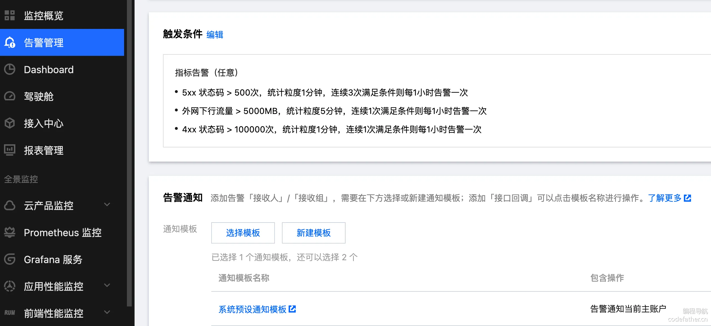

6）CDN 节点选择：国内业务选择覆盖中国大陆的节点就足够了，非必要的话，不要开通全球 CDN 节点，容易遭受海外攻击。

7）访问日志：开启访问日志，分析用户行为和流量来源，这个能力更适合业务访问量较大的场景。

### 浏览器缓存

通过设置 HTTP 头信息（如 Cache-Control），可以让用户的浏览器将资源缓存在本地。在用户再次访问同样的资源时，直接从本地缓存加载资源，而无需再次请求服务器。

所有缓存在使用时的注意事项基本都是类似的：

1）设置合理的缓存时间。常用的几种设置参数是：

- 静态资源使用长期缓存，比如：`Cache-Control: public, max-age=31536000` 表示缓存一年，适合存储图片等静态资源。
- 动态内容使用验证缓存，比如：`Cache-Control: private, no-cache` 表示缓存可被客户端存储，但每次使用前需要与服务器验证有效性。适合会动态变化内容的页面，比如用户个人中心。
- 敏感内容禁用缓存，比如：`Cache-Control: no-store` 表示不允许任何形式的缓存，适合安全性较高的场景，比如登录页面、支付页面。

2）要能够及时更新缓存。可以给图片的名称添加 “版本号”（如文件名中包含 hash 值），这样哪怕上传相同的图片，由于版本号不同，得到的图片地址也不同，下次访问时就会重新加载。

对于我们的项目，图片资源是非常适合长期缓存在浏览器本地的，也已经通过给文件名添加日期和随机数防止了重复。由于图片是从对象存储云服务加载的，如果需要使用缓存，可以接入 CDN 服务，直接在云服务的控制台配置缓存，[参考文档](https://cloud.tencent.com/document/product/228/50114)。

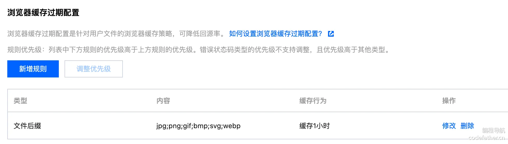

如果触发了浏览器本地缓存，在 F12 控制台中能够看到图片瞬间加载成功：

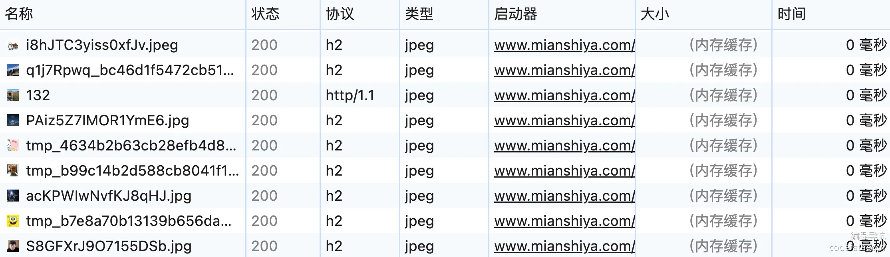

## 四、图片存储优化

### 数据沉降

大部分数据的访问热度会随着存储时间延长逐渐降低，为了严格控制存储成本，需要定期分析业务数据的访问情况，并动态调整存储类型。

这就涉及到 **数据沉降** 技术，将长时间未访问的数据自动迁移到低频访问存储，从而降低存储成本。就跟我们平时使用电脑一样，SSD 硬盘很贵，我们一般优先将常用软件放在 SSD 目录中，至于一些以前写过的资料什么的，可以放在机械硬盘或外接硬盘中。

一般情况下，数据沉降分为 2 个阶段：先分析再沉降。

1）先分析：通过对象存储提供的清单 / 访问日志分析，或者业务代码中自行统计分析。

2）再沉降：可以直接通过对象存储提供的 **生命周期** 功能自动沉降数据，只需编写沉降规则即可。如下图，将 30 天未修改的文件沉降至低频存储：

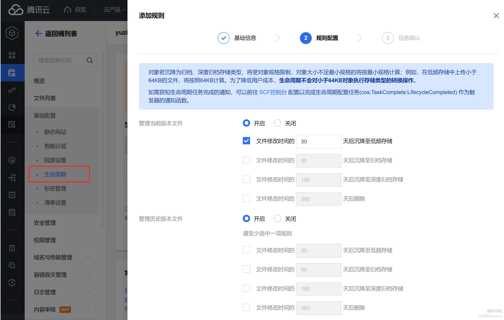

低频存储的价格比标准存储低了一些，还可以将 **几乎不需要修改和访问** 的文件（比如日志文件）移动到归档存储中，存储价格更低，可节约几倍的成本！

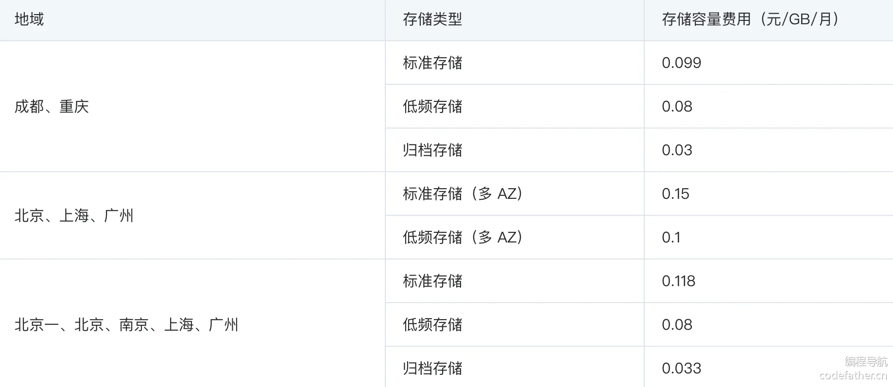

不过要注意，虽然低频存储的存储费用更低，但是当你要访问低频存储的资源时，会产生数据取回费用，所以一般只对几乎不访问的资源进行沉降，尽量减少取回费用。

数据沉降和 **冷热数据分离** 的概念是比较接近的，冷热数据分离是根据数据的访问热度，将访问频繁的数据（热数据）和访问较少的数据（冷数据）存储在不同的存储层中。

对于我们的项目，很久无人问津的历史图片就可以称为 “冷数据”，可以利用 COS 的生命周期功能在 30 天后自动沉降为低频存储。当然也可以通过数据库记录图片的访问和下载时间，自行调用 API 批量沉降数据或者转储到其他存储服务。

💡 数据沉降和冷热数据分离的概念又有一些细微的差别，个人的理解是数据沉降更倾向于关注一个对象的生命周期（一个资源从热到冷），目标更多的是降低存储成本，配置沉降规则后也一般不会调整。冷热数据分离更关注整个系统的资源分布（比如热门图片放到性能更高的硬盘中，冷门图片进行归档存储），目标是同时优化性能和节约成本，数据的热度可以实时调整。

### 清理策略

对于 “重存储” 的系统，数据清理是必要的！通过设置合理的清理策略，可以避免冗余数据占用存储空间，降低成本。

这里鱼皮分享 4 种典型的清理策略：

1）立即清理：在删除图片记录时，立即关联删除对象存储中已上传的图片文件，确保数据库记录与存储文件保持一致。

这里还有个小技巧，可以使用异步清理降低对删除操作性能的影响，并且记录一些日志，避免删除失败的情况。

2）手动清理：由管理员手动触发清理任务，可以筛选要清理的数据，按需选择需要清理的文件范围。

3）定期清理：通过定时任务自动触发清理操作。系统预先设置规则（如文件未访问时间超过一定期限）自动清理不需要的数据。

4）惰性清理：清理任务不会主动执行，而是等到资源需求增加（存储空间不足）或触发特定操作时才清理，适合存储空间紧张但清理任务优先级较低的场景。

实际开发中，以上几种清理策略可以结合使用。**比如 Redis 的内存管理机制结合了定期清理和惰性清理策略。** 定期清理通过后台定期扫描一部分键，随机检查并删除已过期的键，从而主动释放内存，减少过期键的堆积。惰性清理则是在访问某个键时，检查其是否已过期，如果已过期则立即删除。这两种策略互为补充：定期清理降低了过期键的占用积累，而惰性清理确保了访问时键的准确性和及时清理，从而在性能和内存使用之间取得平衡。

#### 实现方案

对于我们的项目，由于不像 Redis 一样对空间的限制那么严格，更多的是为了节约成本，所以不需要惰性清理策略，按需运用 “立即清理 + 手动清理 + 定期清理” 即可。

#### 后端开发

1）CosManager 补充删除对象的方法：

```java
/**
 * 删除对象
 *
 * @param key 文件 key
 */
public void deleteObject(String key) throws CosClientException {
    cosClient.deleteObject(cosClientConfig.getBucket(), key);
}
```

2）在 PictureService 中开发图片清理方法。

注意，删除图片时，需要先判断该图片地址是否还存在于其他记录里，确认没有才能删除。比如秒传的场景，就有可能多个图片地址指向同一个文件。

此外，还要注意删除对象存储中的文件时传入的是 key（不包含域名的相对路径），而数据库中取到的图片地址是包含域名的，所以删除前要移除域名，从而得到 key。这段鱼皮的视频教程中没有讲，大家可以自行实现。

```java
@Async
@Override
public void clearPictureFile(Picture oldPicture) {
    // 判断该图片是否被多条记录使用
    String pictureUrl = oldPicture.getUrl();
    long count = this.lambdaQuery()
            .eq(Picture::getUrl, pictureUrl)
            .count();
    // 有不止一条记录用到了该图片，不清理
    if (count > 1) {
        return;
    }
    // FIXME 注意，这里的 url 包含了域名，实际上只要传 key 值（存储路径）就够了
    cosManager.deleteObject(oldPicture.getUrl());
    // 清理缩略图
    String thumbnailUrl = oldPicture.getThumbnailUrl();
    if (StrUtil.isNotBlank(thumbnailUrl)) {
        cosManager.deleteObject(thumbnailUrl);
    }
}
```

上述代码中，使用了 Spring 的 `@Async` 注解，可以使得方法被异步调用，记得要在启动类上添加 `@EnableAsync` 注解才会生效。

```java
@SpringBootApplication
@EnableAsync
@MapperScan("com.yupi.yupicturebackend.mapper")
@EnableAspectJAutoProxy(exposeProxy = true)
public class YuPictureBackendApplication {
    public static void main(String[] args) {
        SpringApplication.run(YuPictureBackendApplication.class, args);
    }
}
```

然后你可以将 clearPictureFile 方法运用到图片删除接口等场景。这里鱼皮给大家抛砖引玉，更多的清理策略大家可以自行实现。

#### 扩展

1）补充更多清理时机：在重新上传图片时，虽然那条图片记录不会删除，但其实之前的图片文件已经作废了，也可以触发清理逻辑。

2）实现更多清理策略：比如用 Spring Scheduler 定时任务实现定时清理、编写一个接口供管理员手动清理，作为一种兜底策略。

3）优化清理文件的代码，比如要删除多个文件时，使用 [对象存储的批量删除接口](https://cloud.tencent.com/document/product/436/65939#841fe310-bdf8-4789-9bc0-26ea844e316d) 代替 for 循环调用。

4）为了清理原图，可以在数据库中保存原图的地址。

------

至此，鱼皮智能协同云图库项目的第一阶段已经开发优化完成，大家已经可以将这个项目部署上线并写到简历上啦~ 从下一期教程开始，我们将继续升级平台的能力，让它能够满足更多使用需求。

## 五、其他

在进入下期教程前，大家可以运用自己学过的知识，对项目自行做一波优化。

比如之前我们每次重启服务器都要重新登陆，既然已经整合了 Redis，不妨使用 Redis 管理 Session，更好地维护登录态。

### Redis 分布式 Session

操作方式也很简单，1 分钟就能完成。

1）先在 Maven 中引入 spring-session-data-redis 库：

```xml
<!-- Spring Session + Redis -->
<dependency>
    <groupId>org.springframework.session</groupId>
    <artifactId>spring-session-data-redis</artifactId>
</dependency>
```

2）修改 application.yml 配置文件，更改 Session 的存储方式和过期时间：

```yaml
spring: 
  # session 配置
  session:
    store-type: redis
    # session 30 天过期
    timeout: 2592000
server:
  port: 8123
  servlet:
    context-path: /api
    # cookie 30 天过期
    session:
      cookie:
        max-age: 2592000
```

这就搞定了，可以测试下重启服务器后是否还需要重新登陆，并且查看 Redis 中是否有登录相关的 key。

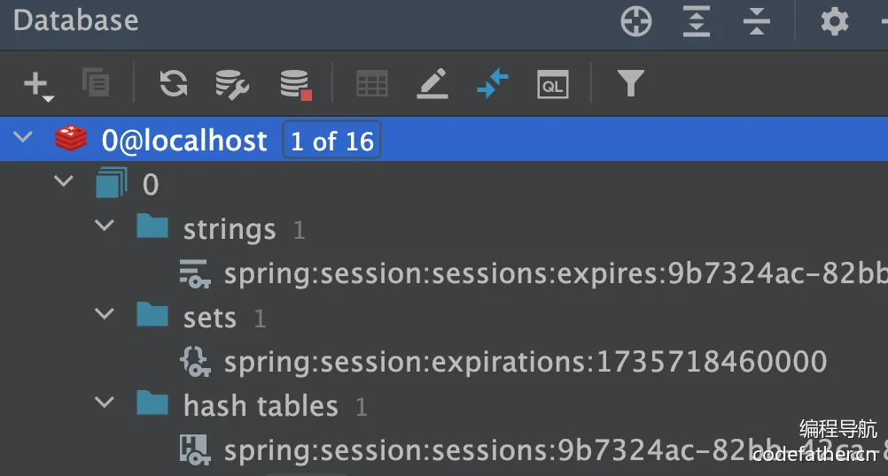


# 7 - 空间模块

## 本节重点

之前我们已经完成了公共图库的开发，为了进一步增加系统的应用价值，可以让每个用户都能创建自己的私有空间，打造自己的图片云盘、个人相册。

大纲：

- 空间模块需求分析
- 空间模块方案设计
- 空间模块后端开发
- 空间模块前端开发

本节教程不涉及新技术，重点学习业务经验和扩展系统的开发技巧，能够让大家学会更快更稳地给系统增加新的功能。

## 一、需求分析

对于空间模块，通常要有这些功能：

- 【管理员】管理空间
- 用户创建私有空间
- 私有空间权限控制
- 空间级别和限额控制

看起来简单，但其实每个需求的细节都非常多，具体分析每个需求：

1）管理空间：仅管理员可用，可以对整个系统中的空间进行管理，比如搜索空间、编辑空间、删除空间。

2）用户创建私有空间：用户可以创建 **最多一个** 私有空间，并且在私有空间内自由上传和管理图片。

3）私有空间权限控制：用户仅能访问和管理自己的私有空间和其中的图片，私有空间的图片不会展示在公共图库，也不需要管理员审核。

4）空间级别和限额控制：每个空间有不同的级别（如普通版和专业版），对应了不同的容量和图片数量限制，如果超出限制则无法继续上传图片。

## 二、方案设计

从需求分析中，我们也能感受到，细节比较多，为了更好地把控这些细节，需要先对系统进行一个整体的方案设计。

思考下面的问题：

1. 为什么要有 “空间” 的概念？
2. 如何对空间进行库表设计？
3. 公共图库和空间的关系？

### 空间的必要性

如果没有 “空间” 的概念，怎么实现让用户自由管理自己的私有图片呢？

Q：这不就相当于 “查看我的图片” 功能嘛，直接支持用户查询自己创建过的图片不就可以了？

A：如果这样做，会存在一个很大的问题：用户私有图片是 **需要隐私** 的，不需要被管理员审核，也不能被其他人公开查看。这和现在的公共图库平台的逻辑不一致。

想象一下，图片表中只有 userId 字段，无法区分图片到底是私有的还是公开的。

Q：那如果允许用户上传私有图片呢？比如设置图片可见范围为 “仅自己可见”？

A：这的确是可行的，对于内容占用存储空间不大的平台，很适合采用这种方案，像我们的 [代码小抄](https://www.codecopy.cn/) 就支持上传仅自己可见的代码。但是，对于图库平台，图片占用的存储空间会直接产生存储费用，因此需要对用户上传的图片大小和数量进行限制。类似于给你分配了一个电脑硬盘，它就是你的，用满了就不能再传图了。所以使用 “空间” 的概念会更符合这种应用场景，可以针对空间进行限制和分析，也更便于管理。

此外，从项目可扩展性的角度来讲，抽象 “空间” 的概念还有 2 个优势：

1. 和之前的公共图库完全分开，尽量只额外增加空间相关的逻辑和代码，减少对代码的修改。
2. 以后我们要开发团队共享空间，需要对空间进行成员管理，也是需要 “空间” 概念的。所以目前设计的空间表，要能够兼容之后的共享空间，便于后续扩展。

💡 这就是一种可扩展性的设计，当你发现系统逻辑较为复杂或产生冲突时，就抽象一个中间层（也就是 “空间”），使得新老逻辑分离，让项目更易于维护和扩展。

### 空间库表设计

#### 1、空间表

表名：space（空间表）

根据需求可以做出如下 SQL 设计：

```sql
-- 空间表
create table if not exists space
(
    id         bigint auto_increment comment 'id' primary key,
    spaceName  varchar(128)                       null comment '空间名称',
    spaceLevel int      default 0                 null comment '空间级别：0-普通版 1-专业版 2-旗舰版',
    maxSize    bigint   default 0                 null comment '空间图片的最大总大小',
    maxCount   bigint   default 0                 null comment '空间图片的最大数量',
    totalSize  bigint   default 0                 null comment '当前空间下图片的总大小',
    totalCount bigint   default 0                 null comment '当前空间下的图片数量',
    userId     bigint                             not null comment '创建用户 id',
    createTime datetime default CURRENT_TIMESTAMP not null comment '创建时间',
    editTime   datetime default CURRENT_TIMESTAMP not null comment '编辑时间',
    updateTime datetime default CURRENT_TIMESTAMP not null on update CURRENT_TIMESTAMP comment '更新时间',
    isDelete   tinyint  default 0                 not null comment '是否删除',
    -- 索引设计
    index idx_userId (userId),        -- 提升基于用户的查询效率
    index idx_spaceName (spaceName),  -- 提升基于空间名称的查询效率
    index idx_spaceLevel (spaceLevel) -- 提升按空间级别查询的效率
) comment '空间' collate = utf8mb4_unicode_ci;
```

几个设计要点：

1. 空间级别字段：空间级别包括普通版、专业版和旗舰版，是可枚举的，因此使用整型来节约空间、提高查询效率。
2. 空间限额字段：除了级别字段外，增加 `maxSize` 和 `maxCount` 字段用于限制空间的图片总大小与数量，而不是在代码中根据级别读取限额。这样管理员可以单独设置限额，不用完全和级别绑定，利于扩展；而且查询限额时也更方便。
3. 索引设计：为高频查询的字段（如空间名称、空间级别、用户 id）添加索引，提高查询效率。

#### 2、图片表

由于一张图片只能属于一个空间，可以在图片表 picture 中新增字段 spaceId，实现图片与空间的关联，同时增加索引以提高查询性能。

SQL 如下：

```sql
-- 添加新列
ALTER TABLE picture
    ADD COLUMN spaceId  bigint  null comment '空间 id（为空表示公共空间）';

-- 创建索引
CREATE INDEX idx_spaceId ON picture (spaceId);
```

默认情况下，spaceId 为空，表示图片上传到了公共图库。

### 公共图库和空间的关系

有同学可能会这么想：公共图库不就是系统管理员创建的一个空间么？既然有了空间表，要不要把公共图库也当做一个默认的空间来设计呢？或者在空间表创建一条公共图库的记录？

有这个想法是好的，但此处为了确保公共图库与私有空间的独立性，必须进行单独的设计，并避免将两者混合。原因如下：

1）公共图库的访问权限与私有空间不同

- 公共图库中的图片无需登录就能查看，任何人都可以访问，不需要进行用户认证或成员管理。
- 私有空间则要求用户登录，且访问权限严格控制，通常只有空间管理员（或团队成员）才能查看或修改空间内容。

2）公共图库没有额度限制：私有空间会有图片大小、数量等方面的限制，从而管理用户的存储资源和空间配额；而公共图库完全不受这些限制。

公共图库和私有空间在数据结构、图片存储、权限控制、额度管理等方面存在本质区别，如果混合设计，会增加系统的复杂度并影响维护与扩展性。举个例子：公共图库应该上传到对象存储的 public 目录，该目录里的文件可以公开访问；但私有图片应该上传到单独的 space 目录，该目录里的文件可以进一步设置访问权限。

因此鱼皮会使用 “公共图库” 而不是 “公共空间” 来表述，也能让我们整个项目各个阶段的设计更加独立。

------

由于细节较多，关于具体功能的实现方案会在开发具体功能前进行讲解，便于对照方案进行开发。

## 三、后端开发

### 空间管理

先从相对简单的管理能力（增删改查）开始开发。

#### 1、数据模型

1）首先利用 MyBatisX 插件生成空间表相关的基础代码，包括实体类、Mapper、Service。

用户模块中有讲解详细流程，此处不再赘述。

修改实体类的主键生成策略并指定逻辑删除字段，Space 类的代码如下：

```java
@TableName(value ="space")
@Data
public class Space implements Serializable {
    /**
     * id
     */
    @TableId(type = IdType.ASSIGN_ID)
    private Long id;

    /**
     * 空间名称
     */
    private String spaceName;

    /**
     * 空间级别：0-普通版 1-专业版 2-旗舰版
     */
    private Integer spaceLevel;

    /**
     * 空间图片的最大总大小
     */
    private Long maxSize;

    /**
     * 空间图片的最大数量
     */
    private Long maxCount;

    /**
     * 当前空间下图片的总大小
     */
    private Long totalSize;

    /**
     * 当前空间下的图片数量
     */
    private Long totalCount;

    /**
     * 创建用户 id
     */
    private Long userId;

    /**
     * 创建时间
     */
    private Date createTime;

    /**
     * 编辑时间
     */
    private Date editTime;

    /**
     * 更新时间
     */
    private Date updateTime;

    /**
     * 是否删除
     */
    @TableLogic
    private Integer isDelete;

    @TableField(exist = false)
    private static final long serialVersionUID = 1L;
}
```

2）每个操作都需要提供一个请求类，都放在 `model.dto.space` 包下。

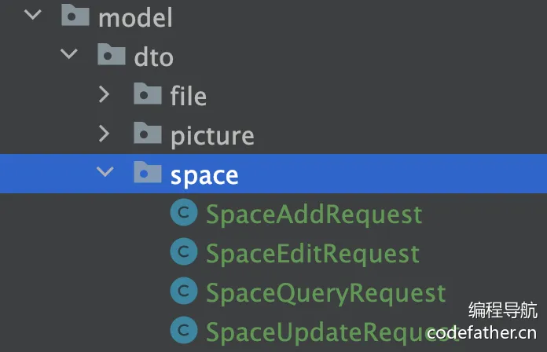

空间创建请求：

```java
@Data
public class SpaceAddRequest implements Serializable {

    /**
     * 空间名称
     */
    private String spaceName;

    /**
     * 空间级别：0-普通版 1-专业版 2-旗舰版
     */
    private Integer spaceLevel;

    private static final long serialVersionUID = 1L;
}
```

空间编辑请求，给用户使用，目前仅允许编辑空间名称：

```java
@Data
public class SpaceEditRequest implements Serializable {

    /**
     * 空间 id
     */
    private Long id;

    /**
     * 空间名称
     */
    private String spaceName;

    private static final long serialVersionUID = 1L;
}
```

空间更新请求，给管理员使用，可以修改空间级别和限额：

```java
@Data
public class SpaceUpdateRequest implements Serializable {

    /**
     * id
     */
    private Long id;

    /**
     * 空间名称
     */
    private String spaceName;

    /**
     * 空间级别：0-普通版 1-专业版 2-旗舰版
     */
    private Integer spaceLevel;

    /**
     * 空间图片的最大总大小
     */
    private Long maxSize;

    /**
     * 空间图片的最大数量
     */
    private Long maxCount;

    private static final long serialVersionUID = 1L;
}
```

空间查询请求：

```java
@EqualsAndHashCode(callSuper = true)
@Data
public class SpaceQueryRequest extends PageRequest implements Serializable {

    /**
     * id
     */
    private Long id;

    /**
     * 用户 id
     */
    private Long userId;

    /**
     * 空间名称
     */
    private String spaceName;

    /**
     * 空间级别：0-普通版 1-专业版 2-旗舰版
     */
    private Integer spaceLevel;

    private static final long serialVersionUID = 1L;
}
```

3）在 `model.dto.vo` 下新建空间的视图包装类，可以额外关联创建空间的用户信息。还可以编写 Space 实体类和该 VO 类的转换方法，便于后续快速传值。

```java
@Data
public class SpaceVO implements Serializable {
    /**
     * id
     */
    private Long id;

    /**
     * 空间名称
     */
    private String spaceName;

    /**
     * 空间级别：0-普通版 1-专业版 2-旗舰版
     */
    private Integer spaceLevel;

    /**
     * 空间图片的最大总大小
     */
    private Long maxSize;

    /**
     * 空间图片的最大数量
     */
    private Long maxCount;

    /**
     * 当前空间下图片的总大小
     */
    private Long totalSize;

    /**
     * 当前空间下的图片数量
     */
    private Long totalCount;

    /**
     * 创建用户 id
     */
    private Long userId;

    /**
     * 创建时间
     */
    private Date createTime;

    /**
     * 编辑时间
     */
    private Date editTime;

    /**
     * 更新时间
     */
    private Date updateTime;

    /**
     * 创建用户信息
     */
    private UserVO user;

    private static final long serialVersionUID = 1L;

    /**
     * 封装类转对象
     *
     * @param spaceVO
     * @return
     */
    public static Space voToObj(SpaceVO spaceVO) {
        if (spaceVO == null) {
            return null;
        }
        Space space = new Space();
        BeanUtils.copyProperties(spaceVO, space);
        return space;
    }

    /**
     * 对象转封装类
     *
     * @param space
     * @return
     */
    public static SpaceVO objToVo(Space space) {
        if (space == null) {
            return null;
        }
        SpaceVO spaceVO = new SpaceVO();
        BeanUtils.copyProperties(space, spaceVO);
        return spaceVO;
    }
}
```

4）在 `model.enums` 包下新建空间级别枚举，定义每个级别的空间对应的限额：

```java
@Getter
public enum SpaceLevelEnum {

    COMMON("普通版", 0, 100, 100L * 1024 * 1024),
    PROFESSIONAL("专业版", 1, 1000, 1000L * 1024 * 1024),
    FLAGSHIP("旗舰版", 2, 10000, 10000L * 1024 * 1024);

    private final String text;

    private final int value;

    private final long maxCount;

    private final long maxSize;


    /**
     * @param text 文本
     * @param value 值
     * @param maxSize 最大图片总大小
     * @param maxCount 最大图片总数量
     */
    SpaceLevelEnum(String text, int value, long maxCount, long maxSize) {
        this.text = text;
        this.value = value;
        this.maxCount = maxCount;
        this.maxSize = maxSize;
    }

    /**
     * 根据 value 获取枚举
     */
    public static SpaceLevelEnum getEnumByValue(Integer value) {
        if (ObjUtil.isEmpty(value)) {
            return null;
        }
        for (SpaceLevelEnum spaceLevelEnum : SpaceLevelEnum.values()) {
            if (spaceLevelEnum.value == value) {
                return spaceLevelEnum;
            }
        }
        return null;
    }
}
```

💡 还有另外一种定义空间级别限额的方式，比如将空间限额配置存储在外部文件（如 JSON 文件或 properties 文件），并创建一个单独的类来接收参数。这样后期如果有变动，修改配置文件即可，而不必修改代码。

#### 2、基础服务开发

可以参考图片服务的开发方法，完成 SpaceService 和实现类，大多数代码可以直接复用。

由于创建空间的逻辑比较复杂，可以先定义个接口占坑。我们主要开发下列方法：

1）需要开发校验空间数据的方法，增加 add 参数用来区分是创建数据时校验还是编辑时校验，判断条件是不一样的：

```java
@Override
public void validSpace(Space space, boolean add) {
    ThrowUtils.throwIf(space == null, ErrorCode.PARAMS_ERROR);
    // 从对象中取值
    String spaceName = space.getSpaceName();
    Integer spaceLevel = space.getSpaceLevel();
    SpaceLevelEnum spaceLevelEnum = SpaceLevelEnum.getEnumByValue(spaceLevel);
    // 要创建
    if (add) {
        if (StrUtil.isBlank(spaceName)) {
            throw new BusinessException(ErrorCode.PARAMS_ERROR, "空间名称不能为空");
        }
        if (spaceLevel == null) {
            throw new BusinessException(ErrorCode.PARAMS_ERROR, "空间级别不能为空");
        }
    }
    // 修改数据时，如果要改空间级别
    if (spaceLevel != null && spaceLevelEnum == null) {
        throw new BusinessException(ErrorCode.PARAMS_ERROR, "空间级别不存在");
    }
    if (StrUtil.isNotBlank(spaceName) && spaceName.length() > 30) {
        throw new BusinessException(ErrorCode.PARAMS_ERROR, "空间名称过长");
    }
}
```

2）在创建或更新空间时，需要根据空间级别自动填充限额数据，可以在服务中编写方法便于复用：

```java
@Override
public void fillSpaceBySpaceLevel(Space space) {
    // 根据空间级别，自动填充限额
    SpaceLevelEnum spaceLevelEnum = SpaceLevelEnum.getEnumByValue(space.getSpaceLevel());
    if (spaceLevelEnum != null) {
        long maxSize = spaceLevelEnum.getMaxSize();
        if (space.getMaxSize() == null) {
            space.setMaxSize(maxSize);
        }
        long maxCount = spaceLevelEnum.getMaxCount();
        if (space.getMaxCount() == null) {
            space.setMaxCount(maxCount);
        }
    }
}
```

如果空间本身没有设置限额，才会自动填充，保证了灵活性。

#### 3、接口开发

参考图片接口的开发方法，完成 SpaceController 类，大多数代码可以直接复用。

需要重点关注接口的权限：

- 创建空间：所有用户都可以使用
- 删除空间：仅允许空间创建人或管理员删除
- 更新空间：仅管理员可用，允许更新空间级别
- 编辑空间：允许空间创建人使用，但注意可编辑的字段（不能编辑空间级别）

开发更新接口时，需要调用填充空间限额数据的方法：

```java
@PostMapping("/update")
@AuthCheck(mustRole = UserConstant.ADMIN_ROLE)
public BaseResponse<Boolean> updateSpace(@RequestBody SpaceUpdateRequest spaceUpdateRequest) {
    if (spaceUpdateRequest == null || spaceUpdateRequest.getId() <= 0) {
        throw new BusinessException(ErrorCode.PARAMS_ERROR);
    }
    // 将实体类和 DTO 进行转换
    Space space = new Space();
    BeanUtils.copyProperties(spaceUpdateRequest, space);
    // 自动填充数据
    spaceService.fillSpaceBySpaceLevel(space);
    // 数据校验
    spaceService.validSpace(space, false);
    // 判断是否存在
    long id = spaceUpdateRequest.getId();
    Space oldSpace = spaceService.getById(id);
    ThrowUtils.throwIf(oldSpace == null, ErrorCode.NOT_FOUND_ERROR);
    // 操作数据库
    boolean result = spaceService.updateById(space);
    ThrowUtils.throwIf(!result, ErrorCode.OPERATION_ERROR);
    return ResultUtils.success(true);
}
```

### 用户创建私有空间

用户可以自主创建私有空间，但是必须要加限制，**最多只能创建一个**。

需要开发创建空间服务，该服务较为复杂，我们要先整理下流程。

#### 1、创建空间流程

流程如下：

1. 填充参数默认值
2. 校验参数
3. 校验权限，非管理员只能创建普通级别的空间
4. 控制同一用户只能创建一个私有空间

如何保证同一用户只能创建一个私有空间呢？

最粗暴的方式是给空间表的 userId 加上唯一索引，但由于后续用户还可以创建团队空间，这种方式不利于扩展。所以我们采用 **加锁 + 事务** 的方式实现。

#### 2、创建空间服务

按照上述流程编写代码：

```java
@Resource
private TransactionTemplate transactionTemplate;

@Override
public long addSpace(SpaceAddRequest spaceAddRequest, User loginUser) {
    // 在此处将实体类和 DTO 进行转换
    Space space = new Space();
    BeanUtils.copyProperties(spaceAddRequest, space);
    // 默认值
    if (StrUtil.isBlank(spaceAddRequest.getSpaceName())) {
        space.setSpaceName("默认空间");
    }
    if (spaceAddRequest.getSpaceLevel() == null) {
        spaceAddRequest.setSpaceLevel(SpaceLevelEnum.COMMON.getValue());
    }
    // 填充数据
    this.fillSpaceBySpaceLevel(space);
    // 数据校验
    this.validSpace(space, true);
    Long userId = loginUser.getId();
    space.setUserId(userId);
    // 权限校验
    if (SpaceLevelEnum.COMMON.getValue() != spaceAddRequest.getSpaceLevel() && !userService.isAdmin(loginUser)) {
        throw new BusinessException(ErrorCode.NO_AUTH_ERROR, "无权限创建指定级别的空间");
    }
    // 针对用户进行加锁
    String lock = String.valueOf(userId).intern();
    synchronized (lock) {
        Long newSpaceId = transactionTemplate.execute(status -> {
            boolean exists = this.lambdaQuery().eq(Space::getUserId, userId).exists();
            ThrowUtils.throwIf(exists, ErrorCode.OPERATION_ERROR, "每个用户仅能有一个私有空间");
            // 写入数据库
            boolean result = this.save(space);
            ThrowUtils.throwIf(!result, ErrorCode.OPERATION_ERROR);
            // 返回新写入的数据 id
            return space.getId();
        });
        // 返回结果是包装类，可以做一些处理
        return Optional.ofNullable(newSpaceId).orElse(-1L);
    }
}
```

注意，上述代码中，我们使用本地 synchronized 锁对 userId 进行加锁，这样不同的用户可以拿到不同的锁，对性能的影响较低。在加锁的代码中，我们使用 Spring 的 **编程式事务管理器** transactionTemplate 封装跟数据库有关的查询和插入操作，而不是使用 @Transactional 注解来控制事务，这样可以保证事务的提交在加锁的范围内。

💡 只要涉及到事务操作，建议大家测试时自己 new 个运行时异常来验证是否会回滚。

#### 扩展知识 - 本地锁优化

上述代码中，我们是对字符串常量池（intern）进行加锁的，数据并不会及时释放。如果还要使用本地锁，可以按需选用另一种方式 —— 采用 `ConcurrentHashMap` 来存储锁对象。

示例代码如下：

```java
Map<Long, Object> lockMap = new ConcurrentHashMap<>();

public long addSpace(SpaceAddRequest spaceAddRequest, User user) {
    Long userId = user.getId();
    Object lock = lockMap.computeIfAbsent(userId, key -> new Object());
    synchronized (lock) {
        try {
            // 数据库操作
        } finally {
            // 防止内存泄漏
            lockMap.remove(userId);
        }
    }
}
```

#### 扩展

1）用户注册成功时，可以自动创建空间。即使创建失败了，也可以手动创建作为兜底。

2）管理员可以为某个用户创建空间（目前没啥必要）

3）本地锁改为分布式锁，可以基于 Redisson 实现。鱼皮编程导航的 [AI 答题应用平台项目](https://www.code-nav.cn/course/1790274408835506178/) 中有讲解。

### 私有空间权限控制

私有空间的权限和公共图库是不同的，我们需要对之前 **所有的图片操作** 都添加和空间有关的权限校验逻辑。

#### 1、图片表新增字段

图片表增加 spaceId 字段，默认为 null 表示公共图库。

同步修改 PictureMapper.xml、Picture 实体类、PictureVO 响应视图，补充空间 id 字段：

```java
/**
 * 空间 id
 */
private Long spaceId;
```

下面我们依次给 “增删改查” 图片操作增加权限校验逻辑。

#### 2、上传和更新图片

1）上传图片时支持指定空间 id，表示要将图片上传到哪个空间。

给 PictureUploadRequest 请求封装类补充 spaceId 字段。

2）修改上传图片方法 uploadPicture，校验空间是否存在；如果存在，还要校验是否有空间权限，仅空间的管理员才能上传。

现阶段空间的管理员就是空间的创建人

```java
ThrowUtils.throwIf(loginUser == null, ErrorCode.NO_AUTH_ERROR);
// 校验空间是否存在
Long spaceId = pictureUploadRequest.getSpaceId();
if (spaceId != null) {
    Space space = spaceService.getById(spaceId);
    ThrowUtils.throwIf(space == null, ErrorCode.NOT_FOUND_ERROR, "空间不存在");
    // 必须空间创建人（管理员）才能上传
    if (!loginUser.getId().equals(space.getUserId())) {
        throw new BusinessException(ErrorCode.NO_AUTH_ERROR, "没有空间权限");
    }
}
```

3）如果是更新图片，需要校验更新时传递的 spaceId 和已有图片的 spaceId 是否一致。如果更新时未传递 spaceId，则复用原有图片的 spaceId。代码如下：

```java
// 如果是更新图片，需要校验图片是否存在
if (pictureId != null) {
    Picture oldPicture = this.getById(pictureId);
    ThrowUtils.throwIf(oldPicture == null, ErrorCode.NOT_FOUND_ERROR, "图片不存在");
    // 仅本人或管理员可编辑
    if (!oldPicture.getUserId().equals(loginUser.getId()) && !userService.isAdmin(loginUser)) {
        throw new BusinessException(ErrorCode.NO_AUTH_ERROR);
    }
    // 校验空间是否一致
    // 没传 spaceId，则复用原有图片的 spaceId
    if (spaceId == null) {
        if (oldPicture.getSpaceId() != null) {
            spaceId = oldPicture.getSpaceId();
        }
    } else {
        // 传了 spaceId，必须和原有图片一致
        if (ObjUtil.notEqual(spaceId, oldPicture.getSpaceId())) {
            throw new BusinessException(ErrorCode.PARAMS_ERROR, "空间 id 不一致");
        }
    }
}
```

4）之前是按用户划分图片上传目录的，现在如果有 spaceId，可以按照空间来划分图片上传目录。

```java
// 按照用户 id 划分目录 => 按照空间划分目录
String uploadPathPrefix;
if (spaceId == null) {
    uploadPathPrefix = String.format("public/%s", loginUser.getId());
} else {
    uploadPathPrefix = String.format("space/%s", spaceId);
}
```

5）插入 / 更新数据时，将 spaceId 设置到 Picture 对象中：

```java
// 构造要入库的图片信息
Picture picture = new Picture();
// 补充设置 spaceId
picture.setSpaceId(spaceId);
```

#### 2、删除图片

如果要删除的图片有空间 id，表示是用户上传到私有空间中的图片，那么登录用户必须是空间的管理员（也就是创建者），系统管理员也不能随意删除私有空间的图片。

1）因为删除图片和编辑图片的权限控制是一样的（有删除权限就有编辑权限），可以将这段权限校验逻辑封装为一个方法：

```java
@Override
public void checkPictureAuth(User loginUser, Picture picture) {
    Long spaceId = picture.getSpaceId();
    if (spaceId == null) {
        // 公共图库，仅本人或管理员可操作
        if (!picture.getUserId().equals(loginUser.getId()) && !userService.isAdmin(loginUser)) {
            throw new BusinessException(ErrorCode.NO_AUTH_ERROR);
        }
    } else {
        // 私有空间，仅空间管理员可操作
        if (!picture.getUserId().equals(loginUser.getId())) {
            throw new BusinessException(ErrorCode.NO_AUTH_ERROR);
        }
    }
}
```

2）原本删除图片 deletePicture 逻辑很简单，直接写到了 Controller 中，现在有了更多逻辑，建议封装为 service，并同步修改 Controller 来调用 Service。

删除图片方法代码如下：

```java
@Override
public void deletePicture(long pictureId, User loginUser) {
    ThrowUtils.throwIf(pictureId <= 0, ErrorCode.PARAMS_ERROR);
    ThrowUtils.throwIf(loginUser == null, ErrorCode.NO_AUTH_ERROR);
    // 判断是否存在
    Picture oldPicture = this.getById(pictureId);
    ThrowUtils.throwIf(oldPicture == null, ErrorCode.NOT_FOUND_ERROR);
    // 校验权限
    checkPictureAuth(loginUser, oldPicture);
    // 操作数据库
    boolean result = this.removeById(pictureId);
    ThrowUtils.throwIf(!result, ErrorCode.OPERATION_ERROR);
    // 异步清理文件
    this.clearPictureFile(oldPicture);
}
```

#### 3、编辑图片

跟删除图片的权限校验逻辑一样，如果要编辑的图片有空间 id，表示是用户上传到私有空间中的图片，那么登录用户必须是空间的管理员（也就是创建者），系统管理员也不能随意编辑私有空间的图片。

将 editPicture 方法抽象到 Service 中，并同步修改 Controller 来调用 Service。代码如下：

```java
@Override
public void editPicture(PictureEditRequest pictureEditRequest, User loginUser) {
    // 在此处将实体类和 DTO 进行转换
    Picture picture = new Picture();
    BeanUtils.copyProperties(pictureEditRequest, picture);
    // 注意将 list 转为 string
    picture.setTags(JSONUtil.toJsonStr(pictureEditRequest.getTags()));
    // 设置编辑时间
    picture.setEditTime(new Date());
    // 数据校验
    this.validPicture(picture);
    // 判断是否存在
    long id = pictureEditRequest.getId();
    Picture oldPicture = this.getById(id);
    ThrowUtils.throwIf(oldPicture == null, ErrorCode.NOT_FOUND_ERROR);
    // 校验权限
    checkPictureAuth(loginUser, oldPicture);
    // 补充审核参数
    this.fillReviewParams(picture, loginUser);
    // 操作数据库
    boolean result = this.updateById(picture);
    ThrowUtils.throwIf(!result, ErrorCode.OPERATION_ERROR);
}
```

由于更新图片是给管理员使用的接口，可以暂时不修改。

#### 4、查询图片

用户无法查询到私有空间的图片，只能查询公共图库，单条查询和分页查询都要添加这个逻辑。

1）根据 id 查询接口 getPictureVOById

如果查询出的图片有 spaceId，则运用跟删除图片一样的校验逻辑，仅空间管理员可以查看：

```java
// 查询数据库
Picture picture = pictureService.getById(id);
ThrowUtils.throwIf(picture == null, ErrorCode.NOT_FOUND_ERROR);
// 空间权限校验
Long spaceId = picture.getSpaceId();
if (spaceId != null) {
    User loginUser = userService.getLoginUser(request);
    pictureService.checkPictureAuth(loginUser, picture);
}
```

2）分页查询接口 listPictureVOByPage

查询请求增加 spaceId 参数，不传则表示查公共图库；传参则表示查询特定空间 id 下的图片，此时登录用户必须是空间的管理员（其他用户无法查看别人空间的图片），并且不需要指定审核条件（私有空间没有审核机制）。

先给请求封装类 PictureQueryRequest 和 QueryWrapper 补充空间 id 的查询条件。

PictureQueryRequest 新增代码：

```java
/**
 * 空间 id
 */
private Long spaceId;

/**
 * 是否只查询 spaceId 为 null 的数据
 */
private boolean nullSpaceId;
```

QueryWrapper 新增代码：

```java
queryWrapper.eq(ObjUtil.isNotEmpty(spaceId), "spaceId", spaceId);
queryWrapper.isNull(nullSpaceId, "spaceId");
```

然后给接口增加权限校验，针对公开图库和私有空间设置不同的查询条件：

```java
// 空间权限校验
Long spaceId = pictureQueryRequest.getSpaceId();
// 公开图库
if (spaceId == null) {
    // 普通用户默认只能查看已过审的公开数据
    pictureQueryRequest.setReviewStatus(PictureReviewStatusEnum.PASS.getValue());
    pictureQueryRequest.setNullSpaceId(true);
} else {
    // 私有空间
    User loginUser = userService.getLoginUser(request);
    Space space = spaceService.getById(spaceId);
    ThrowUtils.throwIf(space == null, ErrorCode.NOT_FOUND_ERROR, "空间不存在");
    if (!loginUser.getId().equals(space.getUserId())) {
        throw new BusinessException(ErrorCode.NO_AUTH_ERROR, "没有空间权限");
    }
}
```

考虑到私有空间的图片更新频率不好把握，之前编写的缓存分页查询图片接口可以暂不使用和修改，可以将该接口标记为 @Deprecated 表示已废弃。

### 空间级别和限额控制

需求：每次上传图片前，都要校验空间剩余额度是否足够；每次上传和删除图片时，都要更新已使用的额度。

#### 1、上传图片时校验和更新额度

我们发现，目前上传图片的代码已经比较复杂了，如果想要再增加非常严格精确的校验逻辑，需要在上传图片到对象存储前自己解析文件的大小、再计算是否超额，可能还要加锁，想想都头疼！

**这时你会怎么做呢？**

当技术实现比较复杂时，我们不妨思考一下能否对业务进行优化。

比如：

- 单张图片最大才 2M，那么即使空间满了再允许上传一张图片，影响也不大
- 即使有用户在超额前的瞬间大量上传图片，对系统的影响也并不大。后续可以通过限流 + 定时任务检测空间等策略，尽早发现这些特殊情况再进行定制处理。

这样一来，就利用业务设计巧妙节约了开发成本。

1）修改 uploadPicture 方法，编写校验代码，只需要增加 2 个判断条件：

```java
// 空间权限校验
Long spaceId = pictureUploadRequest.getSpaceId();
if (spaceId != null) {
    Space space = spaceService.getById(spaceId);
    ThrowUtils.throwIf(space == null, ErrorCode.NOT_FOUND_ERROR, "空间不存在");
    // 必须空间创建人（管理员）才能上传
    if (!loginUser.getId().equals(space.getUserId())) {
        throw new BusinessException(ErrorCode.NO_AUTH_ERROR, "没有空间权限");
    }
    // 校验额度
    if (space.getTotalCount() >= space.getMaxCount()) {
        throw new BusinessException(ErrorCode.OPERATION_ERROR, "空间条数不足");
    }
    if (space.getTotalSize() >= space.getMaxSize()) {
        throw new BusinessException(ErrorCode.OPERATION_ERROR, "空间大小不足");
    }
}
```

2）保存图片记录时，需要使用事务更新额度，如果额度更新失败，也不用将图片记录保存。

依然是使用 transactionTemplate 事务管理器，将所有数据库操作到一起即可：

```java
// 开启事务
Long finalSpaceId = spaceId;
transactionTemplate.execute(status -> {
    boolean result = this.saveOrUpdate(picture);
    ThrowUtils.throwIf(!result, ErrorCode.OPERATION_ERROR, "图片上传失败");
    if (finalSpaceId != null) {
        boolean update = spaceService.lambdaUpdate()
                .eq(Space::getId, finalSpaceId)
                .setSql("totalSize = totalSize + " + picture.getPicSize())
                .setSql("totalCount = totalCount + 1")
                .update();
        ThrowUtils.throwIf(!update, ErrorCode.OPERATION_ERROR, "额度更新失败");
    }
    return picture;
});
```

#### 2、删除图片后更新额度

删除图片时，要释放额度。同样使用 transactionTemplate 事务管理器，将删除图片和更新额度的数据库操作视为一个整体，避免删除图片后没释放额度的情况。

```java
// 校验权限
checkPictureAuth(loginUser, oldPicture);
// 开启事务
transactionTemplate.execute(status -> {
    // 操作数据库
    boolean result = this.removeById(pictureId);
    ThrowUtils.throwIf(!result, ErrorCode.OPERATION_ERROR);
    // 释放额度
    Long spaceId = oldPicture.getSpaceId();
    if (spaceId != null) {
        boolean update = spaceService.lambdaUpdate()
                .eq(Space::getId, spaceId)
                .setSql("totalSize = totalSize - " + oldPicture.getPicSize())
                .setSql("totalCount = totalCount - 1")
                .update();
        ThrowUtils.throwIf(!update, ErrorCode.OPERATION_ERROR, "额度更新失败");
    }
    return true;
});
// 异步清理文件
this.clearPictureFile(oldPicture);
```

注意，这里有可能出现对象存储上的图片文件实际没被清理的情况。但是对于用户来说，不应该感受到 “删了图片空间却没有增加”，所以没有将这一步添加到事务中。可以通过定时任务检测作为补偿措施。

#### 3、查询空间级别列表

最后，我们再编写一个接口，用于给前端展示所有的空间级别信息。

1）新建 SpaceLevel 封装类：

```java
@Data
@AllArgsConstructor
public class SpaceLevel {

    private int value;

    private String text;

    private long maxCount;

    private long maxSize;
}
```

2）在 SpaceController 中编写接口，将枚举转换为空间级别对象列表：

```java
@GetMapping("/list/level")
public BaseResponse<List<SpaceLevel>> listSpaceLevel() {
    List<SpaceLevel> spaceLevelList = Arrays.stream(SpaceLevelEnum.values()) // 获取所有枚举
            .map(spaceLevelEnum -> new SpaceLevel(
                    spaceLevelEnum.getValue(),
                    spaceLevelEnum.getText(),
                    spaceLevelEnum.getMaxCount(),
                    spaceLevelEnum.getMaxSize()))
            .collect(Collectors.toList());
    return ResultUtils.success(spaceLevelList);
}
```

### 扩展

1）删除空间时，关联删除空间内的图片

2）管理员创建空间：管理员可以为指定用户创建空间。可以在创建空间时多传一个 userId 参数，但是要注意做好权限控制，仅管理员可以为别人创建空间。

3）目前更新上传图片的逻辑还是存在一些问题的。比如更新图片时，并没有删除原有图片、也没有减少原有图片占用的空间和额度，可以通过事务中补充逻辑或者通过定时任务扫描删除。

## 四、前端开发

### 空间管理页面

首先从最好开发的管理页面做起，流程和其他的管理页面完全一致。

#### 1、新建路由和菜单

首先新建 `admin/SpaceManagePage.vue` 页面文件，在 `router/index.ts` 中定义路由：

```typescript
{
  path: '/admin/spaceManage',
  name: '空间管理',
  component: SpaceManagePage,
},
```

在 GlobalHeader 组件中补充菜单：

```typescript
{
  key: '/admin/spaceManage',
  label: '空间管理',
  title: '空间管理',
},
```

由于之前已经编写了权限校验逻辑，地址以 /admin 开头的页面都会限制为仅管理员可见和可用，所以无需再编写额外的权限校验代码。

#### 2、定义空间常量

和后端一样，前端也有很多地方要用到空间级别信息，可以定义为一个常量。

在 `constants` 目录下新建 space.ts 常量文件，定义枚举信息、对应的中文映射、以及后续筛选空间级别时要用到的选项数组：

```typescript
// 空间级别枚举
export const SPACE_LEVEL_ENUM = {
  COMMON: 0,
  PROFESSIONAL: 1,
  FLAGSHIP: 2,
} as const;

// 空间级别文本映射
export const SPACE_LEVEL_MAP: Record<number, string> = {
  0: '普通版',
  1: '专业版',
  2: '旗舰版',
};

// 空间级别选项映射
export const SPACE_LEVEL_OPTIONS = Object.keys(SPACE_LEVEL_MAP).map((key) => {
  const value = Number(key); // Convert string key to number
  return {
    label: SPACE_LEVEL_MAP[value],
    value,
  };
});
```

💡 这种代码完全可以利用 AI 生成。

#### 3、开发管理页面

跟用户管理页面类似，页面的上方是搜索栏，下方是表格，表格需要支持分页。

大多数的内容可以直接复用其他管理页面的代码，可以先复制过来，再进行修改。

1）给表格定义展示的列：

```typescript
const columns = [
  {
    title: 'id',
    dataIndex: 'id',
    width: 80,
  },
  {
    title: '空间名称',
    dataIndex: 'spaceName',
  },
  {
    title: '空间级别',
    dataIndex: 'spaceLevel',
  },
  {
    title: '使用情况',
    dataIndex: 'spaceUseInfo',
  },
  {
    title: '用户 id',
    dataIndex: 'userId',
    width: 80,
  },
  {
    title: '创建时间',
    dataIndex: 'createTime',
  },
  {
    title: '编辑时间',
    dataIndex: 'editTime',
  },
  {
    title: '操作',
    key: 'action',
  },
]
```

2）从后端获取数据，并支持搜索和分页：

```typescript
// 数据
const dataList = ref([])
const total = ref(0)

// 搜索条件
const searchParams = reactive<API.SpaceQueryRequest>({
  current: 1,
  pageSize: 10,
  sortField: 'createTime',
  sortOrder: 'descend',
})

// 分页参数
const pagination = computed(() => {
  return {
    current: searchParams.current ?? 1,
    pageSize: searchParams.pageSize ?? 10,
    total: total.value,
    showSizeChanger: true,
    showTotal: (total) => `共 ${total} 条`,
  }
})

// 获取数据
const fetchData = async () => {
  const res = await listSpaceByPageUsingPost({
    ...searchParams,
  })
  if (res.data.data) {
    dataList.value = res.data.data.records ?? []
    total.value = res.data.data.total ?? 0
  } else {
    message.error('获取数据失败，' + res.data.message)
  }
}

// 页面加载时请求一次
onMounted(() => {
  fetchData()
})

// 获取数据
const doSearch = () => {
  // 重置搜索条件
  searchParams.current = 1
  fetchData()
}

// 表格变化处理
const doTableChange = (page: any) => {
  searchParams.current = page.current
  searchParams.pageSize = page.pageSize
  fetchData()
}
```

注意：获取数据时，调用的是仅管理员可用的查询接口 listSpaceByPageUsingPost，不是给用户使用的查询包装类接口。

3）自定义列的展示，比如空间级别、使用情况、创建时间、编辑时间等：

```vue
<template #bodyCell="{ column, record }">
  <!-- 空间级别 -->
  <template v-if="column.dataIndex === 'spaceLevel'">
    <a-tag>{{ SPACE_LEVEL_MAP[record.spaceLevel] }}</a-tag>
  </template>
  <!-- 使用情况 -->
  <template v-if="column.dataIndex === 'spaceUseInfo'">
    <div>大小：{{ formatSize(record.totalSize) }} / {{ formatSize(record.maxSize) }}</div>
    <div>数量：{{ record.totalCount }} / {{ record.maxCount }}</div>
  </template>
  <template v-else-if="column.dataIndex === 'createTime'">
    {{ dayjs(record.createTime).format('YYYY-MM-DD HH:mm:ss') }}
  </template>
  <template v-else-if="column.dataIndex === 'editTime'">
    {{ dayjs(record.editTime).format('YYYY-MM-DD HH:mm:ss') }}
  </template>
  <template v-else-if="column.key === 'action'">
    <a-space wrap>
      <a-button type="link" :href="`/add_space?id=${record.id}`" target="_blank">
        编辑
      </a-button>
      <a-button type="link" danger @click="doDelete(record.id)">删除</a-button>
    </a-space>
  </template>
</template>
```

4）开发搜索表单，支持按照空间名称、空间级别、用户 id 搜索：

```vue
<a-form layout="inline" :model="searchParams" @finish="doSearch">
  <a-form-item label="空间名称" name="spaceName">
    <a-input v-model:value="searchParams.spaceName" placeholder="请输入空间名称" allow-clear />
  </a-form-item>
  <a-form-item label="空间级别" name="spaceLevel">
    <a-select
      v-model:value="searchParams.spaceLevel"
      :options="SPACE_LEVEL_OPTIONS"
      placeholder="请输入空间级别"
      style="min-width: 180px"
      allow-clear
    />
  </a-form-item>
  <a-form-item label="用户 id" name="userId">
    <a-input v-model:value="searchParams.userId" placeholder="请输入用户 id" allow-clear />
  </a-form-item>
  <a-form-item>
    <a-button type="primary" html-type="submit">搜索</a-button>
  </a-form-item>
</a-form>
```

5）补充操作按钮。

可以在搜索表单上新增一行，展示标题和创建空间按钮，点击按钮会打开创建空间页面：

```vue
<a-flex justify="space-between">
  <h2>空间管理</h2>
  <a-space>
    <a-button type="primary" href="/add_space" target="_blank">+ 创建空间</a-button>
  </a-space>
</a-flex>
```

在表格操作列中，也要补充编辑按钮，点击后打开编辑空间页面：

```vue
<a-space wrap>
  <a-button type="link" :href="`/add_space?id=${record.id}`" target="_blank">
    编辑
  </a-button>
  <a-button type="link" danger @click="doDelete(record.id)">删除</a-button>
</a-space>
```

最终页面效果如图：

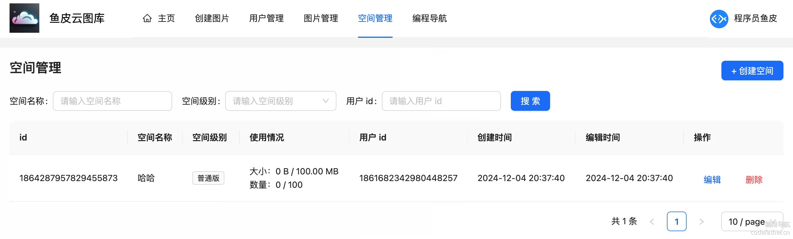

### 创建空间页面

#### 1、新建路由

首先新建 `AddSpacePage.vue` 页面文件，在 `router/index.ts` 中定义路由：

```typescript
{
  path: '/add_space',
  name: '创建空间',
  component: AddSpacePage,
},
```

#### 2、开发表单

该页面的主体是表单，可以直接复制批量创建图片页面，略作修改即可。

1）先修改表单项，允许填写空间名称、空间级别：

```vue
<a-form layout="vertical" :model="formData" @finish="handleSubmit">
  <a-form-item label="空间名称" name="spaceName">
    <a-input v-model:value="formData.spaceName" placeholder="请输入空间名称" allow-clear />
  </a-form-item>
  <a-form-item label="空间级别" name="spaceLevel">
    <a-select
      v-model:value="formData.spaceLevel"
      :options="SPACE_LEVEL_OPTIONS"
      placeholder="请输入空间级别"
      style="min-width: 180px"
      allow-clear
    />
  </a-form-item>
  <a-form-item>
    <a-button type="primary" html-type="submit" style="width: 100%" :loading="loading">
      提交
    </a-button>
  </a-form-item>
</a-form>
```

2）定义表单项结构和 loading 变量：

```typescript
const formData = reactive<API.SpaceAddRequest | API.SpaceUpdateRequest>({
  spaceName: '',
  spaceLevel: SPACE_LEVEL_ENUM.COMMON,
})
const loading = ref(false)
```

3）编写提交函数，创建成功后会输出信息并跳转到新创建的空间详情页：

```typescript
const handleSubmit = async (values: any) => {
  loading.value = true;
  const res = await addSpaceUsingPost({
    ...formData,
  })
  if (res.data.code === 0 && res.data.data) {
    message.success("创建成功")
    router.push({
      path: `/space/${res.data.data}`,
    })
  } else {
    message.error('创建失败，' + res.data.message)
  }
  loading.value = false;
}
```

#### 3、展示空间级别信息

无论是用户和管理员，都需要了解空间级别信息；而且目前用户只能开通普通版空间，这个信息也要同步给用户。由于系统不支持支付，可以先让有需求的用户主动联系管理员，这是最快的盈利方式。

所以可以在表单下新增展示这些信息的卡片。

1）先利用组件库的 [卡片组件](https://antdv.com/components/card-cn) 开发页面内容：

```vue
<a-card title="空间级别介绍">
  <a-typography-paragraph>
    * 目前仅支持开通普通版，如需升级空间，请联系
    <a href="https://codefather.cn" target="_blank">程序员鱼皮</a>。
  </a-typography-paragraph>
  <a-typography-paragraph v-for="spaceLevel in spaceLevelList">
    {{ spaceLevel.text }}： 大小 {{ formatSize(spaceLevel.maxSize) }}， 数量
    {{ spaceLevel.maxCount }}
  </a-typography-paragraph>
</a-card>
```

2）请求后端获取空间级别列表：

```typescript
const spaceLevelList = ref<API.SpaceLevel[]>([])

// 获取空间级别
const fetchSpaceLevelList = async () => {
  const res = await listSpaceLevelUsingGet()
  if (res.data.code === 0 && res.data.data) {
    spaceLevelList.value = res.data.data
  } else {
    message.error('加载空间级别失败，' + res.data.message)
  }
}

onMounted(() => {
  fetchSpaceLevelList()
})
```

效果如图：

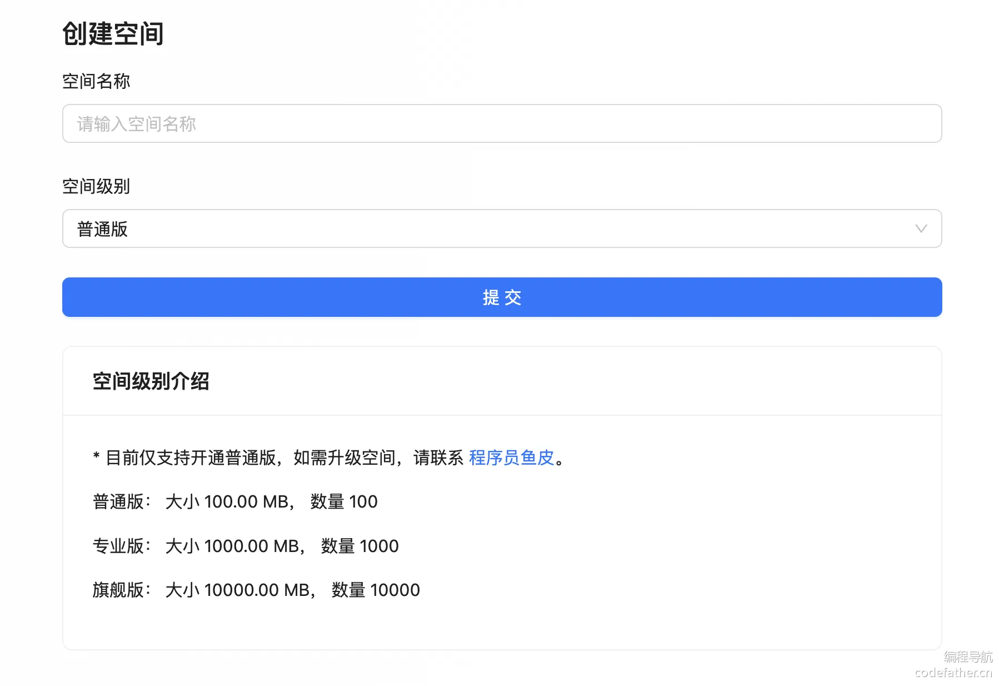

#### 4、更新空间页面

仅管理员可以更新空间，从空间管理页面可以跳转到编辑空间页面。由于编辑页面和创建页面都是表单项，结构一致，可以复用创建页面。

1）跟之前开发的上传图片页面类似，可以利用 url 的 querystring 传递要修改的 spaceId 参数，在页面中获取到已有空间数据并填充表单项。

```typescript
const route = useRoute()
const oldSpace = ref<API.SpaceVO>()

// 获取老数据
const getOldSpace = async () => {
  // 获取数据
  const id = route.query?.id
  if (id) {
    const res = await getSpaceVoByIdUsingGet({
      id: id,
    })
    if (res.data.code === 0 && res.data.data) {
      const data = res.data.data
      oldSpace.value = data
      formData.spaceName = data.spaceName
      formData.spaceLevel = data.spaceLevel
    }
  }
}

// 页面加载时，请求老数据
onMounted(() => {
  getOldSpace()
})
```

2）修改提交函数，根据是否有 spaceId 决定是调用更新接口还是创建接口：

```typescript
const handleSubmit = async (values: any) => {
  const spaceId = oldSpace.value?.id
  loading.value = true
  let res
  // 更新
  if (spaceId) {
    res = await updateSpaceUsingPost({
      id: spaceId,
      ...formData,
    })
  } else {
    // 创建
    res = await addSpaceUsingPost({
      ...formData,
    })
  }
  if (res.data.code === 0 && res.data.data) {
    message.success('操作成功')
    let path = `/space/${spaceId ?? res.data.data}`
    router.push({
      path,
    })
  } else {
    message.error('操作失败，' + res.data.message)
  }
  loading.value = false
}
```

#### 扩展

1）支持管理员填写空间大小、空间条数，从而实现类似 “资源扩容包” 的功能。

2）选择空间级别时自动填充空间大小、空间条数这两个表单项。

### 用户创建私有空间

现在已经有了创建空间的页面，只需要补充进入到该页面的入口即可。

#### 1、展示私有空间入口

预期效果是：左侧新增目录栏，展示 “公共图库” 和 “我的空间” 菜单项，点击 “我的空间” 后，如果没有创建过空间，则自动跳转到创建空间页面。

1）可以基于组件库的 [Layout Sider 组件](https://antdv.com/components/layout-cn#components-layout-demo-top-side-2) 实现 “顶部 - 侧边布局”：

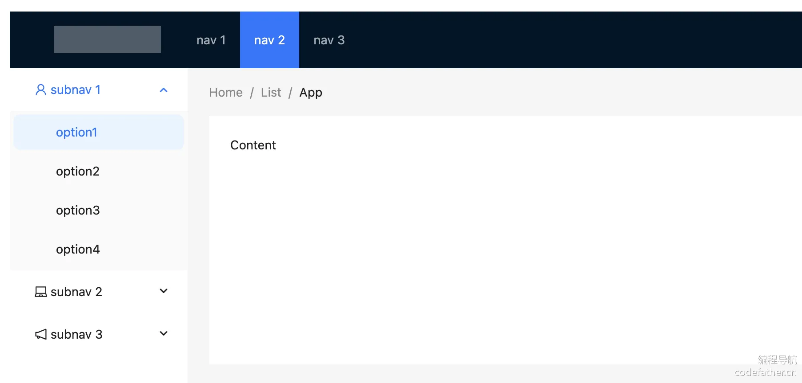

跟 GlobalHeader 全局顶部栏组件一样，我们单独封装一个 GlobalSider 全局侧边栏组件，在 Sider 组件内使用 [内嵌菜单组件](https://antdv.com/components/menu-cn#components-menu-demo-inline)，先利用 Demo 把页面结构撑起来：

```vue
<div id="globalSider">
  <a-layout-sider class="sider" width="200">
    <a-menu
      mode="inline"
      v-model:selectedKeys="current"
      :items="menuItems"
      @click="doMenuClick"
    />
  </a-layout-sider>
</div>
```

在 BasicLayout 全局布局中引入侧边栏组件：

```vue
<a-layout>
  <GlobalSider class="sider" />
  <a-layout-content class="content">
    <router-view />
  </a-layout-content>
</a-layout>
```

优化一下样式，隐藏多余的边框，下列代码仅展示了新增或修改的样式：

```css
#basicLayout .header {
  margin-bottom: 1px;
}

#basicLayout .content {
  padding: 28px;
}

#basicLayout .sider {
  background: #fff;
  padding-top: 20px;
  border-right: 0.5px solid #eee;
}

#basicLayout :deep(.ant-menu-root) {
  border-bottom: none !important;
  border-inline-end: none !important;
}
```

2）开发 GlobalSider 组件。跟 GlobalHeader 组件一样，需要定义菜单项、实现点击跳转、根据路由自动高亮。

```typescript
// 菜单列表
const menuItems = [
  {
    key: '/',
    label: '公共图库',
    icon: () => h(PictureOutlined),
  },
  {
    key: '/my_space',
    label: '我的空间',
    icon: () => h(UserOutlined),
  },
]

const router = useRouter()

// 当前选中菜单
const current = ref<string[]>([])
// 监听路由变化，更新当前选中菜单
router.afterEach((to, from, failure) => {
  current.value = [to.path]
})

// 路由跳转事件
const doMenuClick = ({ key }: { key: string }) => {
  router.push({
    path: key,
  })
}
```

3）优化侧边栏的展示

可以给组件增加条件判断，如果用户未登录，则不用显示侧边栏：

```vue
<a-layout-sider v-if="loginUserStore.loginUser.id" class="sider" width="200">
</a-layout-sider>
const loginUserStore = useLoginUserStore()
```

还可以使用 [响应式布局](https://antdv.com/components/layout-cn#components-layout-demo-responsive)，屏幕尺寸小于 `lg` 时，自动折叠侧边栏：

```vue
<a-layout-sider v-if="loginUserStore.loginUser.id" 
  class="sider"
  width="200" 
  breakpoint="lg"
  collapsed-width="0"
>
</a-layout-sider>
```

效果如图：


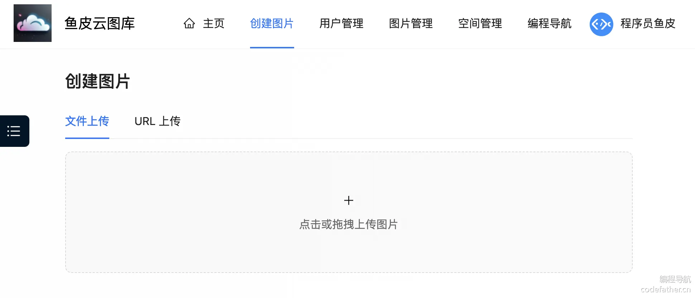

4）可以在 GlobalHeader 右边头像的下拉菜单中也添加 “我的空间” 跳转：

```vue
<a-menu-item>
  <router-link to="/my_space">
    <UserOutlined />
    我的空间
  </router-link>
</a-menu-item>
```

#### 2、我的空间页面

我的空间页面是一个 “中间页”，作用是根据用户是否已有空间，**重定向** 到对应的页面。

先梳理业务流程，跳转到该页面时：

- 用户未登录，则直接跳转到登录页面
- 如果用户已登录，会获取该用户已创建的空间
- 如果有，则进入第一个空间
- 如果没有，则跳转到创建空间页面

1）新建文件和路由：

```typescript
{
  path: '/my_space',
  name: '我的空间',
  component: MySpacePage,
},
```

2）编写页面：

```vue
<template>
  <div id="mySpace">
    <p>正在跳转，请稍候...</p>
  </div>
</template>

<script setup lang="ts">
import { onMounted } from 'vue'
import { useRouter } from 'vue-router'
import { listSpaceVoByPageUsingPost } from '@/api/spaceController'
import { message } from 'ant-design-vue'
import { useLoginUserStore } from '@/stores/useLoginUserStore'

const router = useRouter()
const loginUserStore = useLoginUserStore()

// 检查用户是否有个人空间
const checkUserSpace = async () => {
  const loginUser = loginUserStore.loginUser
  if (!loginUser?.id) {
    router.replace('/user/login')
    return
  }
  // 获取用户空间信息
  const res = await listSpaceVoByPageUsingPost({
    userId: loginUser.id,
    current: 1,
    pageSize: 1,
  })
  if (res.data.code === 0) {
    if (res.data.data?.records?.length > 0) {
      const space = res.data.data.records[0]
      router.replace(`/space/${space.id}`)
    } else {
      router.replace('/add_space')
      message.warn('请先创建空间')
    }
  } else {
    message.error('加载我的空间失败，' + res.data.message)
  }
}

// 在页面加载时检查用户空间
onMounted(() => {
  checkUserSpace()
})
</script>
```

上述代码的核心是 checkUserSpace 函数，在页面加载时会检查用户是否登录、是否已有空间，并使用 `router.replace` 重定向页面，这样点击浏览器的后退按钮时，不会回到中间页。

#### 扩展

参考 [组件库的 Demo](https://antdv.com/components/layout-cn#components-layout-demo-fixed-sider)，固定全局侧边栏和全局顶部栏：

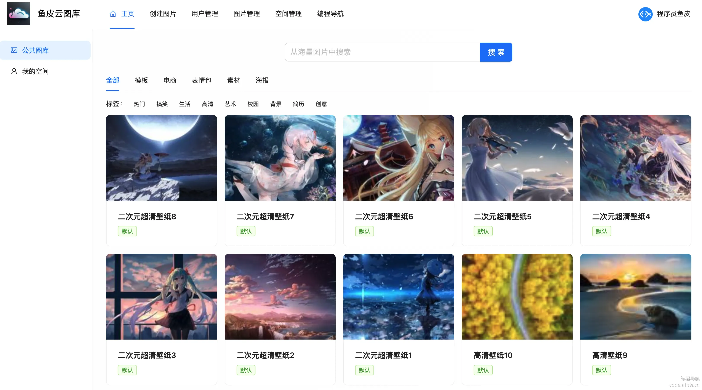

### 用户使用私有空间（空间详情页）

空间详情页主要是展示空间信息、并展示空间内的图片列表，其结构和公开图库的主页非常相似，可以复用组件。

#### 1、封装图片列表组件

先封装图片列表组件 PictureList，该组件只负责数据的展示、不负责数据的查询，因此要把分页组件单独拉出来。

1）开发图片列表组件，大多数的代码都是从主页复制来的，关键是定义属性，接受 dataList 数据列表和 loading 加载状态：

```vue
<template>
  <div class="picture-list">
    <!-- 图片列表 -->
    <a-list
      :grid="{ gutter: 16, xs: 1, sm: 2, md: 3, lg: 4, xl: 5, xxl: 6 }"
      :data-source="dataList"
      :loading="loading"
    >
      <template #renderItem="{ item: picture }">
        <a-list-item style="padding: 0">
          <!-- 单张图片 -->
          <a-card hoverable @click="doClickPicture(picture)">
            <template #cover>
              
            </template>
            <a-card-meta :title="picture.name">
              <template #description>
                <a-flex>
                  <a-tag color="green">
                    {{ picture.category ?? '默认' }}
                  </a-tag>
                  <a-tag v-for="tag in picture.tags" :key="tag">
                    {{ tag }}
                  </a-tag>
                </a-flex>
              </template>
            </a-card-meta>
          </a-card>
        </a-list-item>
      </template>
    </a-list>
  </div>
</template>

<script setup lang="ts">
import { useRouter } from 'vue-router'

interface Props {
  dataList?: API.PictureVO[]
  loading?: boolean
}

const props = withDefaults(defineProps<Props>(), {
  dataList: () => [],
  loading: false,
})

// 跳转至图片详情
const router = useRouter()
const doClickPicture = (picture) => {
  router.push({
    path: `/picture/${picture.id}`,
  })
}
</script>

<style scoped></style>
```

2）修改主页的图片列表代码，使用图片列表组件，并补充 [分页组件](https://antdv.com/components/pagination-cn)：

```vue
<!-- 图片列表 -->
<PictureList :dataList="dataList" :loading="loading" />
<a-pagination
  style="text-align: right"
  v-model:current="searchParams.current"
  v-model:pageSize="searchParams.pageSize"
  :total="total"
  @change="onPageChange"
/>
```

#### 2、开发空间详情页

该页面的结构是：空间信息 + 展示空间下的图片列表

1）新建 `SpaceDetailPage.vue` 和路由，跟图片详情页类似，路由要能接受动态参数，表示要加载的空间 id：

```typescript
{
  path: '/space/:id',
  name: '空间详情',
  component: SpaceDetailPage,
  props: true,
},
```

2）编写页面脚本，主要是获取空间详情数据和获取空间下的图片列表数据：

```typescript
const props = defineProps<{
  id: string | number
}>()
const space = ref<API.SpaceVO>({})

// 获取空间详情
const fetchSpaceDetail = async () => {
  try {
    const res = await getSpaceVoByIdUsingGet({
      id: props.id,
    })
    if (res.data.code === 0 && res.data.data) {
      space.value = res.data.data
    } else {
      message.error('获取空间详情失败，' + res.data.message)
    }
  } catch (e: any) {
    message.error('获取空间详情失败：' + e.message)
  }
}

onMounted(() => {
  fetchSpaceDetail()
})

// 数据
const dataList = ref([])
const total = ref(0)
const loading = ref(true)

// 搜索条件
const searchParams = reactive<API.PictureQueryRequest>({
  current: 1,
  pageSize: 12,
  sortField: 'createTime',
  sortOrder: 'descend',
})

// 分页参数
const onPageChange = (page, pageSize) => {
  searchParams.current = page
  searchParams.pageSize = pageSize
  fetchData()
}

// 获取数据
const fetchData = async () => {
  loading.value = true
  // 转换搜索参数
  const params = {
    spaceId: props.id,
    ...searchParams,
  }
  const res = await listPictureVoByPageUsingPost(params)
  if (res.data.data) {
    dataList.value = res.data.data.records ?? []
    total.value = res.data.data.total ?? 0
  } else {
    message.error('获取数据失败，' + res.data.message)
  }
  loading.value = false
}

// 页面加载时请求一次
onMounted(() => {
  fetchData()
})
```

3）开发空间信息展示栏，展示空间名称，并使用 [进度条组件](https://antdv.com/components/progress-cn/#components-progress-demo-circle-mini) 展示空间限额：

```vue
<!-- 空间信息 -->
<a-flex justify="space-between">
  <h2>{{ space.spaceName }}（私有空间）</h2>
  <a-space size="middle">
    <a-button type="primary" :href="`/add_picture?spaceId=${id}`" target="_blank">
      + 创建图片
    </a-button>
    <a-tooltip
      :title="`占用空间 ${formatSize(space.totalSize)} / ${formatSize(space.maxSize)}`"
    >
      <a-progress
        type="circle"
        :percent="((space.totalSize * 100) / space.maxSize).toFixed(1)"
        :size="42"
      />
    </a-tooltip>
  </a-space>
</a-flex>
```

4）开发图片列表和分页，直接使用已封装的组件：

```vue
<!-- 图片列表 -->
<PictureList :dataList="dataList" :loading="loading" />
<a-pagination
  style="text-align: right"
  v-model:current="searchParams.current"
  v-model:pageSize="searchParams.pageSize"
  :total="total"
  :show-total="() => `图片总数 ${total} / ${space.maxCount}`"
  @change="onPageChange"
/>
```

在分页组件中，我们要展示图片总数和最大数量，让用户知晓。

效果如图：


已经能够查看私有空间详情了，我们再依次开发对空间内图片的 “增删改查” 操作。

#### 3、上传图片到私有空间

1）修改创建图片页面，支持通过 url 查询参数中的 spaceId 传参，在页面中可以获取到 spaceId：

```typescript
// 空间 id
const spaceId = computed(() => {
  return route.query?.spaceId
})
```

2）提交时，补充 spaceId 参数：

```typescript
const res = await editPictureUsingPost({
  id: pictureId,
  spaceId: spaceId.value,
  ...values,
})
```

3）在页面中展示当前的 spaceId：

```vue
<a-typography-paragraph v-if="spaceId" type="secondary">
  保存至空间：<a :href="`/space/${spaceId}`" target="_blank">{{ spaceId }}</a>
</a-typography-paragraph>
```

4）修改图片上传组件**（包括本地文件上传和 URL 上传）**，支持上传时传递 spaceId：

```typescript
interface Props {
  picture?: API.PictureVO
  spaceId?: number
  onSuccess?: (newPicture: API.PictureVO) => void
}

// 上传时传递 spaceId
const params: API.PictureUploadRequest = props.picture ? { id: props.picture.id } : {}
params.spaceId = props.spaceId;
const res = await uploadPictureUsingPost(params, {}, file)
```

效果如图：

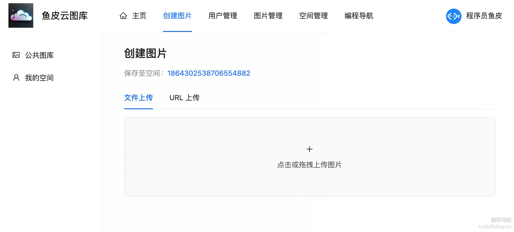

#### 4、图片组件增加快捷操作

可以给空间详情页的图片卡片的下方增加快捷操作栏，提高管理效率，参考 [卡片组件示例](https://antdv.com/components/card-cn#components-card-demo-meta)。

1）修改图片列表组件，补充操作栏。

```vue
<template #actions>
  <a-space @click="e => doEdit(picture, e)">
    <edit-outlined />
    编辑
  </a-space>
  <a-space @click="e => doDelete(picture, e)">
    <delete-outlined />
    删除
  </a-space>
</template>
```

2）由于该组件是主页和空间详情页公用的，主页不需要展示操作栏、私有空间才展示，所以需要使用 showOp 属性来控制：

```typescript
interface Props {
  dataList?: API.PictureVO[]
  loading?: boolean
  showOp?: boolean
}

const props = withDefaults(defineProps<Props>(), {
  dataList: () => [],
  loading: false,
  showOp: false,
})
```

页面结构增加条件：

```vue
<template v-if="showOp" #actions>
</template>
```

3）补充编辑和删除函数，doEdit、doDelete 的代码可以直接从图片详情页复制过来，但是需要用 `e.stopPropagation` 阻止事件传播，否则会同时触发卡片点击事件，跳转到图片详情页。

```typescript
// 编辑
const doEdit = (picture, e) => {
  e.stopPropagation()
  router.push({
    path: '/add_picture',
    query: {
      id: picture.id,
      spaceId: picture.spaceId,
    },
  })
}

// 删除
const doDelete = async (picture, e) => {
  e.stopPropagation()
  const id = picture.id
  if (!id) {
    return
  }
  const res = await deletePictureUsingPost({ id })
  if (res.data.code === 0) {
    message.success('删除成功')
    // 让外层刷新
    props?.onReload()
  } else {
    message.error('删除失败')
  }
}
```

4）注意，删除图片之后，可以 reload 重新触发数据的加载。给图片列表组件增加 onReload 属性：

```typescript
interface Props {
  dataList?: API.PictureVO[]
  loading?: boolean
  showOp?: boolean
  onReload?: () => void
}
```

空间详情页传递属性：

```vue
<!-- 图片列表 -->
<PictureList :dataList="dataList"
  :loading="loading"
  showOp 
  :onReload="fetchData"
/>
```

效果如图：


#### 5、查看私有空间的图片

直接复用图片详情页 + 后端接口的权限校验，就已经实现了，无需开发。

#### 6、编辑私有空间的图片

之前我们已经完成了更新图片页面的开发（其实是复用了图片创建页）。从空间详情页或图片详情页进入图片创建页时，只要给 url 查询参数携带 spaceId，图片创建页就能自动识别出 spaceId 并将图片保存到空间。

修改图片详情页的编辑图片函数，跳转页面时携带 spaceId：

```typescript
// 编辑
const doEdit = () => {
  router.push({
    path: '/add_picture',
    query: {
      id: picture.value.id,
      spaceId: picture.value.spaceId
    }
  })
}
```

效果如图：

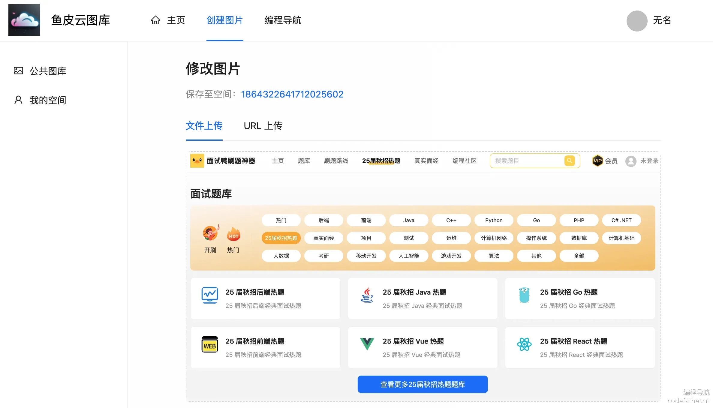

#### 7、删除私有空间的图片

通过后端接口已经实现了权限校验逻辑，无需前端开发。

#### 8、私有图片的权限控制

大多数权限校验已经通过后端实现，比如主页不传 spaceId 默认就查的是公共图库，无需修改前端代码；访问图片详情页时，也会通过后端进行权限校验。

但图片管理页面由于调用的是仅管理员可用的获取图片列表接口（listPictureByPage），看到的是全部的图片，其实只需要看公共空间的进行审核，可以给查询条件增加参数 `nullSpaceId: true`：

```typescript
const res = await listPictureByPageUsingPost({
  ...searchParams,
  nullSpaceId: true,
})
```

测试空间详情页、图片详情页没有权限的情况，效果如图：

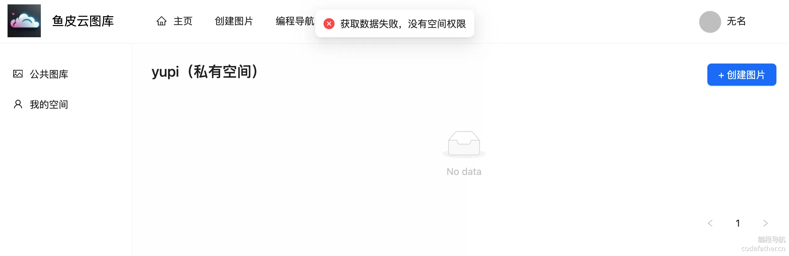

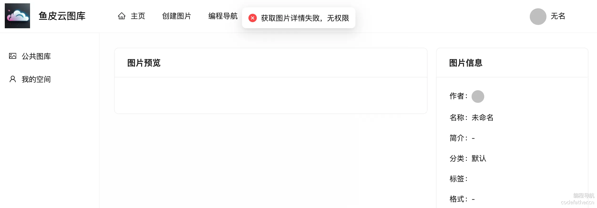

#### 扩展

1）空间详情页增加空间标志的展示，比如尊贵的旗舰版展示个钻石 💎。

2）在空间内上传图片时可以使用弹窗组件，而不是打开新页面，更轻量。

3）上传图片到空间时，上传页面可以展示出空间名称、容量等信息，并且前端也可以判断是否具有权限，优化用户体验。

4）除了图片列表组件外，还可以封装单个图片的组件，复用更灵活。

5）图片详情页、空间详情页前端增加权限判断逻辑，相比单纯靠后端进行权限校验，可以给用户更好的体验。


# 8 - 图片功能扩展

## 本节重点

为了吸引用户使用我们平台的私有空间作为个人相册，需要提供更多功能。

本节我们重点对图片功能进行扩展，包括：

- 图片搜索
- 基础属性搜索
- 以图搜图
- 颜色搜索
- 图片分享
- 链接分享
- 扫码分享
- 图片批量管理
- 批量修改信息
- 批量重命名

有了这些功能，用户能够更高效地管理和分享平台上的图片资源，进一步提升使用体验。

## 一、图片搜索 - 基础属性搜索

### 需求分析

我们可以提供多种搜索维度，帮用户更快地找到自己空间的图片。

将搜索维度按优先级进行排序，优先级高的会展示在靠前的位置：

- 关键词：同时搜索名称和简介
- 标签
- 分类
- 编辑时间（开始时间与结束时间）
- 图片名称
- 图片简介
- 图片宽度
- 图片高度
- 图片格式

### 方案设计

后端可以直接复用原有的分页获取图片列表接口，并在此基础上增加相应的搜索条件，以支持更灵活的筛选。

前端可以针对不同类型的搜索维度选用特定的表单项组件，来提高搜索的体验。

- 关键词：文本输入框
- 标签：下拉选择框
- 分类：下拉选择框
- 编辑时间：日期选择器
- 图片名称：文本输入框
- 图片简介：文本输入框
- 图片宽度：数字输入框
- 图片高度：数字输入框
- 图片格式：文本输入框 / 下拉选择框

参考其他网站，日期的选择最好能够提供预设的时间范围：


### 后端开发

其他的搜索条件基本都已经有了，还需要支持按照编辑时间搜索。

1）为了支持按编辑时间进行搜索，需要在请求类 PictureQueryRequest 中添加开始和结束编辑时间字段：

```java
/**
 * 开始编辑时间
 */
private Date startEditTime;

/**
 * 结束编辑时间
 */
private Date endEditTime;
```

2）更新图片服务的 getQueryWrapper 方法

在处理查询时，补充按编辑时间筛选的逻辑：

```java
Date startEditTime = pictureQueryRequest.getStartEditTime();
Date endEditTime = pictureQueryRequest.getEndEditTime();
queryWrapper.ge(ObjUtil.isNotEmpty(startEditTime), "editTime", startEditTime);
queryWrapper.lt(ObjUtil.isNotEmpty(endEditTime), "editTime", endEditTime);
```

### 前端开发

#### 1、图片搜索表单组件

由于空间详情页的代码量较大，我们可以将所有图片搜索逻辑单独封装为图片搜索表单组件 `PictureSearchForm.vue`。为提高效率，该组件可以从图片管理页面的搜索表单复制而来。

注意，该组件仅负责修改搜索条件，不负责数据获取与存储。

1）定义组件属性：

```typescript
interface Props {
  onSearch?: (searchParams: PictureQueryRequest) => void
}

const props = defineProps<Props>()
```

2）编写搜索条件和搜索函数：使用 `reactive` 变量存储搜索条件，并触发父组件的 `onSearch` 方法。

```typescript
// 搜索条件
const searchParams = reactive<API.PictureQueryRequest>({})

// 获取数据
const doSearch = () => {
  props.onSearch?.(searchParams)
}
```

3）开发页面结构

其中：

- 日期表单项使用 Ant Design 的 [日期选择器组件](https://antdv.com/components/date-picker-cn#components-date-picker-demo-presetted-ranges)，支持预设的日期范围选项（比如过去一周）
- 宽度 / 高度表单项使用 [数字输入框组件](https://antdv.com/components/input-number-cn)

代码如下：

```vue
<div class="picture-search-form">
  <!-- 搜索表单 -->
  <a-form layout="inline" :model="searchParams" @finish="doSearch">
    <a-form-item label="关键词" name="searchText">
      <a-input
        v-model:value="searchParams.searchText"
        placeholder="从名称和简介搜索"
        allow-clear
      />
    </a-form-item>
    <a-form-item label="分类" name="category">
      <a-auto-complete
        v-model:value="searchParams.category"
        style="min-width: 180px"
        :options="categoryOptions"
        placeholder="请输入分类"
        allowClear
      />
    </a-form-item>
    <a-form-item label="标签" name="tags">
      <a-select
        v-model:value="searchParams.tags"
        style="min-width: 180px"
        :options="tagOptions"
        mode="tags"
        placeholder="请输入标签"
        allowClear
      />
    </a-form-item>
    <a-form-item label="日期" name="">
      <a-range-picker
        style="width: 400px"
        show-time
        v-model:value="dateRange"
        :placeholder="['编辑开始日期', '编辑结束时间']"
        format="YYYY/MM/DD HH:mm:ss"
        :presets="rangePresets"
        @change="onRangeChange"
      />
    </a-form-item>
    <a-form-item label="名称" name="name">
      <a-input v-model:value="searchParams.name" placeholder="请输入名称" allow-clear />
    </a-form-item>
    <a-form-item label="简介" name="introduction">
      <a-input v-model:value="searchParams.introduction" placeholder="请输入简介" allow-clear />
    </a-form-item>
    <a-form-item label="宽度" name="picWidth">
      <a-input-number v-model:value="searchParams.picWidth" />
    </a-form-item>
    <a-form-item label="高度" name="picHeight">
      <a-input-number v-model:value="searchParams.picHeight" />
    </a-form-item>
    <a-form-item label="格式" name="picFormat">
      <a-input v-model:value="searchParams.picFormat" placeholder="请输入格式" allow-clear />
    </a-form-item>
    <a-form-item>
      <a-button type="primary" html-type="submit" style="width: 96px">搜索</a-button>
    </a-form-item>
  </a-form>
</div>
```

日期表单项所需的变量：

```typescript
const dateRange = ref<[]>([])

/**
 * 日期范围更改时触发
 * @param dates
 * @param dateStrings
 */
const onRangeChange = (dates: any[], dateStrings: string[]) => {
  if (dates.length < 2) {
    searchParams.startEditTime = undefined
    searchParams.endEditTime = undefined
  } else {
    searchParams.startEditTime = dates[0].toDate()
    searchParams.endEditTime = dates[1].toDate()
  }
}

const rangePresets = ref([
  { label: '过去 7 天', value: [dayjs().add(-7, 'd'), dayjs()] },
  { label: '过去 14 天', value: [dayjs().add(-14, 'd'), dayjs()] },
  { label: '过去 30 天', value: [dayjs().add(-30, 'd'), dayjs()] },
  { label: '过去 90 天', value: [dayjs().add(-90, 'd'), dayjs()] },
])
```

4）获取分类和标签表单项的默认选项列表，这段代码可以直接复用创建图片页面的：

```typescript
const categoryOptions = ref<string[]>([])
const tagOptions = ref<string[]>([])

// 获取标签和分类选项
const getTagCategoryOptions = async () => {
  const res = await listPictureTagCategoryUsingGet()
  if (res.data.code === 0 && res.data.data) {
    // 转换成下拉选项组件接受的格式
    tagOptions.value = (res.data.data.tagList ?? []).map((data: string) => {
      return {
        value: data,
        label: data,
      }
    })
    categoryOptions.value = (res.data.data.categoryList ?? []).map((data: string) => {
      return {
        value: data,
        label: data,
      }
    })
  } else {
    message.error('加载选项失败，' + res.data.message)
  }
}

onMounted(() => {
  getTagCategoryOptions()
})
```

5）空间详情页使用组件：

```vue
<!-- 搜索表单 -->
<PictureSearchForm />
```

浏览效果，目前表单项都挤在一起，不太好看：


可以添加 CSS 样式，增加上边距：

```css
.picture-search-form .ant-form-item {
  margin-top: 16px;
}
```

6）由于数字输入框的值无法直接通过 allow-clear 清理，所以给表单增加一个重置按钮。

页面代码：

```vue
<a-form-item>
  <a-space>
    <a-button type="primary" html-type="submit" style="width: 96px">搜索</a-button>
    <a-button html-type="reset" @click="doClear">重置</a-button>
  </a-space>
</a-form-item>
```

需要编写一个重置函数，将所有搜索条件的值清空。由于我们使用了 `reactive` 响应式变量，无法直接整体赋值为一个空对象，而是需要将其中的字段全部设置为空。此外，不要忘了日期组件的值也需要重置为空数组。

```typescript
// 清理
const doClear = () => {
  // 取消所有对象的值
  Object.keys(searchParams).forEach((key) => {
    searchParams[key] = undefined
  })
  dateRange.value = []
  props.onSearch?.(searchParams)
}
```

💡 学前端的同学可以去了解下 [lodash 工具库](https://lodash.com/)，类似后端的 HuTool，提供了很多快捷操作对象的函数。

效果如图:

 #### 2、执行搜索

1）给组件传递 onSearch 搜索函数：

```vue
<!-- 搜索表单 -->
<PictureSearchForm :onSearch="onSearch" />
```

2）编写搜索函数

由于搜索参数可能被重置，为了方便，将 searchParams 从 reactive 变量改为 ref 变量，这样可以整体给 searchParams 赋值为空的对象。

要修改的代码如下：

```typescript
// 搜索条件
const searchParams = ref<API.PictureQueryRequest>({
  current: 1,
  pageSize: 12,
  sortField: 'createTime',
  sortOrder: 'descend',
})

// 分页参数
const onPageChange = (page, pageSize) => {
  searchParams.value.current = page
  searchParams.value.pageSize = pageSize
  fetchData()
}

// 搜索
const onSearch = (newSearchParams: API.PictureQueryRequest) => {
  searchParams.value = {
    ...searchParams.value,
    ...newSearchParams,
    current: 1,
  }
  fetchData()
}

// 获取数据
const fetchData = async () => {
  loading.value = true
  // 转换搜索参数
  const params = {
    spaceId: props.id,
    ...searchParams.value,
  }
  const res = await listPictureVoByPageUsingPost(params)
  if (res.data.data) {
    dataList.value = res.data.data.records ?? []
    total.value = res.data.data.total ?? 0
  } else {
    message.error('获取数据失败，' + res.data.message)
  }
  loading.value = false
}
```

### 扩展

1、图片尺寸搜索优化

按照图片的尺寸提供几个预设选项，如“小”、“中”、“大”和“特大”。每个选项对应一个最大宽度和最大高度，用户只需选择对应的尺寸，系统即可自动进行匹配和过滤。


2、图片格式选择

为了方便用户筛选不同格式的图片，前端可以提供常见的图片格式下拉选项，如 JPG、PNG、GIF 等。

3、基础搜索与详细搜索的切换

前端可以支持基础搜索和详细搜索的功能。通过使用 [折叠组件](https://antdv.com/components/collapse-cn#components-collapse-demo-borderless)，用户可以在基础搜索框中快速输入常见的搜索条件（如关键词、分类和标签）；点击展开后可以显示更多详细的搜索条件（比如图片宽度和格式）。这样既保留了简单快捷的搜索体验，又不失灵活性。

## 二、图片搜索 - 以图搜图

### 需求分析

用户可以使用一张图片来搜索相似的图片，相比传统的关键词搜索，能够更精确地找到与上传图片内容相似的图片。

为了获得更多的搜索结果，我们的需求是从 **全网搜索图片**，而不是只在自己的图库中搜索。

注意，该功能不用局限于私有空间，公共图库也可以使用。

### 方案设计

主要有 2 种方案：第三方 API 以及数据抓取（爬虫）

#### 1、第三方 API

如果想从自建的图库中搜索：可以使用百度 AI 提供的图片搜索 API，[参考官方文档](https://ai.baidu.com/tech/imagesearch/)

Bing 以图搜图 API： 利用必应的图库，可以从全网进行搜索，而且可以免费使用，[参考官方文档](https://learn.microsoft.com/en-us/bing/search-apis/bing-image-search/quickstarts/rest/java)

#### 2、数据抓取

利用已有的以图搜图网站，通过数据抓取的方式实时查询搜图网站的返回结果。

为了让大家学习到更多知识，此处我们选择这种方案。

以百度搜图网站为例，我们可以先体验一遍流程，并且对接口进行分析：

1）进到百度图片搜索，通过 url 上传图片，发现接口：https://graph.baidu.com/upload?uptime= ，该接口的返回值为 “以图搜图的页面地址”

2）访问上一步得到的 [页面地址](https://graph.baidu.com/s?card_key=&entrance=GENERAL&extUiData[isLogoShow]=1&f=all&isLogoShow=1&session_id=16250747570487381669&sign=1265ce97cd54acd88139901733452612&tpl_from=pc)，可以在返回值中找到 firstUrl：


3）访问 [firstUrl](https://graph.baidu.com/ajax/pcsimi?carousel=503&entrance=GENERAL&extUiData[isLogoShow]=1&inspire=general_pc&limit=30&next=2&render_type=card&session_id=16250747570487381669&sign=1265ce97cd54acd88139901733452612&tk=4caaa&tpl_from=pc)，就能得到 JSON 格式的相似图片列表，里面包含了图片的缩略图和原图地址：


💡 友情提示，这种方式只适合学习使用！注意不要给目标网站带来压力！！否则后果自负！！！

### 后端开发

新建 `api` 包，由于项目可能会用到多个 api，可以将每个 api 都放在 api 目录下的一个包中。比如图片搜索 api 的相关代码，全部放在 `api.imagesearch` 包下。

#### 1、数据模型开发

在 `imagesearch.model` 包中，新建一个图片搜索结果类，用于接受 API 的返回值：

```java
@Data
public class ImageSearchResult {

    /**
     * 缩略图地址
     */
    private String thumbUrl;

    /**
     * 来源地址
     */
    private String fromUrl;
}
```

#### 2、API 开发

根据方案，我们要调用多个 API，每个子 API 可以作为一个静态类来实现，统一放在 `imagesearch.sub` 包中，并且每个类都包含一个 `main` 方法，用于进行本地测试。

1）获取以图搜图的页面地址

通过向百度发送 POST 请求，获取给定图片 URL 的相似图片页面地址。

```java
@Slf4j
public class GetImagePageUrlApi {

    /**
     * 获取图片页面地址
     *
     * @param imageUrl
     * @return
     */
    public static String getImagePageUrl(String imageUrl) {
        // 1. 准备请求参数
        Map<String, Object> formData = new HashMap<>();
        formData.put("image", imageUrl);
        formData.put("tn", "pc");
        formData.put("from", "pc");
        formData.put("image_source", "PC_UPLOAD_URL");
        // 获取当前时间戳
        long uptime = System.currentTimeMillis();
        // 请求地址
        String url = "https://graph.baidu.com/upload?uptime=" + uptime;

        try {
            // 2. 发送 POST 请求到百度接口
            HttpResponse response = HttpRequest.post(url)
                    .form(formData)
                    .timeout(5000)
                    .execute();
            // 判断响应状态
            if (HttpStatus.HTTP_OK != response.getStatus()) {
                throw new BusinessException(ErrorCode.OPERATION_ERROR, "接口调用失败");
            }
            // 解析响应
            String responseBody = response.body();
            Map<String, Object> result = JSONUtil.toBean(responseBody, Map.class);

            // 3. 处理响应结果
            if (result == null || !Integer.valueOf(0).equals(result.get("status"))) {
                throw new BusinessException(ErrorCode.OPERATION_ERROR, "接口调用失败");
            }
            Map<String, Object> data = (Map<String, Object>) result.get("data");
            String rawUrl = (String) data.get("url");
            // 对 URL 进行解码
            String searchResultUrl = URLUtil.decode(rawUrl, StandardCharsets.UTF_8);
            // 如果 URL 为空
            if (searchResultUrl == null) {
                throw new BusinessException(ErrorCode.OPERATION_ERROR, "未返回有效结果");
            }
            return searchResultUrl;
        } catch (Exception e) {
            log.error("搜索失败", e);
            throw new BusinessException(ErrorCode.OPERATION_ERROR, "搜索失败");
        }
    }

    public static void main(String[] args) {
        // 测试以图搜图功能
        String imageUrl = "https://www.codefather.cn/logo.png";
        String result = getImagePageUrl(imageUrl);
        System.out.println("搜索成功，结果 URL：" + result);
    }
}
```

2）获取图片列表页面地址

通过 jsoup 爬取 HTML 页面，提取其中包含 `firstUrl` 的 JavaScript 脚本，并返回图片列表的页面地址。

```java
@Slf4j
public class GetImageFirstUrlApi {

    /**
     * 获取图片列表页面地址
     *
     * @param url
     * @return
     */
    public static String getImageFirstUrl(String url) {
        try {
            // 使用 Jsoup 获取 HTML 内容
            Document document = Jsoup.connect(url)
                    .timeout(5000)
                    .get();

            // 获取所有 <script> 标签
            Elements scriptElements = document.getElementsByTag("script");

            // 遍历找到包含 `firstUrl` 的脚本内容
            for (Element script : scriptElements) {
                String scriptContent = script.html();
                if (scriptContent.contains("\"firstUrl\"")) {
                    // 正则表达式提取 firstUrl 的值
                    Pattern pattern = Pattern.compile("\"firstUrl\"\\s*:\\s*\"(.*?)\"");
                    Matcher matcher = pattern.matcher(scriptContent);
                    if (matcher.find()) {
                        String firstUrl = matcher.group(1);
                        // 处理转义字符
                        firstUrl = firstUrl.replace("\\/", "/");
                        return firstUrl;
                    }
                }
            }

            throw new BusinessException(ErrorCode.OPERATION_ERROR, "未找到 url");
        } catch (Exception e) {
            log.error("搜索失败", e);
            throw new BusinessException(ErrorCode.OPERATION_ERROR, "搜索失败");
        }
    }

    public static void main(String[] args) {
        // 请求目标 URL
        String url = "https://graph.baidu.com/s?card_key=&entrance=GENERAL&extUiData[isLogoShow]=1&f=all&isLogoShow=1&session_id=16250747570487381669&sign=1265ce97cd54acd88139901733452612&tpl_from=pc";
        String imageFirstUrl = getImageFirstUrl(url);
        System.out.println("搜索成功，结果 URL：" + imageFirstUrl);
    }
}
```

3）获取图片列表

通过调用百度接口返回的 JSON 数据，提取出其中的图片列表并返回。

```java
@Slf4j
public class GetImageListApi {

    /**
     * 获取图片列表
     *
     * @param url
     * @return
     */
    public static List<ImageSearchResult> getImageList(String url) {
        try {
            // 发起GET请求
            HttpResponse response = HttpUtil.createGet(url).execute();

            // 获取响应内容
            int statusCode = response.getStatus();
            String body = response.body();

            // 处理响应
            if (statusCode == 200) {
                // 解析 JSON 数据并处理
                return processResponse(body);
            } else {
                throw new BusinessException(ErrorCode.OPERATION_ERROR, "接口调用失败");
            }
        } catch (Exception e) {
            log.error("获取图片列表失败", e);
            throw new BusinessException(ErrorCode.OPERATION_ERROR, "获取图片列表失败");
        }
    }

    /**
     * 处理接口响应内容
     *
     * @param responseBody 接口返回的JSON字符串
     */
    private static List<ImageSearchResult> processResponse(String responseBody) {
        // 解析响应对象
        JSONObject jsonObject = new JSONObject(responseBody);
        if (!jsonObject.containsKey("data")) {
            throw new BusinessException(ErrorCode.OPERATION_ERROR, "未获取到图片列表");
        }
        JSONObject data = jsonObject.getJSONObject("data");
        if (!data.containsKey("list")) {
            throw new BusinessException(ErrorCode.OPERATION_ERROR, "未获取到图片列表");
        }
        JSONArray list = data.getJSONArray("list");
        return JSONUtil.toList(list, ImageSearchResult.class);
    }

    public static void main(String[] args) {
        String url = "https://graph.baidu.com/ajax/pcsimi?carousel=503&entrance=GENERAL&extUiData%5BisLogoShow%5D=1&inspire=general_pc&limit=30&next=2&render_type=card&session_id=16250747570487381669&sign=1265ce97cd54acd88139901733452612&tk=4caaa&tpl_from=pc";
        List<ImageSearchResult> imageList = getImageList(url);
        System.out.println("搜索成功" + imageList);
    }
}
```

#### 3、图片搜索服务（门面模式）

这里我们运用一种设计模式来提供图片搜索服务。门面模式通过提供一个统一的接口来简化多个接口的调用，使得客户端不需要关注内部的具体实现。

我们可以将多个 API 整合到一个门面类中，简化调用过程。在 `imagesearch` 包下新建门面类，整合几个接口的调用：

```java
@Slf4j
public class ImageSearchApiFacade {

    /**
     * 搜索图片
     *
     * @param imageUrl
     * @return
     */
    public static List<ImageSearchResult> searchImage(String imageUrl) {
        String imagePageUrl = GetImagePageUrlApi.getImagePageUrl(imageUrl);
        String imageFirstUrl = GetImageFirstUrlApi.getImageFirstUrl(imagePageUrl);
        List<ImageSearchResult> imageList = GetImageListApi.getImageList(imageFirstUrl);
        return imageList;
    }

    public static void main(String[] args) {
        // 测试以图搜图功能
        String imageUrl = "https://www.codefather.cn/logo.png";
        List<ImageSearchResult> resultList = searchImage(imageUrl);
        System.out.println("结果列表" + resultList);
    }
}
```

#### 4、接口开发

开发请求类：

```java
@Data
public class SearchPictureByPictureRequest implements Serializable {

    /**
     * 图片 id
     */
    private Long pictureId;

    private static final long serialVersionUID = 1L;
}
```

开发接口：

```java
/**
 * 以图搜图
 */
@PostMapping("/search/picture")
public BaseResponse<List<ImageSearchResult>> searchPictureByPicture(@RequestBody SearchPictureByPictureRequest searchPictureByPictureRequest) {
    ThrowUtils.throwIf(searchPictureByPictureRequest == null, ErrorCode.PARAMS_ERROR);
    Long pictureId = searchPictureByPictureRequest.getPictureId();
    ThrowUtils.throwIf(pictureId == null || pictureId <= 0, ErrorCode.PARAMS_ERROR);
    Picture oldPicture = pictureService.getById(pictureId);
    ThrowUtils.throwIf(oldPicture == null, ErrorCode.NOT_FOUND_ERROR);
    List<ImageSearchResult> resultList = ImageSearchApiFacade.searchImage(oldPicture.getUrl());
    return ResultUtils.success(resultList);
}
```

### 前端开发

#### 1、搜索入口

1）修改图片列表页面的代码，给图片操作栏增加一个搜索按钮：

```vue
<template v-if="showOp" #actions>
  <a-space @click="(e) => doSearch(picture, e)">
    <search-outlined />
    搜索
  </a-space>
  <a-space @click="(e) => doEdit(picture, e)">
    <edit-outlined />
    编辑
  </a-space>
  <a-space @click="(e) => doDelete(picture, e)">
    <delete-outlined />
    删除
  </a-space>
</template>
```

效果如图：


2）点击搜索后打开新页面，进入到以图搜图结果页：

```typescript
// 搜索
const doSearch = (picture, e) => {
  e.stopPropagation()
  window.open(`/search_picture?pictureId=${picture.id}`)
}
```

#### 2、以图搜图结果页面

1）新建图片搜索页面文件 `SearchPicturePage.vue`。可以复制创建图片页面，这样可以复用获取 url 查询参数并查询老数据的逻辑。

添加路由：

```typescript
{
  path: '/search_picture',
  name: '图片搜索',
  component: SearchPicturePage,
}
```

2）开发页面，上方展示页面标题和原始图片，下方展示搜索结果图片列表。可以参考图片列表组件来展示图片列表：

```vue
<template>
  <div id="searchPicturePage">
    <h2 style="margin-bottom: 16px">以图搜图</h2>
    <h3 style="margin: 16px 0">原图</h3>
    <a-card style="width: 240px">
      <template #cover>
        
      </template>
    </a-card>
    <h3 style="margin: 16px 0">识图结果</h3>
    <!-- 图片列表 -->
    <a-list
      :grid="{ gutter: 16, xs: 1, sm: 2, md: 3, lg: 4, xl: 5, xxl: 6 }"
      :data-source="dataList"
    >
      <template #renderItem="{ item }">
        <a-list-item style="padding: 0">
          <a :href="item.fromUrl" target="_blank">
            <a-card>
              <template #cover>
                
              </template>
            </a-card>
          </a>
        </a-list-item>
      </template>
    </a-list>
  </div>
</template>

<script setup lang="ts">
import { computed, onMounted, ref } from 'vue'
import { useRoute } from 'vue-router'
import { getPictureVoByIdUsingGet, searchPictureByPictureUsingPost } from '@/api/pictureController'
import { message } from 'ant-design-vue'

const route = useRoute()

// 图片 id
const pictureId = computed(() => {
  return route.query?.pictureId
})

const picture = ref<API.PictureVO>({})

// 获取老数据
const getOldPicture = async () => {
  // 获取数据
  const id = route.query?.pictureId
  if (id) {
    const res = await getPictureVoByIdUsingGet({
      id: id,
    })
    if (res.data.code === 0 && res.data.data) {
      const data = res.data.data
      picture.value = data
    }
  }
}

onMounted(() => {
  getOldPicture()
})
</script>
```

3）获取图片搜索结果：

```typescript
const dataList = ref<API.ImageSearchResult[]>([])
// 获取搜图结果
const fetchData = async () => {
  const res = await searchPictureByPictureUsingPost({
    pictureId: pictureId.value,
  })
  if (res.data.code === 0 && res.data.data) {
    dataList.value = res.data.data ?? []
  } else {
    message.error('获取数据失败，' + res.data.message)
  }
}

// 页面加载时请求一次
onMounted(() => {
  fetchData()
})
```

### 测试

经过测试发现，百度搜索对于 webp 格式图片的支持度并不好（改文件的后缀也没有用），估计是平台不支持该格式的算法。


但是使用 png 图片去测试，就能正常看到结果了：


### 扩展

**解决 webp 格式图片无法搜索的问题**

如果想解决上述问题，有几种方案：

1. 直接在前端拿到识图结果 URL 后，直接新页面打开，而不是把识图结果放到自己的网站页面中
2. 切换为其他识图接口，比如 [Bing 以图搜图 API](https://learn.microsoft.com/en-us/bing/search-apis/bing-image-search/quickstarts/rest/java)
3. 将本项目的图片以 PNG 格式进行压缩

## 三、图片搜索 - 颜色搜索

### 需求分析

能够按照颜色搜索空间内 **主色调** 最相似的图片，在设计、创意和电商领域有广泛应用。

参考其他网站的颜色搜图效果：


此处我们将该功能限定在空间内使用，主要是考虑到公共图库的图片数量可能非常庞大，直接进行颜色匹配会导致搜索速度较慢，影响用户体验。

### 方案设计

需要思考几个问题：

1. 整体业务流程
2. 怎么获取图片主色调？
3. 怎么设计搜索算法？

#### 1、整体流程

为了提升性能，避免每次搜索都实时计算图片主色调，建议在图片上传成功后立即提取主色调并存储到数据库的独立字段中。

完整流程如下：

1. 提取图片颜色：通过图像处理技术（云服务 API 或者 OpenCV 图像处理库）提取图片的颜色特征，可以采用主色调、颜色直方图等方法表示图片的颜色特征。此处我们采用主色调，便于理解。
2. 存储颜色特征：将提取的颜色数据存储到数据库中，以便后续快速检索。
3. 用户查询输入：用户通过颜色选择器、RGB 值输入、或预定义颜色名称指定颜色查询条件。
4. 计算相似度：根据用户指定的颜色，与数据库中的颜色特征进行相似度计算（如欧氏距离、余弦相似度等方法）。
5. 返回结果：由于空间内的图片数量相对较少，可以按照图片与目标颜色的相似度进行排序，优先返回最符合用户要求的图片，而不是仅返回完全符合指定色调的图片。


#### 2、怎么获取图片主色调？

我们存储图片使用的 COS 对象存储服务已经帮我们整合了数据万象，自带获取图片主色调的功能，[参考文档](https://cloud.tencent.com/document/product/460/6928)。

💡 在使用云服务功能前，我们可以详细了解下服务的相关限制，比如 [数据万象的限制](https://cloud.tencent.com/document/product/460/36620)，一般情况下达不到限制。

除了方便之外，这个功能属于基础图片处理，官方提供的免费额度较高，适合学习测试：


💡 一般我们做项目时，尽可能减少新依赖或服务的引入，会让成本更可控。比如看到腾讯云 COS 有现成的支持和免费额度，就已经是我们的首选解决方案，无需考虑第三方 API，可能会带来的额外限制和兼容性问题（比如我们的图片开启防盗链，可能就解析不到）。

#### 3、如何计算颜色相似度？

数据库不支持直接按照颜色检索，用 like 检索又不符合颜色的特性。所以可以使用一些算法来解决。

此处使用 **欧几里得距离** 算法：颜色可以用 RGB 值表示，可以通过计算两种颜色 RGB 值之间的欧几里得距离来判断它们的相似度。

公式：


解释：

- R1, G1, B1：第一个颜色的 RGB 分量（红色、绿色、蓝色）。
- R2, G2, B2：第二个颜色的 RGB 分量。
- d：两个颜色之间的欧几里得距离。

距离越小，表示颜色越相似；距离越大，表示颜色越不同。

还有一些其他的方法，需要用到时自己在网上调研即可：

- 余弦相似度 (Cosine Similarity)，鱼皮在编程导航的 [伙伴匹配系统项目](https://www.codefather.cn/course/1790950013153095682) 中有讲过
- 曼哈顿距离 (Manhattan Distance)
- Jaccard 相似度 (Jaccard Similarity)
- 平均颜色差异 (Mean Color Difference)
- 哈希算法 (Color Hashing)
- 色调、饱和度和亮度 (HSL) 差异

### 后端开发

#### 1、补充颜色字段

1）图片表新增字段，执行 SQL：

```sql
ALTER TABLE picture
    ADD COLUMN picColor varchar(16) null comment '图片主色调';
```

2）每次新增字段时，都要修改 PictureMapper.xml 以支持新字段的查询。

Picture 实体类、PictureVO 包装类、UploadPictureResult 上传图片结果类也需要补充新字段：

```java
/**
 * 图片主色调
 */
private String picColor;
```

#### 2、存储颜色

1）修改 PictureUploadTemplate 的 buildResult 方法，直接从 ImageInfo 对象中就能获得主色调：

```java
uploadPictureResult.setPicColor(imageInfo.getAve());
```

注意两个 buildResult 方法都要修改，其中一个 buildResult 方法要补充 imageInfo 参数，修改的代码如下：

```java
private UploadPictureResult buildResult(String originFilename, CIObject compressedCiObject, CIObject thumbnailCiObject, ImageInfo imageInfo) {
    UploadPictureResult uploadPictureResult = new UploadPictureResult();
    int picWidth = compressedCiObject.getWidth();
    int picHeight = compressedCiObject.getHeight();
    double picScale = NumberUtil.round(picWidth * 1.0 / picHeight, 2).doubleValue();
    uploadPictureResult.setPicName(FileUtil.mainName(originFilename));
    uploadPictureResult.setPicWidth(picWidth);
    uploadPictureResult.setPicHeight(picHeight);
    uploadPictureResult.setPicScale(picScale);
    uploadPictureResult.setPicFormat(compressedCiObject.getFormat());
    uploadPictureResult.setPicColor(imageInfo.getAve());
    uploadPictureResult.setPicSize(compressedCiObject.getSize().longValue());
    // 设置图片为压缩后的地址
    uploadPictureResult.setUrl(cosClientConfig.getHost() + "/" + compressedCiObject.getKey());
    // 设置缩略图
    uploadPictureResult.setThumbnailUrl(cosClientConfig.getHost() + "/" + thumbnailCiObject.getKey());
    return uploadPictureResult;
}
```

获取到的值格式为十六进制，如图：


2）图片服务的 uploadPicture 中补充设置 picColor，从而将该字段保存到数据库中：

```java
picture.setPicColor(uploadPictureResult.getPicColor());
```

#### 3、颜色相似度计算

新建 `utils` 包，直接利用 AI 来编写工具类：

```java
/**
 * 工具类：计算颜色相似度
 */
public class ColorSimilarUtils {

    private ColorSimilarUtils() {
        // 工具类不需要实例化
    }

    /**
     * 计算两个颜色的相似度
     *
     * @param color1 第一个颜色
     * @param color2 第二个颜色
     * @return 相似度（0到1之间，1为完全相同）
     */
    public static double calculateSimilarity(Color color1, Color color2) {
        int r1 = color1.getRed();
        int g1 = color1.getGreen();
        int b1 = color1.getBlue();

        int r2 = color2.getRed();
        int g2 = color2.getGreen();
        int b2 = color2.getBlue();

        // 计算欧氏距离
        double distance = Math.sqrt(Math.pow(r1 - r2, 2) + Math.pow(g1 - g2, 2) + Math.pow(b1 - b2, 2));

        // 计算相似度
        return 1 - distance / Math.sqrt(3 * Math.pow(255, 2));
    }

    /**
     * 根据十六进制颜色代码计算相似度
     *
     * @param hexColor1 第一个颜色的十六进制代码（如 0xFF0000）
     * @param hexColor2 第二个颜色的十六进制代码（如 0xFE0101）
     * @return 相似度（0到1之间，1为完全相同）
     */
    public static double calculateSimilarity(String hexColor1, String hexColor2) {
        Color color1 = Color.decode(hexColor1);
        Color color2 = Color.decode(hexColor2);
        return calculateSimilarity(color1, color2);
    }

    // 示例代码
    public static void main(String[] args) {
        // 测试颜色
        Color color1 = Color.decode("0xFF0000");
        Color color2 = Color.decode("0xFE0101");
        double similarity = calculateSimilarity(color1, color2);

        System.out.println("颜色相似度为：" + similarity);

        // 测试十六进制方法
        double hexSimilarity = calculateSimilarity("0xFF0000", "0xFE0101");
        System.out.println("十六进制颜色相似度为：" + hexSimilarity);
    }
}
```

#### 4、颜色查询服务

为了让大家学习更清晰，在图片服务中新编写按颜色查询图片的方法 searchPictureByColor，不和其他的搜索条件放在一起。

按照方案设计中的流程开发，代码如下：

```java
@Override
public List<PictureVO> searchPictureByColor(Long spaceId, String picColor, User loginUser) {
    // 1. 校验参数
    ThrowUtils.throwIf(spaceId == null || StrUtil.isBlank(picColor), ErrorCode.PARAMS_ERROR);
    ThrowUtils.throwIf(loginUser == null, ErrorCode.NO_AUTH_ERROR);
    // 2. 校验空间权限
    Space space = spaceService.getById(spaceId);
    ThrowUtils.throwIf(space == null, ErrorCode.NOT_FOUND_ERROR, "空间不存在");
    if (!loginUser.getId().equals(space.getUserId())) {
        throw new BusinessException(ErrorCode.NO_AUTH_ERROR, "没有空间访问权限");
    }
    // 3. 查询该空间下所有图片（必须有主色调）
    List<Picture> pictureList = this.lambdaQuery()
            .eq(Picture::getSpaceId, spaceId)
            .isNotNull(Picture::getPicColor)
            .list();
    // 如果没有图片，直接返回空列表
    if (CollUtil.isEmpty(pictureList)) {
        return Collections.emptyList();
    }
    // 将目标颜色转为 Color 对象
    Color targetColor = Color.decode(picColor);
    // 4. 计算相似度并排序
    List<Picture> sortedPictures = pictureList.stream()
            .sorted(Comparator.comparingDouble(picture -> {
                // 提取图片主色调
                String hexColor = picture.getPicColor();
                // 没有主色调的图片放到最后
                if (StrUtil.isBlank(hexColor)) {
                    return Double.MAX_VALUE;
                }
                Color pictureColor = Color.decode(hexColor);
                // 越大越相似
                return -ColorSimilarUtils.calculateSimilarity(targetColor, pictureColor);
            }))
            // 取前 12 个
            .limit(12)
            .collect(Collectors.toList());

    // 转换为 PictureVO
    return sortedPictures.stream()
            .map(PictureVO::objToVo)
            .collect(Collectors.toList());
}
```

上述代码有 2 个小细节：

1. 我们提前把目标颜色从字符串转为 color 对象，而不是每计算一张图都重新转换一次对象。
2. 最后将 Picture 转为 PictureVO 时，不要调用 service 中的转换方法，会额外查询用户信息，这是没必要的。

#### 5、接口开发

1）请求封装类 SearchPictureByColorRequest，需要传入空间 id 和主色调：

```java
@Data
public class SearchPictureByColorRequest implements Serializable {

    /**
     * 图片主色调
     */
    private String picColor;

    /**
     * 空间 id
     */
    private Long spaceId;

    private static final long serialVersionUID = 1L;
}
```

2）开发接口：

```java
@PostMapping("/search/color")
public BaseResponse<List<PictureVO>> searchPictureByColor(@RequestBody SearchPictureByColorRequest searchPictureByColorRequest, HttpServletRequest request) {
    ThrowUtils.throwIf(searchPictureByColorRequest == null, ErrorCode.PARAMS_ERROR);
    String picColor = searchPictureByColorRequest.getPicColor();
    Long spaceId = searchPictureByColorRequest.getSpaceId();
    User loginUser = userService.getLoginUser(request);
    List<PictureVO> result = pictureService.searchPictureByColor(spaceId, picColor, loginUser);
    return ResultUtils.success(result);
}
```

### 前端开发

#### 1、颜色搜索

1）选择颜色选择器组件 [vue3-colorpicker](https://github.com/aesoper101/vue3-colorpicker?tab=readme-ov-file)，[参考文档](https://aesoper101.github.io/vue3-colorpicker/?path=/docs/example-colorpicker--docs) 来了解使用方法和参数。

安装组件：

```shell
npm install vue3-colorpicker
```

2）在空间详情页新增颜色搜索。因为跟其他搜索不是联动的，所以独立出来，放到搜索框下面。

```vue
<!-- 按颜色搜索 -->
<a-form-item label="按颜色搜索" style="margin-top: 16px">
  <color-picker format="hex" @pureColorChange="onColorChange" />
</a-form-item>
```

注意，format 要设置为 hex，得到十六进制的颜色值。

3）编写切换颜色事件函数，切换颜色时会触发搜索：

```typescript
const onColorChange = async (color: string) => {
  const res = await searchPictureByColorUsingPost({
    picColor: color,
    spaceId: props.id,
  })
  if (res.data.code === 0 && res.data.data) {
    const data = res.data.data ?? [];
    dataList.value = data;
    total.value = data.length;
  } else {
    message.error('获取数据失败，' + res.data.message)
  }
}
```

效果如图：


#### 2、展示图片主色调

图片详情页补充颜色主色调的展示，可以使用一个小色块让颜色展示效果更明显：

```vue
<a-descriptions-item label="主色调">
  <a-space>
    {{ picture.picColor ?? '-' }}
    <div
      v-if="picture.picColor"
      :style="{
        backgroundColor: toHexColor(picture.picColor),
        width: '16px',
        height: '16px',
      }"
    />
  </a-space>
</a-descriptions-item>
```

由于后端数据万象计算出的色值格式不是标准的，存在类似 `0x080e0` 的色值，需要转换为标准 16 进制色值：

```typescript
export function toHexColor(input) {
  // 去掉 0x 前缀
  const colorValue = input.startsWith('0x') ? input.slice(2) : input

  // 将剩余部分解析为十六进制数，再转成 6 位十六进制字符串
  const hexColor = parseInt(colorValue, 16).toString(16).padStart(6, '0')

  // 返回标准 #RRGGBB 格式
  return `#${hexColor}`
}
```

效果如图：


### 扩展

1、刷新历史数据，让所有的图片都有主色调。

2、将颜色搜索和其他的搜索相结合，比如先用其他的搜索条件过滤数据，再运用相似度算法排序。

3、将颜色搜索应用到主页公共图库、图片管理页面等。

4、使用 ES 分词搜索图片的名称和简介，[鱼皮编程导航的聚合搜索项目](https://www.codefather.cn/course/1790979621621641217)、[面试刷题平台项目](https://www.codefather.cn/course/1826803928691945473/) 都有从 0 开始的 ES 讲解。

5、多模态搜索：可以用文字搜索图片内容，一般使用第三方云服务实现。比如 [智能检索 MetaInsight](https://cloud.tencent.com/document/product/460/105859)，可以通过自然语言或结构化的检索条件，分析存储在对象存储 COS 中的文件，满足对存储数据的管理、分析、检索需求。

智能检索利用数据万象已有的图片、视频、语音、文档等数据处理能力，提取文件的特征或元数据并索引到数据集中，提供文件的聚合统计查询、人脸图像检索、图片内容检索等能力。

使用它能实现更智能的搜索，比如：

- 图片自动打标签
- 自动识别出相同的人物进行分类（手机智能相册）

6、自动按日期将图片分类到不同的文件夹中

7、颜色检索时，定义一个阈值范围，过滤掉不相似颜色。

## 四、图片分享

### 需求分析

为了提升网站的用户数量，我们需要添加多个引导用户分享网站的按钮，并且确保个人用户能够更方便地通过手机访问和分享网站内容。

支持两种分享形式：移动端扫码分享和复制链接分享，同时兼容移动端和 PC 端。

### 方案设计

该功能的实现以前端为主，不涉及后端开发。

#### 1、通用分享组件

由于网站多个位置都可以触发分享。可以开发一个通用的弹窗分享组件，并在网站的各个页面（或组件）中引入。

用户点击分享按钮时，分享弹窗会弹出，并展示多种不同的分享方式，引导用户顺利完成分享。

#### 2、分享入口

可以在图片详情页、个人空间的图片卡片操作栏中增加分享入口。当然也可以在主页等其他合适的位置分享~

#### 3、复制链接分享

我们可以直接使用 Ant Design 的 [可复制文本组件](https://antdv.com/components/typography-cn#components-typography-demo-interactive)，也可以采用第三方库如 [copy-text-to-clipboard](https://www.npmjs.com/package/copy-text-to-clipboard) 来实现复制链接功能。

#### 4、移动端扫码分享

移动端扫码分享可以使用 [组件库的 qrcode 组件](https://antdv.com/components/qrcode-cn)，也可以使用第三方的 [qrcode 组件](https://www.npmjs.com/package/qrcode)。其原理是将分享链接转化为二维码图片，用户扫描二维码后即可访问链接。

#### 扩展知识 - 微信卡片分享

可以给网站接入微信 js-sdk 实现微信卡片分享能力。用户在网页内分享到微信时，用户看到的不再是一个干巴巴的链接，而是可以自定义展示的标题和图片。[参考文档](https://developers.weixin.qq.com/doc/offiaccount/OA_Web_Apps/JS-SDK.html#10)

比如我们的老鱼简历，就是这么做的，分享效果如图：


### 前端开发

#### 1、通用弹窗分享组件

1）新增 ShareModal 组件，使用 [Modal 弹窗组件](https://antdv.com/components/modal-cn)，支持传入 title 标题和 link 分享链接属性，可以由父组件决定要分享的信息。

代码如下：

```vue
<template>
  <a-modal v-model:visible="visible" title="分享图片" :footer="false" @cancel="closeModal">
    <h4>复制分享链接</h4>
    <a-typography-link copyable>
      {{ link }}
    </a-typography-link>
    <div style="margin-bottom: 16px" />
    <h4>手机扫码查看</h4>
    <a-qrcode :value="link" />
  </a-modal>
</template>

<script setup lang="ts">
import { defineProps, ref, withDefaults, defineExpose } from 'vue'

/**
 * 定义组件属性类型
 */
interface Props {
  title: string
  link: string
}

/**
 * 给组件指定初始值
 */
const props = withDefaults(defineProps<Props>(), {
  title: () => '分享',
  link: () => 'https://laoyujianli.com/share/yupi',
})
</script>
```

2）定义 visible 变量和弹窗打开关闭的函数，用于控制弹窗是否可见：bgMhj83Bt96lFcj29lBZCF0o0+YPCGWOWUw0OPyFB/Q=

```typescript
// 是否可见
const visible = ref(false)

// 打开弹窗
const openModal = () => {
  visible.value = true
}

// 关闭弹窗
const closeModal = () => {
  visible.value = false
}
```

3）为了方便其他页面使用组件，需要暴露出 openModal 函数：

```javascript
import { defineExpose } from "vue";

// 暴露函数给父组件
defineExpose({
  openModal,
});
```

#### 2、图片列表使用组件

1）图片列表组件中引入弹窗分享组件，注意要在 for 循环外引入：

```vue
▼vue

复制代码<ShareModal ref="shareModalRef" :link="shareLink" />
```

2）编写触发分享的入口，点击分享图标后打开弹窗。可以移除操作栏的文字，让图片卡片看起来更精简：

```vue
<template v-if="showOp" #actions>
  <search-outlined @click="(e) => doSearch(picture, e)" />
  <share-alt-outlined @click="(e) => doShare(picture, e)" />
  <edit-outlined @click="(e) => doEdit(picture, e)" />
  <delete-outlined @click="(e) => doDelete(picture, e)" />
</template>
```

3）编写分享函数，打开分享弹窗。注意不要硬编码分享链接的路径，而是可以获取当前的网址，代码如下：

```javascript
// 分享弹窗引用
const shareModalRef = ref()
// 分享链接
const shareLink = ref<string>()

// 分享
const doShare = (picture: API.PictureVO, e: Event) => {
  e.stopPropagation()
  shareLink.value = `${window.location.protocol}//${window.location.host}/picture/${picture.id}`
  if (shareModalRef.value) {
    shareModalRef.value.openModal()
  }
}
```

效果如图：


#### 3、图片详情页使用组件

1）在免费下载按钮的右边增加分享按钮：

```vue
<a-button type="primary" ghost @click="doShare">
  分享
  <template #icon>
    <share-alt-outlined />
  </template>
</a-button>
```

2）分享函数就很简单了，复制图片列表组件的分享函数代码后，略作修改即可。

效果如图：


### 扩展

1、后端记录分享次数

后端可以记录点击分享按钮的次数、以及分享链接的点击次数，以便进行数据分析和优化。

2、生成自定义邀请码

可以为每个用户生成自己的邀请码，还可以支持自助修改，参考鱼皮的 [面试刷题平台面试鸭](https://mianshiya.com/)，提高用户的分享意愿。

3、微信卡片分享功能

[接入微信 JS-SDK](https://developers.weixin.qq.com/doc/offiaccount/OA_Web_Apps/JS-SDK.html#10)，实现微信卡片分享功能。通过该功能，用户分享时可以展示自定义的标题、图片等内容，而非简单的链接，提高点击率。

## 五、图片批量管理

### 需求分析

用户可以对私有空间内的图片进行批量修改，包括：

- 批量修改信息：修改图片的标签和分类
- 批量重命名：批量修改图片名称

### 方案设计

#### 1、批处理操作优化

批量操作的实现并不难，首先查询出空间内所有的图片，然后最简单的方式就是 for 循环遍历一下嘛！

但如果想让批量操作更快、更稳定地完成，我们需要注意几点：

1. 数据校验：校验参数的合法性，并且校验用户是否具有空间的访问权限，确保操作安全。
2. 查询优化：查询图片时，仅选择所需的字段（如 id 和 spaceId），减少数据库开销。
3. 事务：确保批量操作具有原子性，如果有一条更新失败，那么需要对这一批操作进行回滚，避免数据不一致
4. 批量更新：利用 MyBatis-Plus 提供的 `updateBatchById` 方法进行批量更新，而不是 for 循环多次操作数据库，从而提高性能并降低操作时间。

此外，如果要处理的数据量非常大（上千条），为了进一步优化性能，还可以结合使用线程池、分批处理和并发编程，提升大规模操作的效率。还可以通过添加日志来记录批处理操作的执行情况，提高可观测性。

#### 2、批量重命名

最简单的实现是将所有图片都修改为同一个名称，但这样不够有区分度。所以我们可以定义一个动态生成规则，允许用户在重命名时填写动态变量（占位符）。比如用户输入`图片_{序号}`，其中`{序号}`就是动态变量，每个图片的序号都不同，会从 1 开始持续递增。

后端可以使用字符串替换方法来处理 `{序号}` 占位符，适用于比较简单的场景，如果动态生成规则很复杂，可以使用模板引擎技术，鱼皮在 [编程导航的代码生成器平台项目](https://www.codefather.cn/course/1790980795074654209) 中讲解过。

#### 扩展知识 - Spring 表达式

提到动态替换内容，这里顺便分享一下 Spring 表达式技术。

Spring 表达式语言（Spring Expression Language，简称 SpEL）用于在 Spring 配置文件或 Java 代码中动态地查询和操作对象。SpEL 可以在运行时解析表达式，并执行对 Java 对象的访问、操作和计算，支持丰富的功能，如条件判断、方法调用、属性访问、集合处理、正则表达式等。

举一些语法示例：

```java
#{user.name}   // 访问 user 对象的 name 属性
#{person.address.city}  // 访问嵌套对象地址中的 city 属性
#{user.getFullName()}   // 调用 user 对象的 getFullName() 方法
#{user.age > 18 ? 'Adult' : 'Child'}  // 根据 age 判断是否为成年人
```

举例一个应用场景，比如缓存注解中，使用表达式根据方法参数动态生成缓存的 key：

```java
/**
 * 根据用户 ID 获取用户信息，并将结果缓存。
 * 使用 SpEL 动态生成缓存的 key，加入用户 ID 和请求的语言（locale）。
 *
 * @param userId 用户 ID
 * @param locale 当前语言环境（如 en, zh）
 * @return 用户信息
 */
@Cacheable(value = "users", key = "#userId + ':' + #locale")
public String getUserInfo(Long userId, String locale) {
    // 模拟数据库查询
    System.out.println("Fetching user info from DB...");
    return "User " + userId + " info in " + locale + " language";
}
```

它的实现方式可就不是字符串替换这么简单了，而是用到了 AST 抽象语法树来对字符串进行解析，大家要对这种思路有个印象。

### 后端开发

#### 1、批量修改信息

1）开发请求类，接受图片 id 列表等字段：

```java
@Data
public class PictureEditByBatchRequest implements Serializable {

    /**
     * 图片 id 列表
     */
    private List<Long> pictureIdList;

    /**
     * 空间 id
     */
    private Long spaceId;

    /**
     * 分类
     */
    private String category;

    /**
     * 标签
     */
    private List<String> tags;

    private static final long serialVersionUID = 1L;
}
```

2）开发批量修改图片服务，依次完成参数校验、空间权限校验、图片查询、批量更新操作：

```java
@Override
@Transactional(rollbackFor = Exception.class)
public void editPictureByBatch(PictureEditByBatchRequest pictureEditByBatchRequest, User loginUser) {
    List<Long> pictureIdList = pictureEditByBatchRequest.getPictureIdList();
    Long spaceId = pictureEditByBatchRequest.getSpaceId();
    String category = pictureEditByBatchRequest.getCategory();
    List<String> tags = pictureEditByBatchRequest.getTags();

    // 1. 校验参数
    ThrowUtils.throwIf(spaceId == null || CollUtil.isEmpty(pictureIdList), ErrorCode.PARAMS_ERROR);
    ThrowUtils.throwIf(loginUser == null, ErrorCode.NO_AUTH_ERROR);
    // 2. 校验空间权限
    Space space = spaceService.getById(spaceId);
    ThrowUtils.throwIf(space == null, ErrorCode.NOT_FOUND_ERROR, "空间不存在");
    if (!loginUser.getId().equals(space.getUserId())) {
        throw new BusinessException(ErrorCode.NO_AUTH_ERROR, "没有空间访问权限");
    }

    // 3. 查询指定图片，仅选择需要的字段
    List<Picture> pictureList = this.lambdaQuery()
            .select(Picture::getId, Picture::getSpaceId)
            .eq(Picture::getSpaceId, spaceId)
            .in(Picture::getId, pictureIdList)
            .list();

    if (pictureList.isEmpty()) {
        return;
    }
    // 4. 更新分类和标签
    pictureList.forEach(picture -> {
        if (StrUtil.isNotBlank(category)) {
            picture.setCategory(category);
        }
        if (CollUtil.isNotEmpty(tags)) {
            picture.setTags(JSONUtil.toJsonStr(tags));
        }
    });

    // 5. 批量更新
    boolean result = this.updateBatchById(pictureList);
    ThrowUtils.throwIf(!result, ErrorCode.OPERATION_ERROR);
}
```

💡 对于我们的项目来说，由于用户要处理的数据量不大，上述代码已经能够满足需求。但如果要处理大量数据，可以使用线程池 + 分批 + 并发进行优化，参考代码如下：

```java
@Resource
private ThreadPoolExecutor customExecutor;

/**
 * 批量编辑图片分类和标签
 */
@Override
@Transactional(rollbackFor = Exception.class)
public void batchEditPictureMetadata(PictureBatchEditRequest request, Long spaceId, Long loginUserId) {
    // 参数校验
    validateBatchEditRequest(request, spaceId, loginUserId);

    // 查询空间下的图片
    List<Picture> pictureList = this.lambdaQuery()
            .eq(Picture::getSpaceId, spaceId)
            .in(Picture::getId, request.getPictureIds())
            .list();

    if (pictureList.isEmpty()) {
        throw new BusinessException(ErrorCode.NOT_FOUND_ERROR, "指定的图片不存在或不属于该空间");
    }

    // 分批处理避免长事务
    int batchSize = 100;
    List<CompletableFuture<Void>> futures = new ArrayList<>();
    for (int i = 0; i < pictureList.size(); i += batchSize) {
        List<Picture> batch = pictureList.subList(i, Math.min(i + batchSize, pictureList.size()));

        // 异步处理每批数据
        CompletableFuture<Void> future = CompletableFuture.runAsync(() -> {
            batch.forEach(picture -> {
                // 编辑分类和标签
                if (request.getCategory() != null) {
                    picture.setCategory(request.getCategory());
                }
                if (request.getTags() != null) {
                    picture.setTags(String.join(",", request.getTags()));
                }
            });
            boolean result = this.updateBatchById(batch);
            if (!result) {
                throw new BusinessException(ErrorCode.OPERATION_ERROR, "批量更新图片失败");
            }
        }, customExecutor);

        futures.add(future);
    }

    // 等待所有任务完成
    CompletableFuture.allOf(futures.toArray(new CompletableFuture[0])).join();
}
```

此外，还可以多记录日志，或者让返回结果更加详细，比如更新成功了多少条数据之类的。

3）开发接口

```java
@PostMapping("/edit/batch")
public BaseResponse<Boolean> editPictureByBatch(@RequestBody PictureEditByBatchRequest pictureEditByBatchRequest, HttpServletRequest request) {
    ThrowUtils.throwIf(pictureEditByBatchRequest == null, ErrorCode.PARAMS_ERROR);
    User loginUser = userService.getLoginUser(request);
    pictureService.editPictureByBatch(pictureEditByBatchRequest, loginUser);
    return ResultUtils.success(true);
}
```

#### 2、批量重命名

直接复用批量修改信息的方法，在这基础上做增强，补充对图片名称的修改。

1）批量编辑请求类 PictureEditByBatchRequest 补充字段：

```java
/**
 * 命名规则
 */
private String nameRule;
```

2）批量修改方法补充图片名称：

```java
// 批量重命名
String nameRule = pictureEditByBatchRequest.getNameRule();
fillPictureWithNameRule(pictureList, nameRule);
```

编写填充图片名称的方法，使用字符串的 `replaceAll` 方法替换动态变量：

```java
/**
 * nameRule 格式：图片{序号}
 *
 * @param pictureList
 * @param nameRule
 */
private void fillPictureWithNameRule(List<Picture> pictureList, String nameRule) {
    if (CollUtil.isEmpty(pictureList) || StrUtil.isBlank(nameRule)) {
        return;
    }
    long count = 1;
    try {
        for (Picture picture : pictureList) {
            String pictureName = nameRule.replaceAll("\\{序号}", String.valueOf(count++));
            picture.setName(pictureName);
        }
    } catch (Exception e) {
        log.error("名称解析错误", e);
        throw new BusinessException(ErrorCode.OPERATION_ERROR, "名称解析错误");
    }
}
```

### 前端开发

为了实现方便，仅对空间详情页当前页号查询出的图片进行批量管理。

#### 1、批量编辑弹窗表单

1）直接复用之前的弹窗分享组件 + 搜索图片表单组件，就能快速完成开发。/MBNmaRtUhzDE9b4tB/jsqs1ClvvhzK+S4KVLPihc/I=

- 表单项包括分类、标签、命名规则，还可以加一行提示语 “只对当前页面的图片生效”。
- 组件属性包括 spaceId 和 pictureList，由空间详情页传入。

代码如下：

```vue
<template>
  <a-modal v-model:visible="visible" title="批量编辑图片" :footer="false" @cancel="closeModal">
    <a-typography-paragraph type="secondary">* 只对当前页面的图片生效</a-typography-paragraph>
    <!-- 表单项 -->
    <a-form layout="vertical" :model="formData" @finish="handleSubmit">
      <a-form-item label="分类" name="category">
        <a-auto-complete
          v-model:value="formData.category"
          :options="categoryOptions"
          placeholder="请输入分类"
          allowClear
        />
      </a-form-item>
      <a-form-item label="标签" name="tags">
        <a-select
          v-model:value="formData.tags"
          :options="tagOptions"
          mode="tags"
          placeholder="请输入标签"
          allowClear
        />
      </a-form-item>
      <a-form-item label="命名规则" name="nameRule">
        <a-input v-model:value="formData.nameRule" placeholder="请输入命名规则，输入 {序号} 可动态生成" />
      </a-form-item>
      <a-form-item>
        <a-button type="primary" html-type="submit">提交</a-button>
      </a-form-item>
    </a-form>
  </a-modal>
</template>

<script setup lang="ts">
import { defineProps, ref, withDefaults, defineExpose, reactive, onMounted } from 'vue'
import {
  editPictureByBatchUsingPost,
  listPictureTagCategoryUsingGet,
} from '@/api/pictureController'
import { message } from 'ant-design-vue'

// 定义组件属性类型
interface Props {
  pictureList: API.PictureVO[]
  spaceId: number
  onSuccess: () => void
}

// 给组件指定初始值
const props = withDefaults(defineProps<Props>(), {})

// 控制弹窗可见性
const visible = ref(false)

// 打开弹窗
const openModal = () => {
  visible.value = true
}

// 关闭弹窗
const closeModal = () => {
  visible.value = false
}

// 暴露函数给父组件
defineExpose({
  openModal,
})

// 初始化表单数据
const formData = reactive({
  category: '', // 分类
  tags: [], // 标签
  nameRule: '', // 命名规则
})

const categoryOptions = ref<string[]>([])
const tagOptions = ref<string[]>([])

// 获取标签和分类选项
const getTagCategoryOptions = async () => {
  const res = await listPictureTagCategoryUsingGet()
  if (res.data.code === 0 && res.data.data) {
    // 转换成下拉选项组件接受的格式
    tagOptions.value = (res.data.data.tagList ?? []).map((data: string) => {
      return {
        value: data,
        label: data,
      }
    })
    categoryOptions.value = (res.data.data.categoryList ?? []).map((data: string) => {
      return {
        value: data,
        label: data,
      }
    })
  } else {
    message.error('加载选项失败，' + res.data.message)
  }
}

onMounted(() => {
  getTagCategoryOptions()
})
</script>
```

2）编写提交表单的函数，调用后端批量编辑接口：

```typescript
// 提交表单时处理
const handleSubmit = async (values: any) => {
  if (!props.pictureList) {
    return
  }
  const res = await editPictureByBatchUsingPost({
    pictureIdList: props.pictureList.map((picture) => picture.id),
    spaceId: props.spaceId,
    ...values,
  })
  if (res.data.code === 0 && res.data.data) {
    message.success('操作成功')
    closeModal()
    props.onSuccess?.()
  } else {
    message.error('操作失败，' + res.data.message)
  }
}
```

#### 2、使用弹窗组件

1）空间详情页引入弹窗组件：

```vue
<BatchEditPictureModal
  ref="batchEditPictureModalRef"
  :spaceId="id"
  :pictureList="dataList"
  :onSuccess="onBatchEditPictureSuccess"
/>
```

2）通过 ref 获取到弹窗的引用，在批量编辑成功后要刷新图片列表数据：bgMhj83Bt96lFcj29lBZCF0o0+YPCGWOWUw0OPyFB/Q=

```typescript
// 分享弹窗引用
const batchEditPictureModalRef = ref()

// 批量编辑成功后，刷新数据
const onBatchEditPictureSuccess = () => {
  fetchData()
}
```

#### 3、打开弹窗组件

在创建图片按钮的右侧补充 “批量编辑” 按钮，点击后打开弹窗表单：

```vue
<a-button :icon="h(EditOutlined)" @click="doBatchEdit"> 批量编辑</a-button>
```

按钮点击函数：

```typescript
// 打开批量编辑弹窗
const doBatchEdit = () => {
  if (batchEditPictureModalRef.value) {
    batchEditPictureModalRef.value.openModal()
  }
}
```

效果如图：


### 扩展

1、管理员可以对公共图库进行批量编辑

实现思路：接口需要兼容不传空间 id 的情况（也就对应了公共图库），前端图片管理页面可以使用 [表格组件](https://antdv.com/components/table-cn#components-table-demo-row-selection-custom) 提供的多选功能，自由选择图片进行批量操作。

2、空间详情页面支持对图片进行自由多选

实现思路：建议增加一种展示图片列表的方式，改为表格，这样就可以使用 [表格组件](https://antdv.com/components/table-cn#components-table-demo-row-selection-custom) 提供的多选功能，自由选择图片进行批量操作。

3、重命名规则可以增加更多的动态变量，前端可以通过点击快速填充表达式字符串，而不用让用户自己编写 `{xxx}` 的语法。

4、对于前端同学，可以尝试将弹窗组件改为受控组件。

受控组件是指其状态由外部（通常是父组件或状态管理系统）控制的组件。在受控组件中，组件的值始终由父组件或状态控制，用户对组件的输入会通过事件通知父组件或状态管理，并更新相应的值，父组件再通过更新传递给子组件，从而反映新的状态。

我们之前使用 Ant Design 的分页组件时，就是把它当做受控组件使用的：

```typescript
<a-pagination
  style="text-align: right"
  v-model:current="searchParams.current"
  v-model:pageSize="searchParams.pageSize"
  :total="total"
  :show-total="() => `图片总数 ${total} / ${space.maxCount}`"
  @change="onPageChange"
/>

// 搜索条件
const searchParams = ref<API.PictureQueryRequest>({
  current: 1,
  pageSize: 12,
})

// 改变状态
const onPageChange = (page, pageSize) => {
  searchParams.value.current = page
  searchParams.value.pageSize = pageSize
  fetchData()
}
```


# 9 - AI 图片编辑

## 本节重点

为进一步提升用户使用私有空间的体验，我们本节将重点扩展图片编辑功能，包括：

- 基础图片编辑
- AI 图片编辑

通过这些功能扩展，用户可以在平台上轻松完成从基础编辑到高级处理的多样化操作，而不需要使用其他 PS 软件。

## 一、基础图片编辑

### 需求分析

在日常的图片管理中，用户经常需要对图片进行简单处理，比如裁剪多余部分、旋转图片、放大缩小尺寸等。

因此，我们首先要引入基础图片编辑功能，帮助用户快速完成以下操作：

- 裁剪：支持按固定比例或自由裁剪
- 旋转：提供顺时针、逆时针旋转功能

这个功能非常适合上传证件照之类的场景。

注意，该功能不需要限制仅在空间内才能使用，公共图库也可以支持。

### 方案设计

图片编辑功能的实现以前端为主，编辑完成后通过调用现有的图片上传接口，将编辑后的图片保存至平台。

具体业务流程：

1. 在图片上传页面，如果用户已上传图片，页面会展示“编辑图片”按钮。
2. 用户点击“编辑图片”后，将打开图片编辑的弹窗组件，支持裁剪、旋转等操作。
3. 用户确认编辑后，会调用图片上传接口，将编辑后的新图片保存至平台，同时更新图片信息。

其实还有另一种设计，在用户每次选择本地或 URL 图片时，先不调用后端的图片上传接口，而是自动弹出图片编辑弹窗组件，编辑完后再保存。但这样做就不是 “扩展功能” 而是 “修改已有功能”，涉及到的代码改动会更多，感兴趣的同学可以尝试实现。

💡 这个地方也能体现出方案设计的重要性，可以通过合适地改变业务流程，降低开发成本，并让项目更利于维护扩展。

### 前端开发

#### 1、图片编辑组件

图片编辑是个比较常见的功能，一般会有现成的库可以直接用。经过调研，选用开源的 [vue-cropper 组件](https://github.com/xyxiao001/vue-cropper?tab=readme-ov-file#2-引入-vue-cropper)。

1）引入组件

参考官方文档引入，注意要引入 Vue3 版本的：


安装依赖：

```java
npm install vue-cropper@next
```

鱼皮编写本教程时，使用的 vue-cropper 版本是 1.1.4，最好跟教程保持一致。

在 `main.ts` 中引入依赖：

```typescript
import VueCropper from 'vue-cropper';
import 'vue-cropper/dist/index.css'

app.use(VueCropper)
```

2）新建图片编辑组件 ImageCropper。我们要开发的组件结构包括两部分：上方为图片预览区，下方为操作栏。

在哪里使用图片编辑组件呢？

根据我们的方案设计，图片编辑不应该和任何一种上传图片的方式（本地图片 / URL 上传）进行绑定，是在上传完成后才能编辑，所以应该在图片上传页面引入。

先硬编码要编辑的图片 url：

```vue
<ImageCropper imageUrl="https://avatars2.githubusercontent.com/u/15681693?s=460&v=4" />
```

可以参考 [官方 Demo](https://codepen.io/xyxiao001/pen/yLooYKg) 实现组件，依次完成放大、缩小、左旋、右旋操作：

```vue
<template>
  <div class="image-cropper">
    <vue-cropper
      ref="cropperRef"
      :img="imageUrl"
      :autoCrop="true"
      :fixedBox="false"
      :centerBox="true"
      :canMoveBox="true"
      :info="true"
      outputType="png"
    />
    <div style="margin-bottom: 16px" />
    <!-- 图片操作 -->
    <div class="image-cropper-actions">
      <a-space>
        <a-button @click="rotateLeft">向左旋转</a-button>
        <a-button @click="rotateRight">向右旋转</a-button>
        <a-button @click="changeScale(1)">放大</a-button>
        <a-button @click="changeScale(-1)">缩小</a-button>
      </a-space>
    </div>
  </div>
</template>

<script setup lang="ts">
import { ref } from 'vue'

interface Props {
  imageUrl?: string
}

const props = defineProps<Props>()

// 编辑器组件的引用
const cropperRef = ref()

// 向左旋转
const rotateLeft = () => {
  cropperRef.value.rotateLeft()
}

// 向右旋转
const rotateRight = () => {
  cropperRef.value.rotateRight()
}

// 缩放
const changeScale = (num: number) => {
  cropperRef.value.changeScale(num)
}
</script>

<style scoped>
.image-cropper {
  text-align: center;
}
  
.image-cropper .vue-cropper {
  height: 400px;
}
</style>
```

3）编写 “确认按钮”：

```vue
<a-space>
  <a-button @click="rotateLeft">向左旋转</a-button>
  <a-button @click="rotateRight">向右旋转</a-button>
  <a-button @click="changeScale(1)">放大</a-button>
  <a-button @click="changeScale(-1)">缩小</a-button>
  <a-button type="primary" :loading="loading" @click="handleConfirm">确认</a-button>
</a-space>
```

点击后，调用 cropper 的 getCropBlob 函数，可以获得裁切后的文件：

```typescript
// 确认裁剪
const handleConfirm = () => {
  cropperRef.value.getCropBlob((blob: Blob) => {
    // blob 为已裁切的文件
  })
}
```

效果如图：


💡 如果想要点击确认后下载图片，可以参考 demo 的代码实现：


#### 2、图片编辑弹窗

将上一步开发的图片编辑组件套到 [Ant Design 的弹框组件](https://antdv.com/components/modal-cn) 内。

1）把最外层从 `div` 改为 `a-modal`，注意一定要将 class 类名加在 modal 上，否则样式无法正确添加：

```vue
<a-modal class="image-cropper" v-model:visible="visible" title="编辑图片" :footer="false" @cancel="closeModal">
  ... 原有代码
</a-modal>
```

2）参考图片分享弹窗组件，补充控制弹窗显示隐藏的相关代码，并对外暴露打开弹窗的 openModal 函数：

```typescript
// 是否可见
const visible = ref(false)

// 打开弹窗
const openModal = () => {
  visible.value = true
}

// 关闭弹窗
const closeModal = () => {
  visible.value = false
}

// 暴露函数给父组件
defineExpose({
  openModal,
})
```

#### 3、上传编辑后的图片

点击确认后，需要上传编辑后的图片。我们可以把图片编辑组件当做是图片上传组件的一种，而不和任何一种上传图片的方式（本地图片 / URL 上传）进行绑定。

1）参考图片上传组件的属性，给组件补充 picture 和 spaceId、onSuccess 属性：

```typescript
interface Props {
  imageUrl?: string
  picture?: API.PictureVO
  spaceId?: number
  onSuccess?: (newPicture: API.PictureVO) => void
}
```

2）编写上传函数。点击确认后将 blob 数据转换为 file 对象，然后就可以复用图片上传组件的提交函数了，上传成功后会传递新图片信息给父组件、并关闭弹窗。代码如下：

```typescript
const loading = ref<boolean>(false)

// 确认裁剪
const handleConfirm = () => {
  cropperRef.value.getCropBlob((blob: Blob) => {
    const fileName = (props.picture?.name || 'image') + '.png'
    const file = new File([blob], fileName, { type: blob.type })
    // 上传图片
    handleUpload({ file })
  })
}

/**
 * 上传
 * @param file
 */
const handleUpload = async ({ file }: any) => {
  loading.value = true
  try {
    const params: API.PictureUploadRequest = props.picture ? { id: props.picture.id } : {}
    params.spaceId = props.spaceId
    const res = await uploadPictureUsingPost(params, {}, file)
    if (res.data.code === 0 && res.data.data) {
      message.success('图片上传成功')
      // 将上传成功的图片信息传递给父组件
      props.onSuccess?.(res.data.data)
      closeModal();
    } else {
      message.error('图片上传失败，' + res.data.message)
    }
  } catch (error) {
    message.error('图片上传失败')
  } finally {
    loading.value = false
  }
}
```

#### 4、使用图片编辑弹窗组件

在创建图片页面使用组件，可以在图片下方补充一个编辑按钮，点击编辑按钮后打开弹窗：

```vue
<div v-if="picture" class="edit-bar">
  <a-button :icon="h(EditOutlined)" @click="doEditPicture">编辑图片</a-button>
  <ImageCropper
    ref="imageCropperRef"
    imageUrl="https://avatars2.githubusercontent.com/u/15681693?s=460&v=4"
    :picture="picture"
    :spaceId="spaceId"
    :onSuccess="onCropSuccess"
  />
</div>
```

编辑图片事件函数：

```typescript
// 图片编辑弹窗引用
const imageCropperRef = ref()

// 编辑图片
const doEditPicture = () => {
  if (imageCropperRef.value) {
    imageCropperRef.value.openModal()
  }
}

// 编辑成功事件
const onCropSuccess = (newPicture: API.PictureVO) => {
  picture.value = newPicture
}
```

适当优化一下 CSS 样式，增加上下边距和居中：

```css
#addPicturePage .edit-bar {
  text-align: center;
  margin: 16px 0;
}
```

效果如图：


开发完成后，把 imageUrl 的值改为要编辑的图片地址：

```vue
<ImageCropper
  ref="imageCropperRef"
  :imageUrl="picture?.url"
  :picture="picture"
  :spaceId="spaceId"
  :onSuccess="onSuccess"
/>
```

结果，发现图片无法正常显示，会出现跨域问题！


#### 5、图片跨域问题解决

跨域问题之前我们已经经历过了，是因为前端域名和服务器（对象存储）的域名不一样导致的。

解决跨域问题的方式有很多，因为我们的图片地址全部都是同一个对象存储 URL，所以可以直接登录云平台来修改对象存储的跨域访问 CORS 设置，直接给特定的源站（域名 + 端口）开放跨域。如图：


然后再次测试编辑图片功能，图片就正常加载了：


#### 扩展知识 - 通过代理解决跨域

可以通过 Vite 自带的本地代理服务器，先替换图片的访问地址为前端地址，然后通过代理服务器转发到对象存储路径，实现访问。

获取图片的参考代码：

```typescript
/**
 * 获取图片 blob 对象和 base64
 * @param url 图片 url
 * @param cb 回调函数,返回 blob url 和 base64
 */
export const fetchImageAsBlob = async (
  url?: string,
  cb?: (blobUrl: string, base64: string) => void,
) => {
  if (!url) return
  const formatUrl = url.replace('https://pic.code-nav.cn', window.location.origin)
  try {
    const response = await fetch(formatUrl)
    if (!response.ok) {
      throw new Error('图片加载失败')
    }
    const imageBlob = await response.blob()
    const objectUrl = URL.createObjectURL(imageBlob)

    // 转换为 base64
    const reader = new FileReader()
    reader.readAsDataURL(imageBlob)
    reader.onloadend = () => {
      const base64 = reader.result as string
      cb?.(objectUrl, base64)
    }
  } catch (error: any) {
    console.log(error)
  }
}
```

参考 vite 配置：

```typescript
server: {
  host: 'localhost',
  // 代理
  proxy: {
    // 改为你的图片存储 url 前缀
    '/yu_picture': {
      // 改为你的对象存储域名
      target: 'https://codefather.cn',
      changeOrigin: true,
    }
  },
},
```

### 扩展

1）优化业务流程：在图片上传前，先触发编辑弹窗，完成图片裁剪后再上传到后端。这样需要将编辑图片整合到图片上传组件内部，而不是平级的关系。

2）支持调整裁剪区域的固定比例（比如 16:9），实现思路是利用 vue-cropper 组件的 fixedNumber 属性，参考代码：

```vue
<!-- 比例选择 -->
<div class="aspect-ratio-selector">
  <a-radio-group v-model:value="aspectRatio" button-style="solid">
    <a-radio-button value="free">自由比例</a-radio-button>
    <a-radio-button value="1:1">1:1</a-radio-button>
    <a-radio-button value="4:3">4:3</a-radio-button>
    <a-radio-button value="16:9">16:9</a-radio-button>
    <a-radio-button value="3:4">3:4</a-radio-button>
    <a-radio-button value="9:16">9:16</a-radio-button>
  </a-radio-group>
</div>

<vue-cropper
  ref="cropperRef"
  :img="imageUrl"
  :autoCrop="true"
  :fixedBox="false"
  :centerBox="true"
  :canMoveBox="true"
  :info="true"
  outputType="png"
  :fixed="aspectRatio !== 'free'"
  :fixedNumber="currentAspectRatio"
/>

const aspectRatio = ref('free')

// 计算当前宽高比
const currentAspectRatio = computed(() => {
  if (aspectRatio.value === 'free') return [0, 0]
  const [width, height] = aspectRatio.value.split(':').map(Number)
  return [width, height]
})
```

3）支持图片的任意角度旋转操作

4）支持对图片尺寸进行等比例放大的操作

## 二、AI 图片编辑

### 需求分析

随着 AI 的高速发展，AI 几乎可以应用到任何传统业务中，增强应用的功能，带给用户更好的体验。

对于图库网站来说，AI 也有非常多的应用空间，比如可以利用 AI 绘图大模型来编辑图片，实现扩图、擦除补全、图配文、去水印等功能。


以 AI 扩图功能为例，让我们来学习如何在项目中快速接入 AI 绘图大模型。用户可以选择一张已上传的图片，通过 AI 编辑得到新的图片，并根据情况自行选择是否保存。

注意，该功能不用限制仅在空间内才能使用，公共图库也可以支持。

### 方案设计

#### 1、AI 绘图大模型选择

AI 绘图大模型我们自己是搞不来的，可以选择一个市面上支持 AI 绘图的大模型。

选择 AI 大模型时，我们最关注的应该是生成效果、生成速度还有价格了吧？当然，对我们学习来说，最关注的还是价格，毕竟绘画大模型的费用不低。

国外比较知名的就是 Midjourney，鱼皮以前用的就是这个，不过不仅开发对接麻烦，价格也比较贵。国内的 AI 绘图大模型比较推荐 [阿里云百炼](https://click.aliyun.com/m/1000400273/) ，它是一站式的大模型开发及应用构建平台，可以通过简单的界面操作，在 5 分钟内开发出一款大模型应用，并在线体验效果。


创建好应用后，利用官方提供的 API 或 SDK，直接通过几行代码，就能在项目中使用大模型应用：


通过阅读 [官方文档](https://click.aliyun.com/m/1000400274/)，发现它是支持 AI 图像编辑与生成功能的，包括 AI 扩图，支持 HTTP 调用，符合我们的需求。


在 [控制台](https://click.aliyun.com/m/1000400275/) 也能看到对应的图像画面扩展模型：


百炼的大模型提供了 [新人免费额度](https://click.aliyun.com/m/1000400407/)，可以通过文档或者点进大模型了解，对于学习用来说足够了：


经过鱼皮的测试，图片生成效果、生成速度都是不错的，因此，本项目将选用阿里云百炼实现 AI 扩图功能。


💡 建议之前没接触过类似 AI 大模型平台的同学，先多利用网页控制台熟悉 AI 大模型的 Prompt、了解不同大模型的区别。推荐一个 [AI 学习网站](https://www.waytoagi.com/)

#### 2、调用方式

通过阅读 [AI 图像扩展的官方文档](https://click.aliyun.com/m/1000400274/)，我们发现，API 只支持异步方式调用。


这是因为 AI 绘画任务计算量大且耗时长，同步调用会导致服务器线程长时间被单个任务占用，限制了并发处理能力，增加了超时和系统崩溃的风险。通过异步调用，服务器可以将任务放入队列中，合理调度资源，避免阻塞主线程，从而更高效地服务多个用户请求，提升整体系统的稳定性和可扩展性。

同步调用流程如下，好处是客户端可以直接获取到结果，调用更方便：


异步调用流程如下，客户端需要在提交任务后，不断轮询请求，来检查任务是否执行完成：


由于 AI 接口已经选择了异步调用，所以我们作为要调用 AI 接口的客户端，要使用轮询的方式来检查任务状态是否为 “已完成”，如果完成了，才可以获取到生成的图片。

**那么是前端轮询还是后端轮询呢？**

1）前端轮询

前端调用后端提交任务后得到任务 ID，然后通过定时器轮询请求查询任务状态接口，直到任务完成或失败。示例代码：

```typescript
// 提交任务
async function submitTask() {
  const response = await fetch('/api/createTask', { method: 'POST' });
  const { taskId } = await response.json();
  checkTaskStatus(taskId);
}

// 调用
submitTask();

// 检查任务状态
async function checkTaskStatus(taskId) {
  const intervalId = setInterval(async () => {
    const response = await fetch(`/api/taskStatus?taskId=${taskId}`);
    const { status, result } = await response.json();

    if (status === 'success') {
      console.log('Task completed:', result);
      clearInterval(intervalId); // 停止轮询
    } else if (status === 'failed') {
      console.error('Task failed');
      clearInterval(intervalId); // 停止轮询
    }
  }, 2000); // 每隔 2 秒轮询
}
```

2）后端轮询

后端通过循环或定时任务检测任务状态，接口保持阻塞，直到任务完成或失败，直接返回结果给前端。示例代码：

```java
@RestController
public class TaskController {

    @PostMapping("/createTask")
    public String createTask() {
        String taskId = taskService.submitTask();
        return taskId;
    }

    @GetMapping("/waitForTask")
    public ResponseEntity<String> waitForTask(@RequestParam String taskId) {
        while (true) {
            String status = taskService.checkTaskStatus(taskId);

            if ("success".equals(status)) {
                return ResponseEntity.ok("Task completed");
            } else if ("failed".equals(status)) {
                return ResponseEntity.status(HttpStatus.INTERNAL_SERVER_ERROR).body("Task failed");
            }

            try {
                Thread.sleep(2000); // 等待 2 秒后重试
            } catch (InterruptedException e) {
                return ResponseEntity.status(HttpStatus.INTERNAL_SERVER_ERROR).body("Error occurred");
            }
        }
    }
}
```

显然，后端轮询容易因为任务阻塞导致资源耗尽，所以通常推荐 **前端轮询**。除非有明确的需求要求时，才考虑后端轮询，比如任务结果需实时返回且对网络请求数敏感。（或者学习时不想写前端的同学哈哈）

此处我们也选择前端轮询方案实现。

💡 从这个方案设计中，我们也能感受到，如果你同时了解前端和后端，可以结合二者设计出更合理的方案，而不是把所有的 “重担” 都交给前端或者后端一方。所以企业中开需求评审会或者讨论方案时，前后端需要紧密协作。

下面进入开发。

### 后端开发

#### 1、AI 扩图 API

首先开发业务依赖的基础能力，也就是 AI 扩图 API。

1）需要先进入 [阿里云百炼控制台](https://click.aliyun.com/m/1000400275/) 开通服务：


开通推理能力：


2）开通之后，我们要在控制台获取 API Key，可 [参考文档](https://click.aliyun.com/m/1000400408/)：


能够在控制台查看到 API Key，注意，API Key 一定不要对外泄露！

通过阅读文档发现，百炼支持通过 SDK 或 HTTP 调用。虽然官方写的支持 Java SDK，但 AI 扩图功能中对 SDK 的介绍非常少，此处考虑到兼容性，我们还是 **使用 HTTP 调用**。


由于使用异步的方式，需要开发创建任务和查询结果 2 个 API：


3）在配置文件中填写获取到的 apiKey：

```yaml
# 阿里云 AI 配置
aliYunAi:
  apiKey: xxxx
```

4）新建数据模型类

在 `api` 包下新建 `aliyunai` 包，存放阿里云 AI 相关代码。

在 `aliyunai.model` 包下新建数据模型类，可以让 AI 根据官方文档中的请求响应信息自动生成，无需自己手动编写。

由于每个 AI 图片处理操作的请求响应都有一些区别，所以单独给 AI 扩图功能编写具体的请求响应类。

创建扩图任务请求类：

```java
@Data
public class CreateOutPaintingTaskRequest implements Serializable {

    /**
     * 模型，例如 "image-out-painting"
     */
    private String model = "image-out-painting";

    /**
     * 输入图像信息
     */
    private Input input;

    /**
     * 图像处理参数
     */
    private Parameters parameters;

    @Data
    public static class Input {
        /**
         * 必选，图像 URL
         */
        @Alias("image_url")
        private String imageUrl;
    }

    @Data
    public static class Parameters implements Serializable {
        /**
         * 可选，逆时针旋转角度，默认值 0，取值范围 [0, 359]
         */
        private Integer angle;

        /**
         * 可选，输出图像的宽高比，默认空字符串，不设置宽高比
         * 可选值：["", "1:1", "3:4", "4:3", "9:16", "16:9"]
         */
        @Alias("output_ratio")
        private String outputRatio;

        /**
         * 可选，图像居中，在水平方向上按比例扩展，默认值 1.0，范围 [1.0, 3.0]
         */
        @Alias("x_scale")
        @JsonProperty("xScale")
        private Float xScale;

        /**
         * 可选，图像居中，在垂直方向上按比例扩展，默认值 1.0，范围 [1.0, 3.0]
         */
        @Alias("y_scale")
        @JsonProperty("yScale")
        private Float yScale;

        /**
         * 可选，在图像上方添加像素，默认值 0
         */
        @Alias("top_offset")
        private Integer topOffset;

        /**
         * 可选，在图像下方添加像素，默认值 0
         */
        @Alias("bottom_offset")
        private Integer bottomOffset;

        /**
         * 可选，在图像左侧添加像素，默认值 0
         */
        @Alias("left_offset")
        private Integer leftOffset;

        /**
         * 可选，在图像右侧添加像素，默认值 0
         */
        @Alias("right_offset")
        private Integer rightOffset;

        /**
         * 可选，开启图像最佳质量模式，默认值 false
         * 若为 true，耗时会成倍增加
         */
        @Alias("best_quality")
        private Boolean bestQuality;

        /**
         * 可选，限制模型生成的图像文件大小，默认值 true
         * - 单边长度 <= 10000：输出图像文件大小限制为 5MB 以下
         * - 单边长度 > 10000：输出图像文件大小限制为 10MB 以下
         */
        @Alias("limit_image_size")
        private Boolean limitImageSize;

        /**
         * 可选，添加 "Generated by AI" 水印，默认值 true
         */
        @Alias("add_watermark")
        private Boolean addWatermark = false;
    }
}
```

注意，上述代码中，某些字段打上了 Hutool 工具类的 `@Alias` 注解，这个注解仅对 Hutool 的 JSON 转换生效，对 SpringMVC 的 JSON 转换没有任何影响。

💡 这里有一个巨坑的地方！经过测试发现，前端如果传递参数名 xScale，是无法赋值给 xScale 字段的；但是传递参数名 xscale，就可以赋值。这是因为 SpringMVC 对于第二个字母是大写的参数无法映射（和参数类别无关），[参考博客](https://blog.csdn.net/JokerHH/article/details/88729590)。

解决方案是，给这些字段增加 `@JsonProperty` 注解：

```java
/**
 * 可选，图像居中，在水平方向上按比例扩展，默认值 1.0，范围 [1.0, 3.0]
 */
@Alias("x_scale")
@JsonProperty("xScale")
private Float xScale;

/**
 * 可选，图像居中，在垂直方向上按比例扩展，默认值 1.0，范围 [1.0, 3.0]
 */
@Alias("y_scale")
@JsonProperty("yScale")
private Float yScale;
```

为什么 SpringMVC 要这样设计呢？鱼皮通过查阅了解到，这是因为 Jackson 在处理字段名与 JSON 属性名映射时，会依赖 Java 的 **标准命名规范** 和 **反射 API**。

举个例子，根据 JavaBean 的规范，属性名称与其访问器方法（getter 和 setter）之间的映射规则是：如果属性名以小写字母开头，第二个字母是大写（如 `eMail`），规范仍认为属性名称是 `eMail`，而访问器方法应为 `geteMail()` 和 `seteMail()`。但 Jackson 会尝试推断属性名为 `email`（因为 `eMail` 不常见），从而导致 JSON 中 `eMail` 或 `email` 可能无法正确映射。

创建扩图任务响应类：

```java
@Data
@NoArgsConstructor
@AllArgsConstructor
public class CreateOutPaintingTaskResponse {

    private Output output;

    /**
     * 表示任务的输出信息
     */
    @Data
    public static class Output {

        /**
         * 任务 ID
         */
        private String taskId;

        /**
         * 任务状态
         * <ul>
         *     <li>PENDING：排队中</li>
         *     <li>RUNNING：处理中</li>
         *     <li>SUSPENDED：挂起</li>
         *     <li>SUCCEEDED：执行成功</li>
         *     <li>FAILED：执行失败</li>
         *     <li>UNKNOWN：任务不存在或状态未知</li>
         * </ul>
         */
        private String taskStatus;
    }

    /**
     * 接口错误码。
     * <p>接口成功请求不会返回该参数。</p>
     */
    private String code;

    /**
     * 接口错误信息。
     * <p>接口成功请求不会返回该参数。</p>
     */
    private String message;

    /**
     * 请求唯一标识。
     * <p>可用于请求明细溯源和问题排查。</p>
     */
    private String requestId;

}
```

查询任务响应类：

```java
@Data
@NoArgsConstructor
@AllArgsConstructor
public class GetOutPaintingTaskResponse {

    /**
     * 请求唯一标识
     */
    private String requestId;

    /**
     * 输出信息
     */
    private Output output;

    /**
     * 表示任务的输出信息
     */
    @Data
    public static class Output {

        /**
         * 任务 ID
         */
        private String taskId;

        /**
         * 任务状态
         * <ul>
         *     <li>PENDING：排队中</li>
         *     <li>RUNNING：处理中</li>
         *     <li>SUSPENDED：挂起</li>
         *     <li>SUCCEEDED：执行成功</li>
         *     <li>FAILED：执行失败</li>
         *     <li>UNKNOWN：任务不存在或状态未知</li>
         * </ul>
         */
        private String taskStatus;

        /**
         * 提交时间
         * 格式：YYYY-MM-DD HH:mm:ss.SSS
         */
        private String submitTime;

        /**
         * 调度时间
         * 格式：YYYY-MM-DD HH:mm:ss.SSS
         */
        private String scheduledTime;

        /**
         * 结束时间
         * 格式：YYYY-MM-DD HH:mm:ss.SSS
         */
        private String endTime;

        /**
         * 输出图像的 URL
         */
        private String outputImageUrl;

        /**
         * 接口错误码
         * <p>接口成功请求不会返回该参数</p>
         */
        private String code;

        /**
         * 接口错误信息
         * <p>接口成功请求不会返回该参数</p>
         */
        private String message;

        /**
         * 任务指标信息
         */
        private TaskMetrics taskMetrics;
    }

    /**
     * 表示任务的统计信息
     */
    @Data
    public static class TaskMetrics {

        /**
         * 总任务数
         */
        private Integer total;

        /**
         * 成功任务数
         */
        private Integer succeeded;

        /**
         * 失败任务数
         */
        private Integer failed;
    }
}
```

5）开发 API 调用类，通过 Hutool 的 HTTP 请求工具类来调用阿里云百炼的 API：

```java
@Slf4j
@Component
public class AliYunAiApi {
    // 读取配置文件
    @Value("${aliYunAi.apiKey}")
    private String apiKey;

    // 创建任务地址
    public static final String CREATE_OUT_PAINTING_TASK_URL = "https://dashscope.aliyuncs.com/api/v1/services/aigc/image2image/out-painting";

    // 查询任务状态
    public static final String GET_OUT_PAINTING_TASK_URL = "https://dashscope.aliyuncs.com/api/v1/tasks/%s";

    /**
     * 创建任务
     *
     * @param createOutPaintingTaskRequest
     * @return
     */
    public CreateOutPaintingTaskResponse createOutPaintingTask(CreateOutPaintingTaskRequest createOutPaintingTaskRequest) {
        if (createOutPaintingTaskRequest == null) {
            throw new BusinessException(ErrorCode.OPERATION_ERROR, "扩图参数为空");
        }
        // 发送请求
        HttpRequest httpRequest = HttpRequest.post(CREATE_OUT_PAINTING_TASK_URL)
                .header(Header.AUTHORIZATION, "Bearer " + apiKey)
                // 必须开启异步处理，设置为enable。
                .header("X-DashScope-Async", "enable")
                .header(Header.CONTENT_TYPE, ContentType.JSON.getValue())
                .body(JSONUtil.toJsonStr(createOutPaintingTaskRequest));
        try (HttpResponse httpResponse = httpRequest.execute()) {
            if (!httpResponse.isOk()) {
                log.error("请求异常：{}", httpResponse.body());
                throw new BusinessException(ErrorCode.OPERATION_ERROR, "AI 扩图失败");
            }
            CreateOutPaintingTaskResponse response = JSONUtil.toBean(httpResponse.body(), CreateOutPaintingTaskResponse.class);
            String errorCode = response.getCode();
            if (StrUtil.isNotBlank(errorCode)) {
                String errorMessage = response.getMessage();
                log.error("AI 扩图失败，errorCode:{}, errorMessage:{}", errorCode, errorMessage);
                throw new BusinessException(ErrorCode.OPERATION_ERROR, "AI 扩图接口响应异常");
            }
            return response;
        }
    }

    /**
     * 查询创建的任务
     *
     * @param taskId
     * @return
     */
    public GetOutPaintingTaskResponse getOutPaintingTask(String taskId) {
        if (StrUtil.isBlank(taskId)) {
            throw new BusinessException(ErrorCode.OPERATION_ERROR, "任务 id 不能为空");
        }
        try (HttpResponse httpResponse = HttpRequest.get(String.format(GET_OUT_PAINTING_TASK_URL, taskId))
                .header(Header.AUTHORIZATION, "Bearer " + apiKey)
                .execute()) {
            if (!httpResponse.isOk()) {
                throw new BusinessException(ErrorCode.OPERATION_ERROR, "获取任务失败");
            }
            return JSONUtil.toBean(httpResponse.body(), GetOutPaintingTaskResponse.class);
        }
    }
}
```

注意，要按照官方文档的要求给请求头增加鉴权信息，拼接配置中写好的 apiKey：


#### 2、扩图服务

在 `model.dto.picture` 包下新建 AI 扩图请求类，用于接受前端传来的参数并传递给 Service 服务层。字段包括图片 id 和扩图参数：

```java
@Data
public class CreatePictureOutPaintingTaskRequest implements Serializable {

    /**
     * 图片 id
     */
    private Long pictureId;

    /**
     * 扩图参数
     */
    private CreateOutPaintingTaskRequest.Parameters parameters;

    private static final long serialVersionUID = 1L;
}
```

在图片服务中编写创建扩图任务方法，从数据库中获取图片信息和 url 地址，构造请求参数后调用 api 创建扩图任务。注意，如果图片有空间 id，则需要校验权限，直接复用以前的权限校验方法。

```java
@Override
public CreateOutPaintingTaskResponse createPictureOutPaintingTask(CreatePictureOutPaintingTaskRequest createPictureOutPaintingTaskRequest, User loginUser) {
    // 获取图片信息
    Long pictureId = createPictureOutPaintingTaskRequest.getPictureId();
    Picture picture = Optional.ofNullable(this.getById(pictureId))
            .orElseThrow(() -> new BusinessException(ErrorCode.NOT_FOUND_ERROR));
    // 权限校验
    checkPictureAuth(loginUser, picture);
    // 构造请求参数
    CreateOutPaintingTaskRequest taskRequest = new CreateOutPaintingTaskRequest();
    CreateOutPaintingTaskRequest.Input input = new CreateOutPaintingTaskRequest.Input();
    input.setImageUrl(picture.getUrl());
    taskRequest.setInput(input);
    BeanUtil.copyProperties(createPictureOutPaintingTaskRequest, taskRequest);
    // 创建任务
    return aliYunAiApi.createOutPaintingTask(taskRequest);
}
```

#### 3、扩图接口

在 PictureController 添加 AI 扩图接口，包括创建任务和查询任务状态接口：

```java
/**
 * 创建 AI 扩图任务
 */
@PostMapping("/out_painting/create_task")
public BaseResponse<CreateOutPaintingTaskResponse> createPictureOutPaintingTask(
        @RequestBody CreatePictureOutPaintingTaskRequest createPictureOutPaintingTaskRequest,
        HttpServletRequest request) {
    if (createPictureOutPaintingTaskRequest == null || createPictureOutPaintingTaskRequest.getPictureId() == null) {
        throw new BusinessException(ErrorCode.PARAMS_ERROR);
    }
    User loginUser = userService.getLoginUser(request);
    CreateOutPaintingTaskResponse response = pictureService.createPictureOutPaintingTask(createPictureOutPaintingTaskRequest, loginUser);
    return ResultUtils.success(response);
}

/**
 * 查询 AI 扩图任务
 */
@GetMapping("/out_painting/get_task")
public BaseResponse<GetOutPaintingTaskResponse> getPictureOutPaintingTask(String taskId) {
    ThrowUtils.throwIf(StrUtil.isBlank(taskId), ErrorCode.PARAMS_ERROR);
    GetOutPaintingTaskResponse task = aliYunAiApi.getOutPaintingTask(taskId);
    return ResultUtils.success(task);
}
```

### 前端开发

可以参考基础编辑图片的交互流程，在编辑图片按钮旁边添加 AI 扩图按钮，点击之后显示弹窗进行 AI 扩图操作。

这样可以将 AI 操作的逻辑封装到单独的组件中，让创建图片页面的代码更精简。

#### 1、AI 扩图弹窗

1）先复制之前开发好的裁剪图片弹窗，保留控制弹窗显示隐藏的逻辑，修改弹窗的标题：

```vue
<template>
  <a-modal
    class="image-out-painting"
    v-model:visible="visible"
    title="AI 扩图"
    :footer="false"
    @cancel="closeModal"
  >

  </a-modal>
</template>

<script setup lang="ts">
import { ref } from 'vue'
import { uploadPictureUsingPost } from '@/api/pictureController'
import { message } from 'ant-design-vue'

interface Props {
  picture?: API.PictureVO
  spaceId?: number
  onSuccess?: (newPicture: API.PictureVO) => void
}

const props = defineProps<Props>()

// 是否可见
const visible = ref(false)

// 打开弹窗
const openModal = () => {
  visible.value = true
}

// 关闭弹窗
const closeModal = () => {
  visible.value = false
}

// 暴露函数给父组件
defineExpose({
  openModal,
})
</script>

<style scoped>
.image-out-painting {
  text-align: center;
}
</style>
```

由于 AI 扩图一定是对已有图片进行编辑，所以弹窗的属性可以不需要 spaceId。

2）开发弹窗的内容，采用一行两列栅格布局，左边显示原始图片、右边显示扩图结果，下方展示扩图操作按钮。

```vue
<a-row gutter="16">
  <a-col span="12">
    <h4>原始图片</h4>
    
  </a-col>
  <a-col span="12">
    <h4>扩图结果</h4>
    
  </a-col>
</a-row>
<div style="margin-bottom: 16px" />
<a-flex gap="16" justify="center">
  <a-button type="primary" ghost @click="createTask">生成图片</a-button>
  <a-button type="primary" @click="handleUpload">应用结果</a-button>
</a-flex>
```

定义变量，用于存储图片结果：

```typescript
const resultImageUrl = ref<string>()
```

3）编写创建任务函数：

```typescript
// 任务 id
let taskId = ref<string>()

/**
 * 创建任务
 */
const createTask = async () => {
  if (!props.picture?.id) {
    return
  }
  const res = await createPictureOutPaintingTaskUsingPost({
    pictureId: props.picture.id,
    // 可以根据需要设置扩图参数
    parameters: {
      xScale: 2,
      yScale: 2,
    },
  })
  if (res.data.code === 0 && res.data.data) {
    message.success('创建任务成功，请耐心等待，不要退出界面')
    console.log(res.data.data.output.taskId)
    taskId.value = res.data.data.output.taskId
    // 开启轮询
    startPolling()
  } else {
    message.error('创建任务失败，' + res.data.message)
  }
}
```

任务创建成功后，要开启轮询。

4）编写轮询逻辑。注意无论任务执行成功或失败、还是退出当前页面时，都需要执行清理逻辑，包括：

- 清理定时器
- 将定时器变量设置为 null
- 将任务 id 设置为 null，这样允许前端多次执行任务

代码如下：

```typescript
// 轮询定时器
let pollingTimer: NodeJS.Timeout = null

// 清理轮询定时器
const clearPolling = () => {
  if (pollingTimer) {
    clearInterval(pollingTimer)
    pollingTimer = null
    taskId.value = null
  }
}

// 开始轮询
const startPolling = () => {
  if (!taskId.value) return

  pollingTimer = setInterval(async () => {
    try {
      const res = await getPictureOutPaintingTaskUsingGet({
        taskId: taskId.value,
      })
      if (res.data.code === 0 && res.data.data) {
        const taskResult = res.data.data.output
        if (taskResult.taskStatus === 'SUCCEEDED') {
          message.success('扩图任务成功')
          resultImageUrl.value = taskResult.outputImageUrl
          clearPolling()
        } else if (taskResult.taskStatus === 'FAILED') {
          message.error('扩图任务失败')
          clearPolling()
        }
      }
    } catch (error) {
      console.error('轮询任务状态失败', error)
      message.error('检测任务状态失败，请稍后重试')
      clearPolling()
    }
  }, 3000) // 每隔 3 秒轮询一次
}

// 清理定时器，避免内存泄漏
onUnmounted(() => {
  clearPolling()
})
```

5）当任务执行成功后，可以得到图片结果，此时就可以点击 “应用结果” 按钮，调用图片 URL 上传接口。这段代码可以直接复制已开发的 URL 图片上传组件，补充 loading 效果：

```typescript
const uploadLoading = ref<boolean>(false)

const handleUpload = async () => {
  uploadLoading.value = true
  try {
    const params: API.PictureUploadRequest = {
      fileUrl: resultImageUrl.value,
      spaceId: props.spaceId,
    }
    if (props.picture) {
      params.id = props.picture.id
    }
    const res = await uploadPictureByUrlUsingPost(params)
    if (res.data.code === 0 && res.data.data) {
      message.success('图片上传成功')
      // 将上传成功的图片信息传递给父组件
      props.onSuccess?.(res.data.data)
      // 关闭弹窗
      closeModal()
    } else {
      message.error('图片上传失败，' + res.data.message)
    }
  } catch (error) {
    message.error('图片上传失败')
  } finally {
    uploadLoading.value = false
  }
}
```

6）适当对页面做一些优化。

给生成图片按钮添加任务执行的 loading 效果，有任务 id 时，禁止按钮点击，可以防止重复提交任务。扩图结束后，会清理 taskId，就可以再次执行。

```vue
<a-button type="primary" :loading="!!taskId" ghost 
  @click="createTask">
  生成图片
</a-button>
```

2）添加应用结果（上传图片时）的 loading 效果：

```vue
<a-button type="primary" :loading="uploadLoading" 
  @click="handleUpload">
  应用结果
</a-button>
```

3）有图片结果时才显示 “应用结果” 按钮：

```vue
<a-button type="primary" v-if="resultImageUrl" 
  :loading="uploadLoading" 
  @click="handleUpload">
  应用结果
</a-button>
```

#### 2、创建图片页面引入弹窗

在创建图片页面使用组件，可以在编辑图片按钮右侧增加 “AI 扩图”，点击按钮后打开弹窗：

```vue
<a-space size="middle">
  <a-button :icon="h(EditOutlined)" @click="doEditPicture">编辑图片</a-button>
  <a-button type="primary" ghost :icon="h(FullscreenOutlined)" @click="doImagePainting">
    AI 扩图
  </a-button>
</a-space>
<ImageOutPainting
  ref="imageOutPaintingRef"
  :picture="picture"
  :spaceId="spaceId"
  :onSuccess="onImageOutPaintingSuccess"
/>
```

编辑点击按钮后触发的函数，打开弹窗：

```typescript
// AI 扩图弹窗引用
const imageOutPaintingRef = ref()

// AI 扩图
const doImagePainting = () => {
  if (imageOutPaintingRef.value) {
    imageOutPaintingRef.value.openModal()
  }
}

// 编辑成功事件
const onImageOutPaintingSuccess = (newPicture: API.PictureVO) => {
  picture.value = newPicture
}
```

运行效果如图，感觉还是不错的吧~


### 扩展知识 - 异步任务优化

异步任务管理其实算是一类经典业务场景，有许多通用的优化方法可以提高系统效率和用户体验。

1）任务队列和优先级

使用消息队列系统（比如 RabbitMQ、Kafka）对异步任务进行管理，可以根据优先级灵活调度任务。通过队列还可以限制同时处理的任务数量、削峰填谷，防止资源过载，提高系统稳定性。

2）任务记录和状态管理

现在用户是无法找到往期执行的任务和生成的图片的。可以设计任务记录表，存储每个任务的状态、结果和相关信息，并提供接口供用户查询历史任务。

前端可以给用户提供往期任务查询页面，能够查看任务结果、重试某一次任务等。还可以给管理员提供监控系统所有任务的页面，比如任务数、成功率和失败率，全面掌握任务执行情况。

实现起来并不难，其实就是对任务记录表的增删改查。

3）任务错误信息优化

完善任务失败的具体原因，帮助用户快速理解和解决问题。比如参数错误、图片格式不支持等。如果调用了第三方接口，需要认真阅读接口所有可能的错误情况。

4）计费与额度控制

AI 扩图一般是计费业务，需要做好额度控制，并且仅登录用户才可以使用。

分享几个实现思路：

1. 在用户表中添加“扩图额度”（比如使用次数或余额），每次提交任务前先检查额度是否足够，额度不足则提示用户充值。
2. 每次任务提交时，可采用预扣费逻辑，任务完成扣费，任务失败则自动退还额度。
3. 提供查询用户当前剩余额度的接口，用户可以在前端看到自己剩余的额度。
4. 支持充值额度或会员订阅制收费，还可以根据扩图模式按比例扣费。比如普通模式扣 1 点，高清模式扣 2 点。

💡 一般对于后付费资源（随用随付费），即使余额 < 0，小额欠费也是可以接受的。尤其是对于大厂云服务来说，由于调用量巨大，很难做到实时计费。

5）安全性与稳定性

由于任务要消耗系统资源或成本，所以一定要设置合理的限流规则，防止恶意刷任务。比如限制单用户的任务提交频率，每分钟最多允许提交 3 次任务，超过限制后返回提示信息。

对于长耗时任务，还要设置任务的最大执行时间（比如 10 分钟），超时则自动标记任务失败。

鱼皮编程导航的 [智能 BI 项目](https://www.codefather.cn/course/1790980531403927553) 和 [面试鸭刷题平台项目](https://www.codefather.cn/course/1826803928691945473) 中都有讲解分布式限流相关的知识，可以按需学习。

此外，可以在任务执行前增加基础的校验，只对符合要求的图片创建任务，比如图片不能过大或过小：


### 扩展

1、尝试更多 AI 图片处理能力，比如 [参考文档实现图配文](https://help.aliyun.com/zh/model-studio/developer-reference/image-text-composition-api-reference)

2、如果 AI 绘画 API 支持返回当前进度（比如 MidJourney 的 API），可以通过 SSE 的方式将进度返回给前端，鱼皮编程导航的 [AI 答题应用平台项目](https://www.codefather.cn/course/1790274408835506178) 中有关于 SSE 的实战。

3、优化 AI 扩图参数。可以 [参考官方文档](https://help.aliyun.com/zh/model-studio/developer-reference/image-scaling-api)，补充更多扩图参数，并允许用户自主选择扩图参数：


# 10 - 图库分析

## 本节重点

为进一步提升用户 / 管理员在平台上对空间图库的管理与分析能力，我们本节将重点扩展空间图库分析功能，包括：

- 用户空间图库分析
- 管理员全空间分析

通过这些分析功能，用户和管理员能够快速掌握空间的使用情况，提升管理效率。

## 一、需求分析

根据我们空间表和图片表的已有字段，可以挖掘出很多分析需求，整体分为用户空间图库分析和管理员全空间分析两类。

### 用户空间图库分析

用户可以对自己的空间图库进行分析，包括以下几个重点功能：

1）空间资源使用分析：通过统计当前空间已使用大小与总配额的比例，以及图片数量与最大允许数量的占比，帮助用户直观了解空间使用状态，及时清理或升级空间。图表形式推荐使用 **仪表盘**，类似进度条，可以更直观地了解比例。

2）空间图片分类分析：统计不同分类下图片的数量和总大小占比，帮助用户清晰了解各分类的资源分布，优化存储策略。由于同一个分类要展示多个信息，可以选择 **分组条形图** 来展示。

3）空间图片标签分析：解析用户图库中的标签，统计每个标签的关联图片数量。由于标签比较多，可以用 **词云图** 展示所有的标签，并突出常用标签，便于优化管理和图片搜索。

4）空间图片大小分析：按图片大小（如 <100 KB、100 KB-1 MB、>1 MB）分段统计图片数量，帮助用户识别大体积图片，合理分配存储资源。由于按图片大小分类的数量不多，可以使用 **饼图** 展示，能够体现每类大小图片的数量占比。

5）用户上传行为分析：统计用户每月、每周、每日上传图片的数量趋势，帮助用户识别上传高峰期并优化管理策略（虽然对目前这个阶段没有用，但之后我们要开发团队空间，可以给团队管理员使用）。推荐使用 **折线图** 呈现时间序列趋势。

### 管理员全空间分析

管理员全空间分析的核心是面向公共图库、以及所有用户空间的统计和管理：

1）全空间资源使用分析：统计公共图库、以及系统内所有空间的总存储量和总图片数，并且也支持任意空间的图片分类、图片标签、图片大小、用户上传行为的分析，便于管理员了解系统资源分配和利用情况。

**其实跟用户分析自己空间的需求一致，只不过分析的范围更大罢了。**

2）空间使用排行分析：按存储使用量排序，统计占用存储最多的前 N 个空间，帮助管理员快速定位高占用空间，并识别潜在的资源滥用或异常情况。可以选用 **柱状图**，直观地展示排名和存储使用量。

## 二、方案设计

### 1、分析类需求的实现流程

对于分析类需求，实现流程几乎都是一致的，包括：

1）数据采集：从数据源（比如 MySQL 数据库或者大数据仓库）获取原始数据。要提前明确涉及的表和字段，必要时采用分页查询处理大数据量。

2）数据预处理：对数据进行清洗、加工和格式化，包括过滤无效数据（比如逻辑删除或审核未通过）、解析复杂字段（比如 JSON 格式的 tags），以及通过字段关联补充上下文信息。

3）数据计算：根据需求进行分组、聚合、排序等，从而计算关键指标，比如计算空间各分类图片的占用比例、用户上传图片的时间趋势。可以根据场景调整计算方案，比如对于大数据量的计算，可以采用 Spark 之类的大数据计算组件做离线计算；对于数据实时性要求较高的实时分析场景，可以用 Flink 做流式处理。

4）数据存储（可选）：针对频繁查询的分析结果，可将结果数据存储为单独的表或缓存，减少重复计算，提高查询效率。

5）数据接口设计：为前端提供统一接口，从而支持查询和展示。需要考虑到数据量较大导致前端渲染卡顿的情况，可以按需精简返回的字符串、分页查询等。

6）数据可视化：通过图表直观展示分析结果，前端可以使用 [Apache ECharts](https://echarts.apache.org/) 等可视化库渲染。当然也可以让后端生成图表图片并返回，但这种实现方法的灵活度有限。

后续还可以根据用户的反馈持续优化分析逻辑、增加指标或改进性能。

### 2、本项目实现方案

通过需求分析，我们发现，管理员对公共图库及全空间的分析需求，与用户对自己空间的分析需求在本质上是相同的，**唯一的区别在于图片范围的选择**。

下面以 “空间图片分类分析” 为例。

1）用户分析自己的空间，SQL 示例：

```sql
SELECT category, SUM(picSize) AS totalSize
FROM picture 
WHERE spaceId = xxx
GROUP BY category;
```

2）管理员分析公共图库，SQL 示例：

```sql
SELECT category, SUM(picSize) AS totalSize
FROM picture 
WHERE spaceId IS NULL
GROUP BY category;
```

3）管理员分析全部空间，SQL 示例：

```sql
SELECT category, SUM(picSize) AS totalSize
FROM picture 
GROUP BY category;
```

你会发现，除了 where 查询条件不同之外，其他的计算方式都是一致的。

所以我们可以设计统一的接口，通过传递不同的请求参数，同时满足上述需求。参数含义和优先级如下（优先级从高到低）：

1. queryAll 字段：为 true 时表示查询全空间，仅管理员可使用。
2. queryPublic 字段：为 true 时表示查询公共图库，仅管理员可使用。
3. spaceId 字段：仅在 queryAll 和 queryPublic 均为 false 时生效，表示对特定空间进行分析，仅空间创建者和管理员可使用。

对应的后端伪代码如下，可以将这段逻辑封装为单独的方法：

```java
// 先权限校验
// 封装查询条件
QueryWrapper<Picture> queryWrapper = new QueryWrapper<>();
if (queryAll) {
    // 管理员查询全空间，不添加过滤条件
} else if (queryPublic) {
    // 管理员查询公共图库
    queryWrapper.isNull("spaceId");
} else if (spaceId != null) {
    // 用户或管理员查询特定空间
    queryWrapper.eq("spaceId", spaceId);
} else {
    throw new BusinessException(ErrorCode.PARAMS_ERROR, "未指定查询范围");
}
```

通过这种方式，就不用多针对不同的查询范围编写一套接口了，可以大幅减少重复代码。

## 三、后端开发

下面我们依次开发每个具体的分析需求，由于分析类需求较多，我们可以编写单独的空间分析服务类（Service）、单独的空间分析接口（Controller)，并且统一将分析需求相关的 DTO 和 VO 数据模型放到 `analyze` 包下，如图：

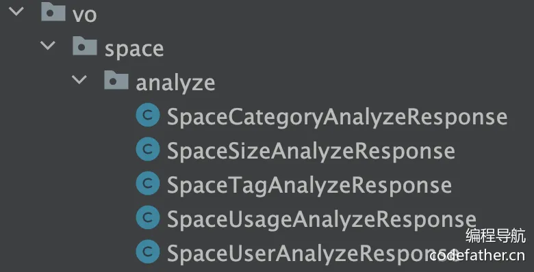

### 通用分析请求

1）由于我们的很多分析需求都需要传递空间查询范围，可以先写一个公共的图片分析请求封装类：

```java
@Data
public class SpaceAnalyzeRequest implements Serializable {

    /**
     * 空间 ID
     */
    private Long spaceId;

    /**
     * 是否查询公共图库
     */
    private boolean queryPublic;

    /**
     * 全空间分析
     */
    private boolean queryAll;

    private static final long serialVersionUID = 1L;
}
```

然后各个具体的分析请求封装类就能直接继承了，这样也便于后续编写通用的分析请求处理方法。

2）我们可以新建 SpaceAnalyzeService 和对应实现类，开发校验空间分析权限、根据分析范围填充查询对象这两个方法，后续的需求也都会用到。

校验空间分析权限：

```java
private void checkSpaceAnalyzeAuth(SpaceAnalyzeRequest spaceAnalyzeRequest, User loginUser) {
    // 检查权限
    if (spaceAnalyzeRequest.isQueryAll() || spaceAnalyzeRequest.isQueryPublic()) {
        // 全空间分析或者公共图库权限校验：仅管理员可访问
        ThrowUtils.throwIf(!userService.isAdmin(loginUser), ErrorCode.NO_AUTH_ERROR, "无权访问公共图库");
    } else {
        // 私有空间权限校验
        Long spaceId = spaceAnalyzeRequest.getSpaceId();
        ThrowUtils.throwIf(spaceId == null || spaceId <= 0, ErrorCode.PARAMS_ERROR);
        Space space = spaceService.getById(spaceId);
        ThrowUtils.throwIf(space == null, ErrorCode.NOT_FOUND_ERROR, "空间不存在");
        spaceService.checkSpaceAuth(loginUser, space);
    }
}
```

根据分析范围填充查询对象：

```java
private static void fillAnalyzeQueryWrapper(SpaceAnalyzeRequest spaceAnalyzeRequest, QueryWrapper<Picture> queryWrapper) {
    if (spaceAnalyzeRequest.isQueryAll()) {
        return;
    }
    if (spaceAnalyzeRequest.isQueryPublic()) {
        queryWrapper.isNull("spaceId");
        return;
    }
    Long spaceId = spaceAnalyzeRequest.getSpaceId();
    if (spaceId != null) {
        queryWrapper.eq("spaceId", spaceId);
        return;
    }
    throw new BusinessException(ErrorCode.PARAMS_ERROR, "未指定查询范围");
}
```

### 需求开发

#### 1、空间资源使用分析

1）开发请求封装类，用于接收前端请求的数据。此处直接继承通用的图片分析请求封装类即可，不需要传递其他字段：

```java
@EqualsAndHashCode(callSuper = true)
@Data
public class SpaceUsageAnalyzeRequest extends SpaceAnalyzeRequest {

}
```

2）开发响应视图类，用于将分析结果返回给前端：

```java
@Data
public class SpaceUsageAnalyzeResponse implements Serializable {

    /**
     * 已使用大小
     */
    private Long usedSize;

    /**
     * 总大小
     */
    private Long maxSize;

    /**
     * 空间使用比例
     */
    private Double sizeUsageRatio;

    /**
     * 当前图片数量
     */
    private Long usedCount;

    /**
     * 最大图片数量
     */
    private Long maxCount;

    /**
     * 图片数量占比
     */
    private Double countUsageRatio;

    private static final long serialVersionUID = 1L;
}
```

3）开发 SpaceAnalyzeService 业务逻辑层，编写分析业务的实现逻辑。

注意，如果是分析全空间或公共图库的使用情况，需要编写 “仅管理员可访问” 的权限校验逻辑，并且更改查询图片表的范围；如果只是分析单个空间的使用情况，直接从空间表查询出单个空间的数据即可。

代码如下：

```java
/**
 * 获取空间使用分析数据
 *
 * @param spaceUsageAnalyzeRequest SpaceUsageAnalyzeRequest 请求参数
 * @param loginUser                当前登录用户
 * @return SpaceUsageAnalyzeResponse 分析结果
 */
@Override
public SpaceUsageAnalyzeResponse getSpaceUsageAnalyze(SpaceUsageAnalyzeRequest spaceUsageAnalyzeRequest, User loginUser) {
    ThrowUtils.throwIf(spaceUsageAnalyzeRequest == null, ErrorCode.PARAMS_ERROR);
    if (spaceUsageAnalyzeRequest.isQueryAll() || spaceUsageAnalyzeRequest.isQueryPublic()) {
        // 查询全部或公共图库逻辑
        // 仅管理员可以访问
        boolean isAdmin = userService.isAdmin(loginUser);
        ThrowUtils.throwIf(!isAdmin, ErrorCode.NO_AUTH_ERROR, "无权访问空间");
        // 统计公共图库的资源使用
        QueryWrapper<Picture> queryWrapper = new QueryWrapper<>();
        queryWrapper.select("picSize");
        if (!spaceUsageAnalyzeRequest.isQueryAll()) {
            queryWrapper.isNull("spaceId");
        }
        List<Object> pictureObjList = pictureService.getBaseMapper().selectObjs(queryWrapper);
        long usedSize = pictureObjList.stream().mapToLong(result -> result instanceof Long ? (Long) result : 0).sum();
        long usedCount = pictureObjList.size();
        // 封装返回结果
        SpaceUsageAnalyzeResponse spaceUsageAnalyzeResponse = new SpaceUsageAnalyzeResponse();
        spaceUsageAnalyzeResponse.setUsedSize(usedSize);
        spaceUsageAnalyzeResponse.setUsedCount(usedCount);
        // 公共图库无上限、无比例
        spaceUsageAnalyzeResponse.setMaxSize(null);
        spaceUsageAnalyzeResponse.setSizeUsageRatio(null);
        spaceUsageAnalyzeResponse.setMaxCount(null);
        spaceUsageAnalyzeResponse.setCountUsageRatio(null);
        return spaceUsageAnalyzeResponse;
    } else {
        // 查询指定空间
        Long spaceId = spaceUsageAnalyzeRequest.getSpaceId();
        ThrowUtils.throwIf(spaceId == null || spaceId <= 0, ErrorCode.PARAMS_ERROR);
        // 获取空间信息
        Space space = spaceService.getById(spaceId);
        ThrowUtils.throwIf(space == null, ErrorCode.NOT_FOUND_ERROR, "空间不存在");

        // 权限校验：仅空间所有者或管理员可访问
        spaceService.checkSpaceAuth(loginUser, space);

        // 构造返回结果
        SpaceUsageAnalyzeResponse response = new SpaceUsageAnalyzeResponse();
        response.setUsedSize(space.getTotalSize());
        response.setMaxSize(space.getMaxSize());
        // 后端直接算好百分比，这样前端可以直接展示
        double sizeUsageRatio = NumberUtil.round(space.getTotalSize() * 100.0 / space.getMaxSize(), 2).doubleValue();
        response.setSizeUsageRatio(sizeUsageRatio);
        response.setUsedCount(space.getTotalCount());
        response.setMaxCount(space.getMaxCount());
        double countUsageRatio = NumberUtil.round(space.getTotalCount() * 100.0 / space.getMaxCount(), 2).doubleValue();
        response.setCountUsageRatio(countUsageRatio);
        return response;
    }
}
```

上述代码中，有一个很重要的优化细节，由于我们只需要获取图片存储大小，从数据库中查询时要指定 **只查询需要的列**，并且使用 mapper 的 `selectObjs` 方法直接返回 Object 对象，而不用封装为 Picture 对象，可以提高性能并节约存储空间。

```java
QueryWrapper<Picture> queryWrapper = new QueryWrapper<>();
queryWrapper.select("picSize");
if (!spaceUsageAnalyzeRequest.isQueryAll()) {
    queryWrapper.isNull("spaceId");
}
List<Object> pictureObjList = pictureService.getBaseMapper().selectObjs(queryWrapper);
long usedSize = pictureObjList.stream().mapToLong(result -> result instanceof Long ? (Long) result : 0).sum();
```

可以在 SpaceService 中封装空间权限校验方法，其他的分析需求也会用到：

```java
/**
 * 空间权限校验
 *
 * @param loginUser
 * @param space
 */
@Override
public void checkSpaceAuth(User loginUser, Space space) {
    // 仅本人或管理员可访问
    if (!space.getUserId().equals(loginUser.getId()) && !userService.isAdmin(loginUser)) {
        throw new BusinessException(ErrorCode.NO_AUTH_ERROR);
    }
}
```

然后可以将 SpaceController 中编辑和删除操作的权限校验代码替换为 checkSpaceAuth 方法，统一空间校验逻辑。

4）开发 SpaceAnalyzeController 接口：

```java
@RestController
@RequestMapping("/space/analyze")
public class SpaceAnalyzeController {

    @Resource
    private SpaceAnalyzeService spaceAnalyzeService;

    @Resource
    private UserService userService;

    /**
     * 获取空间使用状态
     */
    @PostMapping("/usage")
    public BaseResponse<SpaceUsageAnalyzeResponse> getSpaceUsageAnalyze(
            @RequestBody SpaceUsageAnalyzeRequest spaceUsageAnalyzeRequest,
            HttpServletRequest request
    ) {
        ThrowUtils.throwIf(spaceUsageAnalyzeRequest == null, ErrorCode.PARAMS_ERROR);
        User loginUser = userService.getLoginUser(request);
        SpaceUsageAnalyzeResponse spaceUsageAnalyze = spaceAnalyzeService.getSpaceUsageAnalyze(spaceUsageAnalyzeRequest, loginUser);
        return ResultUtils.success(spaceUsageAnalyze);
    }
}
```

#### 2、空间图片分类分析

1）开发请求封装类。分类分析只需要传递空间范围相关参数，因此可以直接继承公共的 `SpaceAnalyzeRequest`：

```java
@EqualsAndHashCode(callSuper = true)
@Data
public class SpaceCategoryAnalyzeRequest extends SpaceAnalyzeRequest {

}
```

2）开发响应视图类。分类分析的结果需要返回图片分类、分类图片数量和分类图片总大小：

```java
@Data
@AllArgsConstructor
@NoArgsConstructor
public class SpaceCategoryAnalyzeResponse implements Serializable {

    /**
     * 图片分类
     */
    private String category;

    /**
     * 图片数量
     */
    private Long count;

    /**
     * 分类图片总大小
     */
    private Long totalSize;

    private static final long serialVersionUID = 1L;
}
```

3）开发 Service 服务。按照分类分组查询图片表的数据，注意查询数据库时只获取需要的字段即可：

```java
@Override
public List<SpaceCategoryAnalyzeResponse> getSpaceCategoryAnalyze(SpaceCategoryAnalyzeRequest spaceCategoryAnalyzeRequest, User loginUser) {
    ThrowUtils.throwIf(spaceCategoryAnalyzeRequest == null, ErrorCode.PARAMS_ERROR);

    // 检查权限
    checkSpaceAnalyzeAuth(spaceCategoryAnalyzeRequest, loginUser);

    // 构造查询条件
    QueryWrapper<Picture> queryWrapper = new QueryWrapper<>();
    // 根据分析范围补充查询条件
    fillAnalyzeQueryWrapper(spaceCategoryAnalyzeRequest, queryWrapper);

    // 使用 MyBatis-Plus 分组查询
    queryWrapper.select("category AS category",
                    "COUNT(*) AS count",
                    "SUM(picSize) AS totalSize")
            .groupBy("category");

    // 查询并转换结果
    return pictureService.getBaseMapper().selectMaps(queryWrapper)
            .stream()
            .map(result -> {
                String category = result.get("category") != null ? result.get("category").toString() : "未分类";
                Long count = ((Number) result.get("count")).longValue();
                Long totalSize = ((Number) result.get("totalSize")).longValue();
                return new SpaceCategoryAnalyzeResponse(category, count, totalSize);
            })
            .collect(Collectors.toList());
}
```

💡 建议在编写具体的代码前，先编写示例 SQL 语句，并通过数据库查询客户端来验证。

4）开发接口：

```java
@PostMapping("/category")
public BaseResponse<List<SpaceCategoryAnalyzeResponse>> getSpaceCategoryAnalyze(@RequestBody SpaceCategoryAnalyzeRequest spaceCategoryAnalyzeRequest, HttpServletRequest request) {
    ThrowUtils.throwIf(spaceCategoryAnalyzeRequest == null, ErrorCode.PARAMS_ERROR);
    User loginUser = userService.getLoginUser(request);
    List<SpaceCategoryAnalyzeResponse> resultList = spaceAnalyzeService.getSpaceCategoryAnalyze(spaceCategoryAnalyzeRequest, loginUser);
    return ResultUtils.success(resultList);
}
```

#### 3、空间图片标签分析

1）开发请求封装类，标签分析同样需要继承 `SpaceAnalyzeRequest`：

```java
@EqualsAndHashCode(callSuper = true)
@Data
public class SpaceTagAnalyzeRequest extends SpaceAnalyzeRequest {

}
```

2）开发响应视图类。标签分析的结果需要返回标签名称和关联的图片数量：

```java
@Data
@AllArgsConstructor
@NoArgsConstructor
public class SpaceTagAnalyzeResponse implements Serializable {

    /**
     * 标签名称
     */
    private String tag;

    /**
     * 使用次数
     */
    private Long count;

    private static final long serialVersionUID = 1L;
}
```

3）开发 Service 服务。从数据库获取标签数据，统计每个标签的图片数量，并按使用次数降序排序：

```java
@Override
public List<SpaceTagAnalyzeResponse> getSpaceTagAnalyze(SpaceTagAnalyzeRequest spaceTagAnalyzeRequest, User loginUser) {
    ThrowUtils.throwIf(spaceTagAnalyzeRequest == null, ErrorCode.PARAMS_ERROR);

    // 检查权限
    checkSpaceAnalyzeAuth(spaceTagAnalyzeRequest, loginUser);

    // 构造查询条件
    QueryWrapper<Picture> queryWrapper = new QueryWrapper<>();
    fillAnalyzeQueryWrapper(spaceTagAnalyzeRequest, queryWrapper);

    // 查询所有符合条件的标签
    queryWrapper.select("tags");
    List<String> tagsJsonList = pictureService.getBaseMapper().selectObjs(queryWrapper)
            .stream()
            .filter(ObjUtil::isNotNull)
            .map(Object::toString)
            .collect(Collectors.toList());

    // 合并所有标签并统计使用次数
    Map<String, Long> tagCountMap = tagsJsonList.stream()
            .flatMap(tagsJson -> JSONUtil.toList(tagsJson, String.class).stream())
            .collect(Collectors.groupingBy(tag -> tag, Collectors.counting()));

    // 转换为响应对象，按使用次数降序排序
    return tagCountMap.entrySet().stream()
            .sorted((e1, e2) -> Long.compare(e2.getValue(), e1.getValue())) // 降序排列
            .map(entry -> new SpaceTagAnalyzeResponse(entry.getKey(), entry.getValue()))
            .collect(Collectors.toList());
}
```

4）开发接口：

```java
@PostMapping("/tag")
public BaseResponse<List<SpaceTagAnalyzeResponse>> getSpaceTagAnalyze(@RequestBody SpaceTagAnalyzeRequest spaceTagAnalyzeRequest, HttpServletRequest request) {
    ThrowUtils.throwIf(spaceTagAnalyzeRequest == null, ErrorCode.PARAMS_ERROR);
    User loginUser = userService.getLoginUser(request);
    List<SpaceTagAnalyzeResponse> resultList = spaceAnalyzeService.getSpaceTagAnalyze(spaceTagAnalyzeRequest, loginUser);
    return ResultUtils.success(resultList);
}
```

#### 4、空间图片大小分析

1）开发请求封装类。图片大小分析也继承 `SpaceAnalyzeRequest`：

```java
@EqualsAndHashCode(callSuper = true)
@Data
public class SpaceSizeAnalyzeRequest extends SpaceAnalyzeRequest {

}
```

2）开发响应视图类。大小分析结果需要返回图片大小范围和对应的图片数量：

```java
@Data
@AllArgsConstructor
@NoArgsConstructor
public class SpaceSizeAnalyzeResponse implements Serializable {

    /**
     * 图片大小范围
     */
    private String sizeRange;

    /**
     * 图片数量
     */
    private Long count;

    private static final long serialVersionUID = 1L;
}
```

3）开发 Service 服务，分段统计图片大小：

```java
@Override
public List<SpaceSizeAnalyzeResponse> getSpaceSizeAnalyze(SpaceSizeAnalyzeRequest spaceSizeAnalyzeRequest, User loginUser) {
    ThrowUtils.throwIf(spaceSizeAnalyzeRequest == null, ErrorCode.PARAMS_ERROR);

    // 检查权限
    checkSpaceAnalyzeAuth(spaceSizeAnalyzeRequest, loginUser);

    // 构造查询条件
    QueryWrapper<Picture> queryWrapper = new QueryWrapper<>();
    fillAnalyzeQueryWrapper(spaceSizeAnalyzeRequest, queryWrapper);

    // 查询所有符合条件的图片大小
    queryWrapper.select("picSize");
    List<Long> picSizes = pictureService.getBaseMapper().selectObjs(queryWrapper)
            .stream()
            .map(size -> ((Number) size).longValue())
            .collect(Collectors.toList());

    // 定义分段范围，注意使用有序 Map
    Map<String, Long> sizeRanges = new LinkedHashMap<>();
    sizeRanges.put("<100KB", picSizes.stream().filter(size -> size < 100 * 1024).count());
    sizeRanges.put("100KB-500KB", picSizes.stream().filter(size -> size >= 100 * 1024 && size < 500 * 1024).count());
    sizeRanges.put("500KB-1MB", picSizes.stream().filter(size -> size >= 500 * 1024 && size < 1 * 1024 * 1024).count());
    sizeRanges.put(">1MB", picSizes.stream().filter(size -> size >= 1 * 1024 * 1024).count());

    // 转换为响应对象
    return sizeRanges.entrySet().stream()
            .map(entry -> new SpaceSizeAnalyzeResponse(entry.getKey(), entry.getValue()))
            .collect(Collectors.toList());
}
```

上述代码其实还可以进一步优化，只需要遍历一次 picSizes 列表就可以按大小分别统计了。

4）开发接口：

```java
@PostMapping("/size")
public BaseResponse<List<SpaceSizeAnalyzeResponse>> getSpaceSizeAnalyze(@RequestBody SpaceSizeAnalyzeRequest spaceSizeAnalyzeRequest, HttpServletRequest request) {
    ThrowUtils.throwIf(spaceSizeAnalyzeRequest == null, ErrorCode.PARAMS_ERROR);
    User loginUser = userService.getLoginUser(request);
    List<SpaceSizeAnalyzeResponse> resultList = spaceAnalyzeService.getSpaceSizeAnalyze(spaceSizeAnalyzeRequest, loginUser);
    return ResultUtils.success(resultList);
}
```

#### 5、用户上传行为分析

1）开发请求封装类。用户上传行为分析需要增加时间维度（日、周、月）和用户 ID 参数，支持只分析某个用户上传图片的情况。

```java
@EqualsAndHashCode(callSuper = true)
@Data
public class SpaceUserAnalyzeRequest extends SpaceAnalyzeRequest {

    /**
     * 用户 ID
     */
    private Long userId;

    /**
     * 时间维度：day / week / month
     */
    private String timeDimension;
}
```

2）开发响应视图类。用户行为分析结果需要返回时间区间和对应的图片数量：

```java
@Data
@AllArgsConstructor
@NoArgsConstructor
public class SpaceUserAnalyzeResponse implements Serializable {

    /**
     * 时间区间
     */
    private String period;

    /**
     * 上传数量
     */
    private Long count;

    private static final long serialVersionUID = 1L;
}
```

3）开发 Service 服务，基于图片的创建时间维度统计用户的上传行为，并按照时间升序排序：

```java
@Override
public List<SpaceUserAnalyzeResponse> getSpaceUserAnalyze(SpaceUserAnalyzeRequest spaceUserAnalyzeRequest, User loginUser) {
    ThrowUtils.throwIf(spaceUserAnalyzeRequest == null, ErrorCode.PARAMS_ERROR);
    // 检查权限
    checkSpaceAnalyzeAuth(spaceUserAnalyzeRequest, loginUser);

    // 构造查询条件
    QueryWrapper<Picture> queryWrapper = new QueryWrapper<>();
    Long userId = spaceUserAnalyzeRequest.getUserId();
    queryWrapper.eq(ObjUtil.isNotNull(userId), "userId", userId);
    fillAnalyzeQueryWrapper(spaceUserAnalyzeRequest, queryWrapper);

    // 分析维度：每日、每周、每月
    String timeDimension = spaceUserAnalyzeRequest.getTimeDimension();
    switch (timeDimension) {
        case "day":
            queryWrapper.select("DATE_FORMAT(createTime, '%Y-%m-%d') AS period", "COUNT(*) AS count");
            break;
        case "week":
            queryWrapper.select("YEARWEEK(createTime) AS period", "COUNT(*) AS count");
            break;
        case "month":
            queryWrapper.select("DATE_FORMAT(createTime, '%Y-%m') AS period", "COUNT(*) AS count");
            break;
        default:
            throw new BusinessException(ErrorCode.PARAMS_ERROR, "不支持的时间维度");
    }

    // 分组和排序
    queryWrapper.groupBy("period").orderByAsc("period");

    // 查询结果并转换
    List<Map<String, Object>> queryResult = pictureService.getBaseMapper().selectMaps(queryWrapper);
    return queryResult.stream()
            .map(result -> {
                String period = result.get("period").toString();
                Long count = ((Number) result.get("count")).longValue();
                return new SpaceUserAnalyzeResponse(period, count);
            })
            .collect(Collectors.toList());
}
```

上述代码中，我们使用 MySQL 的日期时间函数对图片的创建时间进行了格式化，使得同一天（周 / 月）的值相同，就能够统一按照一个字段（period）进行分组和排序了。

4）开发接口：

```java
@PostMapping("/user")
public BaseResponse<List<SpaceUserAnalyzeResponse>> getSpaceUserAnalyze(@RequestBody SpaceUserAnalyzeRequest spaceUserAnalyzeRequest, HttpServletRequest request) {
    ThrowUtils.throwIf(spaceUserAnalyzeRequest == null, ErrorCode.PARAMS_ERROR);
    User loginUser = userService.getLoginUser(request);
    List<SpaceUserAnalyzeResponse> resultList = spaceAnalyzeService.getSpaceUserAnalyze(spaceUserAnalyzeRequest, loginUser);
    return ResultUtils.success(resultList);
}
```

上述的这些需求，可以同时给用户和管理员使用，已经满足了管理员 “全空间资源使用分析” 的需求。接下来我们只需要单独开发一个 **仅管理员可使用的功能** —— 空间使用排行分析。

#### 6、空间使用排行分析

该功能仅管理员可使用，返回值就是前 N 个空间的信息。由于已经有现成的 Space 空间对象，就不用编写响应视图类了。

1）开发请求封装类。空间使用排行需要接收一个参数 `topN`，指定要返回的前 N 名空间信息，默认值为 10：

```java
@Data
public class SpaceRankAnalyzeRequest implements Serializable {

    /**
     * 排名前 N 的空间
     */
    private Integer topN = 10;

    private static final long serialVersionUID = 1L;
}
```

2）开发 Service 服务，按存储使用量排序查询前 N 个空间。注意，只有管理员可以查看空间排行：

```java
@Override
public List<Space> getSpaceRankAnalyze(SpaceRankAnalyzeRequest spaceRankAnalyzeRequest, User loginUser) {
ThrowUtils.throwIf(spaceRankAnalyzeRequest == null, ErrorCode.PARAMS_ERROR);

// 仅管理员可查看空间排行
ThrowUtils.throwIf(!userService.isAdmin(loginUser), ErrorCode.NO_AUTH_ERROR, "无权查看空间排行");

// 构造查询条件
QueryWrapper<Space> queryWrapper = new QueryWrapper<>();
queryWrapper.select("id", "spaceName", "userId", "totalSize")
        .orderByDesc("totalSize")
        .last("LIMIT " + spaceRankAnalyzeRequest.getTopN()); // 取前 N 名

// 查询结果
return spaceService.list(queryWrapper);
}
```

3）开发接口：

```java
@PostMapping("/rank")
public BaseResponse<List<Space>> getSpaceRankAnalyze(@RequestBody SpaceRankAnalyzeRequest spaceRankAnalyzeRequest, HttpServletRequest request) {
    ThrowUtils.throwIf(spaceRankAnalyzeRequest == null, ErrorCode.PARAMS_ERROR);
    User loginUser = userService.getLoginUser(request);
    List<Space> resultList = spaceAnalyzeService.getSpaceRankAnalyze(spaceRankAnalyzeRequest, loginUser);
    return ResultUtils.success(resultList);
}
```

至此，分析需求的后端接口就开发完成了，可以通过 Swagger 接口文档测试一波~ 尤其注意验证查询范围的准确性：

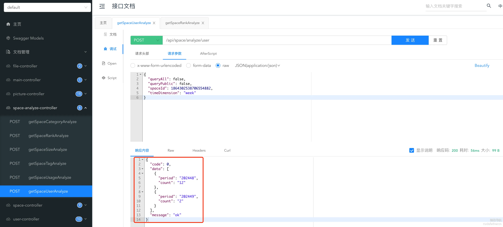

### 扩展知识 - 自定义 SQL

上述的需求我们是通过 MyBatis Plus 提供的方法实现数据库的分组排序查询，对于更复杂多样的分析需求，其实我们还可以自己在代码中编写 SQL 语句。

可能有部分同学会好奇，MyBatis 还能自定义 SQL？不都是直接调用 `xxx.select` 之类的方法么？

这就是典型的“用框架习惯了”，其实为了提高开发效率、避免自己写 SQL，我们之前一直使用的是 MyBatis Plus 框架。但别忘了，MyBatis Plus 是 MyBatis 的增强版，本质还是基于 MyBatis 的一些能力进行的一些封装简化，自定义 SQL 可是 MyBatis 最最最基础的能力之一。

在 MyBatis 一般会以两种方式来实现自定义 SQL ：

#### 1、Java 注解实现

基于 Java 注解写在 xxxMapper.java 中。

注解使用很简单， 在 mapper 层的接口类方法利用 `@Select、@Update、@Insert、@Delete` 等注解，在注解内填写自定义 SQL 语句，即可实现查询、更新、存储、删除。

例如下面两个方法：

```java
public interface SpaceMapper extends BaseMapper<Space> {

    /**
     * 获取存储使用量排名前 N 的空间
     * @param topN 排名前 N
     * @return List<Space>
     */
    @Select("SELECT id, spaceName, userId, totalSize " +
            "FROM space " +
            "ORDER BY totalSize DESC " +
            "LIMIT #{topN}")
    List<Space> getTopNSpaceUsage(int topN);

    /**
     * 删除某用户的所有空间
     *
     * @param userId 用户 ID
     * @return 删除的记录数
     */
    @Delete("DELETE FROM space WHERE userId = #{userId}")
    int deleteByUserId(Long userId);
}
```

完整语句 = SQL 语句模板 + 设置动态参数。方法的参数可以作为动态参数自动填充到 SQL 模板中，得到最终的 SQL 语句，结果也会自动转成方法返回值的 Java 类型。

💡 通过 #{} 和 ${} 都可以实现 SQL 参数绑定，但是两者是有区别的。#{} 是预编译参数，可以防止 SQL 注入，而 ${} 是直接替换，会导致 SQL 注入。

#### 2、XML 配置实现

基于 XML 配置文件写在 xxxMapper.xml 中。

之前通过代码生成器，项目里面已经有很多 xxxMapper.xml 配置文件了。比如 SpaceMapper.xml，里面定义了表和 Java 类的字段映射、SQL 字段列表片段。

```xml
<?xml version="1.0" encoding="UTF-8"?>
<!DOCTYPE mapper
        PUBLIC "-//mybatis.org//DTD Mapper 3.0//EN"
        "http://mybatis.org/dtd/mybatis-3-mapper.dtd">
<mapper namespace="com.yupi.yupicturebackend.mapper.SpaceMapper">

    <resultMap id="BaseResultMap" type="com.yupi.yupicturebackend.model.entity.Space">
        <id property="id" column="id" jdbcType="BIGINT"/>
        <result property="spaceName" column="spaceName" jdbcType="VARCHAR"/>
        <result property="spaceLevel" column="spaceLevel" jdbcType="INTEGER"/>
        <result property="maxSize" column="maxSize" jdbcType="BIGINT"/>
        <result property="maxCount" column="maxCount" jdbcType="BIGINT"/>
        <result property="totalSize" column="totalSize" jdbcType="BIGINT"/>
        <result property="totalCount" column="totalCount" jdbcType="BIGINT"/>
        <result property="userId" column="userId" jdbcType="BIGINT"/>
        <result property="createTime" column="createTime" jdbcType="TIMESTAMP"/>
        <result property="editTime" column="editTime" jdbcType="TIMESTAMP"/>
        <result property="updateTime" column="updateTime" jdbcType="TIMESTAMP"/>
        <result property="isDelete" column="isDelete" jdbcType="TINYINT"/>
    </resultMap>

    <sql id="Base_Column_List">
        id,spaceName,spaceLevel,
        maxSize,maxCount,totalSize,
        totalCount,userId,createTime,
        editTime,updateTime,isDelete
    </sql>
</mapper>
```

不用自己新建，仅需在里面添加自定义的 SQL 代码即可。

跟注解类似，MyBatis XML 中提供了 `<select>`、`<update>`、`<insert>`、`<delete>` 等语法，在内部添加自定义 SQL ，即可实现查询、更新、存储、删除。

移除上述 Mapper 的 SQL 注解，然后在 XML 文件中编写 SQL 片段，示例代码如下：

```xml
<!-- 获取存储使用量排名前 N 的空间 -->
<select id="getTopNSpaceUsage" resultType="com.yupi.Space">
  SELECT id, spaceName, userId, totalSize
  FROM space
  ORDER BY totalSize DESC
  LIMIT #{topN}
</select>

<!-- 删除某用户的所有空间 -->
<delete id="deleteByUserId">
  DELETE FROM space WHERE userId = #{userId}
</delete>
```

需要注意 2 点：

1. Mapper 接口中的方法名称必须与 XML 文件中定义的 SQL 片段的 id 对应，MyBatis 才能正确解析和匹配方法。
2. Mapper 接口方法的返回类型需要与 XML 文件中 resultType（或 resultMap）的定义保持一致，以确保查询结果能够正确映射到返回对象。

这样一来，MyBatis 在运行时会根据 Mapper 接口解析对应的 XML 文件，通过动态代理机制，将接口方法与 SQL 执行逻辑关联起来。

### 扩展知识 - 查询加速

数据分析通常有 2 种处理方式，实时分析和离线分析。

实时分析是指在数据生成的同时，立即对其进行处理和分析，以提供即时的结果，这种方式适用于需要快速决策的场景，比如监控系统中的异常检测或电商的实时推荐；离线数据分析则是在批量收集和存储数据后，进行复杂计算和深度分析，适合数据量极大、不需要即时结果的场景，比如生成历史报表或挖掘数据中的潜在特征。

即使我们没学过大数据技术，也可以通过业务逻辑层的编码加速数据查询和分析，典型的解决方案就是缓存。利用 Redis 分布式缓存或本地缓存来存储往期的查询结果，并设定一定的过期时间，就能避免重复计算并快速响应。

当然，对于定期的分析诉求（比如计算每日的排行榜）还有一种典型的方案，是通过定时任务计算每日的结果并存储在数据库中，之后就可以按照日期来直接查询某天的结果了。

比如上述需求中的 “用户上传行为分析”，就可以每日计算某个空间的用户上传情况，查询时直接范围查询日期。

| 排名 | 统计日期   | 空间 ID | 空间名称       | 用户 ID | 总大小 (MB) |
| ---- | ---------- | ------- | -------------- | ------- | ----------- |
| 1    | 2024-12-13 | 1001    | 鱼皮的个人空间 | 2001    | 2048        |
| 2    | 2024-12-13 | 1002    | 张三的个人空间 | 2002    | 1832        |
| 3    | 2024-12-13 | 1003    | 李四的个人空间 | 2003    | 1456        |
| 4    | 2024-12-13 | 1004    | 孙五的个人空间 | 2004    | 1387        |
| 5    | 2024-12-13 | 1005    | 老六的个人空间 | 2005    | 1203        |

## 四、前端开发

前端开发将分为几个步骤：

1. 引入数据可视化组件
2. 开发分析组件
3. 开发分析页面

### 数据可视化组件

[Apache ECharts](https://echarts.apache.org/zh/index.html) 是主流的开源图表库，vue-echarts 是基于 Echarts 的封装，简化了在 Vue 项目中的使用，所以推荐使用 [vue-echarts](https://github.com/ecomfe/vue-echarts) 实现数据可视化。

引入类库，注意必须同时引入 Echarts：

```java
npm i echarts vue-echarts
```

在需要使用图表的页面 JS 引入：

```javascript
import VChart from "vue-echarts";
import "echarts";
```

然后就可以使用组件了，示例代码：

```javascript
<v-chart :option="options" style="height: 300px" />
```

上述代码中，option 的值包括了图表的基本信息、图表的数据等，可以从 [ECharts 官网的示例](https://echarts.apache.org/examples/zh/index.html) 中快速学习和获取。Echarts 提供了 Playground 练习网站，建议先在网站上调试出自己想要的效果，再尝试在程序中构造 option 对象：

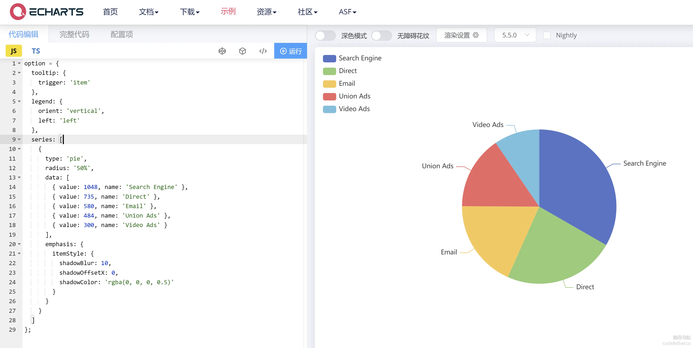

ECharts 参数可能非常多，建议使用 AI 工具搭配官方文档去了解，比如让 AI 帮忙解释 option 各个参数的含义，或者根据后端接口返回值来生成 option 选项。

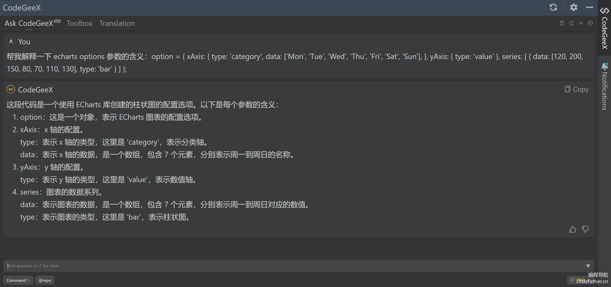

### 开发分析组件

由于分析需求较多，如果都在一个页面中编写所有的分析组件代码，会让页面过于复杂。所以我们把每个分析需求的图表展示和数据获取逻辑都封装为一个独立的组件，统一放在 `components/analyze` 目录下，之后分析页面（父页面）引入这些组件即可。

每个组件的开发模式都是类似的，先定义属性，每个组件都要接受父组件传来的查询范围参数，这样父页面可以灵活指定要查询的空间范围，并统一让所有分析图表重新加载。

```typescript
interface Props {
  queryAll?: boolean
  queryPublic?: boolean
  spaceId?: number
}

const props = withDefaults(defineProps<Props>(), {
  queryAll: false,
  queryPublic: false,
})
```

每个组件的样式风格可以统一，比如都用卡片进行包装、指定最大高度、给图表应用 loading 效果：

```vue
<template>
  <div class="space-xxx-analyze">
    <a-card title="分析需求名称">
      <v-chart :option="options" style="height: 320px" :loading="loading" />
    </a-card>
  </div>
</template>
```

每个组件也都需要在加载时调用后端接口获取数据，并且计算展示图表需要的 option，不同的需求对应的代码不同，需要定制开发。

#### 1、空间资源使用分析

通过统计当前空间已使用大小与总配额的比例，以及图片数量与最大允许数量的占比，帮助用户直观了解空间使用状态，及时清理或升级空间。图表形式推荐使用 **仪表盘** 来展示比例，类似进度条，可以更直观地了解比例。

我们使用的 Ant Design 组件库中就自带了 [进度条组件](https://antdv.com/components/progress-cn)，支持仪表盘的展示方式，无需使用 ECharts。

1）编写获取数据的逻辑：

```typescript
// 图表数据
const data = ref<API.SpaceUsageAnalyzeResponse>({})
const loading = ref(true)

/**
 * 加载数据
 */
const fetchData = async () => {
  loading.value = true
  const res = await getSpaceUsageAnalyzeUsingPost({
    queryAll: props.queryAll,
    queryPublic: props.queryPublic,
    spaceId: props.spaceId,
  })
  if (res.data.code === 0 && res.data.data) {
    data.value = res.data.data
  } else {
    message.error('获取数据失败，' + res.data.message)
  }
  loading.value = false
}

/**
 * 监听变量，改变时触发数据的重新加载
 */
watchEffect(() => {
  fetchData()
})
```

和之前不同的是，为了让组件的属性变化时重新加载图表，我们使用 watchEffect 来监听所有动态变量，只要有任何一个值发生变化，都会重新执行封装的函数。

2）编写图表结构。该组件要展示存储空间使用比例和图片数量使用比例，因此采用一行两列的 [Flex 布局](https://antdv.com/components/flex-cn)：

```vue
<a-flex gap="middle">
  <a-card title="存储空间" style="width: 50%">
    <div style="height: 320px; text-align: center">
      <h3>{{ formatSize(data.usedSize) }} / {{ data.maxSize ? formatSize(data.maxSize) : '无限制' }}</h3>
      <a-progress type="dashboard" :percent="data.sizeUsageRatio ?? 0" />
    </div>
  </a-card>
  <a-card title="图片数量" style="width: 50%">
    <div style="height: 320px; text-align: center">
      <h3>{{ data.usedCount }} / {{ data.maxCount ?? '无限制' }} </h3>
      <a-progress type="dashboard" :percent="data.countUsageRatio ?? 0" />
    </div>
  </a-card>
</a-flex>
```

注意，要给 percent 百分比的值设置默认值，否则会影响页面的加载。

效果如图：

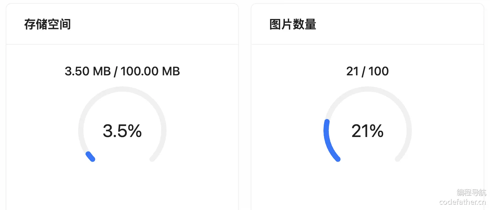

#### 2、空间图片分类分析

统计不同分类下图片的数量和总大小占比，帮助用户清晰了解各分类的资源分布，优化存储策略。由于同一个分类要展示多个信息，可以选择 **分组条形图** 来展示。

1）编写获取数据的逻辑：

```typescript
// 图表数据
const dataList = ref<API.SpaceCategoryAnalyzeResponse[]>([])
const loading = ref(true)

/**
 * 加载数据
 */
const fetchData = async () => {
  loading.value = true
  const res = await getSpaceCategoryAnalyzeUsingPost({
    queryAll: props.queryAll,
    queryPublic: props.queryPublic,
    spaceId: props.spaceId,
  })
  if (res.data.code === 0) {
    dataList.value = res.data.data ?? []
  } else {
    message.error('获取数据失败，' + res.data.message)
  }
  loading.value = false
}
```

2）编写图表结构：

```vue
<div class="space-category-analyze">
  <a-card title="图库分类占用">
      <v-chart :option="options" style="height: 320px; max-width: 100%;" :loading="loading" />
  </a-card>
</div>
```

3）编写图表选项。注意，由于 dataList 是有一个加载过程的，要使用 `computed` 计算属性，始终根据 dataList 的值来计算选项：

```typescript
const options = computed(() => {
  const categories = dataList.value.map((item) => item.category)
  const countData = dataList.value.map((item) => item.count)
  const sizeData = dataList.value.map((item) => (item.totalSize / (1024 * 1024)).toFixed(2)) // 转为 MB

  return {
    tooltip: { trigger: 'axis' },
    legend: { data: ['图片数量', '图片总大小'], top: 'bottom' },
    xAxis: { type: 'category', data: categories },
    yAxis: [
      {
        type: 'value',
        name: '图片数量',
        axisLine: { show: true, lineStyle: { color: '#5470C6' } }, // 左轴颜色
      },
      {
        type: 'value',
        name: '图片总大小 (MB)',
        position: 'right',
        axisLine: { show: true, lineStyle: { color: '#91CC75' } }, // 右轴颜色
        splitLine: {
          lineStyle: {
            color: '#91CC75', // 调整网格线颜色
            type: 'dashed', // 线条样式：可选 'solid', 'dashed', 'dotted'
          },
        },
      },
    ],
    series: [
      { name: '图片数量', type: 'bar', data: countData, yAxisIndex: 0 },
      { name: '图片总大小', type: 'bar', data: sizeData, yAxisIndex: 1 },
    ],
  }
})
```

💡 这段选项代码完全可以先利用 AI 生成，再根据自己的需求微调样式。

效果如图：

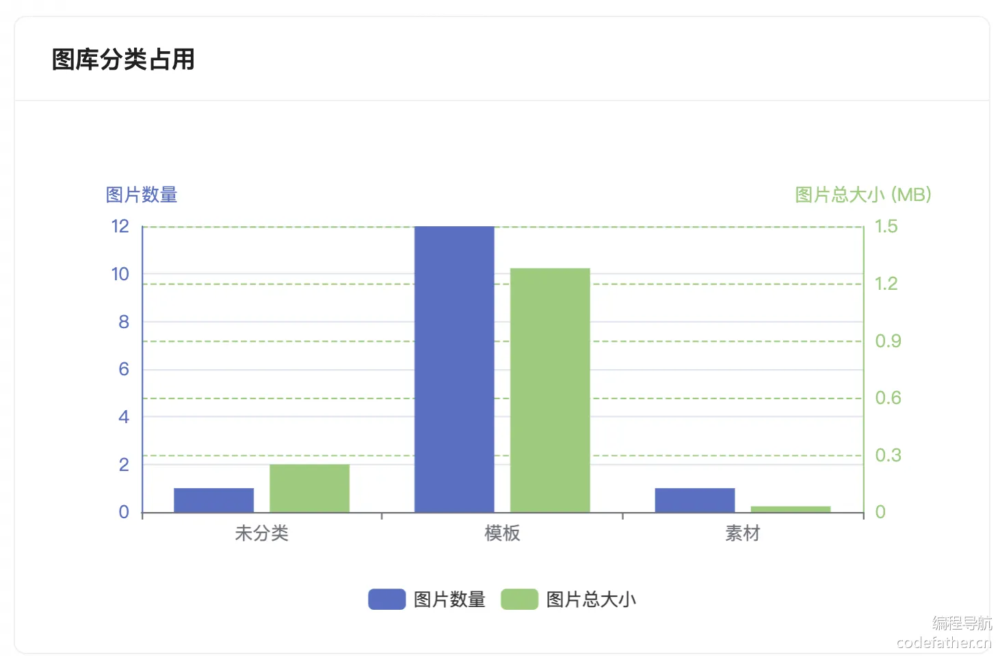

#### 3、空间图片标签分析

解析用户图库中的标签，统计每个标签的关联图片数量。由于标签比较多，可以用 **词云图** 展示所有的标签，并突出常用标签，便于优化管理和图片搜索。

注意，Apache ECharts 默认不会引入词云图组件，需要我们安装 [词云图](https://github.com/ecomfe/echarts-wordcloud) 依赖并引入：

```typescript
import VChart from 'vue-echarts'
import 'echarts'
import 'echarts-wordcloud'
```

1）编写获取数据的逻辑：

```typescript
const fetchData = async () => {
  loading.value = true
  const res = await getSpaceTagAnalyzeUsingPost({
    queryAll: props.queryAll,
    queryPublic: props.queryPublic,
    spaceId: props.spaceId,
  })
  if (res.data.code === 0) {
    dataList.value = res.data.data ?? []
  } else {
    message.error('获取数据失败，' + res.data.message)
  }
  loading.value = false
}
```

2）编写图表结构：

```vue
<div class="space-tag-analyze">
  <a-card title="图库标签词云">
    <v-chart :option="options" style="height: 320px; max-width: 100%;" :loading="loading" />
  </a-card>
</div>
```

3）编写图表选项：

```typescript
const options = computed(() => {
  const tagData = dataList.value.map((item) => ({
    name: item.tag,
    value: item.count,
  }))

  return {
    tooltip: {
      trigger: 'item',
      formatter: (params: any) => `${params.name}: ${params.value} 次`,
    },
    series: [
      {
        type: 'wordCloud',
        gridSize: 10,
        sizeRange: [12, 50], // 字体大小范围
        rotationRange: [-90, 90],
        shape: 'circle',
        textStyle: {
          color: () =>
            `rgb(${Math.round(Math.random() * 255)}, ${Math.round(
              Math.random() * 255,
            )}, ${Math.round(Math.random() * 255)})`, // 随机颜色
        },
        data: tagData,
      },
    ],
  }
})
```

效果如图：

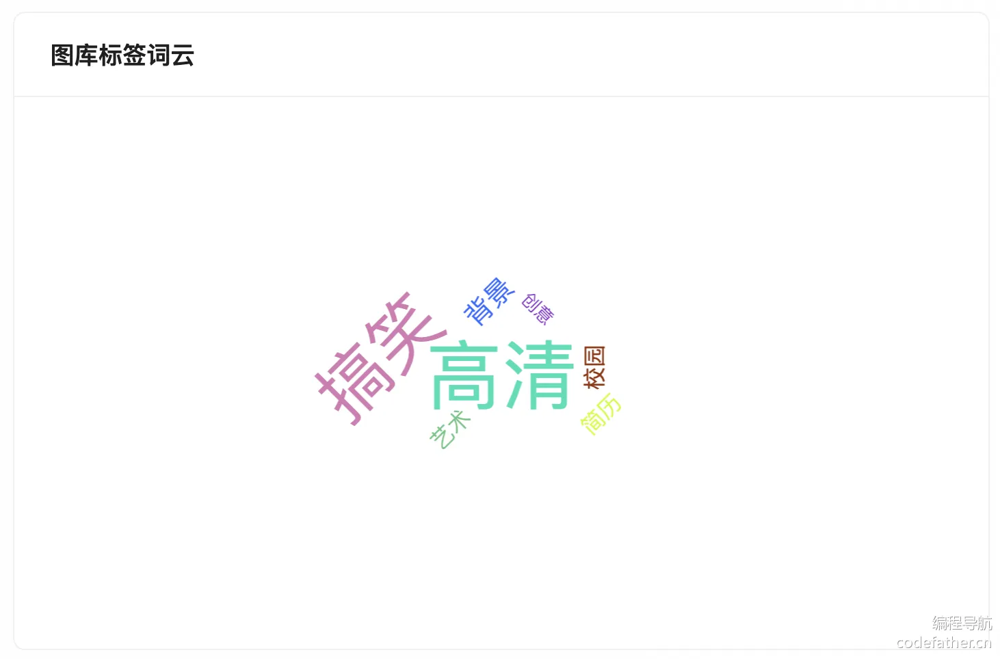

#### 4、空间图片大小分析

按图片大小（如 <100 KB、100 KB-1 MB、>1 MB）分段统计图片数量，帮助用户识别大体积图片，合理分配存储资源。由于按图片大小分类的数量不多，可以使用 **饼图** 展示，能够体现每类大小图片的数量占比。

1）编写获取数据的逻辑：

```typescript
const fetchData = async () => {
  loading.value = true
  const res = await getSpaceSizeAnalyzeUsingPost({
    queryAll: props.queryAll,
    queryPublic: props.queryPublic,
    spaceId: props.spaceId,
  })
  if (res.data.code === 0) {
    dataList.value = res.data.data ?? []
  } else {
    message.error('获取数据失败，' + res.data.message)
  }
  loading.value = false
}
```

2）编写图表结构：

```vue
<div class="space-size-analyze">
  <a-card title="空间图片大小分析">
    <v-chart :option="options" style="height: 320px; max-width: 100%" :loading="loading" />
  </a-card>
</div>
```

3）编写图表选项：

```typescript
const options = computed(() => {
  const pieData = dataList.value.map((item) => ({
    name: item.sizeRange,
    value: item.count,
  }))

  return {
    tooltip: {
      trigger: 'item',
      formatter: '{a} <br/>{b}: {c} ({d}%)',
    },
    legend: {
      top: 'bottom',
    },
    series: [
      {
        name: '图片大小',
        type: 'pie',
        radius: '50%',
        data: pieData,
      },
    ],
  }
})
```

效果如图：

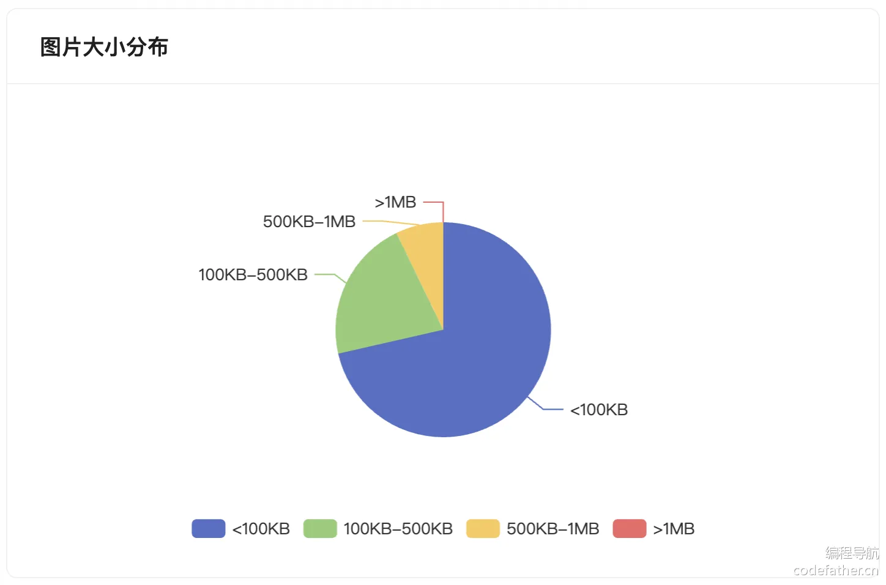

#### 5、用户上传行为分析

统计用户每月、每周、每日上传图片的数量趋势，帮助用户识别上传高峰期并优化管理策略，推荐使用 **折线图** 呈现时间序列趋势。

1）编写获取数据的逻辑：

```typescript
const fetchData = async () => {
  loading.value = true
  const res = await getSpaceUserAnalyzeUsingPost({
    queryAll: props.queryAll,
    queryPublic: props.queryPublic,
    spaceId: props.spaceId,
    timeDimension: timeDimension.value,
    userId: userId.value,
  })
  if (res.data.code === 0) {
    dataList.value = res.data.data ?? []
  } else {
    message.error('获取数据失败，' + res.data.message)
  }
  loading.value = false
}
```

2）编写图表结构：

```typescript
<div class="space-user-analyze">
  <a-card title="空间图片用户分析">
    <v-chart :option="options" style="height: 320px; max-width: 100%" :loading="loading" />
  </a-card>
</div>
```

3）编写图表选项：

```typescript
const options = computed(() => {
  const periods = dataList.value.map((item) => item.period) // 时间区间
  const counts = dataList.value.map((item) => item.count) // 上传数量

  return {
    tooltip: { trigger: 'axis' },
    xAxis: { type: 'category', data: periods, name: '时间区间' },
    yAxis: { type: 'value', name: '上传数量' },
    series: [
      {
        name: '上传数量',
        type: 'line',
        data: counts,
        smooth: true, // 平滑折线
        emphasis: {
          focus: 'series',
        },
      },
    ],
  }
})
```

4）支持用户选择统计的时间范围（日 / 周 / 月）并按照用户 id 筛选。

先开发页面结构，可以利用 [Card 组件](https://antdv.com/components/card-cn) 的插槽功能，在卡片标题的右侧展示搜索表单：

```vue
<a-card title="用户上传分析">
  <v-chart :option="options" style="height: 320px" />
  <template #extra>
    <a-space>
      <a-segmented v-model:value="timeDimension" :options="timeDimensionOptions" />
      <a-input-search placeholder="请输入用户 id" enter-button="搜索用户" @search="doSearch" />
    </a-space>
  </template>
</a-card>
```

定义变量，用于接受表单项的输入值，并且给下拉选择表单提供默认选项：

```typescript
const userId = ref<string>()
const timeDimension = ref<string>('day')
const timeDimensionOptions = [
  {
    label: '日',
    value: 'day',
  },
  {
    label: '周',
    value: 'week',
  },
  {
    label: '月',
    value: 'month',
  },
]
```

编写提交表单的函数，点击搜索时更改 userId 的值：

```typescript
const doSearch = (value: string) => {
  userId.value = value
}
```

最后，补充搜索条件到获取数据的函数中，只要属性或者选项的值发生了修改，立刻就会重新加载：

```typescript
const res = await getSpaceUserAnalyzeUsingPost({
  queryAll: props.queryAll,
  queryPublic: props.queryPublic,
  spaceId: props.spaceId,
  timeDimension: timeDimension.value,
  userId: userId.value,
})
```

效果如图：

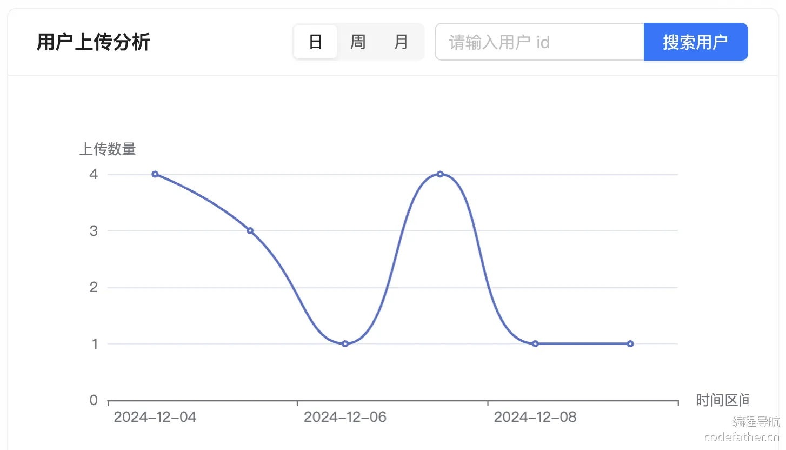

#### 6、空间使用排行分析

按存储使用量排序，统计占用存储最多的前 N 个空间，帮助管理员快速定位高占用空间，并识别潜在的资源滥用或异常情况。可以选用 **柱状图**，直观地展示排名和存储使用量。

1）编写获取数据的逻辑：

```typescript
const fetchData = async () => {
  loading.value = true
  const res = await getSpaceRankAnalyzeUsingPost({
    queryAll: props.queryAll,
    queryPublic: props.queryPublic,
    spaceId: props.spaceId,
  })
  if (res.data.code === 0) {
    dataList.value = res.data.data ?? []
  } else {
    message.error('获取数据失败，' + res.data.message)
  }
  loading.value = false
}
```

可以像开发用户上传行为分析图表一样，增加一个修改 topN 查询条数的表单项。这里我们简单一点，就先不传 topN，后端会填充默认值（10 条）。

2）编写图表结构：

```vue
<div class="space-rank-analyze">
  <a-card title="空间使用排行">
    <v-chart :option="options" style="height: 320px" />
  </a-card>
</div>
```

3）编写图表选项：

```typescript
const options = computed(() => {
  const spaceNames = dataList.value.map((item) => item.spaceName)
  const usageData = dataList.value.map((item) => (item.totalSize / (1024 * 1024)).toFixed(2)) // 转为 MB

  return {
    tooltip: { trigger: 'axis' },
    xAxis: {
      type: 'category',
      data: spaceNames,
    },
    yAxis: {
      type: 'value',
      name: '空间使用量 (MB)',
    },
    series: [
      {
        name: '空间使用量 (MB)',
        type: 'bar',
        data: usageData,
        itemStyle: {
          color: '#5470C6', // 自定义柱状图颜色
        },
      },
    ],
  }
})
```

效果如图：

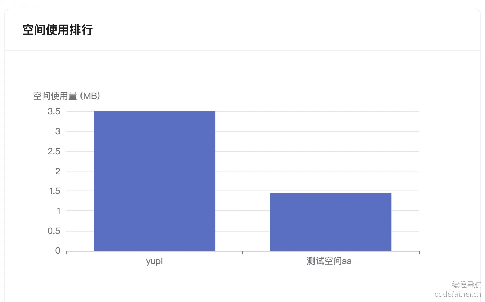

### 开发分析页面

新建一个分析页面，所有图表组件都放到该页面中。可以通过 URL 查询参数来触发不同范围的查询，比如分析某个特定空间（spaceId=xxx）、分析公共图库（queryPublic=1）、分析全部空间（queryAll=1）。这样无论是管理员分析全空间 / 公共图库，还是用户分析某个空间，都可以复用该页面。

1）新建页面文件和路由：

```typescript
{
  path: '/space_analyze',
  name: '空间分析',
  component: SpaceAnalyzePage,
}
```

2）开发页面，先定义查询范围参数，从 URL 查询参数中获取：

```typescript
const route = useRoute()

// 空间 id
const spaceId = computed(() => {
  return route.query?.spaceId as string
})

// 是否查询所有空间
const queryAll = computed(() => {
  return !!route.query?.queryAll
})

// 是否查询公共空间
const queryPublic = computed(() => {
  return !!route.query?.queryPublic
})
```

3）开发页面结构，引入组件，并使用栅格系统一行两列布局：

```vue
<div id="spaceAnalyzePage">
  <h2>
    空间图库分析 -
    <span v-if="queryAll"> 全部空间 </span>
    <span v-else-if="queryPublic"> 公共图库 </span>
    <span v-else>
      <a :href="`/space/${spaceId}`" target="_blank">id：{{ spaceId }}</a>
    </span>
  </h2>
  <a-row :gutter="[16, 16]">
    <!-- 空间使用分析 -->
    <a-col :xs="24" :md="12">
      <SpaceUsageAnalyze :spaceId="spaceId" :queryAll="queryAll" :queryPublic="queryPublic" />
    </a-col>
    <!-- 空间分类分析 -->
    <a-col :xs="24" :md="12">
      <SpaceCategoryAnalyze :spaceId="spaceId" :queryAll="queryAll" :queryPublic="queryPublic" />
    </a-col>
    <!-- 标签分析 -->
    <a-col :xs="24" :md="12">
      <SpaceTagAnalyze :spaceId="spaceId" :queryAll="queryAll" :queryPublic="queryPublic" />
    </a-col>
    <!-- 图片大小分段分析 -->
    <a-col :xs="24" :md="12">
      <SpaceSizeAnalyze :spaceId="spaceId" :queryAll="queryAll" :queryPublic="queryPublic" />
    </a-col>
    <!-- 用户上传行为分析 -->
    <a-col :xs="24" :md="12">
      <SpaceUserAnalyze :spaceId="spaceId" :queryAll="queryAll" :queryPublic="queryPublic" />
    </a-col>
    <!-- 空间使用排行分析 -->
    <a-col :xs="24" :md="12">
      <SpaceRankAnalyze :spaceId="spaceId" :queryAll="queryAll" :queryPublic="queryPublic" />
    </a-col>
  </a-row>
</div>
```

4）权限控制，仅管理员才能看到 “空间使用排行分析”。

先定义是否为管理员变量：

```typescript
const loginUserStore = useLoginUserStore()
const loginUser = loginUserStore.loginUser

const isAdmin = computed(() => {
  return loginUser.userRole === 'admin'
})
```

组件添加 `v-if` 属性：

```vue
<SpaceRankAnalyze v-if="isAdmin" 
  :spaceId="spaceId" 
  :queryAll="queryAll" 
  :queryPublic="queryPublic" 
/>
```

其他的权限控制在后端已经实现了，比如普通用户不能访问其他人的空间，效果如图：

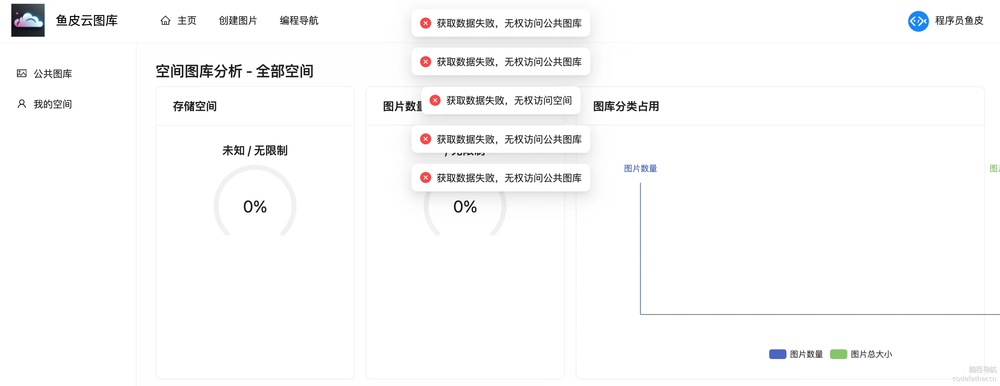

### 补充跳转入口

给用户空间详情页、空间管理页面增加跳转到分析页的入口。

1）用户空间详情页补充空间分析按钮：

```vue
<a-button
  type="primary"
  ghost
  :icon="h(BarChartOutlined)"
  :href="`/space_analyze?spaceId=${id}`"
  target="_blank"
>
  空间分析
</a-button>
```

效果如图：


2）空间管理新增公共图库分析按钮、全空间分析按钮，并且可以直接跳转到某个特定的空间分析页。

```vue
<a-space>
  <a-button type="primary" href="/add_space" target="_blank">+ 创建空间</a-button>
  <a-button type="primary" ghost href="/space_analyze?queryPublic=1" target="_blank">
    分析公共图库
  </a-button>
  <a-button type="primary" ghost href="/space_analyze?queryAll=1" target="_blank">
    分析全空间
  </a-button>
</a-space>
```

操作栏补充：

```vue
<a-button type="link" :href="`/space_analyze?spaceId=${record.id}`" target="_blank">
  分析
</a-button>
```

效果如图：

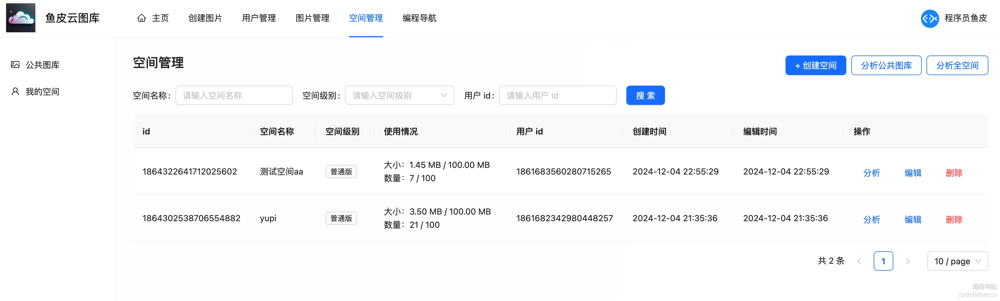

## 五、扩展

1、用户行为分析支持同环比分析，在同一个图表中展示两条折线（比如一条是上周的，一条是这周的）。

2、【前端】空间排名分析图表中，支持点击某个空间快速跳转查看单个空间详情

3、新增分析需求，按照空间级别对空间进行分类统计，分析不同级别空间的使用情况。

4、新增分析需求，管理员可以对系统内图片的审核状态进行分类统计，还可以按时间维度分析图片审核量的变化趋势。

5、新增分析需求，管理员可以按时间统计用户的登录次数、图片上传量和活跃度的变化趋势，帮助管理员识别高活跃用户，对用户进行分层管理。

------

至此，本项目的第二阶段就结束了，这个阶段，我们学到了空间模块设计、多维图片搜索、AI 图片编辑、图片分析这一整套的业务流程，现在你已经能够独立完成一个网盘系统、私人相册、私人作品集、私人档案网站啦


# 11 - 团队空间

## 本节重点

从本节开始我们将进行项目第三阶段 —— 团队空间的开发，让项目能够面向 B 端（企业）提供服务，比如作为团队共享素材、团队活动相册等，增强项目的商业价值。

本节先给项目增加团队共享空间的能力，大纲：

- 团队空间需求分析
- 团队空间方案设计
- 团队空间后端开发
- 团队空间前端开发

本节学完后，你应该能够掌握一个团队协作系统的方案设计和开发。

⭐️ 友情提示，本节涉及的后端新技术较多，学习难度略大，而且细节很多，请勿必仔细学习！

## 一、需求分析

之前我们已经完成了私有空间模块，团队空间和它类似，我们可以拆分为 4 个需求：

1）创建团队共享空间

用户可以创建 **最多一个** 团队共享空间，用于团队协作和资源共享，空间管理员拥有私有空间的所有能力，包括自由上传图片、检索图片、管理图片、分析空间等。

2）空间成员管理

- 成员邀请：空间管理员可以邀请新成员加入团队，共享空间内的图片。
- 设置权限：空间管理员可以为成员设置不同的角色（如查看者、编辑者、管理员），控制成员的权限范围。

3）空间成员权限控制：仅特定角色的成员可访问或操作团队空间内的图片。

4）空间数据管理：考虑到团队空间的图片数量可能比较多，可以对特定空间的数据进行单独的管理，而不是和公共图库、私有空间的图片混在一起。

## 二、方案设计

让我们先依次分析上述需求，并思考对应的解决方案。

### 创建团队共享空间

之前已经开发了空间模块，团队空间可以直接复用私有空间的大多数能力。因此可以给空间表新增一个 spaceType 字段，用于区分私有和团队空间。

```sql
ALTER TABLE space
    ADD COLUMN spaceType int default 0 not null comment '空间类型：0-私有 1-团队';

CREATE INDEX idx_spaceType ON space (spaceType);
```

### 空间成员管理

#### 1、业务流程

为了让项目更容易扩展，减少原有代码的修改，我们约定 **只有团队空间才有成员的概念**。

1）成员邀请：空间管理员可以直接输入成员 id 来添加新成员，无需该用户确认，这样可以提高开发效率。

2）设置权限：空间管理员可以为已加入成员设置不同的角色，控制成员的权限范围，类似于编辑成员信息。

#### 2、库表设计

由于空间和用户是多对多的关系，还要同时记录用户在某空间的角色，所以需要新建关联表：

```sql
-- 空间成员表
create table if not exists space_user
(
    id         bigint auto_increment comment 'id' primary key,
    spaceId    bigint                                 not null comment '空间 id',
    userId     bigint                                 not null comment '用户 id',
    spaceRole  varchar(128) default 'viewer'          null comment '空间角色：viewer/editor/admin',
    createTime datetime     default CURRENT_TIMESTAMP not null comment '创建时间',
    updateTime datetime     default CURRENT_TIMESTAMP not null on update CURRENT_TIMESTAMP comment '更新时间',
    -- 索引设计
    UNIQUE KEY uk_spaceId_userId (spaceId, userId), -- 唯一索引，用户在一个空间中只能有一个角色
    INDEX idx_spaceId (spaceId),                    -- 提升按空间查询的性能
    INDEX idx_userId (userId)                       -- 提升按用户查询的性能
) comment '空间用户关联' collate = utf8mb4_unicode_ci;
```

注意几个细节：

1. 给 spaceId 和 userId 添加唯一索引，确保同一用户在同一空间中只能有一个角色（不能重复加入）。由于有唯一键，不需要使用逻辑删除字段，否则无法退出后再重新加入。
2. 给关联字段添加索引，提高查询效率
3. 为了跟用户自身在项目中的角色 userRole 区分开，空间角色的名称使用 spaceRole

**为保证逻辑的统一，创建团队空间时要自动将创建人作为空间管理员，保存到空间成员表中。**

### 空间成员权限控制

仅特定角色的成员可访问或操作团队空间内的图片。

团队空间的权限管理可比私有空间的权限复杂多了，除了创建人外还有其他成员，涉及到查看图片、上传图片、管理空间图片、管理空间等多种不同的权限。

#### 1、RBAC 权限控制

对于复杂的权限控制场景，我们可以采用经典的 RBAC 权限控制模型（基于角色的访问控制，Role-Based Access Control），核心概念包括 **用户、角色、权限**。

- 一个用户可以有多个角色
- 一个角色可以有多个权限

这样一来，就可以灵活地配置用户具有的权限了。

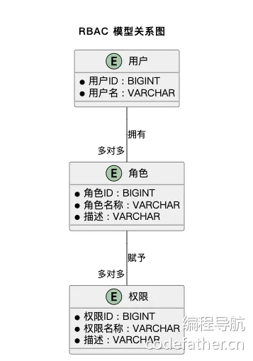

一般来说，标准的 RBAC 实现需要 5 张表：用户表、角色表、权限表、用户角色关联表、角色权限关联表，还是有一定开发成本的。由于我们的项目中，团队空间不需要那么多角色，可以简化 RBAC 的实现方式，比如将角色和权限直接定义到配置文件中。

#### 2、角色和权限定义

本项目的角色：

| 角色   | 描述                         |
| ------ | ---------------------------- |
| 浏览者 | 仅可查看空间中的图片内容     |
| 编辑者 | 可查看、上传和编辑图片内容   |
| 管理员 | 拥有管理空间和成员的所有权限 |

本项目的权限：

| 权限键           | 功能名称 | 描述                         |
| ---------------- | -------- | ---------------------------- |
| spaceUser:manage | 成员管理 | 管理空间成员，添加或移除成员 |
| picture:view     | 查看图片 | 查看空间中的图片内容         |
| picture:upload   | 上传图片 | 上传图片到空间中             |
| picture:edit     | 修改图片 | 编辑已上传的图片信息         |
| picture:delete   | 删除图片 | 删除空间中的图片             |

角色与权限映射：

| 角色   | 对应权限键                                                   | 可执行功能                                       |
| ------ | ------------------------------------------------------------ | ------------------------------------------------ |
| 浏览者 | picture:view                                                 | 查看图片                                         |
| 编辑者 | picture:view, picture:upload, picture:edit, picture:delete   | 查看图片、上传图片、修改图片、删除图片           |
| 管理员 | spaceUser:manage, picture:view, picture:upload, picture:edit, picture:delete | 成员管理、查看图片、上传图片、修改图片、删除图片 |

#### 3、权限校验实现方案

RBAC 只是一种权限设计模型，我们在 Java 代码中如何实现权限校验呢？6vlRn/br/m8Ymr8D02hZYIBP3pqlW5Sp8qJklXCk9AY=

1）最直接的方案是像之前校验私有空间权限一样，封装个团队空间的权限校验方法；或者类似用户权限校验一样，写个注解 + AOP 切面。

2）对于复杂的角色和权限管理，可以选用现成的第三方权限校验框架来实现，编写一套权限校验规则代码后，就能整体管理系统的权限校验逻辑了。

其实在本项目中，由于角色和权限不多，采用方案 1 实现会更方便一些，我也建议大家优先选择这种方案。方案 2 的代码量虽然未必比方案 1 少，但是会让整个系统的权限校验逻辑更加清晰，为了让大家后续能够应对更复杂的权限管理需求，此处鱼皮给大家讲解方案 2，并选用国内主流的 [权限校验框架 Sa-Token](https://sa-token.cc/doc.html#/start/example) 实现。

### 空间数据管理

考虑到团队空间的图片数量可能比较多，可以对特定空间的数据进行单独的管理。

如何对数据进行单独的管理呢？

#### 1、图片信息数据

可以给每个团队空间单独创建一张图片表 `picture_{spaceId}`，也就是分库分表中的 `分表`，而不是和公共图库、私有空间的图片混在一起。这样不仅查询空间内的图片效率更高，还便于整体管理和清理空间。**但是要注意，仅对旗舰版空间生效，否则分表的数量会特别多，反而可能影响性能。**

注意，我们要实现的，还不是普通的静态分表，而是会随着新增空间不断增加分表数量的动态分表，会使用分库分表框架 [Apache ShardingSphere](https://shardingsphere.apache.org/) 带大家实现。

#### 2、图片文件数据

已经将每个空间的图片存到不同的路径中了，实现了隔离，无需额外开发。


💡 你会发现，我们在设计上就将团队空间和私有空间隔离，仅对团队空间应用成员管理、权限控制、动态分表。这样可以尽量减少对原有代码的改动，避免出现问题。

## 三、后端开发

### 创建团队共享空间

#### 1、数据模型

Space、SpaceVO、SpaceAddRequest、SpaceQueryRequest 补充 spaceType 字段：

```java
/**
 * 空间类型：0-私有 1-团队
 */
private Integer spaceType;
```

定义空间类型枚举：

```java
@Getter
public enum SpaceTypeEnum {

    PRIVATE("私有空间", 0),
    TEAM("团队空间", 1);

    private final String text;

    private final int value;

    SpaceTypeEnum(String text, int value) {
        this.text = text;
        this.value = value;
    }

    /**
     * 根据 value 获取枚举
     */
    public static SpaceTypeEnum getEnumByValue(Integer value) {
        if (ObjUtil.isEmpty(value)) {
            return null;
        }
        for (SpaceTypeEnum spaceTypeEnum : SpaceTypeEnum.values()) {
            if (spaceTypeEnum.value == value) {
                return spaceTypeEnum;
            }
        }
        return null;
    }
}
```

#### 2、新建团队空间

可以直接复用创建空间的方法，只需要做一些改动即可。

1）创建空间时为空间类型指定默认值：

```java
// 默认值
if (StrUtil.isBlank(spaceAddRequest.getSpaceName())) {
    spaceAddRequest.setSpaceName("默认空间");
}
if (spaceAddRequest.getSpaceLevel() == null) {
    spaceAddRequest.setSpaceLevel(SpaceLevelEnum.COMMON.getValue());
}
if (spaceAddRequest.getSpaceType() == null) {
    spaceAddRequest.setSpaceType(SpaceTypeEnum.PRIVATE.getValue());
}
// 在此处将实体类和 DTO 进行转换
Space space = new Space();
BeanUtils.copyProperties(spaceAddRequest, space);
// 填充数据
this.fillSpaceBySpaceLevel(space);
```

2）validSpace 方法补充对空间类型的校验：

```java
public void validSpace(Space space, boolean add) {
    Integer spaceType = space.getSpaceType();
    SpaceTypeEnum spaceTypeEnum = SpaceTypeEnum.getEnumByValue(spaceType);
    // 要创建
    if (add) {
        if (spaceType == null) {
            throw new BusinessException(ErrorCode.PARAMS_ERROR, "空间类型不能为空");
        }
    }
    // 修改数据时，如果要改空间级别
    if (spaceType != null && spaceTypeEnum == null) {
        throw new BusinessException(ErrorCode.PARAMS_ERROR, "空间类型不存在");
    }
}
```

3）限制每个普通用户仅能创建一个团队空间（管理员可以创建多个），由于普通用户也仅能创建一个私有空间，相当于 **普通用户每类空间只能创建 1 个。**因此，只要在判断是否已创建空间时，补充 spaceType 作为查询条件即可：

```java
Long newSpaceId = transactionTemplate.execute(status -> {
    if (!userService.isAdmin(loginUser)) {
        boolean exists = this.lambdaQuery()
                .eq(Space::getUserId, userId)
                .eq(Space::getSpaceType, spaceAddRequest.getSpaceType())
                .exists();
        ThrowUtils.throwIf(exists, ErrorCode.OPERATION_ERROR, "每个用户每类空间仅能创建一个");
    }
    // 写入数据库
    boolean result = this.save(space);
    ThrowUtils.throwIf(!result, ErrorCode.OPERATION_ERROR);
    // 返回新写入的数据 id
    return space.getId();
});
```

当然，这里的逻辑你可以自由调整，比如不允许用户创建团队空间，需要联系管理员或付费开通。

#### 3、查询团队空间

给 SpaceService 的 getQueryWrapper 方法补充 spaceType 的查询条件：

```java
Integer spaceType = spaceQueryRequest.getSpaceType();
queryWrapper.eq(ObjUtil.isNotEmpty(spaceType), "spaceType", spaceType);
```

之后前端就能够按照空间类别获取空间列表了。

### 空间成员管理

空间成员管理的开发比较简单，其实就是 “增删改查”。

#### 1、数据模型

1）首先利用 MyBatisX 插件生成空间成员表相关的基础代码，包括实体类、Mapper、Service。

用户模块中有讲解详细流程，此处不再赘述。

2）每个操作都需要提供一个请求类，都放在 `model.dto.spaceuser` 包下。bgMhj83Bt96lFcj29lBZCF0o0+YPCGWOWUw0OPyFB/Q=

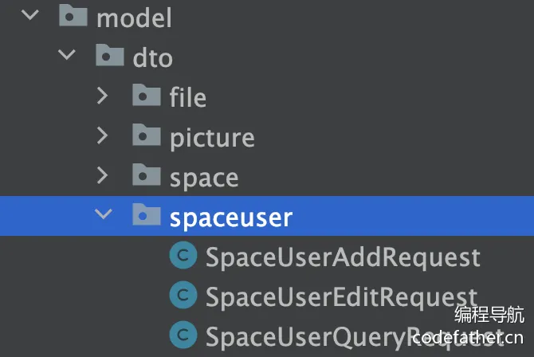

添加空间成员请求，给空间管理员使用：

```java
@Data
public class SpaceUserAddRequest implements Serializable {

    /**
     * 空间 ID
     */
    private Long spaceId;

    /**
     * 用户 ID
     */
    private Long userId;

    /**
     * 空间角色：viewer/editor/admin
     */
    private String spaceRole;

    private static final long serialVersionUID = 1L;
}
```

编辑空间成员请求，给空间管理员使用，可以设置空间成员的角色：

```java
@Data
public class SpaceUserEditRequest implements Serializable {

    /**
     * id
     */
    private Long id;

    /**
     * 空间角色：viewer/editor/admin
     */
    private String spaceRole;

    private static final long serialVersionUID = 1L;
}
```

查询空间成员请求，可以不用分页：

```java
@Data
public class SpaceUserQueryRequest implements Serializable {

    /**
     * ID
     */
    private Long id;

    /**
     * 空间 ID
     */
    private Long spaceId;

    /**
     * 用户 ID
     */
    private Long userId;

    /**
     * 空间角色：viewer/editor/admin
     */
    private String spaceRole;

    private static final long serialVersionUID = 1L;
}
```

3）在 `model.dto.vo` 下新建空间成员的视图包装类，可以额外关联空间信息和创建空间的用户信息。还可以编写 SpaceUser 实体类和该 VO 类的转换方法，便于后续快速传值。

```java
@Data
public class SpaceUserVO implements Serializable {

    /**
     * id
     */
    private Long id;

    /**
     * 空间 id
     */
    private Long spaceId;

    /**
     * 用户 id
     */
    private Long userId;

    /**
     * 空间角色：viewer/editor/admin
     */
    private String spaceRole;

    /**
     * 创建时间
     */
    private Date createTime;

    /**
     * 更新时间
     */
    private Date updateTime;

    /**
     * 用户信息
     */
    private UserVO user;

    /**
     * 空间信息
     */
    private SpaceVO space;

    private static final long serialVersionUID = 1L;

    /**
     * 封装类转对象
     *
     * @param spaceUserVO
     * @return
     */
    public static SpaceUser voToObj(SpaceUserVO spaceUserVO) {
        if (spaceUserVO == null) {
            return null;
        }
        SpaceUser spaceUser = new SpaceUser();
        BeanUtils.copyProperties(spaceUserVO, spaceUser);
        return spaceUser;
    }

    /**
     * 对象转封装类
     *
     * @param spaceUser
     * @return
     */
    public static SpaceUserVO objToVo(SpaceUser spaceUser) {
        if (spaceUser == null) {
            return null;
        }
        SpaceUserVO spaceUserVO = new SpaceUserVO();
        BeanUtils.copyProperties(spaceUser, spaceUserVO);
        return spaceUserVO;
    }
}
```

4）在 `model.enums` 包下新建空间角色枚举：

```java
@Getter
public enum SpaceRoleEnum {

    VIEWER("浏览者", "viewer"),
    EDITOR("编辑者", "editor"),
    ADMIN("管理员", "admin");

    private final String text;

    private final String value;

    SpaceRoleEnum(String text, String value) {
        this.text = text;
        this.value = value;
    }

    /**
     * 根据 value 获取枚举
     *
     * @param value 枚举值的 value
     * @return 枚举值
     */
    public static SpaceRoleEnum getEnumByValue(String value) {
        if (ObjUtil.isEmpty(value)) {
            return null;
        }
        for (SpaceRoleEnum anEnum : SpaceRoleEnum.values()) {
            if (anEnum.value.equals(value)) {
                return anEnum;
            }
        }
        return null;
    }

    /**
     * 获取所有枚举的文本列表
     *
     * @return 文本列表
     */
    public static List<String> getAllTexts() {
        return Arrays.stream(SpaceRoleEnum.values())
                .map(SpaceRoleEnum::getText)
                .collect(Collectors.toList());
    }

    /**
     * 获取所有枚举的值列表
     *
     * @return 值列表
     */
    public static List<String> getAllValues() {
        return Arrays.stream(SpaceRoleEnum.values())
                .map(SpaceRoleEnum::getValue)
                .collect(Collectors.toList());
    }
}
```

#### 2、基础服务开发

可以参考图片服务的开发方法，完成 SpaceUserService 和实现类，大多数代码可以直接复用。

我们主要开发下列方法：

1）添加空间成员：

```java
@Override
public long addSpaceUser(SpaceUserAddRequest spaceUserAddRequest) {
    // 参数校验
    ThrowUtils.throwIf(spaceUserAddRequest == null, ErrorCode.PARAMS_ERROR);
    SpaceUser spaceUser = new SpaceUser();
    BeanUtils.copyProperties(spaceUserAddRequest, spaceUser);
    validSpaceUser(spaceUser, true);
    // 数据库操作
    boolean result = this.save(spaceUser);
    ThrowUtils.throwIf(!result, ErrorCode.OPERATION_ERROR);
    return spaceUser.getId();
}
```

2）校验空间成员对象，增加 add 参数用来区分是创建数据时校验还是编辑时校验，判断条件是不一样的。比如创建成员时要检查用户是否存在。

```java
@Override
public void validSpaceUser(SpaceUser spaceUser, boolean add) {
    ThrowUtils.throwIf(spaceUser == null, ErrorCode.PARAMS_ERROR);
    // 创建时，空间 id 和用户 id 必填
    Long spaceId = spaceUser.getSpaceId();
    Long userId = spaceUser.getUserId();
    if (add) {
        ThrowUtils.throwIf(ObjectUtil.hasEmpty(spaceId, userId), ErrorCode.PARAMS_ERROR);
        User user = userService.getById(userId);
        ThrowUtils.throwIf(user == null, ErrorCode.NOT_FOUND_ERROR, "用户不存在");
        Space space = spaceService.getById(spaceId);
        ThrowUtils.throwIf(space == null, ErrorCode.NOT_FOUND_ERROR, "空间不存在");
    }
    // 校验空间角色
    String spaceRole = spaceUser.getSpaceRole();
    SpaceRoleEnum spaceRoleEnum = SpaceRoleEnum.getEnumByValue(spaceRole);
    if (spaceRole != null && spaceRoleEnum == null) {
        throw new BusinessException(ErrorCode.PARAMS_ERROR, "空间角色不存在");
    }
}
```

还可以校验是否已添加该成员，可自行实现。

3）将查询请求对象转换为 MyBatis-Plus 的查询封装对象：

```java
@Override
public QueryWrapper<SpaceUser> getQueryWrapper(SpaceUserQueryRequest spaceUserQueryRequest) {
    QueryWrapper<SpaceUser> queryWrapper = new QueryWrapper<>();
    if (spaceUserQueryRequest == null) {
        return queryWrapper;
    }
    // 从对象中取值
    Long id = spaceUserQueryRequest.getId();
    Long spaceId = spaceUserQueryRequest.getSpaceId();
    Long userId = spaceUserQueryRequest.getUserId();
    String spaceRole = spaceUserQueryRequest.getSpaceRole();
    queryWrapper.eq(ObjUtil.isNotEmpty(id), "id", id);
    queryWrapper.eq(ObjUtil.isNotEmpty(spaceId), "spaceId", spaceId);
    queryWrapper.eq(ObjUtil.isNotEmpty(userId), "userId", userId);
    queryWrapper.eq(ObjUtil.isNotEmpty(spaceRole), "spaceRole", spaceRole);
    return queryWrapper;
}
```

4）获取空间成员封装类，需要关联查询用户和空间的信息。

查询单个封装类：

```java
@Override
public SpaceUserVO getSpaceUserVO(SpaceUser spaceUser, HttpServletRequest request) {
    // 对象转封装类
    SpaceUserVO spaceUserVO = SpaceUserVO.objToVo(spaceUser);
    // 关联查询用户信息
    Long userId = spaceUser.getUserId();
    if (userId != null && userId > 0) {
        User user = userService.getById(userId);
        UserVO userVO = userService.getUserVO(user);
        spaceUserVO.setUser(userVO);
    }
    // 关联查询空间信息
    Long spaceId = spaceUser.getSpaceId();
    if (spaceId != null && spaceId > 0) {
        Space space = spaceService.getById(spaceId);
        SpaceVO spaceVO = spaceService.getSpaceVO(space, request);
        spaceUserVO.setSpace(spaceVO);
    }
    return spaceUserVO;
}
```

查询封装类列表：

```java
@Override
public List<SpaceUserVO> getSpaceUserVOList(List<SpaceUser> spaceUserList) {
    // 判断输入列表是否为空
    if (CollUtil.isEmpty(spaceUserList)) {
        return Collections.emptyList();
    }
    // 对象列表 => 封装对象列表
    List<SpaceUserVO> spaceUserVOList = spaceUserList.stream().map(SpaceUserVO::objToVo).collect(Collectors.toList());
    // 1. 收集需要关联查询的用户 ID 和空间 ID
    Set<Long> userIdSet = spaceUserList.stream().map(SpaceUser::getUserId).collect(Collectors.toSet());
    Set<Long> spaceIdSet = spaceUserList.stream().map(SpaceUser::getSpaceId).collect(Collectors.toSet());
    // 2. 批量查询用户和空间
    Map<Long, List<User>> userIdUserListMap = userService.listByIds(userIdSet).stream()
            .collect(Collectors.groupingBy(User::getId));
    Map<Long, List<Space>> spaceIdSpaceListMap = spaceService.listByIds(spaceIdSet).stream()
            .collect(Collectors.groupingBy(Space::getId));
    // 3. 填充 SpaceUserVO 的用户和空间信息
    spaceUserVOList.forEach(spaceUserVO -> {
        Long userId = spaceUserVO.getUserId();
        Long spaceId = spaceUserVO.getSpaceId();
        // 填充用户信息
        User user = null;
        if (userIdUserListMap.containsKey(userId)) {
            user = userIdUserListMap.get(userId).get(0);
        }
        spaceUserVO.setUser(userService.getUserVO(user));
        // 填充空间信息
        Space space = null;
        if (spaceIdSpaceListMap.containsKey(spaceId)) {
            space = spaceIdSpaceListMap.get(spaceId).get(0);
        }
        spaceUserVO.setSpace(SpaceVO.objToVo(space));
    });
    return spaceUserVOList;
}
```

#### 3、接口开发

参考图片接口的开发方法，完成 SpaceUserController 类，大多数代码可以直接复用。

需要开发的接口包括：

- 添加成员到空间：仅拥有成员管理权限的用户可使用。
- 从空间移除成员：仅拥有成员管理权限的用户可使用。
- 查询某个成员在空间的信息：仅拥有成员管理权限的用户可使用。
- 查询空间成员列表：仅拥有成员管理权限的用户可使用。
- 编辑成员信息：仅拥有成员管理权限的用户可使用。
- 查询我加入的团队空间列表：所有已登录用户可使用。

**由于我们后续会使用统一的权限管理框架，这个阶段可以先只实现功能，不进行权限校验。**

代码如下：

```java
@RestController
@RequestMapping("/spaceUser")
@Slf4j
public class SpaceUserController {

    @Resource
    private SpaceUserService spaceUserService;

    @Resource
    private UserService userService;

    /**
     * 添加成员到空间
     */
    @PostMapping("/add")
    public BaseResponse<Long> addSpaceUser(@RequestBody SpaceUserAddRequest spaceUserAddRequest, HttpServletRequest request) {
        ThrowUtils.throwIf(spaceUserAddRequest == null, ErrorCode.PARAMS_ERROR);
        long id = spaceUserService.addSpaceUser(spaceUserAddRequest);
        return ResultUtils.success(id);
    }

    /**
     * 从空间移除成员
     */
    @PostMapping("/delete")
    public BaseResponse<Boolean> deleteSpaceUser(@RequestBody DeleteRequest deleteRequest,
                                                 HttpServletRequest request) {
        if (deleteRequest == null || deleteRequest.getId() <= 0) {
            throw new BusinessException(ErrorCode.PARAMS_ERROR);
        }
        long id = deleteRequest.getId();
        // 判断是否存在
        SpaceUser oldSpaceUser = spaceUserService.getById(id);
        ThrowUtils.throwIf(oldSpaceUser == null, ErrorCode.NOT_FOUND_ERROR);
        // 操作数据库
        boolean result = spaceUserService.removeById(id);
        ThrowUtils.throwIf(!result, ErrorCode.OPERATION_ERROR);
        return ResultUtils.success(true);
    }

    /**
     * 查询某个成员在某个空间的信息
     */
    @PostMapping("/get")
    public BaseResponse<SpaceUser> getSpaceUser(@RequestBody SpaceUserQueryRequest spaceUserQueryRequest) {
        // 参数校验
        ThrowUtils.throwIf(spaceUserQueryRequest == null, ErrorCode.PARAMS_ERROR);
        Long spaceId = spaceUserQueryRequest.getSpaceId();
        Long userId = spaceUserQueryRequest.getUserId();
        ThrowUtils.throwIf(ObjectUtil.hasEmpty(spaceId, userId), ErrorCode.PARAMS_ERROR);
        // 查询数据库
        SpaceUser spaceUser = spaceUserService.getOne(spaceUserService.getQueryWrapper(spaceUserQueryRequest));
        ThrowUtils.throwIf(spaceUser == null, ErrorCode.NOT_FOUND_ERROR);
        return ResultUtils.success(spaceUser);
    }

    /**
     * 查询成员信息列表
     */
    @PostMapping("/list")
    public BaseResponse<List<SpaceUserVO>> listSpaceUser(@RequestBody SpaceUserQueryRequest spaceUserQueryRequest,
                                                         HttpServletRequest request) {
        ThrowUtils.throwIf(spaceUserQueryRequest == null, ErrorCode.PARAMS_ERROR);
        List<SpaceUser> spaceUserList = spaceUserService.list(
                spaceUserService.getQueryWrapper(spaceUserQueryRequest)
        );
        return ResultUtils.success(spaceUserService.getSpaceUserVOList(spaceUserList));
    }

    /**
     * 编辑成员信息（设置权限）
     */
    @PostMapping("/edit")
    public BaseResponse<Boolean> editSpaceUser(@RequestBody SpaceUserEditRequest spaceUserEditRequest,
                                               HttpServletRequest request) {
        if (spaceUserEditRequest == null || spaceUserEditRequest.getId() <= 0) {
            throw new BusinessException(ErrorCode.PARAMS_ERROR);
        }
        // 将实体类和 DTO 进行转换
        SpaceUser spaceUser = new SpaceUser();
        BeanUtils.copyProperties(spaceUserEditRequest, spaceUser);
        // 数据校验
        spaceUserService.validSpaceUser(spaceUser, false);
        // 判断是否存在
        long id = spaceUserEditRequest.getId();
        SpaceUser oldSpaceUser = spaceUserService.getById(id);
        ThrowUtils.throwIf(oldSpaceUser == null, ErrorCode.NOT_FOUND_ERROR);
        // 操作数据库
        boolean result = spaceUserService.updateById(spaceUser);
        ThrowUtils.throwIf(!result, ErrorCode.OPERATION_ERROR);
        return ResultUtils.success(true);
    }

    /**
     * 查询我加入的团队空间列表
     */
    @PostMapping("/list/my")
    public BaseResponse<List<SpaceUserVO>> listMyTeamSpace(HttpServletRequest request) {
        User loginUser = userService.getLoginUser(request);
        SpaceUserQueryRequest spaceUserQueryRequest = new SpaceUserQueryRequest();
        spaceUserQueryRequest.setUserId(loginUser.getId());
        List<SpaceUser> spaceUserList = spaceUserService.list(
                spaceUserService.getQueryWrapper(spaceUserQueryRequest)
        );
        return ResultUtils.success(spaceUserService.getSpaceUserVOList(spaceUserList));
    }
}
```

#### 4、创建团队空间时自动新增成员记录

根据需求，用户在创建团队空间时，会默认作为空间的管理员，需要在空间成员表中新增一条记录。

修改 addSpace 方法，在事务中补充插入空间成员记录：

```java
// 写入数据库
boolean result = this.save(space);
ThrowUtils.throwIf(!result, ErrorCode.OPERATION_ERROR);
// 如果是团队空间，关联新增团队成员记录
if (SpaceTypeEnum.TEAM.getValue() == spaceAddRequest.getSpaceType()) {
    SpaceUser spaceUser = new SpaceUser();
    spaceUser.setSpaceId(space.getId());
    spaceUser.setUserId(userId);
    spaceUser.setSpaceRole(SpaceRoleEnum.ADMIN.getValue());
    result = spaceUserService.save(spaceUser);
    ThrowUtils.throwIf(!result, ErrorCode.OPERATION_ERROR, "创建团队成员记录失败");
}
// 返回新写入的数据 id
return space.getId();
```

#### 扩展

1）添加成员到空间时，可以支持发送邀请和审批。

实现思路：给空间成员表新增一个邀请确认状态的字段

2）由于空间管理员可能有多个，空间成员表可以补充添加成员至空间的邀请人字段（createUserId）

3）空间成员操作执行前可以补充一些校验，比如：

- 只有已经是空间成员，才能被移除或编辑
- 如果编辑后的角色跟之前一致，就不用更新

### 空间成员权限控制

引入团队空间后，需要给空间操作、图片操作、空间成员操作添加权限控制逻辑。为了简化开发，同时防止一些空间重要信息的修改冲突，空间操作（空间信息的增删改查）仍然复用之前私有空间的校验逻辑 —— 仅创建人可操作。p87QUult0bZDR05AO5soQVixQ5nCQ+HA+P5tLSHK/hI=

由于权限校验属于整个项目的公共服务，统一放在 `manager.auth` 包中。

#### 1、权限定义

根据 RBAC 权限模型，需要定义角色和权限。

1）此处选用 JSON 配置文件来定义角色、权限、角色和权限之间的关系，相比从数据库表中获取，实现更方便，查询也更高效。

在 `resources/biz` 目录下新建 JSON 配置文件 `spaceUserAuthConfig.json`：

```json
{
  "permissions": [
    {
      "key": "spaceUser:manage",
      "name": "成员管理",
      "description": "管理空间成员，添加或移除成员"
    },
    {
      "key": "picture:view",
      "name": "查看图片",
      "description": "查看空间中的图片内容"
    },
    {
      "key": "picture:upload",
      "name": "上传图片",
      "description": "上传图片到空间中"
    },
    {
      "key": "picture:edit",
      "name": "修改图片",
      "description": "编辑已上传的图片信息"
    },
    {
      "key": "picture:delete",
      "name": "删除图片",
      "description": "删除空间中的图片"
    }
  ],
  "roles": [
    {
      "key": "viewer",
      "name": "浏览者",
      "permissions": [
        "picture:view"
      ],
      "description": "查看图片"
    },
    {
      "key": "editor",
      "name": "编辑者",
      "permissions": [
        "picture:view",
        "picture:upload",
        "picture:edit",
        "picture:delete"
      ],
      "description": "查看图片、上传图片、修改图片、删除图片"
    },
    {
      "key": "admin",
      "name": "管理员",
      "permissions": [
        "spaceUser:manage",
        "picture:view",
        "picture:upload",
        "picture:edit",
        "picture:delete"
      ],
      "description": "成员管理、查看图片、上传图片、修改图片、删除图片"
    }
  ]
}
```

2）在 `auth.model` 包下新建数据模型，用于接收配置文件的值。

权限配置类：

```java
@Data
public class SpaceUserAuthConfig implements Serializable {

    /**
     * 权限列表
     */
    private List<SpaceUserPermission> permissions;

    /**
     * 角色列表
     */
    private List<SpaceUserRole> roles;

    private static final long serialVersionUID = 1L;
}
```

空间成员权限：

```java
@Data
public class SpaceUserPermission implements Serializable {

    /**
     * 权限键
     */
    private String key;

    /**
     * 权限名称
     */
    private String name;

    /**
     * 权限描述
     */
    private String description;

    private static final long serialVersionUID = 1L;

}
```

空间成员角色：

```java
@Data
public class SpaceUserRole implements Serializable {

    /**
     * 角色键
     */
    private String key;

    /**
     * 角色名称
     */
    private String name;

    /**
     * 权限键列表
     */
    private List<String> permissions;

    /**
     * 角色描述
     */
    private String description;

    private static final long serialVersionUID = 1L;
}
```

3）定义空间成员权限常量类，便于后续校验权限时使用：

```java
public interface SpaceUserPermissionConstant {
    /**
     * 空间用户管理权限
     */
    String SPACE_USER_MANAGE = "spaceUser:manage";

    /**
     * 图片查看权限
     */
    String PICTURE_VIEW = "picture:view";

    /**
     * 图片上传权限
     */
    String PICTURE_UPLOAD = "picture:upload";

    /**
     * 图片编辑权限
     */
    String PICTURE_EDIT = "picture:edit";

    /**
     * 图片删除权限
     */
    String PICTURE_DELETE = "picture:delete";
}
```

4）在 `auth` 包下新建 SpaceUserAuthManager，可加载配置文件到对象，并提供根据角色获取权限列表的方法。

```java
@Component
public class SpaceUserAuthManager {

    @Resource
    private SpaceUserService spaceUserService;

    @Resource
    private UserService userService;

    public static final SpaceUserAuthConfig SPACE_USER_AUTH_CONFIG;

    static {
        String json = ResourceUtil.readUtf8Str("biz/spaceUserAuthConfig.json");
        SPACE_USER_AUTH_CONFIG = JSONUtil.toBean(json, SpaceUserAuthConfig.class);
    }

    /**
     * 根据角色获取权限列表
     */
    public List<String> getPermissionsByRole(String spaceUserRole) {
        if (StrUtil.isBlank(spaceUserRole)) {
            return new ArrayList<>();
        }
        // 找到匹配的角色
        SpaceUserRole role = SPACE_USER_AUTH_CONFIG.getRoles().stream()
                .filter(r -> spaceUserRole.equals(r.getKey()))
                .findFirst()
                .orElse(null);
        if (role == null) {
            return new ArrayList<>();
        }
        return role.getPermissions();
    }
}
```

#### 2、Sa-Token 入门

Sa-Token 是一个轻量级 Java 权限认证框架，相比 Spring Security 等更加简单易学，用作者的话说，使用该框架可以让鉴权变得简单、优雅~

框架的学习并不难，参考 [官方文档](https://sa-token.cc/doc.html#/start/example) 就好，等下我们要学习实战 Sa-Token 的主流特性和高级用法。

1）引入 Sa-Token：

```xml
<!-- Sa-Token 权限认证 -->
<dependency>
    <groupId>cn.dev33</groupId>
    <artifactId>sa-token-spring-boot-starter</artifactId>
    <version>1.39.0</version>
</dependency>
```

Sa-Token 默认将数据（比如用户登录态）保存在内存中，此模式读写速度最快，且避免了序列化与反序列化带来的性能消耗，但缺点是重启后数据会丢失、无法在分布式环境中共享数据。

我们项目中既然已经使用了 Redis，那么可以 [参考官方文档](https://sa-token.cc/doc.html#/up/integ-redis) 让 Sa-Token 整合 Redis，将用户的登录态等内容保存在 Redis 中。

此处选择 jackson 序列化方式整合 Redis，这样存到 Redis 的数据是可读的：

```xml
<!-- Sa-Token 整合 Redis （使用 jackson 序列化方式） -->
<dependency>
    <groupId>cn.dev33</groupId>
    <artifactId>sa-token-redis-jackson</artifactId>
    <version>1.39.0</version>
</dependency>
<!-- 提供Redis连接池 -->
<dependency>
    <groupId>org.apache.commons</groupId>
    <artifactId>commons-pool2</artifactId>
</dependency>
```

2）了解 Sa-Token 的基本用法

Sa-Token 的使用方式比较简单，首先是用户登录时调用 login 方法，产生一个新的会话：

```java
StpUtil.login(10001);
```

还可以给会话保存一些信息，比如登录用户的信息：

```java
StpUtil.getSession().set("user", user)
```

接下来你就可以判断用户是否登录、获取用户信息了，可以通过代码进行判断：

```java
// 检验当前会话是否已经登录, 如果未登录，则抛出异常：`NotLoginException`
StpUtil.checkLogin();
// 获取用户信息
StpUtil.getSession().get("user");
```

也可以参考 [官方文档](https://sa-token.cc/doc.html#/use/at-check)，使用注解进行鉴权：

```java
// 登录校验：只有登录之后才能进入该方法 
@SaCheckLogin                        
@RequestMapping("info")
public String info() {
    return "查询用户信息";
}
```

这是 Sa-Token 最基本的用法，下面我们正式在项目中使用 Sa-Token。

#### 3、新建空间账号体系

目前，我们的项目中其实存在两套权限校验体系。一套是最开始就有的，对 user 表的角色进行校验，分为普通用户和管理员；另一套是本节新学习的，对团队空间的权限进行校验。

为了更轻松地扩展项目，减少对原有代码的改动，我们原有的 user 表权限校验依然使用自定义注解 + AOP 的方式实现。而团队空间权限校验，采用 Sa-Token 来管理。

相当于我们不是整个项目都交给 Sa-Token，只是把 Sa-Token 当做实现团队空间权限管理的工具罢了。

这种同一项目有多账号体系的情况下，不建议使用 Sa-Token 默认的账号体系，而是使用 Sa-Token 提供的 [多账号认证特性](https://sa-token.cc/doc.html#/up/many-account?id=_5、kit模式)，可以将多套账号的授权给区分开，让它们互不干扰。

1）可以参考官方文档，使用 [Kit 模式](https://sa-token.cc/doc.html#/up/many-account?id=_5、kit模式) 实现多账号认证，在 `auth` 包下新建 `StpKit.java`，定义空间账号体系：

```java
/**
 * StpLogic 门面类，管理项目中所有的 StpLogic 账号体系
 * 添加 @Component 注解的目的是确保静态属性 DEFAULT 和 SPACE 被初始化
 */
@Component
public class StpKit {

    public static final String SPACE_TYPE = "space";

    /**
     * 默认原生会话对象，项目中目前没使用到
     */
    public static final StpLogic DEFAULT = StpUtil.stpLogic;

    /**
     * Space 会话对象，管理 Space 表所有账号的登录、权限认证
     */
    public static final StpLogic SPACE = new StpLogic(SPACE_TYPE);
}
```

之后就可以在代码中使用账号体系，以下是示例代码：

```java
// 在当前会话进行 Space 账号登录
StpKit.SPACE.login(10001);

// 检测当前会话是否以 Space 账号登录，并具有 picture:edit 权限
StpKit.SPACE.checkPermission("picture:edit");

// 获取当前 Space 会话的 Session 对象，并进行写值操作 
StpKit.SPACE.getSession().set("user", "程序员鱼皮");
```

2）修改用户服务的 userLogin 方法，用户登录成功后，保存登录态到 Sa-Token 的空间账号体系中：

```java
// 3. 记录用户的登录态
request.getSession().setAttribute(USER_LOGIN_STATE, user);
// 4. 记录用户登录态到 Sa-token，便于空间鉴权时使用，注意保证该用户信息与 SpringSession 中的信息过期时间一致
StpKit.SPACE.login(user.getId());
StpKit.SPACE.getSession().set(USER_LOGIN_STATE, user);
return this.getLoginUserVO(user);
```

#### 4、权限认证逻辑

Sa-Token 开发的核心是编写权限认证类，我们需要在该类中实现 “如何根据登录用户 id 获取到用户已有的角色和权限列表” 方法。当要判断某用户是否有某个角色或权限时，Sa-Token 会先执行我们编写的方法，得到该用户的角色或权限列表，然后跟需要的角色权限进行比对。

参考 [官方文档](https://sa-token.cc/doc.html#/use/jur-auth)，示例权限认证类如下：

```java
/**
 * 自定义权限加载接口实现类
 */
@Component    // 保证此类被 SpringBoot 扫描，完成 Sa-Token 的自定义权限验证扩展 
public class StpInterfaceImpl implements StpInterface {

    /**
     * 返回一个账号所拥有的权限码集合 
     */
    @Override
    public List<String> getPermissionList(Object loginId, String loginType) {
        // 本 list 仅做模拟，实际项目中要根据具体业务逻辑来查询权限
        List<String> list = new ArrayList<String>();    
        list.add("user.add");
        list.add("user.update");
        list.add("user.get");
        list.add("art.*");
        return list;
    }

    /**
     * 返回一个账号所拥有的角色标识集合 (权限与角色可分开校验)
     */
    @Override
    public List<String> getRoleList(Object loginId, String loginType) {
        // 本 list 仅做模拟，实际项目中要根据具体业务逻辑来查询角色
        List<String> list = new ArrayList<String>();    
        list.add("admin");
        list.add("super-admin");
        return list;
    }
}
```

Sa-Token 支持按照角色和权限校验，对于权限不多的项目，基于角色校验即可；对于权限较多的项目，建议根据权限校验。对于本项目，虽然权限并不多，但是考虑到扩展性，还是 **选择更细粒度的权限校验**，业务含义会更明确。

观察上述代码我们会发现，`getPermissionList` 方法只提供了 loginId（登录用户 id）和 loginType（账号体系）两个参数。这会给我们造成很大的难度：

- 我们光有用户 id 是没办法进行权限校验的，因为我们要给图片操作和空间成员操作增加权限校验逻辑，还需要获取到空间 id，才知道用户是否具有某个团队空间的权限。**那么如何获取到空间 id 呢？**
- 如果要进行统一的权限校验，也包括了公共图库和私有空间，更要命的是，公共图库是没有空间 id 的！**这就意味着要根据操作的图片情况动态判断。**

所以我们要解决的关键问题有 2 个：

1. 如何在 Sa-Token 中获取当前请求操作的参数？
2. 如何编写一套权限校验逻辑，同时兼容公共图库、私有空间和团队空间？

**1）先看第一个问题，使用 Sa-Token 有 2 种方式 —— 注解式和编程式。**

如果使用注解式，那么在接口被调用时就会立刻触发 Sa-Token 的权限校验，此时参数只能通过 Servlet 的请求对象传递。

如果使用编程式，可以在代码任意位置执行权限校验，只要在执行前将参数放到当前线程的上下文 ThreadLocal 对象中，就能在鉴权时获取到了。

为了后续我们给接口添加鉴权更直观方便，我们选择注解式鉴权。那就有一个关键问题，不同接口的请求参数是不同的，有的请求参数有 spaceId、有的只有 pictureId，怎么办呢？

我们可以定义一个 **上下文类**，用于统一接收请求中传递来的参数：

```java
/**
 * SpaceUserAuthContext
 * 表示用户在特定空间内的授权上下文，包括关联的图片、空间和用户信息。
 */
@Data
public class SpaceUserAuthContext {

    /**
     * 临时参数，不同请求对应的 id 可能不同
     */
    private Long id;

    /**
     * 图片 ID
     */
    private Long pictureId;

    /**
     * 空间 ID
     */
    private Long spaceId;

    /**
     * 空间用户 ID
     */
    private Long spaceUserId;

    /**
     * 图片信息
     */
    private Picture picture;

    /**
     * 空间信息
     */
    private Space space;

    /**
     * 空间用户信息
     */
    private SpaceUser spaceUser;
}
```

如何知道哪个请求包含了哪些字段呢？别忘了，我们每类操作（图片 / 空间成员）的请求前缀都是固定的，可以从请求路径中提取到要访问的是哪个 Controller，而每类 Controller 的请求参数，都是一致的。

举个例子，如果访问地址是 `/api/picture/xxx`，那么一定是要调用 PictureController 的接口，这些接口的 id 字段都表示 pictureId。我们就可以通过访问地址来决定应该给上下文传递哪些字段，代码如下：

```java
@Value("${server.servlet.context-path}")
private String contextPath;

/**
 * 从请求中获取上下文对象
 */
private SpaceUserAuthContext getAuthContextByRequest() {
    HttpServletRequest request = ((ServletRequestAttributes) RequestContextHolder.currentRequestAttributes()).getRequest();
    String contentType = request.getHeader(Header.CONTENT_TYPE.getValue());
    SpaceUserAuthContext authRequest;
    // 兼容 get 和 post 操作
    if (ContentType.JSON.getValue().equals(contentType)) {
        String body = ServletUtil.getBody(request);
        authRequest = JSONUtil.toBean(body, SpaceUserAuthContext.class);
    } else {
        Map<String, String> paramMap = ServletUtil.getParamMap(request);
        authRequest = BeanUtil.toBean(paramMap, SpaceUserAuthContext.class);
    }
    // 根据请求路径区分 id 字段的含义
    Long id = authRequest.getId();
    if (ObjUtil.isNotNull(id)) {
        String requestUri = request.getRequestURI();
        String partUri = requestUri.replace(contextPath + "/", "");
        String moduleName = StrUtil.subBefore(partUri, "/", false);
        switch (moduleName) {
            case "picture":
                authRequest.setPictureId(id);
                break;
            case "spaceUser":
                authRequest.setSpaceUserId(id);
                break;
            case "space":
                authRequest.setSpaceId(id);
                break;
            default:
        }
    }
    return authRequest;
}
```

注意，上述代码中，我们使用 Hutool 的工具类 `ServletUtil` 从 HttpServletRequest 中获取到了参数信息，但是坑爹的是，HttpServletRequest 的 body 值是个流，**只支持读取一次，读完就没了！**所以为了解决这个问题，我们还要在 `config` 包下自定义请求包装类和请求包装类过滤器。这些就是样板代码了，大家直接复制粘贴即可，不用编码。

RequestWrapper 请求包装类：

```java
/**
 * 包装请求，使 InputStream 可以重复读取
 *
 * @author pine
 */
@Slf4j
public class RequestWrapper extends HttpServletRequestWrapper {

    private final String body;

    public RequestWrapper(HttpServletRequest request) {
        super(request);
        StringBuilder stringBuilder = new StringBuilder();
        try (InputStream inputStream = request.getInputStream(); BufferedReader bufferedReader = new BufferedReader(new InputStreamReader(inputStream))) {
            char[] charBuffer = new char[128];
            int bytesRead = -1;
            while ((bytesRead = bufferedReader.read(charBuffer)) > 0) {
                stringBuilder.append(charBuffer, 0, bytesRead);
            }
        } catch (IOException ignored) {
        }
        body = stringBuilder.toString();
    }

    @Override
    public ServletInputStream getInputStream() throws IOException {
        final ByteArrayInputStream byteArrayInputStream = new ByteArrayInputStream(body.getBytes());
        return new ServletInputStream() {
            @Override
            public boolean isFinished() {
                return false;
            }

            @Override
            public boolean isReady() {
                return false;
            }

            @Override
            public void setReadListener(ReadListener readListener) {
            }

            @Override
            public int read() throws IOException {
                return byteArrayInputStream.read();
            }
        };

    }

    @Override
    public BufferedReader getReader() throws IOException {
        return new BufferedReader(new InputStreamReader(this.getInputStream()));
    }

    public String getBody() {
        return this.body;
    }

}
```

HttpRequestWrapperFilter 请求包装过滤器：

```java
/**
 * 请求包装过滤器
 *
 * @author pine
 */
@Order(1)
@Component
public class HttpRequestWrapperFilter implements Filter {

    @Override
    public void doFilter(ServletRequest request, ServletResponse response, FilterChain chain) throws ServletException, IOException {
        if (request instanceof HttpServletRequest) {
            HttpServletRequest servletRequest = (HttpServletRequest) request;
            String contentType = servletRequest.getHeader(Header.CONTENT_TYPE.getValue());
            if (ContentType.JSON.getValue().equals(contentType)) {
                // 可以再细粒度一些，只有需要进行空间权限校验的接口才需要包一层
                chain.doFilter(new RequestWrapper(servletRequest), response);
            } else {
                chain.doFilter(request, response);
            }
        }
    }

}
```

这样我们就能正常获取到请求参数了~

**2）编写通用的权限校验逻辑，兼容公共图库、私有空间和团队空间**

这个没啥好说的，就是写业务逻辑，而且是比较复杂的业务逻辑，所以建议一定要先把业务流程梳理清楚，再编写代码。

业务流程如下：

1. 校验登录类型：如果 `loginType` 不是 `"space"`，直接返回空权限列表。
2. 管理员权限处理：如果当前用户为管理员，直接返回管理员权限列表。
3. 获取上下文对象：从请求中获取 `SpaceUserAuthContext` 上下文，检查上下文字段是否为空。**如果上下文中所有字段均为空（如没有空间或图片信息），视为公共图库操作，直接返回管理员权限列表。**
4. 校验登录状态：通过 `loginId` 获取当前登录用户信息。如果用户未登录，抛出未授权异常；否则获取用户的唯一标识 `userId`，用于后续权限判断。
5. 从上下文中优先获取 `SpaceUser` 对象：如果上下文中存在 `SpaceUser` 对象，直接根据其角色获取权限码列表。
6. 通过 `spaceUserId` 获取空间用户信息：如果上下文中存在 `spaceUserId`：

- 查询对应的 `SpaceUser` 数据。如果未找到，抛出数据未找到异常。
- 校验当前登录用户是否属于该空间，如果不是，返回空权限列表。
- 否则，根据登录用户在该空间的角色，返回相应的权限码列表。

1. 通过 `spaceId` 或 `pictureId` 获取空间或图片信息

- 如果 `spaceId` 不存在：使用 `pictureId` 查询图片信息，并通过图片的 `spaceId` 继续判断权限；如果 `pictureId` 和 `spaceId` 均为空，默认视为管理员权限。
- 对于公共图库：**如果图片是当前用户上传的，或者当前用户为管理员**，返回管理员权限列表；如果图片不是当前用户上传的，返回仅允许查看的权限码。

1. 获取 `Space` 对象并判断空间类型：查询 `Space` 信息，如果未找到空间数据，抛出数据未找到异常。否则根据空间类型进行判断

- 私有空间：仅空间所有者和管理员有权限（即返回全部权限），其他用户返回空权限列表。
- 团队空间：查询登录用户在该空间的角色，并返回对应的权限码列表。如果用户不属于该空间，返回空权限列表。

根据业务流程编写代码：

```java
public List<String> getPermissionList(Object loginId, String loginType) {
    // 判断 loginType，仅对类型为 "space" 进行权限校验
    if (!StpKit.SPACE_TYPE.equals(loginType)) {
        return new ArrayList<>();
    }
    // 管理员权限，表示权限校验通过
    List<String> ADMIN_PERMISSIONS = spaceUserAuthManager.getPermissionsByRole(SpaceRoleEnum.ADMIN.getValue());
    // 获取上下文对象
    SpaceUserAuthContext authContext = getAuthContextByRequest();
    // 如果所有字段都为空，表示查询公共图库，可以通过
    if (isAllFieldsNull(authContext)) {
        return ADMIN_PERMISSIONS;
    }
    // 获取 userId
    User loginUser = (User) StpKit.SPACE.getSessionByLoginId(loginId).get(USER_LOGIN_STATE);
    if (loginUser == null) {
        throw new BusinessException(ErrorCode.NO_AUTH_ERROR, "用户未登录");
    }
    Long userId = loginUser.getId();
    // 优先从上下文中获取 SpaceUser 对象
    SpaceUser spaceUser = authContext.getSpaceUser();
    if (spaceUser != null) {
        return spaceUserAuthManager.getPermissionsByRole(spaceUser.getSpaceRole());
    }
    // 如果有 spaceUserId，必然是团队空间，通过数据库查询 SpaceUser 对象
    Long spaceUserId = authContext.getSpaceUserId();
    if (spaceUserId != null) {
        spaceUser = spaceUserService.getById(spaceUserId);
        if (spaceUser == null) {
            throw new BusinessException(ErrorCode.NOT_FOUND_ERROR, "未找到空间用户信息");
        }
        // 取出当前登录用户对应的 spaceUser
        SpaceUser loginSpaceUser = spaceUserService.lambdaQuery()
                .eq(SpaceUser::getSpaceId, spaceUser.getSpaceId())
                .eq(SpaceUser::getUserId, userId)
                .one();
        if (loginSpaceUser == null) {
            return new ArrayList<>();
        }
        // 这里会导致管理员在私有空间没有权限，可以再查一次库处理
        return spaceUserAuthManager.getPermissionsByRole(loginSpaceUser.getSpaceRole());
    }
    // 如果没有 spaceUserId，尝试通过 spaceId 或 pictureId 获取 Space 对象并处理
    Long spaceId = authContext.getSpaceId();
    if (spaceId == null) {
        // 如果没有 spaceId，通过 pictureId 获取 Picture 对象和 Space 对象
        Long pictureId = authContext.getPictureId();
        // 图片 id 也没有，则默认通过权限校验
        if (pictureId == null) {
            return ADMIN_PERMISSIONS;
        }
        Picture picture = pictureService.lambdaQuery()
                .eq(Picture::getId, pictureId)
                .select(Picture::getId, Picture::getSpaceId, Picture::getUserId)
                .one();
        if (picture == null) {
            throw new BusinessException(ErrorCode.NOT_FOUND_ERROR, "未找到图片信息");
        }
        spaceId = picture.getSpaceId();
        // 公共图库，仅本人或管理员可操作
        if (spaceId == null) {
            if (picture.getUserId().equals(userId) || userService.isAdmin(loginUser)) {
                return ADMIN_PERMISSIONS;
            } else {
                // 不是自己的图片，仅可查看
                return Collections.singletonList(SpaceUserPermissionConstant.PICTURE_VIEW);
            }
        }
    }
    // 获取 Space 对象
    Space space = spaceService.getById(spaceId);
    if (space == null) {
        throw new BusinessException(ErrorCode.NOT_FOUND_ERROR, "未找到空间信息");
    }
    // 根据 Space 类型判断权限
    if (space.getSpaceType() == SpaceTypeEnum.PRIVATE.getValue()) {
        // 私有空间，仅本人或管理员有权限
        if (space.getUserId().equals(userId) || userService.isAdmin(loginUser)) {
            return ADMIN_PERMISSIONS;
        } else {
            return new ArrayList<>();
        }
    } else {
        // 团队空间，查询 SpaceUser 并获取角色和权限
        spaceUser = spaceUserService.lambdaQuery()
                .eq(SpaceUser::getSpaceId, spaceId)
                .eq(SpaceUser::getUserId, userId)
                .one();
        if (spaceUser == null) {
            return new ArrayList<>();
        }
        return spaceUserAuthManager.getPermissionsByRole(spaceUser.getSpaceRole());
    }
}
```

上述代码依赖 “判断所有字段都为空” 的方法，通过反射获取对象的所有字段，进行判空：

```java
private boolean isAllFieldsNull(Object object) {
    if (object == null) {
        return true; // 对象本身为空
    }
    // 获取所有字段并判断是否所有字段都为空
    return Arrays.stream(ReflectUtil.getFields(object.getClass()))
            // 获取字段值
            .map(field -> ReflectUtil.getFieldValue(object, field))
            // 检查是否所有字段都为空
            .allMatch(ObjectUtil::isEmpty);
}
```

OK，这就是 Sa-Token 动态权限校验的核心代码，你会发现编写一套统一的权限校验逻辑并不容易，所以实际项目中要 **按需使用** 第三方权限校验框架。

💡 注意，采用注解式鉴权 + 通过请求对象获取参数时，可能会重复查询数据库。比如业务代码中已经有根据 id 查询空间信息的代码了，但为了权限校验，也查库获取了一次空间信息，会对性能造成影响。如果想更灵活、更高性能地实现鉴权，可以考虑使用编程式鉴权。获取权限的方法和上下文类都是可以复用的，只需要将 `getAuthContextByRequest` 方法的逻辑改为从 ThreadLocal 上下文中获取即可。

基于 ThreadLocal 实现上下文管理的示例代码：

```java
public class SaTokenContextHolder {

    private static final ThreadLocal<Map<String, Object>> CONTEXT = ThreadLocal.withInitial(HashMap::new);

    // 设置上下文数据
    public static void set(String key, Object value) {
        CONTEXT.get().put(key, value);
    }

    // 获取上下文数据
    public static Object get(String key) {
        return CONTEXT.get().get(key);
    }

    // 清理上下文数据（防止内存泄漏）
    public static void clear() {
        CONTEXT.remove();
    }
}
```

#### 5、权限校验注解

默认情况下使用 [注解式鉴权](https://sa-token.cc/doc.html#/use/at-check)，需要新建配置类：

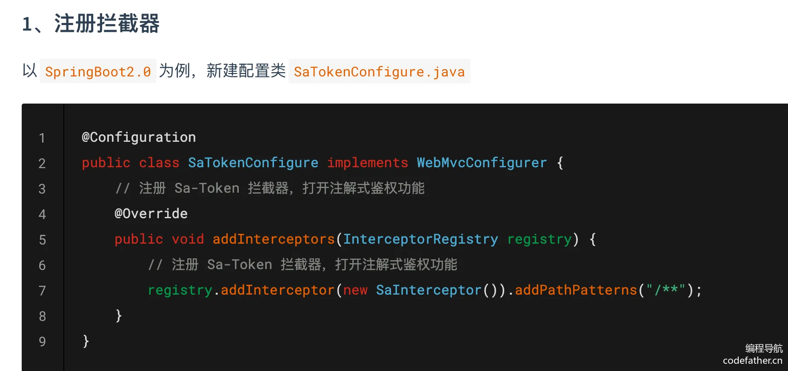

但由于我们使用了多账号体系，每次使用注解时都要指定账号体系的 loginType，会比较麻烦：

```java
@SaCheckLogin(type = StpUserUtil.TYPE)
```

所以可以参考官方文档，使用 [注解合并](https://sa-token.cc/doc.html#/up/many-account?id=_7、使用注解合并简化代码) 简化代码。在 `auth.annotation` 包下新建 Sa-Token 配置类，开启注解鉴权和注解合并：

```java
@Configuration
public class SaTokenConfigure implements WebMvcConfigurer {

    // 注册 Sa-Token 拦截器，打开注解式鉴权功能
    @Override
    public void addInterceptors(InterceptorRegistry registry) {
        // 注册 Sa-Token 拦截器，打开注解式鉴权功能
        registry.addInterceptor(new SaInterceptor()).addPathPatterns("/**");
    }

    @PostConstruct
    public void rewriteSaStrategy() {
        // 重写Sa-Token的注解处理器，增加注解合并功能 
        SaAnnotationStrategy.instance.getAnnotation = (element, annotationClass) -> {
            return AnnotatedElementUtils.getMergedAnnotation(element, annotationClass);
        };
    }
}
```

然后参考 [官方提供的示例代码](https://gitee.com/dromara/sa-token/blob/master/sa-token-demo/sa-token-demo-case/src/main/java/com/pj/satoken/merge_annotation/SaUserCheckPermission.java#)，在 `auth.annotation` 包下新建空间账号体系的鉴权注解：

```java
/**
 * 空间权限认证：必须具有指定权限才能进入该方法
 * <p> 可标注在函数、类上（效果等同于标注在此类的所有方法上）
 */
@SaCheckPermission(type = StpKit.SPACE_TYPE)
@Retention(RetentionPolicy.RUNTIME)
@Target({ElementType.METHOD, ElementType.TYPE})
public @interface SaSpaceCheckPermission {

    /**
     * 需要校验的权限码
     *
     * @return 需要校验的权限码
     */
    @AliasFor(annotation = SaCheckPermission.class)
    String[] value() default {};

    /**
     * 验证模式：AND | OR，默认AND
     *
     * @return 验证模式
     */
    @AliasFor(annotation = SaCheckPermission.class)
    SaMode mode() default SaMode.AND;

    /**
     * 在权限校验不通过时的次要选择，两者只要其一校验成功即可通过校验
     *
     * <p>
     * 例1：@SaCheckPermission(value="user-add", orRole="admin")，
     * 代表本次请求只要具有 user-add权限 或 admin角色 其一即可通过校验。
     * </p>
     *
     * <p>
     * 例2： orRole = {"admin", "manager", "staff"}，具有三个角色其一即可。 <br>
     * 例3： orRole = {"admin, manager, staff"}，必须三个角色同时具备。
     * </p>
     *
     * @return /
     */
    @AliasFor(annotation = SaCheckPermission.class)
    String[] orRole() default {};

}
```

之后就可以直接使用该注解了。

#### 6、应用权限注解

认真核对一遍各个操作接口的代码、以及接口调用的 Service 代码，包括图片操作 PictureController 和PictureService、空间成员操作 SpaceUserController 和 SpaceUserService。

1）给 Controller 接口补充上合适的权限注解，PictureController 图片接口：

```java
// 上传图片（可重新上传）
@PostMapping("/upload")
@SaSpaceCheckPermission(value = SpaceUserPermissionConstant.PICTURE_UPLOAD)
public BaseResponse<PictureVO> uploadPicture() {
}

// 通过 URL 上传图片（可重新上传）
@PostMapping("/upload/url")
@SaSpaceCheckPermission(value = SpaceUserPermissionConstant.PICTURE_UPLOAD)
public BaseResponse<PictureVO> uploadPictureByUrl() {
}

// 删除图片
@PostMapping("/delete")
@SaSpaceCheckPermission(value = SpaceUserPermissionConstant.PICTURE_DELETE)
public BaseResponse<Boolean> deletePicture() {
}

// 编辑图片（给用户使用）
@PostMapping("/edit")
@SaSpaceCheckPermission(value = SpaceUserPermissionConstant.PICTURE_EDIT)
public BaseResponse<Boolean> editPicture() {
}

// 根据颜色搜索图片
@PostMapping("/search/color")
@SaSpaceCheckPermission(value = SpaceUserPermissionConstant.PICTURE_VIEW)
public BaseResponse<List<PictureVO>> searchPictureByColor() {
}

// 批量编辑图片
@PostMapping("/edit/batch")
@SaSpaceCheckPermission(value = SpaceUserPermissionConstant.PICTURE_EDIT)
public BaseResponse<Boolean> editPictureByBatch() {
}

// 创建 AI 扩图任务
@PostMapping("/out_painting/create_task")
@SaSpaceCheckPermission(value = SpaceUserPermissionConstant.PICTURE_EDIT)
public BaseResponse<CreateOutPaintingTaskResponse> createPictureOutPaintingTask() {
}
```

SpaceUserController 接口：

```java
// 添加成员到空间
@PostMapping("/add")
@SaSpaceCheckPermission(value = SpaceUserPermissionConstant.SPACE_USER_MANAGE)
public BaseResponse<Long> addSpaceUser() {
}

// 从空间移除成员
@PostMapping("/delete")
@SaSpaceCheckPermission(value = SpaceUserPermissionConstant.SPACE_USER_MANAGE)
public BaseResponse<Boolean> deleteSpaceUser() {
}

// 查询某个成员在某个空间的信息
@PostMapping("/get")
@SaSpaceCheckPermission(value = SpaceUserPermissionConstant.SPACE_USER_MANAGE)
public BaseResponse<SpaceUser> getSpaceUser() {
}

// 查询成员信息列表
@PostMapping("/list")
@SaSpaceCheckPermission(value = SpaceUserPermissionConstant.SPACE_USER_MANAGE)
public BaseResponse<List<SpaceUserVO>> listSpaceUser() {
}

// 编辑成员信息（设置权限）
@PostMapping("/edit")
@SaSpaceCheckPermission(value = SpaceUserPermissionConstant.SPACE_USER_MANAGE)
public BaseResponse<Boolean> editSpaceUser() {
}
```

2）移除这些接口和相关服务原本的权限校验逻辑，比如 `PictureService#checkPictureAuth`，确保该方法变成了灰色（未被使用）。

还有 PictureServiceImpl 的 uploadPicture 方法中的权限校验，也要注释掉：

```java
//            // 校验是否有空间的权限，仅空间管理员才能上传
//            if (!loginUser.getId().equals(space.getUserId())) {
//                throw new BusinessException(ErrorCode.NO_AUTH_ERROR, "没有空间权限");
//            }

//            // 仅本人或管理员可编辑图片
//            if (!oldPicture.getUserId().equals(loginUser.getId()) && !userService.isAdmin(loginUser)) {
//                throw new BusinessException(ErrorCode.NO_AUTH_ERROR);
//            }
```

3）注意，只要加上了 Sa-Token 注解，框架就会强制要求用户登录，未登录会抛出异常。所以针对未登录也可以调用的接口，需要改为编程式权限校验，比如 getPictureVOById 和 listPictureVOByPage 方法。

```java
@GetMapping("/get/vo")
public BaseResponse<PictureVO> getPictureVOById(long id, HttpServletRequest request) {
    ThrowUtils.throwIf(id <= 0, ErrorCode.PARAMS_ERROR);
    // 查询数据库
    Picture picture = pictureService.getById(id);
    ThrowUtils.throwIf(picture == null, ErrorCode.NOT_FOUND_ERROR);
    // 空间的图片，需要校验权限
    Space space = null;
    Long spaceId = picture.getSpaceId();
    if (spaceId != null) {
        boolean hasPermission = StpKit.SPACE.hasPermission(SpaceUserPermissionConstant.PICTURE_VIEW);
        ThrowUtils.throwIf(!hasPermission, ErrorCode.NO_AUTH_ERROR);
    }
    PictureVO pictureVO = pictureService.getPictureVO(picture, request);
    // 获取封装类
    return ResultUtils.success(pictureVO);
}

@PostMapping("/list/page/vo")
public BaseResponse<Page<PictureVO>> listPictureVOByPage(@RequestBody PictureQueryRequest pictureQueryRequest, HttpServletRequest request) {
    long current = pictureQueryRequest.getCurrent();
    long size = pictureQueryRequest.getPageSize();
    // 限制爬虫
    ThrowUtils.throwIf(size > 20, ErrorCode.PARAMS_ERROR);
    // 空间权限校验
    Long spaceId = pictureQueryRequest.getSpaceId();
    // 公开图库
    if (spaceId == null) {
        // 普通用户默认只能查看已过审的公开数据
        pictureQueryRequest.setReviewStatus(PictureReviewStatusEnum.PASS.getValue());
        pictureQueryRequest.setNullSpaceId(true);
    } else {
        boolean hasPermission = StpKit.SPACE.hasPermission(SpaceUserPermissionConstant.PICTURE_VIEW);
        ThrowUtils.throwIf(!hasPermission, ErrorCode.NO_AUTH_ERROR);
    }
    // 查询数据库
    Page<Picture> picturePage = pictureService.page(new Page<>(current, size), pictureService.getQueryWrapper(pictureQueryRequest));
    // 获取封装类
    return ResultUtils.success(pictureService.getPictureVOPage(picturePage, request));
}
```

#### 7、全局异常处理

如果 Sa-Token 校验用户没有符合要求的权限、或者用户未登录，就会抛出它定义的异常，[参考文档](https://sa-token.cc/doc.html#/fun/exception-code?id=获取异常细分状态码)。

需要将框架的异常全局处理为我们自己定义的业务异常，在全局异常处理器中添加代码：

```java
@ExceptionHandler(NotLoginException.class)
public BaseResponse<?> notLoginException(NotLoginException e) {
    log.error("NotLoginException", e);
    return ResultUtils.error(ErrorCode.NOT_LOGIN_ERROR, e.getMessage());
}

@ExceptionHandler(NotPermissionException.class)
public BaseResponse<?> notPermissionExceptionHandler(NotPermissionException e) {
    log.error("NotPermissionException", e);
    return ResultUtils.error(ErrorCode.NO_AUTH_ERROR, e.getMessage());
}
```

#### 8、补充获取权限的接口

前面写的都是后端权限校验的代码，但对于用户来说，如果没有空间图片的编辑权限，进入空间详情页时不应该能看到编辑按钮。也就是说，前端也需要根据用户的权限来进行一些页面内容的展示和隐藏。

因此，后端需要将用户具有的权限返回给前端，帮助前端进行判断，这样就不用让前端编写复杂的角色和权限校验逻辑了。

思考下具体的使用场景：如果是团队空间（空间详情页）或团队空间的图片（图片详情页），返回给前端用户具有的权限（比如能否编辑、能否上传、能否删除、能否管理成员）。

1）比起新写一个获取权限的接口，我们可以直接在返回图片或空间详情时，额外传递权限列表。给 SpaceVO 和 PictureVO 新增权限列表字段：

```java
/**
 * 权限列表
 */
private List<String> permissionList = new ArrayList<>();
```

2）在 SpaceUserAuthManager 中新增获取权限列表的方法，注意要区分公共图库、私有空间和团队空间，对于有权限的情况，可以返回 “管理员权限” 列表。

```java
public List<String> getPermissionList(Space space, User loginUser) {
    if (loginUser == null) {
        return new ArrayList<>();
    }
    // 管理员权限
    List<String> ADMIN_PERMISSIONS = getPermissionsByRole(SpaceRoleEnum.ADMIN.getValue());
    // 公共图库
    if (space == null) {
        if (userService.isAdmin(loginUser)) {
            return ADMIN_PERMISSIONS;
        }
        return new ArrayList<>();
    }
    SpaceTypeEnum spaceTypeEnum = SpaceTypeEnum.getEnumByValue(space.getSpaceType());
    if (spaceTypeEnum == null) {
        return new ArrayList<>();
    }
    // 根据空间获取对应的权限
    switch (spaceTypeEnum) {
        case PRIVATE:
            // 私有空间，仅本人或管理员有所有权限
            if (space.getUserId().equals(loginUser.getId()) || userService.isAdmin(loginUser)) {
                return ADMIN_PERMISSIONS;
            } else {
                return new ArrayList<>();
            }
        case TEAM:
            // 团队空间，查询 SpaceUser 并获取角色和权限
            SpaceUser spaceUser = spaceUserService.lambdaQuery()
                    .eq(SpaceUser::getSpaceId, space.getId())
                    .eq(SpaceUser::getUserId, loginUser.getId())
                    .one();
            if (spaceUser == null) {
                return new ArrayList<>();
            } else {
                return getPermissionsByRole(spaceUser.getSpaceRole());
            }
    }
    return new ArrayList<>();
}
```

3）修改获取空间详情和图片详情的接口 getSpaceVOById、getPictureVOById，增加获取权限列表的逻辑。

获取空间详情接口：

```java
@GetMapping("/get/vo")
public BaseResponse<SpaceVO> getSpaceVOById(long id, HttpServletRequest request) {
    ThrowUtils.throwIf(id <= 0, ErrorCode.PARAMS_ERROR);
    // 查询数据库
    Space space = spaceService.getById(id);
    ThrowUtils.throwIf(space == null, ErrorCode.NOT_FOUND_ERROR);
    SpaceVO spaceVO = spaceService.getSpaceVO(space, request);
    User loginUser = userService.getLoginUser(request);
    List<String> permissionList = spaceUserAuthManager.getPermissionList(space, loginUser);
    spaceVO.setPermissionList(permissionList);
    // 获取封装类
    return ResultUtils.success(spaceVO);
}
```

获取图片详情接口，注意即使空间 id 不存在（公共图库）也要获取权限列表，管理员会获取到全部权限，这样前端才能顺利展示出操作按钮：

```java
@GetMapping("/get/vo")
public BaseResponse<PictureVO> getPictureVOById(long id, HttpServletRequest request) {
    ThrowUtils.throwIf(id <= 0, ErrorCode.PARAMS_ERROR);
    // 查询数据库
    Picture picture = pictureService.getById(id);
    ThrowUtils.throwIf(picture == null, ErrorCode.NOT_FOUND_ERROR);
    // 空间的图片，需要校验权限
    Space space = null;
    Long spaceId = picture.getSpaceId();
    if (spaceId != null) {
        boolean hasPermission = StpKit.SPACE.hasPermission(SpaceUserPermissionConstant.PICTURE_VIEW);
        ThrowUtils.throwIf(!hasPermission, ErrorCode.NO_AUTH_ERROR);
        space = spaceService.getById(spaceId);
        ThrowUtils.throwIf(space == null, ErrorCode.NOT_FOUND_ERROR, "空间不存在");
    }
    // 获取权限列表
    User loginUser = userService.getLoginUser(request);
    List<String> permissionList = spaceUserAuthManager.getPermissionList(space, loginUser);
    PictureVO pictureVO = pictureService.getPictureVO(picture, request);
    pictureVO.setPermissionList(permissionList);
    // 获取封装类
    return ResultUtils.success(pictureVO);
}
```

#### 9、接口测试

终于开发完了，我们会发现，细节实在是太多了，所以 **一定要进行严格的测试！！！**

用不同权限的用户去验证不同的空间类别（公共图库、私有空间、团队空间）。/MBNmaRtUhzDE9b4tB/jsqs1ClvvhzK+S4KVLPihc/I=

如何测试呢？

大家用的比较多的就是单元测试，但是单元测试想要测试携带登录态的 Controller 接口是比较麻烦的。所以我们可以采用自动化接口测试，比如 Postman 等。

此处为了方便，我们直接使用 IDEA 自带的 REST API 测试，可以将测试参数和测试接口保存为文件，每次修改代码后，改改参数，执行文件就能整体测试了。

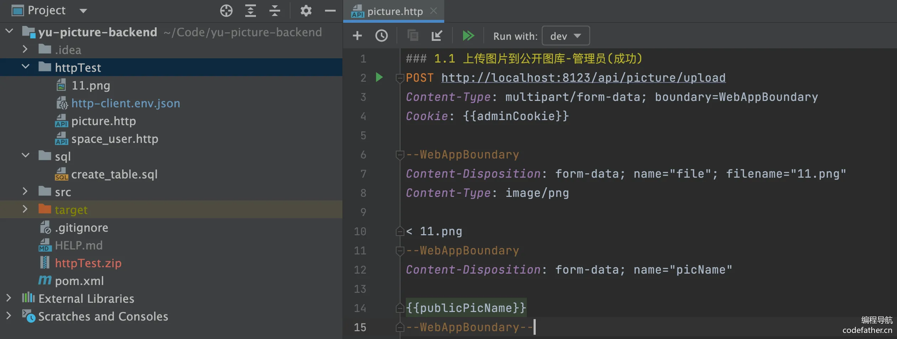

由于要测试的情况较多，鱼皮给大家准备好了测试代码，直接下载使用即可：[📎httpTest.zip](https://yuyuanweb.yuque.com/attachments/yuque/0/2024/zip/398476/1735475537929-926babdb-fe15-4718-a4bf-8cb1751ed754.zip)


至此，空间成员权限控制开发完成，大家会发现还是挺麻烦的。其实如果没有公共图库的概念的话，开发起来就轻松很多。因此 Sa-Token 等权限框架要按需使用，更适合复杂的、企业内部的权限管理系统。

如果你想开发起来更轻松一些，推荐其他的实现方式：

1. 直接封装权限校验方法，在业务代码中调用
2. 将团队空间图片的增删改查提取为独立的接口，单独进行权限校验，不影响公共图库

#### 扩展

1）可以给空间操作（SpaceController）、空间分析操作（SpaceAnalyzeController）增加统一的权限校验

### 空间数据管理

根据需求和方案设计，我们要将旗舰版团队空间的图片数据进行单独管理，每个团队空间的图片数据存储到一张单独的表中，也就是 **分表**。

#### 1、什么是分库分表？

分库分表是一种将数据拆分到多个数据库或数据表中的设计策略，主要用于解决随着业务数据量和访问量增长带来的数据库性能问题。

通过分库分表，可以减小单库或单表的数据量和访问压力，从而提高查询和写入效率、增强系统的高并发能力、优化大数据量下的性能表现；同时降低单点故障风险，实现更好的系统扩展性和容灾能力。

#### 2、分库分表实现

如果让我们自己实现分库分表，应该怎么做呢？

思路主要是基于业务需求设计 **数据分片规则**，将数据按一定策略（如取模、哈希、范围或时间）分散存储到多个库或表中，同时开发路由逻辑来决定查询或写入操作的目标库表。

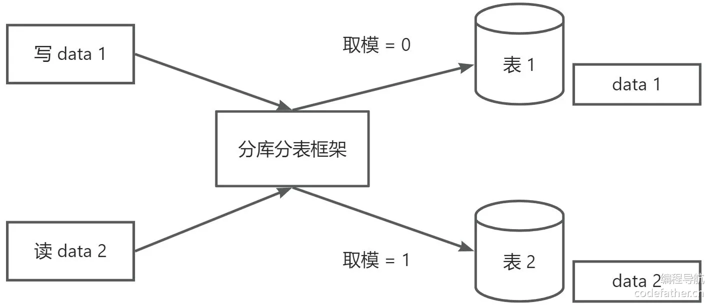

简单来说，就是将数据写到不同的表、并且从相同的表读取数据，其实通过给 SQL 表名拼接动态参数就能实现：

```sql
select * from table_${分片唯一标识}
```

但这只是最简单的情况，实际上，分库分表还涉及跨库表查询、事务一致性、分页聚合等复杂场景，还可能需要配套设计监控、扩容和迁移方案以确保系统的可维护性和扩展性。

所以，不建议自己实现分库分表。本项目中，鱼皮将使用主流的分库分表框架 [Apache ShardingSphere](https://shardingsphere.apache.org/) 带大家实现。XJ858sBsdVoQsBlQbSlEZH9bgQFu4XZchClXOymxgUA=

#### 3、ShardingSphere 分库分表

Apache ShardingSphere 提供了开箱即用的分片策略、灵活的配置能力以及对跨库查询、事务一致性、读写分离等复杂功能的全面支持。

它又分为 2 大核心模块 ShardingSphere-JDBC 和 ShardingSphere-Proxy，我用一张表格来列举 2 者的区别：

| 维度     | ShardingSphere JDBC                | ShardingSphere Proxy                       |
| -------- | ---------------------------------- | ------------------------------------------ |
| 运行方式 | 嵌入式运行在应用内部               | 独立代理，运行在应用与数据库之间           |
| 性能     | 低网络开销，性能较高               | 引入网络开销，性能略低sql                  |
| 支持语言 | 仅支持 Java                        | 支持多语言（Java、Python、Go 等）          |
| 配置管理 | 分布式配置较复杂                   | 支持集中配置和动态管理                     |
| 扩展性   | 随着应用扩展，需单独调整配置       | 代理服务集中化管理，扩展性强               |
| 适用场景 | 单体或小型系统，对性能要求高的场景 | 多语言、大型分布式系统或需要统一管理的场景 |

对大多数 Java 项目来说，选择 ShardingSphere-JDBC 就足够了；对于跨语言的大型分布式项目、或者公司内有技术部门统一管理基础设施的情况下，再考虑使用 ShardingSphere-Proxy。

本项目也将使用 ShardingSphere-JDBC，在依赖文件中引入：

```xml
<!-- 分库分表 -->
<dependency>
    <groupId>org.apache.shardingsphere</groupId>
    <artifactId>shardingsphere-jdbc-core-spring-boot-starter</artifactId>
    <version>5.2.0</version>
</dependency>
```

#### 4、分库分表策略 - 静态分表

分库分表的策略总体分为 2 类：静态分表和动态分表，下面先讲静态分表。Kvj0N9UsvjnA2JCtBYVVlZvRih721R4WfPhhdfsvDfk=

在设计阶段，分表的数量和规则就是固定的，不会根据业务增长动态调整，比如 picture_0、picture_1。

分片规则通常基于某一字段（如图片 id）通过简单规则（如取模、范围）来决定数据存储在哪个表或库中。

这种方式的优点是简单、好理解；缺点是不利于扩展，随着数据量增长，可能需要手动调整分表数量并迁移数据。

举个例子，图片表按图片 id 对 4 取模拆分：

```java
String tableName = "picture_" + (pictureId % 4); // picture_0 ~ picture_3
```

静态分表的实现很简单，直接在 `application.yml` 中编写 ShardingSphere 的配置就能完成分库分表，比如：

```yaml
rules:
  sharding:
    tables:
      picture:
        actualDataNodes: ds0.picture_${0..2} # 3张分表：picture_0, picture_1, picture_2
        tableStrategy:
          standard:
            shardingColumn: pictureId       # 按 pictureId 分片
            shardingAlgorithmName: pictureIdMod
    shardingAlgorithms:
      pictureIdMod:
        type: INLINE
        props:
          algorithm-expression: picture_${pictureId % 3} # 分片表达式
```

你甚至不需要修改任何业务代码，在查询 picture 表（一般叫逻辑表）时，框架会自动帮你修改 SQL，根据 pictureId 将查询请求路由到不同的表中。如果要进行分页多条数据查询，你只需要写一条查询逻辑表的 SQL 语句即可：

```plain
SELECT * FROM picture;
```

实际上，ShardingSphere 将查询逻辑表 `picture` 的请求自动路由到所有实际分表 picture_1、picture_2 ... picture_N，获取到数据后，在中间件层自动合并结果并返回给应用程序。

#### **5、分库分表策略 - 动态分表**

动态分表是指分表的数量可以根据业务需求或数据量动态增加，表的结构和规则是运行时动态生成的。举个例子，根据时间动态创建 picture_2025_01、picture_2025_02。

```java
String tableName = "picture_" + LocalDate.now().format(
    DateTimeFormatter.ofPattern("yyyy_MM")
);
```

显然，动态分表更灵活、扩展性强，适合数据量快速增长的场景；但缺点是实现更复杂，需要动态生成表并维护表的元信息。如果没有控制好，说不定分表特别多，反而影响了数据库的性能。

动态分表的实现就比较麻烦了，首先要自定义分表算法类，还要在代码中编写动态创建表的逻辑。

自定义分表算法类：

```java
public class PictureShardingAlgorithm implements StandardShardingAlgorithm<Long> {

    @Override
    public String doSharding(Collection<String> availableTargetNames, PreciseShardingValue<Long> preciseShardingValue) {
        // 编写分表逻辑，返回实际要查询的表名
        // picture_0 物理表，picture 逻辑表
    }

    @Override
    public Collection<String> doSharding(Collection<String> collection, RangeShardingValue<Long> rangeShardingValue) {
        return new ArrayList<>();
    }

    @Override
    public Properties getProps() {
        return null;
    }

    @Override
    public void init(Properties properties) {

    }
}
```

对于我们的项目，由于空间是用户动态创建的，显然要使用动态分表，下面来实现。

#### 6、动态分表算法开发

根据需求，我们希望将每个旗舰版空间的图片单独存放在一起，显然是按照 `spaceId` 分表，那么分表的名称规则为 `picture_${spaceId}`。

1）首先编写动态分表的配置，包括数据库连接、分表规则、分表算法：

```yaml
spring:
  # 空间图片分表
  shardingsphere:
    datasource:
      names: yu_picture
      yu_picture:
        type: com.zaxxer.hikari.HikariDataSource
        driver-class-name: com.mysql.cj.jdbc.Driver
        url: jdbc:mysql://localhost:3306/yu_picture
        username: root
        password: 123456
    rules:
      sharding:
        tables:
          picture:
            actual-data-nodes: yu_picture.picture  # 动态分表
            table-strategy:
              standard:
                sharding-column: spaceId
                sharding-algorithm-name: picture_sharding_algorithm  # 使用自定义分片算法
        sharding-algorithms:
          picture_sharding_algorithm:
            type: CLASS_BASED
            props:
              strategy: standard
              algorithmClassName: com.yupi.yupicturebackend.manager.sharding.PictureShardingAlgorithm
    props:
      sql-show: true
```

其中，有几个细节需要注意：

1. `actual-data-nodes` 一般情况下是指定一段分表的范围，比如 `yu_picture.picture_${0..9999}` 表示有 picture_0 ~ picture_9999 这 10000 张分表。ShardingSphere 在执行分表查询时会校验要查询的表（比如 picture_123456789）是否在 actual-data-nodes 的配置范围内。但是由于 spaceId 是长整型，范围太大，无法通过指定范围将所有分表名称包含，导致无法通过框架内置的校验。所以此处将 actual-data-nodes 的值设置为逻辑表 `yu_picture.picture`。
2. 指定分表字段为 spaceId、分表算法为自定义的分片算法 `picture_sharding_algorithm`。
3. 配置自定义分片算法，采用基于自定义类的方式实现，算法的类名配置必须为类的绝对路径。

2）编写图片分表算法类，必须实现 `StandardShardingAlgorithm` 接口。核心是编写 doSharding 方法，根据 spaceId 获取到实际要查询的分表名，如果 spaceId 不存在分表（比如是私有空间）或者 spaceId 为空（公共图库），那么就从原表（逻辑表）picture 查询。

之所以要做兼容，是因为虽然我们设计上只对团队空间进行分库分表，但是一旦引入了分库分表框架，查询 picture 表时就会触发分表逻辑。

在 `manager.sharding` 包下新建分表算法类：

```java
public class PictureShardingAlgorithm implements StandardShardingAlgorithm<Long> {

    @Override
    public String doSharding(Collection<String> availableTargetNames, PreciseShardingValue<Long> preciseShardingValue) {
        Long spaceId = preciseShardingValue.getValue();
        String logicTableName = preciseShardingValue.getLogicTableName();
        // spaceId 为 null 表示查询所有图片
        if (spaceId == null) {
            return logicTableName;
        }
        // 根据 spaceId 动态生成分表名
        String realTableName = "picture_" + spaceId;
        if (availableTargetNames.contains(realTableName)) {
            return realTableName;
        } else {
            return logicTableName;
        }
    }

    @Override
    public Collection<String> doSharding(Collection<String> collection, RangeShardingValue<Long> rangeShardingValue) {
        return new ArrayList<>();
    }

    @Override
    public Properties getProps() {
        return null;
    }

    @Override
    public void init(Properties properties) {

    }
}
```

3）光有上述代码还不能完成动态分表，因为 availableTargetNames（可用的分表）始终为逻辑表名 `picture`！原因在于 ShardingSphere 在分片逻辑初始化时默认获取的是配置的 `actual-data-nodes` 中的目标表名，也就是我们写的固定值。这样还是无法通过 ShardingSphere 的查询校验，我们也没办法判断 spaceId 是否要分表：

```java
// availableTargetNames 始终为 picture，无法返回真实的分表
if (availableTargetNames.contains(realTableName)) {
    return realTableName;
} else {
    return logicTableName;
}
```

既然框架自身不支持动态维护分表，那我们可以写一个分表管理器，自己来维护分表列表，并更新到 ShardingSphere 的 `actual-data-nodes` 配置中。

在 `manager.sharding` 包下新建分表管理器类：

```java
@Component
@Slf4j
public class DynamicShardingManager {

    @Resource
    private DataSource dataSource;

    @Resource
    private SpaceService spaceService;

    private static final String LOGIC_TABLE_NAME = "picture";

    private static final String DATABASE_NAME = "logic_db"; // 配置文件中的数据库名称

    @PostConstruct
    public void initialize() {
        log.info("初始化动态分表配置...");
        updateShardingTableNodes();
    }

    /**
     * 获取所有动态表名，包括初始表 picture 和分表 picture_{spaceId}
     */
    private Set<String> fetchAllPictureTableNames() {
        // 为了测试方便，直接对所有团队空间分表（实际上线改为仅对旗舰版生效）
        Set<Long> spaceIds = spaceService.lambdaQuery()
                .eq(Space::getSpaceType, SpaceTypeEnum.TEAM.getValue())
                .list()
                .stream()
                .map(Space::getId)
                .collect(Collectors.toSet());
        Set<String> tableNames = spaceIds.stream()
                .map(spaceId -> LOGIC_TABLE_NAME + "_" + spaceId)
                .collect(Collectors.toSet());
        tableNames.add(LOGIC_TABLE_NAME); // 添加初始逻辑表
        return tableNames;
    }

    /**
     * 更新 ShardingSphere 的 actual-data-nodes 动态表名配置
     */
    private void updateShardingTableNodes() {
        Set<String> tableNames = fetchAllPictureTableNames();
        String newActualDataNodes = tableNames.stream()
                .map(tableName -> "yu_picture." + tableName) // 确保前缀合法
                .collect(Collectors.joining(","));
        log.info("动态分表 actual-data-nodes 配置: {}", newActualDataNodes);

        ContextManager contextManager = getContextManager();
        ShardingSphereRuleMetaData ruleMetaData = contextManager.getMetaDataContexts()
                .getMetaData()
                .getDatabases()
                .get(DATABASE_NAME)
                .getRuleMetaData();

        Optional<ShardingRule> shardingRule = ruleMetaData.findSingleRule(ShardingRule.class);
        if (shardingRule.isPresent()) {
            ShardingRuleConfiguration ruleConfig = (ShardingRuleConfiguration) shardingRule.get().getConfiguration();
            List<ShardingTableRuleConfiguration> updatedRules = ruleConfig.getTables()
                    .stream()
                    .map(oldTableRule -> {
                        if (LOGIC_TABLE_NAME.equals(oldTableRule.getLogicTable())) {
                            ShardingTableRuleConfiguration newTableRuleConfig = new ShardingTableRuleConfiguration(LOGIC_TABLE_NAME, newActualDataNodes);
                            newTableRuleConfig.setDatabaseShardingStrategy(oldTableRule.getDatabaseShardingStrategy());
                            newTableRuleConfig.setTableShardingStrategy(oldTableRule.getTableShardingStrategy());
                            newTableRuleConfig.setKeyGenerateStrategy(oldTableRule.getKeyGenerateStrategy());
                            newTableRuleConfig.setAuditStrategy(oldTableRule.getAuditStrategy());
                            return newTableRuleConfig;
                        }
                        return oldTableRule;
                    })
                    .collect(Collectors.toList());
            ruleConfig.setTables(updatedRules);
            contextManager.alterRuleConfiguration(DATABASE_NAME, Collections.singleton(ruleConfig));
            contextManager.reloadDatabase(DATABASE_NAME);
            log.info("动态分表规则更新成功！");
        } else {
            log.error("未找到 ShardingSphere 的分片规则配置，动态分表更新失败。");
        }
    }

    /**
     * 获取 ShardingSphere ContextManager
     */
    private ContextManager getContextManager() {
        try (ShardingSphereConnection connection = dataSource.getConnection().unwrap(ShardingSphereConnection.class)) {
            return connection.getContextManager();
        } catch (SQLException e) {
            throw new RuntimeException("获取 ShardingSphere ContextManager 失败", e);
        }
    }
}
```

上述代码虽然看起来比较复杂，但其实不难理解，主要做了这么几件事：

1. 将管理器注册为 Bean，通过 `@PostConstruct` 注解，在 Bean 加载后获取所有的分表并更新配置。
2. 编写获取分表列表的方法，从数据库中查询符合要求的空间列表，再补充上逻辑表，就得到了完整的分表列表。
3. 更新 ShardingSphere 的 actual-data-nodes 动态表名配置。获取到 ShardingSphere 的 ContextManager，找到配置文件中的那条规则进行更新即可。

4）动态创建分表sql

在分表管理器中新增动态创建分表的方法，通过拼接 SQL 的方式创建出和 picture 表结构一样的分表，创建新的分表后记得更新分表节点。代码如下：

```java
public void createSpacePictureTable(Space space) {
    // 动态创建分表
    // 仅为旗舰版团队空间创建分表
    if (space.getSpaceType() == SpaceTypeEnum.TEAM.getValue() && space.getSpaceLevel() == SpaceLevelEnum.FLAGSHIP.getValue()) {
        Long spaceId = space.getId();
        String tableName = "picture_" + spaceId;
        // 创建新表
        String createTableSql = "CREATE TABLE " + tableName + " LIKE picture";
        try {
            SqlRunner.db().update(createTableSql);
            // 更新分表
            updateShardingTableNodes();
        } catch (Exception e) {
            log.error("创建图片空间分表失败，空间 id = {}", space.getId());
        }
    }
}
```

注意，想要使用 MyBatis Plus 的 SqlRunner，必须要开启配置：

```yaml
mybatis-plus:
  global-config:
    enable-sql-runner: true
```

然后在创建空间时，调用该方法：

```java
// 如果是团队空间，关联新增团队成员记录
if (SpaceTypeEnum.TEAM.getValue() == spaceAddRequest.getSpaceType()) {
    SpaceUser spaceUser = new SpaceUser();
    spaceUser.setSpaceId(space.getId());
    spaceUser.setUserId(userId);
    spaceUser.setSpaceRole(SpaceRoleEnum.ADMIN.getValue());
    result = spaceUserService.save(spaceUser);
    ThrowUtils.throwIf(!result, ErrorCode.OPERATION_ERROR, "创建团队成员记录失败");
}
// 创建分表
dynamicShardingManager.createSpacePictureTable(space);
// 返回新写入的数据 id
return space.getId();
```

至此，动态分表就开发完成了。

💡 其实 ShardingSphere 还提供了 **hint 强制分表路由机制** 来实现动态分表，允许在代码中强制指定具体的物理表，从而解决动态分表问题。但缺点是需要在每次查询或者操作数据时都显式设置表名，会给代码增加很多额外逻辑，不够优雅。所以不采用，大家了解一下即可。

#### 7、测试

分表是个对系统影响很大的操作，所以要进行严格的测试。

如果启动项目时出现了循环依赖：


可以添加 Lazy 注解解决：

```java
@Resource
@Lazy
private DynamicShardingManager dynamicShardingManager;
```

1）单独查询某个图片，不指定 spaceId 查询条件时，会自动查所有的 picture 表：

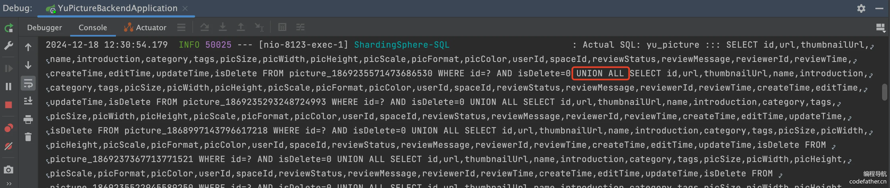

历史数据会自动兼容，只要查到的 spaceId 没有分表，都会查原来的 picture 表。只有指定 spaceId 且存在分表时，才会查询特定的单张分表。

2）查询图片列表，不指定 spaceId 或 nullSpaceId（查询 spaceId 为 null 的值）时，会自动查所有的 picture 表。所以查询时间会随着分表数增加：

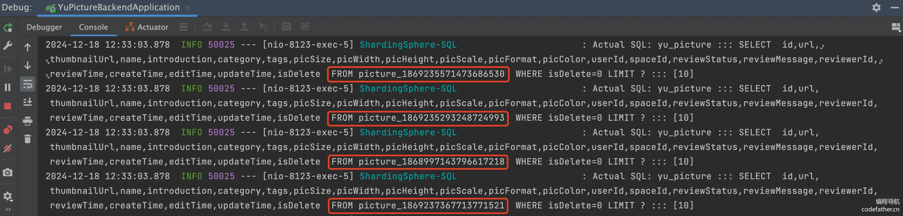

3）测试数据插入。插入时如果想往公共空间插入（不指定 spaceId），就会报错，因为 ShardingSphere 不知道要把数据插入到哪个表中。

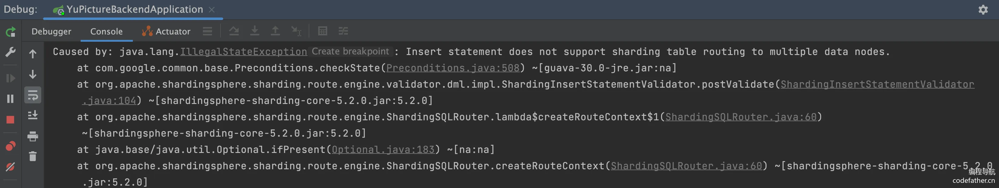

**这就意味着，如果你要使用分表，spaceId 必须不能为 null！**

为了解决这个问题，插入时一定要指定 spaceId，可以约定公共空间的 spaceId 都为 0，并且在插入时为 spaceId 设置默认值 0。

```java
// 补充空间 id，默认为 0
if (spaceId == null) {
    picture.setSpaceId(0L);
}
```

**注意，增删改查时都要补充 spaceId，才能避免报错和多表查询影响效率。**

比如查询单个图片，改为通过 QueryWrapper 指定 spaceId 查询：

```java
// 构造 QueryWrapper
QueryWrapper<Picture> queryWrapper = new QueryWrapper<>();
queryWrapper.eq("id", id)         // 根据主键 id 查询
            .eq("spaceId", spaceId); // 附加 spaceId 条件

// 执行查询
Picture picture = pictureService.getOne(queryWrapper);
```

构造图片分页查询条件时，如果查询公共图库，spaceId 改为 0：

```java
queryWrapper.eq(nullSpaceId, "spaceId", 0);
// queryWrapper.isNull(nullSpaceId, "spaceId");
```

更新 / 批量更新图片时，设置 spaceId 作为查询条件：

```java
// 构造 UpdateWrapper
UpdateWrapper<Picture> updateWrapper = new UpdateWrapper<>();
updateWrapper.eq("id", picture.getId()) // 指定主键条件，批量更新则使用 in 传递多条
             .eq("spaceId", xxx);      // 补充条件 spaceId=xxx

// 执行更新
boolean result = pictureService.update(picture, updateWrapper);
```

删除图片时，设置 spaceId 作为查询条件：

```java
// 构造 QueryWrapper
QueryWrapper<Picture> queryWrapper = new QueryWrapper<>();
queryWrapper.eq("id", id)         // 指定主键 ID
            .eq("spaceId", spaceId); // 附加 spaceId 条件

// 执行删除
boolean result = pictureService.remove(queryWrapper);
```

**注意，分表后，picture 的 spaceId 将不能修改！！！**

经过开发和测试，你会发现动态分库分表的实现非常麻烦。某些单表的查询性能是高了，但整体查询的性能可能会减少，所以原则上 **非必要不分表**，一定要找到合适的应用场景。

考虑到让更多同学后续直接部署项目，降低理解成本，教程中就不带大家实际执行上述改造细节了，并且我再教大家一种可以关闭分库分表的方法。

#### 8、关闭分库分表（可选）

1）启动类排除依赖（配置文件可以不注释）：

```java
@SpringBootApplication(exclude = {ShardingSphereAutoConfiguration.class})
```

2）注释掉分库分表管理器组件 DynamicShardingManager：

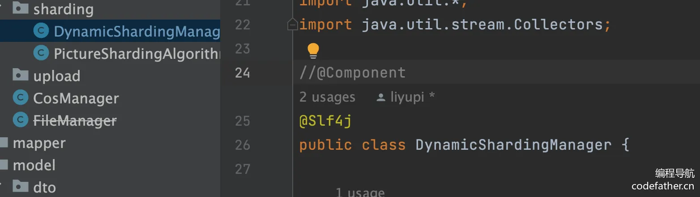

3）注释掉使用 DynamicShardingManager 方法的代码，比如空间服务中对其的引用、创建分表的代码：

```java
// @Resource
// @Lazy
// private DynamicShardingManager dynamicShardingManager;

// 创建分表
// dynamicShardingManager.createSpacePictureTable(space);
```

#### 参考文章

- 关于动态更新 actual-data-nodes：https://www.yuque.com/linghengqian/meve2v/cgi5en
- 相关 issue：https://github.com/apache/shardingsphere/issues/21503
- 开源社区的讨论：https://github.com/apache/shardingsphere/discussions/12258#discussioncomment-3917927

## 四、前端开发

团队空间的前端开发工作量不大，因为绝大多数页面都可以复用私有空间。

### 基础代码

首先根据后端的枚举类和常量，定义空间类型相关常量、空间角色相关常量、空间权限常量：

```typescript
// 空间类型枚举
export const SPACE_TYPE_ENUM = {
  PRIVATE: 0,
  TEAM: 1,
}

// 空间类型文本映射
export const SPACE_TYPE_MAP: Record<number, string> = {
  0: '私有空间',
  1: '团队空间',
}

// 空间类型选项映射
export const SPACE_TYPE_OPTIONS = Object.keys(SPACE_TYPE_MAP).map((key) => {
  const value = Number(key) // 将字符串 key 转换为数字
  return {
    label: SPACE_TYPE_MAP[value],
    value,
  }
})

// 空间角色枚举
export const SPACE_ROLE_ENUM = {
  VIEWER: "viewer",
  EDITOR: "editor",
  ADMIN: "admin",
} as const;

// 空间角色文本映射
export const SPACE_ROLE_MAP: Record<string, string> = {
  viewer: "浏览者",
  editor: "编辑者",
  admin: "管理员",
};

// 空间角色选项映射
export const SPACE_ROLE_OPTIONS = Object.keys(SPACE_ROLE_MAP).map((key) => {
  return {
    label: SPACE_ROLE_MAP[key],
    value: key,
  };
});

/**
 * 空间权限常量
 */
export const SPACE_PERMISSION_ENUM = {
  SPACE_USER_MANAGE: "spaceUser:manage",
  PICTURE_VIEW: "picture:view",
  PICTURE_UPLOAD: "picture:upload",
  PICTURE_EDIT: "picture:edit",
  PICTURE_DELETE: "picture:delete",
} as const;
```

### 创建团队空间

#### 1、创建团队空间页面

可以复用创建私有空间页面，通过请求参数的 type 字段来区分创建团队空间（type=1）还是私有空间（不传 type 或为 0）。

1）创建私有空间页面新增空间类别变量：

```typescript
// 空间类别
const spaceType = computed(() => {
  if (route.query?.type) {
    return Number(route.query.type)
  }
  return SPACE_TYPE_ENUM.PRIVATE
})
```

2）提交表单时，额外传递 spaceType 字段：

```typescript
// 创建
res = await addSpaceUsingPost({
  ...formData,
  spaceType: spaceType.value
})
```

3）还可以修改标题的展示，体现出空间类别：

```vue
<h2 style="margin-bottom: 16px">
  {{ route.query?.id ? '修改' : '创建' }}{{ SPACE_TYPE_MAP[spaceType] }}
</h2>
```

效果如图：

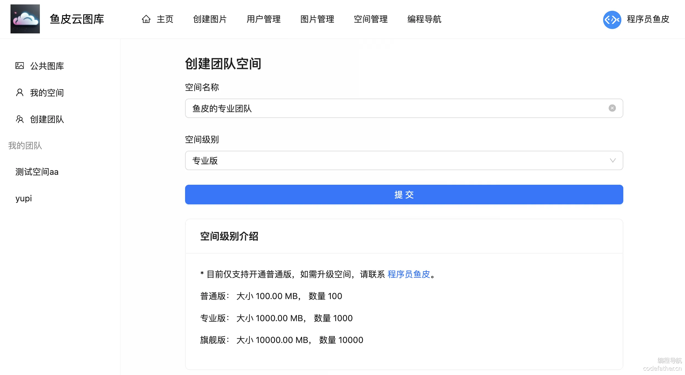

#### 2、创建团队空间入口

1）给全局侧边栏增加创建团队按钮：

```typescript
// 固定的菜单列表
const fixedMenuItems = [
  {
    key: '/',
    label: '公共图库',
    icon: () => h(PictureOutlined),
  },
  {
    key: '/my_space',
    label: '我的空间',
    icon: () => h(UserOutlined),
  },
  {
    key: '/add_space?type=' + SPACE_TYPE_ENUM.TEAM,
    label: '创建团队',
    icon: () => h(TeamOutlined),
  },
]
```

2）点击菜单事件要改为 `router.push(key)`，否则无法携带参数跳转：

```typescript
// 路由跳转事件
const doMenuClick = ({ key }: { key: string }) => {
  router.push(key)
}
```

3）在全局侧边栏中加载 “我的团队空间列表”，每个团队空间作为一个菜单项展示。最终展示的菜单项 = 固定菜单 + 团队空间菜单，代码如下：

```typescript
const teamSpaceList = ref<API.SpaceUserVO[]>([])
const menuItems = computed(() => {
  // 没有团队空间，只展示固定菜单
  if (teamSpaceList.value.length < 1) {
    return fixedMenuItems;
  }
  // 展示团队空间分组
  const teamSpaceSubMenus = teamSpaceList.value.map((spaceUser) => {
    const space = spaceUser.space
    return {
      key: '/space/' + spaceUser.spaceId,
      label: space?.spaceName,
    }
  })
  const teamSpaceMenuGroup = {
    type: 'group',
    label: '我的团队',
    key: 'teamSpace',
    children: teamSpaceSubMenus,
  }
  return [...fixedMenuItems, teamSpaceMenuGroup]
})

// 加载团队空间列表
const fetchTeamSpaceList = async () => {
  const res = await listMyTeamSpaceUsingPost()
  if (res.data.code === 0 && res.data.data) {
    teamSpaceList.value = res.data.data
  } else {
    message.error('加载我的团队空间失败，' + res.data.message)
  }
}

/**
 * 监听变量，改变时触发数据的重新加载
 */
watchEffect(() => {
  // 登录才加载
  if (loginUserStore.loginUser.id) {
    fetchTeamSpaceList()
  }
})
```

效果如图：

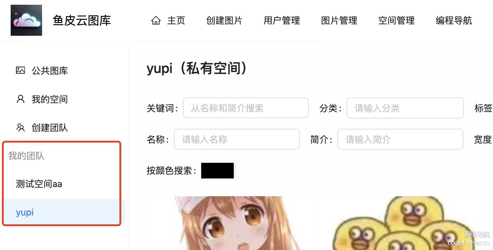

### 空间成员管理

#### 1、成员管理页面入口

空间详情页的空间分析按钮左边增加成员管理按钮，点击后跳转到成员管理页面：

```vue
<a-button
  type="primary"
  ghost
  :icon="h(TeamOutlined)"
  :href="`/spaceUserManage/${id}`"
  target="_blank"
>
  成员管理
</a-button>
```

该页面还有一些细节可以优化，比如修改标题展示，区分空间类别：

```vue
<h2>{{ space.spaceName }}（{{ SPACE_TYPE_MAP[space.spaceType] }}）</h2>
```

切换空间时，应该重新获取空间信息和图片列表。可以使用 watch 来监听空间 id 变量实现：

```typescript
watch(
  () => props.id,
  (newSpaceId) => {
    fetchSpaceDetail()
    fetchData()
  },
)
```

效果如图：

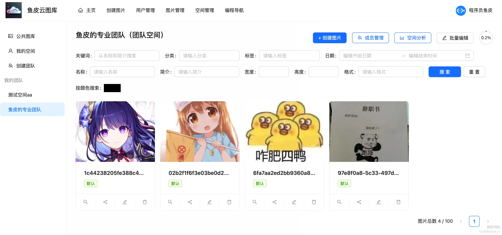

#### 2、空间成员管理页面

参考语雀的空间成员管理，页面结构为添加成员表单 + 成员信息表格：

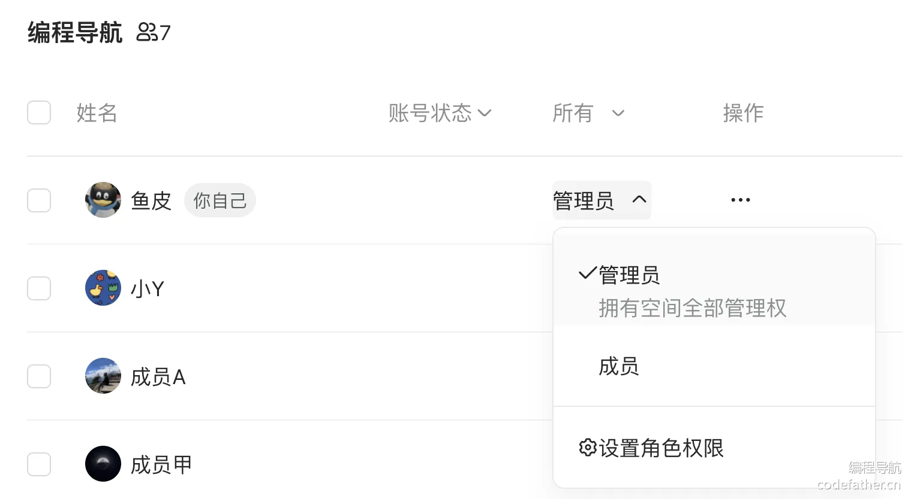

1）复制空间管理页面，新建路由，该页面接受空间 id 作为动态参数，展示某个空间下的成员列表：

```typescript
{
  path: '/spaceUserManage/:id',
  name: '空间成员管理',
  component: SpaceUserManagePage,
  props: true,
},
```

该页面绝大多数代码都可以复用空间管理页面，只需要遵循流程修改即可。

2）定义表格列：

```typescript
// 表格列
const columns = [
  {
    title: '用户',
    dataIndex: 'userInfo',
  },
  {
    title: '角色',
    dataIndex: 'spaceRole',
  },
  {
    title: '创建时间',
    dataIndex: 'createTime',
  },
  {
    title: '操作',
    key: 'action',
  },
]
```

3）调用接口以获取表格数据，此处不需要分页，直接展示所有成员：

```typescript
// 定义属性
interface Props {
  id: string
}

const props = defineProps<Props>()

// 数据
const dataList = ref([])

// 获取数据
const fetchData = async () => {
  const spaceId = props.id
  if (!spaceId) {
    return
  }
  const res = await listSpaceUserUsingPost({
    spaceId,
  })
  if (res.data.data) {
    dataList.value = res.data.data ?? []
  } else {
    message.error('获取数据失败，' + res.data.message)
  }
}

// 页面加载时请求一次
onMounted(() => {
  fetchData()
})
```

4）自定义表格列，展示用户信息、空间角色、创建时间和操作按钮。由于可修改的成员信息只有 “角色”，所以可以直接将空间角色渲染为下拉框选择器组件，便于管理员操作。

```vue
<a-table :columns="columns" :data-source="dataList">
  <template #bodyCell="{ column, record }">
    <template v-if="column.dataIndex === 'userInfo'">
      <a-space>
        <a-avatar :src="record.user?.userAvatar" />
        {{ record.user?.userName }}
      </a-space>
    </template>
    <template v-if="column.dataIndex === 'spaceRole'">
      <a-select
        v-model:value="record.spaceRole"
        :options="SPACE_ROLE_OPTIONS"
        @change="(value) => editSpaceRole(value, record)"
      />
    </template>
    <template v-else-if="column.dataIndex === 'createTime'">
      {{ dayjs(record.createTime).format('YYYY-MM-DD HH:mm:ss') }}
    </template>
    <template v-else-if="column.key === 'action'">
      <a-space wrap>
        <a-button type="link" danger @click="doDelete(record.id)">删除</a-button>
      </a-space>
    </template>
  </template>
</a-table>
```

编辑空间角色的函数：

```typescript
const editSpaceRole = async (value, record) => {
  const res = await editSpaceUserUsingPost({
    id: record.id,
    spaceRole: value,
  })
  if (res.data.code === 0) {
    message.success('修改成功')
  } else {
    message.error('修改失败，' + res.data.message)
  }
}
```

删除成员的函数：

```typescript
const doDelete = async (id: string) => {
  if (!id) {
    return
  }
  const res = await deleteSpaceUserUsingPost({ id })
  if (res.data.code === 0) {
    message.success('删除成功')
    // 刷新数据
    fetchData()
  } else {
    message.error('删除失败')
  }
}
```

5）在表格上方编写添加成员表单，默认角色是 “浏览者”

```vue
<a-form layout="inline" :model="formData" @finish="handleSubmit">
  <a-form-item label="用户 id" name="userId">
    <a-input v-model:value="formData.userId" placeholder="请输入用户 id" allow-clear />
  </a-form-item>
  <a-form-item>
    <a-button type="primary" html-type="submit">添加用户</a-button>
  </a-form-item>
</a-form>
```

编写表单项变量和提交函数：

```typescript
// 添加用户
const formData = reactive<API.SpaceUserAddRequest>({})

const handleSubmit = async () => {
  const spaceId = props.id
  if (!spaceId) {
    return
  }
  const res = await addSpaceUserUsingPost({
    spaceId,
    ...formData,
  })
  if (res.data.code === 0) {
    message.success('添加成功')
    // 刷新数据
    fetchData()
  } else {
    message.error('添加失败，' + res.data.message)
  }
}
```

页面效果如图：

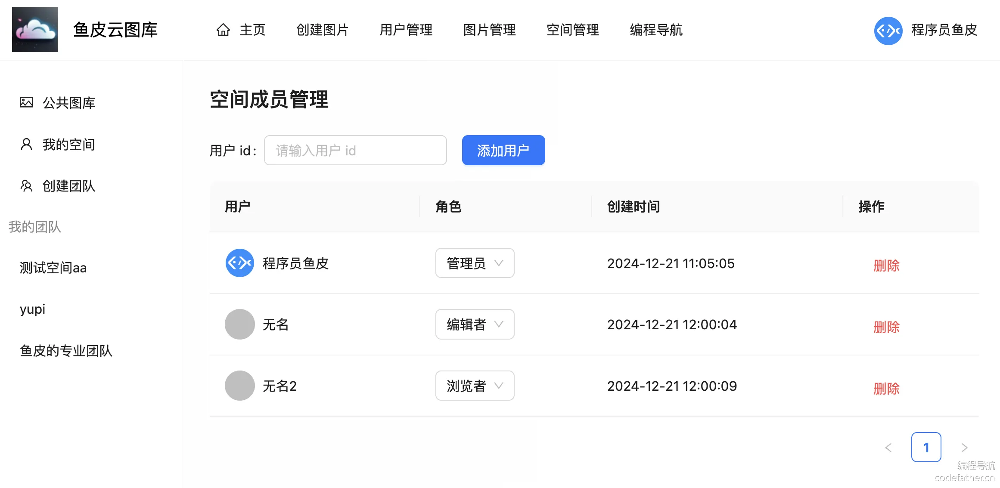

### 成员权限控制

#### 1、需求梳理

需求：用户没有某个操作权限时，不应该看到对应的操作按钮。

首先梳理一下页面和需要控制权限的按钮，以及对应的权限：

1）空间详情页

- 图片编辑按钮：需要 `picture:edit` 权限
- 图片删除按钮：需要 `picture:delete` 权限
- 成员管理按钮：需要 `spaceUser:manage` 权限
- 空间分析按钮：需要 `spaceUser:manage` 权限
- 上传图片按钮：需要 `picture:upload` 权限

2）图片详情页

- 图片编辑按钮：需要 `picture:edit` 权限
- 图片删除按钮：需要 `picture:delete` 权限

#### 2、权限控制

1）空间详情页新增权限变量。由于每个权限检查的逻辑都是一致的（判断权限列表中是否包含需要的权限），可以编写一个通用的权限检查函数。

```typescript
// 通用权限检查函数
function createPermissionChecker(permission: string) {
  return computed(() => {
    return (space.value.permissionList ?? []).includes(permission)
  })
}

// 定义权限检查
const canManageSpaceUser = createPermissionChecker(SPACE_PERMISSION_ENUM.SPACE_USER_MANAGE)
const canUploadPicture = createPermissionChecker(SPACE_PERMISSION_ENUM.PICTURE_UPLOAD)
const canEditPicture = createPermissionChecker(SPACE_PERMISSION_ENUM.PICTURE_EDIT)
const canDeletePicture = createPermissionChecker(SPACE_PERMISSION_ENUM.PICTURE_DELETE)
```

💡 其实也可以让后端计算好 `canXXX`，然后返回给前端直接用，不过差别不大。

2）给对应的操作按钮增加 `v-if`，比如创建图片按钮：

```vue
<a-button
  v-if="canUploadPicture"
  type="primary"
  :href="`/add_picture?spaceId=${id}`"
  target="_blank"
>
  + 创建图片
</a-button>
```

3）图片列表组件支持控制编辑和删除按钮的隐藏，由父组件传递属性：

```typescript
interface Props {
  dataList?: API.PictureVO[]
  loading?: boolean
  showOp?: boolean
  onReload?: () => void
  canEdit?: boolean
  canDelete?: boolean
}

const props = withDefaults(defineProps<Props>(), {
  dataList: () => [],
  loading: false,
  showOp: false,
  canEdit: false,
  canDelete: false,
})
```

页面代码：

```vue
<edit-outlined v-if="canEdit" @click="(e) => doEdit(picture, e)" />
<delete-outlined v-if="canDelete" @click="(e) => doDelete(picture, e)" />
```

空间详情页就可以将权限变量传递给该组件了：

```vue
<!-- 图片列表 -->
<PictureList
  :dataList="dataList"
  :loading="loading"
  :onReload="fetchData"
  showOp
  :canEdit="canEditPicture"
  :canDelete="canDeletePicture"
/>
```

4）图片详情页也按照上述方式进行修改，不再赘述：

```typescript
// 通用权限检查函数
function createPermissionChecker(permission: string) {
  return computed(() => {
    return (picture.value.permissionList ?? []).includes(permission)
  })
}

// 定义权限检查
const canEdit = createPermissionChecker(SPACE_PERMISSION_ENUM.PICTURE_EDIT)
const canDelete = createPermissionChecker(SPACE_PERMISSION_ENUM.PICTURE_DELETE)
```

#### 3、前端测试

涉及到权限的改动都要认真测试，可以主要测试以下情况：bgMhj83Bt96lFcj29lBZCF0o0+YPCGWOWUw0OPyFB/Q=

- 未登录操作公共图库、私有图库、团队图库
- 管理员操作公共图库、私有图库、团队图库
- 普通用户操作公共图库、私有图库、别人的私有图库
- 协作者操作团队图库，可以看到编辑和删除按钮，但看不到成员管理按钮
- 浏览者操作团队图库，仅能查看图片，看不到编辑和删除按钮

### 其他开发

#### 1、问题修复 - 兼容多个空间

MySpacePage 获取我的空间时，改为获取 “私有空间” 的第一个：

```typescript
// 获取用户空间信息
const res = await listSpaceVoByPageUsingPost({
  userId: loginUser.id,
  current: 1,
  pageSize: 1,
  spaceType: 0,
})
```

#### 2、空间管理补充空间类别

补充空间类别列的定义：

```typescript
{
  title: '空间类别',
  dataIndex: 'spaceType',
},
```

自定义空间类别列的展示：

```vue
<!-- 空间类别 -->
<template v-if="column.dataIndex === 'spaceType'">
  <a-tag>{{ SPACE_TYPE_MAP[record.spaceType] }}</a-tag>
</template>
```

支持按类别搜索：

```vue
<a-form-item label="空间类别" name="spaceType">
  <a-select
      v-model:value="searchParams.spaceType"
      :options="SPACE_TYPE_OPTIONS"
      placeholder="请输入空间类别"
      style="min-width: 180px"
      allow-clear
  />
</a-form-item>
```

效果如图：

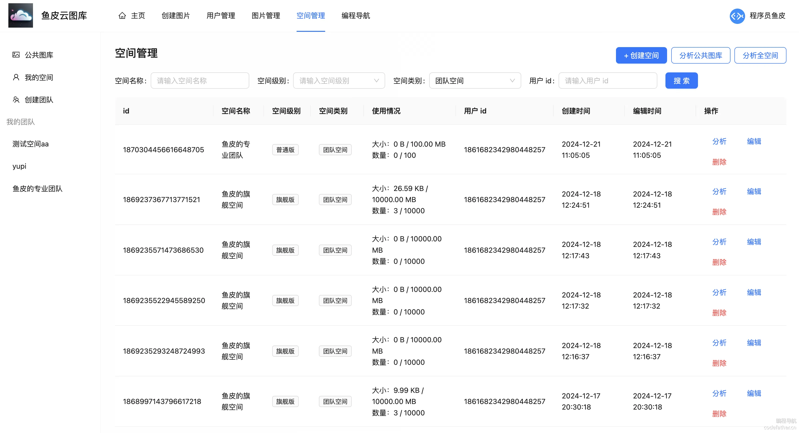


以上就是本节内容，细节非常多，希望大家能够掌握，最好是自己试着敲一遍。


# 12 - 图片协同编辑

## 本节重点

上一节我们已经完成了团队空间的创建、成员管理和权限控制等功能。为了提高项目的商业价值，本节来完成本项目的亮点功能 —— 图片协同编辑。

大纲：

- 图片协同编辑需求分析
- 图片协同编辑方案设计
- 图片协同编辑后端开发
- 图片协同编辑前端开发

通过本节，你将学习到多人实时协作功能的设计开发，涉及 WebSocket、事件驱动设计、Disruptor 无锁队列等技术知识。学会后再去开发聊天室之类的业务，都会轻松很多。

## 一、需求分析

现在很多产品都有多人协作功能，比如协同文档、协同素材设计、协同代码编辑器等等，可以提高协作的效率。

对于我们的项目，所谓的图片协同编辑功能，是在图片编辑的基础上增加了 “协同” 的概念。当用户编辑某张图片时，其他用户可以 **实时** 看到编辑效果和操作提示。如图：

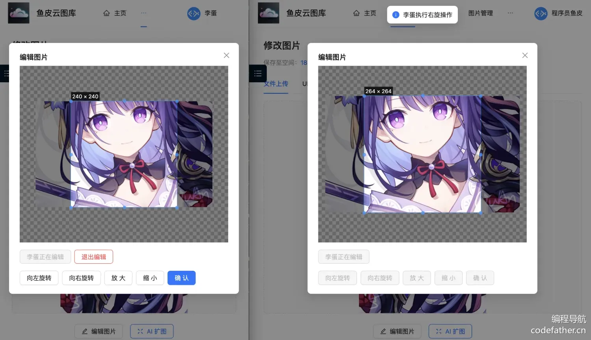

注意，因为只有团队空间才会有多个用户编辑同一张图片，所以该功能只对团队空间开放，需要成员具有编辑权限。协同的图片编辑操作包括左旋、右旋、放大、缩小。

## 二、方案设计

虽然需求介绍很简单，但是涉及到多人协作的业务，有很多问题需要考虑，比如：

- 多个用户之间如何进行交互？
- 如何防止协作编辑时出现冲突？
- 如何提高协作的实时性？

### 协作交互流程

多人协作时，每个用户的动作都需要通知到其他用户，收到通知消息的用户需要进行相应的处理。

比如用户 A 放大了图片，就需要给其他正在编辑的用户发送 “图片放大” 消息，其他用户收到这个消息后，需要同步放大自己界面上的图片。

这其实是一种 **事件驱动** 的架构设计思想，协作编辑中的每个用户动作本质上是一个 **事件**，执行动作时会产生事件并提交给服务器；服务器收到事件后，会转发给其他用户；其他用户收到事件后，就要作为事件的消费者来处理事件。流程如图：

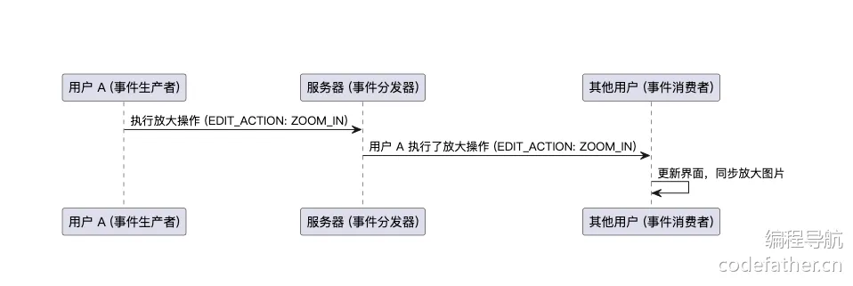

相比于生产者直接调用消费者，事件驱动模型的主要优点在于 **解耦** 和 **异步性**。在事件驱动模型中，生产者和消费者不需要直接依赖于彼此的实现，生产者只需触发事件并将其发送到事件分发器，消费者则根据事件类型处理逻辑。这样多个消费者可以独立响应同一事件（比如一个用户旋转了图片，其他用户都能同步），系统更加灵活，可扩展性更强。此外，事件驱动还可以提升系统的 **并发性p87QUult0bZDR05AO5soQVixQ5nCQ+HA+P5tLSHK/hI=** 和 **实时性**，可以理解为多引入了一个中介来帮忙，通过异步消息传递，减少了阻塞和等待，能够更高效地处理多个并发任务。

下面我们按照事件驱动的设计，来详细列举协作编辑的交互流程：

| 事件触发者（用户 A 的动作） | 事件类型（发送消息） | 事件消费者（其他用户的处理）      |
| --------------------------- | -------------------- | --------------------------------- |
| 用户 A 建立连接，加入编辑   | INFO                 | 显示“用户 A 加入编辑”的通知       |
| 用户 A 执行编辑操作         | EDIT_ACTION          | 放大 / 缩小 / 左旋 / 右旋当前图片 |
| 用户 A 断开连接，离开编辑   | INFO                 | 显示“用户 A 离开编辑”的通知       |

### 解决协作冲突

#### 1、解决方案

假设这样一种场景：鱼皮和李蛋同时快速点击了十次旋转，最终的结果会是怎样的呢？

如果所有事件都是按顺序处理的，那结果就很清晰了，但事实上，为了提高性能和响应速度，事件通常是 **并发** 的，而不是严格的顺序执行。这种并发操作会引发 **协作冲突**，导致其他用户看到的旋转效果是乱序的。

那么你会怎么解决协作冲突的问题呢？

我们可以通过业务设计来减少开发成本，比如约定 **同一时刻只允许一位用户进入编辑图片的状态**，此时其他用户只能实时浏览到修改效果，但不能参与编辑；进入编辑状态的用户可以退出编辑，其他用户才可以进入编辑状态。类似于给图片编辑这个动作加了一把锁，直接从源头上解决了编辑冲突的问题。

此时，协作编辑的交互流程又要增加 2 个动作 —— 进入编辑状态和退出编辑状态：


| 事件触发者（用户 A 的动作） | 事件类型（发送消息） | 事件消费者（其他用户的处理）                        |
| --------------------------- | -------------------- | --------------------------------------------------- |
| 用户 A 建立连接，加入编辑   | INFO                 | 显示“用户 A 加入编辑”的通知                         |
| 用户 A 进入编辑状态         | ENTER_EDIT           | 其他用户界面显示“用户 A 开始编辑图片”，锁定编辑状态 |
| 用户 A 执行编辑操作         | EDIT_ACTION          | 放大 / 缩小 / 左旋 / 右旋当前图片                   |
| 用户 A 退出编辑状态         | EXIT_EDIT            | 解锁编辑状态，提示其他用户可以进入编辑状态          |
| 用户 A 断开连接，离开编辑   | INFO                 | 显示“用户 A 离开编辑”的通知，并释放编辑状态         |
| 用户 A 发送了错误的消息     | ERROR                | 显示错误消息的通知                                  |

其实核心流程是前 5 行，但是考虑到前端传递了错误参数的情况，我们新增一种 `ERROR` 事件类型，可用于展示错误提示信息。

在本项目中，我们就采用这种方案，不仅实现简单、流程清晰，也尽最大可能减少了编辑冲突的风险。

但这种方案的缺点也很明显，减少了实时协作的便利性，对于协作设计、协作编码、协作文档的场景，同一时间只能有一个用户编辑，提高的效率有限。所以这里再分享另外一种实时协同算法作为扩展知识。

#### 2、扩展知识 - OT 算法

实时协同 OT 算法（Operational Transformation）是一种支持分布式系统中多个用户实时协作编辑的核心算法，广泛应用于在线文档协作等场景。OT 算法的主要功能是解决并发编辑冲突，**确保编辑结果在所有用户终端一致**。

OT 算法其实很好理解，先看下 3 个核心概念：

- 操作 (Operation)：表示用户对协作内容的修改，比如插入字符、删除字符等。
- 转化 (Transformation)：当多个用户同时编辑内容时，OT 会根据操作的上下文将它们转化，使得这些操作可以按照不同的顺序应用而结果保持一致。
- 因果一致性：OT 算法确保操作按照用户看到的顺序被正确执行，即每个用户的操作基于最新的内容状态。

其中，最重要的就是 **转化** 步骤了，相当于有一个负责人统一收集大家的操作，然后按照设定的规则和信息进行排序与合并，最终给大家一个统一的结果。

举一个简单的例子，假设初始内容是 `"abc"`，用户 A 和 B 同时进行编辑：

- 用户 A 在位置 `1` 插入 `"x"`
- 用户 B 在位置 `2` 删除 `"b"`

如果不使用 OT 算法，结果是：

1. 用户 A 操作后，内容变为 `"axbc"`
2. 用户 B 操作后，内容变为 `"ac"`

如果直接应用 B 的操作到 A 的结果，得到的是 `"ac"`，对于 A 来说，相当于删除了 `"b"`，A 会感到一脸懵逼。

如果使用 OT 算法，结果是：

1. 用户 A 的操作，应用后内容为 `"axbc"`
2. 用户 B 的操作经过 OT 转化为删除 `"b"` 在 `"axbc"` 中的新位置

最终用户 A 和 B 的内容都一致为 `"axc"`，符合预期。OT 算法确保无论用户编辑的顺序如何，最终内容是一致的。6vlRn/br/m8Ymr8D02hZYIBP3pqlW5Sp8qJklXCk9AY=

当然，具体的 OT 算法还是要根据需求来设计了，协作密度越高，算法设计难度越大。

此外，还有一种与 OT 类似的协同算法 CRDT（Conflict-free Replicated Data Type），其通过数学模型实现无需中心化转化的冲突解决，在离线协作场景中更具优势，感兴趣的同学可以自行了解。

### 提高协作实时性

在实时通讯的业务场景中，常用的技术方案包括长轮询、SSE 和 WebSocket。由于我们的业务需求需要实现频繁且高效的双向通信，因此我们选用 WebSocket 来实现即时通讯。

#### 1、什么是 WebSocket？

WebSocket 是一种 **全双工通信协议**，让客户端（比如浏览器）和服务器之间能够保持实时、持续的连接。和传统的 HTTP 请求-响应模式不同，WebSocket 是一条**“常开的隧道”**，连接的双方可以随时发送和接收数据，而不需要不断建立和关闭连接。

打个比方：

- HTTP 就像点外卖： 每次下单（请求）- 到货（响应）都是一次独立的操作，完成后连接关闭。
- WebSocket 像是打电话：你打通了电话（建立连接），可以随时聊天（双向通信），直到挂断（关闭连接）。


#### 2、WebSocket 的应用场景

WebSocket 的主要作用是 **实现实时数据传输**，适用于需要频繁交互或者实时更新数据的场景。比如：

- 即时通讯（聊天软件、实时协作工具）
- 实时数据更新（股票行情、体育比赛比分）
- 在线游戏（多人实时互动）
- 物联网（设备状态实时传输）
- 协同编辑（像语雀这样的多人协作编辑）

通过 WebSocket，客户端与服务器之间能够显著减少消息传输的延迟，提高通信效率，同时降低数据传输的开销。

#### 3、WebSocket 和 HTTP 的关系

WebSocket 和 HTTP 是两种不同的通信协议，但它们是紧密相关的，都是基于 TCP 协议、都可以在同样的端口上工作（比如 80 和 443）。

**首先要明确，WebSocket 是建立在 HTTP 基础之上的！**WebSocket 的连接需要通过 HTTP 协议发起一个握手（称为 HTTP Upgrade 请求），这个握手请求是 WebSocket 建立连接的前提，表明希望切换协议；服务器如果支持 WebSocket，会返回一个 HTTP 101 状态码，表示协议切换成功。

握手完成后，HTTP 协议的作用结束，通信会切换为 WebSocket 协议，双方可以开始全双工通信。

二者的区别如下，大家了解一下就好：

| 对比项       | HTTP                               | WebSocketc                         |
| ------------ | ---------------------------------- | ---------------------------------- |
| 通信模式     | 请求-响应（单向）                  | 全双工通信（双向）                 |
| 连接状态     | 每次请求创建新的连接               | 握手后保持持续连接                 |
| 数据传输效率 | 每次通信都需要带完整头部，开销大   | 数据帧小，传输高效                 |
| 适用场景     | 静态网页加载、API 调用等非实时场景 | 实时交互场景，如聊天、游戏、直播等 |

#### 4、WebSocket 协作编辑的流程

通过 WebSocket 实时通信的能力，可以将用户的编辑操作发给 WebSocket 服务器，再由服务器转发给其他连接服务器的用户前端，前端就可以根据操作处理图片。

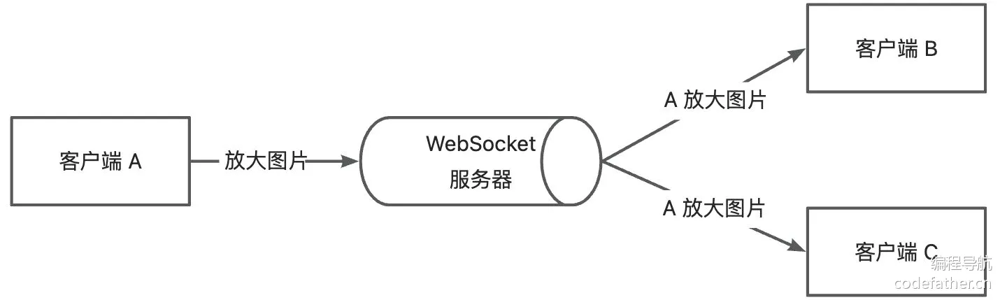

具体的业务流程：

1. 建立连接之前，先进行用户权限校验；校验通过后，将登录用户信息、要编辑的图片信息保存到要建立的 WebSocket 连接的会话属性中。
2. 建立连接成功后，将 WebSocket 会话保存到该图片对应的会话集合中，便于后续分发消息给其他会话。
3. 前端将消息发送到后端，后端根据消息类型分发到对应的处理器。
4. 处理器处理消息，将处理结果作为消息发送给需要的 WebSocket 客户端。
5. 当前端断开连接时，删除会话集合中的 WebSocket 会话，释放资源。

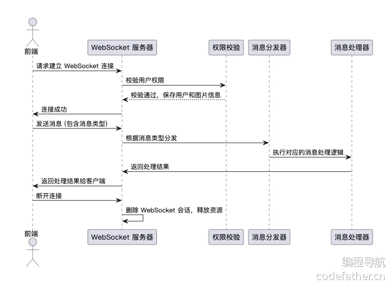

和 HTTP 请求一样，前端和 WebSocket 服务器之间传输信息时，也可以通过 JSON 格式对数据进行序列化。

#### 5、WebSocket 的实现方式

对于 Java Spring 项目，主要有原生 WebSocket（基于`WebSocketHandler` 实现）、STOMP、WebFlux 这 3 种实现方式。

它们之间的对比如下：

| 实现方式                     | 特点                          | 优点                             | 缺点                                 | 适用场景                       |
| ---------------------------- | ----------------------------- | -------------------------------- | ------------------------------------ | ------------------------------ |
| 原生 WebSocket               | 低层 API，手动管理连接与消息  | 轻量、灵活、适用于简单点对点通信 | 需要手动管理会话和分发，不支持 STOMP | 简单的实时推送，低并发场景     |
| WebSocket + STOMP + SockJS   | 基于 STOMP，支持发布/订阅模式 | 支持 STOMP、消息代理、适配       | 依赖外部代理，配置较复杂             | 聊天室、多人协作，高级实时应用 |
| WebFlux + Reactive WebSocket | 基于 WebFlux 的响应式实现     | 高并发、非阻塞、适用于大流量场景 | 学习曲线高，不支持 STOMP             | 高并发场景、大数据流推送       |

鱼皮的选择建议是：对于大多数简单实时推送，选用原生 WebSocket；对于复杂的聊天室和协同系统，选用 WebSocket + STOMP + SockJS；对于高并发、低延迟数据流推送，选用 WebFlux + Reactive WebSocket。

对于我们的项目，并发要求不高，选择 Spring 原生的 WebSocket 来降低开发成本。

明确方案后，我们进入后端开发。=

## 三、后端开发

### 1、引入 WebSocket 依赖

引入依赖：

```xml
<!-- websocket -->
<dependency>
    <groupId>org.springframework.boot</groupId>
    <artifactId>spring-boot-starter-websocket</artifactId>
</dependency>
```

新建 `manager.websocket` 包，所有和 WebSocket 相关的代码都放到该包下。

### 2、定义数据模型

新建 `websocket.model` 包，存放数据模型，包括请求类、响应类、枚举类。

1）定义图片编辑请求消息，也就是前端要发送给后端的参数：

```java
@Data
@NoArgsConstructor
@AllArgsConstructor
public class PictureEditRequestMessage {

    /**
     * 消息类型，例如 "ENTER_EDIT", "EXIT_EDIT", "EDIT_ACTION"
     */
    private String type;

    /**
     * 执行的编辑动作
     */
    private String editAction;
}
```

2）定义图片编辑响应消息，也就是后端要发送给前端的信息：

```java
@Data
@NoArgsConstructor
@AllArgsConstructor
public class PictureEditResponseMessage {

    /**
     * 消息类型，例如 "INFO", "ERROR", "ENTER_EDIT", "EXIT_EDIT", "EDIT_ACTION"
     */
    private String type;

    /**
     * 信息
     */
    private String message;

    /**
     * 执行的编辑动作
     */
    private String editAction;

    /**
     * 用户信息
     */
    private UserVO user;
}
```

3）定义图片编辑消息类型枚举，便于后续根据消息类型进行相应的处理：6oQFIoMC2vFqWS6BDNDfWm34cANQaqyg4rGukImfAHk=

```java
@Getter
public enum PictureEditMessageTypeEnum {

    INFO("发送通知", "INFO"),
    ERROR("发送错误", "ERROR"),
    ENTER_EDIT("进入编辑状态", "ENTER_EDIT"),
    EXIT_EDIT("退出编辑状态", "EXIT_EDIT"),
    EDIT_ACTION("执行编辑操作", "EDIT_ACTION");

    private final String text;
    private final String value;

    PictureEditMessageTypeEnum(String text, String value) {
        this.text = text;
        this.value = value;
    }

    /**
     * 根据 value 获取枚举
     */
    public static PictureEditMessageTypeEnum getEnumByValue(String value) {
        if (value == null || value.isEmpty()) {
            return null;
        }
        for (PictureEditMessageTypeEnum typeEnum : PictureEditMessageTypeEnum.values()) {
            if (typeEnum.value.equals(value)) {
                return typeEnum;
            }
        }
        return null;
    }
}
```

4）定义图片编辑操作类型枚举：

```java
@Getter
public enum PictureEditActionEnum {

    ZOOM_IN("放大操作", "ZOOM_IN"),
    ZOOM_OUT("缩小操作", "ZOOM_OUT"),
    ROTATE_LEFT("左旋操作", "ROTATE_LEFT"),
    ROTATE_RIGHT("右旋操作", "ROTATE_RIGHT");

    private final String text;
    private final String value;

    PictureEditActionEnum(String text, String value) {
        this.text = text;
        this.value = value;
    }

    /**
     * 根据 value 获取枚举
     */
    public static PictureEditActionEnum getEnumByValue(String value) {
        if (value == null || value.isEmpty()) {
            return null;
        }
        for (PictureEditActionEnum actionEnum : PictureEditActionEnum.values()) {
            if (actionEnum.value.equals(value)) {
                return actionEnum;
            }
        }
        return null;
    }
}
```

### 3、WebSocket 拦截器 - 权限校验

在 WebSocket 连接前需要进行权限校验，如果发现用户没有团队空间内编辑图片的权限，则拒绝握手，可以通过定义一个 WebSocket 拦截器实现这个能力。

此外，由于 HTTP 和 WebSocket 的区别，我们不能在后续收到前端消息时直接从 request 对象中获取到登录用户信息，因此也需要通过 WebSocket 拦截器，为即将建立连接的 WebSocket 会话指定一些属性，比如登录用户信息、编辑的图片 id 等。

编写拦截器的代码，需要实现 `HandshakeInterceptor` 接口：

```java
@Component
@Slf4j
public class WsHandshakeInterceptor implements HandshakeInterceptor {

    @Resource
    private UserService userService;

    @Resource
    private PictureService pictureService;

    @Resource
    private SpaceService spaceService;

    @Resource
    private SpaceUserAuthManager spaceUserAuthManager;

    @Override
    public boolean beforeHandshake(@NotNull ServerHttpRequest request, @NotNull ServerHttpResponse response, @NotNull WebSocketHandler wsHandler, @NotNull Map<String, Object> attributes) {
        if (request instanceof ServletServerHttpRequest) {
            HttpServletRequest servletRequest = ((ServletServerHttpRequest) request).getServletRequest();
            // 获取请求参数
            String pictureId = servletRequest.getParameter("pictureId");
            if (StrUtil.isBlank(pictureId)) {
                log.error("缺少图片参数，拒绝握手");
                return false;
            }
            User loginUser = userService.getLoginUser(servletRequest);
            if (ObjUtil.isEmpty(loginUser)) {
                log.error("用户未登录，拒绝握手");
                return false;
            }
            // 校验用户是否有该图片的权限
            Picture picture = pictureService.getById(pictureId);
            if (picture == null) {
                log.error("图片不存在，拒绝握手");
                return false;
            }
            Long spaceId = picture.getSpaceId();
            Space space = null;
            if (spaceId != null) {
                space = spaceService.getById(spaceId);
                if (space == null) {
                    log.error("空间不存在，拒绝握手");
                    return false;
                }
                if (space.getSpaceType() != SpaceTypeEnum.TEAM.getValue()) {
                    log.info("不是团队空间，拒绝握手");
                    return false;
                }
            }
            List<String> permissionList = spaceUserAuthManager.getPermissionList(space, loginUser);
            if (!permissionList.contains(SpaceUserPermissionConstant.PICTURE_EDIT)) {
                log.error("没有图片编辑权限，拒绝握手");
                return false;
            }
            // 设置 attributes
            attributes.put("user", loginUser);
            attributes.put("userId", loginUser.getId());
            attributes.put("pictureId", Long.valueOf(pictureId)); // 记得转换为 Long 类型
        }
        return true;
    }

    @Override
    public void afterHandshake(@NotNull ServerHttpRequest request, @NotNull ServerHttpResponse response, @NotNull WebSocketHandler wsHandler, Exception exception) {
    }
}
```

### 4、WebSocket 处理器

我们需要定义 WebSocket 处理器类，在连接成功、连接关闭、接收到客户端消息时进行相应的处理。

可以实现 TextWebSocketHandler 接口，这样就能以字符串的方式发送和接受消息了：

```java
@Component
public class PictureEditHandler extends TextWebSocketHandler {
}
```

1）首先在处理器类中定义 2 个常量，分别为：

- 保存当前正在编辑的用户 id，执行编辑操作、进入或退出编辑时都会校验。
- 保存参与编辑图片的用户 WebSocket 会话的集合。

由于每个图片的协作编辑都是相互独立的，所以需要用 Map 来区分每个图片 id 对应的数据。代码如下：

```java
// 每张图片的编辑状态，key: pictureId, value: 当前正在编辑的用户 ID
private final Map<Long, Long> pictureEditingUsers = new ConcurrentHashMap<>();

// 保存所有连接的会话，key: pictureId, value: 用户会话集合
private final Map<Long, Set<WebSocketSession>> pictureSessions = new ConcurrentHashMap<>();
```

注意，由于可能同时有多个 WebSocket 客户端建立连接和发送消息，集合要使用并发包（JUC）中的 `ConcurrentHashMap`，来保证线程安全。

2）由于接下来很多消息都需要传递给所有协作者，所以先编写一个 **广播消息** 的方法。该方法会根据 pictureId，将响应消息发送给编辑该图片的所有会话。考虑到可能会有消息不需要发送给编辑者本人的情况，该方法还可以接受 excludeSession 参数，支持排除掉向某个会话发送消息。

代码如下：

```java
private void broadcastToPicture(Long pictureId, PictureEditResponseMessage pictureEditResponseMessage, WebSocketSession excludeSession) throws Exception {
    Set<WebSocketSession> sessionSet = pictureSessions.get(pictureId);
    if (CollUtil.isNotEmpty(sessionSet)) {
        // 创建 ObjectMapper
        ObjectMapper objectMapper = new ObjectMapper();
        // 配置序列化：将 Long 类型转为 String，解决丢失精度问题
        SimpleModule module = new SimpleModule();
        module.addSerializer(Long.class, ToStringSerializer.instance);
        module.addSerializer(Long.TYPE, ToStringSerializer.instance); // 支持 long 基本类型
        objectMapper.registerModule(module);
        // 序列化为 JSON 字符串
        String message = objectMapper.writeValueAsString(pictureEditResponseMessage);
        TextMessage textMessage = new TextMessage(message);
        for (WebSocketSession session : sessionSet) {
            // 排除掉的 session 不发送
            if (excludeSession != null && excludeSession.equals(session)) {
                continue;
            }
            if (session.isOpen()) {
                session.sendMessage(textMessage);
            }
        }
    }
}
```

上述代码中有个小细节，由于前端 JS 的长整数可能会丢失精度，所以使用 Jackson 自定义序列化器，在将对象转换为 JSON 字符串时，将 Long 类型转换为 String 类型。

再编写一个不排除 Session，给所有会话广播的方法：

```java
// 全部广播
private void broadcastToPicture(Long pictureId, PictureEditResponseMessage pictureEditResponseMessage) throws Exception {
    broadcastToPicture(pictureId, pictureEditResponseMessage, null);
}
```

3）实现连接建立成功后执行的方法，保存会话到集合中，并且给其他会话发送消息：

```java
@Override
public void afterConnectionEstablished(WebSocketSession session) throws Exception {
    // 保存会话到集合中
    User user = (User) session.getAttributes().get("user");
    Long pictureId = (Long) session.getAttributes().get("pictureId");
    pictureSessions.putIfAbsent(pictureId, ConcurrentHashMap.newKeySet());
    pictureSessions.get(pictureId).add(session);

    // 构造响应
    PictureEditResponseMessage pictureEditResponseMessage = new PictureEditResponseMessage();
    pictureEditResponseMessage.setType(PictureEditMessageTypeEnum.INFO.getValue());
    String message = String.format("%s加入编辑", user.getUserName());
    pictureEditResponseMessage.setMessage(message);
    pictureEditResponseMessage.setUser(userService.getUserVO(user));
    // 广播给同一张图片的用户
    broadcastToPicture(pictureId, pictureEditResponseMessage);
}
```

4）编写接收客户端消息的方法，根据消息类别执行不同的处理：

```java
@Override
protected void handleTextMessage(WebSocketSession session, TextMessage message) throws Exception {
    // 将消息解析为 PictureEditMessage
    PictureEditRequestMessage pictureEditRequestMessage = JSONUtil.toBean(message.getPayload(), PictureEditRequestMessage.class);
    String type = pictureEditRequestMessage.getType();
    PictureEditMessageTypeEnum pictureEditMessageTypeEnum = PictureEditMessageTypeEnum.valueOf(type);

    // 从 Session 属性中获取公共参数
    Map<String, Object> attributes = session.getAttributes();
    User user = (User) attributes.get("user");
    Long pictureId = (Long) attributes.get("pictureId");

    // 调用对应的消息处理方法
    switch (pictureEditMessageTypeEnum) {
        case ENTER_EDIT:
            handleEnterEditMessage(pictureEditRequestMessage, session, user, pictureId);
            break;
        case EDIT_ACTION:
            handleEditActionMessage(pictureEditRequestMessage, session, user, pictureId);
            break;
        case EXIT_EDIT:
            handleExitEditMessage(pictureEditRequestMessage, session, user, pictureId);
            break;
        default:
            PictureEditResponseMessage pictureEditResponseMessage = new PictureEditResponseMessage();
            pictureEditResponseMessage.setType(PictureEditMessageTypeEnum.ERROR.getValue());
            pictureEditResponseMessage.setMessage("消息类型错误");
            pictureEditResponseMessage.setUser(userService.getUserVO(user));
            session.sendMessage(new TextMessage(JSONUtil.toJsonStr(pictureEditResponseMessage)));
    }
}
```

接下来依次编写每个处理消息的方法。首先是用户进入编辑状态，要设置当前用户为编辑用户，并且向其他客户端发送消息：

```java
public void handleEnterEditMessage(PictureEditRequestMessage pictureEditRequestMessage, WebSocketSession session, User user, Long pictureId) throws Exception {
    // 没有用户正在编辑该图片，才能进入编辑
    if (!pictureEditingUsers.containsKey(pictureId)) {
        // 设置当前用户为编辑用户
        pictureEditingUsers.put(pictureId, user.getId());
        PictureEditResponseMessage pictureEditResponseMessage = new PictureEditResponseMessage();
        pictureEditResponseMessage.setType(PictureEditMessageTypeEnum.ENTER_EDIT.getValue());
        String message = String.format("%s开始编辑图片", user.getUserName());
        pictureEditResponseMessage.setMessage(message);
        pictureEditResponseMessage.setUser(userService.getUserVO(user));
        broadcastToPicture(pictureId, pictureEditResponseMessage);
    }
}
```

用户执行编辑操作时，将该操作同步给 **除了当前用户之外** 的其他客户端，也就是说编辑操作不用再同步给自己：

```java
public void handleEditActionMessage(PictureEditRequestMessage pictureEditRequestMessage, WebSocketSession session, User user, Long pictureId) throws Exception {
    Long editingUserId = pictureEditingUsers.get(pictureId);
    String editAction = pictureEditRequestMessage.getEditAction();
    PictureEditActionEnum actionEnum = PictureEditActionEnum.getEnumByValue(editAction);
    if (actionEnum == null) {
        return;
    }
    // 确认是当前编辑者
    if (editingUserId != null && editingUserId.equals(user.getId())) {
        PictureEditResponseMessage pictureEditResponseMessage = new PictureEditResponseMessage();
        pictureEditResponseMessage.setType(PictureEditMessageTypeEnum.EDIT_ACTION.getValue());
        String message = String.format("%s执行%s", user.getUserName(), actionEnum.getText());
        pictureEditResponseMessage.setMessage(message);
        pictureEditResponseMessage.setEditAction(editAction);
        pictureEditResponseMessage.setUser(userService.getUserVO(user));
        // 广播给除了当前客户端之外的其他用户，否则会造成重复编辑
        broadcastToPicture(pictureId, pictureEditResponseMessage, session);
    }
}
```

用户退出编辑操作时，移除当前用户的编辑状态，并且向其他客户端发送消息：

```java
public void handleExitEditMessage(PictureEditRequestMessage pictureEditRequestMessage, WebSocketSession session, User user, Long pictureId) throws Exception {
    Long editingUserId = pictureEditingUsers.get(pictureId);
    if (editingUserId != null && editingUserId.equals(user.getId())) {
        // 移除当前用户的编辑状态
        pictureEditingUsers.remove(pictureId);
        // 构造响应，发送退出编辑的消息通知
        PictureEditResponseMessage pictureEditResponseMessage = new PictureEditResponseMessage();
        pictureEditResponseMessage.setType(PictureEditMessageTypeEnum.EXIT_EDIT.getValue());
        String message = String.format("%s退出编辑图片", user.getUserName());
        pictureEditResponseMessage.setMessage(message);
        pictureEditResponseMessage.setUser(userService.getUserVO(user));
        broadcastToPicture(pictureId, pictureEditResponseMessage);
    }
}
```

5）WebSocket 连接关闭时，需要移除当前用户的编辑状态、并且从集合中删除当前会话，还可以给其他客户端发送消息通知：

```java
@Override
public void afterConnectionClosed(WebSocketSession session, @NotNull CloseStatus status) throws Exception {
    Map<String, Object> attributes = session.getAttributes();
    Long pictureId = (Long) attributes.get("pictureId");
    User user = (User) attributes.get("user");
    // 移除当前用户的编辑状态
    handleExitEditMessage(null, session, user, pictureId);

    // 删除会话
    Set<WebSocketSession> sessionSet = pictureSessions.get(pictureId);
    if (sessionSet != null) {
        sessionSet.remove(session);
        if (sessionSet.isEmpty()) {
            pictureSessions.remove(pictureId);
        }
    }

    // 响应
    PictureEditResponseMessage pictureEditResponseMessage = new PictureEditResponseMessage();
    pictureEditResponseMessage.setType(PictureEditMessageTypeEnum.INFO.getValue());
    String message = String.format("%s离开编辑", user.getUserName());
    pictureEditResponseMessage.setMessage(message);
    pictureEditResponseMessage.setUser(userService.getUserVO(user));
    broadcastToPicture(pictureId, pictureEditResponseMessage);
}
```

💡 由于处理器的代码并不复杂，而且处理逻辑中使用到了当前类的全局变量，所以鱼皮没有选择将每个处理器封装为单独的类。大家也可以将每个处理器封装为单独的类（相当于设计模式中的策略模式），并且根据消息类别调用不同的处理器类。

### 5、WebSocket 配置

类似于编写 Spring MVC 的 Controller 接口，可以为指定的路径配置处理器和拦截器：

```java
@Configuration
@EnableWebSocket
public class WebSocketConfig implements WebSocketConfigurer {

    @Resource
    private PictureEditHandler pictureEditHandler;

    @Resource
    private WsHandshakeInterceptor wsHandshakeInterceptor;

    @Override
    public void registerWebSocketHandlers(WebSocketHandlerRegistry registry) {
        // websocket
        registry.addHandler(pictureEditHandler, "/ws/picture/edit")
                .addInterceptors(wsHandshakeInterceptor)
                .setAllowedOrigins("*");
    }
}
```

之后，前端就可以通过 WebSocket 连接项目启动端口的 `/ws/picture/edit` 路径了。

### 扩展知识 - Disruptor 优化

#### 1、现存的系统问题

WebSocket 通常是长连接，每个客户端都需要占用服务器资源。在 Spring WebSocket 中，每个 WebSocket 连接（客户端）对应一个独立的 `WebSocketSession`，消息的处理是在该 `WebSocketSession` 所属的线程中执行。

如果 **同一个** WebSocket 连接（客户端）连续发送多条消息，服务器会 **按照接收的顺序依次同步处理**，而不是并发执行。这是为了保证每个客户端的消息处理是线程安全的。

可以在 `handleTextMessage` 方法中增加 `Thread.sleep` 来测试一下。连续点击多次编辑操作，会发现每隔一段时间方法才会执行一次。

虽然多个客户端的消息处理是可以并发执行的，但是接受消息和具体处理某个消息使用的是 **同一个线程**。如果处理消息的耗时比较长，并发量又比较高，可能会导致系统响应时间变长，甚至因为资源耗尽而服务崩溃。

💡 为了便于理解，可以类比一下调用 Spring MVC 的某个接口时，如果该接口内部的耗时较长，请求线程就会一直阻塞，最终导致 Tomcat 请求连接数耗尽。

怎么解决这个问题呢？最简单的方法就是开一个线程专门来异步处理消息。但是我们还要保证操作是按照顺序同步给其他客户端的，因此还需要引入一个队列，将任务按照顺序放到队列中，交给线程去处理。

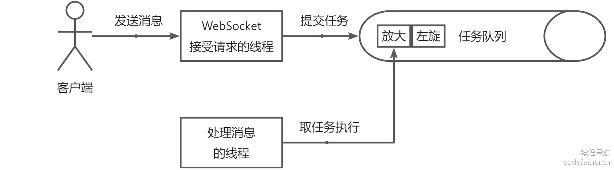

其实上述的异步操作 + 从任务队列取任务执行，使用线程池就可以实现了。

但对于协同编辑场景，需要尽可能地保证低延迟，因此我们选用一种高级技术 **Disruptor** 无锁队列来减少线程上下文的切换，能够在高并发场景下保持低延迟和高吞吐量。

此外，使用 Disruptor 还有一个优点，可以将任务放到队列中，通过优雅停机机制，在服务停止前执行完所有的任务，再退出服务，防止消息丢失。

#### 2、Disruptor 介绍

[Disruptor](https://lmax-exchange.github.io/disruptor/#_what_is_the_disruptor) 是一种高性能的并发框架，由 LMAX（一个金融交易系统公司）开发，它是一种 **无锁的环形队列** 数据结构，用于解决高吞吐量和低延迟场景中的并发问题。支持生产者-消费者模式，可作为消息队列使用，适用于金融交易、实时数据处理、游戏事件等对并发和实

它最大的特点就是快、延迟低，非常低！

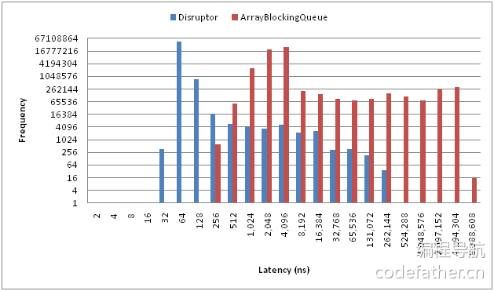

Disruptor 的核心思想是基于固定大小的 **环形缓冲区**（Ring Buffer），并通过序列化控制访问，以避免传统队列中常见的锁竞争问题。

它主要通过以下几点实现高性能的消息传递机制：

1. 环形缓冲区：使用固定大小的数组，可以复用内存，避免了频繁的内存分配和垃圾回收。
2. 无锁设计：依赖 CAS（Compare-And-Swap）和内存屏障，而不是传统的锁，降低了线程切换的开销。
3. 缓存友好：最大化利用 CPU 的缓存局部性，提高访问速度。
4. 序列号机制：通过序列号管理生产者和消费者的访问，保证数据一致性。
5. 多消费者模式：支持多消费者共享同一环形缓冲区，并能配置不同的消费策略（如依赖关系、并行消费等）。

Disruptor 与传统队列对比：

| 特性     | Disruptor                  | BlockingQueuesqWmWU     |
| -------- | -------------------------- | ----------------------- |
| 并发控制 | 无锁（CAS + 内存屏障）     | 基于锁（ReentrantLock） |
| 内存管理 | 固定长度的环形数组         | 动态数组或链表          |
| 性能     | 极高（百万级别消息/秒）    | 较低（数万消息/秒）     |
| 延迟     | 纳秒级别                   | 毫秒级别                |
| GC 压力  | 极低（数据复用）           | 较高（频繁创建新对象）q |
| 适用场景 | 高频实时消息处理、金融系统 | 一般生产者消费者模型X   |

#### 3、Disruptor 核心概念与工作流程

先了解 Disruptor 的核心概念：

- RingBuffer（环形缓冲区）：固定大小的循环数组，用于存储数据项，生产者和消费者共享该数据结构。
- Event（事件）：存储在 `RingBuffer` 中的数据对象，用于表示要传递的消息或数据。
- Producer（生产者）：负责向 `RingBuffer` 写入数据的角色。
- Consumer（消费者）：从 `RingBuffer` 中读取并处理数据的角色。
- Sequencer（序列器）：管理生产者与消费者的索引，确保并发安全的序列管理。
- SequenceBarrier（序列屏障）：控制消费者等待数据可用的机制，确保数据完整性。
- WaitStrategy（等待策略）：定义消费者如何等待新的数据（如自旋、自适应等待等）。
- EventProcessor（事件处理器）：集成了 `Consumer` 和 `SequenceBarrier`，用于更高级的消费控制。

而 Disruptor 是封装了 `RingBuffer`、`Producer` 和 `Consumer` 的核心管理类，用于协调所有组件的运行。

下面我举例来说明 Disruptor 的工作流程：

1. 环形队列初始化：创建一个固定大小为 8 的 RingBuffer（索引范围 0-7），每个格子存储一个可复用的事件对象，序号初始为 0。
2. 生产者写入数据：生产者申请索引 0（序号 0），将数据 "A" 写入事件对象，提交后序号递增为 1，下一个写入索引变为 1。
3. 消费者读取数据：消费者检查索引 0（序号 0），读取数据 "A"，处理后提交，序号递增为 1，下一个读取索引变为 1。
4. 环形队列循环使用：当生产者写入到索引 7（序号 7）后，索引回到 0（序号 8），形成循环存储，**但序号会持续自增以区分数据的先后顺序。**
5. 防止数据覆盖：如果生产者追上消费者，消费者尚未处理完数据，生产者会等待，确保数据不被覆盖。

下图是一个 Disruptor 生产者的模型，仅供参考，了解一下即可：

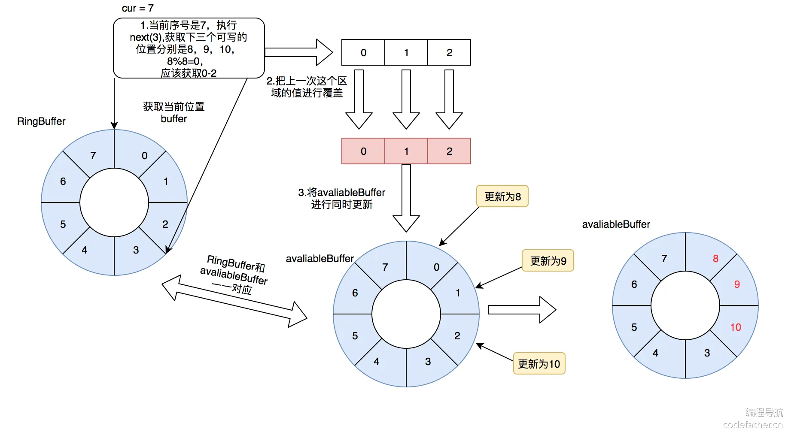

其实对大家来说，先将 Disruptor 当做一个高性能的队列来使用就可以了，可以向队列中添加事件并定义处理方式。感兴趣的同学可以阅读 [这篇文章](https://juejin.cn/post/6844903648875528206) 深入了解 Disruptor 性能高的原因。

下面我们来引入 Disruptor 来优化代码。

#### 4、Disruptor 实战

1）引入 Disruptor 依赖

```xml
<!-- 高性能无锁队列 -->
<dependency>
    <groupId>com.lmax</groupId>
    <artifactId>disruptor</artifactId>
    <version>3.4.2</version>
</dependency>
```

2）定义事件

事件是 Disruptor 执行的核心单位，在 `websocket.disruptor` 包中新建 PictureEditEvent 类，充当了上下文容器，所有处理消息所需的数据都被封装在其中。

```java
@Data
public class PictureEditEvent {

    /**
     * 消息
     */
    private PictureEditRequestMessage pictureEditRequestMessage;

    /**
     * 当前用户的 session
     */
    private WebSocketSession session;
    
    /**
     * 当前用户
     */
    private User user;

    /**
     * 图片 id
     */
    private Long pictureId;

}
```

3）定义事件处理器（消费者）

这里基本上是把 `PictureEditHandler` 分发消息的逻辑搬了过来，它的作用就是将不同类型的消息分发到对应的处理器中。

```java
@Slf4j
@Component
public class PictureEditEventWorkHandler implements WorkHandler<PictureEditEvent> {

    @Resource
    @Lazy
    private PictureEditHandler pictureEditHandler;

    @Resource
    private UserService userService;

    @Override
    public void onEvent(PictureEditEvent event) throws Exception {
        PictureEditRequestMessage pictureEditRequestMessage = event.getPictureEditRequestMessage();
        WebSocketSession session = event.getSession();
        User user = event.getUser();
        Long pictureId = event.getPictureId();
        // 获取到消息类别
        String type = pictureEditRequestMessage.getType();
        PictureEditMessageTypeEnum pictureEditMessageTypeEnum = PictureEditMessageTypeEnum.valueOf(type);
        // 调用对应的消息处理方法
        switch (pictureEditMessageTypeEnum) {
            case ENTER_EDIT:
                pictureEditHandler.handleEnterEditMessage(pictureEditRequestMessage, session, user, pictureId);
                break;
            case EDIT_ACTION:
                pictureEditHandler.handleEditActionMessage(pictureEditRequestMessage, session, user, pictureId);
                break;
            case EXIT_EDIT:
                pictureEditHandler.handleExitEditMessage(pictureEditRequestMessage, session, user, pictureId);
                break;
            default:
                PictureEditResponseMessage pictureEditResponseMessage = new PictureEditResponseMessage();
                pictureEditResponseMessage.setType(PictureEditMessageTypeEnum.ERROR.getValue());
                pictureEditResponseMessage.setMessage("消息类型错误");
                pictureEditResponseMessage.setUser(userService.getUserVO(user));
                session.sendMessage(new TextMessage(JSONUtil.toJsonStr(pictureEditResponseMessage)));
        }
    }
}
```

4）添加 Disruptor 配置类，将我们刚定义的事件及处理器关联到 Disruptor 实例中：

```java
@Configuration
public class PictureEditEventDisruptorConfig {

    @Resource
    private PictureEditEventWorkHandler pictureEditEventWorkHandler;

    @Bean("pictureEditEventDisruptor")
    public Disruptor<PictureEditEvent> messageModelRingBuffer() {
        // ringBuffer 的大小
        int bufferSize = 1024 * 256;
        Disruptor<PictureEditEvent> disruptor = new Disruptor<>(
                PictureEditEvent::new,
                bufferSize,
                ThreadFactoryBuilder.create().setNamePrefix("pictureEditEventDisruptor").build()
        );
        // 设置消费者
        disruptor.handleEventsWithWorkerPool(pictureEditEventWorkHandler);
        // 开启 disruptor
        disruptor.start();
        return disruptor;
    }
}
```

5、定义事件生产者

生产者负责将数据（事件）发到 Disruptor 的环形缓冲区中。为了保证在停机时所有的消息都能够被处理，我们通过 `shutdown` 方法完成 Disruptor 的优雅停机。

```java
@Component
@Slf4j
public class PictureEditEventProducer {

    @Resource
    Disruptor<PictureEditEvent> pictureEditEventDisruptor;

    public void publishEvent(PictureEditRequestMessage pictureEditRequestMessage, WebSocketSession session, User user, Long pictureId) {
        RingBuffer<PictureEditEvent> ringBuffer = pictureEditEventDisruptor.getRingBuffer();
        // 获取可以生成的位置
        long next = ringBuffer.next();
        PictureEditEvent pictureEditEvent = ringBuffer.get(next);
        pictureEditEvent.setSession(session);
        pictureEditEvent.setPictureEditRequestMessage(pictureEditRequestMessage);
        pictureEditEvent.setUser(user);
        pictureEditEvent.setPictureId(pictureId);
        // 发布事件
        ringBuffer.publish(next);
    }

    /**
     * 优雅停机
     */
    @PreDestroy
    public void close() {
        pictureEditEventDisruptor.shutdown();
    }
}
```

6、修改 PictureEditHandler 的原有逻辑，改为使用事件生产者：

```java
@Resource
private PictureEditEventProducer pictureEditEventProducer;

@Override
protected void handleTextMessage(WebSocketSession session, TextMessage message) throws Exception {
    // 将消息解析为 PictureEditMessage
    PictureEditRequestMessage pictureEditRequestMessage = JSONUtil.toBean(message.getPayload(), PictureEditRequestMessage.class);
    // 从 Session 属性中获取公共参数
    Map<String, Object> attributes = session.getAttributes();
    User user = (User) attributes.get("user");
    Long pictureId = (Long) attributes.get("pictureId");
    // 生产消息
    pictureEditEventProducer.publishEvent(pictureEditRequestMessage, session, user, pictureId);
}
```

这样，我们就实现了基于 Disruptor 的异步消息处理机制，将原有的同步消息分发逻辑改造为高效解耦的异步处理模型，也更有利于代码的扩展。

### 扩展

1、为防止消息丢失，可以使用 Redis 等高性能存储保存执行的操作记录。

目前如果图片已经被编辑了，新用户加入编辑时没办法查看到已编辑的状态，这一点也可以利用 Redis 保存操作记录来解决，新用户加入编辑时读取 Redis 的操作记录即可。

2、每种类型的消息处理可以封装为独立的 Handler 处理器类，也就是采用策略模式。

3、支持分布式 WebSocket。实现思路很简单，只需要保证要编辑同一图片的用户连接的是相同的服务器即可，和游戏分服务器大区、聊天室分房间是类似的原理。

4、一些小问题的优化：比如 WebSocket 连接建立之后，如果用户退出了登录，这时 WebSocket 的连接是没有断开的。不过影响并不大，大家可以思考下怎么处理。

## 四、前端开发

前端开发主要集中在基础图片编辑组件 `ImageCropper.vue` 中。

### 1、基础代码

首先根据后端的枚举类和常量，在 `picture.ts` 中定义图片编辑消息类型、图片编辑动作：

```typescript
export const PICTURE_EDIT_MESSAGE_TYPE_ENUM = {
  INFO: 'INFO',
  ERROR: 'ERROR',
  ENTER_EDIT: 'ENTER_EDIT',
  EXIT_EDIT: 'EXIT_EDIT',
  EDIT_ACTION: 'EDIT_ACTION',
};

export const PICTURE_EDIT_MESSAGE_TYPE_MAP = {
  INFO: '发送通知',
  ERROR: '发送错误',
  ENTER_EDIT: '进入编辑状态',
  EXIT_EDIT: '退出编辑状态',
  EDIT_ACTION: '执行编辑操作',
};

export const PICTURE_EDIT_ACTION_ENUM = {
  ZOOM_IN: 'ZOOM_IN',
  ZOOM_OUT: 'ZOOM_OUT',
  ROTATE_LEFT: 'ROTATE_LEFT',
  ROTATE_RIGHT: 'ROTATE_RIGHT',
};

export const PICTURE_EDIT_ACTION_MAP = {
  ZOOM_IN: '放大操作',
  ZOOM_OUT: '缩小操作',
  ROTATE_LEFT: '左旋操作',
  ROTATE_RIGHT: '右旋操作',
};
```

### 2、WebSocket 前端基础代码

为了让页面或组件的代码中能够更方便地使用 WebSocket 连接，我们可以先在 `utils` 目录下编写适用于图片编辑 WebSocket 连接的工具类。定义了：

- 连接 WebSocket 的地址
- WebSocket 各个事件的处理函数，比如连接成功和连接关闭事件，跟后端对应
- 向 WebSocket 服务端发送消息的函数等

代码如下，这段属于样板代码，大家了解一下即可，不必自己敲：

```typescript
export default class PictureEditWebSocket {
  private pictureId: number
  private socket: WebSocket | null
  private eventHandlers: any

  constructor(pictureId: number) {
    this.pictureId = pictureId // 当前编辑的图片 ID
    this.socket = null // WebSocket 实例
    this.eventHandlers = {} // 自定义事件处理器
  }

  /**
   * 初始化 WebSocket 连接
   */
  connect() {
    const url = `ws://localhost:8123/api/ws/picture/edit?pictureId=${this.pictureId}`
    this.socket = new WebSocket(url)

    // 设置携带 cookie
    this.socket.binaryType = 'blob'

    // 监听连接成功事件
    this.socket.onopen = () => {
      console.log('WebSocket 连接已建立')
      this.triggerEvent('open')
    }

    // 监听消息事件
    this.socket.onmessage = (event) => {
      const message = JSON.parse(event.data)
      console.log('收到消息:', message)

      // 根据消息类型触发对应事件
      const type = message.type
      this.triggerEvent(type, message)
    }

    // 监听连接关闭事件
    this.socket.onclose = (event) => {
      console.log('WebSocket 连接已关闭:', event)
      this.triggerEvent('close', event)
    }

    // 监听错误事件
    this.socket.onerror = (error) => {
      console.error('WebSocket 发生错误:', error)
      this.triggerEvent('error', error)
    }
  }

  /**
   * 关闭 WebSocket 连接
   */
  disconnect() {
    if (this.socket) {
      this.socket.close()
      console.log('WebSocket 连接已手动关闭')
    }
  }

  /**
   * 发送消息到后端
   * @param {Object} message 消息对象
   */
  sendMessage(message: object) {
    if (this.socket && this.socket.readyState === WebSocket.OPEN) {
      this.socket.send(JSON.stringify(message))
      console.log('消息已发送:', message)
    } else {
      console.error('WebSocket 未连接，无法发送消息:', message)
    }
  }

  /**
   * 添加自定义事件监听
   * @param {string} type 消息类型
   * @param {Function} handler 消息处理函数
   */
  on(type: string, handler: (data?: any) => void) {
    if (!this.eventHandlers[type]) {
      this.eventHandlers[type] = []
    }
    this.eventHandlers[type].push(handler)
  }

  /**
   * 触发事件
   * @param {string} type 消息类型
   * @param {Object} data 消息数据
   */
  triggerEvent(type: string, data?: any) {
    const handlers = this.eventHandlers[type]
    if (handlers) {
      handlers.forEach((handler: any) => handler(data))
    }
  }
}
```

上述代码中比较巧妙的是，我们自定义了一套事件监听机制，使用工具类的组件可以通过 `on` 方法注册事件处理函数，然后通过 `triggerEvent` 函数触发事件处理函数。

### 3、图片编辑组件开发

1）定义响应式变量，包括正在编辑的用户、用户是否可以进入编辑、用户是否可以退出编辑，这些变量会用于控制页面的展示和编辑按钮是否可点击：

```typescript
// --------- 实时编辑 ---------
const loginUserStore = useLoginUserStore()
let loginUser = loginUserStore.loginUser
// 正在编辑的用户
const editingUser = ref<API.UserVO>()
// 没有用户正在编辑中，可进入编辑
const canEnterEdit = computed(() => {
  return !editingUser.value
})
// 正在编辑的用户是本人，可退出编辑
const canExitEdit = computed(() => {
  return editingUser.value?.id === loginUser.id
})
// 可以编辑
const canEdit = computed(() => {
  return editingUser.value?.id === loginUser.id
})
```

2）开发协同编辑操作相关的按钮元素：

```vue
<!-- 协同编辑操作 -->
<div class="image-edit-actions">
  <a-space>
    <a-button v-if="editingUser" disabled> {{ editingUser.userName }}正在编辑</a-button>
    <a-button v-if="canEnterEdit" type="primary" ghost @click="enterEdit">进入编辑</a-button>
    <a-button v-if="canExitEdit" danger ghost @click="exitEdit">退出编辑</a-button>
  </a-space>
</div>
```

给所有的图片编辑操作按钮补充禁用状态，如果有其他人在编辑，则禁用按钮：

```vue
<a-space>
  <a-button @click="rotateLeft" :disabled="!canEdit">向左旋转</a-button>
  <a-button @click="rotateRight" :disabled="!canEdit">向右旋转</a-button>
  <a-button @click="changeScale(1)" :disabled="!canEdit">放大</a-button>
  <a-button @click="changeScale(-1)" :disabled="!canEdit">缩小</a-button>
  <a-button type="primary" :loading="loading" :disabled="!canEdit" @click="handleConfirm">
    确认
  </a-button>
</a-space>
```

效果如图：

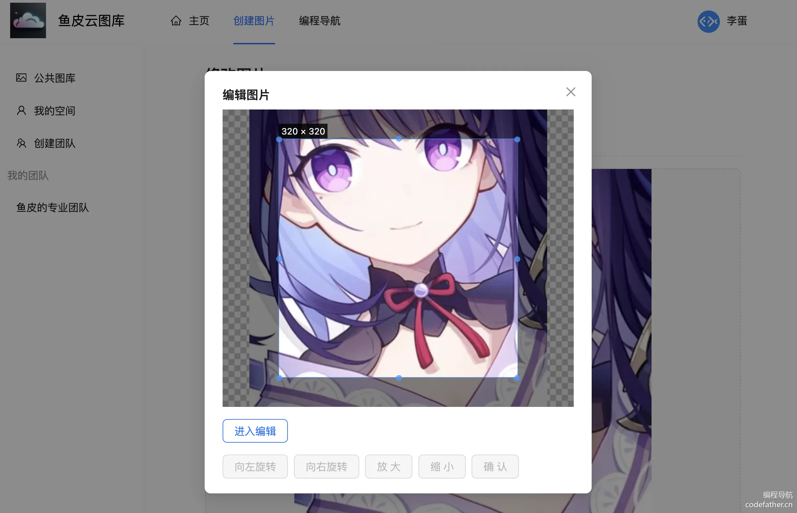

3）初始化 WebSocket 连接，绑定事件：

```typescript
let websocket: PictureEditWebSocket | null

// 初始化 WebSocket 连接，绑定事件
const initWebsocket = () => {
  const pictureId = props.picture?.id
  if (!pictureId || !visible.value) {
    return
  }
  // 防止之前的连接未释放
  if (websocket) {
    websocket.disconnect()
  }
  // 创建 WebSocket 实例
  websocket = new PictureEditWebSocket(pictureId)
  // 建立 WebSocket 连接
  websocket.connect()

  // 监听通知消息
  websocket.on(PICTURE_EDIT_MESSAGE_TYPE_ENUM.INFO, (msg) => {
    console.log('收到通知消息：', msg)
    message.info(msg.message)
  })

  // 监听错误消息
  websocket.on(PICTURE_EDIT_MESSAGE_TYPE_ENUM.ERROR, (msg) => {
    console.log('收到错误消息：', msg)
    message.error(msg.message)
  })

  // 监听进入编辑状态消息
  websocket.on(PICTURE_EDIT_MESSAGE_TYPE_ENUM.ENTER_EDIT, (msg) => {
    console.log('收到进入编辑状态消息：', msg)
    message.info(msg.message)
    editingUser.value = msg.user
  })

  // 监听编辑操作消息
  websocket.on(PICTURE_EDIT_MESSAGE_TYPE_ENUM.EDIT_ACTION, (msg) => {
    console.log('收到编辑操作消息：', msg)
    message.info(msg.message)
    switch (msg.editAction) {
      case PICTURE_EDIT_ACTION_ENUM.ROTATE_LEFT:
        cropperRef.value.rotateLeft()
        break
      case PICTURE_EDIT_ACTION_ENUM.ROTATE_RIGHT:
        cropperRef.value.rotateRight()
        break
      case PICTURE_EDIT_ACTION_ENUM.ZOOM_IN:
        cropperRef.value.changeScale(1)
        break
      case PICTURE_EDIT_ACTION_ENUM.ZOOM_OUT:
        cropperRef.value.changeScale(-1)
        break
    }
  })

  // 监听退出编辑状态消息
  websocket.on(PICTURE_EDIT_MESSAGE_TYPE_ENUM.EXIT_EDIT, (msg) => {
    console.log('收到退出编辑状态消息：', msg)
    message.info(msg.message)
    editingUser.value = undefined
  })
}

watchEffect(() => {
  initWebsocket()
})

onUnmounted(() => {
  // 断开连接
  if (websocket) {
    websocket.disconnect()
  }
  editingUser.value = undefined
})

// 关闭弹窗
const closeModal = () => {
  visible.value = false
  // 断开连接
  if (websocket) {
    websocket.disconnect()
  }
  editingUser.value = undefined
}
```

上述代码中的几个注意事项：

1. 定义了收到消息后的事件处理函数，比如收到编辑操作消息时，调用图片编辑器组件的对应操作方法，来同步编辑结果。收到有用户进入编辑状态的消息时，设置 editingUser 的值；收到有用户退出编辑状态的消息时，清空 editingUser 的值。
2. 及时释放 WebSocket 连接和资源：在组件销毁时（onUnmounted 函数）、弹窗关闭时（closeModal 函数）、重新连接时（initWebsocket 函数开头）都要释放连接并重置正在编辑的用户。

4）编辑发送 WebSocket 消息的函数，包括进入编辑状态、退出编辑状态、执行编辑图片操作：

```typescript
// 进入编辑状态
const enterEdit = () => {
  if (websocket) {
    // 发送进入编辑状态的消息
    websocket.sendMessage({
      type: PICTURE_EDIT_MESSAGE_TYPE_ENUM.ENTER_EDIT,
    })
  }
}

// 退出编辑状态
const exitEdit = () => {
  if (websocket) {
    // 发送退出编辑状态的消息
    websocket.sendMessage({
      type: PICTURE_EDIT_MESSAGE_TYPE_ENUM.EXIT_EDIT,
    })
  }
}

// 编辑图片操作
const editAction = (action: string) => {
  if (websocket) {
    // 发送编辑操作的请求
    websocket.sendMessage({
      type: PICTURE_EDIT_MESSAGE_TYPE_ENUM.EDIT_ACTION,
      editAction: action,
    })
  }
}
```

所有编辑图片的操作都要补充上发送 WebSocket 消息：

```typescript
// 向左旋转
const rotateLeft = () => {
  cropperRef.value.rotateLeft()
  editAction(PICTURE_EDIT_ACTION_ENUM.ROTATE_LEFT)
}

// 向右旋转
const rotateRight = () => {
  cropperRef.value.rotateRight()
  editAction(PICTURE_EDIT_ACTION_ENUM.ROTATE_RIGHT)
}

// 缩放
const changeScale = (num: number) => {
  cropperRef.value.changeScale(num)
  if (num > 0) {
    editAction(PICTURE_EDIT_ACTION_ENUM.ZOOM_IN)
  } else {
    editAction(PICTURE_EDIT_ACTION_ENUM.ZOOM_OUT)
  }
}
```

### 4、协同编辑范围控制

只有团队空间才支持协作编辑，否则还是跟之前一样，默认就进入可编辑状态。

为此，我们需要在 `ImageCropper` 组件中获取到空间信息，并判断是否为团队空间。

1）可以由引入该组件的父页面 `AddPicturePage` 获取空间信息：

```typescript
const space = ref<API.SpaceVO>()

// 获取空间信息
const fetchSpace = async () => {
  // 获取数据
  if (spaceId.value) {
    const res = await getSpaceVoByIdUsingGet({
      id: spaceId.value,
    })
    if (res.data.code === 0 && res.data.data) {
      space.value = res.data.data
    }
  }
}

watchEffect(() => {
  fetchSpace()
})
```

然后传入给组件：

```typescript
<ImageCropper
  ref="imageCropperRef"
  :imageUrl="picture?.url"
  :picture="picture"
  :spaceId="spaceId"
  :space="space"
  :onSuccess="onSuccess"
/>
```

2）在图片编辑组件中新增 space 属性：

```typescript
interface Props {
  imageUrl?: string
  picture?: API.PictureVO
  spaceId?: number
  space?: API.SpaceVO
  onSuccess?: (newPicture: API.PictureVO) => void
}
```

然后就可以根据 space 判断是否为团队空间了，定义一个变量便于复用：

```typescript
// 是否为团队空间
const isTeamSpace = computed(() => {
  return props.space?.spaceType === SPACE_TYPE_ENUM.TEAM;
})
```

3）使用该变量来控制协同编辑的范围，包括是否可编辑、是否初始化 WebSocket 连接：

```typescript
// 可以编辑
const canEdit = computed(() => {
  // 不是团队空间，则默认可编辑
  if (!isTeamSpace.value) {
    return true
  }
  return editingUser.value?.id === loginUser.id
})

watchEffect(() => {
  // 团队空间才初始化
  if (isTeamSpace.value) {
    initWebsocket()
  }
})
```

以及是否展示协同编辑操作的按钮：

```vue
<!-- 协同编辑操作 -->
<div class="image-edit-actions" v-if="isTeamSpace">
</div>
```

### 5、测试

OK，接下来就可以愉快地测试了。可以依次验证：

1. 编辑功能是否可以正常使用，能否正常进入和退出编辑状态、并保存图片
2. 验证资源能否正常释放
3. 验证用户编辑时，其他用户能否实时查看到效果
4. 验证用户编辑时，其他用户是否可以编辑
5. 验证用户 A 退出编辑或关闭弹窗后，其他用户是否可以进入编辑；用户 A 再次进入时，能否跟其他用户的操作保持同步。

效果如图：

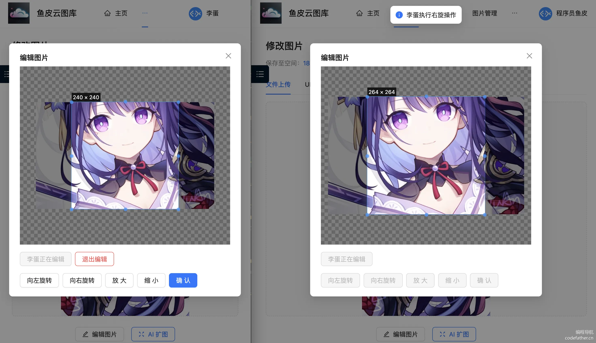

### 扩展

1、支持 WebSocket 断线重连，应对服务器突然宕机的情况

2、如果没有用户进入编辑状态，打开图片编辑弹窗时自动进入编辑，不需要手动点击按钮进入编辑

3、新增一个“用户保存”事件，某用户点击保存后，关闭其他用户的编辑弹窗，并且更新当前展示的图片

4、可能还会有一些细节问题，比如新用户打开编辑弹窗时，无法获取到正在编辑的用户信息、也无法获取到当前已编辑的图片状态，大家可以自行测试和优化。

5、可以通过传递 CSS 样式的方式实现裁切框区域的实时协作。但其实移动编辑框时并没有修改图片，所以作用不是很大。

------

以上就是本期教程，希望大家通过这些示例图片协同编辑操作，学会实时协同业务的设计和开发方法，以后开发更复杂的实时协作系统都是类似的~


# 13 - DDD 重构

## 本节重点

之前我们已经完成了本项目的功能开发。由于本项目功能丰富、代码量大，如果是在企业中维护开发的项目，传统的 MVC 架构可能会让后续的开发协作越来越困难。所以本节鱼皮要从 0 带大家学习一种新的架构设计模式 —— DDD 领域驱动设计。

大纲：

- 软件架构模式的演进
- DDD 领域驱动设计概念
- DDD 架构设计
- 项目 DDD 重构

通过本节，你将掌握 DDD 领域驱动架构设计，掌握快速的、标准的、通用的重构传统 MVC 项目为 DDD 架构项目的方法，学会之后几乎任何项目都能轻松改造为 DDD 项目。

## 一、软件架构模式的演进

在学习 DDD 之前，我们需要先知晓软件架构模式的演进之路。

为了应对软件系统日益复杂化的需求，从最初的简单传统单体架构到如今复杂的分布式和微服务架构，软件架构的演变经历了多个阶段，主要有以下三个典型阶段：

### 传统单体架构

所有的应用功能都集成在一个单一的应用程序中，所有模块和组件都在同一个进程内运行，请求直接操作数据库，不进行代码分层，易于开发和部署，尤其适合小型或简单的应用。

随着业务增长和需求变更，单体架构变得难以扩展和维护。不同功能的模块耦合在一起，导致更新某个功能可能影响到整个系统。

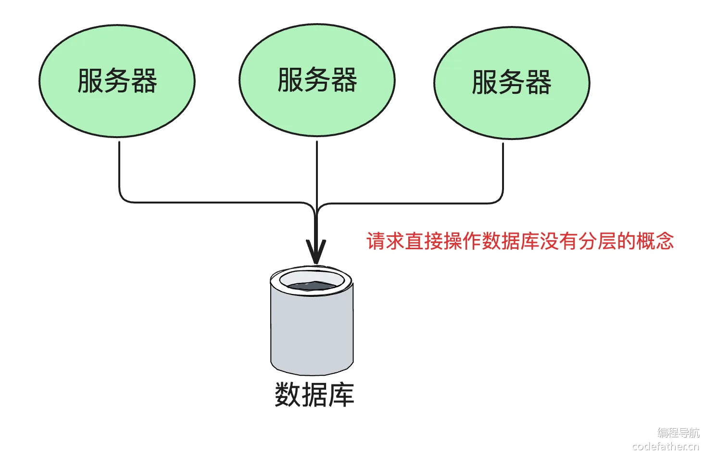

### 分层架构

应用被划分为不同的层（如业务接入层、业务逻辑层、数据访问层等），每一层负责特定的功能，层与层之间通过接口进行交互，促进了模块化和职责分离，便于管理和维护。

但层与层之间的紧密耦合限制了灵活性，且随着系统的复杂度增加，可能导致性能下降和维护难度增加，并且它的可扩展性和弹性伸缩性差。

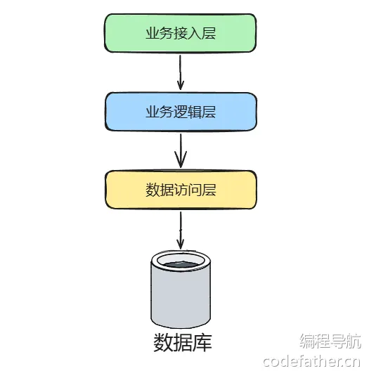

### 微服务架构

将系统拆分为多个小而独立的服务，每个服务负责处理一组特定的功能，每个服务通常由独立的团队开发、部署和维护，服务之间通过轻量级协议（如 HTTP、自定义协议或消息队列）进行通信。

服务之间独立，易于扩展和维护。每个微服务都可以独立部署、开发和扩展，且易于使用不同的技术栈。

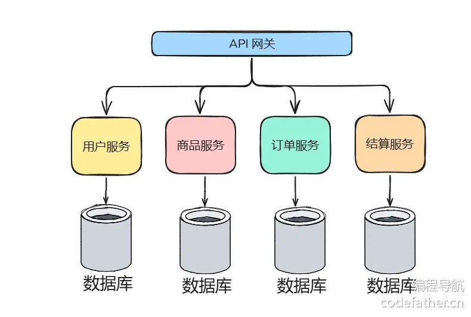

## 二、DDD 领域驱动设计概念

### 什么是 DDD？

DDD（领域驱动设计，Domain-Driven Design） **是一种软件开发方法论和设计思想**。DDD 通过领域驱动设计方法定义领域模型，**从而确定业务和应用的边界**，保证业务模型和代码模型的一致性。

因为 DDD 主要应用在微服务架构场景，所以想要更好的理解 DDD 的概念，需要结合微服务架构来看：

- DDD 是一种设计思想，**确定业务和应用的边界**
- 微服务架构需要 **将系统拆分为多个小而独立的服务**

是不是有点感觉了？已经知道 DDD 是用来做什么的了？

微服务的拆分一直是业界的一个难题：微服务拆分的粒度应该多大？服务到底应该如何拆分？服务之间的边界如何定义？

有人可能认为，微服务不就是拆就完事了？不需要管那么多！实际上微服务的拆分是门 “艺术”：

- 服务拆分的太细，项目复杂度会过高，接口的调用成本、服务运维成本大幅上升。
- 服务拆分的太粗，业务边界变得模糊，服务的耦合度还是过高，失去了微服务的优势。

而 DDD 就是一个方法论，指导我们根据领域模型确定业务的边界，从而划分出应用的边界，最终落实成服务的边界、代码的边界。

本课程虽然没有涉及到微服务，但是不妨碍利用 DDD 思想拆分代码架构。最终想要变成微服务架构仅需抽离包中的代码独立部署即可。

#### DDD 的目标

1. 通过领域模型实现业务需求：开发者与领域专家共同理解业务需求，形成共享语言并构建模型。
2. 提高系统的灵活性与可维护性：通过合理划分限界上下文，减少系统的耦合度，使得不同模块或子系统可以独立演化。
3. 支持复杂业务逻辑的表达：通过深入的业务建模，使得复杂的业务逻辑能够清晰、准确地反映在代码中。

**总结一下，就是让系统更贴合业务，让大型系统更利于独立建设和维护。**

#### DDD 的适用场景

- 业务复杂的系统：如金融系统、电商平台等，涉及的业务逻辑复杂且频繁变化。
- 需要与多个部门或团队合作的项目：DDD 强调跨部门协作，适用于多方参与的大型项目。
- 长周期、长期维护的项目：DDD 强调可维护性与演化，适合需要长期维护和扩展的系统。

**总结一下，大型的、跨部门协作的、长期维护的复杂项目。**

### DDD 的建设

DDD 会先建立领域模型，根据业务划分领域边界，进而确定微服务的边界，然后再根据领域分块编码实现。

实际上 DDD 的建设包括 **战略设计** 和 **战术设计** 两部分。

下面这些内容对没有参加过企业工作的同学来说会有些难理解，学习时可以跳过。

#### 战略设计

从业务出发，建立领域模型，统一限界上下文。

设计时，需要先进行事件风暴（类似于头脑风暴），邀请领域专家、架构师、开发人员、测试人员、产品经理、项目经理等团队人员一起参加讨论。

描述个场景，大家在会议室里，搞一个大白板，参与者们将自己的想法和意见写在贴纸里并罗列到白板上，大家 **先发散思维** 进行讨论、记录。

主要讨论的内容是：系统会涉及哪些业务，哪个业务动作会触发另一个业务的什么动作，其间的输入是什么？输出是什么？

通过这类分析把所有的业务、业务行为、业务结果都罗列出来，拆分出领域模型中的事件、命令、实体等领域对象。然后梳理这些领域对象之间的关系，从不同维度进行聚类，形成聚合、聚合根、限界上下文等，这个过程就是 **收敛。** 限界上下文可以简单理解为微服务的边界，将其映射到代码模型，就完成了微服务的拆分。

💡 事件风暴实际上会利用常见的产品设计和用户体验分析方法，比如：

- 用例分析：对系统功能需求进行描述，以确定系统如何与外部参与者（即用户或其他系统）进行交互
- 场景分析：通过设定具体的情境或情景，来探讨用户如何在不同的环境下使用产品或系统
- 用户旅程分析：从用户的角度，描绘用户在使用产品或服务的过程中，从开始到结束的一系列步骤或行为

#### 战术设计

从技术实现出发，将领域模型和代码模型进行映射

这个阶段就是完成代码落地，包括聚合、聚合根、实体、值对象等代码逻辑的设计与实现。

### DDD 体系名词解析

#### 1、领域

领域指系统关注的业务领域或问题空间，具体的领域与公司或组织的核心业务有关。

实际上在 DDD 中 **领域就是用来确定范围**，而范围就是边界。

一个领域又可以分为多个子领域，每个子领域代表系统的一部分业务。

而子域根据重要程度和功能特性，可划分为：

- 通用域：指系统中一些通用的、不特定于某一业务的领域，它们在多个不同领域或系统中都有应用。（例如支付、日志管理）
- 支撑域：指在系统中起到支持作用，但并不是直接驱动业务价值的部分（例如网关）
- 核心域：指系统中最关键的部分，是业务的核心竞争力所在，能够为企业带来最大的价值

💡 这里需要注意，在不同业务（公司中）三类子域是有区别的，例如在普通公司中需要调用第三方支付，那么支付是通用域，但是对于支付公司（例如支付宝）来说支付是它们的核心域。

#### 2、限界上下文

是指一个明确的边界，规定了某个子领域的业务模型和语言，确保在该上下文内的术语、规则、模型不与其他上下文冲突。

在事件风暴讨论过程中，我们需要完成通用语言的统一。例如电商场景下，我们统一叫物品为商品、将用户购买商品的行为叫下单。

我们都知道语言需要有语义环境。不同语义环境下，同一个语言表达的意思是不同的。比如：

- “我吃得很饱，现在不能动了”：这里的“吃得很饱”表示的是 “吃到肚子很满”，字面意思是 “我已经吃得很饱了，吃不下了”
- “我吃得很饱，今天的演讲让人充实”：这里的 “吃得很饱” 并非字面上的 “吃得饱”，而是比喻 “得到了很大的满足”，表现出内心的充实感。

而限界上下文实际上就类似于语义环境。通用语言需要业务边界，限界上下文就是定义了业务的边界，也就是领域的边界。

电商语义下称之为商品的东西，到运输语义下它就变成了货物。因此我们需要明确限界上下文，在这个上下文中团队内部人员对某一领域对象、领域事件的认知是一致的、没有歧义的。

#### 3、实体

一般业务对象，且具有唯一标识对象都是实体。在代码中所谓的唯一标识就是 ID，例如，订单有订单 ID，用户有用户 ID，它们都是典型的实体。

**实体的关键点就在于唯一标识**，随着生命周期的变化，实体中的属性可能会改变，例如订单可以从未完成变成已完成，但是其 ID 不会改变。

实体映射到代码中就是实体类。通常采用 **充血模型** 来实现，即与这个实体相关的所有业务逻辑都写在实体类中。

如果需要跨多个实体才能完成的业务逻辑，会写在领域服务中。

#### 4、值对象

值对象没有唯一标识，创建后就不允许修改了，只能用另外一个值对象来进行 **整体替换**。通常用于描述对象的属性，用于对实体的状态和特征进行描述。

非常典型的值对象就是地址。比如用户实体对象有地址这个属性，那么这个地址就是值对象，它没有唯一标识，且创建后就不允许修改其本身的值。如果用户需要修改地址，那么这个属性是被整体替换的（换新的地址值对象）。

拥有这样特性的对象，就是值对象。

💡 实体和值对象并不是一成不变的，比如对电脑主机来说，显卡是一个值对象，显卡坏了就换一个，而对显卡厂商来说，显卡是实体，它们有编号需要追踪和管理的。

#### 5、聚合

实体和值对象是基础的领域对象，聚合将多个实体和值对象组合成一个整体，实现高内聚低耦合。

简单来说实体和值对象是个体，个体与个体之间的合作需要被“领导”，而聚合就是将它们组织起来协同工作，这样才能保证聚合内数据的一致性（组织统一口径）。它可以作为微服务拆分的最小单位。

聚合还是数据修改和持久化的基本单位，实现数据的持久化存储。

#### 6、聚合根

聚合根就好比聚合内的带头人，聚合内的多个实体不会直接对外提供接口访问，而是由聚合根统一提供对外接口。

**一个聚合内只会有一个聚合根**，聚合根通过对象引用的方式组织聚合内的实体和值对象，聚合根之间的合作是通过 ID 关联的。

这里需要注意：聚合根也是一个实体，也具有业务属性和业务逻辑和唯一标识。

例如订单域内只有订单和订单子项两个实体，那个订单就是这个域中的聚合根。

#### 7、领域服务

聚合根可以实现跨多个实体的复杂业务行为，但是为了实现高内聚和低耦合，聚合根内部应该更聚焦与自身强关联的业务行为，复杂的跨多实体的业务可以放在领域服务中实现。

领域服务是指那些 **不能归属于某个单一实体或值对象，但又属于领域模型的一部分** 的业务逻辑。领域服务封装了对领域对象进行操作的核心业务规则，通常用于处理跨多个实体的操作，或者当业务逻辑无法直接归属于某个特定聚合时。

例如一个订单系统，需要处理订单支付功能，而支付涉及订单、用户账户、支付信息等多个实体，这个支付操作不太好归属某个实体，这样的逻辑就可以放到领域服务中。

```java
public class PaymentService {
    public void processPayment(Order order, PaymentDetails paymentDetails, Account account) {
        // 处理支付逻辑
        // 调用多个实体方法来处理支付过程
    }
}
```

那聚合根更适合怎样的跨实体的业务呢？

例如你有一个“订单”聚合，其中包含订单条目、支付信息等，Order 作为聚合根，负责管理订单条目和确保订单的完整性。你不能直接访问订单条目（如 OrderItem），必须通过 Order 聚合根来进行操作。

```java
public class Order {
    private List<OrderItem> items;
    private PaymentDetails paymentDetails;

    public void addItem(OrderItem item) {
        // 检查商品数量、价格等业务规则
        this.items.add(item);
    }

    public List<OrderItem> getOrderItems() {
        //....
    }

    // 其他聚合内部的一致性校验
}
```

#### DDD 建模总结

结合上面的名词解析，我们回顾一下 DDD 建模的流程。

首先我们需要领域建模，此时会进行事件风暴，通过用例分析、场景分析等方式列出所有的业务行为与事件，找出产生这些行为的领域对象，包括实体与值对象。梳理这些领域对象之间的关系，从实体中找出聚合根，再根据聚合根的业务，找寻与其业务紧密关联其它实体与值对象，从而形成聚合。多个聚合之间根据业务相关性又可以划出限界上下文。

可以通过 “开公司” 的比喻来帮助大家理解 DDD。领域就像公司的行业，决定了公司所从事的核心业务；限界上下文是公司内部的各个部门，每个部门有独立的职责和规则；实体是公司中的员工，具有唯一标识和生命周期；值对象是员工的地址或电话等属性，只有值的意义，没有独立的身份；聚合是部门，由多个实体和值对象组成，聚合根（如部门经理）是部门的入口，确保部门内部的一致性；领域服务则是跨部门的职能服务，比如 HR 或 IT 服务，为各部门提供支持和协作。

## 三、DDD 架构设计

### 充血模型和贫血模型

贫血模型和充血模型是两种面向对象设计模式，用于描述对象的职责划分和对象是否包含行为逻辑。

我们常见的对象内部的实现非常简单，仅包含数据属性和简单的 `getter`/`setter` 方法，换句话说，这些对象是一个纯粹的“数据容器”，它仅负责保存数据，而不包含任何业务行为。

从领域模型设计角度来说，这样的设计称为贫血模型，偏向于传统分层架构的设计；与之对应的是充血模型，强调面向对象的系统设计。

两种模型的分类本质是对领域对象中 “数据与行为的职责划分” 的不同理解。反映了在软件设计中，如何组织领域对象的数据和行为，以及如何分配业务逻辑的不同设计思路。

充血模型是指领域对象不仅包含数据（属性），还包含处理这些数据的业务逻辑。换句话说，充血模型的领域对象是“充血”的，它们不仅有状态（数据），还有行为（业务方法）。

贫血模型则是指领域对象仅包含数据，不包含任何业务逻辑，所有的业务逻辑都放在单独的服务类中（通常是应用层或领域服务层）。领域对象本身是 “贫血” 的，只有状态，没有行为。

总结来看：

- **充血模型** 适合复杂业务，业务逻辑和数据紧密结合，符合面向对象设计的原则。
- **贫血模型** 适合简单业务，关注点分离，数据和业务逻辑分开，领域对象仅负责存储数据，服务类负责业务逻辑。

下面用代码举例，大家就知道它们的区别了。

#### 代码示例

假设我们有一个订单系统，Order 是领域对象，包含了订单的状态和相关的业务逻辑。

1）充血模型代码示例

在充血模型中，Order 对象包含了业务逻辑（如 pay 和 cancel 方法），这些方法对订单的状态进行操作，直接将数据和行为结合在一起。

```java
public class Order {
    private String orderId;
    private double totalAmount;
    private boolean isPaid;

    public Order(String orderId, double totalAmount) {
        this.orderId = orderId;
        this.totalAmount = totalAmount;
        this.isPaid = false;
    }

    public void pay() {
        if (this.isPaid) {
            throw new IllegalStateException("Order is already paid");
        }
        this.isPaid = true;
    }

    public void cancel() {
        if (this.isPaid) {
            throw new IllegalStateException("Cannot cancel a paid order");
        }
        // Perform cancellation logic
    }

    public boolean isPaid() {
        return isPaid;
    }

    public double getTotalAmount() {
        return totalAmount;
    }
}
```

2）贫血模型代码示例

在贫血模型中，Order 对象只包含数据（状态），而所有的业务逻辑（如 payOrder 和 cancelOrder）都被移到了外部的 OrderService 服务类中。

```java
public class Order {
    private String orderId;
    private double totalAmount;
    private boolean isPaid;

    public Order(String orderId, double totalAmount) {
        this.orderId = orderId;
        this.totalAmount = totalAmount;
        this.isPaid = false;
    }

    public String getOrderId() {
        return orderId;
    }

    public double getTotalAmount() {
        return totalAmount;
    }

    public boolean isPaid() {
        return isPaid;
    }

    public void setPaid(boolean paid) {
        isPaid = paid;
    }
}

public class OrderService {
    public void payOrder(Order order) {
        if (order.isPaid()) {
            throw new IllegalStateException("Order is already paid");
        }
        order.setPaid(true);
    }

    public void cancelOrder(Order order) {
        if (order.isPaid()) {
            throw new IllegalStateException("Cannot cancel a paid order");
        }
        // Perform cancellation logic
    }
}
```

#### 二者对比

| 特点         | 贫血模型                         | 充血模型                         |
| ------------ | -------------------------------- | -------------------------------- |
| 封装性       | 数据和逻辑分离                   | 数据和逻辑封装在同一对象内       |
| 职责分离     | 服务类负责业务逻辑，对象负责数据 | 对象同时负责数据和自身的业务逻辑 |
| 适用场景     | 简单的增删改查、DTO 传输对象     | 复杂的领域逻辑和业务建模         |
| 优点         | 简单易用，职责清晰               | 高内聚，符合面向对象设计思想     |
| 缺点         | 服务层臃肿，领域模型弱化         | 复杂度增加，不适合简单场景       |
| 面向对象原则 | 违反封装原则                     | 符合封装原则                     |

在实际项目中，贫血模型和充血模型并非互相排斥。通常可以结合两者的优点：

- 使用充血模型作为领域模型，封装复杂的业务逻辑。
- 使用贫血模型作为数据传输对象（DTO），在系统之间传输数据。

#### 扩展知识 - 缺血模型和涨血模型

1）缺血模型

上面贫血模型的示例可以视为缺血模型的一种表现形式。缺血模型实际上是贫血模型的进一步简化或极端化版本。

在缺血模型中，不仅对象没有业务逻辑，甚至服务层也缺乏真正的业务逻辑，系统的整体设计趋向于 CRUD（增删改查）开发，会将所有逻辑转移到外部。

需要注意的是，领域对象不包含任何业务逻辑即可称为贫血模型，无需刻意强调是否属于缺血模型，除非是在贫血模型与缺血模型对比的语境中。

2）涨血模型

涨血模型则是充血模型的极端化表现，不仅将所有核心业务逻辑集中于领域模型中，甚至连非核心逻辑（如数据库事务处理、权限校验等）也全部包含其中。

在实际应用中，**缺血模型和涨血模型并不常用，这里仅做扩展了解**。我们通常只需关注贫血模型和充血模型的设计取舍即可。

### DDD 的分层架构

在领域驱动设计（DDD）中，分层架构模型是一种常见的设计模式，用于组织和管理系统的复杂性。通过将应用分为不同的层次，每一层都有清晰的责任和角色，从而促进了代码的高内聚、低耦合和可维护性。

DDD 的分层架构主要有四层：**用户接口层**、**应用层**、**领域层**、**基础设施层**。每层负责不同的职责，协调工作以实现系统的整体功能。

除基础设施层外，严格来说每层只能与 **直接下层** 产生依赖，即领域层只能被应用层调用，应用层只能被用户接口层调用。

当然也有 **松散分层架构**，层与层之间的依赖和交互更加灵活，不严格分隔。适用于快速开发，但随着系统复杂度的增加，可能变得难以维护。

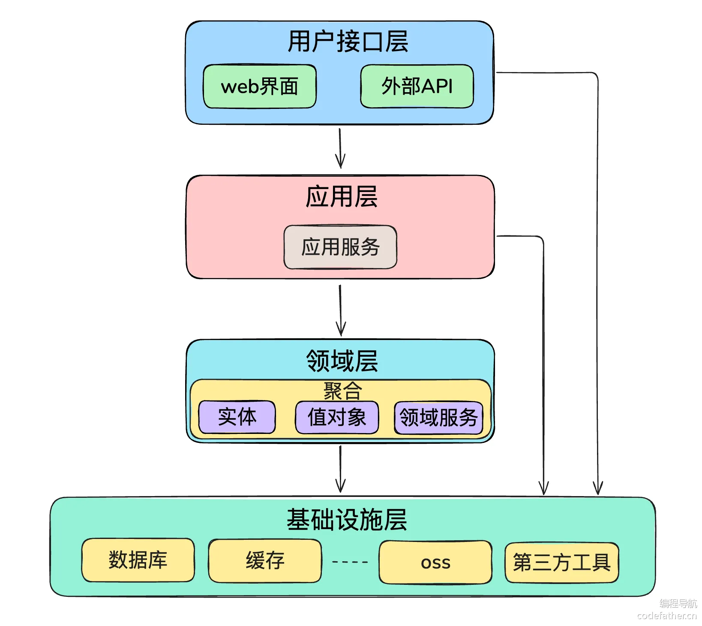

1）用户接口层

也叫表示层或 Web 层，主要负责与外部（用户、API 等）的交互。它的主要职责是接收用户输入并返回系统的输出。表示层不包含业务逻辑，而是将用户的请求转发到应用层处理，并将处理结果返回给用户。

2）应用层

应用层主要用来协调领域层的逻辑和基础设施层的资源。应用层不包含业务规则或业务逻辑，但会调用领域层的服务进行服务编排与组合，来实现特定的业务。

如果有对其他服务的远程调用，也放在这层实现。除此之外，权限校验、事务、事件等操作也都可以放在这层进行实现。

3）领域层

领域层是整个架构的核心，包含了应用的业务逻辑、规则和策略。它定义了核心的领域模型，包括聚合根、实体、值对象、领域服务等。

领域层的目的是将业务需求转化为代码，并确保业务规则在应用中得以执行。该层的设计强调与业务领域的紧密耦合，是 DDD 中的重点。

4）基础设施层

基础设施层提供技术支持和持久化服务，采用依赖倒置设计，封装基础资源。负责与外部系统（如数据库、消息队列、缓存等）的交互。基础设施层的主要职责是实现应用层和领域层所需要的技术服务，如数据存储、邮件发送、日志记录等等。

依赖倒置设计实际上指的是各层对基础资源（如数据库）仅依赖其接口而不是具体的实现，假设后续替换基础资源（数据库），仅需替换具体实现，不需要修改各层依赖的代码。

#### 三层架构到 DDD 四层架构的转化

三层架构是传统的架构模式，结合 SpringMVC 通常由以下三层组成：

- 表示层（Controller 层）：处理 HTTP 请求，调用业务层的服务，返回视图或数据。
- 业务逻辑层（Service 层）：封装核心业务逻辑，执行业务操作。
- 数据访问层（Repository 层）：负责与数据库交互，执行数据的持久化和查找。

转化 DDD 四层架构映射关系如下图所示：

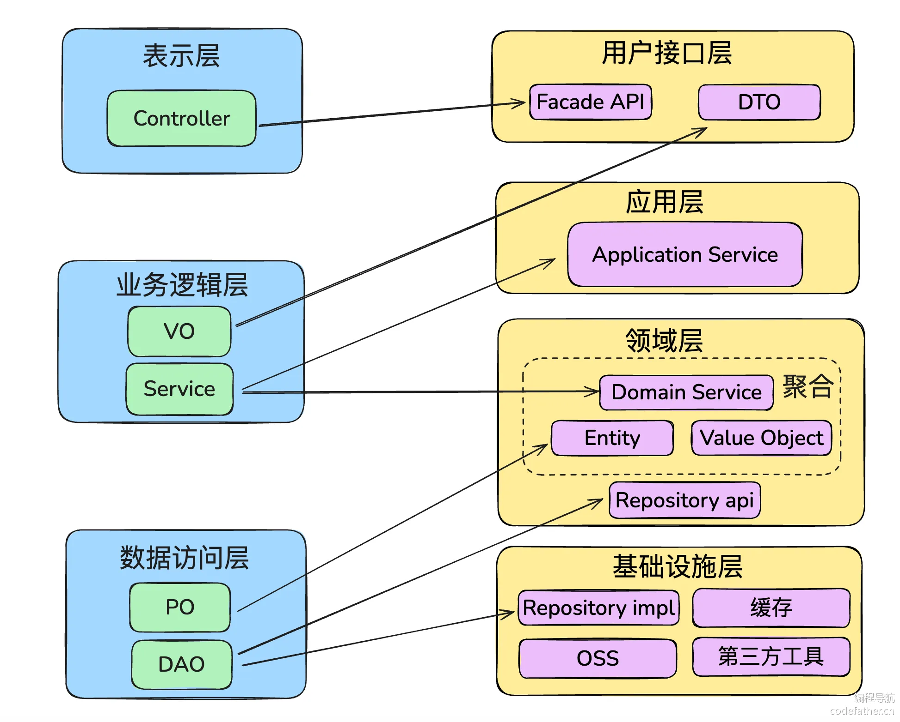

主要改造点就是业务逻辑层的 Service，根据聚合拆分到应用层的应用服务与领域层的领域服务，部分业务逻辑还会以充血模型下沉到 Entity 中。

接着就是数据访问层的改造，根据依赖倒置原则，**数据库的访问接口会被放到领域层中（因为属于行为）**，具体的访问实现则是在基础设施层内（为行为提供支持）。除此之外，第三方工具、Common、Config 等都放在基础设施层中。

### DDD 代码架构

首先明确一点，**DDD 代码架构并没有统一的标准**，不同公司的架构都是不一样的！但是核心的思想都是大差不差的，仅一些细节有调整。

按照四层架构，我们可以建立 interfaces（用户接口层）、application（应用层）、domain（领域层）、infrastructure（基础设施层） 这 4 个包。

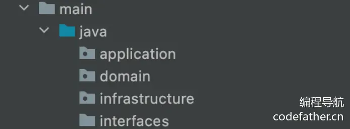

interface 是 Java 关键字，因此包名加了个 s。

#### 1、interface

该层主要负责与外部系统交互，包括用户界面（UI）、API接口、请求的接收和响应的返回等。它作为领域层与外部世界的接口，确保领域逻辑的解耦。

存放的代码：

- 控制器（Controller）：处理HTTP请求，负责路由和请求的转发。
- REST API 接口：定义暴露给外部系统的服务接口。
- 请求和响应对象：用于与外部系统交换数据。

#### 2、application

该层负责协调多个领域对象的操作，完成应用级的任务。它充当领域层与用户接口层之间的桥梁，调用领域层中的业务逻辑，并将结果返回给用户接口层。应用层的职责是实现具体用例，而不包含业务规则。

存放的代码：

- 应用服务（Application Service）：负责组织和协调领域对象，处理跨多个聚合的操作，通常表示应用中的具体功能，如“下订单”或“注册用户”。

#### 3、domain

该层包含核心业务逻辑，它是系统的核心部分，负责模型的定义和业务规则的实现。领域层中的模型代表着业务概念，通常会包括聚合、实体和值对象。这个层不依赖于任何外部技术或框架，它专注于业务本身。

存放的代码：

- 聚合：一个聚合由多个实体和值对象构成，它们之间有着一致的业务规则，**一般包名就代表一个聚合**。
- 实体：具有唯一标识符（ID）的对象。
- 值对象：没有身份标识且是不可变的对象，通常用于表示某个概念的属性。
- 领域服务：当某个业务逻辑无法归属到某个实体或聚合时，使用领域服务来封装这些业务逻辑。
- 领域事件：表示领域中发生的某个重要事件，如“订单已支付”。
- 仓储接口：定义资源访问的接口
- 持久化对象：PO（数据库查询逻辑不复杂时，可以省略）

#### 4、infrastructure

该层提供技术支持，是所有其他层的基础设施。它包含数据库操作、消息队列、缓存、文件存储等第三方依赖。基础设施层实现了与外部系统的交互，但不包含业务逻辑。

存放的代码：

- 持久化：如使用 JPA 或 MyBatis 等技术实现数据库的访问。
- 外部系统集成：与外部服务或系统的通信，如调用文件存储。
- 工具类和基础设施组件：提供诸如日志、定时任务、邮件发送等功能。

#### 项目目录结构示例

main/java 包下：

- application（应用层）
- domain（领域层）
- order（订单聚合）
- entity（实体）
- valueObject（值对象）
- event（事件）
- repository（仓储）
- service（领域服务）
- user（用户聚合）
- infrastructure（基础设施层）
- api（外部接口）
- config（配置）
- mq（消息队列）
- repository（仓储实现）
- facade（仓储接口）
- po（持久化对象）
- util（工具类）
- interfaces（用户接口层）
- assembler（对象转化类）
- dto（传输对象）
- controller（提供给用户界面、外部服务的接口）
- shared（共享模块）
- Application 项目主类（或启动类）

此外，实现 DDD 的过程中，还可能会用到工厂和仓储模式。

- 工厂：用于创建聚合和实体，因为聚合根与聚合内的实体、值对象关系比较复杂，为了确保对象创建的一致性和完整性会使用工厂模式来创建领域对象（通常从数据库获取 PO 持久化对象后，通过工厂模式创建 DO 领域对象）。
- 仓储：用于持久化领域对象（如实体和聚合），它封装了数据库操作，使得业务逻辑与数据存储分离。

## 四、项目 DDD 重构

下面我们要将项目重构为 DDD 模式，这个过程不仅涉及到目录结构的改造，还涉及到大量方法的重构、代码的改造等。

在开始之前明确一点：**DDD 项目的改造没有一个绝对的标准！**一定要根据实际项目的需求和复杂度综合评估改造的逻辑。

来看下改造后的项目包结构，有个印象即可，下面带大家依次实战：

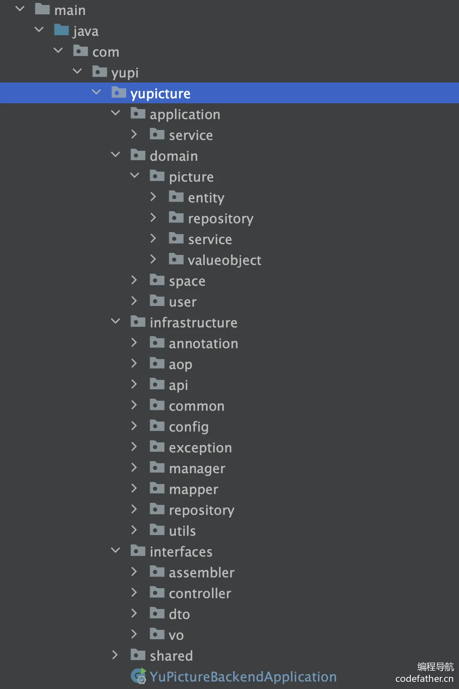

### 改造方案

#### 1、领域划分

首先，从系统的功能点出发，并且考虑到要利于拆分，将系统划分为以下 3 个领域：

1. 用户领域（User Domain），用户注册、登录、获取个人信息等等用户相关功能放在这个领域中。
2. 图片领域（Picture Domain），包括图片上传、删除、编辑、URL 上传、批量管理等功能。
3. 空间领域（Space Domain），包括空间创建、空间管理、空间分析、空间成员管理等。

#### 2、改造方案

一般项目的重构都要有序进行，所以我们要先 **浅层改造**，也就是将原有代码移动到不同的目录中，但是尽量不改变代码内容本身。有些博主就是这么做的，其实是一种省事儿的方法，不能说这样改造就错了，但效果就是“项目看起来像是 DDD 架构设计”，实际上缺少灵魂。

所以在划分目录后，还要 **深层改造**，比如将原有的 Service 层服务进行拆分，将对象转换类代码移动到 interfaces 层的 assembler 中、将简单的业务逻辑移动到 domain.entity 实体类中、将跨领域调用的方法移动到 application.service 应用服务中等等。

大家思考一下，如果让你来改造 DDD 项目，你具体会怎么执行呢？

是先把 DDD 目录结构建好，分为 4 个层，然后依次一层一层地完成 infrastructure、domain、application、interface 层的代码么？

这其实是传统的正向思维，按照目标的目录结构来重构。但是这样重构可能会出现一个问题，比如我在开发 domain 层的时候，有些 service 的方法可能要移动到 application 层或者 interface 层，这就会导致我们开发时经常要在各层的目录中进行跳转，增加了复杂度。

所以这里鱼皮结合自己的经验，给大家分享一种又快速、又轻松、又规范的改造方法。让我们使用 **逆向思维**，还原我们最初从 0 开发本项目的流程，**根据现有代码进行拆分，而不是按照特定的分层一层一层拆**。

举个例子，拆分原项目 model 包的时候，可以把 entity 放到 domain 层中，把 dto 和 vo 放到 interface 层中。

这样不仅思路清晰，不容易遗漏代码，而且按照 model => mapper => service => controller 的顺序拆分，每一层都不会缺少对下一层的依赖，不会出现类不存在的情况，能够大幅提高效率。

此外，建议大家一个领域一个领域地重构，而不是一次性把多个领域的代码同时改造，这样出了问题就不好还原了。

💡 DDD 重构的思路都是一致的，完整重构整个项目至少需要好几个小时，性价比不高，大家只需要重点学习一个领域的重构即可。

下面我们进入项目重构。

### 新建项目

首先基于原有的项目复制一个新的项目，然后新建一个根包，而不是改造原有的包。接下来我们可以持续将原有包的代码移动到新包中，从而提高重构效率。

需要先将 Spring Boot 的启动类移动到新包中，后续才能启动项目。

### 基础设施层

infrastructure 层是存放基础设施的代码，也就是通用的代码，所以要优先重构，步骤如下：

1）移动通用代码：先把 annotation、aop、common、config、exception 包放到 `infrastructure` 包下

2）移动数据访问层 mapper 包。**注意，要同步修改 MyBatisPlusConfig 扫描 mapper 的包名！**

```java
@MapperScan("com.yupi.yupicture.infrastructure.mapper")
public class MyBatisPlusConfig {}
```

3）将 CosManager 移动到 api 包中，因为该类主要是负责调用第三方对象存储 API，和业务无关（可以改名为 CosApi）。

这样原包的最外层就只有 constant、model、service、controller、manager 包了，重构后的 `infrastructure` 包结构如图：

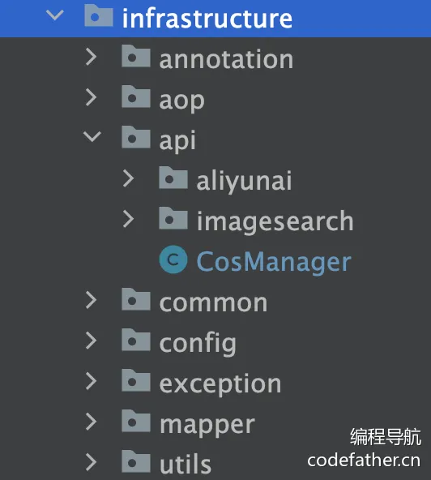

💡 为什么 Mapper 应该放在 infrastructure 层？

1. 职责划分：domain 层是业务逻辑的核心，应该专注于领域模型和业务规则，避免引入任何技术实现的细节。
   infrastructure 层是用来实现技术细节的，包括数据库访问、第三方服务集成、缓存实现等。而 MyBatis Plus 的 Mapper 类就是一种数据库访问的实现细节。
2. 与 DDD 的设计原则保持一致：在 DDD 中，domain 层的职责是独立于技术实现的，不能直接依赖具体的框架或持久化技术。将 Mapper 放在 infrastructure 层，可以避免技术细节 “污染” 领域层，保持领域模型的纯粹性。

### 用户领域

下面我们先拆分项目的核心模块 —— 用户领域，这个领域我会拆分地相对细一些，带大家学习标准的 DDD 重构方法。学会这一个领域之后，其他的领域重构就很简单了。

#### 1、重构 model 包

按照下面的规则，将原始 model 包中的代码移动到对应的新位置：

| 原始包         | 重构后的包              | 备注                          |
| -------------- | ----------------------- | ----------------------------- |
| model.entity   | domain.user.entity      | User 类                       |
| model.enums    | domain.user.valueobject | UserRoleEnum 枚举类           |
| model.dto.user | interfaces.dto.user     | 请求封装类                    |
| model.vo       | interfaces.vo.user      | 响应封装类LoginUserVO、UserVO |

#### 2、重构 constant 包

| 原始包   | 重构后的包           | 备注            |
| -------- | -------------------- | --------------- |
| constant | domain.user.constant | UserConstant 类 |

#### 3、重构数据访问层

根据前面讲过的依赖倒置原则，在领域包下新建 `repository` 包，定义与数据库交互的接口，然后在 `infrastructure.repository` 中写相应的实现。

由于我们的项目中使用了 MyBatis Plus 框架，可以让接口直接继承其提供的 IService 接口，接口的实现继承 ServiceImpl 类，这样就直接拥有了一批操作数据库的方法，简化开发。

新增 UserRepository 接口：

```java
package com.yupi.yupicture.domain.user.repository;

public interface UserRepository extends IService<User> {
}
```

新增 UserRepositoryImpl 实现类：

```java
package com.yupi.yupicture.infrastructure.repository;

@Service
public class UserRepositoryImpl extends ServiceImpl<UserMapper, User> implements UserRepository {
}
```

UserMapper 之前已经移动到了 infrastructure 包中，作为实现中的一部分。

#### 4、重构 Service

Service 层的重构是相对最麻烦的，但我们可以利用一些小技巧大幅提高重构效率。

1）首先，直接在 IDE 中移动 Service 接口和实现类到应用服务层。

| 原始类                       | 重构后的类                                          | 备注           |
| ---------------------------- | --------------------------------------------------- | -------------- |
| service.UserService          | application.service.UserApplicationService          | 应用服务接口   |
| service.impl.UserServiceImpl | application.service.impl.UserApplicationServiceImpl | 应用服务实现类 |

为什么要这么做呢？因为应用服务层是可供其他领域调用的，而之前的 Service 也是可供其他 Service 调用的。直接移动后，IDE 会 **自动重构代码**，将对原始服务接口的调用改为新应用服务接口的调用，减少了手动修改的代码量。

2）复制 Service 接口和实现类为领域服务层：

| 原始类                       | 重构后的类                                     | 备注           |
| ---------------------------- | ---------------------------------------------- | -------------- |
| service.UserService          | domain.user.service.UserDomainService          | 领域服务接口   |
| service.impl.UserServiceImpl | domain.user.service.impl.UserDomainServiceImpl | 领域服务实现类 |

为什么要这么做呢？因为领域服务层是编写核心业务逻辑的位置，也需要被应用服务层调用，所以先把原来的 Service 接口和实现类复制过来，便于等会儿按需保留代码或拆分代码。

3）重构应用服务层

application 层主要做领域服务的编排，事务一般也交由 application 层来控制。

应用服务层遵循的原则：

- 将业务逻辑下沉到 **领域服务或实体类** 中，应用服务层需要调用领域服务或实体类来完成业务逻辑。
- 如果某个方法需要调用其他应用服务（在单个领域内无法完成），那么该方法不能放到领域服务中，而是保留在应用服务中，因为原则上领域服务不应该调用应用服务。
- 负责为接口层提供调用支持，因为原则上接口层只能调用应用服务层。

比如用户注册方法，包含了校验和执行注册两部分业务逻辑。校验逻辑不涉及调用数据库，是对实体本身的校验，所以可以下沉到 User 实体中；执行注册需要操作数据库，可以下沉到领域服务 UserDomainService 中。而应用服务层要做的就是组合这些调用，并且 **增加事务** 等特性，得到完整的应用服务方法。用户登录方法同理。

给 User 实体补充方法：

```java
/**
 * 校验用户注册
 *
 * @param userAccount
 * @param userPassword
 * @param checkPassword
 */
public static void validUserRegister(String userAccount, String userPassword, String checkPassword) {
    // 1. 校验
    if (StrUtil.hasBlank(userAccount, userPassword, checkPassword)) {
        throw new BusinessException(ErrorCode.PARAMS_ERROR, "参数为空");
    }
    if (userAccount.length() < 4) {
        throw new BusinessException(ErrorCode.PARAMS_ERROR, "用户账号过短");
    }
    if (userPassword.length() < 8 || checkPassword.length() < 8) {
        throw new BusinessException(ErrorCode.PARAMS_ERROR, "用户密码过短");
    }
    if (!userPassword.equals(checkPassword)) {
        throw new BusinessException(ErrorCode.PARAMS_ERROR, "两次输入的密码不一致");
    }
}

/**
 * 校验用户登录
 *
 * @param userAccount
 * @param userPassword
 */
public static void validUserLogin(String userAccount, String userPassword) {
    if (StrUtil.hasBlank(userAccount, userPassword)) {
        throw new BusinessException(ErrorCode.PARAMS_ERROR, "参数为空");
    }
    if (userAccount.length() < 4) {
        throw new BusinessException(ErrorCode.PARAMS_ERROR, "账号错误");
    }
    if (userPassword.length() < 8) {
        throw new BusinessException(ErrorCode.PARAMS_ERROR, "密码错误");
    }
}
```

应用服务层的代码如下，补充了很多 interfaces 层需要调用的方法（比如 getUserById）：

```java
@Service
@Slf4j
public class UserApplicationServiceImpl implements UserApplicationService {

    @Resource
    private UserDomainService userDomainService;

    @Override
    @Transactional
    public long userRegister(UserRegisterRequest userRegisterRequest) {
        ThrowUtils.throwIf(userRegisterRequest == null, ErrorCode.PARAMS_ERROR);
        String userAccount = userRegisterRequest.getUserAccount();
        String userPassword = userRegisterRequest.getUserPassword();
        String checkPassword = userRegisterRequest.getCheckPassword();
        // 校验
        User.validUserRegister(userAccount, userPassword, checkPassword);
        return userDomainService.userRegister(userAccount, userPassword, checkPassword);
    }

    @Override
    public LoginUserVO userLogin(UserLoginRequest userLoginRequest, HttpServletRequest request) {
        ThrowUtils.throwIf(userLoginRequest == null, ErrorCode.PARAMS_ERROR);
        String userAccount = userLoginRequest.getUserAccount();
        String userPassword = userLoginRequest.getUserPassword();
        // 校验
        User.validUserLogin(userAccount, userPassword);
        return userDomainService.userLogin(userAccount, userPassword, request);
    }

    /**
     * 获取当前登录用户
     */
    @Override
    public User getLoginUser(HttpServletRequest request) {
        return userDomainService.getLoginUser(request);
    }

    /**
     * 用户注销
     */
    @Override
    public boolean userLogout(HttpServletRequest request) {
        ThrowUtils.throwIf(request == null, ErrorCode.PARAMS_ERROR);
        return userDomainService.userLogout(request);
    }

    @Override
    public LoginUserVO getLoginUserVO(User user) {
        return userDomainService.getLoginUserVO(user);
    }

    @Override
    public UserVO getUserVO(User user) {
        return userDomainService.getUserVO(user);
    }

    @Override
    public List<UserVO> getUserVOList(List<User> userList) {
        return userDomainService.getUserVOList(userList);
    }

    @Override
    public QueryWrapper<User> getQueryWrapper(UserQueryRequest userQueryRequest) {
        return userDomainService.getQueryWrapper(userQueryRequest);
    }

    @Override
    public long addUser(User user) {
        return userDomainService.addUser(user);
    }

    @Override
    public User getUserById(long id) {
        ThrowUtils.throwIf(id <= 0, ErrorCode.PARAMS_ERROR);
        User user = userDomainService.getById(id);
        ThrowUtils.throwIf(user == null, ErrorCode.NOT_FOUND_ERROR);
        return user;
    }

    @Override
    public UserVO getUserVOById(long id) {
        return userDomainService.getUserVO(getUserById(id));
    }

    @Override
    public boolean deleteUser(DeleteRequest deleteRequest) {
        if (deleteRequest == null || deleteRequest.getId() <= 0) {
            throw new BusinessException(ErrorCode.PARAMS_ERROR);
        }
        return userDomainService.removeById(deleteRequest.getId());
    }

    @Override
    public void updateUser(User user) {
        boolean result = userDomainService.updateById(user);
        ThrowUtils.throwIf(!result, ErrorCode.OPERATION_ERROR);
    }

    @Override
    public Page<UserVO> listUserVOByPage(UserQueryRequest userQueryRequest) {
        ThrowUtils.throwIf(userQueryRequest == null, ErrorCode.PARAMS_ERROR);
        long current = userQueryRequest.getCurrent();
        long size = userQueryRequest.getPageSize();
        Page<User> userPage = userDomainService.page(new Page<>(current, size),
                userDomainService.getQueryWrapper(userQueryRequest));
        Page<UserVO> userVOPage = new Page<>(current, size, userPage.getTotal());
        List<UserVO> userVO = userDomainService.getUserVOList(userPage.getRecords());
        userVOPage.setRecords(userVO);
        return userVOPage;
    }

    @Override
    public List<User> listByIds(Set<Long> userIdSet) {
        return userDomainService.listByIds(userIdSet);
    }

    @Override
    public String getEncryptPassword(String userPassword) {
        return userDomainService.getEncryptPassword(userPassword);
    }
}
```

💡 小技巧：只要发现不调用其他应用服务的方法、并且不调用 “当前类中依赖其他应用服务” 的方法，就可以改为调用领域服务；否则该方法需要在应用服务中实现。

4）重构领域服务层

领域服务层遵循的原则：

- 需要调用数据库服务（repository）或基础设施层（infrastructure）来完成业务逻辑
- 可以根据需要，将和实体强相关的业务逻辑下沉到 **实体类** 中

比如用户注册和用户登录方法，无需再包含校验逻辑（已经下沉到了 User 实体类中），只需要调用 UserRepository 执行数据库操作即可。

像 `isAdmin` 这样根据 User 对象进行判断的方法，可以下沉到 User 实体类中：

```java
/**
 * 是否为管理员
 *
 * @return
 */
public boolean isAdmin() {
    return UserRoleEnum.ADMIN.getValue().equals(this.getUserRole());
}
```

领域服务层的代码如下，补充了很多应用服务层需要调用的方法（比如 getById）：

```java
@Service
@Slf4j
public class UserDomainServiceImpl implements UserDomainService {

    @Resource
    private UserRepository userRepository;

    @Override
    public long userRegister(String userAccount, String userPassword, String checkPassword) {
        // 检查是否重复
        QueryWrapper<User> queryWrapper = new QueryWrapper<>();
        queryWrapper.eq("userAccount", userAccount);
        long count = userRepository.getBaseMapper().selectCount(queryWrapper);
        if (count > 0) {
            throw new BusinessException(ErrorCode.PARAMS_ERROR, "账号重复");
        }
        // 加密
        String encryptPassword = getEncryptPassword(userPassword);
        // 插入数据
        User user = new User();
        user.setUserAccount(userAccount);
        user.setUserPassword(encryptPassword);
        user.setUserName("无名");
        user.setUserRole(UserRoleEnum.USER.getValue());
        boolean saveResult = userRepository.save(user);
        if (!saveResult) {
            throw new BusinessException(ErrorCode.SYSTEM_ERROR, "注册失败，数据库错误");
        }
        return user.getId();
    }

    @Override
    public LoginUserVO userLogin(String userAccount, String userPassword, HttpServletRequest request) {
        // 2. 加密
        String encryptPassword = getEncryptPassword(userPassword);
        // 查询用户是否存在
        QueryWrapper<User> queryWrapper = new QueryWrapper<>();
        queryWrapper.eq("userAccount", userAccount);
        queryWrapper.eq("userPassword", encryptPassword);
        User user = userRepository.getBaseMapper().selectOne(queryWrapper);
        // 用户不存在
        if (user == null) {
            log.info("user login failed, userAccount cannot match userPassword");
            throw new BusinessException(ErrorCode.PARAMS_ERROR, "用户不存在或密码错误");
        }
        // 3. 记录用户的登录态
        request.getSession().setAttribute(USER_LOGIN_STATE, user);
        // 4. 记录用户登录态到 Sa-token，便于空间鉴权时使用，注意保证该用户信息与 SpringSession 中的信息过期时间一致
        StpKit.SPACE.login(user.getId());
        StpKit.SPACE.getSession().set(USER_LOGIN_STATE, user);
        return this.getLoginUserVO(user);
    }

    /**
     * 获取当前登录用户
     */
    @Override
    public User getLoginUser(HttpServletRequest request) {
        // 先判断是否已登录
        Object userObj = request.getSession().getAttribute(USER_LOGIN_STATE);
        User currentUser = (User) userObj;
        if (currentUser == null || currentUser.getId() == null) {
            throw new BusinessException(ErrorCode.NOT_LOGIN_ERROR);
        }
        // 从数据库查询（追求性能的话可以注释，直接返回上述结果）
        long userId = currentUser.getId();
        currentUser = userRepository.getById(userId);
        if (currentUser == null) {
            throw new BusinessException(ErrorCode.NOT_LOGIN_ERROR);
        }
        return currentUser;
    }

    /**
     * 用户注销
     */
    @Override
    public boolean userLogout(HttpServletRequest request) {
        // 先判断是否已登录
        Object userObj = request.getSession().getAttribute(USER_LOGIN_STATE);
        if (userObj == null) {
            throw new BusinessException(ErrorCode.OPERATION_ERROR, "未登录");
        }
        // 移除登录态
        request.getSession().removeAttribute(USER_LOGIN_STATE);
        StpKit.SPACE.logout();
        return true;
    }

    @Override
    public LoginUserVO getLoginUserVO(User user) {
        if (user == null) {
            return null;
        }
        LoginUserVO loginUserVO = new LoginUserVO();
        BeanUtils.copyProperties(user, loginUserVO);
        return loginUserVO;
    }

    @Override
    public UserVO getUserVO(User user) {
        if (user == null) {
            return null;
        }
        UserVO userVO = new UserVO();
        BeanUtils.copyProperties(user, userVO);
        return userVO;
    }

    @Override
    public List<UserVO> getUserVOList(List<User> userList) {
        if (CollUtil.isEmpty(userList)) {
            return new ArrayList<>();
        }
        return userList.stream().map(this::getUserVO).collect(Collectors.toList());
    }

    @Override
    public QueryWrapper<User> getQueryWrapper(UserQueryRequest userQueryRequest) {
        if (userQueryRequest == null) {
            throw new BusinessException(ErrorCode.PARAMS_ERROR, "请求参数为空");
        }
        Long id = userQueryRequest.getId();
        String userAccount = userQueryRequest.getUserAccount();
        String userName = userQueryRequest.getUserName();
        String userProfile = userQueryRequest.getUserProfile();
        String userRole = userQueryRequest.getUserRole();
        String sortField = userQueryRequest.getSortField();
        String sortOrder = userQueryRequest.getSortOrder();
        QueryWrapper<User> queryWrapper = new QueryWrapper<>();
        queryWrapper.eq(ObjUtil.isNotNull(id), "id", id);
        queryWrapper.eq(StrUtil.isNotBlank(userRole), "userRole", userRole);
        queryWrapper.like(StrUtil.isNotBlank(userAccount), "userAccount", userAccount);
        queryWrapper.like(StrUtil.isNotBlank(userName), "userName", userName);
        queryWrapper.like(StrUtil.isNotBlank(userProfile), "userProfile", userProfile);
        queryWrapper.orderBy(StrUtil.isNotEmpty(sortField), sortOrder.equals("ascend"), sortField);
        return queryWrapper;
    }

    @Override
    public String getEncryptPassword(String userPassword) {
        // 盐值，混淆密码
        final String SALT = "yupi";
        return DigestUtils.md5DigestAsHex((SALT + userPassword).getBytes());
    }

    @Override
    public Long addUser(User user) {
        // 默认密码 12345678
        final String DEFAULT_PASSWORD = "12345678";
        String encryptPassword = this.getEncryptPassword(DEFAULT_PASSWORD);
        user.setUserPassword(encryptPassword);
        boolean result = userRepository.save(user);
        ThrowUtils.throwIf(!result, ErrorCode.OPERATION_ERROR);
        return user.getId();
    }

    @Override
    public Boolean removeById(Long id) {
        return userRepository.removeById(id);
    }

    @Override
    public boolean updateById(User user) {
        return userRepository.updateById(user);
    }

    @Override
    public User getById(long id) {
        return userRepository.getById(id);
    }

    @Override
    public Page<User> page(Page<User> userPage, QueryWrapper<User> queryWrapper) {
        return userRepository.page(userPage, queryWrapper);
    }

    @Override
    public List<User> listByIds(Set<Long> userIdSet) {
        return userRepository.listByIds(userIdSet);
    }
}
```

💡 小技巧

1. 修改领域服务时，如果发现某个方法没被 application 调用（IDE 显示灰色），就可以直接移除掉。
2. 如果想节省重复编写增删改查等样板代码的时间，应用服务或领域服务也可以直接继承 MyBatis Plus 的接口和实现类，这样虽然 DDD 目录结构不是 100% 标准，但是能大幅减少开发成本。

#### 5、重构 Controller

1）首先将原始 UserController 移动为 `interfaces.controller.UserController` 类。

2）为保证接口层的精简，需要将其中的代码下沉到 **转换类和应用服务** 中。首先编写转换类 `interfaces.assembler.UserAssembler`，负责将 DTO 转为实体类：

```java
/**
 * 用户对象转换
 */
public class UserAssembler {

    public static User toUserEntity(UserAddRequest request) {
        User user = new User();
        BeanUtils.copyProperties(request, user);
        return user;
    }

    public static User toUserEntity(UserUpdateRequest request) {
        User user = new User();
        BeanUtils.copyProperties(request, user);
        return user;
    }
}
```

3）将 Controller 的代码下沉到应用服务中，调用应用服务和 Assembler 来处理请求。可能会涉及到应用服务方法的参数修改，代码如下：

```java
/**
 * 用户接口
 */
@RestController
@RequestMapping("/user")
public class UserController {

    @Resource
    private UserApplicationService userApplicationService;

    // region 登录相关

    /**
     * 用户注册
     */
    @PostMapping("/register")
    public BaseResponse<Long> userRegister(@RequestBody UserRegisterRequest userRegisterRequest) {
        long result = userApplicationService.userRegister(userRegisterRequest);
        return ResultUtils.success(result);
    }

    /**
     * 用户登录
     */
    @PostMapping("/login")
    public BaseResponse<LoginUserVO> userLogin(@RequestBody UserLoginRequest userLoginRequest, HttpServletRequest request) {
        LoginUserVO loginUserVO = userApplicationService.userLogin(userLoginRequest, request);
        return ResultUtils.success(loginUserVO);
    }

    /**
     * 用户注销
     */
    @PostMapping("/logout")
    public BaseResponse<Boolean> userLogout(HttpServletRequest request) {
        boolean result = userApplicationService.userLogout(request);
        return ResultUtils.success(result);
    }

    /**
     * 获取当前登录用户
     */
    @GetMapping("/get/login")
    public BaseResponse<LoginUserVO> getLoginUser(HttpServletRequest request) {
        User user = userApplicationService.getLoginUser(request);
        return ResultUtils.success(userApplicationService.getLoginUserVO(user));
    }

    // endregion

    // region 增删改查

    /**
     * 创建用户
     */
    @PostMapping("/add")
    @AuthCheck(mustRole = UserConstant.ADMIN_ROLE)
    public BaseResponse<Long> addUser(@RequestBody UserAddRequest userAddRequest) {
        ThrowUtils.throwIf(userAddRequest == null, ErrorCode.PARAMS_ERROR);
        User userEntity = UserAssembler.toUserEntity(userAddRequest);
        return ResultUtils.success(userApplicationService.addUser(userEntity));
    }

    /**
     * 根据 id 获取用户（仅管理员）
     */
    @GetMapping("/get")
    @AuthCheck(mustRole = UserConstant.ADMIN_ROLE)
    public BaseResponse<User> getUserById(long id) {
        User user = userApplicationService.getUserById(id);
        return ResultUtils.success(user);
    }

    /**
     * 根据 id 获取包装类
     */
    @GetMapping("/get/vo")
    public BaseResponse<UserVO> getUserVOById(long id) {
        return ResultUtils.success(userApplicationService.getUserVOById(id));
    }

    /**
     * 删除用户
     */
    @PostMapping("/delete")
    @AuthCheck(mustRole = UserConstant.ADMIN_ROLE)
    public BaseResponse<Boolean> deleteUser(@RequestBody DeleteRequest deleteRequest) {
        boolean b = userApplicationService.deleteUser(deleteRequest);
        return ResultUtils.success(b);
    }

    /**
     * 更新用户
     */
    @PostMapping("/update")
    @AuthCheck(mustRole = UserConstant.ADMIN_ROLE)
    public BaseResponse<Boolean> updateUser(@RequestBody UserUpdateRequest userUpdateRequest) {
        ThrowUtils.throwIf(userUpdateRequest == null, ErrorCode.PARAMS_ERROR);
        User userEntity = UserAssembler.toUserEntity(userUpdateRequest);
        userApplicationService.updateUser(userEntity);
        return ResultUtils.success(true);
    }

    /**
     * 分页获取用户封装列表（仅管理员）
     *
     * @param userQueryRequest 查询请求参数
     */
    @PostMapping("/list/page/vo")
    @AuthCheck(mustRole = UserConstant.ADMIN_ROLE)
    public BaseResponse<Page<UserVO>> listUserVOByPage(@RequestBody UserQueryRequest userQueryRequest) {
        Page<UserVO> userVOPage = userApplicationService.listUserVOByPage(userQueryRequest);
        return ResultUtils.success(userVOPage);
    }

    // endregion
}
```

这样一来，接口的代码保持了极致的精简。

💡 前面也提到了，如果觉得一层一层补充调用方法过于麻烦，可以直接给应用服务或领域服务继承 MyBatis Plus 的 IService 和 ServiceImpl，便于上一层调用。

#### 6、其他代码兼容

尝试启动项目，应该会出现编译错误，我们根据报错提示依次解决即可。比如修改下面几个问题：

1）修改 isAdmin 的调用，改为调用对象的方法：

```java
原始：userApplicationService.isAdmin(loginUser)
改为：loginUser.isAdmin()
```

2）给用户应用服务 UserApplicationService 补充其他应用服务需要的方法，比如 listByIds。

除非考虑到开发时间成本的问题，否则其他应用服务尽量调用应用服务层的方法，而不是领域服务层。

最终，尝试启动项目，只要不报编译错误，就算是重构完成了，即使项目启动不起来也不用在意，因为我们有些服务还没有重构完。

### 图片领域

通过用户领域，相信大家已经学会领域的拆分方法了，接下来图片领域和空间领域就不带大家拆分得那么细节了，我们简单将项目进行重构即可。

#### 1、重构 model 包

按照下面的规则，将原始 model 包中的代码移动到对应的新位置：

| 原始包            | 重构后的包                 | 备注                                     |
| ----------------- | -------------------------- | ---------------------------------------- |
| model.entity      | domain.picture.entity      | Picture 类                               |
| model.enums       | domain.picture.valueobject | PictureReviewStatusEnum 枚举类           |
| model.dto.picture | interfaces.dto.picture     | 请求封装类                               |
| model.vo          | interfaces.vo.picture      | 响应封装类 PictureVO、PictureTagCategory |

#### 2、重构数据访问层

根据前面讲过的依赖倒置原则，在领域包下新建 `repository` 包，定义与数据库交互的接口，然后在 `infrastructure.repository` 中写相应的实现。

由于我们的项目中使用了 MyBatis Plus 框架，可以让接口直接继承其提供的 IService 接口，接口的实现继承 ServiceImpl 类，这样就直接拥有了一批操作数据库的方法，简化开发。

新增 PictureRepository 接口：

```java
package com.yupi.yupicture.domain.picture.repository;

public interface PictureRepository extends IService<Picture> {
}
```

新增 PictureRepositoryImpl 实现类：

```java
package com.yupi.yupicture.infrastructure.repository;

@Service
public class PictureRepositoryImpl extends ServiceImpl<PictureMapper, Picture> implements PictureRepository {
}
```

PictureMapper 之前已经移动到了 infrastructure 包中，作为实现中的一部分。

#### 3、重构 Service

Service 层的重构是相对最麻烦的，但我们可以利用一些小技巧大幅提高重构效率。

1）首先，直接在 IDE 中移动 Service 接口和实现类到应用服务层。

| 原始类                          | 重构后的类                                             | 备注           |
| ------------------------------- | ------------------------------------------------------ | -------------- |
| service.PictureService          | application.service.PictureApplicationService          | 应用服务接口   |
| service.impl.PictureServiceImpl | application.service.impl.PictureApplicationServiceImpl | 应用服务实现类 |

为什么要这么做呢？因为应用服务层是可供其他领域调用的，而之前的 Service 也是可供其他 Service 调用的。直接移动后，IDE 会 **自动重构代码**，将对原始服务接口的调用改为新应用服务接口的调用，减少了手动修改的代码量。

2）复制 Service 接口和实现类为领域服务层：

| 原始类                          | 重构后的类                                        | 备注           |
| ------------------------------- | ------------------------------------------------- | -------------- |
| service.PictureService          | domain.user.service.PictureDomainService          | 领域服务接口   |
| service.impl.PictureServiceImpl | domain.user.service.impl.PictureDomainServiceImpl | 领域服务实现类 |

为什么要这么做呢？因为领域服务层是编写核心业务逻辑的位置，也需要被应用服务层调用，所以先把原来的 Service 接口和实现类复制过来，便于等会儿按需保留代码或拆分代码。

3）重构应用服务层

application 层主要做领域服务的编排，如果，事务一般也交由 application 层来控制。

应用服务层遵循的原则：

- 将业务逻辑下沉到 **领域服务或实体类** 中，应用服务层需要调用领域服务或实体类来完成业务逻辑。
- 如果某个方法需要调用其他应用服务（在单个领域内无法完成），那么该方法不能放到领域服务中，而是保留在应用服务中，因为原则上领域服务不应该调用应用服务。
- 负责为接口层提供调用支持，因为原则上接口层只能调用应用服务层。

遵循原则，将 getPictureVO、getPictureVOPage 方法的实现保留在 PictureApplicationServiceImpl 中，因为它们都调用了其他应用服务 userApplicationService。其他方法可以下沉到领域服务中，应用服务层的代码如下：

```java
@Service
@Slf4j
public class PictureApplicationServiceImpl extends ServiceImpl<PictureMapper, Picture> implements PictureApplicationService {

    @Resource
    private PictureDomainService pictureDomainService;

    @Resource
    private UserApplicationService userApplicationService;

    @Override
    public PictureVO uploadPicture(Object inputSource, PictureUploadRequest pictureUploadRequest, User loginUser) {
        return pictureDomainService.uploadPicture(inputSource, pictureUploadRequest, loginUser);
    }

    @Override
    public void validPicture(Picture picture) {
        pictureDomainService.validPicture(picture);
    }

    @Override
    public QueryWrapper<Picture> getQueryWrapper(PictureQueryRequest pictureQueryRequest) {
        return pictureDomainService.getQueryWrapper(pictureQueryRequest);
    }

    /**
     * 获取图片 VO
     */
    @Override
    public PictureVO getPictureVO(Picture picture, HttpServletRequest request) {
        // 对象转封装类
        PictureVO pictureVO = PictureVO.objToVo(picture);
        // 关联查询用户信息
        Long userId = picture.getUserId();
        if (userId != null && userId > 0) {
            User user = userApplicationService.getUserById(userId);
            UserVO userVO = userApplicationService.getUserVO(user);
            pictureVO.setUser(userVO);
        }
        return pictureVO;
    }

    /**
     * 分页获取图片封装
     */
    @Override
    public Page<PictureVO> getPictureVOPage(Page<Picture> picturePage, HttpServletRequest request) {
        List<Picture> pictureList = picturePage.getRecords();
        Page<PictureVO> pictureVOPage = new Page<>(picturePage.getCurrent(), picturePage.getSize(), picturePage.getTotal());
        if (CollUtil.isEmpty(pictureList)) {
            return pictureVOPage;
        }
        // 对象列表 => 封装对象列表
        List<PictureVO> pictureVOList = pictureList.stream().map(PictureVO::objToVo).collect(Collectors.toList());
        // 1. 关联查询用户信息
        Set<Long> userIdSet = pictureList.stream().map(Picture::getUserId).collect(Collectors.toSet());
        Map<Long, List<User>> userIdUserListMap = userApplicationService.listByIds(userIdSet).stream()
                .collect(Collectors.groupingBy(User::getId));
        // 2. 填充信息
        pictureVOList.forEach(pictureVO -> {
            Long userId = pictureVO.getUserId();
            User user = null;
            if (userIdUserListMap.containsKey(userId)) {
                user = userIdUserListMap.get(userId).get(0);
            }
            pictureVO.setUser(userApplicationService.getUserVO(user));
        });
        pictureVOPage.setRecords(pictureVOList);
        return pictureVOPage;
    }

    @Override
    public void doPictureReview(PictureReviewRequest pictureReviewRequest, User loginUser) {
        pictureDomainService.doPictureReview(pictureReviewRequest, loginUser);
    }

    @Override
    public void fillReviewParams(Picture picture, User loginUser) {
        pictureDomainService.fillReviewParams(picture, loginUser);
    }

    @Override
    public int uploadPictureByBatch(PictureUploadByBatchRequest pictureUploadByBatchRequest, User loginUser) {
        return pictureDomainService.uploadPictureByBatch(pictureUploadByBatchRequest, loginUser);
    }

    @Override
    public void clearPictureFile(Picture oldPicture) {
        pictureDomainService.clearPictureFile(oldPicture);
    }

    @Override
    public void deletePicture(long pictureId, User loginUser) {
        pictureDomainService.deletePicture(pictureId, loginUser);
    }

    @Override
    public void checkPictureAuth(User loginUser, Picture picture) {
        pictureDomainService.checkPictureAuth(loginUser, picture);
    }

    @Override
    public void editPicture(Picture picture, User loginUser) {
        pictureDomainService.editPicture(picture, loginUser);
    }

    @Override
    public List<PictureVO> searchPictureByColor(Long spaceId, String picColor, User loginUser) {
        return pictureDomainService.searchPictureByColor(spaceId, picColor, loginUser);
    }

    @Override
    public void editPictureByBatch(PictureEditByBatchRequest pictureEditByBatchRequest, User loginUser) {
        pictureDomainService.editPictureByBatch(pictureEditByBatchRequest, loginUser);
    }

    @Override
    public CreateOutPaintingTaskResponse createPictureOutPaintingTask(CreatePictureOutPaintingTaskRequest createPictureOutPaintingTaskRequest, User loginUser) {
        return pictureDomainService.createPictureOutPaintingTask(createPictureOutPaintingTaskRequest, loginUser);
    }
}
```

由于 interfaces 层要调用应用服务层来实现功能，为了方便，可以直接让图片应用服务继承 MyBatis Plus 的接口和实现类，减少样板增删改查方法的编写（比如 getById）。

💡 小技巧：只要发现不调用其他应用服务的方法、并且不调用 “当前类中依赖其他应用服务” 的方法，就可以改为调用领域服务；否则该方法需要在应用服务中实现。

4）重构领域服务层

领域服务层遵循的原则：

- 需要调用数据库服务（repository）或基础设施层（infrastructure）来完成业务逻辑
- 可以根据需要，将和实体强相关的业务逻辑下沉到 **实体类** 中

遵循原则编写领域服务层的代码，由于代码量较大，下面只列举关键修改：

```java
@Service
@Slf4j
public class PictureDomainServiceImpl
        implements PictureDomainService {

    @Resource
    private PictureRepository pictureRepository;

    /**
     * 上传图片
     */
    @Override
    public PictureVO uploadPicture(Object inputSource, PictureUploadRequest pictureUploadRequest, User loginUser) {
        // ...
        // 如果是更新图片，需要校验图片是否存在
        if (pictureId != null) {
            Picture oldPicture = pictureRepository.getById(pictureId);
            ThrowUtils.throwIf(oldPicture == null, ErrorCode.NOT_FOUND_ERROR, "图片不存在");
        }
        transactionTemplate.execute(status -> {
            boolean result = pictureRepository.saveOrUpdate(picture);
            ThrowUtils.throwIf(!result, ErrorCode.OPERATION_ERROR, "图片上传失败");
        });
    }

    /**
     * 校验数据
     *
     * @param picture 图片
     */
    @Override
    public void validPicture(Picture picture) {
    }

    /**
     * 获取查询条件
     */
    @Override
    public QueryWrapper<Picture> getQueryWrapper(PictureQueryRequest pictureQueryRequest) {    
    }

    /**
     * 图片审核
     *
     * @param pictureReviewRequest
     * @param loginUser
     */
    @Override
    public void doPictureReview(PictureReviewRequest pictureReviewRequest, User loginUser) {
        // 判断是否存在
        Picture oldPicture = pictureRepository.getById(id);
        boolean result = pictureRepository.updateById(updatePicture);
        ThrowUtils.throwIf(!result, ErrorCode.OPERATION_ERROR);
    }

    @Override
    public void fillReviewParams(Picture picture, User loginUser) {
    }

    @Override
    public int uploadPictureByBatch(PictureUploadByBatchRequest pictureUploadByBatchRequest, User loginUser) {
    }

    @Async
    @Override
    public void clearPictureFile(Picture oldPicture) {
        long count = pictureRepository.lambdaQuery()
                .eq(Picture::getUrl, pictureUrl)
                .count();
    }

    @Override
    public void deletePicture(long pictureId, User loginUser) {
        // 判断是否存在
        Picture oldPicture = pictureRepository.getById(pictureId);
        ThrowUtils.throwIf(oldPicture == null, ErrorCode.NOT_FOUND_ERROR);
        // todo 开启事务
        transactionTemplate.execute(status -> {
            // 操作数据库
            boolean result = pictureRepository.removeById(pictureId);
            return true;
        });
    }

    /**
     * 空间权限校验
     *
     * @param loginUser
     * @param picture
     */
    @Override
    public void checkPictureAuth(User loginUser, Picture picture) {
    }

    @Override
    public void editPicture(Picture picture, User loginUser) {
        Picture oldPicture = pictureRepository.getById(id);
        // 操作数据库
        boolean result = pictureRepository.updateById(picture);
        ThrowUtils.throwIf(!result, ErrorCode.OPERATION_ERROR);
    }

    @Override
    public List<PictureVO> searchPictureByColor(Long spaceId, String picColor, User loginUser) {
        // 查询该空间下所有图片（必须有主色调）
        List<Picture> pictureList = pictureRepository.lambdaQuery()
                .eq(Picture::getSpaceId, spaceId)
                .isNotNull(Picture::getPicColor)
                .list();
    }


    /**
     * 批量编辑图片分类和标签
     */
    @Override
    @Transactional(rollbackFor = Exception.class)
    public void editPictureByBatch(PictureEditByBatchRequest pictureEditByBatchRequest, User loginUser) {
        // 查询指定图片，仅选择需要的字段
        List<Picture> pictureList = pictureRepository.lambdaQuery()
                .select(Picture::getId, Picture::getSpaceId)
                .eq(Picture::getSpaceId, spaceId)
                .in(Picture::getId, pictureIdList)
                .list();
    }

    /**
     * nameRule 格式：图片{序号}
     *
     * @param pictureList
     * @param nameRule
     */
    private void fillPictureWithNameRule(List<Picture> pictureList, String nameRule) {
    }

    @Override
    public CreateOutPaintingTaskResponse createPictureOutPaintingTask(CreatePictureOutPaintingTaskRequest createPictureOutPaintingTaskRequest, User loginUser) {
        Picture picture = Optional.ofNullable(pictureRepository.getById(pictureId))
            .orElseThrow(() -> new BusinessException(ErrorCode.NOT_FOUND_ERROR));
    }
}
```

注意，其实 validPicture 方法是可以移动到 Picture 实体类中的，大家可自行操作。

💡 小技巧

1. 修改领域服务时，如果发现某个方法没被 application 调用（IDE 显示灰色），就可以直接移除掉。
2. 如果想节省重复编写增删改查等样板代码的时间，应用服务或领域服务也可以直接继承 MyBatis Plus 的接口和实现类，这样虽然 DDD 目录结构不是 100% 标准，但是能大幅减少开发成本。

#### 4、重构 Controller

1）首先将原始 PictureController 移动为 `interfaces.controller.PictureController` 类。

2）为保证接口层的精简，需要将其中的代码下沉到 **转换类和应用服务** 中。首先编写转换类 `interfaces.assembler.PictureAssembler`，负责将 DTO 转为实体类：

```java
public class PictureAssembler {

    public static Picture toPictureEntity(PictureEditRequest request) {
        Picture picture = new Picture();
        BeanUtils.copyProperties(request, picture);
        // 注意将 list 转为 string
        picture.setTags(JSONUtil.toJsonStr(request.getTags()));
        return picture;
    }

    public static Picture toPictureEntity(PictureUpdateRequest request) {
        Picture picture = new Picture();
        BeanUtils.copyProperties(request, picture);
        // 注意将 list 转为 string
        picture.setTags(JSONUtil.toJsonStr(request.getTags()));
        return picture;
    }
}
```

3）将 Controller 的代码下沉到应用服务中，调用应用服务和 Assembler 来处理请求，可能会涉及到应用服务方法的参数修改。其中 updatePicture、editPicture 是改造的重点，需要调用 Assembler 和应用服务层完成功能，下面只列举修改的关键代码：

```java
@RestController
@RequestMapping("/picture")
@Slf4j
public class PictureController {

    @Resource
    private PictureApplicationService pictureApplicationService;

    @Resource
    private UserApplicationService userApplicationService;

    // region 增删改查

    /**
     * 上传图片（可重新上传）
     */
    @PostMapping("/upload")
    @SaSpaceCheckPermission(value = SpaceUserPermissionConstant.PICTURE_UPLOAD)
    public BaseResponse<PictureVO> uploadPicture(@RequestPart("file") MultipartFile multipartFile, PictureUploadRequest pictureUploadRequest, HttpServletRequest request) {
        User loginUser = userApplicationService.getLoginUser(request);
        PictureVO pictureVO = pictureApplicationService.uploadPicture(multipartFile, pictureUploadRequest, loginUser);
        return ResultUtils.success(pictureVO);
    }

    /**
     * 通过 URL 上传图片（可重新上传）
     */
    @PostMapping("/upload/url")
    @SaSpaceCheckPermission(value = SpaceUserPermissionConstant.PICTURE_UPLOAD)
    public BaseResponse<PictureVO> uploadPictureByUrl(@RequestBody PictureUploadRequest pictureUploadRequest, HttpServletRequest request) {
        User loginUser = userApplicationService.getLoginUser(request);
        String fileUrl = pictureUploadRequest.getFileUrl();
        PictureVO pictureVO = pictureApplicationService.uploadPicture(fileUrl, pictureUploadRequest, loginUser);
        return ResultUtils.success(pictureVO);
    }

    /**
     * 删除图片
     */
    @PostMapping("/delete")
    @SaSpaceCheckPermission(value = SpaceUserPermissionConstant.PICTURE_DELETE)
    public BaseResponse<Boolean> deletePicture(@RequestBody DeleteRequest deleteRequest, HttpServletRequest request) {
        User loginUser = userApplicationService.getLoginUser(request);
        pictureApplicationService.deletePicture(deleteRequest.getId(), loginUser);
        return ResultUtils.success(true);
    }

    /**
     * 更新图片（仅管理员可用）
     */
    @PostMapping("/update")
    @AuthCheck(mustRole = UserConstant.ADMIN_ROLE)
    public BaseResponse<Boolean> updatePicture(@RequestBody PictureUpdateRequest pictureUpdateRequest, HttpServletRequest request) {
        // 将实体类和 DTO 进行转换
        Picture picture = PictureAssembler.toPictureEntity(pictureUpdateRequest);
        // 数据校验
        pictureApplicationService.validPicture(picture);
        // 判断是否存在
        long id = pictureUpdateRequest.getId();
        Picture oldPicture = pictureApplicationService.getById(id);
        ThrowUtils.throwIf(oldPicture == null, ErrorCode.NOT_FOUND_ERROR);
        // 补充审核参数
        User loginUser = userApplicationService.getLoginUser(request);
        pictureApplicationService.fillReviewParams(picture, loginUser);
        // 操作数据库
        boolean result = pictureApplicationService.updateById(picture);
        ThrowUtils.throwIf(!result, ErrorCode.OPERATION_ERROR);
        return ResultUtils.success(true);
    }

    /**
     * 根据 id 获取图片（仅管理员可用）
     */
    @GetMapping("/get")
    @AuthCheck(mustRole = UserConstant.ADMIN_ROLE)
    public BaseResponse<Picture> getPictureById(long id, HttpServletRequest request) {
        // 查询数据库
        Picture picture = pictureApplicationService.getById(id);
    }

    /**
     * 根据 id 获取图片（封装类）
     */
    @GetMapping("/get/vo")
    public BaseResponse<PictureVO> getPictureVOById(long id, HttpServletRequest request) {
        // 查询数据库
        Picture picture = pictureApplicationService.getById(id);
        // 获取权限列表
        User loginUser = userApplicationService.getLoginUser(request);
        List<String> permissionList = spaceUserAuthManager.getPermissionList(space, loginUser);
        PictureVO pictureVO = pictureApplicationService.getPictureVO(picture, request);
        pictureVO.setPermissionList(permissionList);
        // 获取封装类
        return ResultUtils.success(pictureVO);
    }

    /**
     * 分页获取图片列表（仅管理员可用）
     */
    @PostMapping("/list/page")
    @AuthCheck(mustRole = UserConstant.ADMIN_ROLE)
    public BaseResponse<Page<Picture>> listPictureByPage(@RequestBody PictureQueryRequest pictureQueryRequest) {
        // 查询数据库
        Page<Picture> picturePage = pictureApplicationService.page(new Page<>(current, size), pictureApplicationService.getQueryWrapper(pictureQueryRequest));
        return ResultUtils.success(picturePage);
    }

    /**
     * 分页获取图片列表（封装类）
     */
    @PostMapping("/list/page/vo")
    public BaseResponse<Page<PictureVO>> listPictureVOByPage(@RequestBody PictureQueryRequest pictureQueryRequest, HttpServletRequest request) {
        // 查询数据库
        Page<Picture> picturePage = pictureApplicationService.page(new Page<>(current, size), pictureApplicationService.getQueryWrapper(pictureQueryRequest));
        // 获取封装类
        return ResultUtils.success(pictureApplicationService.getPictureVOPage(picturePage, request));
    }

    /**
     * 编辑图片（给用户使用）
     */
    @PostMapping("/edit")
    @SaSpaceCheckPermission(value = SpaceUserPermissionConstant.PICTURE_EDIT)
    public BaseResponse<Boolean> editPicture(@RequestBody PictureEditRequest pictureEditRequest, HttpServletRequest request) {
        User loginUser = userApplicationService.getLoginUser(request);
        // 将实体类和 DTO 进行转换
        Picture picture = PictureAssembler.toPictureEntity(pictureEditRequest);
        pictureApplicationService.editPicture(picture, loginUser);
        return ResultUtils.success(true);
    }

    // endregion

    /**
     * 返回预置的标签和分类
     */
    @GetMapping("/tag_category")
    public BaseResponse<PictureTagCategory> listPictureTagCategory() {
    }

    /**
     * 审核
     */
    @PostMapping("/review")
    @AuthCheck(mustRole = UserConstant.ADMIN_ROLE)
    public BaseResponse<Boolean> doPictureReview(@RequestBody PictureReviewRequest pictureReviewRequest, HttpServletRequest request) {
        User loginUser = userApplicationService.getLoginUser(request);
        pictureApplicationService.doPictureReview(pictureReviewRequest, loginUser);
        return ResultUtils.success(true);
    }

    /**
     * 批量抓取和创建图片
     */
    @PostMapping("/upload/batch")
    @AuthCheck(mustRole = UserConstant.ADMIN_ROLE)
    public BaseResponse<Integer> uploadPictureByBatch(@RequestBody PictureUploadByBatchRequest pictureUploadByBatchRequest, HttpServletRequest request) {
        User loginUser = userApplicationService.getLoginUser(request);
        Integer uploadCount = pictureApplicationService.uploadPictureByBatch(pictureUploadByBatchRequest, loginUser);
        return ResultUtils.success(uploadCount);
    }

    /**
     * 以图搜图
     */
    @PostMapping("/search/picture")
    public BaseResponse<List<ImageSearchResult>> searchPictureByPicture(@RequestBody SearchPictureByPictureRequest searchPictureByPictureRequest) {
        Picture oldPicture = pictureApplicationService.getById(pictureId);
        ThrowUtils.throwIf(oldPicture == null, ErrorCode.NOT_FOUND_ERROR);
        List<ImageSearchResult> resultList = ImageSearchApiFacade.searchImage(oldPicture.getUrl());
        return ResultUtils.success(resultList);
    }

    /**
     * 根据颜色搜索图片
     */
    @PostMapping("/search/color")
    @SaSpaceCheckPermission(value = SpaceUserPermissionConstant.PICTURE_VIEW)
    public BaseResponse<List<PictureVO>> searchPictureByColor(@RequestBody SearchPictureByColorRequest searchPictureByColorRequest, HttpServletRequest request) {
        User loginUser = userApplicationService.getLoginUser(request);
        List<PictureVO> result = pictureApplicationService.searchPictureByColor(spaceId, picColor, loginUser);
        return ResultUtils.success(result);
    }

    /**
     * 批量编辑图片
     */
    @PostMapping("/edit/batch")
    @SaSpaceCheckPermission(value = SpaceUserPermissionConstant.PICTURE_EDIT)
    public BaseResponse<Boolean> editPictureByBatch(@RequestBody PictureEditByBatchRequest pictureEditByBatchRequest, HttpServletRequest request) {
        User loginUser = userApplicationService.getLoginUser(request);
        pictureApplicationService.editPictureByBatch(pictureEditByBatchRequest, loginUser);
        return ResultUtils.success(true);
    }

    /**
     * 创建 AI 扩图任务
     */
    @PostMapping("/out_painting/create_task")
    @SaSpaceCheckPermission(value = SpaceUserPermissionConstant.PICTURE_EDIT)
    public BaseResponse<CreateOutPaintingTaskResponse> createPictureOutPaintingTask(
            @RequestBody CreatePictureOutPaintingTaskRequest createPictureOutPaintingTaskRequest,
            HttpServletRequest request) {
        User loginUser = userApplicationService.getLoginUser(request);
        CreateOutPaintingTaskResponse response = pictureApplicationService.createPictureOutPaintingTask(createPictureOutPaintingTaskRequest, loginUser);
        return ResultUtils.success(response);
    }

    /**
     * 查询 AI 扩图任务
     */
    @GetMapping("/out_painting/get_task")
    public BaseResponse<GetOutPaintingTaskResponse> getPictureOutPaintingTask(String taskId) {
    }
}
```

这样一来，接口的代码更加精简。

💡 前面也提到了，如果觉得一层一层补充调用方法过于麻烦，可以直接给应用服务或领域服务继承 MyBatis Plus 的 IService 和 ServiceImpl，便于上一层调用。

#### 5、其他代码兼容

尝试启动项目，可能会出现编译错误，我们根据报错提示依次解决即可。

最终，尝试启动项目，只要不报编译错误，就算是重构完成了，即使项目启动不起来也不用在意，因为我们有些服务还没有重构完。

### 空间领域

包括空间、空间分析、空间成员管理这 3 类核心功能，我们简单将项目进行重构即可。

#### 1、重构 model 包

按照下面的规则，将原始 model 包中的代码移动到对应的新位置：

| 原始包          | 重构后的包               | 备注                                                |
| --------------- | ------------------------ | --------------------------------------------------- |
| model.entity    | domain.space.entity      | Space、SpaceUser 类                                 |
| model.enums     | domain.space.valueobject | SpaceLevelEnum、SpaceRoleEnum、SpaceTypeEnum 枚举类 |
| model.dto.space | interfaces.dto.space     | 请求封装类                                          |
| model.vo        | interfaces.vo.space      | 响应封装类 SpaceVO、SpaceUserVO                     |

#### 2、重构数据访问层

根据前面讲过的依赖倒置原则，在领域包下新建 `repository` 包，定义与数据库交互的接口，然后在 `infrastructure.repository` 中写相应的实现。

由于我们的项目中使用了 MyBatis Plus 框架，可以让接口直接继承其提供的 IService 接口，接口的实现继承 ServiceImpl 类，这样就直接拥有了一批操作数据库的方法，简化开发。

新增 SpaceRepository 和 SpaceUserRepository 接口：

```java
package com.yupi.yupicture.domain.space.repository;

public interface SpaceRepository extends IService<Space> {
}
package com.yupi.yupicture.domain.space.repository;

public interface SpaceUserRepository extends IService<SpaceUser> {
}
```

新增 SpaceRepositoryImpl 和 SpaceUserRepositoryImpl 实现类：

```java
package com.yupi.yupicture.infrastructure.repository;

@Service
public class SpaceRepositoryImpl extends ServiceImpl<SpaceMapper, Space> implements SpaceRepository {
}
package com.yupi.yupicture.infrastructure.repository;

@Service
public class SpaceUserRepositoryImpl extends ServiceImpl<SpaceUserMapper, SpaceUser> implements SpaceUserRepository {
}
```

SpaceMapper 和 SpaceUserMapper 之前已经移动到了 infrastructure 包中，作为实现中的一部分。

#### 3、重构 Service

Service 层的重构是相对最麻烦的，但我们可以利用一些小技巧大幅提高重构效率。

1）首先，直接在 IDE 中移动 Service 接口和实现类到应用服务层，包括 3 个接口和实现类：

| 原始类                               | 重构后的类                                                  | 备注           |
| ------------------------------------ | ----------------------------------------------------------- | -------------- |
| service.SpaceService                 | application.service.SpaceApplicationService                 | 应用服务接口   |
| service.SpaceUserService             | application.service.SpaceUserApplicationService             | 应用服务接口   |
| service.SpaceAnalyzeService          | application.service.SpaceAnalyzeApplicationService          | 应用服务接口   |
| service.impl.SpaceServiceImpl        | application.service.impl.SpaceApplicationServiceImpl        | 应用服务实现类 |
| service.impl.SpaceUserServiceImpl    | application.service.impl.SpaceUserApplicationServiceImpl    | 应用服务实现类 |
| service.impl.SpaceAnalyzeServiceImpl | application.service.impl.SpaceAnalyzeApplicationServiceImpl | 应用服务实现类 |

为什么要这么做呢？因为应用服务层是可供其他领域调用的，而之前的 Service 也是可供其他 Service 调用的。直接移动后，IDE 会 **自动重构代码**，将对原始服务接口的调用改为新应用服务接口的调用，减少了手动修改的代码量。

2）复制 Service 接口和实现类为领域服务层，包括空间服务和空间成员服务。不需要 SpaceAnalayzeDomainService，因为实现分析功能依赖的是 Space 和 Picture 应用服务，而不是依赖 SpaceAnalayzeRepository（根本没有空间分析表）。

| 原始类                            | 重构后的类                                          | 备注           |
| --------------------------------- | --------------------------------------------------- | -------------- |
| service.SpaceService              | domain.user.service.SpaceDomainService              | 领域服务接口   |
| service.SpaceUserService          | domain.user.service.SpaceUserDomainService          | 领域服务接口   |
| service.impl.SpaceServiceImpl     | domain.user.service.impl.SpaceDomainServiceImpl     | 领域服务实现类 |
| service.impl.SpaceUserServiceImpl | domain.user.service.impl.SpaceUserDomainServiceImpl | 领域服务实现类 |

为什么要这么做呢？因为领域服务层是编写核心业务逻辑的位置，也需要被应用服务层调用，所以先把原来的 Service 接口和实现类复制过来，便于等会儿按需保留代码或拆分代码。

3）重构应用服务层

application 层主要做领域服务的编排，如果，事务一般也交由 application 层来控制。

应用服务层遵循的原则：

- 将业务逻辑下沉到 **领域服务或实体类** 中，应用服务层需要调用领域服务或实体类来完成业务逻辑。
- 如果某个方法需要调用其他应用服务（在单个领域内无法完成），那么该方法不能放到领域服务中，而是保留在应用服务中，因为原则上领域服务不应该调用应用服务。
- 负责为接口层提供调用支持，因为原则上接口层只能调用应用服务层。

遵循原则，将 getSpaceUserVOList、getSpaceUserVO、validSpaceUser、addSpaceUser、getSpaceVOPage、getSpaceVO、addSpace 以及空间分析服务方法的实现保留在 ApplicationServiceImpl 中，因为它们都调用了其他应用服务（比如 userApplicationService）。其他方法可以下沉到领域服务中，以 SpaceApplicationService 为例，应用服务层的代码如下：

```java
@Service
public class SpaceApplicationServiceImpl extends ServiceImpl<SpaceMapper, Space> implements SpaceApplicationService {

    @Resource
    private SpaceDomainService spaceDomainService;

    @Resource
    private TransactionTemplate transactionTemplate;

    @Resource
    private UserApplicationService userApplicationService;

    @Resource
    @Lazy
    private SpaceUserApplicationService spaceUserApplicationService;

    @Override
    public long addSpace(SpaceAddRequest spaceAddRequest, User loginUser) {
        // 保留原本实现
    }

    /**
     * 获取查询条件
     */
    @Override
    public QueryWrapper<Space> getQueryWrapper(SpaceQueryRequest spaceQueryRequest) {
        return spaceDomainService.getQueryWrapper(spaceQueryRequest);
    }

    /**
     * 获取空间 VO
     */
    @Override
    public SpaceVO getSpaceVO(Space space, HttpServletRequest request) {
        // 保留原本实现
    }

    /**
     * 分页获取空间封装
     */
    @Override
    public Page<SpaceVO> getSpaceVOPage(Page<Space> spacePage, HttpServletRequest request) {
        // 保留原本实现
    }

    @Override
    public void fillSpaceBySpaceLevel(Space space) {
        spaceDomainService.fillSpaceBySpaceLevel(space);
    }

    @Override
    public void checkSpaceAuth(User loginUser, Space space) {
        spaceDomainService.checkSpaceAuth(loginUser, space);
    }
}
```

由于 interfaces 层要调用应用服务层来实现功能，为了方便，可以直接让空间应用服务继承 MyBatis Plus 的接口和实现类，减少样板增删改查方法的编写（比如 getById）。

💡 小技巧：只要发现不调用其他应用服务的方法、并且不调用 “当前类中依赖其他应用服务” 的方法，就可以改为调用领域服务；否则该方法需要在应用服务中实现。

4）重构领域服务层

领域服务层遵循的原则：

- 需要调用数据库服务（repository）或基础设施层（infrastructure）来完成业务逻辑
- 可以根据需要，将和实体强相关的业务逻辑下沉到 **实体类** 中

比如 validSpace 方法可以下沉到实体类中，因为校验逻辑不涉及调用数据库，是对实体本身的校验。

遵循原则编写领域服务层的代码，以 SpaceDomainServiceImpl 为例：

```java
@Service
public class SpaceDomainServiceImpl extends ServiceImpl<SpaceMapper, Space> implements SpaceDomainService {
    
    /**
     * 获取查询条件
     */
    @Override
    public QueryWrapper<Space> getQueryWrapper(SpaceQueryRequest spaceQueryRequest) {
        // 保留原有实现
    }

    @Override
    public void fillSpaceBySpaceLevel(Space space) {
        // 修改级别时，自动填充数据
        SpaceLevelEnum spaceLevelEnum = SpaceLevelEnum.getEnumByValue(space.getSpaceLevel());
        if (spaceLevelEnum != null) {
            long maxSize = spaceLevelEnum.getMaxSize();
            if (space.getMaxSize() == null) {
                space.setMaxSize(maxSize);
            }
            long maxCount = spaceLevelEnum.getMaxCount();
            if (space.getMaxCount() == null) {
                space.setMaxCount(maxCount);
            }
        }
    }

    /**
     * 空间权限校验
     *
     * @param loginUser
     * @param space
     */
    @Override
    public void checkSpaceAuth(User loginUser, Space space) {
        // 保留原有实现
    }
}
```

其实上述代码中，还可以进一步将方法下沉到实体类中哦，应该下沉哪个方法呢？

💡 小技巧

1. 修改领域服务时，如果发现某个方法没被 application 调用（IDE 显示灰色），就可以直接移除掉。
2. 如果想节省重复编写增删改查等样板代码的时间，应用服务或领域服务也可以直接继承 MyBatis Plus 的接口和实现类，这样虽然 DDD 目录结构不是 100% 标准，但是能大幅减少开发成本。

#### 4、重构 Controller

1）首先将原始的空间相关的 3 个 Controller 移动到 `interfaces.controller` 包中。

2）为保证接口层的精简，需要将其中的代码下沉到 **转换类和应用服务** 中。首先编写转换类 `interfaces.assembler.SpaceAssembler` 和 `SpaceUserAssembler`，负责将 DTO 转为实体类：

```java
public class SpaceAssembler {

    public static Space toSpaceEntity(SpaceAddRequest request) {
        Space space = new Space();
        BeanUtils.copyProperties(request, space);
        return space;
    }

    public static Space toSpaceEntity(SpaceUpdateRequest request) {
        Space space = new Space();
        BeanUtils.copyProperties(request, space);
        return space;
    }

    public static Space toSpaceEntity(SpaceEditRequest request) {
        Space space = new Space();
        BeanUtils.copyProperties(request, space);
        return space;
    }
}
public class SpaceUserAssembler {

    public static SpaceUser toSpaceUserEntity(SpaceUserAddRequest request) {
        SpaceUser spaceUser = new SpaceUser();
        BeanUtils.copyProperties(request, spaceUser);
        return spaceUser;
    }

    public static SpaceUser toSpaceUserEntity(SpaceUserEditRequest request) {
        SpaceUser spaceUser = new SpaceUser();
        BeanUtils.copyProperties(request, spaceUser);
        return spaceUser;
    }
}
```

3）将 Controller 的代码下沉到应用服务中，调用应用服务和 Assembler 来处理请求，可能会涉及到应用服务方法的参数修改。其中 updateSpace、editSpace 是改造的重点，需要调用 Assembler 和应用服务层完成功能，下面只列举修改的关键代码：

```java
@RestController
@RequestMapping("/space")
@Slf4j
public class SpaceController {

    @Resource
    private SpaceApplicationService spaceApplicationService;

    @Resource
    private UserApplicationService userApplicationService;

    @Resource
    private SpaceUserAuthManager spaceUserAuthManager;

    // region 增删改查

    /**
     * 创建空间
     */
    @PostMapping("/add")
    public BaseResponse<Long> addSpace(@RequestBody SpaceAddRequest spaceAddRequest, HttpServletRequest request) {
        // 填充默认值
        User loginUser = userApplicationService.getLoginUser(request);
        // 返回新写入的数据 id
        long newSpaceId = spaceApplicationService.addSpace(spaceAddRequest, loginUser);
    }

    /**
     * 删除空间
     */
    @PostMapping("/delete")
    public BaseResponse<Boolean> deleteSpace(@RequestBody DeleteRequest deleteRequest, HttpServletRequest request) {
        User loginUser = userApplicationService.getLoginUser(request);
        long id = deleteRequest.getId();
        // 判断是否存在
        Space oldSpace = spaceApplicationService.getById(id);
        ThrowUtils.throwIf(oldSpace == null, ErrorCode.NOT_FOUND_ERROR);
        // 仅本人或管理员可删除
        spaceApplicationService.checkSpaceAuth(loginUser, oldSpace);
        // 操作数据库
        boolean result = spaceApplicationService.removeById(id);
    }

    /**
     * 更新空间（仅管理员可用）
     */
    @PostMapping("/update")
    @AuthCheck(mustRole = UserConstant.ADMIN_ROLE)
    public BaseResponse<Boolean> updateSpace(@RequestBody SpaceUpdateRequest spaceUpdateRequest) {
        // 将实体类和 DTO 进行转换
        Space space = SpaceAssembler.toSpaceEntity(spaceUpdateRequest);
        // 自动填充数据
        spaceApplicationService.fillSpaceBySpaceLevel(space);
        // 数据校验
        space.validSpace(false);
        // 判断是否存在
        long id = spaceUpdateRequest.getId();
        Space oldSpace = spaceApplicationService.getById(id);
        ThrowUtils.throwIf(oldSpace == null, ErrorCode.NOT_FOUND_ERROR);
        // 操作数据库
        boolean result = spaceApplicationService.updateById(space);
    }


    /**
     * 根据 id 获取空间（仅管理员可用）
     */
    @GetMapping("/get")
    @AuthCheck(mustRole = UserConstant.ADMIN_ROLE)
    public BaseResponse<Space> getSpaceById(long id, HttpServletRequest request) {
        // 查询数据库
        Space space = spaceApplicationService.getById(id);
    }

    /**
     * 根据 id 获取空间（封装类）
     */
    @GetMapping("/get/vo")
    public BaseResponse<SpaceVO> getSpaceVOById(long id, HttpServletRequest request) {
        // 查询数据库
        Space space = spaceApplicationService.getById(id);
        ThrowUtils.throwIf(space == null, ErrorCode.NOT_FOUND_ERROR);
        SpaceVO spaceVO = spaceApplicationService.getSpaceVO(space, request);
        User loginUser = userApplicationService.getLoginUser(request);
    }

    /**
     * 分页获取空间列表（仅管理员可用）
     */
    @PostMapping("/list/page")
    @AuthCheck(mustRole = UserConstant.ADMIN_ROLE)
    public BaseResponse<Page<Space>> listSpaceByPage(@RequestBody SpaceQueryRequest spaceQueryRequest) {
        // 查询数据库
        Page<Space> spacePage = spaceApplicationService.page(new Page<>(current, size),
                spaceApplicationService.getQueryWrapper(spaceQueryRequest));
    }

    /**
     * 分页获取空间列表（封装类）
     */
    @PostMapping("/list/page/vo")
    public BaseResponse<Page<SpaceVO>> listSpaceVOByPage(@RequestBody SpaceQueryRequest spaceQueryRequest,
                                                         HttpServletRequest request) {
        // 查询数据库
        Page<Space> spacePage = spaceApplicationService.page(new Page<>(current, size),
                spaceApplicationService.getQueryWrapper(spaceQueryRequest));
        // 获取封装类
        return ResultUtils.success(spaceApplicationService.getSpaceVOPage(spacePage, request));
    }

    /**
     * 编辑空间（给用户使用）
     */
    @PostMapping("/edit")
    public BaseResponse<Boolean> editSpace(@RequestBody SpaceEditRequest spaceEditRequest, HttpServletRequest request) {
        // 在此处将实体类和 DTO 进行转换
        Space space = SpaceAssembler.toSpaceEntity(spaceEditRequest);
        // 设置编辑时间
        space.setEditTime(new Date());
        // 数据校验
        space.validSpace(false);
        User loginUser = userApplicationService.getLoginUser(request);
        // 判断是否存在
        long id = spaceEditRequest.getId();
        Space oldSpace = spaceApplicationService.getById(id);
        ThrowUtils.throwIf(oldSpace == null, ErrorCode.NOT_FOUND_ERROR);
        // 仅本人或管理员可编辑
        spaceApplicationService.checkSpaceAuth(loginUser, oldSpace);
        // 操作数据库
        boolean result = spaceApplicationService.updateById(space);
    }

    // endregion

    /**
     * 查询空间级别列表
     */
    @GetMapping("/list/level")
    public BaseResponse<List<SpaceLevel>> listSpaceLevel() {
        // 保留原有实现
    }

}
```

这样一来，接口的代码更加精简。其实还可以进一步规范 DDD 的架构，比如上面有的方法的实现还可以进一步下沉，是哪些方法呢？

💡 前面也提到了，如果觉得一层一层补充调用方法过于麻烦，可以直接给应用服务或领域服务继承 MyBatis Plus 的 IService 和 ServiceImpl，便于上一层调用。

#### 5、其他代码兼容

尝试启动项目，可能会出现编译错误，我们根据报错提示依次解决即可。

最终，尝试启动项目，只要不报编译错误，就算是重构完成了，即使项目启动不起来也不用在意，因为我们有些服务还没有重构完。

### 公共服务

现在只剩下公共服务 manager 包的代码没有拆分了，接下来的目标就是对 manager 包的代码进行重构。

重构前，我们要先理解公共服务的本质：

- 跨领域：公共服务通常适用于多个领域，如鉴权、日志、通知等。
- 可复用性：不应该绑定到单一的领域模型或用例。
- 无业务含义：与具体的业务无关，仅提供通用的技术能力。

注意，具体情况具体分析，如果某个服务被各个领域或应用调用，那么它也不能和任何一个领域绑定，处理方式也可以和公共服务类似。

建议根据服务 **和业务的结合程度**（通用程度）决定将 manager 包的代码移动到哪个位置。如果公共服务不依赖其他领域或应用服务，可以放到 `infrastructure.common` 包中；但如果依赖这些服务，可以放到根包下的 `shared` 包中，以供所有层使用。这种方式能更好地支持模块化管理和解耦。

回归到本项目，步骤如下：

1. 可以先将 `model.dto.file` 和 `FileManager` 移动到 `manager.upload` 包中，由于该包不依赖任何应用服务，可以直接移动到 `infrastructure.manager` 包中，作为基础设施。
2. auth、websocket、sharding 包依赖多个应用服务（或者和多个领域逻辑相关），因此将这些 “公共服务” 作为独立的 `shared` 包，放到根包下。

### 剩余代码

对其他剩余代码进行整理，比如将 FileController、MainController 等代码移动到新的 controller 包中。

**重构完成后，注意将代码中的原包名全部改为新的包名。**比如 Mapper 扫描路径、配置文件指定的分库分表算法路径、接口文档路径等。

## 五、总结

通过上述 DDD 理论的学习，以及项目重构实战，相信大家已经对 DDD 有了一定的理解。建议大家先回顾一下鱼皮分享的重构方法（根据现有代码拆分 + 逐个领域拆分 + 利用好 IDE 重构 + 方法下沉），然后自己跟着教程实操一遍 DDD 重构，并且可以尝试进一步对图片领域和空间领域进行拆分。

但其实大家应该也感受到了，其实 DDD 并不是多么“高大上”的知识，有点类似于在传统分层架构的基础上多增加了一层 “应用服务层”，对于非大型项目来说，反而增加了额外的编码。因此虽然大家学会了 DDD，实际的应用场景也并不多，一定要按需使用。

至此，本项目的编码部分全部完成，之后我们就将本项目部署上线。
