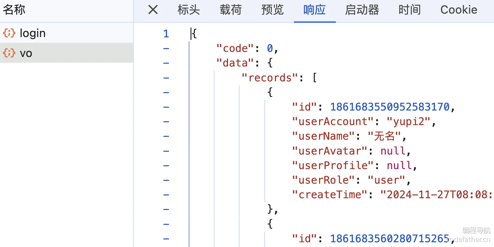
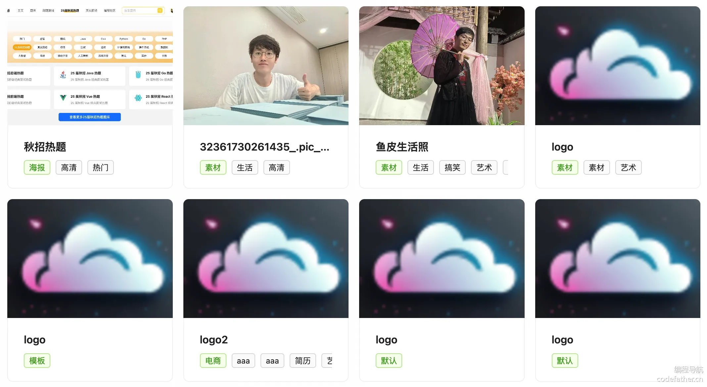

[TOC]


# 1 - 项目总览

## 一、项目介绍 - 鱼图图

基于 Vue 3 + Spring Boot + COS + WebSocket 的 **企业级智能协同云图库平台**。

平台的核心功能可分为 4 大类：

1）所有用户都可以在平台公开上传和检索图片素材，快速找到需要的图片。可用作表情包网站、设计素材网站、壁纸网站等：


2）管理员可以上传、审核和管理图片，并对系统内的图片进行分析：p87QUult0bZDR05AO5soQVixQ5nCQ+HA+P5tLSHK/hI=


3）对于个人用户，可将图片上传至私有空间进行批量管理、检索、编辑和分析，用作个人网盘、个人相册、作品集等：


4）对于企业，可开通团队空间并邀请成员，共享图片并实时协同编辑图片，提高团队协作效率。可用于提供商业服务，如企业活动相册、企业内部素材库等：


该项目功能丰富，涉及文件存管、内容检索、权限控制、实时协同等企业主流业务场景，并运用多种编程思想、架构设计方法和优化策略来保证项目的高速迭代和稳定运行。

有业务、有技术，从 0 到 1 的真实企业级（商业级）项目设计开发，绝对让你收获满满！

### 项目三大阶段

为了帮大家循序渐进地学习，鱼皮将项目设计为三个阶段，可以根据自己的时间和水平按需学习。

1）第一阶段，开发公共的图库平台。实战 Vue 3 + Spring Boot 图片素材网站的快速开发，学习文件存管业务的开发和优化技巧。

成果：可用作表情包网站、设计素材网站、壁纸网站等


2）第二阶段，对项目 C 端功能进行大量扩展。用户可开通私有空间，并对空间图片进行多维检索、扫码分享、批量管理、快速编辑、用量分析。该阶段涉及大量主流业务功能开发，能学到很多业务知识和开发经验。

成果：可用作个人网盘、个人相册、作品集等


3）第三阶段，对项目 B 端功能进行大量扩展。企业可开通团队空间，邀请和管理空间成员，团队内共享图片并实时协同编辑图片。该阶段涉及大量商业项目的应用场景，能学到很多架构设计和项目优化的技巧。

成果：可用于提供商业服务，如企业活动相册、企业内部素材库等


## 二、项目优势

### 项目收获

本项目选题新颖、功能丰富、业务真实、应用广泛。区别于增删改查的 “烂大街” 项目，鱼皮会带你实战大量新技术和商业应用场景，掌握层层递进的系统设计、项目扩展和优化方案，给你的简历大幅增加竞争力。

鱼皮给大家讲的都是 **通用的项目开发方法和架构设计套路**，从这个项目中你可以学到：

- 如何拆解复杂业务，从 0 开始设计实现企业级系统？
- 如何巧用 RBAC 权限模型和框架实现复杂权限控制？
- 如何结合 Redis + Caffeine 构建高性能多级缓存？
- 如何实现文件的高效存储，并通过十几种策略进行优化？
- 如何使用高级数据结构 Disruptor 无锁队列提升并发性能？
- 如何使用 ShardingSphere 实现动态扩容的分库分表？
- 如何使用 WebSocket 多端通信，实现企业级实时协作功能？
- 如何接入 AI 绘图大模型，实现更多高级图片处理能力？
- 如何使用 DDD 架构实现大型企业级项目？
- 如何快速部署上线项目？

此外，还能学会很多作图、思考问题、对比方案的方法，提升排查问题、自主解决 Bug 的能力。鱼皮还给大家提供了大量的项目扩展点，有能力的同学可以进一步拉开和别人的区分度，无限进步！

### 鱼皮系列项目优势

鱼皮原创项目系列以 **实战** 为主，用 **全程直播** 的方式，**从 0 到 1 ** 带大家学习技术知识，并立即实践运用到项目中，做到学以致用。

此外，还提供如下服务：

- 详细的文字教程或直播笔记
- 完整的项目源码
- 1 对 1 答疑解惑
- 专属项目交流群
- ⭐️ 现成的简历写法（直接写满简历）
- ⭐️ 项目的扩展思路（拉开和其他人的差距）
- ⭐️ 项目相关面试题、题解和真实面经（提前准备，面试不懵逼）
- ⭐️ 前端 + Java 后端万用项目模板（快速创建项目）

比起看网上的教程学习，鱼皮项目系列的优势：从学知识 => 实践项目 => 复习笔记 => 项目答疑 => 简历写法 => 面试题解的一条龙服务

从需求分析、技术选型、项目设计、项目初始化、Demo 编写、前后端开发实现、项目优化、部署上线等，每个环节我都 **从理论到实践** 给大家讲的明明白白、每个细节都不放过！

| 对比维度 | 跟学鱼皮项目                                                 | 自学网上免费项目qHT6Kxg12X1vklSWA3QVO0Z9aqth3Yj5Z1UQTagntCA= | ⭐️ 鱼皮项目优势               |
| -------- | ------------------------------------------------------------ | ------------------------------------------------------------ | ---------------------------- |
| 项目选题 | ✅ 选题新颖，刻意避开网上热门项目                             | 传统项目场景（博客、商城、管理系统）XJ858sBsdVoQsBlQbSlEZH9bgQFu4XZchClXOymxgUA= | 增加区分度，提高简历通过率   |
| 学习人数 | ✅ 少，不容易撞车                                             | 百万以上，烂大街XJ858sBsdVoQsBlQbSlEZH9bgQFu4XZchClXOymxgUA= | 增加区分度，提高简历通过率   |
| 教学方式 | ✅ 全程直播，带你敲每一行代码、带你踩坑和解决 Bug，不漏过每一个细节 | 录制课程，视频虽然看起来简短、一帆风顺，但你遇到错误无从下手sqWmWUk8kFL4uPey9+8ro5dv7g8fCeOwW9uL7T8/Q4k= | 降低学习门槛，减少学习时长   |
| 直播笔记 | ✅ 详细的官方笔记 + 精选学员优质笔记                          | 有笔记，但未经筛选6oQFIoMC2vFqWS6BDNDfWm34cANQaqyg4rGukImfAHk= | 学到更多知识细节             |
| 视频内容 | ✅ 项目教程 + 经验分享                                        | 项目教程qHT6Kxg12X1vklSWA3QVO0Z9aqth3Yj5Z1UQTagntCA=         | 学到更多编程经验             |
| 项目源码 | ✅ 完整源码仓库 + 每章的提交记录 + 定期更新                   | 只有代码包、不更新sqWmWUk8kFL4uPey9+8ro5dv7g8fCeOwW9uL7T8/Q4k= | 节省时间，避免踩坑           |
| 项目答疑 | ✅ 各项目交流群 + 答疑解惑 + 常见问题整理                     | 无免费的答疑服务，遇到问题自行解决Kvj0N9UsvjnA2JCtBYVVlZvRih721R4WfPhhdfsvDfk= | 节省时间                     |
| 简历写法 | ✅ 现成的简历写法                                             | 无XJ858sBsdVoQsBlQbSlEZH9bgQFu4XZchClXOymxgUA=               | 节省时间、提高简历通过率     |
| 项目扩展 | ✅ 给出扩展思路 + 学员作品共享                                | 无cT00UyE1JKn/y8Q147TQRzbDavEs+V72bbBFCS1wu6g=               | 开拓思路、拉开和其他人的差距 |
| 项目面试 | ✅ 项目相关面试题、题解和真实面经                             | 无cT00UyE1JKn/y8Q147TQRzbDavEs+V72bbBFCS1wu6g=               | 提前准备，面试不懵逼         |

编程导航已有 **10 多套项目教程！**每个项目的学习重点不同，几乎全都是前端 + 后端的 **全栈项目** 。

详细请见：[https://codefather.cn/course](https://www.codefather.cn/course)（在该页面右侧有教程推荐和学习建议）Kvj0N9UsvjnA2JCtBYVVlZvRih721R4WfPhhdfsvDfk=

往期项目介绍视频：[https://bilibili.com/video/BV1YvmbYbEgS](https://www.bilibili.com/video/BV1YvmbYbEgS/)

## 三、核心业务流程

### 第一阶段 - 公共图库平台


### 第二阶段 - 用户私有图库


### 第三阶段 - 团队共享图库


## 四、项目功能梳理

### 第一阶段 - 公共图库平台

#### 用户模块

- 用户登录
- 用户注册
- 用户注销
- 用户权限控制
- 【管理员】管理用户

#### 图片模块

- 【管理员】上传创建图片
- 【管理员】图片信息编辑（标签 / 分类等）
- 【管理员】管理图片
- 查看和搜索图片列表
- 查看图片详情（进入图片详情页）
- 图片下载
- 用户上传创建图片
- 【管理员】审核图片
- 导入图片
- - 通过 URL 导入图片
  - 【管理员】批量抓取和创建图片
- 【优化】图片查询优化 - 分布式缓存、本地缓存、多级缓存
- 【优化】图片上传优化 - 压缩、秒传、分片上传、断点续传
- 【优化】图片加载优化 - 懒加载、缩略图、CDN 加速、浏览器缓存
- 【优化】图片存储优化 - 降频存储（冷热数据分离）、清理策略

### 第二阶段 - 用户私有图库

#### 空间模块

- 【管理员】管理空间
- 用户开通私有空间
- 私有空间权限控制
- 空间级别和限额控制
- 空间图库分析
- - 用户空间图库分析
  - 【管理员】全空间分析

#### 图片模块

- 图片搜索
- - 基础属性搜索
  - 以图搜图
  - 颜色搜索
- 图片分享
- - 链接分享
  - 扫码分享
- 图片批量管理
- - 批量修改信息
  - 批量重命名
- 图片编辑
- - 基础图片编辑
  - AI 图片编辑

### 第三阶段 - 团队共享图库

#### 空间模块

- 创建团队共享空间
- 空间成员管理
- - 成员邀请
  - 设置权限
- 空间成员权限控制

#### 图片模块

- 图片协同编辑

## 五、技术选型

### 后端

- Java Spring Boot 框架
- MySQL 数据库 + MyBatis-Plus 框架 + MyBatis X
- Redis 分布式缓存 + Caffeine 本地缓存
- Jsoup 数据抓取
- ⭐️ COS 对象存储
- ⭐️ ShardingSphere 分库分表
- ⭐️ Sa-Token 权限控制
- ⭐️ DDD 领域驱动设计
- ⭐️ WebSocket 双向通信
- ⭐️ Disruptor 高性能无锁队列
- ⭐️ JUC 并发和异步编程
- ⭐️ AI 绘图大模型接入
- ⭐️ 多种设计模式的运用
- ⭐️ 多角度项目优化：性能、成本、安全性等

### 前端

- Vue 3 框架
- Vite 打包工具
- Ant Design Vue 组件库
- Axios 请求库
- Pinia 全局状态管理
- 其他组件：数据可视化、图片编辑等
- ⭐️ 前端工程化：ESLint + Prettier + TypeScript
- ⭐️ OpenAPI 前端代码生成

## 六、架构设计


## 新建代码仓库

搭建仓库，点 star 的都是精神股东

代码仓库：https://github.com/liyupi/yu-picture

## 教程计划

### 第一阶段 - 公共图库平台

第 1 期：项目介绍。包括介绍项目背景、项目优势、核心业务流程、项目功能、技术选型、架构设计、教程计划等。

第 2 期：项目初始化

- 后端项目初始化
- 前端项目初始化

第 3 期：用户模块开发（前后端）

- 用户登录
- 用户注册
- 用户注销
- 用户权限控制
- 用户管理

第 4 期：图片模块开发（前后端）

- 【管理员】图片上传和创建
- 【管理员】管理图片
- 【管理员】图片信息编辑（标签 / 分类等）
- 查看和搜索图片列表
- 查看图片详情（进入图片详情页）
- 图片下载

第 5 期：用户上传图片模块（前后端）

- 用户上传创建图片
- 【管理员】审核图片
- 导入图片
- - 通过 URL 导入图片
  - 【管理员】批量抓取和创建图片

第 6 期：图片优化

- 图片查询优化 - 分布式缓存、本地缓存、多级缓存
- 图片上传优化 - 压缩、秒传、分片上传、断点续传
- 图片加载优化 - 懒加载、缩略图、CDN 加速、浏览器缓存
- 图片存储优化 - 降频存储（冷热数据分离）、清理策略

### 第二阶段 - 用户私有图库

第 7 期：空间模块开发

- 【管理员】管理空间
- 用户开通私有空间
- 私有空间权限控制
- 空间级别和限额控制

第 8 期：图片功能扩展

- 图片搜索
- - 基础属性搜索
  - 以图搜图
  - 颜色搜索
- 图片分享
- - 链接分享
  - 扫码分享
- 图片批量管理
- - 批量修改信息
  - 批量重命名

第 9 期：图片编辑能力

- 图片编辑
- - 基础图片编辑
  - AI 图片编辑

第 10 期：空间图片分析

- 空间图库分析
- - 用户空间图库分析
  - 【管理员】全空间分析

### 第三阶段 - 团队共享图库

第 11 期：团队共享空间

- 创建团队共享空间
- 空间成员管理
- - 成员邀请
  - 设置权限
- 空间成员权限控制

第 12 期：图片协同编辑

第 13 期：DDD 项目改造

第 14 期：项目部署上线


# 2 - 项目初始化

## 本节重点

从 0 开始搭建后端和前端项目，会后续正式开发项目打好基础。

包括：

- 后端项目初始化
- 前端项目初始化

本节教程的后端和前端互不影响，可以按需独立学习，建议优先学习自己求职方向的内容。

## 一、后端项目初始化

### 环境准备

1）安装的 JDK 版本必须是 8、11 或 17，**不能超过 17！**

推荐使用 11 版本，因为后续可能要用到的缓存库 Caffeine 要求使用 11 版本。

可参考视频安装 JDK：https://www.bilibili.com/video/BV14SUNYREv8

2）MySQL 数据库最好安装 8.x 版本，或者 5.7 版本。

### 新建项目

在 IDEA 中新建项目，选择 Spring Initializr 模板，考虑到稳定性，此处选择创建 Java 8 版本的项目。

注意需要替换 Server URL 为 https://start.aliyun.com/，因为官方的 Server URL 不支持选择 Java 8。

配置如图：


选择 Spring Boot 2.7.6 版本，可以根据自己的需要添加一些依赖，比如 Spring Web、MyBatis、MySQL、Lombok：


> 当然，后续通过修改 Maven 配置添加依赖也是可以的。

点击创建，就得到了一个 Spring Boot 项目，需要等待 Maven 为我们安装依赖。

安装完依赖后，先尝试启动一下项目，结果会报错：


因为我们在 Maven 中引入了 MySQL 依赖，但是项目配置文件中并没有填写 MySQL 的配置。

修改资源目录下的配置文件为 `application.yml`，指定项目启动的端口号和访问地址前缀、项目名称、数据库配置等。代码如下：

```yaml
server:
  port: 8123
  servlet:
    context-path: /api
spring:
  application:
    name: yu-picture-backend
  # 数据库配置
  datasource:
    driver-class-name: com.mysql.cj.jdbc.Driver
    url: jdbc:mysql://localhost:3306/yu_picture
    username: root
    password: 123456
```

这次项目就可以正常启动了：


### 整合依赖

接下来我们要整合一些开发项目常用的依赖。

#### 1、MyBatis Plus 数据库操作

MyBatis Plus 是 MyBatis 的增强工具，旨在简化开发流程。它提供了开箱即用的 CRUD 方法、动态查询构造器、分页插件和代码生成器等功能，大幅减少重复代码，同时保持与 MyBatis 原生功能的兼容性。例如，通过调用 `baseMapper.selectById(id)`，可以直接查询数据库中的记录，而无需手动编写 SQL。

参考官方文档引入：https://baomidou.com/getting-started/#spring-boot2

在 Maven 的 pom.xml 中添加依赖：

```xml
<dependency>
    <groupId>com.baomidou</groupId>
    <artifactId>mybatis-plus-boot-starter</artifactId>
    <version>3.5.9</version>
</dependency>
```

**注意，添加该依赖后，记得移除 MyBatis 相关的依赖！否则很容易导致版本冲突！！！**


在项目中新建 mapper 包，后续用于存放操作数据库的 Mapper 类，然后在项目启动类中添加扫描 Mapper 的 `@MapperScan` 注解：

```java
@SpringBootApplication
@MapperScan("com.yupi.yupicturebackend.mapper")
public class YuPictureBackendApplication {

    public static void main(String[] args) {
        SpringApplication.run(YuPictureBackendApplication.class, args);
    }

}
```

在 application.yml 中追加配置，开启日志和逻辑删除功能：

```yaml
mybatis-plus:
  configuration:
    map-underscore-to-camel-case: false
    # 仅在开发环境开启日志
    log-impl: org.apache.ibatis.logging.stdout.StdOutImpl
  global-config:
    db-config:
      logic-delete-field: isDelete # 全局逻辑删除的实体字段名
      logic-delete-value: 1 # 逻辑已删除值（默认为 1）
      logic-not-delete-value: 0 # 逻辑未删除值（默认为 0）
```

#### 2、Hutool 工具库

Hutool 是主流的 Java 工具类库，集合了丰富的工具类，涵盖字符串处理、日期操作、文件处理、加解密、反射、正则匹配等常见功能。它的轻量化和无侵入性让开发者能够专注于业务逻辑而不必编写重复的工具代码。例如，`DateUtil.formatDate(new Date())` 可以快速将当前日期格式化为字符串。

参考官方文档引入：[https://doc.hutool.cn/pages/index/#%F0%9F%8D%8Amaven](https://doc.hutool.cn/pages/index/#🍊maven)

在 Maven 的 pom.xml 中添加依赖：

```xml
<dependency>
    <groupId>cn.hutool</groupId>
    <artifactId>hutool-all</artifactId>
    <version>5.8.26</version>
</dependency>
```

#### 3、Knife4j 接口文档

Knife4j 是基于 Swagger 接口文档的增强工具，提供了更加友好的 API 文档界面和功能扩展，例如动态参数调试、分组文档等。它适合用于 Spring Boot 项目中，能够通过简单的配置自动生成接口文档，让开发者和前端快速了解和调试接口，提高写作效率。

参考官方文档引入：https://doc.xiaominfo.com/docs/quick-start#spring-boot-2bgMhj83Bt96lFcj29lBZCF0o0+YPCGWOWUw0OPyFB/Q=

由于使用的是 Spring Boot 2.x，注意要选择 OpenAPI 2 的版本。

在 Maven 的 pom.xml 中添加依赖：

```xml
<dependency>
    <groupId>com.github.xiaoymin</groupId>
    <artifactId>knife4j-openapi2-spring-boot-starter</artifactId>
    <version>4.4.0</version>
</dependency>
```

新建 controller 包用于存放 API 接口，将模板创建的 demos.web 包下的代码都移动到其中，仅用于测试：


在 application.yml 中追加接口文档配置，扫描 Controller 包：

```yaml
# 接口文档配置
knife4j:
  enable: true
  openapi:
    title: "接口文档"
    version: 1.0
    group:
      default:
        api-rule: package
        api-rule-resources:
          - com.yupi.yupicturebackend.controller
```

重启项目，访问 http://localhost:8123/api/doc.html 能够看到接口文档，可以测试调用：


#### 4、其他依赖

可以按需引入其他依赖，比如 AOP 切面编程：

```xml
<dependency>
    <groupId>org.springframework.boot</groupId>
    <artifactId>spring-boot-starter-aop</artifactId>
</dependency>
```

给启动类添加注解（可选）：

```java
@EnableAspectJAutoProxy(exposeProxy = true)
```

解释一下 `exposeProxy = true` 的作用：通过 Spring AOP 提供对当前代理对象的访问，使得可以在业务逻辑中访问到当前的代理对象。你可以在方法执行时通过 `AopContext.currentProxy()` 获取当前的代理对象。qHT6Kxg12X1vklSWA3QVO0Z9aqth3Yj5Z1UQTagntCA=

还有更多的依赖，后续我们随用随装。

### 通用基础代码

通用基础代码是指：无论在任何后端项目中，都可以复用的代码。这种代码一般 “一辈子只用写一次”，了解作用之后复制粘贴即可，无需记忆。

目录结构如下：


#### 1、自定义异常

自定义错误码，对错误进行收敛，便于前端统一处理。

💡 这里有 2 个小技巧：

1. 自定义错误码时，建议跟主流的错误码（比如 HTTP 错误码）的含义保持一致，比如 “未登录” 定义为 40100，和 HTTP 401 错误（用户需要进行身份认证）保持一致，会更容易理解。
2. 错误码不要完全连续，预留一些间隔，便于后续扩展。

在 `exception` 包下新建错误码枚举类：

```java
@Getter
public enum ErrorCode {

    SUCCESS(0, "ok"),
    PARAMS_ERROR(40000, "请求参数错误"),
    NOT_LOGIN_ERROR(40100, "未登录"),
    NO_AUTH_ERROR(40101, "无权限"),
    NOT_FOUND_ERROR(40400, "请求数据不存在"),
    FORBIDDEN_ERROR(40300, "禁止访问"),
    SYSTEM_ERROR(50000, "系统内部异常"),
    OPERATION_ERROR(50001, "操作失败");

    /**
     * 状态码
     */
    private final int code;

    /**
     * 信息
     */
    private final String message;

    ErrorCode(int code, String message) {
        this.code = code;
        this.message = message;
    }

}
```

一般不建议直接抛出 Java 内置的 RuntimeException，而是自定义一个业务异常，和内置的异常类区分开，便于定制化输出错误信息：XJ858sBsdVoQsBlQbSlEZH9bgQFu4XZchClXOymxgUA=

```java
@Getter
public class BusinessException extends RuntimeException {

    /**
     * 错误码
     */
    private final int code;

    public BusinessException(int code, String message) {
        super(message);
        this.code = code;
    }

    public BusinessException(ErrorCode errorCode) {
        super(errorCode.getMessage());
        this.code = errorCode.getCode();
    }

    public BusinessException(ErrorCode errorCode, String message) {
        super(message);
        this.code = errorCode.getCode();
    }

}
```

为了更方便地根据情况抛出异常，可以封装一个 ThrowUtils，类似断言类，简化抛异常的代码：

```java
public class ThrowUtils {

    /**
     * 条件成立则抛异常
     *
     * @param condition        条件
     * @param runtimeException 异常
     */
    public static void throwIf(boolean condition, RuntimeException runtimeException) {
        if (condition) {
            throw runtimeException;
        }
    }

    /**
     * 条件成立则抛异常
     *
     * @param condition 条件
     * @param errorCode 错误码
     */
    public static void throwIf(boolean condition, ErrorCode errorCode) {
        throwIf(condition, new BusinessException(errorCode));
    }

    /**
     * 条件成立则抛异常
     *
     * @param condition 条件
     * @param errorCode 错误码
     * @param message   错误信息
     */
    public static void throwIf(boolean condition, ErrorCode errorCode, String message) {
        throwIf(condition, new BusinessException(errorCode, message));
    }
}
```

#### 2、响应包装类

一般情况下，每个后端接口都要返回调用码、数据、调用信息等，前端可以根据这些信息进行相应的处理。

我们可以封装统一的响应结果类，便于前端统一获取这些信息。

通用响应类：

```java
@Data
public class BaseResponse<T> implements Serializable {

    private int code;

    private T data;

    private String message;

    public BaseResponse(int code, T data, String message) {
        this.code = code;
        this.data = data;
        this.message = message;
    }

    public BaseResponse(int code, T data) {
        this(code, data, "");
    }

    public BaseResponse(ErrorCode errorCode) {
        this(errorCode.getCode(), null, errorCode.getMessage());
    }
}
```

但之后每次接口返回值时，都要手动 new 一个 BaseResponse 对象并传入参数，比较麻烦，我们可以新建一个工具类，提供成功调用和失败调用的方法，支持灵活地传参，简化调用。

```java
public class ResultUtils {

    /**
     * 成功
     *
     * @param data 数据
     * @param <T>  数据类型
     * @return 响应
     */
    public static <T> BaseResponse<T> success(T data) {
        return new BaseResponse<>(0, data, "ok");
    }

    /**
     * 失败
     *
     * @param errorCode 错误码
     * @return 响应
     */
    public static BaseResponse<?> error(ErrorCode errorCode) {
        return new BaseResponse<>(errorCode);
    }

    /**
     * 失败
     *
     * @param code    错误码
     * @param message 错误信息
     * @return 响应
     */
    public static BaseResponse<?> error(int code, String message) {
        return new BaseResponse<>(code, null, message);
    }

    /**
     * 失败
     *
     * @param errorCode 错误码
     * @return 响应
     */
    public static BaseResponse<?> error(ErrorCode errorCode, String message) {
        return new BaseResponse<>(errorCode.getCode(), null, message);
    }
}
```

#### 3、全局异常处理器

为了防止意料之外的异常，利用 AOP 切面全局对业务异常和 RuntimeException 进行捕获：cT00UyE1JKn/y8Q147TQRzbDavEs+V72bbBFCS1wu6g=

```java
@RestControllerAdvice
@Slf4j
public class GlobalExceptionHandler {

    @ExceptionHandler(BusinessException.class)
    public BaseResponse<?> businessExceptionHandler(BusinessException e) {
        log.error("BusinessException", e);
        return ResultUtils.error(e.getCode(), e.getMessage());
    }

    @ExceptionHandler(RuntimeException.class)
    public BaseResponse<?> runtimeExceptionHandler(RuntimeException e) {
        log.error("RuntimeException", e);
        return ResultUtils.error(ErrorCode.SYSTEM_ERROR, "系统错误");
    }
}
```

#### 4、请求包装类

对于 “分页”、“删除某条数据” 这类通用的请求，可以封装统一的请求包装类，用于接受前端传来的参数，之后相同参数的请求就不用专门再新建一个类了。

分页请求包装类，接受页号、页面大小、排序字段、排序顺序参数：

```java
@Data
public class PageRequest {

    /**
     * 当前页号
     */
    private int current = 1;

    /**
     * 页面大小
     */
    private int pageSize = 10;

    /**
     * 排序字段
     */
    private String sortField;

    /**
     * 排序顺序（默认降序）
     */
    private String sortOrder = "descend";
}
```

删除请求包装类，接受要删除数据的 id 作为参数：

```java
@Data
public class DeleteRequest implements Serializable {

    /**
     * id
     */
    private Long id;

    private static final long serialVersionUID = 1L;
}
```

#### 5、全局跨域配置

跨域是指浏览器访问的 URL（前端地址）和后端接口地址的域名（或端口号）不一致导致的，浏览器为了安全，默认禁止跨域请求访问。

为了开发调试方便，我们可以通过全局跨域配置，让整个项目所有的接口支持跨域，解决跨域报错。

新建 config 包，用于存放所有的配置相关代码。全局跨域配置代码如下：

```java
@Configuration
public class CorsConfig implements WebMvcConfigurer {

    @Override
    public void addCorsMappings(CorsRegistry registry) {
        // 覆盖所有请求
        registry.addMapping("/**")
                // 允许发送 Cookie
                .allowCredentials(true)
                // 放行哪些域名（必须用 patterns，否则 * 会和 allowCredentials 冲突）
                .allowedOriginPatterns("*")
                .allowedMethods("GET", "POST", "PUT", "DELETE", "OPTIONS")
                .allowedHeaders("*")
                .exposedHeaders("*");
    }
}
```

### 编写示例接口

移除 controller 包下的其他代码，让项目干净一些，然后编写一个纯净的 `/health` 接口用于健康检查：

```java
@RestController
@RequestMapping("/")
public class MainController {

    /**
     * 健康检查
     */
    @GetMapping("/health")
    public BaseResponse<String> health() {
        return ResultUtils.success("ok");
    }
}
```

💡 健康检查是指可以通过访问该接口，来快速验证后端服务是否正常运行，所以该接口的返回值非常简单。

此时的项目结构如图：


访问 http://localhost:8123/api/health，看到输出结果，表示后端初始化完成：


## 二、前端项目初始化

### 环境准备

前端 Node.js 版本必须 >= 18.12，鱼皮教程中使用 20 版本。在官网安装好 Node 后会自动安装 NPM 前端包管理器。

可参考视频安装 Node.js：https://www.bilibili.com/video/BV14SUNYREv8/MBNmaRtUhzDE9b4tB/jsqs1ClvvhzK+S4KVLPihc/I=

### 创建项目

使用 Vue 官方推荐的脚手架 create-vue 快速创建 Vue3 的项目：https://cn.vuejs.org/guide/quick-start.html

💡 Vue 提供了在线编码测试，可以通过 Playground 来学习 Vue：https://play.vuejs.org/p87QUult0bZDR05AO5soQVixQ5nCQ+HA+P5tLSHK/hI=

在终端中输入命令：

```shell
npm create vue@latest
```

NPM 会自动安装 create-vue 工具：


**注意本教程使用的版本号是 3.12.1，如果之后版本更新导致跟鱼皮的教程不一致，记得安装特定版本的工具，而不是 latest 最新版！**

接下来按照如下选项创建项目，脚手架会自动帮我们安装 Vue Router 路由、Pinia 全局状态管理等实用类库：


然后用 WebStorm 打开项目，先在终端执行 `npm install` 安装依赖，然后执行 `npm run dev` 能访问网页就成功了。


💡 可以看到 Vue 脚手架提供了一个调试工具 devtools（[http://localhost:5173/**devtools**/](http://localhost:5173/__devtools__/)），你可以使用它来调试分析项目：


### 前端工程化配置

脚手架已经帮我们整合了 Prettier 代码美化、ESLint 自动校验、TypeScript 类型校验，无需再自行整合。

但是需要在 webstorm 里开启代码美化插件：


在 vue 文件中执行格式化快捷键，不报错，表示配置工程化成功。

如果发现格式化效果不好，也没关系，之后可以使用另外一种格式化快捷键：


为了开发效率更高，你可能想关闭由于 ESLint 校验导致的编译错误，同样可以在开发工具中禁用 ESLint：


修改 eslint.config.js、.prettierrc.json、tsconfig.json 文件可以改变校验规则。

如果不使用脚手架，就需要自己整合这些工具：

- 代码规范：https://eslint.org/docs/latest/use/getting-started
- 代码美化：https://prettier.io/docs/en/install.html
- 直接整合：https://github.com/prettier/eslint-plugin-prettier#recommended-configuration（包括了 https://github.com/prettier/eslint-config-prettier#installation）

对于前端新手来说，你不需要深入了解这些，纯当工具去使用即可，应该尽快上手项目。Kvj0N9UsvjnA2JCtBYVVlZvRih721R4WfPhhdfsvDfk=

### 引入组件库

引入 Ant Design Vue 组件库，参考 [官方文档](https://antdv.com/docs/vue/getting-started-cn) 快速上手。

注意，本教程使用的是 v4.2.6 的组件库版本，如果后续阅读本教程中发现有组件或语法不一致，以官方文档为主，或者在网站右上角切换对应版本的文档即可：


执行安装：

```shell
npm i --save ant-design-vue@4.x
```

改变主入口文件 main.ts，全局注册组件（为了方便）：

```typescript
import App from './App.vue'
import router from './router'
import Antd from 'ant-design-vue'
import 'ant-design-vue/dist/reset.css'
import { createPinia } from 'pinia'
import { createApp } from 'vue'

const app = createApp(App)
app.use(Antd)
app.use(createPinia())
app.use(router)

app.mount('#app')
```

随便引入一个组件，如果显示出来，就表示引入成功。

比如引入按钮：

```typescript
<a-button type="primary">Primary Button</a-button>
```

效果如图：


### 开发规范

建议遵循 Vue3 的组合式 API (Composition API)，而不是 [选项式 API](https://cn.vuejs.org/guide/introduction.html#composition-api)，开发更自由高效一些。

示例代码：

```vue
<template>
  <div id="xxPage">

  </div>
</template>

<script setup lang="ts">

</script>

<style scoped>
#xxPage {
}

</style>
```

### 页面基本信息

可以修改项目根目录下的 `index.html` 文件，来定义页面的元信息，比如修改标题：

```html
<!DOCTYPE html>
<html lang="">
  <head>
    <meta charset="UTF-8">
    <link rel="icon" href="/favicon.ico">
    <meta name="viewport" content="width=device-width, initial-scale=1.0">
    <title>鱼皮云图库</title>
  </head>
  <body>
    <div id="app"></div>
    <script type="module" src="/src/main.ts"></script>
  </body>
</html>
```

还可以替换 public 目录下默认的 ico 图标为自己的，有很多 [现成的网站](https://www.bitbug.net/) 可以制作 ico 图标。

效果如图：


### 全局通用布局

#### 1、基础布局结构

在 layouts 目录下新建一个布局 `BasicLayout.vue`， 在 App.vue 全局页面入口文件中引入。

App.vue 代码如下：

```typescript
<template>
  <div id="app">
    <BasicLayout />
  </div>
</template>

<script setup lang="ts">
import BasicLayout from "@/layouts/BasicLayout.vue";
</script>
```

可以移除页面内的默认样式、并且移除 main.ts 中默认引入的 main.css，防止样式污染：

```css
<style>
#app {
}
</style>
```

选用 Ant Design 组件库的 [Layout 组件](https://antdv.com/components/layout-cn) ，先把【上中下】布局编排好，然后再填充内容：


代码如下：

```vue
<template>
  <div id="basicLayout">
    <a-layout style="min-height: 100vh">
      <a-layout-header>Header</a-layout-header>
      <a-layout-content>Content</a-layout-content>
      <a-layout-footer>Footer</a-layout-footer>
    </a-layout>
  </div>
</template>

<script setup lang="ts"></script>
```

样式：

```typescript
<style scoped>
#basicLayout {
}
</style>
```

#### 2、全局底部栏

通常用于展示版权信息：

```tsx
<a-layout-footer class="footer">
  <a href="https://www.codefather.cn" target="_blank">
    编程导航 by 程序员鱼皮
  </a>
</a-layout-footer>
```

样式：

```typescript
#basicLayout .footer {
  background: #efefef;
  padding: 16px;
  position: fixed;
  bottom: 0;
  left: 0;
  right: 0;
  text-align: center;
}
```

#### 3、动态替换内容

项目使用了 [Vue Router](https://router.vuejs.org/zh/introduction.html) 路由库，可以在 `router/index.ts` 配置路由，能够根据访问的页面地址找到不同的文件并加载渲染。

修改 BasicLayout 内容部分的代码如下：

```typescript
<a-layout-content class="content">
  <router-view />
</a-layout-content>
```

修改样式，要和底部栏保持一定的外边距，否则内容会被遮住：

```typescript
<style scoped>
#basicLayout .content {
  background: linear-gradient(to right, #fefefe, #fff);
  margin-bottom: 28px;
  padding: 20px;
}
</style>
```

#### 4、全局顶部栏

由于顶部栏的开发相对复杂，可以基于 [Ant Design 的菜单组件](https://antdv.com/components/menu-cn) 来创建 `GlobalHeader` 全局顶部栏组件，**组件统一放在 components 目录中 **。

先直接复制现成的组件示例代码到 GlobalHeader 中即可。


在基础布局中引入顶部栏组件：

```vue
<a-layout-header class="header">
  <GlobalHeader />
</a-layout-header>
```

引入代码如下：

```vue
<script setup lang="ts">
import GlobalHeader from "@/components/GlobalHeader.vue";
</script>
```

效果如下：


可以修改下全局 Header 的样式，清除一些默认样式（比如背景色等），样式代码如下：

```css
#basicLayout .header {
  padding-inline: 20px;
  margin-bottom: 16px;
  color: unset;
  background: white;
}
```

接下来要修改 GlobalHeader 组件，完善更多内容。

1）给菜单外套一层元素，用于整体控制样式：

```vue
<div id="globalHeader">
  <a-menu v-model:selectedKeys="current" mode="horizontal" :items="items" />
</div>
```

2）根据我们的需求修改菜单配置，key 为要跳转的 URL 路径：

```vue
<script lang="ts" setup>
import { h, ref } from 'vue'
import { HomeOutlined } from '@ant-design/icons-vue'
import { MenuProps } from 'ant-design-vue'

const current = ref<string[]>(['home'])
const items = ref<MenuProps['items']>([
  {
    key: '/',
    icon: () => h(HomeOutlined),
    label: '主页',
    title: '主页',
  },
  {
    key: '/about',
    label: '关于',
    title: '关于',
  },
  {
    key: 'others',
    label: h('a', { href: 'https://www.codefather.cn', target: '_blank' }, '编程导航'),
    title: '编程导航',
  },
])
</script>
```

效果如图：


3）完善全局顶部栏，左侧补充网站图标和标题。

先把 logo.png 放到 src/assets 目录下，替换掉原本的默认 Logo：


修改 GlobalHeader 代码，补充 HTML：

```tsx
<RouterLink to="/">
  <div class="title-bar">
    
    <div class="title">鱼皮云图库</div>
  </div>
</RouterLink>
```

其中，RouterLink 组件的作用是支持超链接跳转（不刷新页面）。

补充 CSS 样式：

```css
<style scoped>
.title-bar {
  display: flex;
  align-items: center;
}

.title {
  color: black;
  font-size: 18px;
  margin-left: 16px;
}

.logo {
  height: 48px;
}
</style>
```

4）完善顶部导航栏，右侧展示当前用户的登录状态（暂时用登录按钮代替）：

```vue
<div class="user-login-status">
  <a-button type="primary" href="/user/login">登录</a-button>
</div>
```

5）优化导航栏的布局，采用 [栅格组件的自适应布局](https://antdv.com/components/grid-cn#components-grid-demo-flex-stretch)（左中右结构，左侧右侧宽度固定，中间菜单栏自适应）

```vue
<a-row :wrap="false">
  <a-col flex="200px">
    <RouterLink to="/">
      <div class="title-bar">
        
        <div class="title">鱼皮云图库</div>
      </div>
    </RouterLink>
  </a-col>
  <a-col flex="auto">
    <a-menu
      v-model:selectedKeys="current"
      mode="horizontal"
      :items="items"
    />
  </a-col>
  <a-col flex="120px">
    <div class="user-login-status">
      <a-button type="primary" href="/user/login">登录</a-button>
    </div>
  </a-col>
</a-row>
```

效果如图，可以尝试缩小浏览器窗口观察导航条的变化：


### 路由

目标：点击菜单项后，可以跳转到对应的页面；并且刷新页面后，对应的菜单自动高亮。

#### 1、修改路由配置

按需修改 router/index.ts 文件的 routes 配置，定义我们需要的页面路由，每个 path 对应一个 component（要加载的组件）：cT00UyE1JKn/y8Q147TQRzbDavEs+V72bbBFCS1wu6g=

```css
routes: [
  {
    path: '/',
    name: 'home',
    component: HomeView,
  },
  {
    path: '/about',
    name: 'about',
    // route level code-splitting
    // this generates a separate chunk (About.[hash].js) for this route
    // which is lazy-loaded when the route is visited.
    component: () => import('../views/AboutView.vue'),
  },
],
```

观察上述代码，会发现 component 支持直接传入组件、或者使用 import 按需懒加载组件，按需加载是一种优化首次打开站点性能的方式。

#### 2、路由跳转

给 GlobalHeader 的菜单组件绑定跳转事件：

```typescript
import { useRouter } from "vue-router";
const router = useRouter();

// 路由跳转事件
const doMenuClick = ({ key }: { key: string }) => {
  router.push({
    path: key,
  });
};
```

修改 HTML 模板，绑定事件：

```vue
<a-menu
  v-model:selectedKeys="current"
  mode="horizontal"
  :items="items"
  @click="doMenuClick"
/>
```

#### 3、高亮同步

刷新页面后，你会发现当前菜单项并没有高亮，所以需要同步路由的更新到菜单项高亮。cT00UyE1JKn/y8Q147TQRzbDavEs+V72bbBFCS1wu6g=

同步高亮原理：

1. 点击菜单时，Ant Design 组件已经通过 v-model 绑定 current 变量实现了高亮。
2. 刷新页面时，需要获取到当前 URL 路径，然后修改 current 变量的值，从而实现同步。

使用 Vue Router 的 afterEach 路由钩子实现，每次改变路由或刷新页面时都会自动更新 current 的值，从而实现高亮：sqWmWUk8kFL4uPey9+8ro5dv7g8fCeOwW9uL7T8/Q4k=

```tsx
const router = useRouter();
// 当前选中菜单
const current = ref<string[]>([]);
// 监听路由变化，更新当前选中菜单
router.afterEach((to, from, next) => {
  current.value = [to.path];
});
```

💡思考：大家有没有发现，路由和菜单配置中，有一些是重复的呢？有没有更好地方式来配置路由和菜单项，不用每次修改时都要改两边的代码呢？答案就是将路由配置数组传递给菜单组件，大家可以尝试自行实现。（鱼皮的 [OJ 判题系统项目](https://www.codefather.cn/course)、[鱼答答 AI 答题应用平台项目](https://www.codefather.cn/course) 中有讲过）

### 请求

> 引入 Axios 请求库

一般情况下，前端只负责界面展示和动效交互，尽量避免写复杂的逻辑；当需要获取数据时，通常是向后端提供的接口发送请求，由后端执行操作（比如保存数据）并响应数据给前端。

前端如何向后端发送请求呢？最传统的方式是使用 AJAX 技术。但其代码有些复杂，我们可以使用第三方的封装库，来简化发送请求的代码，比如主流的请求工具库 Axios。

#### 1、请求工具库

安装请求工具类 Axios，参考官方文档：https://axios-http.com/docs/intro

代码：

```shell
npm install axios
```

#### 2、全局自定义请求

需要自定义全局请求地址等，参考 Axios 官方文档，编写请求配置文件 `request.ts`。包括全局接口请求地址、超时时间、自定义请求响应拦截器等。

响应拦截器的应用场景：我们需要对接口的 **通用响应** 进行统一处理，比如从 response 中取出 data；或者根据 code 去集中处理错误。这样不用在每个接口请求中都去写相同的逻辑。

比如可以在全局响应拦截器中，读取出结果中的 data，并校验 code 是否合法，如果是未登录状态，则自动登录。

示例代码如下，其中 `withCredentials: true` 一定要写，否则无法在发请求时携带 Cookie，就无法完成登录。

代码如下：

```typescript
import axios from 'axios'
import { message } from 'ant-design-vue'

// 创建 Axios 实例
const myAxios = axios.create({
  baseURL: 'http://localhost:8123',
  timeout: 60000,
  withCredentials: true,
})

// 全局请求拦截器
myAxios.interceptors.request.use(
  function (config) {
    // Do something before request is sent
    return config
  },
  function (error) {
    // Do something with request error
    return Promise.reject(error)
  },
)

// 全局响应拦截器
myAxios.interceptors.response.use(
  function (response) {
    const { data } = response
    // 未登录
    if (data.code === 40100) {
      // 不是获取用户信息的请求，并且用户目前不是已经在用户登录页面，则跳转到登录页面
      if (
        !response.request.responseURL.includes('user/get/login') &&
        !window.location.pathname.includes('/user/login')
      ) {
        message.warning('请先登录')
        window.location.href = `/user/login?redirect=${window.location.href}`
      }
    }
    return response
  },
  function (error) {
    // Any status codes that falls outside the range of 2xx cause this function to trigger
    // Do something with response error
    return Promise.reject(error)
  },
)

export default myAxios
```

#### 3、自动生成请求代码

如果采用传统开发方式，针对每个请求都要单独编写代码，很麻烦。

推荐使用 OpenAPI 工具，直接自动生成即可：https://www.npmjs.com/package/@umijs/openapi

按照官方文档的步骤，先安装：

```shell
npm i --save-dev @umijs/openapi
```

在 **项目根目录 **新建 `openapi.config.js`，根据自己的需要定制生成的代码：

```typescript
import { generateService } from '@umijs/openapi'

generateService({
  requestLibPath: "import request from '@/request'",
  schemaPath: 'http://localhost:8123/api/v2/api-docs',
  serversPath: './src',
})
```

**注意，要将 schemaPath 改为自己后端服务提供的 Swagger 接口文档的地址。**

在 package.json 的 script 中添加 `"openapi": "node openapi.config.js"`

执行即可生成请求代码，还包括 TypeScript 类型：

以后每次后端接口变更时，只需要重新生成一遍就好，非常方便~

#### 4、测试请求

可以尝试在任意页面代码中调用 API：

```typescript
import { healthUsingGet } from '@/api/mainController'

healthUsingGet().then((res) => {
  console.log(res)
})
```

按 F12 打开开发者工具查看请求，由于我们后端已经添加了全局跨域配置，正常情况下应该能看到如下响应：


#### 5、解决跨域（可选）

如果发现请求错误，要查看错误信息具体分析。比如遇到 **跨域问题**，这是由于前端网页地址和后端请求接口地址不同导致的：


这种情况下，可以通过修改后端代码，增加全局跨域配置或者跨域注解来解决：


如果后端代码无法修改，还可以通过前端代理服务器来解决，如果项目使用 Vite，内置了代理服务器。可以修改 vite.config.ts 文件，增加代理配置：

```typescript
export default defineConfig({
  server: {
    proxy: {
      '/api': 'http://localhost:8123',
    }
  },
})
```

同时修改 request.ts，移除请求前缀：

```typescript
// 创建 Axios 实例
const myAxios = axios.create({
  baseURL: '',
  timeout: 60000,
  withCredentials: true,
})
```

这样一来，前端发送的请求域名就等同于当前 URL 的域名，就不会出现跨域。但是访问到 /api 开头的接口时，会被代理到请求 8123 端口的后端服务器，从而完成请求。

💡 还有很多前端代理工具，比如 [Whistle](https://wproxy.org/whistle/install.html)，前端方向的同学可以去了解下。

### 全局状态管理

什么是全局状态管理？

答：所有页面全局共享的变量，而不是局限在某一个页面中。

适合作为全局状态的数据：已登录用户信息（每个页面几乎都要用）

Pinia 是一个主流的状态管理库，相比于 Vuex 来说使用更简单，可参考 [入门文档](https://pinia.vuejs.org/zh/getting-started.html) 进行引入。

#### 1、引入 Pinia

此处由于 create-vue 脚手架已经帮我们整合了 Pinia，无需手动引入，直接使用即可。

#### 2、定义状态

在 src/stores 目录下定义 user 模块，定义了用户的存储、远程获取、修改逻辑：

```typescript
import { defineStore } from "pinia";
import { ref } from "vue";

export const useLoginUserStore = defineStore("loginUser", () => {
  const loginUser = ref<any>({
    userName: "未登录",
  });

  async function fetchLoginUser() {
    // todo 由于后端还没提供接口，暂时注释
    // const res = await getCurrentUser();
    // if (res.data.code === 0 && res.data.data) {
    //   loginUser.value = res.data.data;
    // }
  }

  function setLoginUser(newLoginUser: any) {
    loginUser.value = newLoginUser;
  }

  return { loginUser, setLoginUser, fetchLoginUser };
});
```

#### 3、使用状态

可以直接使用 store 中导出的状态变量和函数。

在首次进入到页面时，一般我们会尝试获取登录用户信息。修改 App.vue，编写远程获取数据代码：

```typescript
const loginUserStore = useLoginUserStore()
loginUserStore.fetchLoginUser()
```

在任何页面中都可以使用数据，比如 GlobalHeader 全局顶部栏组件中直接展示：qHT6Kxg12X1vklSWA3QVO0Z9aqth3Yj5Z1UQTagntCA=

```typescript
{{ JSON.stringify(loginUserStore.loginUser) }}
```

修改全局顶部栏组件，在右侧展示登录状态：

```vue
<div class="user-login-status">
  <div v-if="loginUserStore.loginUser.id">
    {{ loginUserStore.loginUser.userName ?? '无名' }}
  </div>
  <div v-else>
    <a-button type="primary" href="/user/login">登录</a-button>
  </div>
</div>
```

#### 4、测试全局状态管理

在 userStore 中编写测试代码，测试用户状态的更新：

```typescript
async function fetchLoginUser() {
  // 测试用户登录，3 秒后登录
  setTimeout(() => {
    loginUser.value = { userName: '测试用户', id: 1 }
  }, 3000)
}
```

查看效果，等待 3 秒后网站右上方会展示出登录用户信息：


至此，一个入门级的前端项目就初始化好了，接下来我们就可以进行页面开发。

### 页面开发流程

我们通过开发一个简易的示例页面，来了解页面开发的流程。

1）新建 src/pages 目录，用于存放所有的页面文件。

然后在 pages 目录下新建页面文件，将所有页面按照 url 层级进行创建，并且页面名称尽量做到“见名知意”。

举个例子：


其中，/user/login 地址就对应了 UserLoginPage。

此处我们新建 HomePage.vue 即可。

2）每次新建页面时，需要在 router/index.ts 中配置路由，比如欢迎页的路由为：Kvj0N9UsvjnA2JCtBYVVlZvRih721R4WfPhhdfsvDfk=

```typescript
const routes: Array<RouteRecordRaw> = [
  {
    path: "/",
    name: "home",
    component: HomeView,
  },
  ...
]
```

然后在路由文件中，引入页面 HomePage：

```typescript
import HomePage from "@/pages/HomePage.vue";

const routes: Array<RouteRecordRaw> = [
  {
    path: "/",
    name: "home",
    component: HomePage,
  },
  ...
]
```

任意修改页面代码：

```vue
<template>
  <div id="homePage">
    <h1>{{ msg }}</h1>
  </div>
</template>

<script setup lang="ts">
const msg = "欢迎来到编程导航，你将从这里开始项目学习之旅~";
</script>

<style scoped>
#homePage {
}
</style>
```

页面效果如图：


### 扩展

在后续开发中你会发现，Ant Design Vue 默认使用的是英文文案，如果需要替换为中文，可以参考 [国际化文档](https://antdv.com/docs/vue/i18n-cn)，只需给整个应用包裹一层组件即可完成。

------

本节教程到这里就结束了，建议大家从 0 实操下项目初始化，以后自己搭建一个新项目，也不会觉得困难啦~


# 3 - 用户模块

## 本节重点

首先开发每个项目基本都具有的用户模块，本节教程可以当做一个 **用户管理系统项目** 独立学习，适合新手入门，后端和前端部分也可以按需独立学习。

本节大纲：

- 需求分析
- 方案设计
- 后端开发
- 前端开发

## 一、需求分析

对于用户模块，通常要具有下列功能：

- 用户注册
- 用户登录
- 获取当前登录用户
- 用户注销
- 用户权限控制
- 【管理员】管理用户

具体分析每个需求：

1）用户注册：用户可以通过输入账号、密码、确认密码进行注册

2）用户登录：用户可以通过输入账号和密码登录

3）获取当前登录用户：得到当前已经登录的用户信息（不用重复登录）

4）用户注销：用户可以退出登录

5）用户权限控制：用户又分为普通用户和管理员，管理员拥有整个系统的最高权限，比如可以管理其他用户

6）用户管理：仅管理员可用，可以对整个系统中的用户进行管理，比如搜索用户、删除用户

## 二、方案设计

实现用户模块的难度不大，方案设计阶段我们需要确认：

- 库表设计
- 用户登录流程
- 如何对用户权限进行控制？

### 库表设计

库名：yu_picture

表名：user（用户表）

鱼皮会先讲本项目需要的核心设计，再补充一些扩展设计，便于大家学习。XJ858sBsdVoQsBlQbSlEZH9bgQFu4XZchClXOymxgUA=

#### 1、核心设计

用户表的核心是用户登录凭证（账号密码）和个人信息，SQL 如下：

```sql
▼-- 用户表
create table if not exists user
(
    id           bigint auto_increment comment 'id' primary key,
    userAccount  varchar(256)                           not null comment '账号',
    userPassword varchar(512)                           not null comment '密码',
    userName     varchar(256)                           null comment '用户昵称',
    userAvatar   varchar(1024)                          null comment '用户头像',
    userProfile  varchar(512)                           null comment '用户简介',
    userRole     varchar(256) default 'user'            not null comment '用户角色：user/admin',
    editTime     datetime     default CURRENT_TIMESTAMP not null comment '编辑时间',
    createTime   datetime     default CURRENT_TIMESTAMP not null comment '创建时间',
    updateTime   datetime     default CURRENT_TIMESTAMP not null on update CURRENT_TIMESTAMP comment '更新时间',
    isDelete     tinyint      default 0                 not null comment '是否删除',
    UNIQUE KEY uk_userAccount (userAccount),
    INDEX idx_userName (userName)
) comment '用户' collate = utf8mb4_unicode_ci;
```

几个注意事项：

1）editTime 和 updateTime 的区别：editTime 表示用户编辑个人信息的时间（需要业务代码来更新），而 updateTime 表示这条用户记录任何字段发生修改的时间（由数据库自动更新）。

2）给唯一值添加唯一键（唯一索引），比如账号 userAccount，利用数据库天然防重复，同时可以增加查询效率。

3）给经常用于查询的字段添加索引，比如用户昵称 userName，可以增加查询效率。

💡 建议养成好习惯，将库表设计 SQL 保存到项目的目录中，比如新建 `sql/create_table.sql` 文件，这样其他开发者就能更快地了解项目。

#### 2、扩展设计

1）如果要实现会员功能，可以对表进行如下扩展：

1. 给 userRole 字段新增枚举值 `vip`，表示会员用户，可根据该值判断用户权限
2. 新增会员过期时间字段，可用于记录会员有效期
3. 新增会员兑换码字段，可用于记录会员的开通方式
4. 新增会员编号字段，可便于定位用户并提供额外服务，并增加会员归属感

对应的 SQL 如下：

```sql
vipExpireTime datetime     null comment '会员过期时间',
vipCode       varchar(128) null comment '会员兑换码',
vipNumber     bigint       null comment '会员编号'
```

2）如果要实现用户邀请功能，可以对表进行如下扩展：

1. 新增 shareCode 分享码字段，用于记录每个用户的唯一邀请标识，可拼接到邀请网址后面，比如 https://mianshiya.com/?shareCode=xxx
2. 新增 inviteUser 字段，用于记录该用户被哪个用户邀请了，可通过这个字段查询某用户邀请的用户列表。

对应的 SQL 如下：

```sql
shareCode     varchar(20)  DEFAULT NULL COMMENT '分享码',
inviteUser    bigint       DEFAULT NULL COMMENT '邀请用户 id'
```

### 用户登录流程

1）建立初始会话：前端与服务器建立连接后，服务器会为该客户端创建一个初始的匿名 Session，并将其状态保存下来。这个 Session 的 ID 会作为唯一标识，返回给前端。

2）登录成功，更新会话信息：当用户在前端输入正确的账号密码并提交到后端验证成功后，后端会更新该用户的 Session，将用户的登录信息（如用户 ID、用户名等）保存到与该 Session 关联的存储中。同时，服务器会生成一个 Set-Cookie 的响应头，指示前端保存该用户的 Session ID。

3）前端保存 Cookie：前端接收到后端的响应后，浏览器会自动根据 Set-Cookie 指令，将 Session ID 存储到浏览器的 Cookie 中，与该域名绑定。

4）带 Cookie 的后续请求：当前端再次向相同域名的服务器发送请求时，浏览器会自动在请求头中附带之前保存的 Cookie，其中包含 Session ID。

5）后端验证会话：服务器接收到请求后，从请求头中提取 Session ID，找到对应的 Session 数据。

6）获取会话中存储的信息：后端通过该 Session 获取之前存储的用户信息（如登录名、权限等），从而识别用户身份并执行相应的业务逻辑。


### 如何对用户权限进行控制？

可以将接口分为 4 种权限：

1. 未登录也可以使用
2. 登录用户才能使用
3. 未登录也可以使用，但是登录用户能进行更多操作（比如登录后查看全文）
4. 仅管理员才能使用

传统的权限控制方法是，在每个接口内单独编写逻辑：先获取到当前登录用户信息，然后判断用户的权限是否符合要求。

这种方法最灵活，但是会写很多重复的代码，而且其他开发者无法一眼得知接口所需要的权限。

权限校验其实是一个比较通用的业务需求，一般会通过 **Spring AOP 切面 + 自定义权限校验注解 **实现统一的接口拦截和权限校验；如果有特殊的权限校验逻辑，再单独在接口中编码。

💡 如果需要更复杂更灵活的权限控制，可以引入 Shiro / Spring Security / Sa-Token 等专门的权限管理框架。

------

OK，有了实现方案后，我们先来开发后端接口。

## 三、后端开发

以后每次开发接口时，都可以遵循以下流程。

### 数据访问层代码生成

首先利用 IDEA 连接 MySQL 数据库：


执行 SQL 脚本，创建数据库表：


数据访问层的代码一般包括实体类、MyBatis 的 Mapper 类和 XML 等。比起手动编写，建议使用 MyBatisX 代码生成插件，可以快速得到这些文件。6vlRn/br/m8Ymr8D02hZYIBP3pqlW5Sp8qJklXCk9AY=

选中数据库的表，右键选择 MybatisX 生成器：

![img](data:image/png;base64,iVBORw0KGgoAAAANSUhEUgAAAMIAAADDCAYAAADQvc6UAAABRWlDQ1BJQ0MgUHJvZmlsZQAAKJFjYGASSSwoyGFhYGDIzSspCnJ3UoiIjFJgf8LAwSDCIMogwMCcmFxc4BgQ4ANUwgCjUcG3awyMIPqyLsis7PPOq3QdDFcvjV3jOD1boQVTPQrgSkktTgbSf4A4LbmgqISBgTEFyFYuLykAsTuAbJEioKOA7DkgdjqEvQHEToKwj4DVhAQ5A9k3gGyB5IxEoBmML4BsnSQk8XQkNtReEOBxcfXxUQg1Mjc0dyHgXNJBSWpFCYh2zi+oLMpMzyhRcASGUqqCZ16yno6CkYGRAQMDKMwhqj/fAIcloxgHQqxAjIHBEugw5sUIsSQpBobtQPdLciLEVJYzMPBHMDBsayhILEqEO4DxG0txmrERhM29nYGBddr//5/DGRjYNRkY/l7////39v///y4Dmn+LgeHANwDrkl1AuO+pmgAAADhlWElmTU0AKgAAAAgAAYdpAAQAAAABAAAAGgAAAAAAAqACAAQAAAABAAAAwqADAAQAAAABAAAAwwAAAAD9b/HnAAAHlklEQVR4Ae3dP3PTWBSGcbGzM6GCKqlIBRV0dHRJFarQ0eUT8LH4BnRU0NHR0UEFVdIlFRV7TzRksomPY8uykTk/zewQfKw/9znv4yvJynLv4uLiV2dBoDiBf4qP3/ARuCRABEFAoBEgghggQAQZQKAnYEaQBAQaASKIAQJEkAEEegJmBElAoBEgghggQAQZQKAnYEaQBAQaASKIAQJEkAEEegJmBElAoBEgghggQAQZQKAnYEaQBAQaASKIAQJEkAEEegJmBElAoBEgghggQAQZQKAnYEaQBAQaASKIAQJEkAEEegJmBElAoBEgghggQAQZQKAnYEaQBAQaASKIAQJEkAEEegJmBElAoBEgghggQAQZQKAnYEaQBAQaASKIAQJEkAEEegJmBElAoBEgghggQAQZQKAnYEaQBAQaASKIAQJEkAEEegJmBElAoBEgghggQAQZQKAnYEaQBAQaASKIAQJEkAEEegJmBElAoBEgghggQAQZQKAnYEaQBAQaASKIAQJEkAEEegJmBElAoBEgghggQAQZQKAnYEaQBAQaASKIAQJEkAEEegJmBElAoBEgghggQAQZQKAnYEaQBAQaASKIAQJEkAEEegJmBElAoBEgghggQAQZQKAnYEaQBAQaASKIAQJEkAEEegJmBElAoBEgghgg0Aj8i0JO4OzsrPv69Wv+hi2qPHr0qNvf39+iI97soRIh4f3z58/u7du3SXX7Xt7Z2enevHmzfQe+oSN2apSAPj09TSrb+XKI/f379+08+A0cNRE2ANkupk+ACNPvkSPcAAEibACyXUyfABGm3yNHuAECRNgAZLuYPgEirKlHu7u7XdyytGwHAd8jjNyng4OD7vnz51dbPT8/7z58+NB9+/bt6jU/TI+AGWHEnrx48eJ/EsSmHzx40L18+fLyzxF3ZVMjEyDCiEDjMYZZS5wiPXnyZFbJaxMhQIQRGzHvWR7XCyOCXsOmiDAi1HmPMMQjDpbpEiDCiL358eNHurW/5SnWdIBbXiDCiA38/Pnzrce2YyZ4//59F3ePLNMl4PbpiL2J0L979+7yDtHDhw8vtzzvdGnEXdvUigSIsCLAWavHp/+qM0BcXMd/q25n1vF57TYBp0a3mUzilePj4+7k5KSLb6gt6ydAhPUzXnoPR0dHl79WGTNCfBnn1uvSCJdegQhLI1vvCk+fPu2ePXt2tZOYEV6/fn31dz+shwAR1sP1cqvLntbEN9MxA9xcYjsxS1jWR4AIa2Ibzx0tc44fYX/16lV6NDFLXH+YL32jwiACRBiEbf5KcXoTIsQSpzXx4N28Ja4BQoK7rgXiydbHjx/P25TaQAJEGAguWy0+2Q8PD6/Ki4R8EVl+bzBOnZY95fq9rj9zAkTI2SxdidBHqG9+skdw43borCXO/ZcJdraPWdv22uIEiLA4q7nvvCug8WTqzQveOH26fodo7g6uFe/a17W3+nFBAkRYENRdb1vkkz1CH9cPsVy/jrhr27PqMYvENYNlHAIesRiBYwRy0V+8iXP8+/fvX11Mr7L7ECueb/r48eMqm7FuI2BGWDEG8cm+7G3NEOfmdcTQw4h9/55lhm7DekRYKQPZF2ArbXTAyu4kDYB2YxUzwg0gi/41ztHnfQG26HbGel/crVrm7tNY+/1btkOEAZ2M05r4FB7r9GbAIdxaZYrHdOsgJ/wCEQY0J74TmOKnbxxT9n3FgGGWWsVdowHtjt9Nnvf7yQM2aZU/TIAIAxrw6dOnAWtZZcoEnBpNuTuObWMEiLAx1HY0ZQJEmHJ3HNvGCBBhY6jtaMoEiJB0Z29vL6ls58vxPcO8/zfrdo5qvKO+d3Fx8Wu8zf1dW4p/cPzLly/dtv9Ts/EbcvGAHhHyfBIhZ6NSiIBTo0LNNtScABFyNiqFCBChULMNNSdAhJyNSiECRCjUbEPNCRAhZ6NSiAARCjXbUHMCRMjZqBQiQIRCzTbUnAARcjYqhQgQoVCzDTUnQIScjUohAkQo1GxDzQkQIWejUogAEQo121BzAkTI2agUIkCEQs021JwAEXI2KoUIEKFQsw01J0CEnI1KIQJEKNRsQ80JECFno1KIABEKNdtQcwJEyNmoFCJAhELNNtScABFyNiqFCBChULMNNSdAhJyNSiECRCjUbEPNCRAhZ6NSiAARCjXbUHMCRMjZqBQiQIRCzTbUnAARcjYqhQgQoVCzDTUnQIScjUohAkQo1GxDzQkQIWejUogAEQo121BzAkTI2agUIkCEQs021JwAEXI2KoUIEKFQsw01J0CEnI1KIQJEKNRsQ80JECFno1KIABEKNdtQcwJEyNmoFCJAhELNNtScABFyNiqFCBChULMNNSdAhJyNSiECRCjUbEPNCRAhZ6NSiAARCjXbUHMCRMjZqBQiQIRCzTbUnAARcjYqhQgQoVCzDTUnQIScjUohAkQo1GxDzQkQIWejUogAEQo121BzAkTI2agUIkCEQs021JwAEXI2KoUIEKFQsw01J0CEnI1KIQJEKNRsQ80JECFno1KIABEKNdtQcwJEyNmoFCJAhELNNtScABFyNiqFCBChULMNNSdAhJyNSiEC/wGgKKC4YMA4TAAAAABJRU5ErkJggg==)

按照下图进行配置：


可以看到生成的代码，包括实体类、Mapper

我们需要将这些代码移动到项目对应的位置，比如将 Mapper 移动到 `mapper` 包、User 移动到 `model.entity` 包、Service 移动到 `service` 包。记得将有用的文件添加到 Git 进行托管。

移动之后，注意修改 UserMapper.xml 等文件的包名：


### 数据模型开发

#### 1、实体类

生成的代码也许不能完全满足我们的要求，比如数据库实体类，我们可以手动更改其字段配置，指定主键策略和逻辑删除。

1. id 默认是连续生成的，容易被爬虫抓取，所以更换策略为 `ASSIGN_ID` 雪花算法生成。
2. 数据删除时默认为彻底删除记录，如果出现误删，将难以恢复，所以采用逻辑删除 —— 通过修改 isDelete 字段为 1 表示已失效的数据。

修改的代码如下：

```java
▼@TableName(value ="user")
@Data
public class User implements Serializable {
    /**
     * id（要指定主键策略）
     */
    @TableId(type = IdType.ASSIGN_ID)
    private Long id;

    // ...
    
    /**
     * 是否删除（逻辑删除）
     */
    @TableLogic
    private Integer isDelete;
}
```

使用框架的过程中，有任何疑问，都可以在官方文档查阅，比如了解 MyBatis Plus 的主键生成注解：https://baomidou.com/reference/annotation/#tableid

#### 2、枚举类

对于用户角色这样值的数量有限的、可枚举的字段，最好定义一个枚举类，便于在项目中获取值、减少枚举值输入错误的情况。

在 `model.enums` 包下新建 UserRoleEnum：

```java
@Getter
public enum UserRoleEnum {

    USER("用户", "user"),
    ADMIN("管理员", "admin");

    private final String text;

    private final String value;

    UserRoleEnum(String text, String value) {
        this.text = text;
        this.value = value;
    }

    /**
     * 根据 value 获取枚举
     *
     * @param value 枚举值的value
     * @return 枚举值
     */
    public static UserRoleEnum getEnumByValue(String value) {
        if (ObjUtil.isEmpty(value)) {
            return null;
        }
        for (UserRoleEnum anEnum : UserRoleEnum.values()) {
            if (anEnum.value.equals(value)) {
                return anEnum;
            }
        }
        return null;
    }
}
```

其中，getEnumByValue 是通过 value 找到具体的枚举对象。

💡 如果枚举值特别多，可以 Map 缓存所有枚举值来加速查找，而不是遍历列表。

------

下面依次进行各功能接口的开发。

### 用户注册

#### 1、数据模型

在 `model.dto.user` 下新建用于接受请求参数的类：

```java
@Data
public class UserRegisterRequest implements Serializable {

    private static final long serialVersionUID = 3191241716373120793L;

    /**
     * 账号
     */
    private String userAccount;

    /**
     * 密码
     */
    private String userPassword;

    /**
     * 确认密码
     */
    private String checkPassword;
}
```

💡 在 Java 接口开发中，为每个接口定义一个专门的类来接收请求参数，可以提高代码的可读性和维护性，便于对参数进行统一验证和扩展，同时减少接口方法参数过多导致的复杂性，有助于在复杂场景下更清晰地管理和传递数据。

#### 2、服务开发

在 `service` 包的 UserService 中增加方法声明：

```java
/**
 * 用户注册
 *
 * @param userAccount   用户账户
 * @param userPassword  用户密码
 * @param checkPassword 校验密码
 * @return 新用户 id
 */
long userRegister(String userAccount, String userPassword, String checkPassword);
```

在 UserServiceImpl 中增加实现代码，注意多补充一些校验条件：

```java
@Override
public long userRegister(String userAccount, String userPassword, String checkPassword) {
    // 1. 校验
    if (StrUtil.hasBlank(userAccount, userPassword, checkPassword)) {
        throw new BusinessException(ErrorCode.PARAMS_ERROR, "参数为空");
    }
    if (userAccount.length() < 4) {
        throw new BusinessException(ErrorCode.PARAMS_ERROR, "用户账号过短");
    }
    if (userPassword.length() < 8 || checkPassword.length() < 8) {
        throw new BusinessException(ErrorCode.PARAMS_ERROR, "用户密码过短");
    }
    if (!userPassword.equals(checkPassword)) {
        throw new BusinessException(ErrorCode.PARAMS_ERROR, "两次输入的密码不一致");
    }
    // 2. 检查是否重复
    QueryWrapper<User> queryWrapper = new QueryWrapper<>();
    queryWrapper.eq("userAccount", userAccount);
    long count = this.baseMapper.selectCount(queryWrapper);
    if (count > 0) {
        throw new BusinessException(ErrorCode.PARAMS_ERROR, "账号重复");
    }
    // 3. 加密
    String encryptPassword = getEncryptPassword(userPassword);
    // 4. 插入数据
    User user = new User();
    user.setUserAccount(userAccount);
    user.setUserPassword(encryptPassword);
    user.setUserName("无名");
    user.setUserRole(UserRoleEnum.USER.getValue());
    boolean saveResult = this.save(user);
    if (!saveResult) {
        throw new BusinessException(ErrorCode.SYSTEM_ERROR, "注册失败，数据库错误");
    }
    return user.getId();
}
```

注意，上述代码中，我们需要将用户密码加密后进行存储。可以封装一个方法，便于后续复用：

```java
@Override
public String getEncryptPassword(String userPassword) {
    // 盐值，混淆密码
    final String SALT = "yupi";
    return DigestUtils.md5DigestAsHex((SALT + userPassword).getBytes());
}
```

#### 3、接口开发

在 `controller` 包中新建 UserController，新增用户注册接口：

```java
@RestController
@RequestMapping("/user")
public class UserController {

    @Resource
    private UserService userService;

    /**
     * 用户注册
     */
    @PostMapping("/register")
    public BaseResponse<Long> userRegister(@RequestBody UserRegisterRequest userRegisterRequest) {
        ThrowUtils.throwIf(userRegisterRequest == null, ErrorCode.PARAMS_ERROR);
        String userAccount = userRegisterRequest.getUserAccount();
        String userPassword = userRegisterRequest.getUserPassword();
        String checkPassword = userRegisterRequest.getCheckPassword();
        long result = userService.userRegister(userAccount, userPassword, checkPassword);
        return ResultUtils.success(result);
    }
}
```

#### 4、测试

每开发完一个接口，都可以使用 Swagger 接口文档来测试：


💡 测试时要尤其注意边界值和特殊值，不能只测试正常的情况。

### 用户登录

#### 1、数据模型

在 `model.dto.user` 下新建用于接受请求参数的类：

```java
@Data
public class UserLoginRequest implements Serializable {

    private static final long serialVersionUID = 3191241716373120793L;

    /**
     * 账号
     */
    private String userAccount;

    /**
     * 密码
     */
    private String userPassword;
}
```

#### 2、服务开发

在 `service` 包的 UserService 中增加方法声明：

```java
/**
 * 用户登录
 *
 * @param userAccount  用户账户
 * @param userPassword 用户密码
 * @param request
 * @return 脱敏后的用户信息
 */
LoginUserVO userLogin(String userAccount, String userPassword, HttpServletRequest request);
```

在 UserServiceImpl 中增加实现代码，注意多补充一些校验条件，在用户登录成功后，将用户信息存储在当前的 Session 中。代码如下：

```java
@Override
public LoginUserVO userLogin(String userAccount, String userPassword, HttpServletRequest request) {
    // 1. 校验
    if (StrUtil.hasBlank(userAccount, userPassword)) {
        throw new BusinessException(ErrorCode.PARAMS_ERROR, "参数为空");
    }
    if (userAccount.length() < 4) {
        throw new BusinessException(ErrorCode.PARAMS_ERROR, "账号错误");
    }
    if (userPassword.length() < 8) {
        throw new BusinessException(ErrorCode.PARAMS_ERROR, "密码错误");
    }
    // 2. 加密
    String encryptPassword = getEncryptPassword(userPassword);
    // 查询用户是否存在
    QueryWrapper<User> queryWrapper = new QueryWrapper<>();
    queryWrapper.eq("userAccount", userAccount);
    queryWrapper.eq("userPassword", encryptPassword);
    User user = this.baseMapper.selectOne(queryWrapper);
    // 用户不存在
    if (user == null) {
        log.info("user login failed, userAccount cannot match userPassword");
        throw new BusinessException(ErrorCode.PARAMS_ERROR, "用户不存在或密码错误");
    }
    // 3. 记录用户的登录态
    request.getSession().setAttribute(USER_LOGIN_STATE, user);
    return this.getLoginUserVO(user);
}
```

注意，由于注册用户时存入数据库的密码是加密后的，查询用户信息时，也要对用户输入的密码进行同样算法的加密，才能跟数据库的信息对应上。

可以把上述的 Session 理解为一个 Map，可以给 Map 设置 key 和 value，每个不同的 SessionID 对应的 Session 存储都是不同的，不用担心会污染。所以上述代码中，给 Session 设置了固定的 key（USER_LOGIN_STATE），可以将这个 key 值提取为常量，便于后续获取。

在 `constant` 包下新建 UserConstant 类，统一声明用户相关的常量：

```java
public interface UserConstant {

    /**
     * 用户登录态键
     */
    String USER_LOGIN_STATE = "user_login";

    //  region 权限

    /**
     * 默认角色
     */
    String DEFAULT_ROLE = "user";

    /**
     * 管理员角色
     */
    String ADMIN_ROLE = "admin";
    
    // endregion
}
```

#### 3、接口开发

在 UserController 中新增用户登录接口：

```java
@PostMapping("/login")
public BaseResponse<LoginUserVO> userLogin(@RequestBody UserLoginRequest userLoginRequest, HttpServletRequest request) {
    ThrowUtils.throwIf(userLoginRequest == null, ErrorCode.PARAMS_ERROR);
    String userAccount = userLoginRequest.getUserAccount();
    String userPassword = userLoginRequest.getUserPassword();
    LoginUserVO loginUserVO = userService.userLogin(userAccount, userPassword, request);
    return ResultUtils.success(loginUserVO);
}
```

### 获取当前登录用户

可以从 request 请求对象对应的 Session 中直接获取到之前保存的登录用户信息，无需其他请求参数。

#### 1、服务开发

在 `service` 包的 UserService 中增加方法声明：

```java
/**
 * 获取当前登录用户
 *
 * @param request
 * @return
 */
User getLoginUser(HttpServletRequest request);
```

在 UserServiceImpl 中增加实现代码，此处为了保证获取到的数据始终是最新的，先从 Session 中获取登录用户的 id，然后从数据库中查询最新的结果。代码如下：

```java
@Override
public User getLoginUser(HttpServletRequest request) {
    // 先判断是否已登录
    Object userObj = request.getSession().getAttribute(USER_LOGIN_STATE);
    User currentUser = (User) userObj;
    if (currentUser == null || currentUser.getId() == null) {
        throw new BusinessException(ErrorCode.NOT_LOGIN_ERROR);
    }
    // 从数据库查询（追求性能的话可以注释，直接返回上述结果）
    long userId = currentUser.getId();
    currentUser = this.getById(userId);
    if (currentUser == null) {
        throw new BusinessException(ErrorCode.NOT_LOGIN_ERROR);
    }
    return currentUser;
}
```

#### 2、接口开发

在 UserController 中新增获取当前登录用户接口：

```java
@GetMapping("/get/login")
public BaseResponse<LoginUserVO> getLoginUser(HttpServletRequest request) {
    User loginUser = userService.getLoginUser(request);
    return ResultUtils.success(userService.getLoginUserVO(loginUser));
}
```

注意，上述代码是直接将数据库查到的所有信息都返回给了前端（包括密码），可能存在信息泄露的安全风险。因此，我们还需要对返回结果进行脱敏处理。

#### 3、数据脱敏

在 `model.vo` 包下新建 `LoginUserVO` 类，表示脱敏后的登录用户信息：

```java
@Data
public class LoginUserVO implements Serializable {

    /**
     * 用户 id
     */
    private Long id;

    /**
     * 账号
     */
    private String userAccount;

    /**
     * 用户昵称
     */
    private String userName;

    /**
     * 用户头像
     */
    private String userAvatar;

    /**
     * 用户简介
     */
    private String userProfile;

    /**
     * 用户角色：user/admin
     */
    private String userRole;

    /**
     * 创建时间
     */
    private Date createTime;

    /**
     * 更新时间
     */
    private Date updateTime;

    private static final long serialVersionUID = 1L;
}
```

在 UserService 中新增获取脱敏后的已登录用户信息方法：qHT6Kxg12X1vklSWA3QVO0Z9aqth3Yj5Z1UQTagntCA=

```java
/**
 * 获取脱敏的已登录用户信息
 *
 * @return
 */
LoginUserVO getLoginUserVO(User user);
```

编写方法对应的实现类，其实就是将 User 类的属性复制到 LoginUserVO 中，不存在的字段就被过滤掉了：

```java
@Override
public LoginUserVO getLoginUserVO(User user) {
    if (user == null) {
        return null;
    }
    LoginUserVO loginUserVO = new LoginUserVO();
    BeanUtils.copyProperties(user, loginUserVO);
    return loginUserVO;
}
```

修改 Controller 的 getLoginUser 接口，改为返回脱敏后的用户信息：

```java
@GetMapping("/get/login")
public BaseResponse<LoginUserVO> getLoginUser(HttpServletRequest request) {
    User user = userService.getLoginUser(request);
    return ResultUtils.success(userService.getLoginUserVO(user));
}
```

### 用户注销

可以从 request 请求对象对应的 Session 中直接获取到之前保存的登录用户信息，来完成注销，无需其他请求参数。

#### 1、服务开发

在 `service` 包的 UserService 中增加方法声明：

```java
/**
 * 用户注销
 *
 * @param request
 * @return
 */
boolean userLogout(HttpServletRequest request);
```

在 UserServiceImpl 中增加实现代码，从 Session 中移除掉当前用户的登录态即可：

```java
@Override
public boolean userLogout(HttpServletRequest request) {
    // 先判断是否已登录
    Object userObj = request.getSession().getAttribute(USER_LOGIN_STATE);
    if (userObj == null) {
        throw new BusinessException(ErrorCode.OPERATION_ERROR, "未登录");
    }
    // 移除登录态
    request.getSession().removeAttribute(USER_LOGIN_STATE);
    return true;
}
```

#### 2、接口开发

在 UserController 中新增用户注销接口：

```java
@PostMapping("/logout")
public BaseResponse<Boolean> userLogout(HttpServletRequest request) {
    ThrowUtils.throwIf(request == null, ErrorCode.PARAMS_ERROR);
    boolean result = userService.userLogout(request);
    return ResultUtils.success(result);
}
```

### 用户权限控制

在本节教程的方案设计中讲到：权限校验其实是一个比较通用的业务需求，一般会通过 **Spring AOP 切面 + 自定义权限校验注解 **实现统一的接口拦截和权限校验；如果有特殊的权限校验逻辑，再单独在接口中编码。

#### 1、权限校验注解

首先编写权限校验注解，放到 `annotation` 包下：

```java
@Target(ElementType.METHOD)
@Retention(RetentionPolicy.RUNTIME)
public @interface AuthCheck {

    /**
     * 必须有某个角色
     */
    String mustRole() default "";
}
```

#### 2、权限校验切面

编写权限校验 AOP，采用环绕通知，在 **打上该注解的方法 **执行前后进行一些额外的操作，比如校验权限。

代码如下，放到 `aop` 包下：

```java
@Aspect
@Component
public class AuthInterceptor {

    @Resource
    private UserService userService;

    /**
     * 执行拦截
     *
     * @param joinPoint 切入点
     * @param authCheck 权限校验注解
     */
    @Around("@annotation(authCheck)")
    public Object doInterceptor(ProceedingJoinPoint joinPoint, AuthCheck authCheck) throws Throwable {
        String mustRole = authCheck.mustRole();
        RequestAttributes requestAttributes = RequestContextHolder.currentRequestAttributes();
        HttpServletRequest request = ((ServletRequestAttributes) requestAttributes).getRequest();
        // 当前登录用户
        User loginUser = userService.getLoginUser(request);
        UserRoleEnum mustRoleEnum = UserRoleEnum.getEnumByValue(mustRole);
        // 不需要权限，放行
        if (mustRoleEnum == null) {
            return joinPoint.proceed();
        }
        // 以下为：必须有该权限才通过
        // 获取当前用户具有的权限
        UserRoleEnum userRoleEnum = UserRoleEnum.getEnumByValue(loginUser.getUserRole());
        // 没有权限，拒绝
        if (userRoleEnum == null) {
            throw new BusinessException(ErrorCode.NO_AUTH_ERROR);
        }
        // 要求必须有管理员权限，但用户没有管理员权限，拒绝
        if (UserRoleEnum.ADMIN.equals(mustRoleEnum) && !UserRoleEnum.ADMIN.equals(userRoleEnum)) {
            throw new BusinessException(ErrorCode.NO_AUTH_ERROR);
        }
        // 通过权限校验，放行
        return joinPoint.proceed();
    }
}
```

#### 3、使用注解

只要给方法添加了 @AuthCheck 注解，就必须要登录，否则会抛出异常。

可以设置 mustRole 为管理员，这样仅管理员才能使用该接口：

```java
@AuthCheck(mustRole = UserConstant.ADMIN_ROLE)
```

对于不需要登录就能使用的接口，不需要使用该注解。

### 用户管理

用户管理功能具体可以拆分为：

- 【管理员】创建用户
- 【管理员】根据 id 删除用户
- 【管理员】更新用户
- 【管理员】分页获取用户列表（需要脱敏）
- 【管理员】根据 id 获取用户（未脱敏）
- 根据 id 获取用户（脱敏）

#### 1、数据模型

1）每个操作都需要提供一个请求类，都放在 `dto.user` 包下。


用户创建请求：

```java
@Data
public class UserAddRequest implements Serializable {

    /**
     * 用户昵称
     */
    private String userName;

    /**
     * 账号
     */
    private String userAccount;

    /**
     * 用户头像
     */
    private String userAvatar;

    /**
     * 用户简介
     */
    private String userProfile;

    /**
     * 用户角色: user, admin
     */
    private String userRole;

    private static final long serialVersionUID = 1L;
}
```

用户更新请求：

```java
@Data
public class UserUpdateRequest implements Serializable {

    /**
     * id
     */
    private Long id;

    /**
     * 用户昵称
     */
    private String userName;

    /**
     * 用户头像
     */
    private String userAvatar;

    /**
     * 简介
     */
    private String userProfile;

    /**
     * 用户角色：user/admin
     */
    private String userRole;

    private static final long serialVersionUID = 1L;
}
```

用户查询请求，需要继承公共包中的 `PageRequest` 来支持分页查询：

```java
@EqualsAndHashCode(callSuper = true)
@Data
public class UserQueryRequest extends PageRequest implements Serializable {

    /**
     * id
     */
    private Long id;

    /**
     * 用户昵称
     */
    private String userName;

    /**
     * 账号
     */
    private String userAccount;

    /**
     * 简介
     */
    private String userProfile;

    /**
     * 用户角色：user/admin/ban
     */
    private String userRole;

    private static final long serialVersionUID = 1L;
}
```

2）由于要提供获取用户信息的接口，需要和获取当前登录用户接口一样对用户信息进行脱敏。6vlRn/br/m8Ymr8D02hZYIBP3pqlW5Sp8qJklXCk9AY=

在 `model.vo` 包下新建 UserVO，表示脱敏后的用户：

```java
@Data
public class UserVO implements Serializable {

    /**
     * id
     */
    private Long id;
    
    /**
     * 账号
     */
    private String userAccount;

    /**
     * 用户昵称
     */
    private String userName;

    /**
     * 用户头像
     */
    private String userAvatar;

    /**
     * 用户简介
     */
    private String userProfile;

    /**
     * 用户角色：user/admin
     */
    private String userRole;

    /**
     * 创建时间
     */
    private Date createTime;

    private static final long serialVersionUID = 1L;
}
```

#### 2、服务开发

1）在 UserService 中编写获取脱敏后的单个用户信息、获取脱敏后的用户列表方法：

```java
@Override
public UserVO getUserVO(User user) {
    if (user == null) {
        return null;
    }
    UserVO userVO = new UserVO();
    BeanUtils.copyProperties(user, userVO);
    return userVO;
}

@Override
public List<UserVO> getUserVOList(List<User> userList) {
    if (CollUtil.isEmpty(userList)) {
        return new ArrayList<>();
    }
    return userList.stream().map(this::getUserVO).collect(Collectors.toList());
}
```

2）除了上述方法外，对于分页查询接口，需要根据用户传入的参数来构造 SQL 查询。由于使用 MyBatis Plus 框架，不用自己拼接 SQL 了，而是通过构造 QueryWrapper 对象来生成 SQL 查询。/MBNmaRtUhzDE9b4tB/jsqs1ClvvhzK+S4KVLPihc/I=

可以在 UserService 中编写一个方法，专门用于将查询请求转为 QueryWrapper 对象：

```java
@Override
public QueryWrapper<User> getQueryWrapper(UserQueryRequest userQueryRequest) {
    if (userQueryRequest == null) {
        throw new BusinessException(ErrorCode.PARAMS_ERROR, "请求参数为空");
    }
    Long id = userQueryRequest.getId();
    String userAccount = userQueryRequest.getUserAccount();
    String userName = userQueryRequest.getUserName();
    String userProfile = userQueryRequest.getUserProfile();
    String userRole = userQueryRequest.getUserRole();
    String sortField = userQueryRequest.getSortField();
    String sortOrder = userQueryRequest.getSortOrder();
    QueryWrapper<User> queryWrapper = new QueryWrapper<>();
    queryWrapper.eq(ObjUtil.isNotNull(id), "id", id);
    queryWrapper.eq(StrUtil.isNotBlank(userRole), "userRole", userRole);
    queryWrapper.like(StrUtil.isNotBlank(userAccount), "userAccount", userAccount);
    queryWrapper.like(StrUtil.isNotBlank(userName), "userName", userName);
    queryWrapper.like(StrUtil.isNotBlank(userProfile), "userProfile", userProfile);
    queryWrapper.orderBy(StrUtil.isNotEmpty(sortField), sortOrder.equals("ascend"), sortField);
    return queryWrapper;
}
```

#### 3、接口开发

上述功能其实都是样板代码，俗称 “增删改查”。

代码实现比较简单，注意添加对应的权限注解、做好参数校验即可：

```java
/**
 * 创建用户
 */
@PostMapping("/add")
@AuthCheck(mustRole = UserConstant.ADMIN_ROLE)
public BaseResponse<Long> addUser(@RequestBody UserAddRequest userAddRequest) {
    ThrowUtils.throwIf(userAddRequest == null, ErrorCode.PARAMS_ERROR);
    User user = new User();
    BeanUtils.copyProperties(userAddRequest, user);
    // 默认密码 12345678
    final String DEFAULT_PASSWORD = "12345678";
    String encryptPassword = userService.getEncryptPassword(DEFAULT_PASSWORD);
    user.setUserPassword(encryptPassword);
    boolean result = userService.save(user);
    ThrowUtils.throwIf(!result, ErrorCode.OPERATION_ERROR);
    return ResultUtils.success(user.getId());
}

/**
 * 根据 id 获取用户（仅管理员）
 */
@GetMapping("/get")
@AuthCheck(mustRole = UserConstant.ADMIN_ROLE)
public BaseResponse<User> getUserById(long id) {
    ThrowUtils.throwIf(id <= 0, ErrorCode.PARAMS_ERROR);
    User user = userService.getById(id);
    ThrowUtils.throwIf(user == null, ErrorCode.NOT_FOUND_ERROR);
    return ResultUtils.success(user);
}

/**
 * 根据 id 获取包装类
 */
@GetMapping("/get/vo")
public BaseResponse<UserVO> getUserVOById(long id) {
    BaseResponse<User> response = getUserById(id);
    User user = response.getData();
    return ResultUtils.success(userService.getUserVO(user));
}

/**
 * 删除用户
 */
@PostMapping("/delete")
@AuthCheck(mustRole = UserConstant.ADMIN_ROLE)
public BaseResponse<Boolean> deleteUser(@RequestBody DeleteRequest deleteRequest) {
    if (deleteRequest == null || deleteRequest.getId() <= 0) {
        throw new BusinessException(ErrorCode.PARAMS_ERROR);
    }
    boolean b = userService.removeById(deleteRequest.getId());
    return ResultUtils.success(b);
}

/**
 * 更新用户
 */
@PostMapping("/update")
@AuthCheck(mustRole = UserConstant.ADMIN_ROLE)
public BaseResponse<Boolean> updateUser(@RequestBody UserUpdateRequest userUpdateRequest) {
    if (userUpdateRequest == null || userUpdateRequest.getId() == null) {
        throw new BusinessException(ErrorCode.PARAMS_ERROR);
    }
    User user = new User();
    BeanUtils.copyProperties(userUpdateRequest, user);
    boolean result = userService.updateById(user);
    ThrowUtils.throwIf(!result, ErrorCode.OPERATION_ERROR);
    return ResultUtils.success(true);
}

/**
 * 分页获取用户封装列表（仅管理员）
 *
 * @param userQueryRequest 查询请求参数
 */
@PostMapping("/list/page/vo")
@AuthCheck(mustRole = UserConstant.ADMIN_ROLE)
public BaseResponse<Page<UserVO>> listUserVOByPage(@RequestBody UserQueryRequest userQueryRequest) {
    ThrowUtils.throwIf(userQueryRequest == null, ErrorCode.PARAMS_ERROR);
    long current = userQueryRequest.getCurrent();
    long pageSize = userQueryRequest.getPageSize();
    Page<User> userPage = userService.page(new Page<>(current, pageSize),
            userService.getQueryWrapper(userQueryRequest));
    Page<UserVO> userVOPage = new Page<>(current, pageSize, userPage.getTotal());
    List<UserVO> userVOList = userService.getUserVOList(userPage.getRecords());
    userVOPage.setRecords(userVOList);
    return ResultUtils.success(userVOPage);
}
```

💡 有同学可能会有疑惑：不是说不要在 Controller 中写业务逻辑代码么？

我的建议是开发时要灵活一些，我们要保证 Controller 的精简没错，但不代表什么代码都不在 Controller 里写。对于我们上述的代码，根本就没有复杂的业务逻辑，如果非要抽一层 Service 方法也不是不行，但会更麻烦一些。

#### 4、分页功能修复

使用 Swagger 接口文档依次对上述接口进行测试，发现 listUserVOByPage 接口有一些问题！

分页好像没有生效，还是查出了全部数据：


由于我们用的是 MyBatis Plus 来操作数据库，所以需要通过 [官方文档](https://baomidou.com/plugins/pagination/) 来查询解决方案。

查阅后发现，原来必须要配置一个分页插件。**必须要注意，本项目使用的 v3.5.9 版本引入分页插件的方式和之前不同！v3.5.9 版本后需要独立安装分页插件依赖！！！**


在 pom.xml 中引入分页插件依赖：

```xml
<!-- MyBatis Plus 分页插件 -->
<dependency>
    <groupId>com.baomidou</groupId>
    <artifactId>mybatis-plus-jsqlparser-4.9</artifactId>
</dependency>
```

光引入这一条，大概率是无法成功下载依赖的，还要在 pom.xml 的依赖管理配置中补充 `mybatis-plus-bom`：

```xml
<dependencyManagement>
    <dependencies>
        <dependency>
            <groupId>org.springframework.boot</groupId>
            <artifactId>spring-boot-dependencies</artifactId>
            <version>${spring-boot.version}</version>
            <type>pom</type>
            <scope>import</scope>
        </dependency>
        <dependency>
            <groupId>com.baomidou</groupId>
            <artifactId>mybatis-plus-bom</artifactId>
            <version>3.5.9</version>
            <type>pom</type>
            <scope>import</scope>
        </dependency>
    </dependencies>
</dependencyManagement>
```

依赖下载成功后，在 `config` 包下新建 MyBatis Plus 拦截器配置，添加分页插件：

```java
@Configuration
@MapperScan("com.yupi.yupicturebackend.mapper")
public class MyBatisPlusConfig {

    /**
     * 拦截器配置
     *
     * @return {@link MybatisPlusInterceptor}
     */
    @Bean
    public MybatisPlusInterceptor mybatisPlusInterceptor() {
        MybatisPlusInterceptor interceptor = new MybatisPlusInterceptor();
        // 分页插件
        interceptor.addInnerInterceptor(new PaginationInnerInterceptor(DbType.MYSQL));
        return interceptor;
    }
}
```

重启项目，这次就能正常完成分页了~

#### 5、数据精度修复

但是，在测试中，如果你打开 F12 控制台，利用预览来查看响应数据，就会发现另一个问题：id 的最后两位好像都变成 0 了！6vlRn/br/m8Ymr8D02hZYIBP3pqlW5Sp8qJklXCk9AY=


但是在响应中、以及 Swagger 中查看，却是正常的：



这是由于前端 JS 的精度范围有限，我们后端返回的 id 范围过大，导致前端精度丢失，会影响前端页面获取到的数据结果。

为了解决这个问题，可以在后端 `config` 包下新建一个全局 JSON 配置，将整个后端 Spring MVC 接口返回值的长整型数字转换为字符串进行返回，从而集中解决问题。

```java
/**
 * Spring MVC Json 配置
 */
@JsonComponent
public class JsonConfig {

    /**
     * 添加 Long 转 json 精度丢失的配置
     */
    @Bean
    public ObjectMapper jacksonObjectMapper(Jackson2ObjectMapperBuilder builder) {
        ObjectMapper objectMapper = builder.createXmlMapper(false).build();
        SimpleModule module = new SimpleModule();
        module.addSerializer(Long.class, ToStringSerializer.instance);
        module.addSerializer(Long.TYPE, ToStringSerializer.instance);
        objectMapper.registerModule(module);
        return objectMapper;
    }
}
```

重启项目进行测试，这次看到的 id 值就正常了：


至此，用户相关的后端接口开发完毕，大家可以按需完善上述代码。

## 四、前端开发

### 新建页面和路由

按照下图的结构新建页面文件：

![img](data:image/png;base64,iVBORw0KGgoAAAANSUhEUgAAAMIAAADDCAYAAADQvc6UAAABRWlDQ1BJQ0MgUHJvZmlsZQAAKJFjYGASSSwoyGFhYGDIzSspCnJ3UoiIjFJgf8LAwSDCIMogwMCcmFxc4BgQ4ANUwgCjUcG3awyMIPqyLsis7PPOq3QdDFcvjV3jOD1boQVTPQrgSkktTgbSf4A4LbmgqISBgTEFyFYuLykAsTuAbJEioKOA7DkgdjqEvQHEToKwj4DVhAQ5A9k3gGyB5IxEoBmML4BsnSQk8XQkNtReEOBxcfXxUQg1Mjc0dyHgXNJBSWpFCYh2zi+oLMpMzyhRcASGUqqCZ16yno6CkYGRAQMDKMwhqj/fAIcloxgHQqxAjIHBEugw5sUIsSQpBobtQPdLciLEVJYzMPBHMDBsayhILEqEO4DxG0txmrERhM29nYGBddr//5/DGRjYNRkY/l7////39v///y4Dmn+LgeHANwDrkl1AuO+pmgAAADhlWElmTU0AKgAAAAgAAYdpAAQAAAABAAAAGgAAAAAAAqACAAQAAAABAAAAwqADAAQAAAABAAAAwwAAAAD9b/HnAAAHlklEQVR4Ae3dP3PTWBSGcbGzM6GCKqlIBRV0dHRJFarQ0eUT8LH4BnRU0NHR0UEFVdIlFRV7TzRksomPY8uykTk/zewQfKw/9znv4yvJynLv4uLiV2dBoDiBf4qP3/ARuCRABEFAoBEgghggQAQZQKAnYEaQBAQaASKIAQJEkAEEegJmBElAoBEgghggQAQZQKAnYEaQBAQaASKIAQJEkAEEegJmBElAoBEgghggQAQZQKAnYEaQBAQaASKIAQJEkAEEegJmBElAoBEgghggQAQZQKAnYEaQBAQaASKIAQJEkAEEegJmBElAoBEgghggQAQZQKAnYEaQBAQaASKIAQJEkAEEegJmBElAoBEgghggQAQZQKAnYEaQBAQaASKIAQJEkAEEegJmBElAoBEgghggQAQZQKAnYEaQBAQaASKIAQJEkAEEegJmBElAoBEgghggQAQZQKAnYEaQBAQaASKIAQJEkAEEegJmBElAoBEgghggQAQZQKAnYEaQBAQaASKIAQJEkAEEegJmBElAoBEgghggQAQZQKAnYEaQBAQaASKIAQJEkAEEegJmBElAoBEgghggQAQZQKAnYEaQBAQaASKIAQJEkAEEegJmBElAoBEgghggQAQZQKAnYEaQBAQaASKIAQJEkAEEegJmBElAoBEgghgg0Aj8i0JO4OzsrPv69Wv+hi2qPHr0qNvf39+iI97soRIh4f3z58/u7du3SXX7Xt7Z2enevHmzfQe+oSN2apSAPj09TSrb+XKI/f379+08+A0cNRE2ANkupk+ACNPvkSPcAAEibACyXUyfABGm3yNHuAECRNgAZLuYPgEirKlHu7u7XdyytGwHAd8jjNyng4OD7vnz51dbPT8/7z58+NB9+/bt6jU/TI+AGWHEnrx48eJ/EsSmHzx40L18+fLyzxF3ZVMjEyDCiEDjMYZZS5wiPXnyZFbJaxMhQIQRGzHvWR7XCyOCXsOmiDAi1HmPMMQjDpbpEiDCiL358eNHurW/5SnWdIBbXiDCiA38/Pnzrce2YyZ4//59F3ePLNMl4PbpiL2J0L979+7yDtHDhw8vtzzvdGnEXdvUigSIsCLAWavHp/+qM0BcXMd/q25n1vF57TYBp0a3mUzilePj4+7k5KSLb6gt6ydAhPUzXnoPR0dHl79WGTNCfBnn1uvSCJdegQhLI1vvCk+fPu2ePXt2tZOYEV6/fn31dz+shwAR1sP1cqvLntbEN9MxA9xcYjsxS1jWR4AIa2Ibzx0tc44fYX/16lV6NDFLXH+YL32jwiACRBiEbf5KcXoTIsQSpzXx4N28Ja4BQoK7rgXiydbHjx/P25TaQAJEGAguWy0+2Q8PD6/Ki4R8EVl+bzBOnZY95fq9rj9zAkTI2SxdidBHqG9+skdw43borCXO/ZcJdraPWdv22uIEiLA4q7nvvCug8WTqzQveOH26fodo7g6uFe/a17W3+nFBAkRYENRdb1vkkz1CH9cPsVy/jrhr27PqMYvENYNlHAIesRiBYwRy0V+8iXP8+/fvX11Mr7L7ECueb/r48eMqm7FuI2BGWDEG8cm+7G3NEOfmdcTQw4h9/55lhm7DekRYKQPZF2ArbXTAyu4kDYB2YxUzwg0gi/41ztHnfQG26HbGel/crVrm7tNY+/1btkOEAZ2M05r4FB7r9GbAIdxaZYrHdOsgJ/wCEQY0J74TmOKnbxxT9n3FgGGWWsVdowHtjt9Nnvf7yQM2aZU/TIAIAxrw6dOnAWtZZcoEnBpNuTuObWMEiLAx1HY0ZQJEmHJ3HNvGCBBhY6jtaMoEiJB0Z29vL6ls58vxPcO8/zfrdo5qvKO+d3Fx8Wu8zf1dW4p/cPzLly/dtv9Ts/EbcvGAHhHyfBIhZ6NSiIBTo0LNNtScABFyNiqFCBChULMNNSdAhJyNSiECRCjUbEPNCRAhZ6NSiAARCjXbUHMCRMjZqBQiQIRCzTbUnAARcjYqhQgQoVCzDTUnQIScjUohAkQo1GxDzQkQIWejUogAEQo121BzAkTI2agUIkCEQs021JwAEXI2KoUIEKFQsw01J0CEnI1KIQJEKNRsQ80JECFno1KIABEKNdtQcwJEyNmoFCJAhELNNtScABFyNiqFCBChULMNNSdAhJyNSiECRCjUbEPNCRAhZ6NSiAARCjXbUHMCRMjZqBQiQIRCzTbUnAARcjYqhQgQoVCzDTUnQIScjUohAkQo1GxDzQkQIWejUogAEQo121BzAkTI2agUIkCEQs021JwAEXI2KoUIEKFQsw01J0CEnI1KIQJEKNRsQ80JECFno1KIABEKNdtQcwJEyNmoFCJAhELNNtScABFyNiqFCBChULMNNSdAhJyNSiECRCjUbEPNCRAhZ6NSiAARCjXbUHMCRMjZqBQiQIRCzTbUnAARcjYqhQgQoVCzDTUnQIScjUohAkQo1GxDzQkQIWejUogAEQo121BzAkTI2agUIkCEQs021JwAEXI2KoUIEKFQsw01J0CEnI1KIQJEKNRsQ80JECFno1KIABEKNdtQcwJEyNmoFCJAhELNNtScABFyNiqFCBChULMNNSdAhJyNSiEC/wGgKKC4YMA4TAAAAABJRU5ErkJggg==)

修改 router/index.ts 的路由配置：

```typescript
routes: [
  {
    path: '/',
    name: '主页',
    component: HomePage,
  },
  {
    path: '/user/login',
    name: '用户登录',
    component: UserLoginPage,
  },
  {
    path: '/user/register',
    name: '用户注册',
    component: UserRegisterPage,
  },
  {
    path: '/admin/userManage',
    name: '用户管理',
    component: UserManagePage,
  },
],
```

记得执行一下 openapi 命令生成接口对应的请求代码，每次后端改动时都需要这么做。

### 获取当前登录用户

在之前的教程中，已经创建了前端登录用户的状态管理文件 useLoginUserStore.ts。现在后端提供了获取当前登录用户的接口，直接修改 fetchLoginUser 函数即可：

```typescript
async function fetchLoginUser() {
  const res = await getLoginUserUsingGet()
  if (res.data.code === 0 && res.data.data) {
    loginUser.value = res.data.data
  }
}
```

可以顺便给 loginUser 增加 TypeScript 类型，这样在后续开发时就会有字段提示：

```typescript
const loginUser = ref<API.LoginUserVO>({
  userName: '未登录',
})
```

之前在 GlobalHeader 中已经编写好显示当前登录用户信息的页面代码：

```typescript
<div class="user-login-status">
  <div v-if="loginUserStore.loginUser.id">
    {{ loginUserStore.loginUser.userName ?? '无名' }}
  </div>
  <div v-else>
    <a-button type="primary" href="/user/login">登录</a-button>
  </div>
</div>
```

### 用户登录页面

开发 UserLoginPage.vue，可以基于 [Ant Design 的表单组件](https://antdv.com/components/form-cn) 快速开发登录页面。

先开发基础页面，可以按照需要增加一些前端校验，代码如下：

```vue
<template>
  <div id="userLoginPage">
    <h2 class="title">鱼皮云图库 - 用户登录</h2>
    <div class="desc">企业级智能协同云图库</div>
    <a-form :model="formState" name="basic" autocomplete="off" @finish="handleSubmit">
      <a-form-item name="userAccount" :rules="[{ required: true, message: '请输入账号' }]">
        <a-input v-model:value="formState.userAccount" placeholder="请输入账号" />
      </a-form-item>
      <a-form-item
        name="userPassword"
        :rules="[
          { required: true, message: '请输入密码' },
          { min: 8, message: '密码不能小于 8 位' },
        ]"
      >
        <a-input-password v-model:value="formState.userPassword" placeholder="请输入密码" />
      </a-form-item>
      <div class="tips">
        没有账号？
        <RouterLink to="/user/register">去注册</RouterLink>
      </div>
      <a-form-item>
        <a-button type="primary" html-type="submit" style="width: 100%">登录</a-button>
      </a-form-item>
    </a-form>
  </div>
</template>
```

定义一个响应式变量来接受表单输入的值：

```typescript
const formState = reactive<API.UserLoginRequest>({
  userAccount: '',
  userPassword: '',
})
```

编写 CSS 样式，美化页面：

```css
#userLoginPage {
  max-width: 360px;
  margin: 0 auto;
}

.title {
  text-align: center;
  margin-bottom: 16px;
}

.desc {
  text-align: center;
  color: #bbb;
  margin-bottom: 16px;
}

.tips {
  margin-bottom: 16px;
  color: #bbb;
  font-size: 13px;
  text-align: right;
}
```

编写表单提交后执行的函数，登陆成功后需要在全局状态中记录当前登录用户的信息，并跳转到主页：bgMhj83Bt96lFcj29lBZCF0o0+YPCGWOWUw0OPyFB/Q=

```typescript
const router = useRouter()
const loginUserStore = useLoginUserStore()

/**
 * 提交表单
 * @param values
 */
const handleSubmit = async (values: any) => {
  const res = await userLoginUsingPost(values)
  // 登录成功，把登录态保存到全局状态中
  if (res.data.code === 0 && res.data.data) {
    await loginUserStore.fetchLoginUser()
    message.success('登录成功')
    router.push({
      path: '/',
      replace: true,
    })
  } else {
    message.error('登录失败，' + res.data.message)
  }
}
```

页面效果如图：


### 用户注册页面

同样使用表单组件，在用户登录页面的基础上调整即可，涉及到更多表单项的填写：

```vue
<template>
  <div id="userRegisterPage">
    <h2 class="title">鱼皮云图库 - 用户注册</h2>
    <div class="desc">企业级智能协同云图库</div>
    <a-form
      :model="formState"
      name="basic"
      label-align="left"
      autocomplete="off"
      @finish="handleSubmit"
    >
      <a-form-item name="userAccount" :rules="[{ required: true, message: '请输入账号' }]">
        <a-input v-model:value="formState.userAccount" placeholder="请输入账号" />
      </a-form-item>
      <a-form-item
        name="userPassword"
        :rules="[
          { required: true, message: '请输入密码' },
          { min: 8, message: '密码不能小于 8 位' },
        ]"
      >
        <a-input-password v-model:value="formState.userPassword" placeholder="请输入密码" />
      </a-form-item>
      <a-form-item
        name="checkPassword"
        :rules="[
          { required: true, message: '请输入确认密码' },
          { min: 8, message: '确认密码不能小于 8 位' },
        ]"
      >
        <a-input-password v-model:value="formState.checkPassword" placeholder="请输入确认密码" />
      </a-form-item>
      <div class="tips">
        已有账号？
        <RouterLink to="/user/login">去登录</RouterLink>
      </div>
      <a-form-item>
        <a-button type="primary" html-type="submit" style="width: 100%">注册</a-button>
      </a-form-item>
    </a-form>
  </div>
</template>
```

定义表单信息变量：

```typescript
const formState = reactive<API.UserRegisterRequest>({
  userAccount: '',
  userPassword: '',
  checkPassword: '',
})
```

编写提交表单函数，可以增加一些前端校验，并且在注册成功后跳转到用户登录页：cT00UyE1JKn/y8Q147TQRzbDavEs+V72bbBFCS1wu6g=

```typescript
const router = useRouter()

/**
 * 提交表单
 * @param values
 */
const handleSubmit = async (values: any) => {
  // 判断两次输入的密码是否一致
  if (formState.userPassword !== formState.checkPassword) {
    message.error('二次输入的密码不一致')
    return
  }
  const res = await userRegisterUsingPost(values)
  // 注册成功，跳转到登录页面
  if (res.data.code === 0 && res.data.data) {
    message.success('注册成功')
    router.push({
      path: '/user/login',
      replace: true,
    })
  } else {
    message.error('注册失败，' + res.data.message)
  }
}
```

页面效果如图：


### 用户注销

一般鼠标悬浮在右上角用户头像时，会展示包含用户注销（退出登录）功能的下拉菜单。

先开发页面结构：

```vue
<div v-if="loginUserStore.loginUser.id">
  <a-dropdown>
    <ASpace>
      <a-avatar :src="loginUserStore.loginUser.userAvatar" />
      {{ loginUserStore.loginUser.userName ?? '无名' }}
    </ASpace>
    <template #overlay>
      <a-menu>
        <a-menu-item @click="doLogout">
          <LogoutOutlined />
          退出登录
        </a-menu-item>
      </a-menu>
    </template>
  </a-dropdown>
</div>
```

编写用户注销事件函数，退出登录后跳转到登录页：

```typescript
// 用户注销
const doLogout = async () => {
  const res = await userLogoutUsingPost()
  console.log(res)
  if (res.data.code === 0) {
    loginUserStore.setLoginUser({
      userName: '未登录',
    })
    message.success('退出登录成功')
    await router.push('/user/login')
  } else {
    message.error('退出登录失败，' + res.data.message)
  }
}
```

效果如图：


### 用户管理页面

需求：允许管理员查看已注册的用户信息，能够根据用户名称搜索用户、并删除非法用户。

需要注意，要防止普通用户也能看到用户信息，所以要增加一定的权限控制，可以分为页面开发和权限控制两个步骤来实现。

编写页面：上方搜索栏，下方表格，表格需要支持分页。

我们可以拆分为几个步骤来开发：

#### 1、表格

1）利用 [Ant Design 的表格组件](https://antdv.com/components/table-cn#components-table-demo-basic)，找到需要的组件进行复制，先展示全部用户信息。

![img](data:image/png;base64,iVBORw0KGgoAAAANSUhEUgAAAMIAAADDCAYAAADQvc6UAAABRWlDQ1BJQ0MgUHJvZmlsZQAAKJFjYGASSSwoyGFhYGDIzSspCnJ3UoiIjFJgf8LAwSDCIMogwMCcmFxc4BgQ4ANUwgCjUcG3awyMIPqyLsis7PPOq3QdDFcvjV3jOD1boQVTPQrgSkktTgbSf4A4LbmgqISBgTEFyFYuLykAsTuAbJEioKOA7DkgdjqEvQHEToKwj4DVhAQ5A9k3gGyB5IxEoBmML4BsnSQk8XQkNtReEOBxcfXxUQg1Mjc0dyHgXNJBSWpFCYh2zi+oLMpMzyhRcASGUqqCZ16yno6CkYGRAQMDKMwhqj/fAIcloxgHQqxAjIHBEugw5sUIsSQpBobtQPdLciLEVJYzMPBHMDBsayhILEqEO4DxG0txmrERhM29nYGBddr//5/DGRjYNRkY/l7////39v///y4Dmn+LgeHANwDrkl1AuO+pmgAAADhlWElmTU0AKgAAAAgAAYdpAAQAAAABAAAAGgAAAAAAAqACAAQAAAABAAAAwqADAAQAAAABAAAAwwAAAAD9b/HnAAAHlklEQVR4Ae3dP3PTWBSGcbGzM6GCKqlIBRV0dHRJFarQ0eUT8LH4BnRU0NHR0UEFVdIlFRV7TzRksomPY8uykTk/zewQfKw/9znv4yvJynLv4uLiV2dBoDiBf4qP3/ARuCRABEFAoBEgghggQAQZQKAnYEaQBAQaASKIAQJEkAEEegJmBElAoBEgghggQAQZQKAnYEaQBAQaASKIAQJEkAEEegJmBElAoBEgghggQAQZQKAnYEaQBAQaASKIAQJEkAEEegJmBElAoBEgghggQAQZQKAnYEaQBAQaASKIAQJEkAEEegJmBElAoBEgghggQAQZQKAnYEaQBAQaASKIAQJEkAEEegJmBElAoBEgghggQAQZQKAnYEaQBAQaASKIAQJEkAEEegJmBElAoBEgghggQAQZQKAnYEaQBAQaASKIAQJEkAEEegJmBElAoBEgghggQAQZQKAnYEaQBAQaASKIAQJEkAEEegJmBElAoBEgghggQAQZQKAnYEaQBAQaASKIAQJEkAEEegJmBElAoBEgghggQAQZQKAnYEaQBAQaASKIAQJEkAEEegJmBElAoBEgghggQAQZQKAnYEaQBAQaASKIAQJEkAEEegJmBElAoBEgghggQAQZQKAnYEaQBAQaASKIAQJEkAEEegJmBElAoBEgghgg0Aj8i0JO4OzsrPv69Wv+hi2qPHr0qNvf39+iI97soRIh4f3z58/u7du3SXX7Xt7Z2enevHmzfQe+oSN2apSAPj09TSrb+XKI/f379+08+A0cNRE2ANkupk+ACNPvkSPcAAEibACyXUyfABGm3yNHuAECRNgAZLuYPgEirKlHu7u7XdyytGwHAd8jjNyng4OD7vnz51dbPT8/7z58+NB9+/bt6jU/TI+AGWHEnrx48eJ/EsSmHzx40L18+fLyzxF3ZVMjEyDCiEDjMYZZS5wiPXnyZFbJaxMhQIQRGzHvWR7XCyOCXsOmiDAi1HmPMMQjDpbpEiDCiL358eNHurW/5SnWdIBbXiDCiA38/Pnzrce2YyZ4//59F3ePLNMl4PbpiL2J0L979+7yDtHDhw8vtzzvdGnEXdvUigSIsCLAWavHp/+qM0BcXMd/q25n1vF57TYBp0a3mUzilePj4+7k5KSLb6gt6ydAhPUzXnoPR0dHl79WGTNCfBnn1uvSCJdegQhLI1vvCk+fPu2ePXt2tZOYEV6/fn31dz+shwAR1sP1cqvLntbEN9MxA9xcYjsxS1jWR4AIa2Ibzx0tc44fYX/16lV6NDFLXH+YL32jwiACRBiEbf5KcXoTIsQSpzXx4N28Ja4BQoK7rgXiydbHjx/P25TaQAJEGAguWy0+2Q8PD6/Ki4R8EVl+bzBOnZY95fq9rj9zAkTI2SxdidBHqG9+skdw43borCXO/ZcJdraPWdv22uIEiLA4q7nvvCug8WTqzQveOH26fodo7g6uFe/a17W3+nFBAkRYENRdb1vkkz1CH9cPsVy/jrhr27PqMYvENYNlHAIesRiBYwRy0V+8iXP8+/fvX11Mr7L7ECueb/r48eMqm7FuI2BGWDEG8cm+7G3NEOfmdcTQw4h9/55lhm7DekRYKQPZF2ArbXTAyu4kDYB2YxUzwg0gi/41ztHnfQG26HbGel/crVrm7tNY+/1btkOEAZ2M05r4FB7r9GbAIdxaZYrHdOsgJ/wCEQY0J74TmOKnbxxT9n3FgGGWWsVdowHtjt9Nnvf7yQM2aZU/TIAIAxrw6dOnAWtZZcoEnBpNuTuObWMEiLAx1HY0ZQJEmHJ3HNvGCBBhY6jtaMoEiJB0Z29vL6ls58vxPcO8/zfrdo5qvKO+d3Fx8Wu8zf1dW4p/cPzLly/dtv9Ts/EbcvGAHhHyfBIhZ6NSiIBTo0LNNtScABFyNiqFCBChULMNNSdAhJyNSiECRCjUbEPNCRAhZ6NSiAARCjXbUHMCRMjZqBQiQIRCzTbUnAARcjYqhQgQoVCzDTUnQIScjUohAkQo1GxDzQkQIWejUogAEQo121BzAkTI2agUIkCEQs021JwAEXI2KoUIEKFQsw01J0CEnI1KIQJEKNRsQ80JECFno1KIABEKNdtQcwJEyNmoFCJAhELNNtScABFyNiqFCBChULMNNSdAhJyNSiECRCjUbEPNCRAhZ6NSiAARCjXbUHMCRMjZqBQiQIRCzTbUnAARcjYqhQgQoVCzDTUnQIScjUohAkQo1GxDzQkQIWejUogAEQo121BzAkTI2agUIkCEQs021JwAEXI2KoUIEKFQsw01J0CEnI1KIQJEKNRsQ80JECFno1KIABEKNdtQcwJEyNmoFCJAhELNNtScABFyNiqFCBChULMNNSdAhJyNSiECRCjUbEPNCRAhZ6NSiAARCjXbUHMCRMjZqBQiQIRCzTbUnAARcjYqhQgQoVCzDTUnQIScjUohAkQo1GxDzQkQIWejUogAEQo121BzAkTI2agUIkCEQs021JwAEXI2KoUIEKFQsw01J0CEnI1KIQJEKNRsQ80JECFno1KIABEKNdtQcwJEyNmoFCJAhELNNtScABFyNiqFCBChULMNNSdAhJyNSiEC/wGgKKC4YMA4TAAAAABJRU5ErkJggg==)

2）只需要根据自己的数据表，编写 columns 表格列，并传入获取到的 data 数据，组件就能自动帮我们展示出表格，非常方便。

定义表格列：

```typescript
const columns = [
  {
    title: 'id',
    dataIndex: 'id',
  },
  {
    title: '账号',
    dataIndex: 'userAccount',
  },
  {
    title: '用户名',
    dataIndex: 'userName',
  },
  {
    title: '头像',
    dataIndex: 'userAvatar',
  },
  {
    title: '简介',
    dataIndex: 'userProfile',
  },
  {
    title: '用户角色',
    dataIndex: 'userRole',
  },
  {
    title: '创建时间',
    dataIndex: 'createTime',
  },
  {
    title: '更新时间',
    dataIndex: 'updateTime',
  },
  {
    title: '操作',
    key: 'action',
  },
]
```

3）从后端获取数据：

```typescript
// 数据
const dataList = ref([])
const total = ref(0)

// 搜索条件
const searchParams = reactive<API.UserQueryRequest>({
  current: 1,
  pageSize: 10,
})

// 获取数据
const fetchData = async () => {
  const res = await listUserVoByPageUsingPost({
    ...searchParams
  })
  if (res.data.data) {
    dataList.value = res.data.data.records ?? []
    total.value = res.data.data.total ?? 0
  } else {
    message.error('获取数据失败，' + res.data.message)
  }
}

// 页面加载时请求一次
onMounted(() => {
  fetchData()
})
```

注意，上述代码中，使用 onMounted 包裹获取数据的函数，可以使得在页面加载时仅发送一次请求，避免重复获取。

运行，可以看到数据被正常加载，但是显然展示效果并不好。

4）对于图片、用户角色、创建时间、更新时间之类的数据，我们可以有更好的展示方式。bgMhj83Bt96lFcj29lBZCF0o0+YPCGWOWUw0OPyFB/Q=

表格组件支持我们使用 Vue 的插槽自定义列的展示，参考 Demo 有样学样修改即可。

```tsx
<template #bodyCell="{ column, record }">
  <template v-if="column.dataIndex === 'userAvatar'">
    <a-image :src="record.userAvatar" :width="120" />
  </template>
  <template v-else-if="column.dataIndex === 'userRole'">
    <div v-if="record.userRole === 'admin'">
      <a-tag color="green">管理员</a-tag>
    </div>
    <div v-else>
      <a-tag color="blue">普通用户</a-tag>
    </div>
  </template>
  <template v-else-if="column.dataIndex === 'createTime'">
    {{ dayjs(record.createTime).format('YYYY-MM-DD HH:mm:ss') }}
  </template>
  <template v-else-if="column.key === 'action'">
    <a-button danger>删除</a-button>
  </template>
</template>
```

效果如图：

![img](data:image/png;base64,iVBORw0KGgoAAAANSUhEUgAAAMIAAADDCAYAAADQvc6UAAABRWlDQ1BJQ0MgUHJvZmlsZQAAKJFjYGASSSwoyGFhYGDIzSspCnJ3UoiIjFJgf8LAwSDCIMogwMCcmFxc4BgQ4ANUwgCjUcG3awyMIPqyLsis7PPOq3QdDFcvjV3jOD1boQVTPQrgSkktTgbSf4A4LbmgqISBgTEFyFYuLykAsTuAbJEioKOA7DkgdjqEvQHEToKwj4DVhAQ5A9k3gGyB5IxEoBmML4BsnSQk8XQkNtReEOBxcfXxUQg1Mjc0dyHgXNJBSWpFCYh2zi+oLMpMzyhRcASGUqqCZ16yno6CkYGRAQMDKMwhqj/fAIcloxgHQqxAjIHBEugw5sUIsSQpBobtQPdLciLEVJYzMPBHMDBsayhILEqEO4DxG0txmrERhM29nYGBddr//5/DGRjYNRkY/l7////39v///y4Dmn+LgeHANwDrkl1AuO+pmgAAADhlWElmTU0AKgAAAAgAAYdpAAQAAAABAAAAGgAAAAAAAqACAAQAAAABAAAAwqADAAQAAAABAAAAwwAAAAD9b/HnAAAHlklEQVR4Ae3dP3PTWBSGcbGzM6GCKqlIBRV0dHRJFarQ0eUT8LH4BnRU0NHR0UEFVdIlFRV7TzRksomPY8uykTk/zewQfKw/9znv4yvJynLv4uLiV2dBoDiBf4qP3/ARuCRABEFAoBEgghggQAQZQKAnYEaQBAQaASKIAQJEkAEEegJmBElAoBEgghggQAQZQKAnYEaQBAQaASKIAQJEkAEEegJmBElAoBEgghggQAQZQKAnYEaQBAQaASKIAQJEkAEEegJmBElAoBEgghggQAQZQKAnYEaQBAQaASKIAQJEkAEEegJmBElAoBEgghggQAQZQKAnYEaQBAQaASKIAQJEkAEEegJmBElAoBEgghggQAQZQKAnYEaQBAQaASKIAQJEkAEEegJmBElAoBEgghggQAQZQKAnYEaQBAQaASKIAQJEkAEEegJmBElAoBEgghggQAQZQKAnYEaQBAQaASKIAQJEkAEEegJmBElAoBEgghggQAQZQKAnYEaQBAQaASKIAQJEkAEEegJmBElAoBEgghggQAQZQKAnYEaQBAQaASKIAQJEkAEEegJmBElAoBEgghggQAQZQKAnYEaQBAQaASKIAQJEkAEEegJmBElAoBEgghggQAQZQKAnYEaQBAQaASKIAQJEkAEEegJmBElAoBEgghgg0Aj8i0JO4OzsrPv69Wv+hi2qPHr0qNvf39+iI97soRIh4f3z58/u7du3SXX7Xt7Z2enevHmzfQe+oSN2apSAPj09TSrb+XKI/f379+08+A0cNRE2ANkupk+ACNPvkSPcAAEibACyXUyfABGm3yNHuAECRNgAZLuYPgEirKlHu7u7XdyytGwHAd8jjNyng4OD7vnz51dbPT8/7z58+NB9+/bt6jU/TI+AGWHEnrx48eJ/EsSmHzx40L18+fLyzxF3ZVMjEyDCiEDjMYZZS5wiPXnyZFbJaxMhQIQRGzHvWR7XCyOCXsOmiDAi1HmPMMQjDpbpEiDCiL358eNHurW/5SnWdIBbXiDCiA38/Pnzrce2YyZ4//59F3ePLNMl4PbpiL2J0L979+7yDtHDhw8vtzzvdGnEXdvUigSIsCLAWavHp/+qM0BcXMd/q25n1vF57TYBp0a3mUzilePj4+7k5KSLb6gt6ydAhPUzXnoPR0dHl79WGTNCfBnn1uvSCJdegQhLI1vvCk+fPu2ePXt2tZOYEV6/fn31dz+shwAR1sP1cqvLntbEN9MxA9xcYjsxS1jWR4AIa2Ibzx0tc44fYX/16lV6NDFLXH+YL32jwiACRBiEbf5KcXoTIsQSpzXx4N28Ja4BQoK7rgXiydbHjx/P25TaQAJEGAguWy0+2Q8PD6/Ki4R8EVl+bzBOnZY95fq9rj9zAkTI2SxdidBHqG9+skdw43borCXO/ZcJdraPWdv22uIEiLA4q7nvvCug8WTqzQveOH26fodo7g6uFe/a17W3+nFBAkRYENRdb1vkkz1CH9cPsVy/jrhr27PqMYvENYNlHAIesRiBYwRy0V+8iXP8+/fvX11Mr7L7ECueb/r48eMqm7FuI2BGWDEG8cm+7G3NEOfmdcTQw4h9/55lhm7DekRYKQPZF2ArbXTAyu4kDYB2YxUzwg0gi/41ztHnfQG26HbGel/crVrm7tNY+/1btkOEAZ2M05r4FB7r9GbAIdxaZYrHdOsgJ/wCEQY0J74TmOKnbxxT9n3FgGGWWsVdowHtjt9Nnvf7yQM2aZU/TIAIAxrw6dOnAWtZZcoEnBpNuTuObWMEiLAx1HY0ZQJEmHJ3HNvGCBBhY6jtaMoEiJB0Z29vL6ls58vxPcO8/zfrdo5qvKO+d3Fx8Wu8zf1dW4p/cPzLly/dtv9Ts/EbcvGAHhHyfBIhZ6NSiIBTo0LNNtScABFyNiqFCBChULMNNSdAhJyNSiECRCjUbEPNCRAhZ6NSiAARCjXbUHMCRMjZqBQiQIRCzTbUnAARcjYqhQgQoVCzDTUnQIScjUohAkQo1GxDzQkQIWejUogAEQo121BzAkTI2agUIkCEQs021JwAEXI2KoUIEKFQsw01J0CEnI1KIQJEKNRsQ80JECFno1KIABEKNdtQcwJEyNmoFCJAhELNNtScABFyNiqFCBChULMNNSdAhJyNSiECRCjUbEPNCRAhZ6NSiAARCjXbUHMCRMjZqBQiQIRCzTbUnAARcjYqhQgQoVCzDTUnQIScjUohAkQo1GxDzQkQIWejUogAEQo121BzAkTI2agUIkCEQs021JwAEXI2KoUIEKFQsw01J0CEnI1KIQJEKNRsQ80JECFno1KIABEKNdtQcwJEyNmoFCJAhELNNtScABFyNiqFCBChULMNNSdAhJyNSiECRCjUbEPNCRAhZ6NSiAARCjXbUHMCRMjZqBQiQIRCzTbUnAARcjYqhQgQoVCzDTUnQIScjUohAkQo1GxDzQkQIWejUogAEQo121BzAkTI2agUIkCEQs021JwAEXI2KoUIEKFQsw01J0CEnI1KIQJEKNRsQ80JECFno1KIABEKNdtQcwJEyNmoFCJAhELNNtScABFyNiqFCBChULMNNSdAhJyNSiEC/wGgKKC4YMA4TAAAAABJRU5ErkJggg==)

#### 2、分页

1）表格组件 [支持分页](https://antdv.com/components/table-cn#pagination)，首先编写一个分页变量，指定当前页号、页面大小、数据总数、展示总数的文案等参数：6vlRn/br/m8Ymr8D02hZYIBP3pqlW5Sp8qJklXCk9AY=

```typescript
// 分页参数
const pagination = computed(() => {
  return {
    current: searchParams.current ?? 1,
    pageSize: searchParams.pageSize ?? 10,
    total: total.value,
    showSizeChanger: true,
    showTotal: (total) => `共 ${total} 条`,
  }
})
```

注意，由于这些参数都是动态变化的，需要使用 Vue 的 computed 计算属性，否则当 searchParams 改变时，分页参数并不会更新。

2）编写 doTableChange 函数，当用户切换页号和页面大小时，需要更新 searchParams 搜索条件的值，并触发搜索：p87QUult0bZDR05AO5soQVixQ5nCQ+HA+P5tLSHK/hI=

```typescript
// 表格变化处理
const doTableChange = (page: any) => {
  searchParams.current = page.current
  searchParams.pageSize = page.pageSize
  fetchData()
}
```

3）给表格组件绑定分页参数和表格切换事件：

```tsx
<a-table
  :columns="columns"
  :data-source="dataList"
  :pagination="pagination"
  @change="doTableChange"
>
```

效果如图：


#### 3、搜索

利用 [Ant Design 的搜索组件](https://antdv.com/components/input-cn#components-input-demo-search-input)，实现对数据的搜索。

1）其实搜索本质上就是让用户填写搜索条件表单，此处我们需要根据账号和用户昵称搜索，编写表单代码：

```tsx
<a-form layout="inline" :model="searchParams" @finish="doSearch">
  <a-form-item label="账号">
    <a-input v-model:value="searchParams.userAccount" placeholder="输入账号" />
  </a-form-item>
  <a-form-item label="用户名">
    <a-input v-model:value="searchParams.userName" placeholder="输入用户名" />
  </a-form-item>
  <a-form-item>
    <a-button type="primary" html-type="submit">搜索</a-button>
  </a-form-item>
</a-form>
```

使用 searchParams 接受用户的输入，相当于所有的搜索条件全部存到了 seachParams 中，便于统一维护。

2）点击搜索按钮时会触发表单提交，表单提交时需要将页号重置为 1，并获取数据。编写对应的函数：

```tsx
// 获取数据
const doSearch = () => {
  // 重置页码
  searchParams.current = 1
  fetchData()
}
```

效果如图：


#### 4、操作

比如开发删除功能，先编写点击删除按钮后的处理函数：

```typescript
// 删除数据
const doDelete = async (id: string) => {
  if (!id) {
    return
  }
  const res = await deleteUserUsingPost({ id })
  if (res.data.code === 0) {
    message.success('删除成功')
    // 刷新数据
    fetchData()
  } else {
    message.error('删除失败')
  }
}
```

然后给删除按钮绑定事件：

```tsx
<a-button danger @click="doDelete(record.id)">删除</a-button>
```

### 用户权限控制

虽然后端获取用户列表的接口做了权限校验，防止非管理员用户获取到。但一般情况下，为了保证系统安全和提升用户体验，前端也需要对权限进行控制。

有 2 种实现方式：单页面控制权限，或者全局控制权限。

思路都是一致的，在进入某个页面时判断用户是否具有该页面的权限，无非是把权限校验相关的代码写在单个页面内，还是写到一个独立的文件中罢了。

**建议编写独立的全局权限控制文件。**可以利用 Vue Router 的路由守卫实现，每次切换并进入页面前，都会检查一下当前用户是否具有特定页面的权限。

在 src 下编写 access.ts 权限校验文件，可以自己定义逻辑，比如用页面前缀来统一判断：

```tsx
import { useLoginUserStore } from '@/stores/useLoginUserStore'
import { message } from 'ant-design-vue'
import router from '@/router'

// 是否为首次获取登录用户
let firstFetchLoginUser = true;

/**
 * 全局权限校验
 */
router.beforeEach(async (to, from, next) => {
  const loginUserStore = useLoginUserStore()
  let loginUser = loginUserStore.loginUser
  // 确保页面刷新，首次加载时，能够等后端返回用户信息后再校验权限
  if (firstFetchLoginUser) {
    await loginUserStore.fetchLoginUser()
    loginUser = loginUserStore.loginUser
    firstFetchLoginUser = false;
  }
  const toUrl = to.fullPath
  if (toUrl.startsWith('/admin')) {
    if (!loginUser || loginUser.userRole !== 'admin') {
      message.error('没有权限')
      next(`/user/login?redirect=${to.fullPath}`)
      return
    }
  }
  next()
})
```

注意，上述代码中，我们为了确保页面刷新时，从后端拿到用户信息后再进行权限校验，使用 await 等待后端接口返回，并重新赋值给 loginUser。同时，为了防止每次切换路由都从远程获取用户信息，定义了 firstFetchLoginUser 变量，用于控制在刷新页面后只会请求后端一次。

💡 由于在 access.ts 中已经获取到了登录用户信息，可以移除掉之前在 App.vue 中获取登录用户信息的逻辑，避免重复请求。

在 main.ts（全局入口文件）中引入：

```tsx
import '@/access'
```

用一个未登录的用户来测试，尝试访问用户管理页面，会报权限错误并跳转到登录页：

![img](data:image/png;base64,iVBORw0KGgoAAAANSUhEUgAAAMIAAADDCAYAAADQvc6UAAABRWlDQ1BJQ0MgUHJvZmlsZQAAKJFjYGASSSwoyGFhYGDIzSspCnJ3UoiIjFJgf8LAwSDCIMogwMCcmFxc4BgQ4ANUwgCjUcG3awyMIPqyLsis7PPOq3QdDFcvjV3jOD1boQVTPQrgSkktTgbSf4A4LbmgqISBgTEFyFYuLykAsTuAbJEioKOA7DkgdjqEvQHEToKwj4DVhAQ5A9k3gGyB5IxEoBmML4BsnSQk8XQkNtReEOBxcfXxUQg1Mjc0dyHgXNJBSWpFCYh2zi+oLMpMzyhRcASGUqqCZ16yno6CkYGRAQMDKMwhqj/fAIcloxgHQqxAjIHBEugw5sUIsSQpBobtQPdLciLEVJYzMPBHMDBsayhILEqEO4DxG0txmrERhM29nYGBddr//5/DGRjYNRkY/l7////39v///y4Dmn+LgeHANwDrkl1AuO+pmgAAADhlWElmTU0AKgAAAAgAAYdpAAQAAAABAAAAGgAAAAAAAqACAAQAAAABAAAAwqADAAQAAAABAAAAwwAAAAD9b/HnAAAHlklEQVR4Ae3dP3PTWBSGcbGzM6GCKqlIBRV0dHRJFarQ0eUT8LH4BnRU0NHR0UEFVdIlFRV7TzRksomPY8uykTk/zewQfKw/9znv4yvJynLv4uLiV2dBoDiBf4qP3/ARuCRABEFAoBEgghggQAQZQKAnYEaQBAQaASKIAQJEkAEEegJmBElAoBEgghggQAQZQKAnYEaQBAQaASKIAQJEkAEEegJmBElAoBEgghggQAQZQKAnYEaQBAQaASKIAQJEkAEEegJmBElAoBEgghggQAQZQKAnYEaQBAQaASKIAQJEkAEEegJmBElAoBEgghggQAQZQKAnYEaQBAQaASKIAQJEkAEEegJmBElAoBEgghggQAQZQKAnYEaQBAQaASKIAQJEkAEEegJmBElAoBEgghggQAQZQKAnYEaQBAQaASKIAQJEkAEEegJmBElAoBEgghggQAQZQKAnYEaQBAQaASKIAQJEkAEEegJmBElAoBEgghggQAQZQKAnYEaQBAQaASKIAQJEkAEEegJmBElAoBEgghggQAQZQKAnYEaQBAQaASKIAQJEkAEEegJmBElAoBEgghggQAQZQKAnYEaQBAQaASKIAQJEkAEEegJmBElAoBEgghggQAQZQKAnYEaQBAQaASKIAQJEkAEEegJmBElAoBEgghgg0Aj8i0JO4OzsrPv69Wv+hi2qPHr0qNvf39+iI97soRIh4f3z58/u7du3SXX7Xt7Z2enevHmzfQe+oSN2apSAPj09TSrb+XKI/f379+08+A0cNRE2ANkupk+ACNPvkSPcAAEibACyXUyfABGm3yNHuAECRNgAZLuYPgEirKlHu7u7XdyytGwHAd8jjNyng4OD7vnz51dbPT8/7z58+NB9+/bt6jU/TI+AGWHEnrx48eJ/EsSmHzx40L18+fLyzxF3ZVMjEyDCiEDjMYZZS5wiPXnyZFbJaxMhQIQRGzHvWR7XCyOCXsOmiDAi1HmPMMQjDpbpEiDCiL358eNHurW/5SnWdIBbXiDCiA38/Pnzrce2YyZ4//59F3ePLNMl4PbpiL2J0L979+7yDtHDhw8vtzzvdGnEXdvUigSIsCLAWavHp/+qM0BcXMd/q25n1vF57TYBp0a3mUzilePj4+7k5KSLb6gt6ydAhPUzXnoPR0dHl79WGTNCfBnn1uvSCJdegQhLI1vvCk+fPu2ePXt2tZOYEV6/fn31dz+shwAR1sP1cqvLntbEN9MxA9xcYjsxS1jWR4AIa2Ibzx0tc44fYX/16lV6NDFLXH+YL32jwiACRBiEbf5KcXoTIsQSpzXx4N28Ja4BQoK7rgXiydbHjx/P25TaQAJEGAguWy0+2Q8PD6/Ki4R8EVl+bzBOnZY95fq9rj9zAkTI2SxdidBHqG9+skdw43borCXO/ZcJdraPWdv22uIEiLA4q7nvvCug8WTqzQveOH26fodo7g6uFe/a17W3+nFBAkRYENRdb1vkkz1CH9cPsVy/jrhr27PqMYvENYNlHAIesRiBYwRy0V+8iXP8+/fvX11Mr7L7ECueb/r48eMqm7FuI2BGWDEG8cm+7G3NEOfmdcTQw4h9/55lhm7DekRYKQPZF2ArbXTAyu4kDYB2YxUzwg0gi/41ztHnfQG26HbGel/crVrm7tNY+/1btkOEAZ2M05r4FB7r9GbAIdxaZYrHdOsgJ/wCEQY0J74TmOKnbxxT9n3FgGGWWsVdowHtjt9Nnvf7yQM2aZU/TIAIAxrw6dOnAWtZZcoEnBpNuTuObWMEiLAx1HY0ZQJEmHJ3HNvGCBBhY6jtaMoEiJB0Z29vL6ls58vxPcO8/zfrdo5qvKO+d3Fx8Wu8zf1dW4p/cPzLly/dtv9Ts/EbcvGAHhHyfBIhZ6NSiIBTo0LNNtScABFyNiqFCBChULMNNSdAhJyNSiECRCjUbEPNCRAhZ6NSiAARCjXbUHMCRMjZqBQiQIRCzTbUnAARcjYqhQgQoVCzDTUnQIScjUohAkQo1GxDzQkQIWejUogAEQo121BzAkTI2agUIkCEQs021JwAEXI2KoUIEKFQsw01J0CEnI1KIQJEKNRsQ80JECFno1KIABEKNdtQcwJEyNmoFCJAhELNNtScABFyNiqFCBChULMNNSdAhJyNSiECRCjUbEPNCRAhZ6NSiAARCjXbUHMCRMjZqBQiQIRCzTbUnAARcjYqhQgQoVCzDTUnQIScjUohAkQo1GxDzQkQIWejUogAEQo121BzAkTI2agUIkCEQs021JwAEXI2KoUIEKFQsw01J0CEnI1KIQJEKNRsQ80JECFno1KIABEKNdtQcwJEyNmoFCJAhELNNtScABFyNiqFCBChULMNNSdAhJyNSiECRCjUbEPNCRAhZ6NSiAARCjXbUHMCRMjZqBQiQIRCzTbUnAARcjYqhQgQoVCzDTUnQIScjUohAkQo1GxDzQkQIWejUogAEQo121BzAkTI2agUIkCEQs021JwAEXI2KoUIEKFQsw01J0CEnI1KIQJEKNRsQ80JECFno1KIABEKNdtQcwJEyNmoFCJAhELNNtScABFyNiqFCBChULMNNSdAhJyNSiEC/wGgKKC4YMA4TAAAAABJRU5ErkJggg==)

虽然已经满足了需求，但是如果用户不是管理员，其实也不应该看到 “用户管理” 菜单。因此我们还要修改 GlobalHeader 菜单项配置，根据权限决定是否展示某些菜单项。

编写一个过滤菜单项的函数：

```tsx
// 菜单列表
const originItems = [
  {
    key: '/',
    icon: () => h(HomeOutlined),
    label: '主页',
    title: '主页',
  },
  {
    key: '/admin/userManage',
    label: '用户管理',
    title: '用户管理',
  },
  {
    key: 'others',
    label: h('a', { href: 'https://www.codefather.cn', target: '_blank' }, '编程导航'),
    title: '编程导航',
  },
]

// 过滤菜单项
const filterMenus = (menus = [] as MenuProps['items']) => {
  return menus?.filter((menu) => {
    if (menu.key.startsWith('/admin')) {
      const loginUser = loginUserStore.loginUser
      if (!loginUser || loginUser.userRole !== "admin") {
        return false
      }
    }
    return true
  })
}

// 展示在菜单的路由数组
const items = computed<MenuProps['items']>(() => filterMenus(originItems))
```

测试效果，未登录时不会看到 “用户管理” 菜单：


### 扩展

#### 1、编辑用户信息

1）目前的用户管理页面还不支持编辑功能，前端可以利用 [组件库文档](https://antdv.com/components/table-cn#components-table-demo-edit-row) 的编辑行能力快速完成。

2）目前用户无法编辑个人的信息，可以在右上角增加 “个人中心 / 个人设置”，点击后进入编辑用户信息的表单。

#### 2、全局权限管理

在本节 “用户权限控制” 部分，我们使用了一种较为简单的方式实现，但是，后续补充页面和权限校验逻辑时，我们要同时修改权限管理文件和导航栏文件，相当于维护了 2 个文件，比较麻烦，有没有更好的办法呢？

需求：能够通过维护 **一个配置文件**，灵活配置每个页面所需要的用户权限，由全局权限管理系统自动校验和拦截，而不需要在每个页面中编写权限校验代码，提高开发效率。此外，还能根据该配置文件自动隐藏没权限的菜单项的展示。

实现方案：

1. 在路由配置文件，利用 Vue Router 的 meta 附加参数，定义某个路由的访问权限
2. 使用全局路由监听器，每次访问页面时，根据用户要访问页面的路由权限信息，判断用户是否有对应的访问权限，并进行相应的拦截处理。

需要先自行新建 NoAuth 无权限页面，内容随便写，比如显示 “你没有权限”。

新建 access 目录，所有权限管理相关的代码都放在该目录下，模块化。只要不引入，就不会生效。sqWmWUk8kFL4uPey9+8ro5dv7g8fCeOwW9uL7T8/Q4k=

1）定义权限枚举文件 accessEnum.ts：

```typescript
/**
 * 权限定义
 */
const ACCESS_ENUM = {
  NOT_LOGIN: "notLogin",
  USER: "user",
  ADMIN: "admin",
};

export default ACCESS_ENUM;
```

2）修改路由配置文件，在 meta 中补充需要的权限：

```typescript
{
  path: '/admin/userManage',
  name: 'adminUserManage',
  component: UserManagePage,
  meta: {
    access: ACCESS_ENUM.ADMIN,
  },
},
```

3）编写通用的权限校验方法。

Q：为什么？

A：因为菜单组件中要判断权限来过滤展示的菜单项、权限拦截也要用到权限判断功能，所以抽离成公共模块。

checkAccess.ts 文件：

```typescript
import ACCESS_ENUM from "@/access/accessEnum";

/**
 * 检查权限（判断当前登录用户是否具有某个权限）
 * @param loginUser 当前登录用户
 * @param needAccess 需要有的权限
 * @return boolean 有无权限
 */
const checkAccess = (loginUser: any, needAccess = ACCESS_ENUM.NOT_LOGIN) => {
  // 获取当前登录用户具有的权限（如果没有 loginUser，则表示未登录）
  const loginUserAccess = loginUser?.userRole ?? ACCESS_ENUM.NOT_LOGIN;
  if (needAccess === ACCESS_ENUM.NOT_LOGIN) {
    return true;
  }
  // 如果用户登录才能访问
  if (needAccess === ACCESS_ENUM.USER) {
    // 如果用户没登录，那么表示无权限
    if (loginUserAccess === ACCESS_ENUM.NOT_LOGIN) {
      return false;
    }
  }
  // 如果需要管理员权限
  if (needAccess === ACCESS_ENUM.ADMIN) {
    // 如果不为管理员，表示无权限
    if (loginUserAccess !== ACCESS_ENUM.ADMIN) {
      return false;
    }
  }
  return true;
};

export default checkAccess;
```

4）编写全局权限校验核心文件 `access/index.ts`。

逻辑如下：

1. 首先判断页面是否需要登录权限，如果不需要，直接放行。
2. 如果页面需要登录权限
   1. 如果用户未登录，则跳转到登录页面。
   2. 如果已登录，判断登录用户的权限是否符合要求，否则跳转到 401 无权限页面。

实现代码如下：

```typescript
import router from '@/router'
import { useLoginUserStore } from '@/stores/useLoginUserStore'
import ACCESS_ENUM from './accessEnum'
import checkAccess from './checkAccess'

router.beforeEach(async (to, from, next) => {
  const loginUserStore = useLoginUserStore()
  let loginUser = loginUserStore.loginUser
  console.log('登陆用户信息', loginUser)
  const needAccess = (to.meta?.access as string) ?? ACCESS_ENUM.NOT_LOGIN
  // 要跳转的页面必须要登陆
  if (needAccess !== ACCESS_ENUM.NOT_LOGIN) {
    // 如果没登陆，跳转到登录页面
    if (!loginUser || !loginUser.userRole || loginUser.userRole === ACCESS_ENUM.NOT_LOGIN) {
      next(`/user/login?redirect=${to.fullPath}`)
      return
    }
    // 如果已经登陆了，但是权限不足，那么跳转到无权限页面
    if (!checkAccess(loginUser, needAccess)) {
      next('/noAuth')
      return
    }
  }
  next()
})
```

注意，必须保证 pinia 初始化在这段代码执行前，所以需要将 `useLoginUserStore()` 函数放到 `router.beforeEach` 参数里。bgMhj83Bt96lFcj29lBZCF0o0+YPCGWOWUw0OPyFB/Q=

参考：https://pinia.vuejs.org/core-concepts/outside-component-usage.html

在 main.ts 中引入，即可生效权限校验：

```plain
import "@/access";
```

5）支持全局自动登录。如果是 **首次 **进入页面，状态为未登陆，则自动登录。

如何区别是否为首次进入页面（还没尝试过获取登录用户）呢？

默认的 loginUser 是没有 userRole 的，只要获取过，哪怕未登录，也可以给设置一个 userRole 为 "notLogin"。6vlRn/br/m8Ymr8D02hZYIBP3pqlW5Sp8qJklXCk9AY=

在 `access/index.ts` 开头补充自动登录逻辑

```typescript
// // 如果之前没登陆过，自动登录
if (!loginUser || !loginUser.userRole) {
  // 加 await 是为了等用户登录成功之后，再执行后续的代码
  await loginUserStore.fetchLoginUser();
  loginUser = loginUserStore.loginUser;
}
```

之后记得移除 App.vue 中获取登录信息的调用。

6）根据权限控制菜单显隐。

需求：只有具有权限的菜单，才对用户可见

原理：/MBNmaRtUhzDE9b4tB/jsqs1ClvvhzK+S4KVLPihc/I=

1. 遍历原菜单项列表，针对菜单 key 对应的 path 路径，找到路由中对应的 meta 权限配置。只要判断用户没有这个权限，就直接过滤掉。
2. 还可以通过在路由配置的 meta 中添加 hideInMenu，灵活控制菜单的显隐。

修改 GlobalHeader 全局导航栏（通用菜单）组件，补充根据权限来过滤菜单的逻辑，可自行实现。

```typescript
// 过滤菜单项
const items = menus.filter((menu) => {
  // todo 需要自己实现 menu 到路由 item 的转化
  const item = menuToRouteItem(menu);
  if (item.meta?.hideInMenu) {
    return false;
  }
  // 根据权限过滤菜单，有权限则返回 true，则保留该菜单
  return checkAccess(loginUserStore.loginUser, item.meta?.access as string);
});
```


# 4 - 图片模块

## 本节重点

本节我们将开发实现公共图库平台的核心业务流程。本节教程可以当做一个 **图片分享平台** 独立学习，适合新手入门。本节重点需要掌握文件上传下载功能的开发，后端和前端部分也可以按需独立学习。

本节大纲：

- 需求分析
- 方案设计
- 后端开发
  - 文件上传下载能力
- 前端开发

## 一、需求分析

在设计图库系统时，要优先确保用户能够查看图片功能的实现，而上传功能暂时仅限管理员使用，以保证系统的安全性和稳定性。

基于这一原则，我们将优先实现以下功能，并按优先级排列如下：

1）管理员功能

- 图片上传与创建
- 图片管理
- 图片修改（编辑信息）

2）用户功能

- 查看与搜索图片列表（主页）
- 查看图片详情（详情页）
- 图片下载

具体分析每个需求：

1）图片上传与创建：仅管理员可用，支持选择本地图片上传，并填写相关信息，如名称、简介、标签、分类等。系统会自动解析图片的基础信息（如宽高和格式等），便于检索。

2）图片管理：管理员可以对图库内的图片资源进行管理，包括查询和删除。

3）图片修改：管理员可以对图片信息进行编辑，例如修改名称、简介、标签、分类等。

4）查看与搜索图片列表：用户在主页上可按关键词搜索图片，并支持按分类、标签等筛选条件分页查看图片列表。

5）查看图片详情：用户点击列表中的图片后，可进入详情页，查看图片的大图及相关信息，如名称、简介、分类、标签、其他图片信息（如宽高和格式等）。

6）图片下载：用户在详情页可点击下载图片按钮，将图片保存至本地。

## 二、方案设计

方案设计阶段我们需要确认：

- 库表设计
- 如何实现图片上传和下载？
- 创建图片的业务流程
- 如何解析图片的信息？

### 库表设计

表名：picture（图片表），根据需求可以做出如下 SQL 设计：

```sql
-- 图片表  
create table if not exists picture  
(  
    id           bigint auto_increment comment 'id' primary key,  
    url          varchar(512)                       not null comment '图片 url',  
    name         varchar(128)                       not null comment '图片名称',  
    introduction varchar(512)                       null comment '简介',  
    category     varchar(64)                        null comment '分类',  
    tags         varchar(512)                      null comment '标签（JSON 数组）',  
    picSize      bigint                             null comment '图片体积',  
    picWidth     int                                null comment '图片宽度',  
    picHeight    int                                null comment '图片高度',  
    picScale     double                             null comment '图片宽高比例',  
    picFormat    varchar(32)                        null comment '图片格式',  
    userId       bigint                             not null comment '创建用户 id',  
    createTime   datetime default CURRENT_TIMESTAMP not null comment '创建时间',  
    editTime     datetime default CURRENT_TIMESTAMP not null comment '编辑时间',  
    updateTime   datetime default CURRENT_TIMESTAMP not null on update CURRENT_TIMESTAMP comment '更新时间',  
    isDelete     tinyint  default 0                 not null comment '是否删除',  
    INDEX idx_name (name),                 -- 提升基于图片名称的查询性能  
    INDEX idx_introduction (introduction), -- 用于模糊搜索图片简介  
    INDEX idx_category (category),         -- 提升基于分类的查询性能  
    INDEX idx_tags (tags),                 -- 提升基于标签的查询性能  
    INDEX idx_userId (userId)              -- 提升基于用户 ID 的查询性能  
) comment '图片' collate = utf8mb4_unicode_ci;
```

几个注意事项：

1）字段设计：

- 基础信息：包括图片的 URL、名称、简介、分类、标签等，满足图片管理和分类筛选的基本需求。
- 图片属性：记录图片大小、分辨率（宽度、高度）、宽高比和格式，方便后续按照多种维度筛选图片。
- 用户关联：通过 `userId` 字段关联用户表，表示由哪个用户创建了该图片。
- 多个标签：由于标签支持多个值，使用 JSON 数组字符串来维护，而不是单独新建一个表，可以提高开发效率。示例格式：`["标签1", "标签2"]`

2）时间字段区分：

- updateTime：任何字段的修改都会触发数据库自动更新，便于记录最新变动。**该字段可以不让用户看到**
- editTime：专用于记录图片信息被编辑的时间，需要通过业务逻辑主动更新。**该字段可以对用户公开**

3）索引设计：为高频查询的字段（如图片名称、简介、分类、标签、用户 id）添加索引，提高查询效率。

4）逻辑删除：也就是 “软删除”，使用 `isDelete` 字段标记是否删除，避免直接删除数据导致数据不可恢复问题

💡 索引是数据库优化的核心手段，对于有大量查询需求的字段，不要吝啬索引的添加。

如何选择合适的字段添加索引？这是一道经典的面试题，可以 [在面试鸭上查看](https://www.mianshiya.com/question/1776483567317028866)。

### 如何实现图片上传和下载？

图片本质上是一种 “小型” 文件，那么我们要思考：将文件上传到哪里？从哪里下载？

最简单的方式就是上传到后端项目所在的服务器，直接使用 Java 自带的文件读写 API 就能实现。但是，这种方式存在不少缺点，比如：

1. 不利于扩展：单个服务器的存储是有限的，如果存满了，只能再新增存储空间或者清理文件。
2. 不利于迁移：如果后端项目要更换服务器部署，之前所有的文件都要迁移到新服务器，非常麻烦。
3. 不够安全：如果忘记控制权限，用户很有可能通过恶意代码访问服务器上的文件，而且想控制权限也比较麻烦，需要自己实现。
4. 不利于管理：只能通过一些文件管理器进行简单的管理操作，但是缺乏数据处理、流量控制等多种高级能力。

因此，除了存储一些需要清理的临时文件之外，我们通常不会将用户上传并保存的文件（比如用户头像和图片）直接上传到服务器，而是更推荐大家使用专业的第三方存储服务，专业的工具做专业的事。其中，最常用的便是 **对象存储** 。

#### 什么是对象存储？

对象存储是一种存储 **海量文件** 的 **分布式** 存储服务，具有高扩展性、低成本、可靠安全等优点。

比如开源的对象存储服务 MinIO，还有商业版的云服务，像亚马逊 S3（Amazon S3）、阿里云对象存储（OSS）、腾讯云对象存储（COS）等等。

我个人更推荐学习者和小型团队使用第三方云服务，不要自己再去搭建 MinIO 之类的，主打一个快速！

鱼皮使用最多的对象存储服务当属 **腾讯云的 COS**，除了基本的对象存储的优点外，还可以通过控制台、API、SDK 和工具等多样化方式，简单快速地接入 COS，进行多格式文件的上传、下载和管理，实现海量数据存储和管理。

本节教程中，就将使用腾讯云 COS 带大家实现文件的上传和下载。鱼皮之前搭建的图床就是使用了 COS 对象存储实现，很简单。

💡 对象存储等第三方云服务通常是付费功能，按照存储量、流量等方式计费。不过对于大家学习来说，由于图片存储量和访问量不大，价格非常便宜（几元 ~ 几十元），而且还有一定免费额度。可以点击 [鱼皮的分享链接](https://curl.qcloud.com/ke6zvAHm) 优惠购买。下拉找到 **全线产品**，点击存储页签，就能看到了：


### 创建图片的业务流程

创建图片其实包括了 2 个过程：上传图片文件 + 补充图片信息并保存到数据库中

有 2 种常见的处理方式：

1）先上传再提交数据：用户直接上传图片，系统生成图片的存储 URL；然后在用户填写其他相关信息并提交后，才保存图片记录到数据库中。

2）上传图片时直接保存记录：在用户上传图片后，系统立即生成图片的完整数据记录（包括图片 URL 和其他元信息），无需等待用户点击提交，图片信息就立刻存入了数据库中。之后用户再填写其他图片信息，相当于编辑了已有图片记录的信息。

方案 1 的优点是流程简单，但缺点是如果用户不提交，图片会残留在存储中，导致空间浪费；方案 2 则可以理解为保存了 “图片草稿”，即使用户不填写任何额外信息，也能找到之前的创建记录。

**在我们的系统中，由于图片是核心资源，所以此处选择方案 2。** 便于对图片进行溯源，还可以对图片上传做一些限制 —— 比如发现用户上传资源过多，就禁止上传。

### 如何解析图片的信息？

根据需求，我们要获取的图片信息包括：宽度、高度、宽高比、大小、格式、名称。

主流的获取图片信息的方法主要有 2 种：

1. 在后端服务器直接处理图片，比如 Java 库 ImageIO、Python 库 Pillow，还有更成熟的专业图像处理库 OpenCV 等。
2. 通过第三方云存储服务（如腾讯云 COS、AWS S3）或图像处理 API（如 ImageMagick、ExifTool）直接提取图片的元数据。

由于本教程中使用腾讯云 COS 对象存储来实现文件的上传和下载，腾讯云 COS 对象存储支持在图片上传时通过 [数据万象](https://cloud.tencent.com/product/ci)** **服务直接获取到图片的各种基础信息：


这样一来，我们不用再单独引入一个库或者自己编写解析代码了，更方便；而且提供的免费额度足够用了，所以采用这种方式。


------

OK，有了实现方案后，我们先来开发后端接口。

## 三、后端开发

先准备好项目所需的依赖 —— 对象存储，然后再开发服务和接口。

### 创建并使用对象存储

首先进入[对象存储的控制台](https://console.cloud.tencent.com/cos/bucket)，创建存储桶。

可以把存储桶理解为一个存储空间，和文件系统类似，都是根据路径找到文件或目录（比如 `/test/aaa.jpg`）。可以多个项目共用一个存储桶，也可以每个项目一个。

点击创建存储桶，注意地域选择国内（离用户较近的位置）。此处访问权限先选择“公有读私有写”，因为我们的存储桶要存储允许用户公开访问图片。而如果整个存储桶要存储的文件都不允许用户访问，建议选择私有读写，更安全。

默认告警一定要勾选！因为对象存储服务的存储和访问流量都是计费的，超限后我们要第一时间得到通知并进行相应的处理。

> 不过也不用太担心，自己做项目的话一般是没人攻击你的，而且对象存储很便宜，正常情况下消耗的费用寥寥无几。


然后一直点击“下一步”即可：


开通成功后，我们可以试着使用 web 控制台上传和浏览文件：


上传文件后，可以使用对象存储服务为我们生成的默认域名，在线访问图片：


当然，一般情况下我们会使用程序来操作存储桶，下面就来实现。

💡 你可能注意到了，系统提示我们 “使用默认域名” 是高风险的，因为对象存储的源站域名默认是不支持更换的，如果暴露出去被攻击者盯上了，可能你就只能迁移到一个新的存储桶了。本项目教程后续会给大家分享更安全的使用方式。

### 后端操作对象存储

如何在 Java 程序中使用对象存储呢？

其实非常简单，一般情况下，第三方服务都会提供比较贴心的文档教程，比如这里我们参考[官方的快速入门或 Java SDK 文档](https://cloud.tencent.com/document/product/436/10199)，就能快速入门基本操作（增删改查都有）。

还有更高级的学习操作方法，如果你是腾讯云熟练用户，可以直接使用 [API Explorer](https://console.cloud.tencent.com/api/explorer?Product=cos&Version=2018-11-26&Action=PutBucket)，在线寻找操作和示例代码。


#### 1、初始化客户端

参考官方文档，我们要先初始化一个 COS 客户端对象，和对象存储服务进行交互。


对于我们的项目，只需要复用一个 COS 客户端对象即可，所以我们可以通过编写配置类初始化客户端对象。

1）引入 COS 依赖：

```xml
<!-- 腾讯云 cos 服务 -->  
<dependency>  
    <groupId>com.qcloud</groupId>  
    <artifactId>cos_api</artifactId>  
    <version>5.6.227</version>  
</dependency>
```

2）在项目的 `config` 包下新建 `CosClientConfig` 类。负责读取配置文件，并创建一个 COS 客户端的 Bean。代码如下：

```java
@Configuration  
@ConfigurationProperties(prefix = "cos.client")  
@Data  
public class CosClientConfig {  
  
    /**  
     * 域名  
     */  
    private String host;  
  
    /**  
     * secretId  
     */  
    private String secretId;  
  
    /**  
     * 密钥（注意不要泄露）  
     */  
    private String secretKey;  
  
    /**  
     * 区域  
     */  
    private String region;  
  
    /**  
     * 桶名  
     */  
    private String bucket;  
  
    @Bean  
    public COSClient cosClient() {  
        // 初始化用户身份信息(secretId, secretKey)  
        COSCredentials cred = new BasicCOSCredentials(secretId, secretKey);  
        // 设置bucket的区域, COS地域的简称请参照 https://www.qcloud.com/document/product/436/6224  
        ClientConfig clientConfig = new ClientConfig(new Region(region));  
        // 生成cos客户端  
        return new COSClient(cred, clientConfig);  
    }  
}
```

3）填写配置文件。

**一定要注意防止密码泄露！** 所以我们新建 `application-local.yml` 文件，并且在 `.gitignore` 中忽略该文件的提交，这样就不会将代码等敏感配置提交到代码仓库了。


`application-local.yml` 配置代码如下：

```yaml
# 对象存储配置（需要从腾讯云获取）  
cos:  
  client:  
    host: xxx  
    secretId: xxx  
    secretKey: xxx  
    region: xxx  
    bucket: xxx
```

可以通过如下方式分别获取需要的配置。

host 为存储桶域名，也就是我们前面访问测试上传的图片的域名，可以在 COS 控制台的域名信息部分找到：


secretId、secretKey 密钥对：在[腾讯云访问管理](https://console.cloud.tencent.com/cam/capi) => 密钥管理中获取。


region 表示地域名，可以 [点此获取](https://cloud.tencent.com/document/product/436/6224)。

bucket 是存储桶名，可以点进存储桶详情页获取：


#### 2、通用能力类

在 `manager` 包下新建 `CosManager` 类，提供通用的对象存储操作，比如文件上传、文件下载等。

💡 Manager 也是人为约定的一种写法，表示通用的、可复用的能力，可供其他代码（比如 Service）调用。

该类需要引入对象存储配置和 COS 客户端，用于和 COS 进行交互。代码如下：

```java
@Component  
public class CosManager {  
  
    @Resource  
    private CosClientConfig cosClientConfig;  
  
    @Resource  
    private COSClient cosClient;  
  
    // ... 一些操作 COS 的方法  
}
```

#### 3、文件上传

参考 [官方文档](https://cloud.tencent.com/document/product/436/65935) 的“上传对象”部分，可以编写出文件上传的代码。

1）`CosManager` 新增上传对象的方法，代码如下：

```java
/**  
 * 上传对象  
 *  
 * @param key  唯一键  
 * @param file 文件  
 */  
public PutObjectResult putObject(String key, File file) {  
    PutObjectRequest putObjectRequest = new PutObjectRequest(cosClientConfig.getBucket(), key,  
            file);  
    return cosClient.putObject(putObjectRequest);  
}
```

2）为了方便测试，在 `FileController` 中编写测试文件上传接口。

核心流程是先接受用户上传的文件，指定上传的路径，然后调用 `cosManager.putObject` 方法上传文件到 COS 对象存储；上传成功后，会返回一个文件的 key（其实就是文件路径），便于我们访问和下载文件。

**需要注意，测试接口一定要加上管理员权限！防止任何用户随意上传文件。**

测试文件上传接口代码如下：

```java
/**  
 * 测试文件上传  
 *  
 * @param multipartFile  
 * @return  
 */  
@AuthCheck(mustRole = UserConstant.ADMIN_ROLE)  
@PostMapping("/test/upload")  
public BaseResponse<String> testUploadFile(@RequestPart("file") MultipartFile multipartFile) {  
    // 文件目录  
    String filename = multipartFile.getOriginalFilename();  
    String filepath = String.format("/test/%s", filename);  
    File file = null;  
    try {  
        // 上传文件  
        file = File.createTempFile(filepath, null);  
        multipartFile.transferTo(file);  
        cosManager.putObject(filepath, file);  
        // 返回可访问地址  
        return ResultUtils.success(filepath);  
    } catch (Exception e) {  
        log.error("file upload error, filepath = " + filepath, e);  
        throw new BusinessException(ErrorCode.SYSTEM_ERROR, "上传失败");  
    } finally {  
        if (file != null) {  
            // 删除临时文件  
            boolean delete = file.delete();  
            if (!delete) {  
                log.error("file delete error, filepath = {}", filepath);  
            }  
        }  
    }  
}
```

4）测试接口。

使用 local 配置启动项目：


也可以在主配置文件中指定激活的环境配置：

```yaml
spring:  
  profiles:  
    active: local
```

打开 Swagger 接口文档，测试文件上传：

#### 4、文件下载

官方文档介绍了 2 种文件下载方式。一种是直接下载 COS 的文件到后端服务器（适合服务器端处理文件），另一种是获取到文件下载输入流（适合返回给前端用户）。

参考官方文档：

- https://cloud.tencent.com/document/product/436/65937
- https://cloud.tencent.com/document/product/436/10199#.E4.B8.8B.E8.BD.BD.E5.AF.B9.E8.B1.A1

其实还有第三种“下载方式”，直接通过 URL 路径链接访问，适用于单一的、可以被用户公开访问的资源，比如用户头像、本项目中的公开图片。

💡 对于安全性要求较高的场景，建议先通过后端服务器进行权限校验，然后从 COS 下载文件到服务器，再返回给前端，这样可以在后端限制只有登录用户才能下载。

不过还有更巧妙的方式，先通过后端服务器进行权限校验，然后返回给前端一个临时秘钥，之后前端可以凭借该秘钥直接从对象存储下载，不用经过服务端中转，性能更高。

**对于我们目前的项目，图片本身就是公开的，直接使用第三种方式，凭借 URL 连接访问即可。**

但是作为一个小知识，还是给大家演示如何将对象存储的文件下载到服务器中。

1）首先在 `CosManager` 中新增对象下载方法，根据对象的 key 获取存储信息：

```java
/**  
 * 下载对象  
 *  
 * @param key 唯一键  
 */  
public COSObject getObject(String key) {  
    GetObjectRequest getObjectRequest = new GetObjectRequest(cosClientConfig.getBucket(), key);  
    return cosClient.getObject(getObjectRequest);  
}
```

2）为了方便测试，在 `FileController` 中编写测试文件下载接口。

核心流程是根据路径获取到 COS 文件对象，然后将文件对象转换为文件流，并写入到 Servlet 的 Response 对象中。注意要设置文件下载专属的响应头。

同上，测试接口一定要加上管理员权限！防止任何用户随意上传文件。

测试文件下载接口代码如下：

```java
/**  
 * 测试文件下载  
 *  
 * @param filepath 文件路径  
 * @param response 响应对象  
 */  
@AuthCheck(mustRole = UserConstant.ADMIN_ROLE)  
@GetMapping("/test/download/")  
public void testDownloadFile(String filepath, HttpServletResponse response) throws IOException {  
    COSObjectInputStream cosObjectInput = null;  
    try {  
        COSObject cosObject = cosManager.getObject(filepath);  
        cosObjectInput = cosObject.getObjectContent();  
        // 处理下载到的流  
        byte[] bytes = IOUtils.toByteArray(cosObjectInput);  
        // 设置响应头  
        response.setContentType("application/octet-stream;charset=UTF-8");  
        response.setHeader("Content-Disposition", "attachment; filename=" + filepath);  
        // 写入响应  
        response.getOutputStream().write(bytes);  
        response.getOutputStream().flush();  
    } catch (Exception e) {  
        log.error("file download error, filepath = " + filepath, e);  
        throw new BusinessException(ErrorCode.SYSTEM_ERROR, "下载失败");  
    } finally {  
        if (cosObjectInput != null) {  
            cosObjectInput.close();  
        }  
    }  
}
```

3）启动项目，打开 Swagger 接口文档，测试文件下载：


在某些操作系统（浏览器）中，虽然图片没有显示，但通过响应码和响应大小，也能判断出图片是成功下载了。

至此，后端操作对象存储的代码已编写完成，下面开发接口。

### 图片基础代码

首先利用 MyBatisX 插件生成图片表相关的基础代码，包括实体类、Mapper、Service。

> 用户模块中有讲解详细流程，此处不再赘述。

然后根据需求优化 Picture 实体类：

```java
@TableName(value ="picture")  
@Data  
public class Picture implements Serializable {  
    /**  
     * id  
     */  
    @TableId(type = IdType.ASSIGN_ID)  
    private Long id;  
  
    /**  
     * 图片 url  
     */  
    private String url;  
  
    /**  
     * 图片名称  
     */  
    private String name;  
  
    /**  
     * 简介  
     */  
    private String introduction;  
  
    /**  
     * 分类  
     */  
    private String category;  
  
    /**  
     * 标签（JSON 数组）  
     */  
    private String tags;  
  
    /**  
     * 图片体积  
     */  
    private Long picSize;  
  
    /**  
     * 图片宽度  
     */  
    private Integer picWidth;  
  
    /**  
     * 图片高度  
     */  
    private Integer picHeight;  
  
    /**  
     * 图片宽高比例  
     */  
    private Double picScale;  
  
    /**  
     * 图片格式  
     */  
    private String picFormat;  
  
    /**  
     * 创建用户 id  
     */  
    private Long userId;  
  
    /**  
     * 创建时间  
     */  
    private Date createTime;  
  
    /**  
     * 编辑时间  
     */  
    private Date editTime;  
  
    /**  
     * 更新时间  
     */  
    private Date updateTime;  
  
    /**  
     * 是否删除  
     */  
    @TableLogic  
    private Integer isDelete;  
  
    @TableField(exist = false)  
    private static final long serialVersionUID = 1L;  
}
```

### 图片上传

#### 1、数据模型

在 `model.dto.picture` 下新建用于接受请求参数的类。由于图片需要支持重复上传（基础信息不变，只改变图片文件），所以要添加图片 id 参数：

```java
@Data  
public class PictureUploadRequest implements Serializable {  
  
    /**  
     * 图片 id（用于修改）  
     */  
    private Long id;  
  
    private static final long serialVersionUID = 1L;  
}
```

在 `model.vo` 下新建上传成功后返回给前端的响应类，这是一个视图包装类，可以额外关联上传图片的用户信息。还可以编写 Picture 实体类和该 VO 类的转换方法，便于后续快速传值。

```java
@Data  
public class PictureVO implements Serializable {  
  
    /**  
     * id  
     */  
    private Long id;  
  
    /**  
     * 图片 url  
     */  
    private String url;  
  
    /**  
     * 图片名称  
     */  
    private String name;  
  
    /**  
     * 简介  
     */  
    private String introduction;  
  
    /**  
     * 标签  
     */  
    private List<String> tags;  
  
    /**  
     * 分类  
     */  
    private String category;  
  
    /**  
     * 文件体积  
     */  
    private Long picSize;  
  
    /**  
     * 图片宽度  
     */  
    private Integer picWidth;  
  
    /**  
     * 图片高度  
     */  
    private Integer picHeight;  
  
    /**  
     * 图片比例  
     */  
    private Double picScale;  
  
    /**  
     * 图片格式  
     */  
    private String picFormat;  
  
    /**  
     * 用户 id  
     */  
    private Long userId;  
  
    /**  
     * 创建时间  
     */  
    private Date createTime;  
  
    /**  
     * 编辑时间  
     */  
    private Date editTime;  
  
    /**  
     * 更新时间  
     */  
    private Date updateTime;  
  
    /**  
     * 创建用户信息  
     */  
    private UserVO user;  
  
    private static final long serialVersionUID = 1L;  
  
    /**  
     * 封装类转对象  
     */  
    public static Picture voToObj(PictureVO pictureVO) {  
        if (pictureVO == null) {  
            return null;  
        }  
        Picture picture = new Picture();  
        BeanUtils.copyProperties(pictureVO, picture);  
        // 类型不同，需要转换  
        picture.setTags(JSONUtil.toJsonStr(pictureVO.getTags()));  
        return picture;  
    }  
  
    /**  
     * 对象转封装类  
     */  
    public static PictureVO objToVo(Picture picture) {  
        if (picture == null) {  
            return null;  
        }  
        PictureVO pictureVO = new PictureVO();  
        BeanUtils.copyProperties(picture, pictureVO);  
        // 类型不同，需要转换  
        pictureVO.setTags(JSONUtil.toList(picture.getTags(), String.class));  
        return pictureVO;  
    }  
}
```

#### 2、通用文件上传服务

之前虽然我们已经编写了通用的对象存储操作类 CosManager，但这个类并不能直接满足我们的图片上传需求。

比如：

- 图片是否符合要求？需要校验
- 将图片上传到哪里？需要指定路径
- 如何解析图片？需要使用数据万象服务

所以，可以针对我们的项目，编写一个更贴合业务的文件上传服务 FileManager（这里用 Service 也可以），该服务提供一个上传图片并返回图片解析信息的方法。

```java
@Service  
@Slf4j  
public class FileManager {  
  
    @Resource  
    private CosClientConfig cosClientConfig;  
  
    @Resource  
    private CosManager cosManager;  
  
    // ...  
}
```

1）在 `model.dto.file` 中新增用于接受图片解析信息的包装类：

```java
@Data  
public class UploadPictureResult {  
  
    /**  
     * 图片地址  
     */  
    private String url;  
  
    /**  
     * 图片名称  
     */  
    private String picName;  
  
    /**  
     * 文件体积  
     */  
    private Long picSize;  
  
    /**  
     * 图片宽度  
     */  
    private int picWidth;  
  
    /**  
     * 图片高度  
     */  
    private int picHeight;  
  
    /**  
     * 图片宽高比  
     */  
    private Double picScale;  
  
    /**  
     * 图片格式  
     */  
    private String picFormat;  
  
}
```

2）参考 [数据万象](https://cloud.tencent.com/document/product/436/55377) 的文档，在 CosManager 中添加上传图片并解析图片的方法：

```java
/**  
 * 上传对象（附带图片信息）  
 *  
 * @param key  唯一键  
 * @param file 文件  
 */  
public PutObjectResult putPictureObject(String key, File file) {  
    PutObjectRequest putObjectRequest = new PutObjectRequest(cosClientConfig.getBucket(), key,  
            file);  
    // 对图片进行处理（获取基本信息也被视作为一种处理）  
    PicOperations picOperations = new PicOperations();  
    // 1 表示返回原图信息  
    picOperations.setIsPicInfo(1);  
    // 构造处理参数  
    putObjectRequest.setPicOperations(picOperations);  
    return cosClient.putObject(putObjectRequest);  
}
```

如果你之前没有使用过数据万象，需要先 [开通数据万象并授权](https://console.cloud.tencent.com/ci)，否则会报错：


3）在 FileManager 中编写上传图片的方法：

```java
/**  
 * 上传图片  
 *  
 * @param multipartFile    文件  
 * @param uploadPathPrefix 上传路径前缀  
 * @return  
 */  
public UploadPictureResult uploadPicture(MultipartFile multipartFile, String uploadPathPrefix) {  
    // 校验图片  
    validPicture(multipartFile);  
    // 图片上传地址  
    String uuid = RandomUtil.randomString(16);  
    String originFilename = multipartFile.getOriginalFilename();  
    String uploadFilename = String.format("%s_%s.%s", DateUtil.formatDate(new Date()), uuid,  
            FileUtil.getSuffix(originFilename));  
    String uploadPath = String.format("/%s/%s", uploadPathPrefix, uploadFilename);  
    File file = null;  
    try {  
        // 创建临时文件  
        file = File.createTempFile(uploadPath, null);  
        multipartFile.transferTo(file);  
        // 上传图片  
        PutObjectResult putObjectResult = cosManager.putPictureObject(uploadPath, file);  
        ImageInfo imageInfo = putObjectResult.getCiUploadResult().getOriginalInfo().getImageInfo();  
        // 封装返回结果  
        UploadPictureResult uploadPictureResult = new UploadPictureResult();  
        int picWidth = imageInfo.getWidth();  
        int picHeight = imageInfo.getHeight();  
        double picScale = NumberUtil.round(picWidth * 1.0 / picHeight, 2).doubleValue();  
        uploadPictureResult.setPicName(FileUtil.mainName(originFilename));  
        uploadPictureResult.setPicWidth(picWidth);  
        uploadPictureResult.setPicHeight(picHeight);  
        uploadPictureResult.setPicScale(picScale);  
        uploadPictureResult.setPicFormat(imageInfo.getFormat());  
        uploadPictureResult.setPicSize(FileUtil.size(file));  
        uploadPictureResult.setUrl(cosClientConfig.getHost() + "/" + uploadPath);  
        return uploadPictureResult;  
    } catch (Exception e) {  
        log.error("图片上传到对象存储失败", e);  
        throw new BusinessException(ErrorCode.SYSTEM_ERROR, "上传失败");  
    } finally {  
        this.deleteTempFile(file);  
    }  
}  
  
/**  
 * 校验文件  
 *  
 * @param multipartFile multipart 文件  
 */  
public void validPicture(MultipartFile multipartFile) {  
    ThrowUtils.throwIf(multipartFile == null, ErrorCode.PARAMS_ERROR, "文件不能为空");  
    // 1. 校验文件大小  
    long fileSize = multipartFile.getSize();  
    final long ONE_M = 1024 * 1024L;  
    ThrowUtils.throwIf(fileSize > 2 * ONE_M, ErrorCode.PARAMS_ERROR, "文件大小不能超过 2M");  
    // 2. 校验文件后缀  
    String fileSuffix = FileUtil.getSuffix(multipartFile.getOriginalFilename());  
    // 允许上传的文件后缀  
    final List<String> ALLOW_FORMAT_LIST = Arrays.asList("jpeg", "jpg", "png", "webp");  
    ThrowUtils.throwIf(!ALLOW_FORMAT_LIST.contains(fileSuffix), ErrorCode.PARAMS_ERROR, "文件类型错误");  
}  
  
/**  
 * 删除临时文件  
 */  
public void deleteTempFile(File file) {  
    if (file == null) {  
        return;  
    }  
    // 删除临时文件  
    boolean deleteResult = file.delete();  
    if (!deleteResult) {  
        log.error("file delete error, filepath = {}", file.getAbsolutePath());  
    }  
}
```

上述代码中有几个实现关键：

1. 由于文件校验规则较复杂，单独抽象为 validPicture 方法，对文件大小、类型进行校验。
2. 文件上传时，会先在本地创建临时文件，无论上传是否成功，都要记得删除临时文件，否则会导致资源泄露。
3. 可以根据自己的需求定义文件上传地址，比如此处鱼皮给文件名前增加了上传日期和 16 位 uuid 随机数，便于了解文件上传时间并防止文件重复。还预留了一个 uploadPathPrefix 参数，由调用方指定上传文件到哪个目录。

💡 如果多个项目共享存储桶，可以给上传文件路径再加一个 ProjectName 前缀。不过建议还是每个项目独立分配资源。

#### 3、服务开发

在 PictureService 中编写上传图片的方法：

接口：

```java
/**  
 * 上传图片  
 *  
 * @param multipartFile  
 * @param pictureUploadRequest  
 * @param loginUser  
 * @return  
 */  
PictureVO uploadPicture(MultipartFile multipartFile,  
                        PictureUploadRequest pictureUploadRequest,  
                        User loginUser);
```

实现类：

```java
@Override  
public PictureVO uploadPicture(MultipartFile multipartFile, PictureUploadRequest pictureUploadRequest, User loginUser) {  
    ThrowUtils.throwIf(loginUser == null, ErrorCode.NO_AUTH_ERROR);  
    // 用于判断是新增还是更新图片  
    Long pictureId = null;  
    if (pictureUploadRequest != null) {  
        pictureId = pictureUploadRequest.getId();  
    }  
    // 如果是更新图片，需要校验图片是否存在  
    if (pictureId != null) {  
        boolean exists = this.lambdaQuery()  
                .eq(Picture::getId, pictureId)  
                .exists();  
        ThrowUtils.throwIf(!exists, ErrorCode.NOT_FOUND_ERROR, "图片不存在");  
    }  
    // 上传图片，得到信息  
    // 按照用户 id 划分目录  
    String uploadPathPrefix = String.format("public/%s", loginUser.getId());  
    UploadPictureResult uploadPictureResult = fileManager.uploadPicture(multipartFile, uploadPathPrefix);  
    // 构造要入库的图片信息  
    Picture picture = new Picture();  
    picture.setUrl(uploadPictureResult.getUrl());  
    picture.setName(uploadPictureResult.getPicName());  
    picture.setPicSize(uploadPictureResult.getPicSize());  
    picture.setPicWidth(uploadPictureResult.getPicWidth());  
    picture.setPicHeight(uploadPictureResult.getPicHeight());  
    picture.setPicScale(uploadPictureResult.getPicScale());  
    picture.setPicFormat(uploadPictureResult.getPicFormat());  
    picture.setUserId(loginUser.getId());  
    // 如果 pictureId 不为空，表示更新，否则是新增  
    if (pictureId != null) {  
        // 如果是更新，需要补充 id 和编辑时间  
        picture.setId(pictureId);  
        picture.setEditTime(new Date());  
    }  
    boolean result = this.saveOrUpdate(picture);  
    ThrowUtils.throwIf(!result, ErrorCode.OPERATION_ERROR, "图片上传失败");  
    return PictureVO.objToVo(picture);  
}
```

上述代码中，注意：

1. 我们将所有图片都放到了 public 目录下，并且每个用户的图片存储到对应用户 id 的目录下，便于管理。
2. 如果 pictureId 不为空，表示更新已有图片的信息，需要判断对应 id 的图片是否存在，并且更新时要指定 editTime 编辑时间。可以调用 MyBatis Plus 提供的 saveOrUpdate 方法兼容创建和更新操作。

#### 4、接口开发

在 PictureController 中编写上传图片接口，注意仅管理员可用：

```java
/**  
 * 上传图片（可重新上传）  
 */  
@PostMapping("/upload")  
@AuthCheck(mustRole = UserConstant.ADMIN_ROLE)  
public BaseResponse<PictureVO> uploadPicture(  
        @RequestPart("file") MultipartFile multipartFile,  
        PictureUploadRequest pictureUploadRequest,  
        HttpServletRequest request) {  
    User loginUser = userService.getLoginUser(request);  
    PictureVO pictureVO = pictureService.uploadPicture(multipartFile, pictureUploadRequest, loginUser);  
    return ResultUtils.success(pictureVO);  
}
```

#### 5、测试

使用 Swagger 进行测试，发现当上传图片过大时，会触发一段报错。但这个报错不是我们自定义的异常导致的，而是由于 Tomcat 服务器默认限制了请求中文件上传的大小。

需要在 `application.yml` 中更改配置，调大允许上传的文件大小：

```yaml
spring:  
  # 开放更大的文件上传体积  
  servlet:  
    multipart:  
      max-file-size: 10MB
```

#### 扩展思路

1）可以用枚举类（FileUploadBizEnum）支持根据业务场景区分文件上传路径、校验规则等，从而复用 FileManager。

2）目前在文件上传时，会先在本地创建临时文件。如果你不需要对文件进行额外的处理、想进一步提高性能，可以直接用流的方式将请求中的文件上传到 COS。以下代码仅供参考：

```java
// 上传文件  
public static String uploadToCOS(MultipartFile multipartFile, String bucketName, String key) throws Exception {  
    // 创建 COS 客户端  
    COSClient cosClient = createCOSClient();  
  
    try (InputStream inputStream = multipartFile.getInputStream()) {  
        // 元信息配置  
        ObjectMetadata metadata = new ObjectMetadata();  
        metadata.setContentLength(multipartFile.getSize());  
        metadata.setContentType(multipartFile.getContentType());  
  
        // 创建上传请求  
        PutObjectRequest putObjectRequest = new PutObjectRequest(bucketName, key, inputStream, metadata);  
  
        // 上传文件  
        cosClient.putObject(putObjectRequest);  
  
        // 生成访问链接  
        return "https://" + bucketName + ".cos." + cosClient.getClientConfig().getRegion().getRegionName()  
               + ".myqcloud.com/" + key;  
    } finally {  
        cosClient.shutdown();  
    }  
}
```

3）补充更严格的校验，比如为支持的图片格式定义枚举，仅允许上传枚举定义的格式。

### 图片管理

图片管理功能具体可以拆分为：

- 【管理员】根据 id 删除图片
- 【管理员】更新图片
- 【管理员】分页获取图片列表（不需要脱敏和限制条数）
- 【管理员】根据 id 获取图片（不需要脱敏）
- 分页获取图片列表（需要脱敏和限制条数）
- 根据 id 获取图片（需要脱敏）
- 修改图片

#### 1、数据模型

每个操作都需要提供一个请求类，都放在 `model.dto.picture` 包下。


1）图片更新请求，给管理员使用。注意要将 tags 的类型改为 `List<String>`，便于前端上传：

```java
@Data  
public class PictureUpdateRequest implements Serializable {  
  
    /**  
     * id  
     */  
    private Long id;  
  
    /**  
     * 图片名称  
     */  
    private String name;  
  
    /**  
     * 简介  
     */  
    private String introduction;  
  
    /**  
     * 分类  
     */  
    private String category;  
  
    /**  
     * 标签  
     */  
    private List<String> tags;  
  
    private static final long serialVersionUID = 1L;  
}
```

2）图片修改请求，一般情况下给普通用户使用，可修改的字段范围小于更新请求：

```java
@Data  
public class PictureEditRequest implements Serializable {  
  
    /**  
     * id  
     */  
    private Long id;  
  
    /**  
     * 图片名称  
     */  
    private String name;  
  
    /**  
     * 简介  
     */  
    private String introduction;  
  
    /**  
     * 分类  
     */  
    private String category;  
  
    /**  
     * 标签  
     */  
    private List<String> tags;  
  
    private static final long serialVersionUID = 1L;  
}
```

3）图片查询请求，需要继承公共包中的 `PageRequest` 来支持分页查询：

```java
@EqualsAndHashCode(callSuper = true)  
@Data  
public class PictureQueryRequest extends PageRequest implements Serializable {  
  
    /**  
     * id  
     */  
    private Long id;  
  
    /**  
     * 图片名称  
     */  
    private String name;  
  
    /**  
     * 简介  
     */  
    private String introduction;  
  
    /**  
     * 分类  
     */  
    private String category;  
  
    /**  
     * 标签  
     */  
    private List<String> tags;  
  
    /**  
     * 文件体积  
     */  
    private Long picSize;  
  
    /**  
     * 图片宽度  
     */  
    private Integer picWidth;  
  
    /**  
     * 图片高度  
     */  
    private Integer picHeight;  
  
    /**  
     * 图片比例  
     */  
    private Double picScale;  
  
    /**  
     * 图片格式  
     */  
    private String picFormat;  
  
    /**  
     * 搜索词（同时搜名称、简介等）  
     */  
    private String searchText;  
  
    /**  
     * 用户 id  
     */  
    private Long userId;  
  
    private static final long serialVersionUID = 1L;  
}
```

#### 2、服务开发

1）在 UserService 中编写判断用户是否为管理员的方法，后续开发中会用到。

接口代码：

```java
/**  
 * 是否为管理员  
 *  
 * @param user  
 * @return  
 */  
boolean isAdmin(User user);
```

实现类：

```java
@Override  
public boolean isAdmin(User user) {  
    return user != null && UserRoleEnum.ADMIN.getValue().equals(user.getUserRole());  
}
```

2）对于分页查询接口，需要根据用户传入的参数来构造 SQL 查询。由于使用 MyBatis Plus 框架，不用自己拼接 SQL 了，而是通过构造 QueryWrapper 对象来生成 SQL 查询。

可以在 PictureService 中编写一个方法，专门用于将查询请求转为 QueryWrapper 对象：

```java
@Override  
public QueryWrapper<Picture> getQueryWrapper(PictureQueryRequest pictureQueryRequest) {  
    QueryWrapper<Picture> queryWrapper = new QueryWrapper<>();  
    if (pictureQueryRequest == null) {  
        return queryWrapper;  
    }  
    // 从对象中取值  
    Long id = pictureQueryRequest.getId();  
    String name = pictureQueryRequest.getName();  
    String introduction = pictureQueryRequest.getIntroduction();  
    String category = pictureQueryRequest.getCategory();  
    List<String> tags = pictureQueryRequest.getTags();  
    Long picSize = pictureQueryRequest.getPicSize();  
    Integer picWidth = pictureQueryRequest.getPicWidth();  
    Integer picHeight = pictureQueryRequest.getPicHeight();  
    Double picScale = pictureQueryRequest.getPicScale();  
    String picFormat = pictureQueryRequest.getPicFormat();  
    String searchText = pictureQueryRequest.getSearchText();  
    Long userId = pictureQueryRequest.getUserId();  
    String sortField = pictureQueryRequest.getSortField();  
    String sortOrder = pictureQueryRequest.getSortOrder();  
    // 从多字段中搜索  
    if (StrUtil.isNotBlank(searchText)) {  
        // 需要拼接查询条件  
        queryWrapper.and(qw -> qw.like("name", searchText)  
                .or()  
                .like("introduction", searchText)  
        );  
    }  
    queryWrapper.eq(ObjUtil.isNotEmpty(id), "id", id);  
    queryWrapper.eq(ObjUtil.isNotEmpty(userId), "userId", userId);  
    queryWrapper.like(StrUtil.isNotBlank(name), "name", name);  
    queryWrapper.like(StrUtil.isNotBlank(introduction), "introduction", introduction);  
    queryWrapper.like(StrUtil.isNotBlank(picFormat), "picFormat", picFormat);  
    queryWrapper.eq(StrUtil.isNotBlank(category), "category", category);  
    queryWrapper.eq(ObjUtil.isNotEmpty(picWidth), "picWidth", picWidth);  
    queryWrapper.eq(ObjUtil.isNotEmpty(picHeight), "picHeight", picHeight);  
    queryWrapper.eq(ObjUtil.isNotEmpty(picSize), "picSize", picSize);  
    queryWrapper.eq(ObjUtil.isNotEmpty(picScale), "picScale", picScale);  
    // JSON 数组查询  
    if (CollUtil.isNotEmpty(tags)) {  
        for (String tag : tags) {  
            queryWrapper.like("tags", "\"" + tag + "\"");  
        }  
    }  
    // 排序  
    queryWrapper.orderBy(StrUtil.isNotEmpty(sortField), sortOrder.equals("ascend"), sortField);  
    return queryWrapper;  
}
```

上面的代码中，注意两点：

1. searchText 支持同时从 name 和 introduction 中检索，可以用 queryWrapper 的 or 语法构造查询条件。
2. 由于 tags 在数据库中存储的是 JSON 格式的字符串，如果前端要传多个 tag（必须同时存在才查出），需要遍历 tags 数组，每个标签都使用 like 模糊查询，将这些条件组合在一起。

💡 从 MySQL 5.7 开始，MySQL 提供了 `JSON_CONTAINS` 函数，可以用来检查一个 JSON 数组中是否包含某个元素：

```sql
SELECT * FROM picture  
WHERE JSON_CONTAINS(tags, 'yupi');
```

需要在程序中编写 MyBatis 的自定义 SQL 实现。

3）编写获取图片封装的方法，可以为原有的图片关联创建用户的信息。

获取单个图片封装：

```java
@Override  
public PictureVO getPictureVO(Picture picture, HttpServletRequest request) {  
    // 对象转封装类  
    PictureVO pictureVO = PictureVO.objToVo(picture);  
    // 关联查询用户信息  
    Long userId = picture.getUserId();  
    if (userId != null && userId > 0) {  
        User user = userService.getById(userId);  
        UserVO userVO = userService.getUserVO(user);  
        pictureVO.setUser(userVO);  
    }  
    return pictureVO;  
}
```

分页获取图片封装：

```java
/**  
 * 分页获取图片封装  
 */  
@Override  
public Page<PictureVO> getPictureVOPage(Page<Picture> picturePage, HttpServletRequest request) {  
    List<Picture> pictureList = picturePage.getRecords();  
    Page<PictureVO> pictureVOPage = new Page<>(picturePage.getCurrent(), picturePage.getSize(), picturePage.getTotal());  
    if (CollUtil.isEmpty(pictureList)) {  
        return pictureVOPage;  
    }  
    // 对象列表 => 封装对象列表  
    List<PictureVO> pictureVOList = pictureList.stream().map(PictureVO::objToVo).collect(Collectors.toList());  
    // 1. 关联查询用户信息  
    Set<Long> userIdSet = pictureList.stream().map(Picture::getUserId).collect(Collectors.toSet());  
    Map<Long, List<User>> userIdUserListMap = userService.listByIds(userIdSet).stream()  
            .collect(Collectors.groupingBy(User::getId));  
    // 2. 填充信息  
    pictureVOList.forEach(pictureVO -> {  
        Long userId = pictureVO.getUserId();  
        User user = null;  
        if (userIdUserListMap.containsKey(userId)) {  
            user = userIdUserListMap.get(userId).get(0);  
        }  
        pictureVO.setUser(userService.getUserVO(user));  
    });  
    pictureVOPage.setRecords(pictureVOList);  
    return pictureVOPage;  
}
```

注意，这里我们做了个小优化，不是针对每条数据都查询一次用户，而是先获取到要查询的用户 id 列表，只发送一次查询用户表的请求，再将查到的值设置到图片对象中。

4）编写图片数据校验方法，用于更新和修改图片时进行判断：

```java
@Override  
public void validPicture(Picture picture) {  
    ThrowUtils.throwIf(picture == null, ErrorCode.PARAMS_ERROR);  
    // 从对象中取值  
    Long id = picture.getId();  
    String url = picture.getUrl();  
    String introduction = picture.getIntroduction();  
    // 修改数据时，id 不能为空，有参数则校验  
    ThrowUtils.throwIf(ObjUtil.isNull(id), ErrorCode.PARAMS_ERROR, "id 不能为空");  
    if (StrUtil.isNotBlank(url)) {  
        ThrowUtils.throwIf(url.length() > 1024, ErrorCode.PARAMS_ERROR, "url 过长");  
    }  
    if (StrUtil.isNotBlank(introduction)) {  
        ThrowUtils.throwIf(introduction.length() > 800, ErrorCode.PARAMS_ERROR, "简介过长");  
    }  
}
```

可以根据自己的需要，补充更多校验规则。

#### 3、接口开发

上述功能其实都是样板代码，俗称 “增删改查”。

代码实现比较简单，注意添加对应的权限注解、做好参数校验即可：

```java
/**  
 * 删除图片  
 */  
@PostMapping("/delete")  
public BaseResponse<Boolean> deletePicture(@RequestBody DeleteRequest deleteRequest, HttpServletRequest request) {  
    if (deleteRequest == null || deleteRequest.getId() <= 0) {  
        throw new BusinessException(ErrorCode.PARAMS_ERROR);  
    }  
    User loginUser = userService.getLoginUser(request);  
    long id = deleteRequest.getId();  
    // 判断是否存在  
    Picture oldPicture = pictureService.getById(id);  
    ThrowUtils.throwIf(oldPicture == null, ErrorCode.NOT_FOUND_ERROR);  
    // 仅本人或管理员可删除  
    if (!oldPicture.getUserId().equals(loginUser.getId()) && !userService.isAdmin(loginUser)) {  
        throw new BusinessException(ErrorCode.NO_AUTH_ERROR);  
    }  
    // 操作数据库  
    boolean result = pictureService.removeById(id);  
    ThrowUtils.throwIf(!result, ErrorCode.OPERATION_ERROR);  
    return ResultUtils.success(true);  
}  
  
/**  
 * 更新图片（仅管理员可用）  
 */  
@PostMapping("/update")  
@AuthCheck(mustRole = UserConstant.ADMIN_ROLE)  
public BaseResponse<Boolean> updatePicture(@RequestBody PictureUpdateRequest pictureUpdateRequest) {  
    if (pictureUpdateRequest == null || pictureUpdateRequest.getId() <= 0) {  
        throw new BusinessException(ErrorCode.PARAMS_ERROR);  
    }  
    // 将实体类和 DTO 进行转换  
    Picture picture = new Picture();  
    BeanUtils.copyProperties(pictureUpdateRequest, picture);  
    // 注意将 list 转为 string  
    picture.setTags(JSONUtil.toJsonStr(pictureUpdateRequest.getTags()));  
    // 数据校验  
    pictureService.validPicture(picture);  
    // 判断是否存在  
    long id = pictureUpdateRequest.getId();  
    Picture oldPicture = pictureService.getById(id);  
    ThrowUtils.throwIf(oldPicture == null, ErrorCode.NOT_FOUND_ERROR);  
    // 操作数据库  
    boolean result = pictureService.updateById(picture);  
    ThrowUtils.throwIf(!result, ErrorCode.OPERATION_ERROR);  
    return ResultUtils.success(true);  
}  
  
/**  
 * 根据 id 获取图片（仅管理员可用）  
 */  
@GetMapping("/get")  
@AuthCheck(mustRole = UserConstant.ADMIN_ROLE)  
public BaseResponse<Picture> getPictureById(long id, HttpServletRequest request) {  
    ThrowUtils.throwIf(id <= 0, ErrorCode.PARAMS_ERROR);  
    // 查询数据库  
    Picture picture = pictureService.getById(id);  
    ThrowUtils.throwIf(picture == null, ErrorCode.NOT_FOUND_ERROR);  
    // 获取封装类  
    return ResultUtils.success(picture);  
}  
  
/**  
 * 根据 id 获取图片（封装类）  
 */  
@GetMapping("/get/vo")  
public BaseResponse<PictureVO> getPictureVOById(long id, HttpServletRequest request) {  
    ThrowUtils.throwIf(id <= 0, ErrorCode.PARAMS_ERROR);  
    // 查询数据库  
    Picture picture = pictureService.getById(id);  
    ThrowUtils.throwIf(picture == null, ErrorCode.NOT_FOUND_ERROR);  
    // 获取封装类  
    return ResultUtils.success(pictureService.getPictureVO(picture, request));  
}  
  
/**  
 * 分页获取图片列表（仅管理员可用）  
 */  
@PostMapping("/list/page")  
@AuthCheck(mustRole = UserConstant.ADMIN_ROLE)  
public BaseResponse<Page<Picture>> listPictureByPage(@RequestBody PictureQueryRequest pictureQueryRequest) {  
    long current = pictureQueryRequest.getCurrent();  
    long size = pictureQueryRequest.getPageSize();  
    // 查询数据库  
    Page<Picture> picturePage = pictureService.page(new Page<>(current, size),  
            pictureService.getQueryWrapper(pictureQueryRequest));  
    return ResultUtils.success(picturePage);  
}  
  
/**  
 * 分页获取图片列表（封装类）  
 */  
@PostMapping("/list/page/vo")  
public BaseResponse<Page<PictureVO>> listPictureVOByPage(@RequestBody PictureQueryRequest pictureQueryRequest,  
                                                         HttpServletRequest request) {  
    long current = pictureQueryRequest.getCurrent();  
    long size = pictureQueryRequest.getPageSize();  
    // 限制爬虫  
    ThrowUtils.throwIf(size > 20, ErrorCode.PARAMS_ERROR);  
    // 查询数据库  
    Page<Picture> picturePage = pictureService.page(new Page<>(current, size),  
            pictureService.getQueryWrapper(pictureQueryRequest));  
    // 获取封装类  
    return ResultUtils.success(pictureService.getPictureVOPage(picturePage, request));  
}  
  
/**  
 * 编辑图片（给用户使用）  
 */  
@PostMapping("/edit")  
public BaseResponse<Boolean> editPicture(@RequestBody PictureEditRequest pictureEditRequest, HttpServletRequest request) {  
    if (pictureEditRequest == null || pictureEditRequest.getId() <= 0) {  
        throw new BusinessException(ErrorCode.PARAMS_ERROR);  
    }  
    // 在此处将实体类和 DTO 进行转换  
    Picture picture = new Picture();  
    BeanUtils.copyProperties(pictureEditRequest, picture);  
    // 注意将 list 转为 string  
    picture.setTags(JSONUtil.toJsonStr(pictureEditRequest.getTags()));  
    // 设置编辑时间  
    picture.setEditTime(new Date());  
    // 数据校验  
    pictureService.validPicture(picture);  
    User loginUser = userService.getLoginUser(request);  
    // 判断是否存在  
    long id = pictureEditRequest.getId();  
    Picture oldPicture = pictureService.getById(id);  
    ThrowUtils.throwIf(oldPicture == null, ErrorCode.NOT_FOUND_ERROR);  
    // 仅本人或管理员可编辑  
    if (!oldPicture.getUserId().equals(loginUser.getId()) && !userService.isAdmin(loginUser)) {  
        throw new BusinessException(ErrorCode.NO_AUTH_ERROR);  
    }  
    // 操作数据库  
    boolean result = pictureService.updateById(picture);  
    ThrowUtils.throwIf(!result, ErrorCode.OPERATION_ERROR);  
    return ResultUtils.success(true);  
}
```

注意，修改和编辑接口中，需要将请求包装对象转换为数据库实体类，便于操作数据库。转换的过程中，由于 tags 的类型不同，需要手动转换：

```java
// 在此处将实体类和 DTO 进行转换  
Picture picture = new Picture();  
BeanUtils.copyProperties(pictureEditRequest, picture);  
// 注意将 list 转为 string  
picture.setTags(JSONUtil.toJsonStr(pictureEditRequest.getTags()));
```

💡 如果觉得手动转换比较麻烦，也可以用一些工具提供的注解，让类库自动帮你转换。比如 JSON 类型的字段 tags 可以使用 MyBatis Plus 的 `@TableField(typeHandler = JacksonTypeHandler.class)` 标注，[参考文档](https://baomidou.com/guides/type-handler/)。

### 获取预置标签和分类

根据需求，要支持用户根据标签和分类搜索图片，我们可以给用户列举一些常用的标签和分类，便于筛选。

在项目前期规模不大的时候，我们没必要将标签和分类单独用数据表来维护了，直接在 PictureController 中写一个接口，返回预设的固定数据即可：

```java
@GetMapping("/tag_category")  
public BaseResponse<PictureTagCategory> listPictureTagCategory() {  
    PictureTagCategory pictureTagCategory = new PictureTagCategory();  
    List<String> tagList = Arrays.asList("热门", "搞笑", "生活", "高清", "艺术", "校园", "背景", "简历", "创意");  
    List<String> categoryList = Arrays.asList("模板", "电商", "表情包", "素材", "海报");  
    pictureTagCategory.setTagList(tagList);  
    pictureTagCategory.setCategoryList(categoryList);  
    return ResultUtils.success(pictureTagCategory);  
}
```

随着系统规模和数据不断扩大，可以再改为使用配置中心或数据库动态管理这些数据，或者通过定时任务计算出热门的图片分类和标签。

------

至此，图片相关的后端接口开发完毕，大家可以按需完善上述代码。

## 四、前端开发

💡 记得执行一下 openapi 命令生成接口对应的请求代码，每次后端改动时都需要这么做。

### 图片上传和创建页面

#### 1、新建路由和菜单

首先新建 `AddPicturePage.vue` 页面文件，在 `router/index.ts` 中定义路由：

```typescript
{  
  path: '/add_picture',  
  name: '创建图片',  
  component: AddPicturePage,  
},
```

在 GlobalHeader 组件中补充菜单：

```typescript
{  
  key: '/add_picture',  
  label: '创建图片',  
  title: '创建图片',  
}
```

#### 2、图片上传组件

在开发页面前，先开发通用图片上传组件 PictureUpload（放到 components 目录下），支持上传图片并返回图片信息。

1）使用 Ant Design Vue 提供的 [upload 组件](https://antdv.com/components/upload-cn#components-upload-demo-avatar) 快速开发，引入示例代码后就能立刻测试效果了：

2）该组件为受控组件，由父组件（图片创建页面）来管理，需要定义属性：

```typescript
interface Props {  
  picture?: API.PictureVO  
  onSuccess?: (newPicture: API.PictureVO) => void  
}  
  
const props = defineProps<Props>()
```

其中，picture 就是已上传的图片信息，会展示出来；onSuccess 是上传成功后，需要将得到的新图片信息返回给父组件，来更新 picture 的值。

父组件可以这样使用组件：

```vue
<PictureUpload :picture="picture" :onSuccess="onSuccess" />
const picture = ref<API.PictureVO>()  
const onSuccess = (newPicture: API.PictureVO) => {  
  picture.value = newPicture  
}
```

3）修改页面结构代码，更改展示的图片地址、文案等：

```vue
<div class="picture-upload">  
  <a-upload  
    list-type="picture-card"  
    :show-upload-list="false"  
    :custom-request="handleUpload"  
    :before-upload="beforeUpload"  
  >  
      
    <div v-else>  
      <loading-outlined v-if="loading"></loading-outlined>  
      <plus-outlined v-else></plus-outlined>  
      <div class="ant-upload-text">点击或拖拽上传图片</div>  
    </div>  
  </a-upload>  
</div>
```

4）Upload 组件支持上传前校验和自定义请求处理逻辑，我们可以编写对应的函数并传递给组件。

上传前校验函数：

```typescript
const beforeUpload = (file: UploadProps['fileList'][number]) => {  
  const isJpgOrPng = file.type === 'image/jpeg' || file.type === 'image/png'  
  if (!isJpgOrPng) {  
    message.error('不支持上传该格式的图片，推荐 jpg 或 png')  
  }  
  const isLt2M = file.size / 1024 / 1024 < 2  
  if (!isLt2M) {  
    message.error('不能上传超过 2M 的图片')  
  }  
  return isJpgOrPng && isLt2M  
}
```

上传图片至后端的函数：

```typescript
const loading = ref<boolean>(false)  
  
/**  
 * 上传  
 * @param file  
 */  
const handleUpload = async ({ file }: any) => {  
  loading.value = true  
  try {  
    const params = props.picture ? { id: props.picture.id } : {};  
    const res = await uploadPictureUsingPost(params, {}, file)  
    if (res.data.code === 0 && res.data.data) {  
      message.success('图片上传成功')  
      // 将上传成功的图片信息传递给父组件  
      props.onSuccess?.(res.data.data)  
    } else {  
      message.error('图片上传失败，' + res.data.message)  
    }  
  } catch (error) {  
    message.error('图片上传失败')  
  } finally {  
    loading.value = false  
  }  
}
```

注意，调用后端上传图片接口时，如果已经有 pictureId，表示对已上传的图片进行更新，需要将该参数也添加到请求中，否则每次都会新增图片记录。

```typescript
const params = props.picture ? { id: props.picture.id } : {};
```

5）最后，可以再按需优化下组件的 CSS 样式，比如让组件的宽高等同于父组件的宽高：

```css
.picture-upload :deep(.ant-upload) {  
  width: 100% !important;  
  height: 100% !important;  
  min-height: 152px;  
  min-width: 152px;  
}  
  
.picture-upload img {  
  max-width: 100%;  
  max-height: 480px;  
}  
  
.ant-upload-select-picture-card i {  
  font-size: 32px;  
  color: #999;  
}  
  
.ant-upload-select-picture-card .ant-upload-text {  
  margin-top: 8px;  
  color: #666;  
}
```

注意上述代码中，需要使用 `:deep` 语法来修改 Upload 组件内置的样式。

最终，组件的效果如图：


#### 3、开发创建页面

1）先开发页面结构，从上到下分别是页面标题、图片上传组件和表单。表单支持填写名称、简介、分类和标签：

```vue
<div id="addPicturePage">  
  <h2 style="margin-bottom: 16px">创建图片</h2>  
  <PictureUpload :picture="picture" :onSuccess="onSuccess" />  
  <a-form layout="vertical" :model="pictureForm" @finish="handleSubmit">  
    <a-form-item label="名称" name="name">  
      <a-input v-model:value="pictureForm.name" placeholder="请输入名称" />  
    </a-form-item>  
    <a-form-item label="简介" name="introduction">  
      <a-textarea  
        v-model:value="pictureForm.introduction"  
        placeholder="请输入简介"  
        :rows="2"  
        autoSize  
        allowClear  
      />  
    </a-form-item>  
    <a-form-item label="分类" name="category">  
      <a-auto-complete  
        v-model:value="pictureForm.category"  
        placeholder="请输入分类"  
        allowClear  
      />  
    </a-form-item>  
    <a-form-item label="标签" name="tags">  
      <a-select  
        v-model:value="pictureForm.tags"  
        mode="tags"  
        placeholder="请输入标签"  
        allowClear  
      />  
    </a-form-item>  
    <a-form-item>  
      <a-button type="primary" html-type="submit" style="width: 100%">创建</a-button>  
    </a-form-item>  
  </a-form>  
</div>
```

注意，我们针对不同的数据使用了不同的输入组件：

- 名称：[普通输入框](https://antdv.com/components/input-cn#components-input-demo-basic)
- 简介：[TextArea 多行输入框](https://antdv.com/components/input-cn#components-input-demo-autosize-textarea)
- 分类：[AutoComplete 输入框](https://antdv.com/components/auto-complete-cn)，可以自由输入，同时会给出搜索提示
- 标签：[Select 选择框](https://antdv.com/components/select-cn#components-select-demo-tags)，使用 mode="tags" 支持自由输入和多选

定义变量，接受上传的图片和填写的表单信息：

```typescript
const picture = ref<API.PictureVO>()  
const pictureForm = reactive<API.PictureEditRequest>({})
```

可以限制下页面最大宽度，让用户视角更集中：

```css
#addPicturePage {  
  max-width: 720px;  
  margin: 0 auto;  
}
```

效果如图：


2）上传图片后，可以将得到的图片信息（比如名称）填充到表单，直接赋值即可：

```typescript
const onSuccess = (newPicture: API.PictureVO) => {  
  picture.value = newPicture  
  pictureForm.name = newPicture.name  
}
```

3）编写提交表单的函数，需要带着上传图片得到的 pictureId 来调用后端 **修改图片接口**（而不是上传接口）：

```typescript
const router = useRouter()  
  
/**  
 * 提交表单  
 * @param values  
 */  
const handleSubmit = async (values: any) => {  
  const pictureId = picture.value.id  
  if (!pictureId) {  
    return  
  }  
  const res = await editPictureUsingPost({  
    id: pictureId,  
    ...values,  
  })  
  if (res.data.code === 0 && res.data.data) {  
    message.success('创建成功')  
    // 跳转到图片详情页  
    router.push({  
      path: `/picture/${pictureId}`,  
    })  
  } else {  
    message.error('创建失败，' + res.data.message)  
  }  
}
```

创建成功后，需要跳转到图片详情页。

4）给分类和标签选择框补充选项数据，注意需要转换为输入组件接受的格式：

```typescript
const categoryOptions = ref<string[]>([])  
const tagOptions = ref<string[]>([])  
  
// 获取标签和分类选项  
const getTagCategoryOptions = async () => {  
  const res = await listPictureTagCategoryUsingGet()  
  if (res.data.code === 0 && res.data.data) {  
    // 转换成下拉选项组件接受的格式  
    tagOptions.value = (res.data.data.tagList ?? []).map((data: string) => {  
      return {  
        value: data,  
        label: data,  
      }  
    })  
    categoryOptions.value = (res.data.data.categoryList ?? []).map((data: string) => {  
      return {  
        value: data,  
        label: data,  
      }  
    })  
  } else {  
    message.error('加载选项失败，' + res.data.message)  
  }  
}  
  
onMounted(() => {  
  getTagCategoryOptions()  
})
```

给组件补充 options 选项：

```vue
<a-form-item label="分类" name="category">  
  <a-auto-complete  
    v-model:value="pictureForm.category"  
    :options="categoryOptions"  
    placeholder="请输入分类"  
    allowClear  
  />  
</a-form-item>  
<a-form-item label="标签" name="tags">  
  <a-select  
    v-model:value="pictureForm.tags"  
    :options="tagOptions"  
    mode="tags"  
    placeholder="请输入标签"  
    allowClear  
  />  
</a-form-item>
```

效果如图：


5）最后，可以再做一些优化，比如像某视频网站投稿一样，上传图片后才展示更多表单项。

直接用 v-if 判断即可，picture 为空则表示图片未上传：

```vue
<a-form v-if="picture" layout="vertical" :model="pictureForm"@finish="handleSubmit">  
</a-form>
```

效果如图：


### 图片信息修改

可以直接复用创建页面，在页面后增加 URL 查询参数 `?id=xx` 表示要修改对应 id 的图片。

没传这个参数则表示创建新图片，有 id 的话就直接根据 id 查询到 picture 数据，并且将值填充到表单项中，其他的逻辑和创建图片是兼容的。

1）根据 id 查询要修改的图片数据，并设置到 picture 变量中：

```typescript
const route = useRoute()  
  
// 获取老数据  
const getOldPicture = async () => {  
  // 获取数据  
  const id = route.query?.id  
  if (id) {  
    const res = await getPictureVoByIdUsingGet({  
      id: id,  
    })  
    if (res.data.code === 0 && res.data.data) {  
      const data = res.data.data  
      picture.value = data  
      pictureForm.name = data.name  
      pictureForm.introduction = data.introduction  
      pictureForm.category = data.category  
      pictureForm.tags = data.tags  
    }  
  }  
}  
  
onMounted(() => {  
  getOldPicture()  
})
```

2）优化页面细节，比如设置合适的标题：

```typescript
<h2 style="margin-bottom: 16px">  
  {{ route.query?.id ? '修改图片' : '创建图片' }}  
</h2>
```

效果如图：


### 图片管理

#### 1、新建路由和菜单

首先新建 `admin/PictureManagePage.vue` 页面文件，在 `router/index.ts` 中定义路由：

```typescript
{  
  path: '/admin/pictureManage',  
  name: '图片管理',  
  component: PictureManagePage,  
}
```

在 GlobalHeader 组件中补充菜单：

```typescript
{  
  key: '/admin/pictureManage',  
  label: '图片管理',  
  title: '图片管理',  
}
```

由于之前已经编写了权限校验逻辑，地址以 /admin 开头的页面都会限制为仅管理员可见和可用，所以无需再编写额外的权限校验代码。

#### 2、开发管理页面

跟用户管理页面类似，页面的上方是搜索栏，下方是表格，表格需要支持分页。

大多数的内容可以直接复用用户管理页面的代码，可以先复制过来，再进行修改。

1）给表格定义展示的列：

```typescript
const columns = [  
  {  
    title: 'id',  
    dataIndex: 'id',  
    width: 80,  
  },  
  {  
    title: '图片',  
    dataIndex: 'url',  
  },  
  {  
    title: '名称',  
    dataIndex: 'name',  
  },  
  {  
    title: '简介',  
    dataIndex: 'introduction',  
    ellipsis: true,  
  },  
  {  
    title: '类型',  
    dataIndex: 'category',  
  },  
  {  
    title: '标签',  
    dataIndex: 'tags',  
  },  
  {  
    title: '图片信息',  
    dataIndex: 'picInfo',  
  },  
  {  
    title: '用户 id',  
    dataIndex: 'userId',  
    width: 80,  
  },  
  {  
    title: '创建时间',  
    dataIndex: 'createTime',  
  },  
  {  
    title: '编辑时间',  
    dataIndex: 'editTime',  
  },  
  {  
    title: '操作',  
    key: 'action',  
  },  
]
```

2）从后端获取数据，并支持搜索和分页：

```typescript
// 数据  
const dataList = ref([])  
const total = ref(0)  
  
// 搜索条件  
const searchParams = reactive<API.PictureQueryRequest>({  
  current: 1,  
  pageSize: 10,  
  sortField: 'createTime',  
  sortOrder: 'descend',  
})  
  
// 分页参数  
const pagination = computed(() => {  
  return {  
    current: searchParams.current ?? 1,  
    pageSize: searchParams.pageSize ?? 10,  
    total: total.value,  
    showSizeChanger: true,  
    showTotal: (total) => `共 ${total} 条`,  
  }  
})  
  
// 获取数据  
const fetchData = async () => {  
  const res = await listPictureByPageUsingPost({  
    ...searchParams,  
  })  
  if (res.data.data) {  
    dataList.value = res.data.data.records ?? []  
    total.value = res.data.data.total ?? 0  
  } else {  
    message.error('获取数据失败，' + res.data.message)  
  }  
}  
  
// 页面加载时请求一次  
onMounted(() => {  
  fetchData()  
})  
  
// 获取数据  
const doSearch = () => {  
  // 重置搜索条件  
  searchParams.current = 1  
  fetchData()  
}  
  
// 表格变化处理  
const doTableChange = (page: any) => {  
  searchParams.current = page.current  
  searchParams.pageSize = page.pageSize  
  fetchData()  
}
```

注意：

1. 跟用户管理页面不同的是，默认按照创建时间降序展示图片，最新的图片会被优先看到。
2. 获取数据时，调用的是仅管理员可用的查询接口 listPictureByPageUsingPost（不是给用户使用的查询包装类接口）

3）自定义列的展示，比如图片、标签、图片解析信息、创建时间、编辑时间等：

```vue
<template #bodyCell="{ column, record }">  
  <template v-if="column.dataIndex === 'url'">  
    <a-image :src="record.url" :width="120" />  
  </template>  
  <!-- 标签 -->  
  <template v-if="column.dataIndex === 'tags'">  
    <a-space wrap>  
      <a-tag v-for="tag in JSON.parse(record.tags || '[]')" :key="tag">{{ tag }}</a-tag>  
    </a-space>  
  </template>  
  <!-- 图片信息 -->  
  <template v-if="column.dataIndex === 'picInfo'">  
    <div>格式：{{ record.picFormat }}</div>  
    <div>宽度：{{ record.picWidth }}</div>  
    <div>高度：{{ record.picHeight }}</div>  
    <div>宽高比：{{ record.picScale }}</div>  
    <div>大小：{{ (record.picSize / 1024).toFixed(2) }}KB</div>  
  </template>  
  <template v-else-if="column.dataIndex === 'createTime'">  
    {{ dayjs(record.createTime).format('YYYY-MM-DD HH:mm:ss') }}  
  </template>  
  <template v-else-if="column.dataIndex === 'editTime'">  
    {{ dayjs(record.editTime).format('YYYY-MM-DD HH:mm:ss') }}  
  </template>  
  <template v-else-if="column.key === 'action'">  
    <a-button type="link" danger @click="doDelete(record.id)">删除</a-button>  
  </template>  
</template>
```

注意，由于后端返回的 tags 类型是字符串，需要用 `JSON.parse` 转为 JS 数组。

4）开发搜索表单，支持按照关键词、类型和标签搜索：

```vue
<a-form layout="inline" :model="searchParams" @finish="doSearch">  
  <a-form-item label="关键词" name="searchText">  
    <a-input  
      v-model:value="searchParams.searchText"  
      placeholder="从名称和简介搜索"  
      allow-clear  
    />  
  </a-form-item>  
  <a-form-item label="类型" name="category">  
    <a-input v-model:value="searchParams.category" placeholder="请输入类型" allow-clear />  
  </a-form-item>  
  <a-form-item label="标签" name="tags">  
    <a-select  
      v-model:value="searchParams.tags"  
      mode="tags"  
      placeholder="请输入标签"  
      style="min-width: 180px"  
      allow-clear  
    />  
  </a-form-item>  
  <a-form-item>  
    <a-button type="primary" html-type="submit">搜索</a-button>  
  </a-form-item>  
</a-form>
```

5）补充操作按钮。

可以在搜索表单上新增一行，展示标题和创建图片按钮，点击按钮会打开创建图片页面：

```vue
<a-flex justify="space-between">  
  <h2>图片管理</h2>  
  <a-button type="primary" href="/add_picture" target="_blank">+ 创建图片</a-button>  
</a-flex>
```

在表格操作列中，可以补充编辑按钮，点击后打开编辑图片页面：

```vue
<a-space>  
  <a-button type="link" :href="`/add_picture?id=${record.id}`" target="_blank">编辑</a-button>  
  <a-button type="link" danger @click="doDelete(record.id)">删除</a-button>  
</a-space>
```

最终页面效果如图：


💡 如果觉得表格的列在窄屏下会受到挤压，可以给 table 组件增加属性 `:scroll="{ x: 'max-content' }"`，使表格支持横向滚动。

### 图片列表页（主页）

整个页面布局从上到下依次为：搜索框、分类选项、标签选项、图片列表、分页操作栏。

#### 1、分页列表开发

1）使用 [响应式的 List 组件](https://antdv.com/components/list-cn#components-list-demo-resposive) ，会根据屏幕大小调整每行展示的图片数：

```vue
<!-- 图片列表 -->  
<a-list  
  :grid="{ gutter: 16, xs: 1, sm: 2, md: 3, lg: 4, xl: 5, xxl: 6 }"  
  :data-source="dataList"  
  :pagination="pagination"  
  :loading="loading"  
>  
  <template #renderItem="{ item: picture }">  
    <a-list-item>  
      <!-- 单张图片 -->  
    </a-list-item>  
  </template>  
</a-list>
```

2）定义数据、搜索条件、分页参数，以及获取数据的函数：

```typescript
// 数据  
const dataList = ref([])  
const total = ref(0)  
const loading = ref(true)  
  
// 搜索条件  
const searchParams = reactive<API.PictureQueryRequest>({  
  current: 1,  
  pageSize: 12,  
  sortField: 'createTime',  
  sortOrder: 'descend',  
})  
  
// 分页参数  
const pagination = computed(() => {  
  return {  
    current: searchParams.current ?? 1,  
    pageSize: searchParams.pageSize ?? 10,  
    total: total.value,  
    // 切换页号时，会修改搜索参数并获取数据  
    onChange: (page, pageSize) => {  
      searchParams.current = page  
      searchParams.pageSize = pageSize  
      fetchData()  
    },  
  }  
})  
  
// 获取数据  
const fetchData = async () => {  
  loading.value = true  
  const res = await listPictureVoByPageUsingPost(searchParams)  
  if (res.data.data) {  
    dataList.value = res.data.data.records ?? []  
    total.value = res.data.data.total ?? 0  
  } else {  
    message.error('获取数据失败，' + res.data.message)  
  }  
  loading.value = false  
}  
  
// 页面加载时请求一次  
onMounted(() => {  
  fetchData()  
})
```

注意，上述代码中，鱼皮故意移除了数据的总数和切换每页数量的选择器，这些信息没必要对用户展示，可以让页面更精简。

3）展示图片，可以使用 [Card 组件](https://antdv.com/components/card-cn#components-card-demo-flexible-content)：

```vue
<a-list-item style="padding: 0">  
  <!-- 单张图片 -->  
  <a-card hoverable>  
    <template #cover>  
        
    </template>  
    <a-card-meta :title="picture.name">  
      <template #description>  
        <a-flex>  
          <a-tag color="green">  
            {{ picture.category ?? '默认' }}  
          </a-tag>  
          <a-tag v-for="tag in picture.tags" :key="tag">  
            {{ tag }}  
          </a-tag>  
        </a-flex>  
      </template>  
    </a-card-meta>  
  </a-card>  
</a-list-item>
```

注意，由于图片的宽高都是不同的，为了防止页面 “参差不齐”，给所有图片统一设置相同的高度、并使用 `object-fit: cover` 优化图片的展示效果，不会受到挤压。

效果如图：



#### 2、搜索能力开发

1）开发搜索框，使用 [Input.Search 组件](https://antdv.com/components/input-cn#components-input-demo-search-input)，先定义页面结构：

```vue
▼<!-- 搜索框 -->  
<div class="search-bar">  
  <a-input-search  
    placeholder="从海量图片中搜索"  
    v-model:value="searchParams.searchText"  
    enter-button="搜索"  
    size="large"  
    @search="doSearch"  
  />  
</div>
```

2）点击搜索按钮时，触发搜索事件：

```typescript
const doSearch = () => {  
  // 重置搜索条件  
  searchParams.current = 1  
  fetchData()  
}
```

3）优化 CSS 样式：

```vue
#homePage .search-bar {  
  max-width: 480px;  
  margin: 0 auto 16px;  
}
```

#### 3、分类和标签筛选能力

1）先开发页面结构。分类仅支持单选，可以使用 [Tabs 组件](https://antdv.com/components/tabs-cn#components-tabs-demo-slide)；标签支持多选，可以使用 [标签选择器组件](https://antdv.com/components/tag-cn#components-tag-demo-checkable)。

为了支持取消选中的分类，可以新增一个 “全部” 分类，页面代码如下：

```vue
<!-- 分类 + 标签 -->  
<a-tabs v-model:activeKey="selectedCategory" @change="doSearch">  
  <a-tab-pane key="all" tab="全部" />  
  <a-tab-pane v-for="category in categoryList" :key="category" :tab="category" />  
</a-tabs>  
<div class="tag-bar">  
  <span style="margin-right: 8px">标签：</span>  
  <a-space :size="[0, 8]" wrap>  
    <a-checkable-tag  
      v-for="(tag, index) in tagList"  
      :key="tag"  
      v-model:checked="selectedTagList[index]"  
      @change="doSearch"  
    >  
      {{ tag }}  
    </a-checkable-tag>  
  </a-space>  
</div>
```

2）定义可选分类 / 标签列表、选中的分类 / 标签，并获取分类和标签选项：

```typescript
const categoryList = ref<string[]>([])  
const selectedCategory = ref<string>('all')  
const tagList = ref<string[]>([])  
const selectedTagList = ref<string[]>([])  
  
// 获取标签和分类选项  
const getTagCategoryOptions = async () => {  
  const res = await listPictureTagCategoryUsingGet()  
  if (res.data.code === 0 && res.data.data) {  
    // 转换成下拉选项组件接受的格式  
    categoryList.value = res.data.data.categoryList ?? []  
    tagList.value = res.data.data.tagList ?? []  
  } else {  
    message.error('加载分类标签失败，' + res.data.message)  
  }  
}  
  
onMounted(() => {  
  getTagCategoryOptions()  
})
```

3）在搜索时，需要将选中的分类和标签转换为对应的请求参数：

```typescript
const fetchData = async () => {  
  loading.value = true  
  // 转换搜索参数  
  const params = {  
    ...searchParams,  
    tags: [],  
  }  
  if (selectedCategory.value !== 'all') {  
    params.category = selectedCategory.value  
  }  
  selectedTagList.value.forEach((useTag, index) => {  
    if (useTag) {  
      params.tags.push(tagList.value[index])  
    }  
  })  
  const res = await listPictureVoByPageUsingPost(params)  
  if (res.data.data) {  
    dataList.value = res.data.data.records ?? []  
    total.value = res.data.data.total ?? 0  
  } else {  
    message.error('获取数据失败，' + res.data.message)  
  }  
  loading.value = false  
}
```

4）给图片卡片绑定点击时间，点击图片后会跳转到图片详情页。

修改页面：

```vue
<!-- 单张图片 -->  
<a-card hoverable @click="doClickPicture(picture)">
```

补充跳转事件：

```typescript
const router = useRouter()  
// 跳转至图片详情  
const doClickPicture = (picture) => {  
  router.push({  
    path: `/picture/${picture.id}`,  
  })  
}
```

最终的页面效果如图，是不是有内味儿了？


#### 4、扩展思路

1）如果想保留当前用户之前的搜索参数，可以在修改搜索参数时，同步修改 URL 查询参数；并且在页面刷新时，将 URL 查询参数设置到搜索参数中。

2）优化图片列表的展示效果。可以用自适应瀑布流 + 下拉加载的方式实现，网上有很多的插件。但是注意，为了防止下拉加载时获得重复的数据，后端最好改为使用游标查询。

3）优化图片本身的展示效果。可以将卡片的额外信息折叠到图片内部，实现悬浮遮罩的效果，用 CSS 就能实现了，类似下图：


### 图片详情页

#### 1、新建路由

首先新建 `PictureDetailPage.vue` 页面文件，在 `router/index.ts` 中定义路由：

```typescript
{  
  path: '/picture/:id',  
  name: '图片详情',  
  component: PictureDetailPage,  
  props: true,  
}
```

由于图片详情页要展示的图片是根据 id 而变化的，所以此处使用动态路由。在页面中可以使用 props 获取到动态的参数：

```typescript
const props = defineProps<{  
  id: string | number  
}>()
```

然后就可以在页面加载时，通过 id 调用接口来获取到图片：

```typescript
const picture = ref<API.PictureVO>({})  
  
// 获取图片详情  
const fetchPictureDetail = async () => {  
  try {  
    const res = await getPictureVoByIdUsingGet({  
      id: props.id,  
    })  
    if (res.data.code === 0 && res.data.data) {  
      picture.value = res.data.data  
    } else {  
      message.error('获取图片详情失败，' + res.data.message)  
    }  
  } catch (e: any) {  
    message.error('获取图片详情失败：' + e.message)  
  }  
}  
  
onMounted(() => {  
  fetchPictureDetail()  
})
```

#### 2、页面开发

1）采用一行两列的响应式布局结构，左边使用 [图片浏览组件](https://antdv.com/components/image-cn) 展示图片，右边使用 [描述列表组件](https://antdv.com/components/descriptions-cn#components-descriptions-demo-vertical) 展示图片信息。

```vue
<a-row :gutter="[16, 16]">  
  <!-- 图片展示区 -->  
  <a-col :sm="24" :md="16" :xl="18">  
    <a-card title="图片预览">  
      <a-image  
        style="max-height: 600px; object-fit: contain"  
        :src="picture.url"  
      />  
    </a-card>  
  </a-col>  
  <!-- 图片信息区 -->  
  <a-col :sm="24" :md="8" :xl="6">  
    <a-card title="图片信息">  
      <a-descriptions :column="1">  
        <a-descriptions-item label="作者">  
          <a-space>  
            <a-avatar :size="24" :src="picture.user?.userAvatar" />  
            <div>{{ picture.user?.userName }}</div>  
          </a-space>  
        </a-descriptions-item>  
        <a-descriptions-item label="名称">  
          {{ picture.name ?? '未命名' }}  
        </a-descriptions-item>  
        <a-descriptions-item label="简介">  
          {{ picture.introduction ?? '-' }}  
        </a-descriptions-item>  
        <a-descriptions-item label="分类">  
          {{ picture.category ?? '默认' }}  
        </a-descriptions-item>  
        <a-descriptions-item label="标签">  
          <a-tag v-for="tag in picture.tags" :key="tag">  
            {{ tag }}  
          </a-tag>  
        </a-descriptions-item>  
        <a-descriptions-item label="格式">  
          {{ picture.picFormat ?? '-' }}  
        </a-descriptions-item>  
        <a-descriptions-item label="宽度">  
          {{ picture.picWidth ?? '-' }}  
        </a-descriptions-item>  
        <a-descriptions-item label="高度">  
          {{ picture.picHeight ?? '-' }}  
        </a-descriptions-item>  
        <a-descriptions-item label="宽高比">  
          {{ picture.picScale ?? '-' }}  
        </a-descriptions-item>  
        <a-descriptions-item label="大小">  
          {{ formatSize(picture.picSize) }}  
        </a-descriptions-item>  
      </a-descriptions>  
    </a-card>  
  </a-col>  
</a-row>
```

注意，为了防止图片过高，给图片设置最大高度；并且设置 `object-fit: contain` 让图片能够完整展示。

可以将计算图片尺寸的代码移动到 `utils/index.ts` 中，作为工具类，可在其他位置复用：

```typescript
/**  
 * 格式化文件大小  
 * @param size  
 */  
export const formatSize = (size?: number) => {  
  if (!size) return '未知'  
  if (size < 1024) return size + ' B'  
  if (size < 1024 * 1024) return (size / 1024).toFixed(2) + ' KB'  
  return (size / (1024 * 1024)).toFixed(2) + ' MB'  
}
```

2）在描述列表下补充操作按钮，对于图片上传者或管理员，可以编辑和删除图片：

```vue
<a-space wrap>  
  <a-button v-if="canEdit" type="default" @click="doEdit">  
    编辑  
    <template #icon>  
      <EditOutlined />  
    </template>  
  </a-button>  
  <a-button v-if="canEdit" danger @click="doDelete">  
    删除  
    <template #icon>  
      <DeleteOutlined />  
    </template>  
  </a-button>  
</a-space>
```

编写权限判断逻辑，canEdit 的值为 true 表示有编辑和删除权限：

```typescript
const loginUserStore = useLoginUserStore()  
// 是否具有编辑权限  
const canEdit = computed(() => {  
  const loginUser = loginUserStore.loginUser;  
  // 未登录不可编辑  
  if (!loginUser.id) {  
    return false  
  }  
  // 仅本人或管理员可编辑  
  const user = picture.value.user || {}  
  return loginUser.id === user.id || loginUser.userRole === 'admin'  
})
```

编写对应的事件：

```typescript
// 编辑  
const doEdit = () => {  
  router.push('/add_picture?id=' + picture.value.id)  
}  
// 删除  
const doDelete = async () => {  
  const id = picture.value.id  
  if (!id) {  
    return  
  }  
  const res = await deletePictureUsingPost({ id })  
  if (res.data.code === 0) {  
    message.success('删除成功')  
  } else {  
    message.error('删除失败')  
  }  
}
```

### 图片下载

最后，我们来开发图片下载功能。之前方案设计中提到，为了实现方便，我们可以直接从对象存储的 URL 下载图片，无需经过后端。

前端可以使用 `file-saver` 库，下载指定 URL 或者后端返回的 blob 内容为文件。

1）先安装 `file-saver` 库：

```bash
npm install file-saver  
npm i --save-dev @types/file-saver
```

2）在图片详情页的操作区域补充下载按钮：

```vue
<a-button type="primary" @click="doDownload">  
  免费下载  
  <template #icon>  
    <DownloadOutlined />  
  </template>  
</a-button>
```

3）定义下载事件：

```typescript
// 处理下载  
const doDownload = () => {  
  downloadImage(picture.value.url)  
}
```

4）在 `utils/index.ts` 中补充下载图片的工具函数：

```typescript
/**  
 * 下载图片  
 * @param url 图片下载地址  
 * @param fileName 要保存为的文件名  
 */  
export function downloadImage(url?: string, fileName?: string) {  
  if (!url) {  
    return  
  }  
  saveAs(url, fileName)  
}
```

最终页面效果如图：


## 五、扩展思路

1）使用数据库表动态管理网站的标签和分类，前端也可以添加对应的管理界面，即标签管理和分类管理。

2）可以使用定时任务或者标签表增加 “使用数” 字段的方式统计标签的使用次数，给主页展示出热门标签，帮助用户更快地找到需要的内容。（分类同理）

3）可以在图片上传成功后，利用 AI 自动补充简介、标签和分类（较难）。


# 5 - 用户传图

## 本节重点

之前为了方便和安全性，只支持管理员上传图片，如果想让平台素材更丰富，也要允许用户自主上传图片。

本节我们就重点开发用户传图能力，并支持更多传图的方式，大纲：

- 支持用户上传图片和审核功能
- 通过 URL 导入图片
- 批量抓取和创建图片

## 一、用户上传图片及审核

### 需求分析

之前我们已经开发了管理员上传图片功能，想实现用户上传图片就比较简单了，但是我们要考虑到一点 “用户上传的内容可能是不安全的”。

一般只要涉及到 “用户上传内容”（俗称 UGC）的场景，就要增加审核功能。

具体分析每个需求：

1）用户上传创建图片：需要开放权限，允许用户上传图片，功能和流程跟之前管理员上传图片一致，也要增加文件校验。

2）管理员审核图片：管理员可以查看和 **筛选** 所有待审核的图片，并标记为通过或拒绝，可填写通过或拒绝的具体原因。此外，需要记录审核人和审核时间作为日志，如果发现误审的情况也可以追责。

### 方案设计

方案设计阶段我们需要确认：

- 审核的具体逻辑
- 库表设计

#### 1、审核逻辑

1）管理员可以操作审核的状态流转：

- 默认为 “待审核”，可以设置为 “审核通过” 或 “审核拒绝”
- 已拒绝的图片可以重新审核为通过
- 已通过的图片可以撤销为拒绝状态

2）管理员自动审核：管理员上传 / 更新图片时，图片自动审核通过，并且自动填充审核参数 —— 设置审核人为创建人、审核时间为当前时间、审核原因为 “管理员自动过审”。

3）用户操作需要审核：用户上传或编辑图片时，图片的状态会被重置为“待审核”。

重复审核时，既可以选择重置 **所有** 审核参数，也可以仅重置审核状态。其余参数在前端不展示，但是在后端保留，以便管理员参考历史审核信息。

4）控制内容可见性：对于用户来说，应该只能看见 “审核通过” 状态的数据；管理员可以在图片管理页面看到所有数据，并且根据审核状态筛选图片。

Q：是否要考虑并发问题呢？

A：由于审核操作为管理员手动执行，不涉及复杂的奖励机制或并发高频请求，误审核或重复审核对系统影响不大，因此无需过度考虑并发问题。

#### 2、库表设计

为了支持审核功能，我们在 picture 图片表中新增审核相关字段，同时优化索引设计以提升查询性能。

修改表的 SQL 如下：

```sql
ALTER TABLE picture  
    -- 添加新列  
    ADD COLUMN reviewStatus INT DEFAULT 0 NOT NULL COMMENT '审核状态：0-待审核; 1-通过; 2-拒绝',  
    ADD COLUMN reviewMessage VARCHAR(512) NULL COMMENT '审核信息',  
    ADD COLUMN reviewerId BIGINT NULL COMMENT '审核人 ID',  
    ADD COLUMN reviewTime DATETIME NULL COMMENT '审核时间';  
  
-- 创建基于 reviewStatus 列的索引  
CREATE INDEX idx_reviewStatus ON picture (reviewStatus);
```

注意事项：

1）审核状态：reviewStatus 使用整数（0、1、2）表示不同的审核状态，而不是用字符串，可以节约表的空间、提升查找效率。

2）索引设计：由于要根据审核状态筛选图片，所以给该字段添加索引，提升查询性能。sqWmWUk8kFL4uPey9+8ro5dv7g8fCeOwW9uL7T8/Q4k=

下面我们进行开发，先后端再前端。

### 后端开发

#### 1、数据模型开发

由于新增了一些审核相关的字段，要对原有的数据模型（实体类、包装类等）进行修改。

1）实体类 Picture 新增：

```java
/**  
 * 状态：0-待审核; 1-通过; 2-拒绝  
 */  
private Integer reviewStatus;  
  
/**  
 * 审核信息  
 */  
private String reviewMessage;  
  
/**  
 * 审核人 id  
 */  
private Long reviewerId;  
  
/**  
 * 审核时间  
 */  
private Date reviewTime;
```

2）图片查询请求类 PictureQueryRequest 新增：

```java
/**  
 * 状态：0-待审核; 1-通过; 2-拒绝  
 */  
private Integer reviewStatus;  
  
/**  
 * 审核信息  
 */  
private String reviewMessage;  
  
/**  
 * 审核人 id  
 */  
private Long reviewerId;
```

3）新建审核状态枚举类：

```java
@Getter  
public enum PictureReviewStatusEnum {  
    REVIEWING("待审核", 0),  
    PASS("通过", 1),  
    REJECT("拒绝", 2);  
  
    private final String text;  
    private final int value;  
  
    PictureReviewStatusEnum(String text, int value) {  
        this.text = text;  
        this.value = value;  
    }  
  
    /**  
     * 根据 value 获取枚举  
     */  
    public static PictureReviewStatusEnum getEnumByValue(Integer value) {  
        if (ObjUtil.isEmpty(value)) {  
            return null;  
        }  
        for (PictureReviewStatusEnum pictureReviewStatusEnum : PictureReviewStatusEnum.values()) {  
            if (pictureReviewStatusEnum.value == value) {  
                return pictureReviewStatusEnum;  
            }  
        }  
        return null;  
    }  
}
```

#### 2、管理员审核功能

1）开发请求包装类，注意不需要增加 reviewerId 和 reviewTime 字段，这两个是由系统自动填充的，而不是由前端传递。

```java
@Data  
public class PictureReviewRequest implements Serializable {  
  
    /**  
     * id  
     */  
    private Long id;  
  
    /**  
     * 状态：0-待审核, 1-通过, 2-拒绝  
     */  
    private Integer reviewStatus;  
  
    /**  
     * 审核信息  
     */  
    private String reviewMessage;  
  
  
    private static final long serialVersionUID = 1L;  
}
```

2）开发审核服务

接口：

```java
/**  
 * 图片审核  
 *  
 * @param pictureReviewRequest  
 * @param loginUser  
 */  
void doPictureReview(PictureReviewRequest pictureReviewRequest, User loginUser);
```

实现类：

```java
@Override  
public void doPictureReview(PictureReviewRequest pictureReviewRequest, User loginUser) {  
    Long id = pictureReviewRequest.getId();  
    Integer reviewStatus = pictureReviewRequest.getReviewStatus();  
    PictureReviewStatusEnum reviewStatusEnum = PictureReviewStatusEnum.getEnumByValue(reviewStatus);  
    if (id == null || reviewStatusEnum == null || PictureReviewStatusEnum.REVIEWING.equals(reviewStatusEnum)) {  
        throw new BusinessException(ErrorCode.PARAMS_ERROR);  
    }  
    // 判断是否存在  
    Picture oldPicture = this.getById(id);  
    ThrowUtils.throwIf(oldPicture == null, ErrorCode.NOT_FOUND_ERROR);  
    // 已是该状态  
    if (oldPicture.getReviewStatus().equals(reviewStatus)) {  
        throw new BusinessException(ErrorCode.PARAMS_ERROR, "请勿重复审核");  
    }  
    // 更新审核状态  
    Picture updatePicture = new Picture();  
    BeanUtils.copyProperties(pictureReviewRequest, updatePicture);  
    updatePicture.setReviewerId(loginUser.getId());  
    updatePicture.setReviewTime(new Date());  
    boolean result = this.updateById(updatePicture);  
    ThrowUtils.throwIf(!result, ErrorCode.OPERATION_ERROR);  
}
```

3）开发审核接口，注意权限设置为仅管理员可用：

```java
@PostMapping("/review")  
@AuthCheck(mustRole = UserConstant.ADMIN_ROLE)  
public BaseResponse<Boolean> doPictureReview(@RequestBody PictureReviewRequest pictureReviewRequest,  
                                             HttpServletRequest request) {  
    ThrowUtils.throwIf(pictureReviewRequest == null, ErrorCode.PARAMS_ERROR);  
    User loginUser = userService.getLoginUser(request);  
    pictureService.doPictureReview(pictureReviewRequest, loginUser);  
    return ResultUtils.success(true);  
}
```

#### 3、审核状态设置

1）权限控制

首先取消上传图片接口（uploadPicture）的权限校验注解，但是注意，由于图片上传功能是支持图片编辑的，所以需要做好编辑权限控制 —— 仅本人或管理员可编辑。

修改 PictureService 的 uploadPicture 方法，补充权限校验逻辑：

```java
// 如果是更新图片，需要校验图片是否存在  
if (pictureId != null) {  
    Picture oldPicture = this.getById(pictureId);  
    ThrowUtils.throwIf(oldPicture == null, ErrorCode.NOT_FOUND_ERROR, "图片不存在");  
    // 仅本人或管理员可编辑  
    if (!oldPicture.getUserId().equals(loginUser.getId()) && !userService.isAdmin(loginUser)) {  
        throw new BusinessException(ErrorCode.NO_AUTH_ERROR);  
    }  
}
```

2）设置审核状态：管理员自动过审并且填充审核参数；用户上传或编辑图片时，图片的状态会被重置为“待审核”。

由于图片上传、用户编辑、管理员更新这 3 个操作都需要设置审核状态，所以我们可以先编写一个通用的 “补充审核参数” 的方法，根据用户的角色给图片对象填充审核字段的值。

```java
@Override  
public void fillReviewParams(Picture picture, User loginUser) {  
    if (userService.isAdmin(loginUser)) {  
        // 管理员自动过审  
        picture.setReviewStatus(PictureReviewStatusEnum.PASS.getValue());  
        picture.setReviewerId(loginUser.getId());  
        picture.setReviewMessage("管理员自动过审");  
        picture.setReviewTime(new Date());  
    } else {  
        // 非管理员，创建或编辑都要改为待审核  
        picture.setReviewStatus(PictureReviewStatusEnum.REVIEWING.getValue());  
    }  
}
```

分别给 3 个操作补充审核参数。图片更新接口：

```java
public BaseResponse<Boolean> updatePicture(@RequestBody PictureUpdateRequest pictureUpdateRequest  
        , HttpServletRequest request) {  
    // ...  
    Picture oldPicture = pictureService.getById(id);  
    ThrowUtils.throwIf(oldPicture == null, ErrorCode.NOT_FOUND_ERROR);  
    // 补充审核参数  
    User loginUser = userService.getLoginUser(request);  
    pictureService.fillReviewParams(picture, loginUser);  
    // 操作数据库  
    boolean result = pictureService.updateById(picture);  
    ThrowUtils.throwIf(!result, ErrorCode.OPERATION_ERROR);  
    return ResultUtils.success(true);  
}
```

图片修改接口：

```java
public BaseResponse<Boolean> editPicture(@RequestBody PictureEditRequest pictureEditRequest, HttpServletRequest request) {  
    // ...  
    if (!oldPicture.getUserId().equals(loginUser.getId()) && !userService.isAdmin(loginUser)) {  
        throw new BusinessException(ErrorCode.NO_AUTH_ERROR);  
    }  
    // 补充审核参数  
    pictureService.fillReviewParams(picture, loginUser);  
    // 操作数据库  
    boolean result = pictureService.updateById(picture);  
    ThrowUtils.throwIf(!result, ErrorCode.OPERATION_ERROR);  
    return ResultUtils.success(true);  
}
```

上传图片服务：

```java
@Override  
public PictureVO uploadPicture(Object inputSource, PictureUploadRequest pictureUploadRequest, User loginUser) {  
    // ...  
    picture.setPicFormat(uploadPictureResult.getPicFormat());  
    picture.setUserId(loginUser.getId());  
    // 补充审核参数  
    fillReviewParams(picture, loginUser);  
    // 如果 pictureId 不为空，表示更新，否则是新增  
    if (pictureId != null) {  
        // 如果是更新，需要补充 id 和编辑时间  
        picture.setId(pictureId);  
        picture.setEditTime(new Date());  
    }  
    // ...  
}
```

#### 4、控制内容可见性

目前我们只有主页给用户查看图片列表，所以需要修改主页调用的 listPictureVOByPage 接口，补充查询条件即可，默认只能查看已过审的数据：

```java
// 普通用户默认只能查看已过审的数据  
pictureQueryRequest.setReviewStatus(PictureReviewStatusEnum.PASS.getValue());  
// 查询数据库  
Page<Picture> picturePage = pictureService.page(new Page<>(current, size),  
        pictureService.getQueryWrapper(pictureQueryRequest));
```

需要同步更改 PictureService 的 getQueryWrapper 方法，支持根据审核字段进行查询：

```java
Integer reviewStatus = pictureQueryRequest.getReviewStatus();  
String reviewMessage = pictureQueryRequest.getReviewMessage();  
Long reviewerId = pictureQueryRequest.getReviewerId();  
queryWrapper.eq(ObjUtil.isNotEmpty(reviewStatus), "reviewStatus", reviewStatus);  
queryWrapper.like(StrUtil.isNotBlank(reviewMessage), "reviewMessage", reviewMessage);  
queryWrapper.eq(ObjUtil.isNotEmpty(reviewerId), "reviewerId", reviewerId);
```

这样一来，后端就同时支持了 “管理员筛选审核状态” 的功能。

至此，用户上传图片及审核的后端就开发完成了。

Q：根据 id 查询图片的接口需要做同样的限制么？

A：对目前咱们的系统来说，用户正常情况下不会得到未过审图片的 id，影响面较小，可以暂时不做，感兴趣的同学按需优化即可。

### 前端开发

控制首页未过审的图片不可见已经通过后端接口实现，我们只需开发管理员审核和按审核状态筛选图片功能即可。

#### 1、定义审核常量

和后端一样，前端也有很多地方要用到审核状态信息，可以定义为一个常量。

在 `constants` 目录下新建 picture.ts 常量文件，定义枚举信息、对应的中文映射、以及后续筛选审核状态时要用到的选项数组：

```typescript
export const PIC_REVIEW_STATUS_ENUM = {  
  REVIEWING: 0,  
  PASS: 1,  
  REJECT: 2,  
}  
  
export const PIC_REVIEW_STATUS_MAP = {  
  0: '待审核',  
  1: '通过',  
  2: '拒绝',  
}  
  
export const PIC_REVIEW_STATUS_OPTIONS = Object.keys(PIC_REVIEW_STATUS_MAP).map((key) => {  
  return {  
    label: PIC_REVIEW_STATUS_MAP[key],  
    value: key,  
  }  
})
```

#### 2、管理员审核功能

1）表格列新增审核信息：

```typescript
const columns = [  
  // ...  
  {  
    title: '审核信息',  
    dataIndex: 'reviewMessage',  
  },  
  // ...  
]
```

2）自定义审核信息列要展示的内容：

```vue
<!-- 审核信息 -->  
<template v-if="column.dataIndex === 'reviewMessage'">  
  <div>审核状态：{{ PIC_REVIEW_STATUS_MAP[record.reviewStatus] }}</div>  
  <div>审核信息：{{ record.reviewMessage }}</div>  
  <div>审核人：{{ record.reviewerId }}</div>  
</template>
```

3）新增审核通过和拒绝的操作按钮：

```vue
<template v-else-if="column.key === 'action'">  
  <a-space wrap>  
    <a-button  
      v-if="record.reviewStatus !== PIC_REVIEW_STATUS_ENUM.PASS"  
      type="link"  
      @click="handleReview(record, PIC_REVIEW_STATUS_ENUM.PASS)"  
    >  
      通过  
    </a-button>  
    <a-button  
      v-if="record.reviewStatus !== PIC_REVIEW_STATUS_ENUM.REJECT"  
      type="link"  
      danger  
      @click="handleReview(record, PIC_REVIEW_STATUS_ENUM.REJECT)"  
    >  
      拒绝  
    </a-button>  
    <a-button type="link" :href="`/add_picture?id=${record.id}`" target="_blank"  
      >编辑  
    </a-button>  
    <a-button type="link" danger @click="doDelete(record.id)">删除</a-button>  
  </a-space>  
</template>
```

4）编写审核函数，调用后端完成操作：

```typescript
const handleReview = async (record: API.Picture, reviewStatus: number) => {  
  const reviewMessage = reviewStatus === PIC_REVIEW_STATUS_ENUM.PASS ? '管理员操作通过' : '管理员操作拒绝'  
  const res = await doPictureReviewUsingPost({  
    id: record.id,  
    reviewStatus,  
    reviewMessage,  
  })  
  if (res.data.code === 0) {  
    message.success('审核操作成功')  
    // 重新获取列表  
    fetchData()  
  } else {  
    message.error('审核操作失败，' + res.data.message)  
  }  
}
```

#### 3、按审核状态筛选

只需要在原来的搜索表单中补充一个表单项即可，使用下拉框组件，传入定义好的审核状态常量作为选项：

```vue
<a-form-item label="审核状态" name="reviewStatus">  
  <a-select  
    v-model:value="searchParams.reviewStatus"  
    :options="PIC_REVIEW_STATUS_OPTIONS"  
    placeholder="请输入审核状态"  
    style="min-width: 180px"  
    allow-clear  
  />  
</a-form-item>
```

#### 前端扩展

1）审核通过或拒绝时可以填写原因，可以利用 [模态框组件](https://antdv.com/components/modal-cn) 实现

2）可以在详情页添加审核通过、审核拒绝的快捷操作按钮，仅管理员可见

3）删除和拒绝属于危险操作，可以点击后提示确认框，确认后才执行操作。可以利用 [组件](https://antdv.com/components/popconfirm-cn) 实现

### 测试

测试流程：

1. 普通用户上传图片，此时主页看不到这张图片
2. 管理员操作过审，主页就可以看到这张图片
3. 管理员操作拒绝，主页将无法看到这张图片

运行效果如图：


Q：有同学说，用户现在看不到自己被拒绝的图片啊？怎么修改？

A：本项目后续会带大家开发用户个人空间，到时候会完成这个功能。

#### 1、更多审核策略

在实际企业中，为了提高审核效率、减少垃圾内容，同时保证用户体验和平台的安全性，常常会结合技术手段和业务策略来优化审核流程。比如下面几点，大家可以按需扩展：

1. 内容安全审核服务：借助专业的第三方平台的内容审核服务来实现自动审核，像腾讯云、阿里云等基本都支持图片、文本、音视频等内容的审核。
2. AI 审核：可以将文本内容和审核规则输入给 AI，让 AI 返回是否合规。
3. 分级审核策略：区分普通用户与高信誉用户，高信誉用户可减少或免除审核流程，比如 VIP 用户自动过审，也可以提高部分效率。
4. 实名信息和内容溯源：通过用户实名或者手机号注册，提高用户行为的责任感，减少垃圾内容的产生。
5. 举报机制：通过给平台增加举报机制，还可以给举报行为一些奖励，让用户帮忙维护平台。

#### 2、审核通知

当管理员完成审核后，系统可以通过消息中心或邮件通知用户审核结果。

## 二、通过 URL 导入图片

### 需求分析

为了提高上传图片的效率，除了支持上传本地文件外，还可以支持输入一个远程 URL，直接将网上已有的图片导入到我们的系统中。

### 方案设计

实现原理很简单，但是有一些细节需要注意：

1）下载图片：后端服务器从指定的远程 URL 下载图片到本地临时存储。对于 Java 项目，可以直接使用 Hutool 的 `HttpUtil.downloadFile` 方法一行代码完成。

2）校验图片：跟验证本地文件一样，需要校验图片的格式、大小等。

传统的校验思路是先把文件下载到本地，再对本地文件进行校验，有没有更节省资源的方法呢？

**其实可以先对 URL 本身进行校验。**首先是校验 URL 字符串本身的合法性，比如要是一个合理的 URL 地址。此外，可以先使用 `HEAD` 请求来获取 URL 对应文件的元信息（如文件大小、格式等）。HEAD 请求仅返回 HTTP 响应头信息，而不会下载文件的内容，大大降低了网络流量的消耗。/MBNmaRtUhzDE9b4tB/jsqs1ClvvhzK+S4KVLPihc/I=

> 注意此处不能使用 GET 请求，它会获取完整文件。

3）上传图片：将校验通过的图片上传到对象存储服务，生成存储 URL。

之后的流程就都可以复用从本地上传图片的流程了。

### 后端开发

#### 1、服务开发

先编写通过 URL 上传文件的方法，为了便于开发，直接在 FileManager 类中编写，绝大多数代码跟之前的 uploadPicture 方法一致，只需要改动以下 4 处位置：

方法接受的参数：之前是 MultipartFile 文件类型，现在是 String 字符串类型

1. 校验图片：之前是校验文件，现在是校验 URL
2. 获取文件名称：之前是根据文件获取，现在是根据 URL 获取
3. 保存临时文件：之前是将 MultipartFile 写入到临时文件，现在是从 URL 下载文件

代码如下：

```java
public UploadPictureResult uploadPictureByUrl(String fileUrl, String uploadPathPrefix) {  
    // 校验图片  
    // validPicture(multipartFile);  
    validPicture(fileUrl);  
    // 图片上传地址  
    String uuid = RandomUtil.randomString(16);  
    // String originFilename = multipartFile.getOriginalFilename();  
    String originFilename = FileUtil.mainName(fileUrl);  
    String uploadFilename = String.format("%s_%s.%s", DateUtil.formatDate(new Date()), uuid,  
            FileUtil.getSuffix(originFilename));  
    String uploadPath = String.format("/%s/%s", uploadPathPrefix, uploadFilename);  
    File file = null;  
    try {  
        // 创建临时文件  
        file = File.createTempFile(uploadPath, null);  
        // multipartFile.transferTo(file);  
        HttpUtil.downloadFile(fileUrl, file);  
        // 上传图片  
        // ... 其余代码保持不变  
    } catch (Exception e) {  
        log.error("图片上传到对象存储失败", e);  
        throw new BusinessException(ErrorCode.SYSTEM_ERROR, "上传失败");  
    } finally {  
        this.deleteTempFile(file);  
    }  
}
```

#### 2、校验 URL 图片

编写校验 URL 图片的方法，分别校验 URL 格式、协议、文件是否存在、文件格式、文件大小。

代码如下：

```java
private void validPicture(String fileUrl) {  
    ThrowUtils.throwIf(StrUtil.isBlank(fileUrl), ErrorCode.PARAMS_ERROR, "文件地址不能为空");  
  
    try {  
        // 1. 验证 URL 格式  
        new URL(fileUrl); // 验证是否是合法的 URL  
    } catch (MalformedURLException e) {  
        throw new BusinessException(ErrorCode.PARAMS_ERROR, "文件地址格式不正确");  
    }  
  
    // 2. 校验 URL 协议  
    ThrowUtils.throwIf(!(fileUrl.startsWith("http://") || fileUrl.startsWith("https://")),  
            ErrorCode.PARAMS_ERROR, "仅支持 HTTP 或 HTTPS 协议的文件地址");  
  
    // 3. 发送 HEAD 请求以验证文件是否存在  
    HttpResponse response = null;  
    try {  
        response = HttpUtil.createRequest(Method.HEAD, fileUrl).execute();  
        // 未正常返回，无需执行其他判断  
        if (response.getStatus() != HttpStatus.HTTP_OK) {  
            return;  
        }  
        // 4. 校验文件类型  
        String contentType = response.header("Content-Type");  
        if (StrUtil.isNotBlank(contentType)) {  
            // 允许的图片类型  
            final List<String> ALLOW_CONTENT_TYPES = Arrays.asList("image/jpeg", "image/jpg", "image/png", "image/webp");  
            ThrowUtils.throwIf(!ALLOW_CONTENT_TYPES.contains(contentType.toLowerCase()),  
                    ErrorCode.PARAMS_ERROR, "文件类型错误");  
        }  
        // 5. 校验文件大小  
        String contentLengthStr = response.header("Content-Length");  
        if (StrUtil.isNotBlank(contentLengthStr)) {  
            try {  
                long contentLength = Long.parseLong(contentLengthStr);  
                final long TWO_MB = 2 * 1024 * 1024L; // 限制文件大小为 2MB  
                ThrowUtils.throwIf(contentLength > TWO_MB, ErrorCode.PARAMS_ERROR, "文件大小不能超过 2M");  
            } catch (NumberFormatException e) {  
                throw new BusinessException(ErrorCode.PARAMS_ERROR, "文件大小格式错误");  
            }  
        }  
    } finally {  
        if (response != null) {  
            response.close();  
        }  
    }  
}
```

上述代码中，注意 2 点：

1. 注意发送 HTTP 请求后，需要即时释放资源
2. 有些 URL 地址可能不支持通过 HEAD 请求访问，为了提高导入成功率，即使 HEAD 请求访问失败，也不会报错，并且不用执行后续的校验。**仅对能获取到的信息进行校验。**

#### 3、优化代码 - 模板方法模式

目前我们的 FileManager 文件内写了两种不同的上传文件的方法，但是我们会发现，这两种方法的 **流程完全一致**、而且大多数代码都是相同的。

这种情况下，我们就要想要运用设计模式 —— **模板方法模式** 对代码进行优化。

模板方法模式是行为型设计模式，适用于具有通用处理流程、但处理细节不同的情况。通过定义一个抽象模板类，提供通用的业务流程处理逻辑，并将不同的部分定义为抽象方法，由子类具体实现。

在我们的场景中，两种文件上传方法的流程都是：

1. 校验文件
2. 获取上传地址
3. 获取本地临时文件
4. 上传到对象存储
5. 封装解析得到的图片信息
6. 清理临时文件

可以将这些流程抽象为一套模板（抽象类），将每个实现不一样的步骤都定义为一个抽象方法，比如：

1. 校验图片
2. 获取文件名称
3. 保存临时文件

下面开始开发，先在 `manager` 包下新建 `upload` 包，将模板方法有关的代码全部放在该包下统一管理。

1）新建图片上传模板 **抽象类** PictureUploadTemplate，代码如下：

```java
@Slf4j  
public abstract class PictureUploadTemplate {  
  
    @Resource  
    protected CosManager cosManager;  
  
    @Resource  
    protected CosClientConfig cosClientConfig;  
  
    /**  
     * 模板方法，定义上传流程  
     */  
    public final UploadPictureResult uploadPicture(Object inputSource, String uploadPathPrefix) {  
        // 1. 校验图片  
        validPicture(inputSource);  
  
        // 2. 图片上传地址  
        String uuid = RandomUtil.randomString(16);  
        String originFilename = getOriginFilename(inputSource);  
        String uploadFilename = String.format("%s_%s.%s", DateUtil.formatDate(new Date()), uuid,  
                FileUtil.getSuffix(originFilename));  
        String uploadPath = String.format("/%s/%s", uploadPathPrefix, uploadFilename);  
  
        File file = null;  
        try {  
            // 3. 创建临时文件  
            file = File.createTempFile(uploadPath, null);  
            // 处理文件来源（本地或 URL）  
            processFile(inputSource, file);  
  
            // 4. 上传图片到对象存储  
            PutObjectResult putObjectResult = cosManager.putPictureObject(uploadPath, file);  
            ImageInfo imageInfo = putObjectResult.getCiUploadResult().getOriginalInfo().getImageInfo();  
  
            // 5. 封装返回结果  
            return buildResult(originFilename, file, uploadPath, imageInfo);  
        } catch (Exception e) {  
            log.error("图片上传到对象存储失败", e);  
            throw new BusinessException(ErrorCode.SYSTEM_ERROR, "上传失败");  
        } finally {  
            // 6. 清理临时文件  
            deleteTempFile(file);  
        }  
    }  
  
    /**  
     * 校验输入源（本地文件或 URL）  
     */  
    protected abstract void validPicture(Object inputSource);  
  
    /**  
     * 获取输入源的原始文件名  
     */  
    protected abstract String getOriginFilename(Object inputSource);  
  
    /**  
     * 处理输入源并生成本地临时文件  
     */  
    protected abstract void processFile(Object inputSource, File file) throws Exception;  
  
    /**  
     * 封装返回结果  
     */  
    private UploadPictureResult buildResult(String originFilename, File file, String uploadPath, ImageInfo imageInfo) {  
        UploadPictureResult uploadPictureResult = new UploadPictureResult();  
        int picWidth = imageInfo.getWidth();  
        int picHeight = imageInfo.getHeight();  
        double picScale = NumberUtil.round(picWidth * 1.0 / picHeight, 2).doubleValue();  
        uploadPictureResult.setPicName(FileUtil.mainName(originFilename));  
        uploadPictureResult.setPicWidth(picWidth);  
        uploadPictureResult.setPicHeight(picHeight);  
        uploadPictureResult.setPicScale(picScale);  
        uploadPictureResult.setPicFormat(imageInfo.getFormat());  
        uploadPictureResult.setPicSize(FileUtil.size(file));  
        uploadPictureResult.setUrl(cosClientConfig.getHost() + "/" + uploadPath);  
        return uploadPictureResult;  
    }  
  
    /**  
     * 删除临时文件  
     */  
    public void deleteTempFile(File file) {  
        if (file == null) {  
            return;  
        }  
        boolean deleteResult = file.delete();  
        if (!deleteResult) {  
            log.error("file delete error, filepath = {}", file.getAbsolutePath());  
        }  
    }  
}
```

上述代码中，我们把每个步骤都封装为了一个单独的方法，公共的实现（比如 `deleteTempFile`）可以直接放到模板中，而不用放到具体的实现类中。

**注意，为了让模板同时兼容 MultiPartFile 和 String 类型的文件参数，直接将这两种情况统一为 Object 类型的 inputSource 输入源。**

2）新建本地图片上传子类 FilePictureUpload，继承模板，并且打上 `@Service` 注解生成 Bean 实例：

```java
@Service  
public class FilePictureUpload extends PictureUploadTemplate {  
  
    @Override  
    protected void validPicture(Object inputSource) {  
        MultipartFile multipartFile = (MultipartFile) inputSource;  
        ThrowUtils.throwIf(multipartFile == null, ErrorCode.PARAMS_ERROR, "文件不能为空");  
        // 1. 校验文件大小  
        long fileSize = multipartFile.getSize();  
        final long ONE_M = 1024 * 1024L;  
        ThrowUtils.throwIf(fileSize > 2 * ONE_M, ErrorCode.PARAMS_ERROR, "文件大小不能超过 2M");  
        // 2. 校验文件后缀  
        String fileSuffix = FileUtil.getSuffix(multipartFile.getOriginalFilename());  
        // 允许上传的文件后缀  
        final List<String> ALLOW_FORMAT_LIST = Arrays.asList("jpeg", "jpg", "png", "webp");  
        ThrowUtils.throwIf(!ALLOW_FORMAT_LIST.contains(fileSuffix), ErrorCode.PARAMS_ERROR, "文件类型错误");  
    }  
  
    @Override  
    protected String getOriginFilename(Object inputSource) {  
        MultipartFile multipartFile = (MultipartFile) inputSource;  
        return multipartFile.getOriginalFilename();  
    }  
  
    @Override  
    protected void processFile(Object inputSource, File file) throws Exception {  
        MultipartFile multipartFile = (MultipartFile) inputSource;  
        multipartFile.transferTo(file);  
    }  
}
```

3）新建 URL 图片上传子类 UrlPictureUpload，继承模板，并且打上 `@Service` 注解生成 Bean 实例：

```java
@Service  
public class UrlPictureUpload extends PictureUploadTemplate {  
    @Override  
    protected void validPicture(Object inputSource) {  
        String fileUrl = (String) inputSource;  
        ThrowUtils.throwIf(StrUtil.isBlank(fileUrl), ErrorCode.PARAMS_ERROR, "文件地址不能为空");  
        // ... 跟之前的校验逻辑保持一致  
    }  
  
    @Override  
    protected String getOriginFilename(Object inputSource) {  
        String fileUrl = (String) inputSource;  
        // 从 URL 中提取文件名  
        return FileUtil.mainName(fileUrl);  
    }  
  
    @Override  
    protected void processFile(Object inputSource, File file) throws Exception {  
        String fileUrl = (String) inputSource;  
        // 下载文件到临时目录  
        HttpUtil.downloadFile(fileUrl, file);  
    }  
}
```

优化完后，可以还原 FileManager 文件，并添加 `@Deprecated` 注解表示已废弃，后续将直接使用文件上传模板类 PictureUploadTemplate。

```java
/**  
 * 文件服务  
 * @deprecated 已废弃，改为使用 upload 包的模板方法优化  
 */  
@Deprecated
```

#### 4、图片上传服务支持 URL 上传

由于图片上传的逻辑还是比较复杂的，尽量让 URL 上传复用之前的代码。

但是之前图片上传服务的 uploadPicture 方法接受的是文件类型的参数，现在要支持 URL 上传，怎么办呢？

可以将输入参数跟上述模板一样，改为 Object 类型的 inputSource，然后在代码中可以根据 inputSource 的实际类型，来选择对应的图片上传子类。代码如下：

```java
@Resource  
private FilePictureUpload filePictureUpload;  
  
@Resource  
private UrlPictureUpload urlPictureUpload;  
  
// 上传图片  
public PictureVO uploadPicture(Object inputSource, PictureUploadRequest pictureUploadRequest, User loginUser) {  
    if (inputSource == null) {  
        throw new BusinessException(ErrorCode.PARAMS_ERROR, "图片为空");  
    }  
    // ...  
    // 按照用户 id 划分目录  
    String uploadPathPrefix = String.format("public/%s", loginUser.getId());  
    // 根据 inputSource 类型区分上传方式  
    PictureUploadTemplate pictureUploadTemplate = filePictureUpload;  
    if (inputSource instanceof String) {  
        pictureUploadTemplate = urlPictureUpload;  
    }  
    UploadPictureResult uploadPictureResult = pictureUploadTemplate.uploadPicture(inputSource, uploadPathPrefix);  
    // 构造要入库的图片信息  
    // ...  
}
```

💡 除了通过对象类型判断外，也可以通过传一个业务参数（如 type）来区分不同的上传方式。

#### 5、接口开发

1）在请求封装类 PictureUploadRequest 中新增 fileUrl 文件地址：

```java
@Data  
public class PictureUploadRequest implements Serializable {  
  
    /**  
     * 图片 id（用于修改）  
     */  
    private Long id;  
  
    /**  
     * 文件地址  
     */  
    private String fileUrl;  
  
    private static final long serialVersionUID = 1L;  
}
```

2）在 PictureContoller 中新增接口，通过 URL 上传图片：

```java
/**  
 * 通过 URL 上传图片（可重新上传）  
 */  
@PostMapping("/upload/url")  
public BaseResponse<PictureVO> uploadPictureByUrl(  
        @RequestBody PictureUploadRequest pictureUploadRequest,  
        HttpServletRequest request) {  
    User loginUser = userService.getLoginUser(request);  
    String fileUrl = pictureUploadRequest.getFileUrl();  
    PictureVO pictureVO = pictureService.uploadPicture(fileUrl, pictureUploadRequest, loginUser);  
    return ResultUtils.success(pictureVO);  
}
```

然后可以通过 Swagger 接口文档测试本地文件图片和 URL 图片的上传，示例图片 URL：https://www.codefather.cn/logo.png

### 前端开发

和本地上传图片的开发流程一样，我们先来开发一个 URL 上传图片的组件，绝大多数代码都可以复用本地上传图片组件。

#### 1、URL 上传组件

URL 上传组件 = 文本输入框 + 提交按钮

可以使用组件库的 [复合输入框组件](https://antdv.com/components/input-cn#components-input-demo-group)：

```vue
<div class="url-picture-upload">  
  <a-input-group compact style="margin-bottom: 16px">  
    <a-input v-model:value="fileUrl" style="width: calc(100% - 120px)" placeholder="请输入图片 URL" />  
    <a-button type="primary" :loading="loading" @click="handleUpload" style="width: 120px">提交</a-button>  
  </a-input-group>  
    
</div>
```

开发上传操作函数，需要将用户输入的 fileUrl 提交到后端：

```typescript
const loading = ref<boolean>(false)  
const fileUrl = ref<string>()  
  
/**  
 * 上传  
 */  
const handleUpload = async () => {  
  loading.value = true  
  try {  
    const params: API.PictureUploadRequest = { fileUrl: fileUrl.value }  
    if (props.picture) {  
      params.id = props.picture.id  
    }  
    const res = await uploadPictureByUrlUsingPost(params)  
    if (res.data.code === 0 && res.data.data) {  
      message.success('图片上传成功')  
      // 将上传成功的图片信息传递给父组件  
      props.onSuccess?.(res.data.data)  
    } else {  
      message.error('图片上传失败，' + res.data.message)  
    }  
  } catch (error) {  
    message.error('图片上传失败')  
  } finally {  
    loading.value = false  
  }  
}
```

#### 2、开发创建页面

之前已经开发了创建图片页面，可以在上传图片时增加一个 [Tabs 选项组件](https://antdv.com/components/tabs-cn)，让用户自己选择上传方式。

```vue
<!-- 选择上传方式 -->  
<a-tabs v-model:activeKey="uploadType"  
  >>  
  <a-tab-pane key="file" tab="文件上传">  
    <PictureUpload :picture="picture" :onSuccess="onSuccess" />  
  </a-tab-pane>  
  <a-tab-pane key="url" tab="URL 上传" force-render>  
    <UrlPictureUpload :picture="picture" :onSuccess="onSuccess" />  
  </a-tab-pane>  
</a-tabs>
```

定义上传类型变量：

```typescript
▼typescript

复制代码const uploadType = ref<'file' | 'url'>('file')
```

其他代码都不需要调整。你会发现只要开发思路清晰、代码结构良好，新功能的扩展是很快的

### 测试

没上传图片时，效果如图：


上传图片后，效果如图：


除了创建外，最好也测试下修改图片，防止优化代码的过程中出现了疏漏。6oQFIoMC2vFqWS6BDNDfWm34cANQaqyg4rGukImfAHk=

## 批量抓取和创建图片

### 需求分析

为了帮助管理员快速丰富图片库，冷启动项目，需要提供批量从网络抓取并创建图片的功能。

**但是要注意，不建议将该功能开放给普通用户！**主要是为了防止滥用导致的版权问题、低质量内容的上传、服务器资源消耗和安全问题。因为我们要从网络批量抓取图片（爬虫），如果功能开放给用户，相当于所有用户都在使用我们的服务器作为爬虫源头，容易导致我们的服务器 IP 被封禁。

### 方案设计

方案设计的重点包括：

- 如何抓取图片
- 抓取和导入规则

#### 1、如何抓取图片？

思考 2 个问题：从哪里抓取图片？怎么抓取图片呢？

绝大多数的图片素材网站，都是有版权保护的，不建议大家操作，容易被封禁 IP 和账号。比较安全的方法是从搜索引擎中抓取图片，仅学习使用、不商用的话基本不会有什么风险。

这里我们选择从 bing 搜索获取图片，首先进入 [bing 图片网站](https://cn.bing.com/images)，可以看到很多图片，但是如何获取这些图片呢？

qHT6Kxg12X1vklSWA3QVO0Z9aqth3Yj5Z1UQTagntCA=

有 2 种常见的做法，第一种是请求到完整的页面内容后，对页面的 HTML 结构进行解析，提取到图片的地址，再通过 URL 下载；还有一种是直接调用后端获取图片地址的接口拿到图片数据。

要使用哪种方式，还是要具体情况具体分析，比如在调研过程中，我们会发现直接从 bing 图片的首页抓取数据，可能会出现获取不到图片的情况。所以我们换一种策略，尝试去找图片接口。

按 F12 打开网络请求控制台，向下滚动图片时会触发新一波图片的加载，就能看到获取图片数据的接口了：https://cn.bing.com/images/async?q=%s&mmasync=1

> 注意，URL 地址必须要添加 mmasync=1 参数！否则加载条数不对


但是该接口返回的还是 HTML 文档结构，所以我们需要使用一个 HTML 文档解析库来提取图片地址，Java 中比较推荐 [jsoup](https://jsoup.org/)，非常地轻量。

jsoup 支持使用跟前端一致的选择器语法来定位 HTML 的元素，比如类选择器、CSS 选择器。我们可以先通过类选择器找到最外层的元素 `dgControl`，再通过 CSS 选择器 `img.mimg` 找到所有的图片元素：


注意，图片的地址后面有很多附加参数，比如 `?w=199&h=180`，在导入图片时一定要移除！否则会影响图片的质量，还有可能导致上传到对象存储的文件包含被转义的特殊字符，引发无法访问等问题。


#### 2、抓取和导入规则

可以在抓取时，让管理员填写以下参数：

- 搜索关键词：便于找到需要的数据
- 抓取数量：单次要抓取的条数，不建议超过 30 条（接口单次返回的图片有限）

### 后端开发

#### 1、定义请求体

在 `model.dto.picture` 包下新建 PictureUploadByBatchRequest：

```java
@Data  
public class PictureUploadByBatchRequest {  
  
    /**  
     * 搜索词  
     */  
    private String searchText;  
  
    /**  
     * 抓取数量  
     */  
    private Integer count = 10;  
}
```

#### 2、开发服务

1）引入 [jsoup 库](https://jsoup.org/)，此处选 v1.15.3 版本，使用的人较多：

```xml
<!-- HTML 解析：https://jsoup.org/ -->  
<dependency>  
    <groupId>org.jsoup</groupId>  
    <artifactId>jsoup</artifactId>  
    <version>1.15.3</version>  
</dependency>
```

2）编写批量抓取和创建图片方法

接口：

```java
/**  
 * 批量抓取和创建图片  
 *  
 * @param pictureUploadByBatchRequest  
 * @param loginUser  
 * @return 成功创建的图片数  
 */  
Integer uploadPictureByBatch(  
    PictureUploadByBatchRequest pictureUploadByBatchRequest,  
    User loginUser  
);
```

实现类：

```java
@Override  
public int uploadPictureByBatch(PictureUploadByBatchRequest pictureUploadByBatchRequest, User loginUser) {  
    String searchText = pictureUploadByBatchRequest.getSearchText();  
    // 格式化数量  
    Integer count = pictureUploadByBatchRequest.getCount();  
    ThrowUtils.throwIf(count > 30, ErrorCode.PARAMS_ERROR, "最多 30 条");  
    // 要抓取的地址  
    String fetchUrl = String.format("https://cn.bing.com/images/async?q=%s&mmasync=1", searchText);  
    Document document;  
    try {  
        document = Jsoup.connect(fetchUrl).get();  
    } catch (IOException e) {  
        log.error("获取页面失败", e);  
        throw new BusinessException(ErrorCode.OPERATION_ERROR, "获取页面失败");  
    }  
    Element div = document.getElementsByClass("dgControl").first();  
    if (ObjUtil.isNull(div)) {  
        throw new BusinessException(ErrorCode.OPERATION_ERROR, "获取元素失败");  
    }  
    Elements imgElementList = div.select("img.mimg");  
    int uploadCount = 0;  
    for (Element imgElement : imgElementList) {  
        String fileUrl = imgElement.attr("src");  
        if (StrUtil.isBlank(fileUrl)) {  
            log.info("当前链接为空，已跳过: {}", fileUrl);  
            continue;  
        }  
        // 处理图片上传地址，防止出现转义问题  
        int questionMarkIndex = fileUrl.indexOf("?");  
        if (questionMarkIndex > -1) {  
            fileUrl = fileUrl.substring(0, questionMarkIndex);  
        }  
        // 上传图片  
        PictureUploadRequest pictureUploadRequest = new PictureUploadRequest();  
        try {  
            PictureVO pictureVO = this.uploadPicture(fileUrl, pictureUploadRequest, loginUser);  
            log.info("图片上传成功, id = {}", pictureVO.getId());  
            uploadCount++;  
        } catch (Exception e) {  
            log.error("图片上传失败", e);  
            continue;  
        }  
        if (uploadCount >= count) {  
            break;  
        }  
    }  
    return uploadCount;  
}
```

上述代码中，我们添加了很多日志记录和异常处理逻辑，使得单张图片抓取或导入失败时任务还能够继续执行，最终返回创建成功的图片数。

💡 如果抓取的内容数量较多，可以适当地 Thread.sleep 阻塞等待一段时间，减少服务器被封禁的概率。

#### 3、开发接口

在 Controller 中新增接口，注意限制仅管理员可用：

```java
@PostMapping("/upload/batch")  
@AuthCheck(mustRole = UserConstant.ADMIN_ROLE)  
public BaseResponse<Integer> uploadPictureByBatch(  
        @RequestBody PictureUploadByBatchRequest pictureUploadByBatchRequest,  
        HttpServletRequest request  
) {  
    ThrowUtils.throwIf(pictureUploadByBatchRequest == null, ErrorCode.PARAMS_ERROR);  
    User loginUser = userService.getLoginUser(request);  
    int uploadCount = pictureService.uploadPictureByBatch(pictureUploadByBatchRequest, loginUser);  
    return ResultUtils.success(uploadCount);  
}
```

#### 4、扩展功能 - 批量设置属性

之前我们导入系统的图片名称都是由对方的 URL 决定的，名称可能乱七八糟，而且不利于我们得知数据是在那一批被导入的。

因此我们可以让管理员在执行任务前指定 `名称前缀`，即导入到系统中的图片名称。比如前缀为 “鱼皮”，得到的图片名称就是 “鱼皮1”、“鱼皮2”。。。

相当于支持抓取和创建图片时批量对某批图片命名，名称前缀默认等于搜索关键词。

下面来开发实现：

1）给 PictureUploadByBatchRequest 请求包装类补充 namePrefix 参数：

```java
/**  
 * 名称前缀  
 */  
private String namePrefix;
```

2）由于图片名称是在 uploadPicture 方法中传入并设置给 Picture 图片对象的，所以需要给该方法接受的参数 PictureUploadRequest 类中补充 picName 参数：

```java
/**  
 * 图片名称  
 */  
private String picName;
```

3）修改 uploadPicture 服务方法，在构造入库图片信息时，可以通过 pictureUploadRequest 对象获取到要手动设置的图片名称，而不是完全依赖于解析的结果：

```java
// 构造要入库的图片信息  
Picture picture = new Picture();  
picture.setUrl(uploadPictureResult.getUrl());  
String picName = uploadPictureResult.getPicName();  
if (pictureUploadRequest != null && StrUtil.isNotBlank(pictureUploadRequest.getPicName())) {  
    picName = pictureUploadRequest.getPicName();  
}  
picture.setName(picName);
```

4）修改批量抓取和导入图片的服务方法 uploadPictureByBatch，补充图片名称生成逻辑：6oQFIoMC2vFqWS6BDNDfWm34cANQaqyg4rGukImfAHk=

```java
String namePrefix = pictureUploadByBatchRequest.getNamePrefix();  
if (StrUtil.isBlank(namePrefix)) {  
    namePrefix = searchText;  
}  
// ...  
// 上传图片  
PictureUploadRequest pictureUploadRequest = new PictureUploadRequest();  
if (StrUtil.isNotBlank(namePrefix)) {  
    // 设置图片名称，序号连续递增  
    pictureUploadRequest.setPicName(namePrefix + (uploadCount + 1));  
}
```

#### 5、接口测试

可以通过 Swagger 测试批量抓取和创建图片功能，效果如图：


### 前端开发

可以新建一个批量创建图片页面，并且在图片管理页面补充跳转到该页面的按钮。

#### 1、图片管理页面补充按钮

管理页面补充 “批量创建图片” 按钮，代码如下：

```vue
<a-space>  
  <a-button type="primary" href="/add_picture" target="_blank">+ 创建图片</a-button>  
  <a-button type="primary" href="/add_picture/batch" target="_blank" ghost>+ 批量创建图片</a-button>  
</a-space>
```

效果如图：


#### 2、批量创建图片页面

1）新建页面文件 `AddPictureBatchPage.vue`（复制创建图片页面），并添加路由：

```typescript
{  
  path: '/add_picture/batch',  
  name: '批量创建图片',  
  component: AddPictureBatchPage,  
}
```

正常情况下，普通用户是看不见该页面的，即使看见了，也会因为后端的限制无法使用。

2）该页面主体是一个表单，和创建图片页面极为相似，先修改表单项：

```vue
<div id="addPictureBatchPage">  
  <h2 style="margin-bottom: 16px">批量创建图片</h2>  
  <a-form layout="vertical" :model="formData" @finish="handleSubmit">  
    <a-form-item label="关键词" name="searchText">  
      <a-input v-model:value="formData.searchText" placeholder="请输入关键词" />  
    </a-form-item>  
    <a-form-item label="抓取数量" name="count">  
      <a-input-number  
        v-model:value="formData.count"  
        placeholder="请输入数量"  
        style="min-width: 180px"  
        :min="1"  
        :max="30"  
        allow-clear  
      />  
    </a-form-item>  
    <a-form-item label="名称前缀" name="namePrefix">  
      <a-input v-model:value="formData.namePrefix" placeholder="请输入名称前缀，会自动补充序号" />  
    </a-form-item>  
    <a-form-item>  
      <a-button type="primary" html-type="submit" style="width: 100%" :loading="loading">  
        执行任务  
      </a-button>  
    </a-form-item>  
  </a-form>  
</div>
```

注意，由于批量抓取任务是同步的，可能比较慢，所以需要添加 loading 效果，防止点击过快重复执行。

定义表单项结构和 loading 变量：

```typescript
const formData = reactive<API.PictureUploadByBatchRequest>({  
  count: 10,  
})  
const loading = ref(false)
```

3）编写提交函数，抓取成功后会输出信息并跳转到主页：

```typescript
const handleSubmit = async (values: any) => {  
  loading.value = true;  
  const res = await uploadPictureByBatchUsingPost({  
    ...formData,  
  })  
  if (res.data.code === 0 && res.data.data) {  
    message.success(`创建成功，共 ${res.data.data} 条`)  
    router.push({  
      path: '/',  
    })  
  } else {  
    message.error('创建失败，' + res.data.message)  
  }  
  loading.value = false;  
}
```

### 测试

批量创建页面效果如图：


可以随意输入关键词进行测试，这下爽了，无论你想做表情包网站、设计素材网站、海报网站、Logo 网站、还是壁纸网站，全都可以轻松完成！


**友情提示，虽然本项目在功能上的目标是商业级平台，但一定要注意版权问题，不能随意拿别人的素材来商用。**

### 扩展

1）支持管理员填写每批抓取图片的偏移量，防止重复抓取。

2）系统内部记录原始图片 URL，便于内部复盘归档，但是注意不需要暴露给用户。

3）和批量设置名称一样，支持批量设置抓取到的图片的分类和标签等。

4）我们目前抓取到的图片清晰度有限，可以尝试能否获取到质量更高的图片。

## 最后

讲到这里，好像我们的公开图库平台功能已经比较完善了，现在就可以上线给别人用了嘛！

如果你也是这个想法，那真的是。。。

**太惨啦！**

现在上线，得亏死啊！在下一节教程中，鱼皮会带大家做一些重要的优化点，加油学习吧！


# 6 - 图片优化

## 本节重点

之前虽然我们已经完成了云图库项目的功能开发，但在上线之前，还有很大的优化空间。

本节教程中，鱼皮会分享近 10 种主流的图片优化技术，包括：

- 图片查询优化 - 分布式缓存、本地缓存、多级缓存
- 图片上传优化 - 压缩、秒传、分片上传、断点续传
- 图片加载优化 - 懒加载、缩略图、CDN 加速、浏览器缓存
- 图片存储优化 - 降频存储（冷热数据分离）、清理策略

💡 鱼皮的 [代码生成器共享平台项目](https://www.codefather.cn/course/1790980795074654209) 中，也详细讲解过存储优化策略，感兴趣的同学可以去学习下。

## 一、图片查询优化

### 缓存

对于经常访问的数据，每次都从数据库（硬盘）中获取是比较慢，可以利用性能更高的存储来提高系统响应速度，俗称缓存。

合理使用缓存可以显著降低数据库的压力、提高系统性能。

那么，什么样的数据适合缓存呢？一般情况下就 4 个字 **“读多写少”**，要频繁查询的、不怎么修改的。

具体来说：

1. 高频访问的数据：如系统首页、热门推荐内容等。
2. 计算成本较高的数据：如复杂查询结果、大量数据的统计结果。
3. 允许短时间延迟的数据：如不需要实时更新的排行榜、图片列表等。

在我们的项目中，主页是用户高频访问的内容，调用的获取图片列表的接口也是高频访问的。而且即使数据更新存在一定延迟，也不会对用户体验造成明显影响，因此非常适合缓存。

### Redis 分布式缓存

分布式缓存是指将缓存数据分布存储在 **多台服务器** 上，以便在高并发场景下提供更高的吞吐量和更好的容错性。

Redis 是实现分布式缓存的主流方案，也是后端开发必学的技能。主要是由于它具有下面几个优势：

- 高性能：基于内存操作，访问速度极快。**单节点 Redis 的读写 QPS 可达 10w 次每秒！**
- 丰富的数据结构：支持字符串、列表、集合、哈希、位图等，适用于各种数据结构存储。
- 分布式支持：可以通过 Redis Cluster 构建高可用、高性能的分布式缓存，还提供哨兵集群机制提升可用性、提供分片集群机制提高可扩展性。

#### 缓存设计

需要缓存首页的图片列表数据，也就是对 listPictureVOByPage 接口进行缓存。首先按照缓存 3 要素 “key、value、过期时间” 进行设计。

1）缓存 key 设计

由于接口支持传入不同的查询条件，对应的数据不同，因此需要将查询条件作为缓存 key 的一部分。

可以将查询条件对象转换为 JSON 字符串，但这个 JSON 会比较长，可以利用哈希算法（md5）来压缩 key。

此外，由于使用分布式缓存，可能由多个项目和业务共享，因此需要在 key 的开头拼接前缀进行隔离。设计出的 key 如下：

```plain
yupicture:listPictureVOByPage:${查询条件key}
```

2）缓存 value 设计

缓存从数据库中查到的 Page 分页对象，存储为什么格式呢？这里有 2 种选择：

- 为了可读性，可以转换为 JSON 结构的字符串
- 为了压缩空间，可以存为二进制等其他结构

但是对应的 Redis 数据结构都是 string。

3）缓存过期时间设置

**必须设置缓存过期时间！**根据实际业务场景和缓存空间的大小、数据的一致性的要求设置，合适即可，此处由于查询条件较多、而且考虑到图片会持续更新，设置为 5 ~ 60 分钟即可。

#### 如何操作 Redis？

Java 中有非常多的 Redis 操作库，比如 Jedis、Lettuce 等。为了便于和 Spring 项目集成，Spring 还提供了 Spring Data Redis 作为操作 Redis 的更高层抽象（默认使用 Lettuce 作为底层客户端）。由于我们的项目使用 Spring Boot，也推荐使用 [Spring Data Redis](https://spring.io/projects/spring-data-redis/)，开发成本更低。

它的使用也非常简单，我们直接上手项目实战。

#### 后端开发

1）引入 Maven 依赖，使用 Spring Boot Starter 快速整合 Redis：

```xml
<!-- Redis -->
<dependency>
    <groupId>org.springframework.boot</groupId>
    <artifactId>spring-boot-starter-data-redis</artifactId>
</dependency>
```

2）在 application.yml 中添加 Redis 配置：

```yaml
spring:
  # Redis 配置
  redis:
    database: 0
    host: 127.0.0.1
    port: 6379
    timeout: 5000
```

3）编写 JUnit 单元测试文件，测试使用 `StringRedisTemplate` 完成对 Redis 的基础操作（增删改查）：

```java
@SpringBootTest
public class RedisStringTest {

    @Autowired
    private StringRedisTemplate stringRedisTemplate;

    @Test
    public void testRedisStringOperations() {
        // 获取操作对象
        ValueOperations<String, String> valueOps = stringRedisTemplate.opsForValue();

        // Key 和 Value
        String key = "testKey";
        String value = "testValue";

        // 1. 测试新增或更新操作
        valueOps.set(key, value);
        String storedValue = valueOps.get(key);
        assertEquals(value, storedValue, "存储的值与预期不一致");

        // 2. 测试修改操作
        String updatedValue = "updatedValue";
        valueOps.set(key, updatedValue);
        storedValue = valueOps.get(key);
        assertEquals(updatedValue, storedValue, "更新后的值与预期不一致");

        // 3. 测试查询操作
        storedValue = valueOps.get(key);
        assertNotNull(storedValue, "查询的值为空");
        assertEquals(updatedValue, storedValue, "查询的值与预期不一致");

        // 4. 测试删除操作
        stringRedisTemplate.delete(key);
        storedValue = valueOps.get(key);
        assertNull(storedValue, "删除后的值不为空");
    }
}
```

4）新写一个使用缓存的分页查询图片列表的接口。在查询数据库前先查询缓存，如果已有数据则直接返回缓存，如果没有数据则查询数据库，并且将结果设置到缓存中。

代码如下：

```java
@PostMapping("/list/page/vo/cache")
public BaseResponse<Page<PictureVO>> listPictureVOByPageWithCache(@RequestBody PictureQueryRequest pictureQueryRequest,
                                                         HttpServletRequest request) {
    long current = pictureQueryRequest.getCurrent();
    long size = pictureQueryRequest.getPageSize();
    // 限制爬虫
    ThrowUtils.throwIf(size > 20, ErrorCode.PARAMS_ERROR);
    // 普通用户默认只能查看已过审的数据
    pictureQueryRequest.setReviewStatus(PictureReviewStatusEnum.PASS.getValue());

    // 构建缓存 key
    String queryCondition = JSONUtil.toJsonStr(pictureQueryRequest);
    String hashKey = DigestUtils.md5DigestAsHex(queryCondition.getBytes());
    String redisKey = "yupicture:listPictureVOByPage:" + hashKey;
    // 从 Redis 缓存中查询
    ValueOperations<String, String> valueOps = stringRedisTemplate.opsForValue();
    String cachedValue = valueOps.get(redisKey);
    if (cachedValue != null) {
        // 如果缓存命中，返回结果
        Page<PictureVO> cachedPage = JSONUtil.toBean(cachedValue, Page.class);
        return ResultUtils.success(cachedPage);
    }

    // 查询数据库
    Page<Picture> picturePage = pictureService.page(new Page<>(current, size),
            pictureService.getQueryWrapper(pictureQueryRequest));
    // 获取封装类
    Page<PictureVO> pictureVOPage = pictureService.getPictureVOPage(picturePage, request);

    // 存入 Redis 缓存
    String cacheValue = JSONUtil.toJsonStr(pictureVOPage);
    // 5 - 10 分钟随机过期，防止雪崩
    int cacheExpireTime = 300 +  RandomUtil.randomInt(0, 300);
    valueOps.set(redisKey, cacheValue, cacheExpireTime, TimeUnit.SECONDS);

    // 返回结果
    return ResultUtils.success(pictureVOPage);
}
```

#### 测试

可以通过 Swagger 测试一下返回结果是否正常，并且对比和之前查数据库的性能提升。

没缓存，平均 50ms：


有缓存，平均 20~30 ms，性能显著提升！


细心的同学会发现，为什么接口返回的大小不一样呢？因为缓存的过程中我们将 JSON 字符串和 Java 对象进行了转换，使得一些为 null 的字段被过滤掉了。

### Caffeine 本地缓存

当应用需要频繁访问某些数据时，可以将这些数据缓存到应用的内存中（比如 JVM 中）；下次访问时，直接从内存读取，而不需要经过网络或其他存储系统。

相比于分布式缓存，本地缓存的速度更快，但是无法在多个服务器间共享数据、而且不方便扩容。

所以本地缓存的应用场景一般是：

- 数据访问量有限的小型数据集
- 不需要服务器间共享数据的单机应用
- 高频、低延迟的访问场景（如用户临时会话信息、短期热点数据）。

对于 Java 项目，[Caffeine](https://github.com/ben-manes/caffeine) 是主流的本地缓存技术，拥有极高的性能和丰富的功能。比如可以精确控制缓存数量和大小、支持缓存过期、支持多种缓存淘汰策略、支持异步操作、线程安全等。

💡 鱼皮建议，由于本地缓存不需要引入额外的中间件，成本更低。因此如果只是要提升数据访问性能，优先考虑本地缓存而不是分布式缓存。

#### 缓存设计

本地缓存的设计和分布式缓存基本一致，不再赘述。但有 2 个区别：

1. 本地缓存需要自己创建初始化缓存结构（可以简单理解为要自己 new 一个 HashMap）。
2. 由于本地缓存本身就是服务器隔离的，而且占用服务器的内存，key 可以更精简一些，不用再添加项目前缀。

#### 后端开发

1）[参考官方文档](https://github.com/ben-manes/caffeine) 引入 Caffeine 的 Maven 依赖，注意如果要引入 3.x 版本的 Caffeine，Java 版本必须 >= 11！如果不想升级 JDK，也可以改为引入 2.x 版本。

```xml
<!-- 本地缓存 Caffeine -->
<dependency>
  <groupId>com.github.ben-manes.caffeine</groupId>
  <artifactId>caffeine</artifactId>
  <version>3.1.8</version>
</dependency>
```

2）构造本地缓存，设置缓存容量和过期时间：

```java
private final Cache<String, String> LOCAL_CACHE =
        Caffeine.newBuilder().initialCapacity(1024)
                .maximumSize(10000L)
                // 缓存 5 分钟移除
                .expireAfterWrite(5L, TimeUnit.MINUTES)
                .build();
```

3）参考之前使用分布式缓存的代码，修改为使用本地缓存。在查询数据库前先查询本地缓存，如果已有数据则直接返回缓存：

```java
// 构建缓存 key
String queryCondition = JSONUtil.toJsonStr(pictureQueryRequest);
String hashKey = DigestUtils.md5DigestAsHex(queryCondition.getBytes());
String cacheKey = "listPictureVOByPage:" + hashKey;
// 从本地缓存中查询
String cachedValue = LOCAL_CACHE.getIfPresent(cacheKey);
if (cachedValue != null) {
    // 如果缓存命中，返回结果
    Page<PictureVO> cachedPage = JSONUtil.toBean(cachedValue, Page.class);
    return ResultUtils.success(cachedPage);
}
```

如果没有数据则查询数据库，并且将结果设置到本地缓存中：

```java
// 查询数据库
Page<Picture> picturePage = pictureService.page(new Page<>(current, size),
        pictureService.getQueryWrapper(pictureQueryRequest));
// 获取封装类
Page<PictureVO> pictureVOPage = pictureService.getPictureVOPage(picturePage, request);

// 存入本地缓存
String cacheValue = JSONUtil.toJsonStr(pictureVOPage);
LOCAL_CACHE.put(cacheKey, cacheValue);
```

4）可以通过 Swagger 测试一下返回结果是否正常，并且对比和之前查数据库、查 Redis 的性能提升。

有缓存，最快可达 12ms，性能又进一步提升了 1 倍左右，相比数据库提升了好几倍！


而且目前我们数据库和 Redis 都是在本地的，本来访问就比较快，如果使用远程数据库或 Redis，性能的提升会更为明显。

#### 扩展

我们发现，使用本地缓存和分布式缓存的流程基本是一致的。那么思考一下，如果你想灵活地切换使用本地缓存或分布式缓存，应该怎么实现呢？

答案：策略模式或者模板方法模式。

### 多级缓存

多级缓存是指结合本地缓存和分布式缓存的优点，在同一业务场景下构建两级缓存系统，这样可以兼顾本地缓存的高性能、以及分布式缓存的数据一致性和可靠性。

多级缓存的工作流程：

1. 第一级（Caffeine 本地缓存）：优先从本地缓存中读取数据。如果命中，则直接返回。
2. 第二级（Redis 分布式缓存）：如果本地缓存未命中，则查询 Redis 分布式缓存。如果 Redis 命中，则返回数据并更新本地缓存。
3. 数据库查询：如果 Redis 也未命中，则查询数据库，并将结果写入 Redis 和本地缓存。

流程图：


多级缓存还有一个优势，就是提升了系统的容错性。即使 Redis 出现故障，本地缓存仍可提供服务，减少对数据库的直接依赖。

#### 后端开发

1）优先从本地缓存中读取数据。如果命中，则直接返回。

```java
// 构建缓存 key
String queryCondition = JSONUtil.toJsonStr(pictureQueryRequest);
String hashKey = DigestUtils.md5DigestAsHex(queryCondition.getBytes());
String cacheKey = "yupicture:listPictureVOByPage:" + hashKey;

// 1. 查询本地缓存（Caffeine）
String cachedValue = LOCAL_CACHE.getIfPresent(cacheKey);
if (cachedValue != null) {
    Page<PictureVO> cachedPage = JSONUtil.toBean(cachedValue, Page.class);
    return ResultUtils.success(cachedPage);
}
```

2）如果本地缓存未命中，则查询 Redis 分布式缓存。如果 Redis 命中，则返回数据并更新本地缓存。

```java
// 2. 查询分布式缓存（Redis）
ValueOperations<String, String> valueOps = stringRedisTemplate.opsForValue();
cachedValue = valueOps.get(cacheKey);
if (cachedValue != null) {
    // 如果命中 Redis，存入本地缓存并返回
    LOCAL_CACHE.put(cacheKey, cachedValue);
    Page<PictureVO> cachedPage = JSONUtil.toBean(cachedValue, Page.class);
    return ResultUtils.success(cachedPage);
}
```

3）如果 Redis 也未命中，则查询数据库，并将结果写入 Redis 和本地缓存。

```java
// 3. 查询数据库
Page<Picture> picturePage = pictureService.page(new Page<>(current, size),
        pictureService.getQueryWrapper(pictureQueryRequest));
Page<PictureVO> pictureVOPage = pictureService.getPictureVOPage(picturePage, request);

// 4. 更新缓存
String cacheValue = JSONUtil.toJsonStr(pictureVOPage);
// 更新本地缓存
LOCAL_CACHE.put(cacheKey, cacheValue);
// 更新 Redis 缓存，设置过期时间为 5 分钟
valueOps.set(cacheKey, cacheValue, 5, TimeUnit.MINUTES);
```

### 扩展

#### 1、手动刷新缓存

在某些情况下，数据更新较为频繁，但自动刷新缓存机制可能存在延迟，可以通过手动刷新来解决。

比如：

- 提供一个刷新缓存的接口，仅管理员可调用。
- 提供管理后台，支持管理员手动刷新指定缓存。

#### 2、解决缓存常见问题

使用缓存时，一般要注意下面几个问题：

1）缓存击穿：某些 **热点数据** 在缓存过期后，大量请求直接打到数据库。

解决方案：设置热点数据的超长过期时间，或使用互斥锁（如 Redisson）控制缓存刷新。

2）缓存穿透：用户频繁请求不存在的数据，导致大量的请求直接触发数据库查询。

解决方案：对无效查询结果也进行缓存（如设置空值缓存），或者使用布隆过滤器。

3）缓存雪崩：大量缓存同时过期，导致请求打到数据库，系统崩溃。

解决方案：设置不同缓存的过期时间，避免同时过期；或者使用多级缓存，减少对数据库的依赖。

💡《如何解决缓存中的常见问题》是一道经典的八股文，感兴趣的同学可以 [在面试鸭上阅读学习](https://www.mianshiya.com/question/1780933295672946690)。

#### 3、自动识别热点图片缓存

可以采用热 key 探测技术，实时对图片的访问量进行统计，并自动将热点图片添加到内存缓存，以应对大量高频的访问。

[鱼皮的面试刷题平台项目](https://www.codefather.cn/course/1826803928691945473) 中对该技术有详细的讲解，有时间可以学习下。

#### 4、查询优化

可以参考 [数据库优化技巧](https://www.mianshiya.com/question/1816438385021997058)，比如获取图片列表时只查询（select）必要的字段，返回给前端时也只返回必要的字段等。

#### 5、代码优化

如果操作缓存的逻辑更复杂，可以单独抽象 CacheManager 统一管理缓存相关操作。

## 二、图片上传优化

### 图片压缩

对于图库网站来说，图片压缩是图片优化中最基本且最重要的操作，能够显著减少图片文件的大小，从而降低带宽使用和流量消耗，大幅降低成本的同时，提高图片加载速度。

有哪些压缩图片的方法呢？

1. 将图片格式转换为体积更小的格式，比如 WebP 或其他现代格式
2. 对图片质量进行压缩
3. 缩小图片尺寸

当然对于图片网站来说，我们希望尽可能不要影响图片的质量，因此更推荐第 1 种方法。

那么将图片压缩成什么格式？如何对图片进行压缩呢？

#### 1、图片压缩格式

格式上，有 2 种选择：

1）WebP：由 Google 开发的现代图片格式，支持有损和无损压缩。相比传统格式：

- 比 PNG 文件小约 26%。
- 比 JPEG 文件小约 25%-34%。
- 支持透明背景（Alpha 通道）。
- 兼容性：大部分主流浏览器（如 Chrome、Edge、Firefox 等）均已支持 WebP。

2）AVIF：基于 AV1 视频编码技术的图片格式，压缩率更高。

- 比 WebP 的文件大小更小，画质更优。
- 支持透明背景和高动态范围（HDR）。

虽然 AVIF 看起来更牛，但目前其兼容性没有 WebP 要好，为了保证图片在不同浏览器都能正常加载，**建议选择 WebP 格式**。

#### 2、图片压缩方案

跟解析图片的操作一样，可以使用本地的图像处理类库自行操作，也可以利用第三方云服务完成。

因为我们图片已经上传到了腾讯云 COS 对象存储服务，可以直接利用数据万象服务。通过配置图片处理规则，在图片上传的同时自动进行压缩处理，减少开发成本。

如何利用数据万象对图片进行压缩呢？官方提供了 [最佳实践文档](https://cloud.tencent.com/document/product/460/72229) ，主要有 2 种压缩方式：

1. 访问图片时实时压缩
2. 上传图片时实时压缩，[参考文档](https://cloud.tencent.com/document/product/436/54050#.E4.B8.8A.E4.BC.A0.E6.97.B6.E5.A4.84.E7.90.86)

其实还有第三种方式，也可以对已上传的图片进行压缩处理，[参考文档](https://cloud.tencent.com/document/product/436/54050#.E4.BA.91.E4.B8.8A.E6.95.B0.E6.8D.AE.E5.A4.84.E7.90.86)。

对于我们的需求，要将图片格式转化为 WebP，可以 [参考官方文档](https://cloud.tencent.com/document/product/436/44883)，在上传文件时，传入 Rules 规则。使用 HTTP API 调用时，传入处理规则参数：


如果使用 SDK，就需要构造图片处理规则对象，[参考文档](https://cloud.tencent.com/document/product/436/55377#.E4.B8.8A.E4.BC.A0.E6.97.B6.E5.9B.BE.E7.89.87.E6.8C.81.E4.B9.85.E5.8C.96.E5.A4.84.E7.90.86)：


#### 3、后端开发

为了实现方便，我们此处仅对文件格式进行转化，不进行质量变换之类的其他处理。

1）修改 CosManager 上传图片的方法，将图片后缀转为 webp，并且使用数据万象将图片格式转为 webp：

```java
public PutObjectResult putPictureObject(String key, File file) {
    PutObjectRequest putObjectRequest = new PutObjectRequest(cosClientConfig.getBucket(), key,
            file);
    // 对图片进行处理（获取基本信息也被视作为一种处理）
    PicOperations picOperations = new PicOperations();
    // 1 表示返回原图信息
    picOperations.setIsPicInfo(1);
    List<PicOperations.Rule> rules = new ArrayList<>();
    // 图片压缩（转成 webp 格式）
    String webpKey = FileUtil.mainName(key) + ".webp";
    PicOperations.Rule compressRule = new PicOperations.Rule();
    compressRule.setRule("imageMogr2/format/webp");
    compressRule.setBucket(cosClientConfig.getBucket());
    compressRule.setFileId(webpKey);
    rules.add(compressRule);
    // 构造处理参数
    picOperations.setRules(rules);
    putObjectRequest.setPicOperations(picOperations);
    return cosClient.putObject(putObjectRequest);
}
```

2）修改 PictureUploadTemplate 上传图片的方法，从图片处理结果中获取到缩略图，并设置到返回结果中：

```java
try {
    // 创建临时文件
    file = File.createTempFile(uploadPath, null);
    // 处理文件来源（本地或 URL）
    processFile(inputSource, file);
    // 上传图片到对象存储
    PutObjectResult putObjectResult = cosManager.putPictureObject(uploadPath, file);
    ImageInfo imageInfo = putObjectResult.getCiUploadResult().getOriginalInfo().getImageInfo();
    ProcessResults processResults = putObjectResult.getCiUploadResult().getProcessResults();
    List<CIObject> objectList = processResults.getObjectList();
    if (CollUtil.isNotEmpty(objectList)) {
        CIObject compressedCiObject = objectList.get(0);
        // 封装压缩图返回结果
        return buildResult(originFilename, compressedCiObject);
    }
    // 封装原图返回结果
    return buildResult(originFilename, file, uploadPath, imageInfo);
} catch (Exception e) {
    log.error("图片上传到对象存储失败", e);
    throw new BusinessException(ErrorCode.SYSTEM_ERROR, "上传失败");
}
```

3）编写新的封装返回结果方法，从压缩图中获取图片信息：

```java
private UploadPictureResult buildResult(String originFilename, CIObject compressedCiObject) {
    UploadPictureResult uploadPictureResult = new UploadPictureResult();
    int picWidth = compressedCiObject.getWidth();
    int picHeight = compressedCiObject.getHeight();
    double picScale = NumberUtil.round(picWidth * 1.0 / picHeight, 2).doubleValue();
    uploadPictureResult.setPicName(FileUtil.mainName(originFilename));
    uploadPictureResult.setPicWidth(picWidth);
    uploadPictureResult.setPicHeight(picHeight);
    uploadPictureResult.setPicScale(picScale);
    uploadPictureResult.setPicFormat(compressedCiObject.getFormat());
    uploadPictureResult.setPicSize(compressedCiObject.getSize().longValue());
    // 设置图片为压缩后的地址
    uploadPictureResult.setUrl(cosClientConfig.getHost() + "/" + compressedCiObject.getKey());
    return uploadPictureResult;
}
```

#### 4、测试

上传图片并查看对象存储中的资源大小，发现压缩效果显著。而且压缩图和原图同名，便于查找原图：


前端也能正常获取到压缩后的图片信息：


#### 扩展

1）增加对原图的处理

目前每次上传图片实际上会保存原图和压缩图 2 个图片，原图占用的空间还是比较大的。如果想进一步优化，可以删除原图，只保留缩略图；或者在数据库中保存原图的地址，用作备份。

2）尝试更大比例的压缩，比如使用 [质量变换](https://cloud.tencent.com/document/product/436/44884) 来处理图片。

### 扩展知识 - 文件秒传

由于文件秒传对于图片上传场景的作用有限，仅作为扩展知识学习即可，不必在本项目中实现。

文件秒传是一种基于文件的唯一标识（如 MD5、SHA-256）对文件内容进行快速校验，避免重复上传的方法，在大型文件传输场景下非常重要。可以提高性能、节约带宽和存储资源。

大家可能用过 XX 网盘软件，如果重复上传相同的文件 2 次，你会发现第二次的上传速度贼快！

#### **文件秒传的实现方案**

文件秒传的实现并不复杂，流程如下：

1）客户端生成文件唯一标识：上传前，通过客户端计算文件的哈希值（如 MD5、SHA-256），生成文件的唯一指纹。

2）服务端校验文件指纹：后端接收到文件指纹后，在存储中查询是否已存在相同文件。

- 若存在相同文件，则直接返回文件的存储路径。
- 若不存在相同文件，则接收并存储新文件，同时记录其指纹信息。

注意，客户端和服务端是相对的概念。因为现在我们要把文件上传到对象存储服务器，我们的后端此时就是“客户端”，对象存储服务器才是 “服务端”。

对于我们的项目，给图片表增加 md5 字段用于存储文件指纹，上传图片前增加类似的逻辑判断即可：

```java
// 计算文件指纹
String md5 = SecureUtil.md5(file);
// 从数据库中查询已有的文件
List<Picture> pictureList = pictureService.lambdaQuery()
        .eq(Picture::getMd5, md5)
        .list();
// 文件已存在，秒传
if (CollUtil.isNotEmpty(pictureList)) {
    // 直接复用已有文件的信息，不必重复上传文件
    Picture existPicture = pictureList.get(0);
} else {
    // 文件不存在，实际上传逻辑
}
```

#### **实际使用中的限制**

我们目前的项目其实不适合使用文件秒传。一方面是对于图片场景，文件比较小、重复文件也相对较少，秒传的优化效果有限；另外一方面是本项目使用腾讯云 COS 的对象存储，只能通过唯一地址去取文件，无法完全自定义文件的存储结构、也不支持文件快捷方式的概念，因此秒传的文件地址必须使用和原文件相同的对象路径，可能导致其他的问题（比如用户 A 上传的图片地址等同于用户 B 上传的地址）。

### 扩展知识 - 分片上传和断点续传

对于大文件，还可以开启分片上传和断点续传，不需要自己开发，直接使用 [对象存储的 SDK](https://cloud.tencent.com/document/product/436/65935) 就能完成。


## 三、图片加载优化

图片加载优化的目的是提升页面加载速度、减少带宽消耗，并改善用户体验。

本节鱼皮将从缩略图、懒加载、CDN 加速、浏览器缓存这 4 个方面进行全面优化。

### 缩略图

系统目前的问题：首页直接加载原图，原图文件通常比缩略图大数倍甚至数十倍，不仅导致加载时间长，还会造成大量流量浪费。

解决方案：上传图片时，同时生成一份较小尺寸的缩略图。用户浏览图片列表时加载缩略图，只有在进入详情页或下载时才加载原图。

#### 1、实现方案

生成缩略图的方法和前面讲的 “图片压缩” 一致，可以使用本地图像处理类库，也可以利用第三方云服务完成。

此处我们依然选择数据万象服务，[参考 Java SDK 文档](https://cloud.tencent.com/document/product/436/55377#.E4.B8.8A.E4.BC.A0.E6.97.B6.E5.9B.BE.E7.89.87.E6.8C.81.E4.B9.85.E5.8C.96.E5.A4.84.E7.90.86) 使用 SDK 来构造图片处理规则对象，具体的图片缩放参数可 [参考文档](https://cloud.tencent.com/document/product/436/44880)：


#### 2、后端开发

1）数据表 picture 新增缩略图字段：

```sql
ALTER TABLE picture
    -- 添加新列
    ADD COLUMN thumbnailUrl varchar(512) NULL COMMENT '缩略图 url';
```

2）PictureMapper.xml 新增缩略图字段：

```xml
<result property="thumbnailUrl" column="thumbnailUrl" jdbcType="VARCHAR"/>
<!-- ... -->
<sql id="Base_Column_List">
    id,url,thumbnailUrl,name,
    introduction,category,tags,
    picSize,picWidth,picHeight,
    picScale,picFormat,userId,
    createTime,editTime,updateTime,
    isDelete
</sql>
```

3）数据模型新增缩略图字段，包括 Picture 类、PictureVO 类、UploadPictureResult 类：

```java
/**
 * 缩略图 url
 */
private String thumbnailUrl;
```

4）缩略图处理

首先明确我们使用的缩放规则，设置最大宽高后，对图片进行等比缩小。且如果缩略图的宽高大于原图，则不会处理。


修改 CosManager 的上传图片方法，补充对缩略图的处理：

```java
public PutObjectResult putPictureObject(String key, File file) {
    PutObjectRequest putObjectRequest = new PutObjectRequest(cosClientConfig.getBucket(), key,
            file);
    // 对图片进行处理（获取基本信息也被视作为一种处理）
    PicOperations picOperations = new PicOperations();
    // 1 表示返回原图信息
    picOperations.setIsPicInfo(1);
    List<PicOperations.Rule> rules = new ArrayList<>();
    // 图片压缩（转成 webp 格式）
    String webpKey = FileUtil.mainName(key) + ".webp";
    PicOperations.Rule compressRule = new PicOperations.Rule();
    compressRule.setRule("imageMogr2/format/webp");
    compressRule.setBucket(cosClientConfig.getBucket());
    compressRule.setFileId(webpKey);
    rules.add(compressRule);
    // 缩略图处理
    PicOperations.Rule thumbnailRule = new PicOperations.Rule();
    thumbnailRule.setBucket(cosClientConfig.getBucket());
    String thumbnailKey = FileUtil.mainName(key) + "_thumbnail." + FileUtil.getSuffix(key);
    thumbnailRule.setFileId(thumbnailKey);
    // 缩放规则 /thumbnail/<Width>x<Height>>（如果大于原图宽高，则不处理）
    thumbnailRule.setRule(String.format("imageMogr2/thumbnail/%sx%s>", 128, 128));
    rules.add(thumbnailRule);
    // 构造处理参数
    picOperations.setRules(rules);
    putObjectRequest.setPicOperations(picOperations);
    return cosClient.putObject(putObjectRequest);
}
```

修改 PictureUploadTemplate 的上传图片方法，获取到缩略图：

```java
ProcessResults processResults = putObjectResult.getCiUploadResult().getProcessResults();
List<CIObject> objectList = processResults.getObjectList();
if (CollUtil.isNotEmpty(objectList)) {
    CIObject compressedCiObject = objectList.get(0);
    CIObject thumbnailCiObject = objectList.get(1);
    // 封装压缩图返回结果
    return buildResult(originFilename, compressedCiObject, thumbnailCiObject);
}
```

修改 PictureUploadTemplate 封装返回结果的方法，将缩略图路径也设置到返回结果中：

```java
private UploadPictureResult buildResult(String originFilename, CIObject compressedCiObject, CIObject thumbnailCiObject) {
    UploadPictureResult uploadPictureResult = new UploadPictureResult();
    // ...
    // 设置缩略图
    uploadPictureResult.setThumbnailUrl(cosClientConfig.getHost() + "/" + thumbnailCiObject.getKey());
    return uploadPictureResult;
}
```

需要同步修改 PictureService 的上传图片方法，补充设置缩略图字段：

```java
// 构造要入库的图片信息
Picture picture = new Picture();
picture.setUrl(uploadPictureResult.getUrl());
picture.setThumbnailUrl(uploadPictureResult.getThumbnailUrl());
String picName = uploadPictureResult.getPicName();
```

5）测试效果

上传大图片时，缩略图的效果显著，体积直接减小百倍！


但有个比较坑的情况，如果上传的图片本身就比较小，缩略图反而比压缩图更大，还不如不缩略！


我们可以优化 CosManager 图片上传的逻辑，仅对 > 20 KB 的图片生成缩略图：

```java
// 缩略图处理，仅对 > 20 KB 的图片生成缩略图
if (file.length() > 2 * 1024) {
    PicOperations.Rule thumbnailRule = new PicOperations.Rule();
    thumbnailRule.setBucket(cosClientConfig.getBucket());
    String thumbnailKey = FileUtil.mainName(key) + "_thumbnail." + FileUtil.getSuffix(key);
    thumbnailRule.setFileId(thumbnailKey);
    // 缩放规则 /thumbnail/<Width>x<Height>>（如果大于原图宽高，则不处理）
    thumbnailRule.setRule(String.format("imageMogr2/thumbnail/%sx%s>", 128, 128));
    rules.add(thumbnailRule);
}
```

修改 PictureUploadTemplate 的逻辑，如果没有生成缩略图，则缩略图等于压缩图：

```java
if (CollUtil.isNotEmpty(objectList)) {
    CIObject compressedCiObject = objectList.get(0);
    // 缩略图默认等于压缩图
    CIObject thumbnailCiObject = compressedCiObject;
    // 有生成缩略图，才得到缩略图
    if (objectList.size() > 1) {
        thumbnailCiObject = objectList.get(1);
    }
    // 封装压缩图返回结果
    return buildResult(originFilename, compressedCiObject, thumbnailCiObject);
}
```

#### 3、前端开发

只需要将首页展示的图片改为优先读取缩略图即可：

```vue

```

效果如图：


如果觉得太模糊了，还可以增大缩略图的宽高、调高需要生成缩略图的文件大小阈值，这是一个成本和用户体验上的权衡~

#### 扩展

1）除了缩略图之外，还可以提供相对更清晰的 **预览图**，用于在图片详情页展示，仅在下载时才使用无损原图。

2）可以对文件名称进行更完整地校验处理，防止因为图片本身名称不规范导致的后缀丢失。

### 懒加载

懒加载（Lazy Loading）可以避免一次性加载所有图片，**只有当资源需要显示时才进行加载**。比如对于图片列表来说，仅在用户滚动到图片所在区域时才加载该图片资源。

#### 实现方案

虽然懒加载的实现更多的是依赖前端，但后端也有一定的优化策略，比如对图片列表进行分页，每页不需要展示过多的内容。

前端如何实现懒加载呢？

1）使用 HTML5 原生的 `loading="lazy"` 属性。示例代码如下：

```java

```

这种方法最简单，但是对旧版浏览器（如 IE）不兼容，而且不支持更复杂的懒加载需求（如动画或特殊事件触发）。

2）使用 JS 的 Intersection Observer，这个 API 能够检测元素是否进入视口，参考实现如下：

1. 将图片的真实 src 替换为一个占位属性（如 data-src）。
2. 使用 Intersection Observer 监听图片是否进入视口。
3. 当图片进入视口时，将 data-src 的值赋给 src，触发加载。

```html


<script>
  // 获取所有需要懒加载的图片
  const lazyImages = document.querySelectorAll('img.lazy');

  // 创建 Intersection Observer
  const observer = new IntersectionObserver((entries, observer) => {
    entries.forEach(entry => {
      if (entry.isIntersecting) {
        const img = entry.target;
        // 将 data-src 的值赋给 src 属性
        img.src = img.dataset.src;
        img.classList.remove('lazy');
        observer.unobserve(img); // 停止观察已加载的图片
      }
    });
  });

  // 观察每个图片
  lazyImages.forEach(image => observer.observe(image));
</script>
```

3）使用 JS 监听页面滚动事件实现。每次页面滚动时，判断图片是否进入可视区域；如果是，则给图片增加 src 属性，触发图片加载。

4）使用现成的组件库或类库实现，比如 [lazysizes 库](https://github.com/aFarkas/lazysizes)。

由于我们的项目已经使用了缩略图，加载的资源本来也不多，所以暂时没必要使用懒加载了。

#### 扩展知识 - 渐进式加载

渐进式加载和懒加载技术类似，先加载低分辨率或低质量的占位资源（如模糊的图片缩略图），在用户访问或等待期间逐步加载高分辨率的完整资源，加载完成后再替换掉占位资源。

适用于超清图片加载、用户体验要求较高的页面，在网络环境较差时，效果会更明显。

Ant Design Vue 的 [Image 图片组件](https://antdv.com/components/image-cn) 支持渐进加载功能：


### CDN 加速

#### 1、什么是 CDN？

CDN（内容分发网络）是通过将图片文件分发到全球各地的节点，用户访问时从离自己最近的节点获取资源的技术，常用于文件资源或后端动态请求的网络加速，也能大幅分摊源站的压力、支持更多请求同时访问，是性能提升的利器。


腾讯云 CDN 产品文档中提供的 CDN 原理图：


💡 如果你想了解一些云服务的介绍、架构和最佳实践，多去看大公司云服务的产品文档，就能学到很多知识。

CDN 请求的核心过程如下：

1. 图片文件由 **源站**（如 COS 对象存储、或者服务器）上传至 CDN 服务进行缓存。
2. 当用户请求图片时，CDN 会根据用户的地理位置，返回离用户 **最近的** CDN 节点缓存的图片资源。
3. 未命中缓存的图片将从源站获取，并缓存在 CDN 节点，供后续用户访问，俗称 **回源**。

💡 回源的具体解释：在内容分发网络中，回源是指用户通过浏览器发送请求时，响应该请求的是源站点的服务器，而不是各节点上的缓存服务器。一般情况下，当 CDN 节点上的缓存服务器没有缓存响应的内容，或者响应的内容在源站点服务器上被修改，就会回源站去获取。

#### 2、CDN 的优势

有同学会问了：COS 对象存储不也是存储图片的服务么？CDN 内容分发网络有啥独特的优势啊？

从这两个服务的名称中，我们就能明显感受到区别了，COS 更倾向于 “存储”，CDN 更倾向于 “网络请求”。

所以如果文件存储容量较大、但是访问频率较低，用对象存储性价比更高；但如果资源访问频率高、流量消耗大，还需要对访问进行加速、减少源站压力，就要使用 CDN 了。CDN 的流量和请求单价通常低于对象存储，而且更加安全，可以保护源站地址不被泄露。

#### 3、如何使用 CDN？

一般情况下，如果你要对外提供文件（图片）访问 / 下载服务，建议结合 COS 和 CDN。比如对于本项目，COS 作为源站，负责存储图片文件；CDN 负责提供文件访问服务，以及缓存、安全性的设置。

也就是说，使用 CDN 之后，我们数据库中存储的图片地址就不再是 COS 的地址，而是 CDN 的 URL。

如何开通和使用 CDN 服务？建议阅读 [官方的产品文档](https://cloud.tencent.com/document/product/228/3149)、还有 [CDN 结合 COS 的文档](https://cloud.tencent.com/document/product/228/38088)，写得很贴心。

💡 CDN 还提供自动图片优化功能，感兴趣的同学可以 [看文档](https://cloud.tencent.com/document/product/228/43121) 了解下。

但是，注意 CDN 是个付费产品，按量计费，所以使用时有一些注意事项。俗话说得好（鱼皮说的）：“乱用 CDN，钱包两行泪！”

大家一定要认真看：

1）缓存策略：为静态资源（如图片、CSS、JS）设置长期缓存时间，可以减少回源的次数和消耗。

2）防盗链：配置 Referer 防盗链保护资源，比如仅允许自己的域名可以加载图片


3）IP 限制：根据需要配置 IP 黑白名单，限制不必要的访问。


4）HTTPS 配置：配置有效的 SSL 证书，启用 HTTPS 传输，提高请求的安全性。

5）**监控告警：这点尤为重要！**一定要给 CDN 配置监控告警，比如设置一段时间内最多消耗的流量，超出时会自动发短信告警，避免费用超额；或者限制单个 IP 的请求频率，防止突发流量影响服务。


6）CDN 节点选择：国内业务选择覆盖中国大陆的节点就足够了，非必要的话，不要开通全球 CDN 节点，容易遭受海外攻击。

7）访问日志：开启访问日志，分析用户行为和流量来源，这个能力更适合业务访问量较大的场景。

### 浏览器缓存

通过设置 HTTP 头信息（如 Cache-Control），可以让用户的浏览器将资源缓存在本地。在用户再次访问同样的资源时，直接从本地缓存加载资源，而无需再次请求服务器。

所有缓存在使用时的注意事项基本都是类似的：

1）设置合理的缓存时间。常用的几种设置参数是：

- 静态资源使用长期缓存，比如：`Cache-Control: public, max-age=31536000` 表示缓存一年，适合存储图片等静态资源。
- 动态内容使用验证缓存，比如：`Cache-Control: private, no-cache` 表示缓存可被客户端存储，但每次使用前需要与服务器验证有效性。适合会动态变化内容的页面，比如用户个人中心。
- 敏感内容禁用缓存，比如：`Cache-Control: no-store` 表示不允许任何形式的缓存，适合安全性较高的场景，比如登录页面、支付页面。

2）要能够及时更新缓存。可以给图片的名称添加 “版本号”（如文件名中包含 hash 值），这样哪怕上传相同的图片，由于版本号不同，得到的图片地址也不同，下次访问时就会重新加载。

对于我们的项目，图片资源是非常适合长期缓存在浏览器本地的，也已经通过给文件名添加日期和随机数防止了重复。由于图片是从对象存储云服务加载的，如果需要使用缓存，可以接入 CDN 服务，直接在云服务的控制台配置缓存，[参考文档](https://cloud.tencent.com/document/product/228/50114)。


如果触发了浏览器本地缓存，在 F12 控制台中能够看到图片瞬间加载成功：


## 四、图片存储优化

### 数据沉降

大部分数据的访问热度会随着存储时间延长逐渐降低，为了严格控制存储成本，需要定期分析业务数据的访问情况，并动态调整存储类型。

这就涉及到 **数据沉降** 技术，将长时间未访问的数据自动迁移到低频访问存储，从而降低存储成本。就跟我们平时使用电脑一样，SSD 硬盘很贵，我们一般优先将常用软件放在 SSD 目录中，至于一些以前写过的资料什么的，可以放在机械硬盘或外接硬盘中。

一般情况下，数据沉降分为 2 个阶段：先分析再沉降。

1）先分析：通过对象存储提供的清单 / 访问日志分析，或者业务代码中自行统计分析。

2）再沉降：可以直接通过对象存储提供的 **生命周期** 功能自动沉降数据，只需编写沉降规则即可。如下图，将 30 天未修改的文件沉降至低频存储：


低频存储的价格比标准存储低了一些，还可以将 **几乎不需要修改和访问** 的文件（比如日志文件）移动到归档存储中，存储价格更低，可节约几倍的成本！


不过要注意，虽然低频存储的存储费用更低，但是当你要访问低频存储的资源时，会产生数据取回费用，所以一般只对几乎不访问的资源进行沉降，尽量减少取回费用。

数据沉降和 **冷热数据分离** 的概念是比较接近的，冷热数据分离是根据数据的访问热度，将访问频繁的数据（热数据）和访问较少的数据（冷数据）存储在不同的存储层中。

对于我们的项目，很久无人问津的历史图片就可以称为 “冷数据”，可以利用 COS 的生命周期功能在 30 天后自动沉降为低频存储。当然也可以通过数据库记录图片的访问和下载时间，自行调用 API 批量沉降数据或者转储到其他存储服务。

💡 数据沉降和冷热数据分离的概念又有一些细微的差别，个人的理解是数据沉降更倾向于关注一个对象的生命周期（一个资源从热到冷），目标更多的是降低存储成本，配置沉降规则后也一般不会调整。冷热数据分离更关注整个系统的资源分布（比如热门图片放到性能更高的硬盘中，冷门图片进行归档存储），目标是同时优化性能和节约成本，数据的热度可以实时调整。

### 清理策略

对于 “重存储” 的系统，数据清理是必要的！通过设置合理的清理策略，可以避免冗余数据占用存储空间，降低成本。

这里鱼皮分享 4 种典型的清理策略：

1）立即清理：在删除图片记录时，立即关联删除对象存储中已上传的图片文件，确保数据库记录与存储文件保持一致。

这里还有个小技巧，可以使用异步清理降低对删除操作性能的影响，并且记录一些日志，避免删除失败的情况。

2）手动清理：由管理员手动触发清理任务，可以筛选要清理的数据，按需选择需要清理的文件范围。

3）定期清理：通过定时任务自动触发清理操作。系统预先设置规则（如文件未访问时间超过一定期限）自动清理不需要的数据。

4）惰性清理：清理任务不会主动执行，而是等到资源需求增加（存储空间不足）或触发特定操作时才清理，适合存储空间紧张但清理任务优先级较低的场景。

实际开发中，以上几种清理策略可以结合使用。**比如 Redis 的内存管理机制结合了定期清理和惰性清理策略。** 定期清理通过后台定期扫描一部分键，随机检查并删除已过期的键，从而主动释放内存，减少过期键的堆积。惰性清理则是在访问某个键时，检查其是否已过期，如果已过期则立即删除。这两种策略互为补充：定期清理降低了过期键的占用积累，而惰性清理确保了访问时键的准确性和及时清理，从而在性能和内存使用之间取得平衡。

#### 实现方案

对于我们的项目，由于不像 Redis 一样对空间的限制那么严格，更多的是为了节约成本，所以不需要惰性清理策略，按需运用 “立即清理 + 手动清理 + 定期清理” 即可。

#### 后端开发

1）CosManager 补充删除对象的方法：

```java
/**
 * 删除对象
 *
 * @param key 文件 key
 */
public void deleteObject(String key) throws CosClientException {
    cosClient.deleteObject(cosClientConfig.getBucket(), key);
}
```

2）在 PictureService 中开发图片清理方法。

注意，删除图片时，需要先判断该图片地址是否还存在于其他记录里，确认没有才能删除。比如秒传的场景，就有可能多个图片地址指向同一个文件。

此外，还要注意删除对象存储中的文件时传入的是 key（不包含域名的相对路径），而数据库中取到的图片地址是包含域名的，所以删除前要移除域名，从而得到 key。这段鱼皮的视频教程中没有讲，大家可以自行实现。

```java
@Async
@Override
public void clearPictureFile(Picture oldPicture) {
    // 判断该图片是否被多条记录使用
    String pictureUrl = oldPicture.getUrl();
    long count = this.lambdaQuery()
            .eq(Picture::getUrl, pictureUrl)
            .count();
    // 有不止一条记录用到了该图片，不清理
    if (count > 1) {
        return;
    }
    // FIXME 注意，这里的 url 包含了域名，实际上只要传 key 值（存储路径）就够了
    cosManager.deleteObject(oldPicture.getUrl());
    // 清理缩略图
    String thumbnailUrl = oldPicture.getThumbnailUrl();
    if (StrUtil.isNotBlank(thumbnailUrl)) {
        cosManager.deleteObject(thumbnailUrl);
    }
}
```

上述代码中，使用了 Spring 的 `@Async` 注解，可以使得方法被异步调用，记得要在启动类上添加 `@EnableAsync` 注解才会生效。

```java
@SpringBootApplication
@EnableAsync
@MapperScan("com.yupi.yupicturebackend.mapper")
@EnableAspectJAutoProxy(exposeProxy = true)
public class YuPictureBackendApplication {
    public static void main(String[] args) {
        SpringApplication.run(YuPictureBackendApplication.class, args);
    }
}
```

然后你可以将 clearPictureFile 方法运用到图片删除接口等场景。这里鱼皮给大家抛砖引玉，更多的清理策略大家可以自行实现。

#### 扩展

1）补充更多清理时机：在重新上传图片时，虽然那条图片记录不会删除，但其实之前的图片文件已经作废了，也可以触发清理逻辑。

2）实现更多清理策略：比如用 Spring Scheduler 定时任务实现定时清理、编写一个接口供管理员手动清理，作为一种兜底策略。

3）优化清理文件的代码，比如要删除多个文件时，使用 [对象存储的批量删除接口](https://cloud.tencent.com/document/product/436/65939#841fe310-bdf8-4789-9bc0-26ea844e316d) 代替 for 循环调用。

4）为了清理原图，可以在数据库中保存原图的地址。

------

至此，鱼皮智能协同云图库项目的第一阶段已经开发优化完成，大家已经可以将这个项目部署上线并写到简历上啦~ 从下一期教程开始，我们将继续升级平台的能力，让它能够满足更多使用需求。

## 五、其他

在进入下期教程前，大家可以运用自己学过的知识，对项目自行做一波优化。

比如之前我们每次重启服务器都要重新登陆，既然已经整合了 Redis，不妨使用 Redis 管理 Session，更好地维护登录态。

### Redis 分布式 Session

操作方式也很简单，1 分钟就能完成。

1）先在 Maven 中引入 spring-session-data-redis 库：

```xml
<!-- Spring Session + Redis -->
<dependency>
    <groupId>org.springframework.session</groupId>
    <artifactId>spring-session-data-redis</artifactId>
</dependency>
```

2）修改 application.yml 配置文件，更改 Session 的存储方式和过期时间：

```yaml
spring: 
  # session 配置
  session:
    store-type: redis
    # session 30 天过期
    timeout: 2592000
server:
  port: 8123
  servlet:
    context-path: /api
    # cookie 30 天过期
    session:
      cookie:
        max-age: 2592000
```

这就搞定了，可以测试下重启服务器后是否还需要重新登陆，并且查看 Redis 中是否有登录相关的 key。


# 7 - 空间模块

## 本节重点

之前我们已经完成了公共图库的开发，为了进一步增加系统的应用价值，可以让每个用户都能创建自己的私有空间，打造自己的图片云盘、个人相册。

大纲：

- 空间模块需求分析
- 空间模块方案设计
- 空间模块后端开发
- 空间模块前端开发

本节教程不涉及新技术，重点学习业务经验和扩展系统的开发技巧，能够让大家学会更快更稳地给系统增加新的功能。

## 一、需求分析

对于空间模块，通常要有这些功能：

- 【管理员】管理空间
- 用户创建私有空间
- 私有空间权限控制
- 空间级别和限额控制

看起来简单，但其实每个需求的细节都非常多，具体分析每个需求：

1）管理空间：仅管理员可用，可以对整个系统中的空间进行管理，比如搜索空间、编辑空间、删除空间。

2）用户创建私有空间：用户可以创建 **最多一个** 私有空间，并且在私有空间内自由上传和管理图片。

3）私有空间权限控制：用户仅能访问和管理自己的私有空间和其中的图片，私有空间的图片不会展示在公共图库，也不需要管理员审核。

4）空间级别和限额控制：每个空间有不同的级别（如普通版和专业版），对应了不同的容量和图片数量限制，如果超出限制则无法继续上传图片。

## 二、方案设计

从需求分析中，我们也能感受到，细节比较多，为了更好地把控这些细节，需要先对系统进行一个整体的方案设计。

思考下面的问题：

1. 为什么要有 “空间” 的概念？
2. 如何对空间进行库表设计？
3. 公共图库和空间的关系？

### 空间的必要性

如果没有 “空间” 的概念，怎么实现让用户自由管理自己的私有图片呢？

Q：这不就相当于 “查看我的图片” 功能嘛，直接支持用户查询自己创建过的图片不就可以了？

A：如果这样做，会存在一个很大的问题：用户私有图片是 **需要隐私** 的，不需要被管理员审核，也不能被其他人公开查看。这和现在的公共图库平台的逻辑不一致。

想象一下，图片表中只有 userId 字段，无法区分图片到底是私有的还是公开的。

Q：那如果允许用户上传私有图片呢？比如设置图片可见范围为 “仅自己可见”？

A：这的确是可行的，对于内容占用存储空间不大的平台，很适合采用这种方案，像我们的 [代码小抄](https://www.codecopy.cn/) 就支持上传仅自己可见的代码。但是，对于图库平台，图片占用的存储空间会直接产生存储费用，因此需要对用户上传的图片大小和数量进行限制。类似于给你分配了一个电脑硬盘，它就是你的，用满了就不能再传图了。所以使用 “空间” 的概念会更符合这种应用场景，可以针对空间进行限制和分析，也更便于管理。

此外，从项目可扩展性的角度来讲，抽象 “空间” 的概念还有 2 个优势：

1. 和之前的公共图库完全分开，尽量只额外增加空间相关的逻辑和代码，减少对代码的修改。
2. 以后我们要开发团队共享空间，需要对空间进行成员管理，也是需要 “空间” 概念的。所以目前设计的空间表，要能够兼容之后的共享空间，便于后续扩展。

💡 这就是一种可扩展性的设计，当你发现系统逻辑较为复杂或产生冲突时，就抽象一个中间层（也就是 “空间”），使得新老逻辑分离，让项目更易于维护和扩展。

### 空间库表设计

#### 1、空间表

表名：space（空间表）

根据需求可以做出如下 SQL 设计：

```sql
▼-- 空间表
create table if not exists space
(
    id         bigint auto_increment comment 'id' primary key,
    spaceName  varchar(128)                       null comment '空间名称',
    spaceLevel int      default 0                 null comment '空间级别：0-普通版 1-专业版 2-旗舰版',
    maxSize    bigint   default 0                 null comment '空间图片的最大总大小',
    maxCount   bigint   default 0                 null comment '空间图片的最大数量',
    totalSize  bigint   default 0                 null comment '当前空间下图片的总大小',
    totalCount bigint   default 0                 null comment '当前空间下的图片数量',
    userId     bigint                             not null comment '创建用户 id',
    createTime datetime default CURRENT_TIMESTAMP not null comment '创建时间',
    editTime   datetime default CURRENT_TIMESTAMP not null comment '编辑时间',
    updateTime datetime default CURRENT_TIMESTAMP not null on update CURRENT_TIMESTAMP comment '更新时间',
    isDelete   tinyint  default 0                 not null comment '是否删除',
    -- 索引设计
    index idx_userId (userId),        -- 提升基于用户的查询效率
    index idx_spaceName (spaceName),  -- 提升基于空间名称的查询效率
    index idx_spaceLevel (spaceLevel) -- 提升按空间级别查询的效率
) comment '空间' collate = utf8mb4_unicode_ci;
```

几个设计要点：

1. 空间级别字段：空间级别包括普通版、专业版和旗舰版，是可枚举的，因此使用整型来节约空间、提高查询效率。
2. 空间限额字段：除了级别字段外，增加 `maxSize` 和 `maxCount` 字段用于限制空间的图片总大小与数量，而不是在代码中根据级别读取限额。这样管理员可以单独设置限额，不用完全和级别绑定，利于扩展；而且查询限额时也更方便。
3. 索引设计：为高频查询的字段（如空间名称、空间级别、用户 id）添加索引，提高查询效率。

#### 2、图片表

由于一张图片只能属于一个空间，可以在图片表 picture 中新增字段 spaceId，实现图片与空间的关联，同时增加索引以提高查询性能。

SQL 如下：

```sql
▼-- 添加新列
ALTER TABLE picture
    ADD COLUMN spaceId  bigint  null comment '空间 id（为空表示公共空间）';

-- 创建索引
CREATE INDEX idx_spaceId ON picture (spaceId);
```

默认情况下，spaceId 为空，表示图片上传到了公共图库。

### 公共图库和空间的关系

有同学可能会这么想：公共图库不就是系统管理员创建的一个空间么？既然有了空间表，要不要把公共图库也当做一个默认的空间来设计呢？或者在空间表创建一条公共图库的记录？

有这个想法是好的，但此处为了确保公共图库与私有空间的独立性，必须进行单独的设计，并避免将两者混合。原因如下：

1）公共图库的访问权限与私有空间不同

- 公共图库中的图片无需登录就能查看，任何人都可以访问，不需要进行用户认证或成员管理。
- 私有空间则要求用户登录，且访问权限严格控制，通常只有空间管理员（或团队成员）才能查看或修改空间内容。

2）公共图库没有额度限制：私有空间会有图片大小、数量等方面的限制，从而管理用户的存储资源和空间配额；而公共图库完全不受这些限制。

公共图库和私有空间在数据结构、图片存储、权限控制、额度管理等方面存在本质区别，如果混合设计，会增加系统的复杂度并影响维护与扩展性。举个例子：公共图库应该上传到对象存储的 public 目录，该目录里的文件可以公开访问；但私有图片应该上传到单独的 space 目录，该目录里的文件可以进一步设置访问权限。

因此鱼皮会使用 “公共图库” 而不是 “公共空间” 来表述，也能让我们整个项目各个阶段的设计更加独立。

------

由于细节较多，关于具体功能的实现方案会在开发具体功能前进行讲解，便于对照方案进行开发。

## 三、后端开发

### 空间管理

先从相对简单的管理能力（增删改查）开始开发。

#### 1、数据模型

1）首先利用 MyBatisX 插件生成空间表相关的基础代码，包括实体类、Mapper、Service。

用户模块中有讲解详细流程，此处不再赘述。

修改实体类的主键生成策略并指定逻辑删除字段，Space 类的代码如下：

```java
@TableName(value ="space")
@Data
public class Space implements Serializable {
    /**
     * id
     */
    @TableId(type = IdType.ASSIGN_ID)
    private Long id;

    /**
     * 空间名称
     */
    private String spaceName;

    /**
     * 空间级别：0-普通版 1-专业版 2-旗舰版
     */
    private Integer spaceLevel;

    /**
     * 空间图片的最大总大小
     */
    private Long maxSize;

    /**
     * 空间图片的最大数量
     */
    private Long maxCount;

    /**
     * 当前空间下图片的总大小
     */
    private Long totalSize;

    /**
     * 当前空间下的图片数量
     */
    private Long totalCount;

    /**
     * 创建用户 id
     */
    private Long userId;

    /**
     * 创建时间
     */
    private Date createTime;

    /**
     * 编辑时间
     */
    private Date editTime;

    /**
     * 更新时间
     */
    private Date updateTime;

    /**
     * 是否删除
     */
    @TableLogic
    private Integer isDelete;

    @TableField(exist = false)
    private static final long serialVersionUID = 1L;
}
```

2）每个操作都需要提供一个请求类，都放在 `model.dto.space` 包下。


空间创建请求：

```java
@Data
public class SpaceAddRequest implements Serializable {

    /**
     * 空间名称
     */
    private String spaceName;

    /**
     * 空间级别：0-普通版 1-专业版 2-旗舰版
     */
    private Integer spaceLevel;

    private static final long serialVersionUID = 1L;
}
```

空间编辑请求，给用户使用，目前仅允许编辑空间名称：

```java
@Data
public class SpaceEditRequest implements Serializable {

    /**
     * 空间 id
     */
    private Long id;

    /**
     * 空间名称
     */
    private String spaceName;

    private static final long serialVersionUID = 1L;
}
```

空间更新请求，给管理员使用，可以修改空间级别和限额：

```java
@Data
public class SpaceUpdateRequest implements Serializable {

    /**
     * id
     */
    private Long id;

    /**
     * 空间名称
     */
    private String spaceName;

    /**
     * 空间级别：0-普通版 1-专业版 2-旗舰版
     */
    private Integer spaceLevel;

    /**
     * 空间图片的最大总大小
     */
    private Long maxSize;

    /**
     * 空间图片的最大数量
     */
    private Long maxCount;

    private static final long serialVersionUID = 1L;
}
```

空间查询请求：

```java
@EqualsAndHashCode(callSuper = true)
@Data
public class SpaceQueryRequest extends PageRequest implements Serializable {

    /**
     * id
     */
    private Long id;

    /**
     * 用户 id
     */
    private Long userId;

    /**
     * 空间名称
     */
    private String spaceName;

    /**
     * 空间级别：0-普通版 1-专业版 2-旗舰版
     */
    private Integer spaceLevel;

    private static final long serialVersionUID = 1L;
}
```

3）在 `model.dto.vo` 下新建空间的视图包装类，可以额外关联创建空间的用户信息。还可以编写 Space 实体类和该 VO 类的转换方法，便于后续快速传值。

```java
@Data
public class SpaceVO implements Serializable {
    /**
     * id
     */
    private Long id;

    /**
     * 空间名称
     */
    private String spaceName;

    /**
     * 空间级别：0-普通版 1-专业版 2-旗舰版
     */
    private Integer spaceLevel;

    /**
     * 空间图片的最大总大小
     */
    private Long maxSize;

    /**
     * 空间图片的最大数量
     */
    private Long maxCount;

    /**
     * 当前空间下图片的总大小
     */
    private Long totalSize;

    /**
     * 当前空间下的图片数量
     */
    private Long totalCount;

    /**
     * 创建用户 id
     */
    private Long userId;

    /**
     * 创建时间
     */
    private Date createTime;

    /**
     * 编辑时间
     */
    private Date editTime;

    /**
     * 更新时间
     */
    private Date updateTime;

    /**
     * 创建用户信息
     */
    private UserVO user;

    private static final long serialVersionUID = 1L;

    /**
     * 封装类转对象
     *
     * @param spaceVO
     * @return
     */
    public static Space voToObj(SpaceVO spaceVO) {
        if (spaceVO == null) {
            return null;
        }
        Space space = new Space();
        BeanUtils.copyProperties(spaceVO, space);
        return space;
    }

    /**
     * 对象转封装类
     *
     * @param space
     * @return
     */
    public static SpaceVO objToVo(Space space) {
        if (space == null) {
            return null;
        }
        SpaceVO spaceVO = new SpaceVO();
        BeanUtils.copyProperties(space, spaceVO);
        return spaceVO;
    }
}
```

4）在 `model.enums` 包下新建空间级别枚举，定义每个级别的空间对应的限额：

```java
@Getter
public enum SpaceLevelEnum {

    COMMON("普通版", 0, 100, 100L * 1024 * 1024),
    PROFESSIONAL("专业版", 1, 1000, 1000L * 1024 * 1024),
    FLAGSHIP("旗舰版", 2, 10000, 10000L * 1024 * 1024);

    private final String text;

    private final int value;

    private final long maxCount;

    private final long maxSize;


    /**
     * @param text 文本
     * @param value 值
     * @param maxSize 最大图片总大小
     * @param maxCount 最大图片总数量
     */
    SpaceLevelEnum(String text, int value, long maxCount, long maxSize) {
        this.text = text;
        this.value = value;
        this.maxCount = maxCount;
        this.maxSize = maxSize;
    }

    /**
     * 根据 value 获取枚举
     */
    public static SpaceLevelEnum getEnumByValue(Integer value) {
        if (ObjUtil.isEmpty(value)) {
            return null;
        }
        for (SpaceLevelEnum spaceLevelEnum : SpaceLevelEnum.values()) {
            if (spaceLevelEnum.value == value) {
                return spaceLevelEnum;
            }
        }
        return null;
    }
}
```

💡 还有另外一种定义空间级别限额的方式，比如将空间限额配置存储在外部文件（如 JSON 文件或 properties 文件），并创建一个单独的类来接收参数。这样后期如果有变动，修改配置文件即可，而不必修改代码。

#### 2、基础服务开发

可以参考图片服务的开发方法，完成 SpaceService 和实现类，大多数代码可以直接复用。

由于创建空间的逻辑比较复杂，可以先定义个接口占坑。我们主要开发下列方法：

1）需要开发校验空间数据的方法，增加 add 参数用来区分是创建数据时校验还是编辑时校验，判断条件是不一样的：

```java
@Override
public void validSpace(Space space, boolean add) {
    ThrowUtils.throwIf(space == null, ErrorCode.PARAMS_ERROR);
    // 从对象中取值
    String spaceName = space.getSpaceName();
    Integer spaceLevel = space.getSpaceLevel();
    SpaceLevelEnum spaceLevelEnum = SpaceLevelEnum.getEnumByValue(spaceLevel);
    // 要创建
    if (add) {
        if (StrUtil.isBlank(spaceName)) {
            throw new BusinessException(ErrorCode.PARAMS_ERROR, "空间名称不能为空");
        }
        if (spaceLevel == null) {
            throw new BusinessException(ErrorCode.PARAMS_ERROR, "空间级别不能为空");
        }
    }
    // 修改数据时，如果要改空间级别
    if (spaceLevel != null && spaceLevelEnum == null) {
        throw new BusinessException(ErrorCode.PARAMS_ERROR, "空间级别不存在");
    }
    if (StrUtil.isNotBlank(spaceName) && spaceName.length() > 30) {
        throw new BusinessException(ErrorCode.PARAMS_ERROR, "空间名称过长");
    }
}
```

2）在创建或更新空间时，需要根据空间级别自动填充限额数据，可以在服务中编写方法便于复用：

```java
@Override
public void fillSpaceBySpaceLevel(Space space) {
    // 根据空间级别，自动填充限额
    SpaceLevelEnum spaceLevelEnum = SpaceLevelEnum.getEnumByValue(space.getSpaceLevel());
    if (spaceLevelEnum != null) {
        long maxSize = spaceLevelEnum.getMaxSize();
        if (space.getMaxSize() == null) {
            space.setMaxSize(maxSize);
        }
        long maxCount = spaceLevelEnum.getMaxCount();
        if (space.getMaxCount() == null) {
            space.setMaxCount(maxCount);
        }
    }
}
```

如果空间本身没有设置限额，才会自动填充，保证了灵活性。

#### 3、接口开发

参考图片接口的开发方法，完成 SpaceController 类，大多数代码可以直接复用。

需要重点关注接口的权限：

- 创建空间：所有用户都可以使用
- 删除空间：仅允许空间创建人或管理员删除
- 更新空间：仅管理员可用，允许更新空间级别
- 编辑空间：允许空间创建人使用，但注意可编辑的字段（不能编辑空间级别）

开发更新接口时，需要调用填充空间限额数据的方法：

```java
@PostMapping("/update")
@AuthCheck(mustRole = UserConstant.ADMIN_ROLE)
public BaseResponse<Boolean> updateSpace(@RequestBody SpaceUpdateRequest spaceUpdateRequest) {
    if (spaceUpdateRequest == null || spaceUpdateRequest.getId() <= 0) {
        throw new BusinessException(ErrorCode.PARAMS_ERROR);
    }
    // 将实体类和 DTO 进行转换
    Space space = new Space();
    BeanUtils.copyProperties(spaceUpdateRequest, space);
    // 自动填充数据
    spaceService.fillSpaceBySpaceLevel(space);
    // 数据校验
    spaceService.validSpace(space, false);
    // 判断是否存在
    long id = spaceUpdateRequest.getId();
    Space oldSpace = spaceService.getById(id);
    ThrowUtils.throwIf(oldSpace == null, ErrorCode.NOT_FOUND_ERROR);
    // 操作数据库
    boolean result = spaceService.updateById(space);
    ThrowUtils.throwIf(!result, ErrorCode.OPERATION_ERROR);
    return ResultUtils.success(true);
}
```

### 用户创建私有空间

用户可以自主创建私有空间，但是必须要加限制，**最多只能创建一个**。

需要开发创建空间服务，该服务较为复杂，我们要先整理下流程。

#### 1、创建空间流程

流程如下：

1. 填充参数默认值
2. 校验参数
3. 校验权限，非管理员只能创建普通级别的空间
4. 控制同一用户只能创建一个私有空间

如何保证同一用户只能创建一个私有空间呢？

最粗暴的方式是给空间表的 userId 加上唯一索引，但由于后续用户还可以创建团队空间，这种方式不利于扩展。所以我们采用 **加锁 + 事务** 的方式实现。

#### 2、创建空间服务

按照上述流程编写代码：

```java
@Resource
private TransactionTemplate transactionTemplate;

@Override
public long addSpace(SpaceAddRequest spaceAddRequest, User loginUser) {
    // 在此处将实体类和 DTO 进行转换
    Space space = new Space();
    BeanUtils.copyProperties(spaceAddRequest, space);
    // 默认值
    if (StrUtil.isBlank(spaceAddRequest.getSpaceName())) {
        space.setSpaceName("默认空间");
    }
    if (spaceAddRequest.getSpaceLevel() == null) {
        spaceAddRequest.setSpaceLevel(SpaceLevelEnum.COMMON.getValue());
    }
    // 填充数据
    this.fillSpaceBySpaceLevel(space);
    // 数据校验
    this.validSpace(space, true);
    Long userId = loginUser.getId();
    space.setUserId(userId);
    // 权限校验
    if (SpaceLevelEnum.COMMON.getValue() != spaceAddRequest.getSpaceLevel() && !userService.isAdmin(loginUser)) {
        throw new BusinessException(ErrorCode.NO_AUTH_ERROR, "无权限创建指定级别的空间");
    }
    // 针对用户进行加锁
    String lock = String.valueOf(userId).intern();
    synchronized (lock) {
        Long newSpaceId = transactionTemplate.execute(status -> {
            boolean exists = this.lambdaQuery().eq(Space::getUserId, userId).exists();
            ThrowUtils.throwIf(exists, ErrorCode.OPERATION_ERROR, "每个用户仅能有一个私有空间");
            // 写入数据库
            boolean result = this.save(space);
            ThrowUtils.throwIf(!result, ErrorCode.OPERATION_ERROR);
            // 返回新写入的数据 id
            return space.getId();
        });
        // 返回结果是包装类，可以做一些处理
        return Optional.ofNullable(newSpaceId).orElse(-1L);
    }
}
```

注意，上述代码中，我们使用本地 synchronized 锁对 userId 进行加锁，这样不同的用户可以拿到不同的锁，对性能的影响较低。在加锁的代码中，我们使用 Spring 的 **编程式事务管理器** transactionTemplate 封装跟数据库有关的查询和插入操作，而不是使用 @Transactional 注解来控制事务，这样可以保证事务的提交在加锁的范围内。

💡 只要涉及到事务操作，建议大家测试时自己 new 个运行时异常来验证是否会回滚。

#### 扩展知识 - 本地锁优化

上述代码中，我们是对字符串常量池（intern）进行加锁的，数据并不会及时释放。如果还要使用本地锁，可以按需选用另一种方式 —— 采用 `ConcurrentHashMap` 来存储锁对象。

示例代码如下：

```java
Map<Long, Object> lockMap = new ConcurrentHashMap<>();

public long addSpace(SpaceAddRequest spaceAddRequest, User user) {
    Long userId = user.getId();
    Object lock = lockMap.computeIfAbsent(userId, key -> new Object());
    synchronized (lock) {
        try {
            // 数据库操作
        } finally {
            // 防止内存泄漏
            lockMap.remove(userId);
        }
    }
}
```

#### 扩展

1）用户注册成功时，可以自动创建空间。即使创建失败了，也可以手动创建作为兜底。

2）管理员可以为某个用户创建空间（目前没啥必要）

3）本地锁改为分布式锁，可以基于 Redisson 实现。鱼皮编程导航的 [AI 答题应用平台项目](https://www.code-nav.cn/course/1790274408835506178/) 中有讲解。

### 私有空间权限控制

私有空间的权限和公共图库是不同的，我们需要对之前 **所有的图片操作** 都添加和空间有关的权限校验逻辑。

#### 1、图片表新增字段

图片表增加 spaceId 字段，默认为 null 表示公共图库。

同步修改 PictureMapper.xml、Picture 实体类、PictureVO 响应视图，补充空间 id 字段：

```java
/**
 * 空间 id
 */
private Long spaceId;
```

下面我们依次给 “增删改查” 图片操作增加权限校验逻辑。

#### 2、上传和更新图片

1）上传图片时支持指定空间 id，表示要将图片上传到哪个空间。

给 PictureUploadRequest 请求封装类补充 spaceId 字段。

2）修改上传图片方法 uploadPicture，校验空间是否存在；如果存在，还要校验是否有空间权限，仅空间的管理员才能上传。

现阶段空间的管理员就是空间的创建人

```java
ThrowUtils.throwIf(loginUser == null, ErrorCode.NO_AUTH_ERROR);
// 校验空间是否存在
Long spaceId = pictureUploadRequest.getSpaceId();
if (spaceId != null) {
    Space space = spaceService.getById(spaceId);
    ThrowUtils.throwIf(space == null, ErrorCode.NOT_FOUND_ERROR, "空间不存在");
    // 必须空间创建人（管理员）才能上传
    if (!loginUser.getId().equals(space.getUserId())) {
        throw new BusinessException(ErrorCode.NO_AUTH_ERROR, "没有空间权限");
    }
}
```

3）如果是更新图片，需要校验更新时传递的 spaceId 和已有图片的 spaceId 是否一致。如果更新时未传递 spaceId，则复用原有图片的 spaceId。代码如下：

```java
// 如果是更新图片，需要校验图片是否存在
if (pictureId != null) {
    Picture oldPicture = this.getById(pictureId);
    ThrowUtils.throwIf(oldPicture == null, ErrorCode.NOT_FOUND_ERROR, "图片不存在");
    // 仅本人或管理员可编辑
    if (!oldPicture.getUserId().equals(loginUser.getId()) && !userService.isAdmin(loginUser)) {
        throw new BusinessException(ErrorCode.NO_AUTH_ERROR);
    }
    // 校验空间是否一致
    // 没传 spaceId，则复用原有图片的 spaceId
    if (spaceId == null) {
        if (oldPicture.getSpaceId() != null) {
            spaceId = oldPicture.getSpaceId();
        }
    } else {
        // 传了 spaceId，必须和原有图片一致
        if (ObjUtil.notEqual(spaceId, oldPicture.getSpaceId())) {
            throw new BusinessException(ErrorCode.PARAMS_ERROR, "空间 id 不一致");
        }
    }
}
```

4）之前是按用户划分图片上传目录的，现在如果有 spaceId，可以按照空间来划分图片上传目录。

```java
// 按照用户 id 划分目录 => 按照空间划分目录
String uploadPathPrefix;
if (spaceId == null) {
    uploadPathPrefix = String.format("public/%s", loginUser.getId());
} else {
    uploadPathPrefix = String.format("space/%s", spaceId);
}
```

5）插入 / 更新数据时，将 spaceId 设置到 Picture 对象中：

```java
// 构造要入库的图片信息
Picture picture = new Picture();
// 补充设置 spaceId
picture.setSpaceId(spaceId);
```

#### 2、删除图片

如果要删除的图片有空间 id，表示是用户上传到私有空间中的图片，那么登录用户必须是空间的管理员（也就是创建者），系统管理员也不能随意删除私有空间的图片。

1）因为删除图片和编辑图片的权限控制是一样的（有删除权限就有编辑权限），可以将这段权限校验逻辑封装为一个方法：

```java
@Override
public void checkPictureAuth(User loginUser, Picture picture) {
    Long spaceId = picture.getSpaceId();
    if (spaceId == null) {
        // 公共图库，仅本人或管理员可操作
        if (!picture.getUserId().equals(loginUser.getId()) && !userService.isAdmin(loginUser)) {
            throw new BusinessException(ErrorCode.NO_AUTH_ERROR);
        }
    } else {
        // 私有空间，仅空间管理员可操作
        if (!picture.getUserId().equals(loginUser.getId())) {
            throw new BusinessException(ErrorCode.NO_AUTH_ERROR);
        }
    }
}
```

2）原本删除图片 deletePicture 逻辑很简单，直接写到了 Controller 中，现在有了更多逻辑，建议封装为 service，并同步修改 Controller 来调用 Service。

删除图片方法代码如下：

```java
@Override
public void deletePicture(long pictureId, User loginUser) {
    ThrowUtils.throwIf(pictureId <= 0, ErrorCode.PARAMS_ERROR);
    ThrowUtils.throwIf(loginUser == null, ErrorCode.NO_AUTH_ERROR);
    // 判断是否存在
    Picture oldPicture = this.getById(pictureId);
    ThrowUtils.throwIf(oldPicture == null, ErrorCode.NOT_FOUND_ERROR);
    // 校验权限
    checkPictureAuth(loginUser, oldPicture);
    // 操作数据库
    boolean result = this.removeById(pictureId);
    ThrowUtils.throwIf(!result, ErrorCode.OPERATION_ERROR);
    // 异步清理文件
    this.clearPictureFile(oldPicture);
}
```

#### 3、编辑图片

跟删除图片的权限校验逻辑一样，如果要编辑的图片有空间 id，表示是用户上传到私有空间中的图片，那么登录用户必须是空间的管理员（也就是创建者），系统管理员也不能随意编辑私有空间的图片。

将 editPicture 方法抽象到 Service 中，并同步修改 Controller 来调用 Service。代码如下：

```java
@Override
public void editPicture(PictureEditRequest pictureEditRequest, User loginUser) {
    // 在此处将实体类和 DTO 进行转换
    Picture picture = new Picture();
    BeanUtils.copyProperties(pictureEditRequest, picture);
    // 注意将 list 转为 string
    picture.setTags(JSONUtil.toJsonStr(pictureEditRequest.getTags()));
    // 设置编辑时间
    picture.setEditTime(new Date());
    // 数据校验
    this.validPicture(picture);
    // 判断是否存在
    long id = pictureEditRequest.getId();
    Picture oldPicture = this.getById(id);
    ThrowUtils.throwIf(oldPicture == null, ErrorCode.NOT_FOUND_ERROR);
    // 校验权限
    checkPictureAuth(loginUser, oldPicture);
    // 补充审核参数
    this.fillReviewParams(picture, loginUser);
    // 操作数据库
    boolean result = this.updateById(picture);
    ThrowUtils.throwIf(!result, ErrorCode.OPERATION_ERROR);
}
```

由于更新图片是给管理员使用的接口，可以暂时不修改。

#### 4、查询图片

用户无法查询到私有空间的图片，只能查询公共图库，单条查询和分页查询都要添加这个逻辑。

1）根据 id 查询接口 getPictureVOById

如果查询出的图片有 spaceId，则运用跟删除图片一样的校验逻辑，仅空间管理员可以查看：

```java
// 查询数据库
Picture picture = pictureService.getById(id);
ThrowUtils.throwIf(picture == null, ErrorCode.NOT_FOUND_ERROR);
// 空间权限校验
Long spaceId = picture.getSpaceId();
if (spaceId != null) {
    User loginUser = userService.getLoginUser(request);
    pictureService.checkPictureAuth(loginUser, picture);
}
```

2）分页查询接口 listPictureVOByPage

查询请求增加 spaceId 参数，不传则表示查公共图库；传参则表示查询特定空间 id 下的图片，此时登录用户必须是空间的管理员（其他用户无法查看别人空间的图片），并且不需要指定审核条件（私有空间没有审核机制）。

先给请求封装类 PictureQueryRequest 和 QueryWrapper 补充空间 id 的查询条件。

PictureQueryRequest 新增代码：

```java
/**
 * 空间 id
 */
private Long spaceId;

/**
 * 是否只查询 spaceId 为 null 的数据
 */
private boolean nullSpaceId;
```

QueryWrapper 新增代码：

```java
queryWrapper.eq(ObjUtil.isNotEmpty(spaceId), "spaceId", spaceId);
queryWrapper.isNull(nullSpaceId, "spaceId");
```

然后给接口增加权限校验，针对公开图库和私有空间设置不同的查询条件：

```java
// 空间权限校验
Long spaceId = pictureQueryRequest.getSpaceId();
// 公开图库
if (spaceId == null) {
    // 普通用户默认只能查看已过审的公开数据
    pictureQueryRequest.setReviewStatus(PictureReviewStatusEnum.PASS.getValue());
    pictureQueryRequest.setNullSpaceId(true);
} else {
    // 私有空间
    User loginUser = userService.getLoginUser(request);
    Space space = spaceService.getById(spaceId);
    ThrowUtils.throwIf(space == null, ErrorCode.NOT_FOUND_ERROR, "空间不存在");
    if (!loginUser.getId().equals(space.getUserId())) {
        throw new BusinessException(ErrorCode.NO_AUTH_ERROR, "没有空间权限");
    }
}
```

考虑到私有空间的图片更新频率不好把握，之前编写的缓存分页查询图片接口可以暂不使用和修改，可以将该接口标记为 @Deprecated 表示已废弃。

### 空间级别和限额控制

需求：每次上传图片前，都要校验空间剩余额度是否足够；每次上传和删除图片时，都要更新已使用的额度。

#### 1、上传图片时校验和更新额度

我们发现，目前上传图片的代码已经比较复杂了，如果想要再增加非常严格精确的校验逻辑，需要在上传图片到对象存储前自己解析文件的大小、再计算是否超额，可能还要加锁，想想都头疼！

**这时你会怎么做呢？**

当技术实现比较复杂时，我们不妨思考一下能否对业务进行优化。

比如：

- 单张图片最大才 2M，那么即使空间满了再允许上传一张图片，影响也不大
- 即使有用户在超额前的瞬间大量上传图片，对系统的影响也并不大。后续可以通过限流 + 定时任务检测空间等策略，尽早发现这些特殊情况再进行定制处理。

这样一来，就利用业务设计巧妙节约了开发成本。

1）修改 uploadPicture 方法，编写校验代码，只需要增加 2 个判断条件：

```java
// 空间权限校验
Long spaceId = pictureUploadRequest.getSpaceId();
if (spaceId != null) {
    Space space = spaceService.getById(spaceId);
    ThrowUtils.throwIf(space == null, ErrorCode.NOT_FOUND_ERROR, "空间不存在");
    // 必须空间创建人（管理员）才能上传
    if (!loginUser.getId().equals(space.getUserId())) {
        throw new BusinessException(ErrorCode.NO_AUTH_ERROR, "没有空间权限");
    }
    // 校验额度
    if (space.getTotalCount() >= space.getMaxCount()) {
        throw new BusinessException(ErrorCode.OPERATION_ERROR, "空间条数不足");
    }
    if (space.getTotalSize() >= space.getMaxSize()) {
        throw new BusinessException(ErrorCode.OPERATION_ERROR, "空间大小不足");
    }
}
```

2）保存图片记录时，需要使用事务更新额度，如果额度更新失败，也不用将图片记录保存。

依然是使用 transactionTemplate 事务管理器，将所有数据库操作到一起即可：

```java
// 开启事务
Long finalSpaceId = spaceId;
transactionTemplate.execute(status -> {
    boolean result = this.saveOrUpdate(picture);
    ThrowUtils.throwIf(!result, ErrorCode.OPERATION_ERROR, "图片上传失败");
    if (finalSpaceId != null) {
        boolean update = spaceService.lambdaUpdate()
                .eq(Space::getId, finalSpaceId)
                .setSql("totalSize = totalSize + " + picture.getPicSize())
                .setSql("totalCount = totalCount + 1")
                .update();
        ThrowUtils.throwIf(!update, ErrorCode.OPERATION_ERROR, "额度更新失败");
    }
    return picture;
});
```

#### 2、删除图片后更新额度

删除图片时，要释放额度。同样使用 transactionTemplate 事务管理器，将删除图片和更新额度的数据库操作视为一个整体，避免删除图片后没释放额度的情况。

```java
// 校验权限
checkPictureAuth(loginUser, oldPicture);
// 开启事务
transactionTemplate.execute(status -> {
    // 操作数据库
    boolean result = this.removeById(pictureId);
    ThrowUtils.throwIf(!result, ErrorCode.OPERATION_ERROR);
    // 释放额度
    Long spaceId = oldPicture.getSpaceId();
    if (spaceId != null) {
        boolean update = spaceService.lambdaUpdate()
                .eq(Space::getId, spaceId)
                .setSql("totalSize = totalSize - " + oldPicture.getPicSize())
                .setSql("totalCount = totalCount - 1")
                .update();
        ThrowUtils.throwIf(!update, ErrorCode.OPERATION_ERROR, "额度更新失败");
    }
    return true;
});
// 异步清理文件
this.clearPictureFile(oldPicture);
```

注意，这里有可能出现对象存储上的图片文件实际没被清理的情况。但是对于用户来说，不应该感受到 “删了图片空间却没有增加”，所以没有将这一步添加到事务中。可以通过定时任务检测作为补偿措施。

#### 3、查询空间级别列表

最后，我们再编写一个接口，用于给前端展示所有的空间级别信息。

1）新建 SpaceLevel 封装类：

```java
@Data
@AllArgsConstructor
public class SpaceLevel {

    private int value;

    private String text;

    private long maxCount;

    private long maxSize;
}
```

2）在 SpaceController 中编写接口，将枚举转换为空间级别对象列表：

```java
@GetMapping("/list/level")
public BaseResponse<List<SpaceLevel>> listSpaceLevel() {
    List<SpaceLevel> spaceLevelList = Arrays.stream(SpaceLevelEnum.values()) // 获取所有枚举
            .map(spaceLevelEnum -> new SpaceLevel(
                    spaceLevelEnum.getValue(),
                    spaceLevelEnum.getText(),
                    spaceLevelEnum.getMaxCount(),
                    spaceLevelEnum.getMaxSize()))
            .collect(Collectors.toList());
    return ResultUtils.success(spaceLevelList);
}
```

### 扩展

1）删除空间时，关联删除空间内的图片

2）管理员创建空间：管理员可以为指定用户创建空间。可以在创建空间时多传一个 userId 参数，但是要注意做好权限控制，仅管理员可以为别人创建空间。

3）目前更新上传图片的逻辑还是存在一些问题的。比如更新图片时，并没有删除原有图片、也没有减少原有图片占用的空间和额度，可以通过事务中补充逻辑或者通过定时任务扫描删除。

## 四、前端开发

### 空间管理页面

首先从最好开发的管理页面做起，流程和其他的管理页面完全一致。

#### 1、新建路由和菜单

首先新建 `admin/SpaceManagePage.vue` 页面文件，在 `router/index.ts` 中定义路由：

```typescript
{
  path: '/admin/spaceManage',
  name: '空间管理',
  component: SpaceManagePage,
},
```

在 GlobalHeader 组件中补充菜单：

```typescript
{
  key: '/admin/spaceManage',
  label: '空间管理',
  title: '空间管理',
},
```

由于之前已经编写了权限校验逻辑，地址以 /admin 开头的页面都会限制为仅管理员可见和可用，所以无需再编写额外的权限校验代码。

#### 2、定义空间常量

和后端一样，前端也有很多地方要用到空间级别信息，可以定义为一个常量。

在 `constants` 目录下新建 space.ts 常量文件，定义枚举信息、对应的中文映射、以及后续筛选空间级别时要用到的选项数组：

```typescript
// 空间级别枚举
export const SPACE_LEVEL_ENUM = {
  COMMON: 0,
  PROFESSIONAL: 1,
  FLAGSHIP: 2,
} as const;

// 空间级别文本映射
export const SPACE_LEVEL_MAP: Record<number, string> = {
  0: '普通版',
  1: '专业版',
  2: '旗舰版',
};

// 空间级别选项映射
export const SPACE_LEVEL_OPTIONS = Object.keys(SPACE_LEVEL_MAP).map((key) => {
  const value = Number(key); // Convert string key to number
  return {
    label: SPACE_LEVEL_MAP[value],
    value,
  };
});
```

💡 这种代码完全可以利用 AI 生成。

#### 3、开发管理页面

跟用户管理页面类似，页面的上方是搜索栏，下方是表格，表格需要支持分页。

大多数的内容可以直接复用其他管理页面的代码，可以先复制过来，再进行修改。

1）给表格定义展示的列：

```typescript
const columns = [
  {
    title: 'id',
    dataIndex: 'id',
    width: 80,
  },
  {
    title: '空间名称',
    dataIndex: 'spaceName',
  },
  {
    title: '空间级别',
    dataIndex: 'spaceLevel',
  },
  {
    title: '使用情况',
    dataIndex: 'spaceUseInfo',
  },
  {
    title: '用户 id',
    dataIndex: 'userId',
    width: 80,
  },
  {
    title: '创建时间',
    dataIndex: 'createTime',
  },
  {
    title: '编辑时间',
    dataIndex: 'editTime',
  },
  {
    title: '操作',
    key: 'action',
  },
]
```

2）从后端获取数据，并支持搜索和分页：

```typescript
// 数据
const dataList = ref([])
const total = ref(0)

// 搜索条件
const searchParams = reactive<API.SpaceQueryRequest>({
  current: 1,
  pageSize: 10,
  sortField: 'createTime',
  sortOrder: 'descend',
})

// 分页参数
const pagination = computed(() => {
  return {
    current: searchParams.current ?? 1,
    pageSize: searchParams.pageSize ?? 10,
    total: total.value,
    showSizeChanger: true,
    showTotal: (total) => `共 ${total} 条`,
  }
})

// 获取数据
const fetchData = async () => {
  const res = await listSpaceByPageUsingPost({
    ...searchParams,
  })
  if (res.data.data) {
    dataList.value = res.data.data.records ?? []
    total.value = res.data.data.total ?? 0
  } else {
    message.error('获取数据失败，' + res.data.message)
  }
}

// 页面加载时请求一次
onMounted(() => {
  fetchData()
})

// 获取数据
const doSearch = () => {
  // 重置搜索条件
  searchParams.current = 1
  fetchData()
}

// 表格变化处理
const doTableChange = (page: any) => {
  searchParams.current = page.current
  searchParams.pageSize = page.pageSize
  fetchData()
}
```

注意：获取数据时，调用的是仅管理员可用的查询接口 listSpaceByPageUsingPost，不是给用户使用的查询包装类接口。

3）自定义列的展示，比如空间级别、使用情况、创建时间、编辑时间等：

```vue
<template #bodyCell="{ column, record }">
  <!-- 空间级别 -->
  <template v-if="column.dataIndex === 'spaceLevel'">
    <a-tag>{{ SPACE_LEVEL_MAP[record.spaceLevel] }}</a-tag>
  </template>
  <!-- 使用情况 -->
  <template v-if="column.dataIndex === 'spaceUseInfo'">
    <div>大小：{{ formatSize(record.totalSize) }} / {{ formatSize(record.maxSize) }}</div>
    <div>数量：{{ record.totalCount }} / {{ record.maxCount }}</div>
  </template>
  <template v-else-if="column.dataIndex === 'createTime'">
    {{ dayjs(record.createTime).format('YYYY-MM-DD HH:mm:ss') }}
  </template>
  <template v-else-if="column.dataIndex === 'editTime'">
    {{ dayjs(record.editTime).format('YYYY-MM-DD HH:mm:ss') }}
  </template>
  <template v-else-if="column.key === 'action'">
    <a-space wrap>
      <a-button type="link" :href="`/add_space?id=${record.id}`" target="_blank">
        编辑
      </a-button>
      <a-button type="link" danger @click="doDelete(record.id)">删除</a-button>
    </a-space>
  </template>
</template>
```

4）开发搜索表单，支持按照空间名称、空间级别、用户 id 搜索：

```vue
<a-form layout="inline" :model="searchParams" @finish="doSearch">
  <a-form-item label="空间名称" name="spaceName">
    <a-input v-model:value="searchParams.spaceName" placeholder="请输入空间名称" allow-clear />
  </a-form-item>
  <a-form-item label="空间级别" name="spaceLevel">
    <a-select
      v-model:value="searchParams.spaceLevel"
      :options="SPACE_LEVEL_OPTIONS"
      placeholder="请输入空间级别"
      style="min-width: 180px"
      allow-clear
    />
  </a-form-item>
  <a-form-item label="用户 id" name="userId">
    <a-input v-model:value="searchParams.userId" placeholder="请输入用户 id" allow-clear />
  </a-form-item>
  <a-form-item>
    <a-button type="primary" html-type="submit">搜索</a-button>
  </a-form-item>
</a-form>
```

5）补充操作按钮。

可以在搜索表单上新增一行，展示标题和创建空间按钮，点击按钮会打开创建空间页面：

```vue
<a-flex justify="space-between">
  <h2>空间管理</h2>
  <a-space>
    <a-button type="primary" href="/add_space" target="_blank">+ 创建空间</a-button>
  </a-space>
</a-flex>
```

在表格操作列中，也要补充编辑按钮，点击后打开编辑空间页面：

```vue
<a-space wrap>
  <a-button type="link" :href="`/add_space?id=${record.id}`" target="_blank">
    编辑
  </a-button>
  <a-button type="link" danger @click="doDelete(record.id)">删除</a-button>
</a-space>
```

最终页面效果如图：


### 创建空间页面

#### 1、新建路由

首先新建 `AddSpacePage.vue` 页面文件，在 `router/index.ts` 中定义路由：

```typescript
{
  path: '/add_space',
  name: '创建空间',
  component: AddSpacePage,
},
```

#### 2、开发表单

该页面的主体是表单，可以直接复制批量创建图片页面，略作修改即可。

1）先修改表单项，允许填写空间名称、空间级别：

```vue
<a-form layout="vertical" :model="formData" @finish="handleSubmit">
  <a-form-item label="空间名称" name="spaceName">
    <a-input v-model:value="formData.spaceName" placeholder="请输入空间名称" allow-clear />
  </a-form-item>
  <a-form-item label="空间级别" name="spaceLevel">
    <a-select
      v-model:value="formData.spaceLevel"
      :options="SPACE_LEVEL_OPTIONS"
      placeholder="请输入空间级别"
      style="min-width: 180px"
      allow-clear
    />
  </a-form-item>
  <a-form-item>
    <a-button type="primary" html-type="submit" style="width: 100%" :loading="loading">
      提交
    </a-button>
  </a-form-item>
</a-form>
```

2）定义表单项结构和 loading 变量：

```typescript
const formData = reactive<API.SpaceAddRequest | API.SpaceUpdateRequest>({
  spaceName: '',
  spaceLevel: SPACE_LEVEL_ENUM.COMMON,
})
const loading = ref(false)
```

3）编写提交函数，创建成功后会输出信息并跳转到新创建的空间详情页：

```typescript
const handleSubmit = async (values: any) => {
  loading.value = true;
  const res = await addSpaceUsingPost({
    ...formData,
  })
  if (res.data.code === 0 && res.data.data) {
    message.success("创建成功")
    router.push({
      path: `/space/${res.data.data}`,
    })
  } else {
    message.error('创建失败，' + res.data.message)
  }
  loading.value = false;
}
```

#### 3、展示空间级别信息

无论是用户和管理员，都需要了解空间级别信息；而且目前用户只能开通普通版空间，这个信息也要同步给用户。由于系统不支持支付，可以先让有需求的用户主动联系管理员，这是最快的盈利方式。

所以可以在表单下新增展示这些信息的卡片。

1）先利用组件库的 [卡片组件](https://antdv.com/components/card-cn) 开发页面内容：

```vue
<a-card title="空间级别介绍">
  <a-typography-paragraph>
    * 目前仅支持开通普通版，如需升级空间，请联系
    <a href="https://codefather.cn" target="_blank">程序员鱼皮</a>。
  </a-typography-paragraph>
  <a-typography-paragraph v-for="spaceLevel in spaceLevelList">
    {{ spaceLevel.text }}： 大小 {{ formatSize(spaceLevel.maxSize) }}， 数量
    {{ spaceLevel.maxCount }}
  </a-typography-paragraph>
</a-card>
```

2）请求后端获取空间级别列表：

```typescript
const spaceLevelList = ref<API.SpaceLevel[]>([])

// 获取空间级别
const fetchSpaceLevelList = async () => {
  const res = await listSpaceLevelUsingGet()
  if (res.data.code === 0 && res.data.data) {
    spaceLevelList.value = res.data.data
  } else {
    message.error('加载空间级别失败，' + res.data.message)
  }
}

onMounted(() => {
  fetchSpaceLevelList()
})
```

效果如图：


#### 4、更新空间页面

仅管理员可以更新空间，从空间管理页面可以跳转到编辑空间页面。由于编辑页面和创建页面都是表单项，结构一致，可以复用创建页面。

1）跟之前开发的上传图片页面类似，可以利用 url 的 querystring 传递要修改的 spaceId 参数，在页面中获取到已有空间数据并填充表单项。

```typescript
const route = useRoute()
const oldSpace = ref<API.SpaceVO>()

// 获取老数据
const getOldSpace = async () => {
  // 获取数据
  const id = route.query?.id
  if (id) {
    const res = await getSpaceVoByIdUsingGet({
      id: id,
    })
    if (res.data.code === 0 && res.data.data) {
      const data = res.data.data
      oldSpace.value = data
      formData.spaceName = data.spaceName
      formData.spaceLevel = data.spaceLevel
    }
  }
}

// 页面加载时，请求老数据
onMounted(() => {
  getOldSpace()
})
```

2）修改提交函数，根据是否有 spaceId 决定是调用更新接口还是创建接口：

```typescript
const handleSubmit = async (values: any) => {
  const spaceId = oldSpace.value?.id
  loading.value = true
  let res
  // 更新
  if (spaceId) {
    res = await updateSpaceUsingPost({
      id: spaceId,
      ...formData,
    })
  } else {
    // 创建
    res = await addSpaceUsingPost({
      ...formData,
    })
  }
  if (res.data.code === 0 && res.data.data) {
    message.success('操作成功')
    let path = `/space/${spaceId ?? res.data.data}`
    router.push({
      path,
    })
  } else {
    message.error('操作失败，' + res.data.message)
  }
  loading.value = false
}
```

#### 扩展

1）支持管理员填写空间大小、空间条数，从而实现类似 “资源扩容包” 的功能。

2）选择空间级别时自动填充空间大小、空间条数这两个表单项。

### 用户创建私有空间

现在已经有了创建空间的页面，只需要补充进入到该页面的入口即可。

#### 1、展示私有空间入口

预期效果是：左侧新增目录栏，展示 “公共图库” 和 “我的空间” 菜单项，点击 “我的空间” 后，如果没有创建过空间，则自动跳转到创建空间页面。

1）可以基于组件库的 [Layout Sider 组件](https://antdv.com/components/layout-cn#components-layout-demo-top-side-2) 实现 “顶部 - 侧边布局”：


跟 GlobalHeader 全局顶部栏组件一样，我们单独封装一个 GlobalSider 全局侧边栏组件，在 Sider 组件内使用 [内嵌菜单组件](https://antdv.com/components/menu-cn#components-menu-demo-inline)，先利用 Demo 把页面结构撑起来：

```vue
<div id="globalSider">
  <a-layout-sider class="sider" width="200">
    <a-menu
      mode="inline"
      v-model:selectedKeys="current"
      :items="menuItems"
      @click="doMenuClick"
    />
  </a-layout-sider>
</div>
```

在 BasicLayout 全局布局中引入侧边栏组件：

```vue
<a-layout>
  <GlobalSider class="sider" />
  <a-layout-content class="content">
    <router-view />
  </a-layout-content>
</a-layout>
```

优化一下样式，隐藏多余的边框，下列代码仅展示了新增或修改的样式：

```css
▼css复制代码#basicLayout .header {
  margin-bottom: 1px;
}

#basicLayout .content {
  padding: 28px;
}

#basicLayout .sider {
  background: #fff;
  padding-top: 20px;
  border-right: 0.5px solid #eee;
}

#basicLayout :deep(.ant-menu-root) {
  border-bottom: none !important;
  border-inline-end: none !important;
}
```

2）开发 GlobalSider 组件。跟 GlobalHeader 组件一样，需要定义菜单项、实现点击跳转、根据路由自动高亮。

```typescript
// 菜单列表
const menuItems = [
  {
    key: '/',
    label: '公共图库',
    icon: () => h(PictureOutlined),
  },
  {
    key: '/my_space',
    label: '我的空间',
    icon: () => h(UserOutlined),
  },
]

const router = useRouter()

// 当前选中菜单
const current = ref<string[]>([])
// 监听路由变化，更新当前选中菜单
router.afterEach((to, from, failure) => {
  current.value = [to.path]
})

// 路由跳转事件
const doMenuClick = ({ key }: { key: string }) => {
  router.push({
    path: key,
  })
}
```

3）优化侧边栏的展示

可以给组件增加条件判断，如果用户未登录，则不用显示侧边栏：

```vue
<a-layout-sider v-if="loginUserStore.loginUser.id" class="sider" width="200">
</a-layout-sider>
const loginUserStore = useLoginUserStore()
```

还可以使用 [响应式布局](https://antdv.com/components/layout-cn#components-layout-demo-responsive)，屏幕尺寸小于 `lg` 时，自动折叠侧边栏：

```vue
<a-layout-sider v-if="loginUserStore.loginUser.id" 
  class="sider"
  width="200" 
  breakpoint="lg"
  collapsed-width="0"
>
</a-layout-sider>
```

效果如图：


4）可以在 GlobalHeader 右边头像的下拉菜单中也添加 “我的空间” 跳转：

```vue
<a-menu-item>
  <router-link to="/my_space">
    <UserOutlined />
    我的空间
  </router-link>
</a-menu-item>
```

#### 2、我的空间页面

我的空间页面是一个 “中间页”，作用是根据用户是否已有空间，**重定向** 到对应的页面。

先梳理业务流程，跳转到该页面时：

- 用户未登录，则直接跳转到登录页面
- 如果用户已登录，会获取该用户已创建的空间
- 如果有，则进入第一个空间
- 如果没有，则跳转到创建空间页面

1）新建文件和路由：

```typescript
{
  path: '/my_space',
  name: '我的空间',
  component: MySpacePage,
},
```

2）编写页面：

```vue
<template>
  <div id="mySpace">
    <p>正在跳转，请稍候...</p>
  </div>
</template>

<script setup lang="ts">
import { onMounted } from 'vue'
import { useRouter } from 'vue-router'
import { listSpaceVoByPageUsingPost } from '@/api/spaceController'
import { message } from 'ant-design-vue'
import { useLoginUserStore } from '@/stores/useLoginUserStore'

const router = useRouter()
const loginUserStore = useLoginUserStore()

// 检查用户是否有个人空间
const checkUserSpace = async () => {
  const loginUser = loginUserStore.loginUser
  if (!loginUser?.id) {
    router.replace('/user/login')
    return
  }
  // 获取用户空间信息
  const res = await listSpaceVoByPageUsingPost({
    userId: loginUser.id,
    current: 1,
    pageSize: 1,
  })
  if (res.data.code === 0) {
    if (res.data.data?.records?.length > 0) {
      const space = res.data.data.records[0]
      router.replace(`/space/${space.id}`)
    } else {
      router.replace('/add_space')
      message.warn('请先创建空间')
    }
  } else {
    message.error('加载我的空间失败，' + res.data.message)
  }
}

// 在页面加载时检查用户空间
onMounted(() => {
  checkUserSpace()
})
</script>
```

上述代码的核心是 checkUserSpace 函数，在页面加载时会检查用户是否登录、是否已有空间，并使用 `router.replace` 重定向页面，这样点击浏览器的后退按钮时，不会回到中间页。

#### 扩展

参考 [组件库的 Demo](https://antdv.com/components/layout-cn#components-layout-demo-fixed-sider)，固定全局侧边栏和全局顶部栏：


### 用户使用私有空间（空间详情页）

空间详情页主要是展示空间信息、并展示空间内的图片列表，其结构和公开图库的主页非常相似，可以复用组件。

#### 1、封装图片列表组件

先封装图片列表组件 PictureList，该组件只负责数据的展示、不负责数据的查询，因此要把分页组件单独拉出来。

1）开发图片列表组件，大多数的代码都是从主页复制来的，关键是定义属性，接受 dataList 数据列表和 loading 加载状态：

```vue
<template>
  <div class="picture-list">
    <!-- 图片列表 -->
    <a-list
      :grid="{ gutter: 16, xs: 1, sm: 2, md: 3, lg: 4, xl: 5, xxl: 6 }"
      :data-source="dataList"
      :loading="loading"
    >
      <template #renderItem="{ item: picture }">
        <a-list-item style="padding: 0">
          <!-- 单张图片 -->
          <a-card hoverable @click="doClickPicture(picture)">
            <template #cover>
              
            </template>
            <a-card-meta :title="picture.name">
              <template #description>
                <a-flex>
                  <a-tag color="green">
                    {{ picture.category ?? '默认' }}
                  </a-tag>
                  <a-tag v-for="tag in picture.tags" :key="tag">
                    {{ tag }}
                  </a-tag>
                </a-flex>
              </template>
            </a-card-meta>
          </a-card>
        </a-list-item>
      </template>
    </a-list>
  </div>
</template>

<script setup lang="ts">
import { useRouter } from 'vue-router'

interface Props {
  dataList?: API.PictureVO[]
  loading?: boolean
}

const props = withDefaults(defineProps<Props>(), {
  dataList: () => [],
  loading: false,
})

// 跳转至图片详情
const router = useRouter()
const doClickPicture = (picture) => {
  router.push({
    path: `/picture/${picture.id}`,
  })
}
</script>

<style scoped></style>
```

2）修改主页的图片列表代码，使用图片列表组件，并补充 [分页组件](https://antdv.com/components/pagination-cn)：

```vue
<!-- 图片列表 -->
<PictureList :dataList="dataList" :loading="loading" />
<a-pagination
  style="text-align: right"
  v-model:current="searchParams.current"
  v-model:pageSize="searchParams.pageSize"
  :total="total"
  @change="onPageChange"
/>
```

#### 2、开发空间详情页

该页面的结构是：空间信息 + 展示空间下的图片列表

1）新建 `SpaceDetailPage.vue` 和路由，跟图片详情页类似，路由要能接受动态参数，表示要加载的空间 id：

```typescript
{
  path: '/space/:id',
  name: '空间详情',
  component: SpaceDetailPage,
  props: true,
},
```

2）编写页面脚本，主要是获取空间详情数据和获取空间下的图片列表数据：

```typescript
const props = defineProps<{
  id: string | number
}>()
const space = ref<API.SpaceVO>({})

// 获取空间详情
const fetchSpaceDetail = async () => {
  try {
    const res = await getSpaceVoByIdUsingGet({
      id: props.id,
    })
    if (res.data.code === 0 && res.data.data) {
      space.value = res.data.data
    } else {
      message.error('获取空间详情失败，' + res.data.message)
    }
  } catch (e: any) {
    message.error('获取空间详情失败：' + e.message)
  }
}

onMounted(() => {
  fetchSpaceDetail()
})

// 数据
const dataList = ref([])
const total = ref(0)
const loading = ref(true)

// 搜索条件
const searchParams = reactive<API.PictureQueryRequest>({
  current: 1,
  pageSize: 12,
  sortField: 'createTime',
  sortOrder: 'descend',
})

// 分页参数
const onPageChange = (page, pageSize) => {
  searchParams.current = page
  searchParams.pageSize = pageSize
  fetchData()
}

// 获取数据
const fetchData = async () => {
  loading.value = true
  // 转换搜索参数
  const params = {
    spaceId: props.id,
    ...searchParams,
  }
  const res = await listPictureVoByPageUsingPost(params)
  if (res.data.data) {
    dataList.value = res.data.data.records ?? []
    total.value = res.data.data.total ?? 0
  } else {
    message.error('获取数据失败，' + res.data.message)
  }
  loading.value = false
}

// 页面加载时请求一次
onMounted(() => {
  fetchData()
})
```

3）开发空间信息展示栏，展示空间名称，并使用 [进度条组件](https://antdv.com/components/progress-cn/#components-progress-demo-circle-mini) 展示空间限额：

```vue
<!-- 空间信息 -->
<a-flex justify="space-between">
  <h2>{{ space.spaceName }}（私有空间）</h2>
  <a-space size="middle">
    <a-button type="primary" :href="`/add_picture?spaceId=${id}`" target="_blank">
      + 创建图片
    </a-button>
    <a-tooltip
      :title="`占用空间 ${formatSize(space.totalSize)} / ${formatSize(space.maxSize)}`"
    >
      <a-progress
        type="circle"
        :percent="((space.totalSize * 100) / space.maxSize).toFixed(1)"
        :size="42"
      />
    </a-tooltip>
  </a-space>
</a-flex>
```

4）开发图片列表和分页，直接使用已封装的组件：

```vue
<!-- 图片列表 -->
<PictureList :dataList="dataList" :loading="loading" />
<a-pagination
  style="text-align: right"
  v-model:current="searchParams.current"
  v-model:pageSize="searchParams.pageSize"
  :total="total"
  :show-total="() => `图片总数 ${total} / ${space.maxCount}`"
  @change="onPageChange"
/>
```

在分页组件中，我们要展示图片总数和最大数量，让用户知晓。

效果如图：


已经能够查看私有空间详情了，我们再依次开发对空间内图片的 “增删改查” 操作。

#### 3、上传图片到私有空间

1）修改创建图片页面，支持通过 url 查询参数中的 spaceId 传参，在页面中可以获取到 spaceId：

```typescript
// 空间 id
const spaceId = computed(() => {
  return route.query?.spaceId
})
```

2）提交时，补充 spaceId 参数：

```typescript
const res = await editPictureUsingPost({
  id: pictureId,
  spaceId: spaceId.value,
  ...values,
})
```

3）在页面中展示当前的 spaceId：

```vue
<a-typography-paragraph v-if="spaceId" type="secondary">
  保存至空间：<a :href="`/space/${spaceId}`" target="_blank">{{ spaceId }}</a>
</a-typography-paragraph>
```

4）修改图片上传组件**（包括本地文件上传和 URL 上传）**，支持上传时传递 spaceId：

```typescript
interface Props {
  picture?: API.PictureVO
  spaceId?: number
  onSuccess?: (newPicture: API.PictureVO) => void
}

// 上传时传递 spaceId
const params: API.PictureUploadRequest = props.picture ? { id: props.picture.id } : {}
params.spaceId = props.spaceId;
const res = await uploadPictureUsingPost(params, {}, file)
```

效果如图：


#### 4、图片组件增加快捷操作

可以给空间详情页的图片卡片的下方增加快捷操作栏，提高管理效率，参考 [卡片组件示例](https://antdv.com/components/card-cn#components-card-demo-meta)。

1）修改图片列表组件，补充操作栏。

```vue
<template #actions>
  <a-space @click="e => doEdit(picture, e)">
    <edit-outlined />
    编辑
  </a-space>
  <a-space @click="e => doDelete(picture, e)">
    <delete-outlined />
    删除
  </a-space>
</template>
```

2）由于该组件是主页和空间详情页公用的，主页不需要展示操作栏、私有空间才展示，所以需要使用 showOp 属性来控制：

```typescript
interface Props {
  dataList?: API.PictureVO[]
  loading?: boolean
  showOp?: boolean
}

const props = withDefaults(defineProps<Props>(), {
  dataList: () => [],
  loading: false,
  showOp: false,
})
```

页面结构增加条件：

```vue
<template v-if="showOp" #actions>
</template>
```

3）补充编辑和删除函数，doEdit、doDelete 的代码可以直接从图片详情页复制过来，但是需要用 `e.stopPropagation` 阻止事件传播，否则会同时触发卡片点击事件，跳转到图片详情页。

```typescript
// 编辑
const doEdit = (picture, e) => {
  e.stopPropagation()
  router.push({
    path: '/add_picture',
    query: {
      id: picture.id,
      spaceId: picture.spaceId,
    },
  })
}

// 删除
const doDelete = async (picture, e) => {
  e.stopPropagation()
  const id = picture.id
  if (!id) {
    return
  }
  const res = await deletePictureUsingPost({ id })
  if (res.data.code === 0) {
    message.success('删除成功')
    // 让外层刷新
    props?.onReload()
  } else {
    message.error('删除失败')
  }
}
```

4）注意，删除图片之后，可以 reload 重新触发数据的加载。给图片列表组件增加 onReload 属性：

```typescript
interface Props {
  dataList?: API.PictureVO[]
  loading?: boolean
  showOp?: boolean
  onReload?: () => void
}
```

空间详情页传递属性：

```vue
<!-- 图片列表 -->
<PictureList :dataList="dataList"
  :loading="loading"
  showOp 
  :onReload="fetchData"
/>
```

效果如图：


#### 5、查看私有空间的图片

直接复用图片详情页 + 后端接口的权限校验，就已经实现了，无需开发。

#### 6、编辑私有空间的图片

之前我们已经完成了更新图片页面的开发（其实是复用了图片创建页）。从空间详情页或图片详情页进入图片创建页时，只要给 url 查询参数携带 spaceId，图片创建页就能自动识别出 spaceId 并将图片保存到空间。

修改图片详情页的编辑图片函数，跳转页面时携带 spaceId：

```typescript
// 编辑
const doEdit = () => {
  router.push({
    path: '/add_picture',
    query: {
      id: picture.value.id,
      spaceId: picture.value.spaceId
    }
  })
}
```

效果如图：


#### 7、删除私有空间的图片

通过后端接口已经实现了权限校验逻辑，无需前端开发。

#### 8、私有图片的权限控制

大多数权限校验已经通过后端实现，比如主页不传 spaceId 默认就查的是公共图库，无需修改前端代码；访问图片详情页时，也会通过后端进行权限校验。

但图片管理页面由于调用的是仅管理员可用的获取图片列表接口（listPictureByPage），看到的是全部的图片，其实只需要看公共空间的进行审核，可以给查询条件增加参数 `nullSpaceId: true`：

```typescript
const res = await listPictureByPageUsingPost({
  ...searchParams,
  nullSpaceId: true,
})
```

测试空间详情页、图片详情页没有权限的情况，效果如图：


#### 扩展

1）空间详情页增加空间标志的展示，比如尊贵的旗舰版展示个钻石 💎。

2）在空间内上传图片时可以使用弹窗组件，而不是打开新页面，更轻量。

3）上传图片到空间时，上传页面可以展示出空间名称、容量等信息，并且前端也可以判断是否具有权限，优化用户体验。

4）除了图片列表组件外，还可以封装单个图片的组件，复用更灵活。

5）图片详情页、空间详情页前端增加权限判断逻辑，相比单纯靠后端进行权限校验，可以给用户更好的体验。